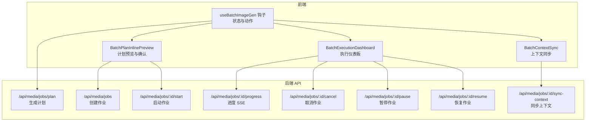
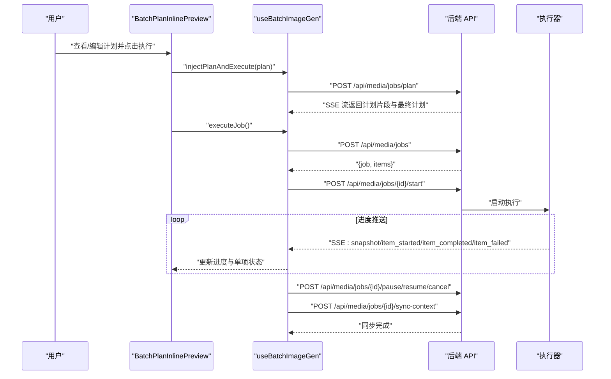
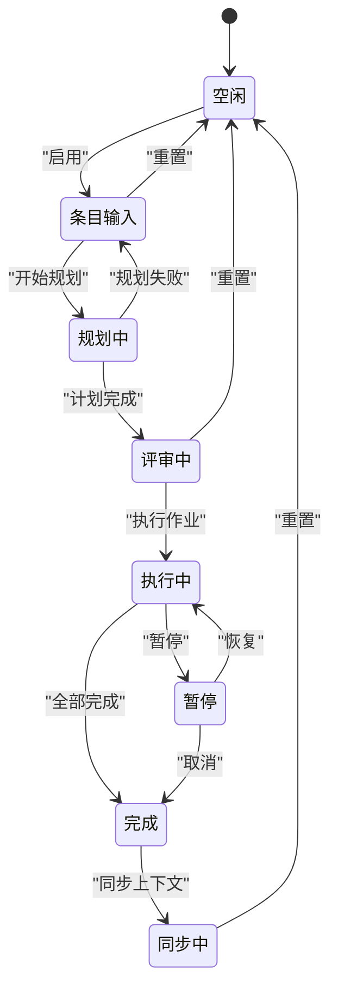
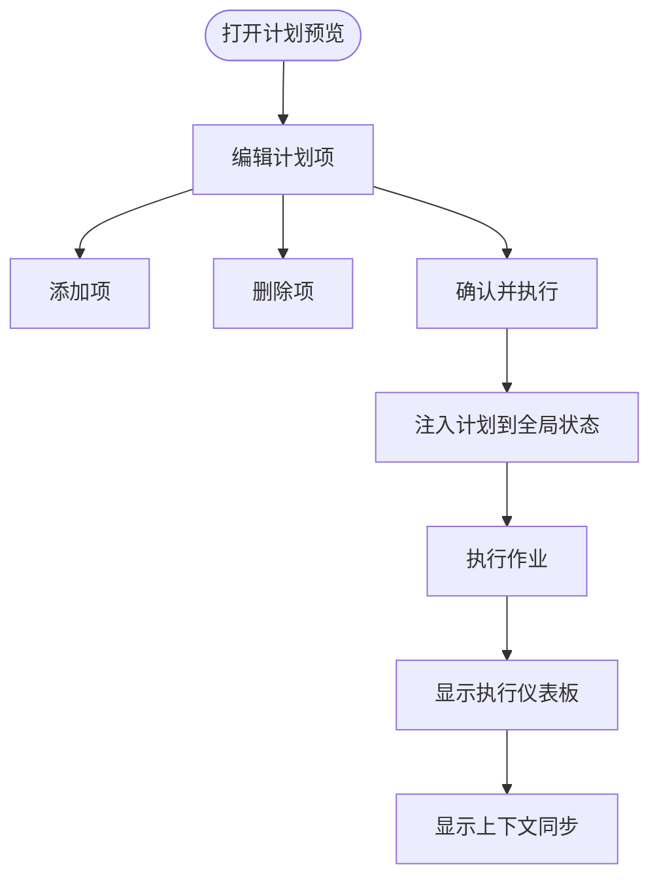
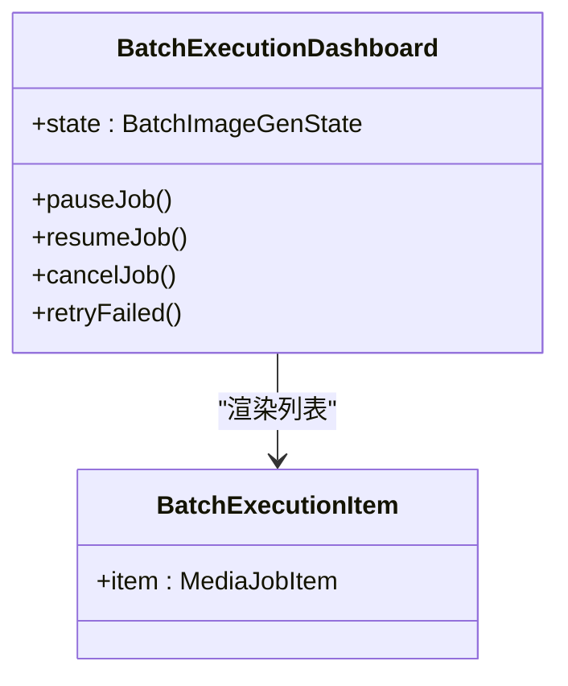
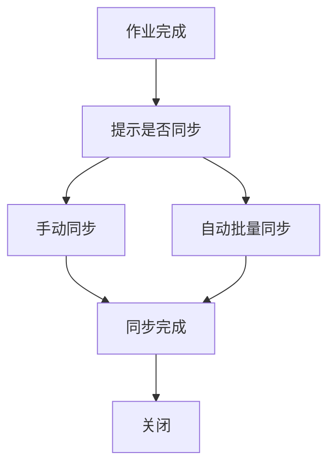
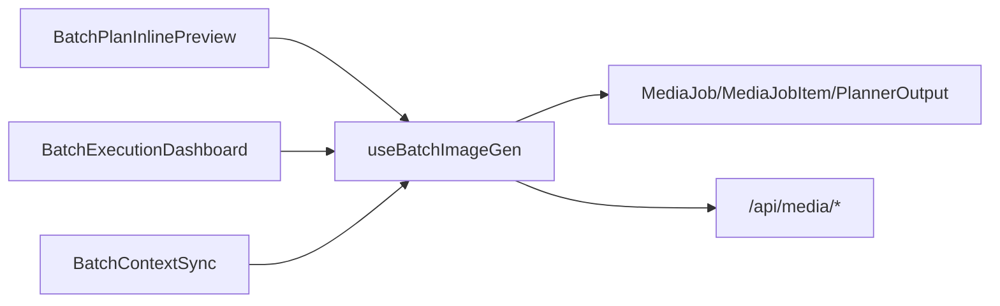

# 批量图像生成

<cite>
**本文引用的文件**
- [useBatchImageGen.ts](file://src/hooks/useBatchImageGen.ts)
- [BatchPlanInlinePreview.tsx](file://src/components/chat/batch-image-gen/BatchPlanInlinePreview.tsx)
- [BatchExecutionDashboard.tsx](file://src/components/chat/batch-image-gen/BatchExecutionDashboard.tsx)
- [BatchContextSync.tsx](file://src/components/chat/batch-image-gen/BatchContextSync.tsx)
- [ChatView.tsx](file://src/app/chat/page.tsx)
- [StreamingMessage.tsx](file://src/components/chat/StreamingMessage.tsx)
- [MediaJob 类型定义](file://src/types/index.ts)
- [媒体作业 API 路由](file://src/app/api/media/jobs/route.ts)
- [媒体作业进度 SSE 路由](file://src/app/api/media/jobs/[id]/progress/route.ts)
- [媒体作业计划 API 路由](file://src/app/api/media/jobs/plan/route.ts)
</cite>

## 目录
1. [简介](#简介)
2. [项目结构](#项目结构)
3. [核心组件](#核心组件)
4. [架构总览](#架构总览)
5. [详细组件分析](#详细组件分析)
6. [依赖关系分析](#依赖关系分析)
7. [性能考量](#性能考量)
8. [故障排查指南](#故障排查指南)
9. [结论](#结论)
10. [附录](#附录)

## 简介
本文件系统性阐述 CodePilot 的批量图像生成功能，覆盖以下方面：
- 批量任务执行器工作原理：任务队列管理、并发控制、进度跟踪机制
- 批量生成界面组件：计划预览、执行仪表板、任务列表管理
- 批量任务生命周期：从创建、排队、执行到完成的完整流程
- 任务调度策略、资源限制、错误恢复机制
- 与聊天界面的集成方式与用户交互流程
- 最佳实践与性能优化建议（并发数量控制、内存管理、网络带宽优化）

## 项目结构
批量图像生成功能主要由三部分构成：
- 前端状态与交互层：React Hook 与 UI 组件
- 后端 API 层：作业创建、计划生成、进度推送
- 类型与数据模型：统一的数据结构定义

图表来源
- [useBatchImageGen.ts:74-485](file://src/hooks/useBatchImageGen.ts#L74-L485)
- [BatchPlanInlinePreview.tsx:19-129](file://src/components/chat/batch-image-gen/BatchPlanInlinePreview.tsx#L19-L129)
- [BatchExecutionDashboard.tsx:9-122](file://src/components/chat/batch-image-gen/BatchExecutionDashboard.tsx#L9-L122)
- [BatchContextSync.tsx:9-82](file://src/components/chat/batch-image-gen/BatchContextSync.tsx#L9-L82)
- [媒体作业计划 API 路由](file://src/app/api/media/jobs/plan/route.ts)
- [媒体作业 API 路由](file://src/app/api/media/jobs/route.ts)
- [媒体作业进度 SSE 路由](file://src/app/api/media/jobs/[id]/progress/route.ts)

章节来源
- [useBatchImageGen.ts:1-486](file://src/hooks/useBatchImageGen.ts#L1-L486)
- [BatchPlanInlinePreview.tsx:1-130](file://src/components/chat/batch-image-gen/BatchPlanInlinePreview.tsx#L1-L130)
- [BatchExecutionDashboard.tsx:1-123](file://src/components/chat/batch-image-gen/BatchExecutionDashboard.tsx#L1-L123)
- [BatchContextSync.tsx:1-83](file://src/components/chat/batch-image-gen/BatchContextSync.tsx#L1-L83)

## 核心组件
- 批量图像生成上下文钩子：负责状态管理、生命周期动作、进度事件订阅与错误处理
- 计划内联预览组件：展示与编辑计划项，触发执行流程
- 执行仪表板组件：显示整体进度、单项状态与控制按钮
- 上下文同步组件：在完成后将结果同步回聊天上下文

章节来源
- [useBatchImageGen.ts:28-57](file://src/hooks/useBatchImageGen.ts#L28-L57)
- [BatchPlanInlinePreview.tsx:19-129](file://src/components/chat/batch-image-gen/BatchPlanInlinePreview.tsx#L19-L129)
- [BatchExecutionDashboard.tsx:9-122](file://src/components/chat/batch-image-gen/BatchExecutionDashboard.tsx#L9-L122)
- [BatchContextSync.tsx:9-82](file://src/components/chat/batch-image-gen/BatchContextSync.tsx#L9-L82)

## 架构总览
批量图像生成采用“前端状态驱动 + 后端流式进度”的架构模式：
- 前端通过 Hook 管理状态机与动作；通过 SSE 实时接收进度事件
- 后端提供 REST 接口用于计划生成、作业创建、启动、暂停/恢复/取消与上下文同步
- 执行器在后端按作业项顺序或并发策略执行，并通过 SSE 推送快照与单项事件

图表来源
- [BatchPlanInlinePreview.tsx:57-64](file://src/components/chat/batch-image-gen/BatchPlanInlinePreview.tsx#L57-L64)
- [useBatchImageGen.ts:203-255](file://src/hooks/useBatchImageGen.ts#L203-L255)
- [useBatchImageGen.ts:257-330](file://src/hooks/useBatchImageGen.ts#L257-L330)
- [useBatchImageGen.ts:346-398](file://src/hooks/useBatchImageGen.ts#L346-L398)
- [useBatchImageGen.ts:419-448](file://src/hooks/useBatchImageGen.ts#L419-L448)

## 详细组件分析

### 前端状态与生命周期（Hook）
- 状态机：包含启用开关、当前阶段、当前作业、计划输出、可编辑计划项、进度统计与错误信息
- 生命周期动作：
  - 规划阶段：调用计划 API，接收流式计划片段，最终进入评审阶段
  - 评审阶段：允许编辑计划项，准备执行
  - 执行阶段：创建作业、启动作业、连接进度 SSE、实时更新进度与单项状态
  - 完成阶段：展示完成统计与重试按钮
  - 同步阶段：将结果同步回聊天上下文
- 进度事件：支持快照、单项开始/完成/失败/重试、作业暂停/取消/完成等事件
- 控制操作：暂停、恢复、取消、重试失败项、同步上下文、重置作业

图表来源
- [useBatchImageGen.ts:10-26](file://src/hooks/useBatchImageGen.ts#L10-L26)
- [useBatchImageGen.ts:74-76](file://src/hooks/useBatchImageGen.ts#L74-L76)
- [useBatchImageGen.ts:94-164](file://src/hooks/useBatchImageGen.ts#L94-L164)
- [useBatchImageGen.ts:203-255](file://src/hooks/useBatchImageGen.ts#L203-L255)
- [useBatchImageGen.ts:257-330](file://src/hooks/useBatchImageGen.ts#L257-L330)
- [useBatchImageGen.ts:419-448](file://src/hooks/useBatchImageGen.ts#L419-L448)

章节来源
- [useBatchImageGen.ts:10-26](file://src/hooks/useBatchImageGen.ts#L10-L26)
- [useBatchImageGen.ts:74-76](file://src/hooks/useBatchImageGen.ts#L74-L76)
- [useBatchImageGen.ts:94-164](file://src/hooks/useBatchImageGen.ts#L94-L164)
- [useBatchImageGen.ts:203-255](file://src/hooks/useBatchImageGen.ts#L203-L255)
- [useBatchImageGen.ts:257-330](file://src/hooks/useBatchImageGen.ts#L257-L330)
- [useBatchImageGen.ts:346-398](file://src/hooks/useBatchImageGen.ts#L346-L398)
- [useBatchImageGen.ts:419-448](file://src/hooks/useBatchImageGen.ts#L419-L448)

### 计划内联预览组件
- 功能：渲染计划摘要与计划项列表，支持增删改计划项，一键执行
- 交互：执行时注入本地编辑后的计划，再调用执行流程
- 渲染：当处于执行中/完成/同步阶段时，切换为执行仪表板与上下文同步组件

图表来源
- [BatchPlanInlinePreview.tsx:35-64](file://src/components/chat/batch-image-gen/BatchPlanInlinePreview.tsx#L35-L64)
- [BatchPlanInlinePreview.tsx:67-74](file://src/components/chat/batch-image-gen/BatchPlanInlinePreview.tsx#L67-L74)

章节来源
- [BatchPlanInlinePreview.tsx:19-129](file://src/components/chat/batch-image-gen/BatchPlanInlinePreview.tsx#L19-L129)

### 执行仪表板组件
- 功能：展示总体进度百分比、已完成/失败计数、单项列表与控制按钮
- 控制：运行中可暂停/取消；暂停可恢复；完成后可重试失败项
- 错误提示：在状态中展示错误信息

图表来源
- [BatchExecutionDashboard.tsx:9-122](file://src/components/chat/batch-image-gen/BatchExecutionDashboard.tsx#L9-L122)

章节来源
- [BatchExecutionDashboard.tsx:9-122](file://src/components/chat/batch-image-gen/BatchExecutionDashboard.tsx#L9-L122)

### 上下文同步组件
- 功能：在作业完成后提供手动/自动同步按钮，将生成结果写入聊天上下文
- 状态：同步中、已同步、关闭

图表来源
- [BatchContextSync.tsx:16-19](file://src/components/chat/batch-image-gen/BatchContextSync.tsx#L16-L19)
- [BatchContextSync.tsx:39-74](file://src/components/chat/batch-image-gen/BatchContextSync.tsx#L39-L74)

章节来源
- [BatchContextSync.tsx:9-82](file://src/components/chat/batch-image-gen/BatchContextSync.tsx#L9-L82)

### 与聊天界面的集成
- ChatView 引入批量执行相关组件
- StreamingMessage 支持解析结构化块（如批量计划），并在渲染时插入计划预览组件
- 用户可在消息流中看到计划预览卡片，并直接执行

章节来源
- [ChatView.tsx:30-30](file://src/app/chat/page.tsx#L30-L30)
- [StreamingMessage.tsx:119-123](file://src/components/chat/StreamingMessage.tsx#L119-L123)

## 依赖关系分析
- 组件依赖：预览组件依赖 Hook；仪表板与同步组件均依赖 Hook
- Hook 依赖：HTTP 请求与 SSE 事件源；类型定义来自统一类型模块
- 后端依赖：REST API 与 SSE 端点；执行器负责实际任务执行

图表来源
- [BatchPlanInlinePreview.tsx:19-21](file://src/components/chat/batch-image-gen/BatchPlanInlinePreview.tsx#L19-L21)
- [BatchExecutionDashboard.tsx:9-11](file://src/components/chat/batch-image-gen/BatchExecutionDashboard.tsx#L9-L11)
- [BatchContextSync.tsx:9-11](file://src/components/chat/batch-image-gen/BatchContextSync.tsx#L9-L11)
- [useBatchImageGen.ts:3-4](file://src/hooks/useBatchImageGen.ts#L3-L4)
- [MediaJob 类型定义](file://src/types/index.ts)

章节来源
- [BatchPlanInlinePreview.tsx:19-21](file://src/components/chat/batch-image-gen/BatchPlanInlinePreview.tsx#L19-L21)
- [BatchExecutionDashboard.tsx:9-11](file://src/components/chat/batch-image-gen/BatchExecutionDashboard.tsx#L9-L11)
- [BatchContextSync.tsx:9-11](file://src/components/chat/batch-image-gen/BatchContextSync.tsx#L9-L11)
- [useBatchImageGen.ts:3-4](file://src/hooks/useBatchImageGen.ts#L3-L4)

## 性能考量
- 并发控制
  - 建议在后端执行器中实现基于作业项的并发上限，避免同时过多请求导致资源争用
  - 前端根据网络状况与设备性能动态调整刷新频率（当前实现为 SSE 快照与单项事件）
- 内存管理
  - 分页加载作业项列表，避免一次性渲染大量 DOM
  - 在完成阶段及时清理 SSE 连接与定时器
- 网络带宽优化
  - SSE 事件按需推送，减少冗余数据
  - 对于大图生成，建议在后端进行压缩或分片传输（视具体实现而定）
- 用户体验
  - 提供暂停/恢复能力，便于用户在高峰期降低负载
  - 失败项单独标记并支持重试，提升容错性

## 故障排查指南
- 规划阶段失败
  - 检查计划 API 返回的错误信息，确认输入参数（风格提示、文档路径/内容、数量、会话 ID）
- 执行阶段异常
  - 查看进度事件中的失败项详情，确认后端日志与执行器状态
  - 若 SSE 断开，检查网络与服务端配置
- 取消/暂停/恢复
  - 确认对应 API 返回状态码与响应体
  - 恢复后重新连接进度事件源
- 同步上下文失败
  - 检查同步接口返回的错误信息，确认目标聊天上下文可用性

章节来源
- [useBatchImageGen.ts:147-153](file://src/hooks/useBatchImageGen.ts#L147-L153)
- [useBatchImageGen.ts:248-254](file://src/hooks/useBatchImageGen.ts#L248-L254)
- [useBatchImageGen.ts:346-398](file://src/hooks/useBatchImageGen.ts#L346-L398)
- [useBatchImageGen.ts:419-448](file://src/hooks/useBatchImageGen.ts#L419-L448)

## 结论
批量图像生成功能通过前端状态机与后端流式进度实现了清晰的生命周期管理与良好的用户体验。建议在后端执行器中完善并发控制与资源限制策略，并持续优化错误恢复与重试机制，以进一步提升稳定性与吞吐量。

## 附录

### 数据模型与类型
- 作业与作业项：包含标识、状态、进度统计、失败原因等
- 计划输出：包含计划项数组与摘要信息

章节来源
- [MediaJob 类型定义](file://src/types/index.ts)

### API 一览
- 计划生成：POST /api/media/jobs/plan
- 作业创建：POST /api/media/jobs
- 启动作业：POST /api/media/jobs/{id}/start
- 进度订阅：GET /api/media/jobs/{id}/progress（SSE）
- 暂停作业：POST /api/media/jobs/{id}/pause
- 恢复作业：POST /api/media/jobs/{id}/resume
- 取消作业：POST /api/media/jobs/{id}/cancel
- 同步上下文：POST /api/media/jobs/{id}/sync-context

章节来源
- [媒体作业计划 API 路由](file://src/app/api/media/jobs/plan/route.ts)
- [媒体作业 API 路由](file://src/app/api/media/jobs/route.ts)
- [媒体作业进度 SSE 路由](file://src/app/api/media/jobs/[id]/progress/route.ts)