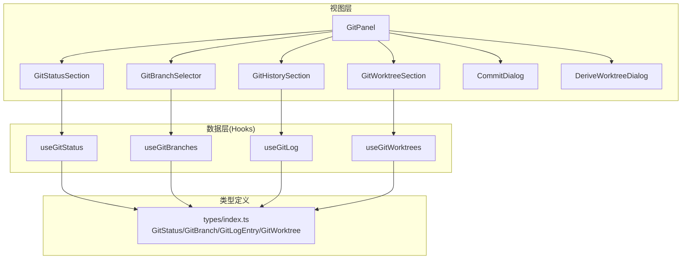
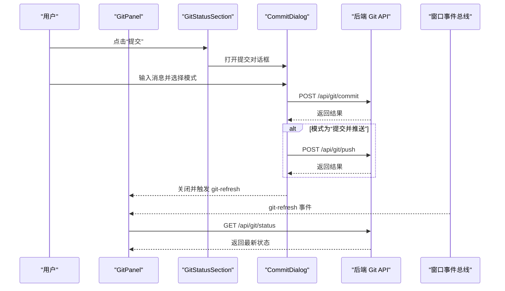
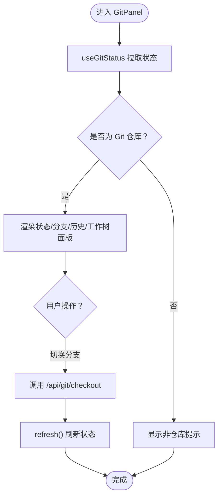
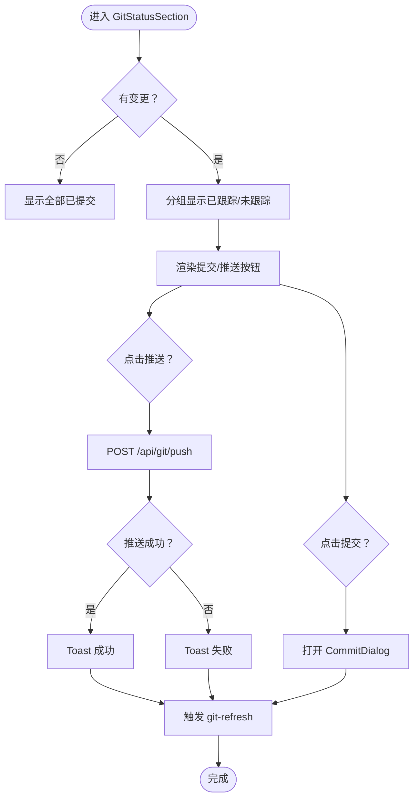
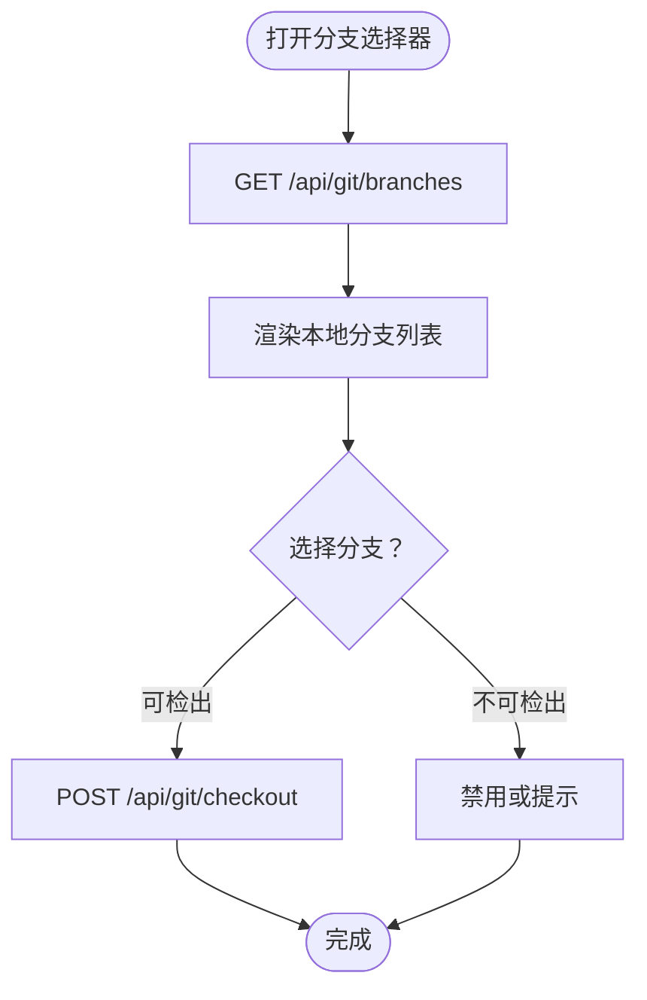
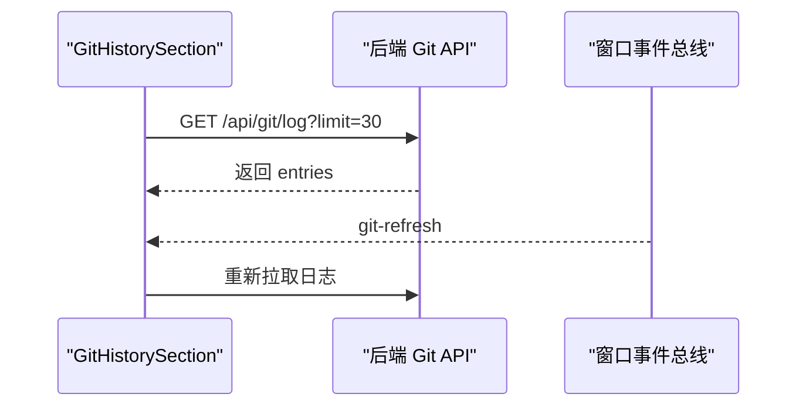
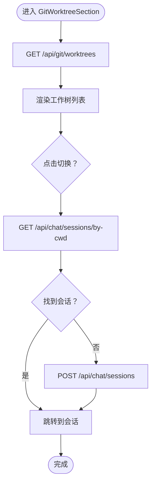
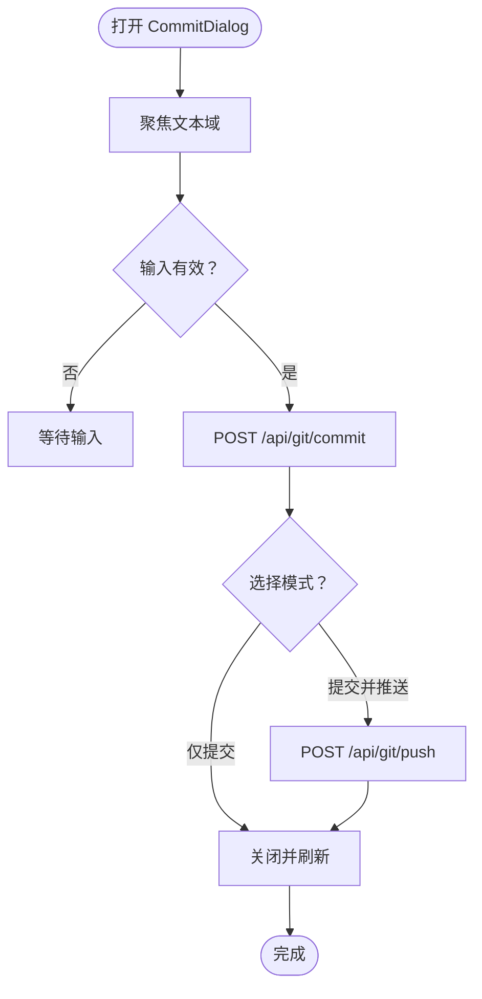
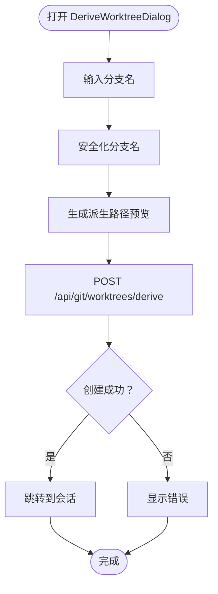
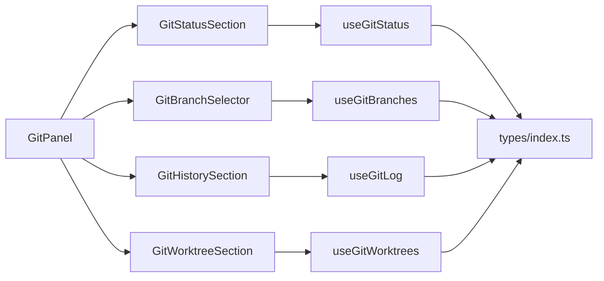

# Git 集成

<cite>
**本文引用的文件**
- [src/components/git/GitPanel.tsx](file://src/components/git/GitPanel.tsx)
- [src/components/git/GitStatusSection.tsx](file://src/components/git/GitStatusSection.tsx)
- [src/components/git/GitBranchSelector.tsx](file://src/components/git/GitBranchSelector.tsx)
- [src/components/git/GitHistorySection.tsx](file://src/components/git/GitHistorySection.tsx)
- [src/components/git/GitWorktreeSection.tsx](file://src/components/git/GitWorktreeSection.tsx)
- [src/components/git/CommitDialog.tsx](file://src/components/git/CommitDialog.tsx)
- [src/components/git/DeriveWorktreeDialog.tsx](file://src/components/git/DeriveWorktreeDialog.tsx)
- [src/hooks/useGitStatus.ts](file://src/hooks/useGitStatus.ts)
- [src/hooks/useGitBranches.ts](file://src/hooks/useGitBranches.ts)
- [src/hooks/useGitLog.ts](file://src/hooks/useGitLog.ts)
- [src/hooks/useGitWorktrees.ts](file://src/hooks/useGitWorktrees.ts)
- [src/types/index.ts](file://src/types/index.ts)
</cite>

## 目录
1. [简介](#简介)
2. [项目结构](#项目结构)
3. [核心组件](#核心组件)
4. [架构总览](#架构总览)
5. [详细组件分析](#详细组件分析)
6. [依赖关系分析](#依赖关系分析)
7. [性能考量](#性能考量)
8. [故障排查指南](#故障排查指南)
9. [结论](#结论)
10. [附录](#附录)

## 简介
本文件系统性阐述 CodePilot 的 Git 集成方案，覆盖 Git 面板的架构设计、状态管理、分支操作、提交流程、工作树管理、历史记录查看、合并冲突处理建议、Git 钩子与自动保存机制、以及与 AI 助手的协作模式。文档同时提供配置最佳实践与常见问题解决方案，帮助开发者与用户高效使用 Git 面板功能。

## 项目结构
Git 面板采用“组件 + Hooks + 类型定义”的分层组织方式：
- 视图层：GitPanel 及其子面板（状态、分支、历史、工作树）
- 交互层：CommitDialog、DeriveWorktreeDialog 等对话框
- 数据层：useGitStatus、useGitBranches、useGitLog、useGitWorktrees 等自定义 Hook
- 类型层：GitStatus、GitBranch、GitLogEntry、GitWorktree 等类型定义

图表来源
- [src/components/git/GitPanel.tsx:15-120](file://src/components/git/GitPanel.tsx#L15-L120)
- [src/components/git/GitStatusSection.tsx:16-162](file://src/components/git/GitStatusSection.tsx#L16-L162)
- [src/components/git/GitBranchSelector.tsx:17-107](file://src/components/git/GitBranchSelector.tsx#L17-L107)
- [src/components/git/GitHistorySection.tsx:12-71](file://src/components/git/GitHistorySection.tsx#L12-L71)
- [src/components/git/GitWorktreeSection.tsx:15-129](file://src/components/git/GitWorktreeSection.tsx#L15-L129)
- [src/components/git/CommitDialog.tsx:17-178](file://src/components/git/CommitDialog.tsx#L17-L178)
- [src/components/git/DeriveWorktreeDialog.tsx:17-103](file://src/components/git/DeriveWorktreeDialog.tsx#L17-L103)
- [src/hooks/useGitStatus.ts:8-62](file://src/hooks/useGitStatus.ts#L8-L62)
- [src/hooks/useGitBranches.ts:6-31](file://src/hooks/useGitBranches.ts#L6-L31)
- [src/hooks/useGitLog.ts:6-31](file://src/hooks/useGitLog.ts#L6-L31)
- [src/hooks/useGitWorktrees.ts:6-31](file://src/hooks/useGitWorktrees.ts#L6-L31)
- [src/types/index.ts](file://src/types/index.ts)

章节来源
- [src/components/git/GitPanel.tsx:15-120](file://src/components/git/GitPanel.tsx#L15-L120)
- [src/hooks/useGitStatus.ts:8-62](file://src/hooks/useGitStatus.ts#L8-L62)
- [src/hooks/useGitBranches.ts:6-31](file://src/hooks/useGitBranches.ts#L6-L31)
- [src/hooks/useGitLog.ts:6-31](file://src/hooks/useGitLog.ts#L6-L31)
- [src/hooks/useGitWorktrees.ts:6-31](file://src/hooks/useGitWorktrees.ts#L6-L31)
- [src/types/index.ts](file://src/types/index.ts)

## 核心组件
- GitPanel：Git 面板入口，聚合状态、分支、历史、工作树等子面板，并统一处理对话框与刷新事件。
- GitStatusSection：展示当前分支、上游状态、变更文件列表，并提供提交与推送入口。
- GitBranchSelector：列出本地分支，支持检出；对脏工作区与占用工作树进行交互约束。
- GitHistorySection：展示最近提交历史，支持点击查看提交详情。
- GitWorktreeSection：展示所有工作树，支持切换到指定工作树或派生新工作树。
- CommitDialog：统一的提交对话框，支持“仅提交”或“提交并推送”，内置输入校验与错误提示。
- DeriveWorktreeDialog：派生新工作树，提供路径预览与会话关联。

章节来源
- [src/components/git/GitPanel.tsx:15-120](file://src/components/git/GitPanel.tsx#L15-L120)
- [src/components/git/GitStatusSection.tsx:16-162](file://src/components/git/GitStatusSection.tsx#L16-L162)
- [src/components/git/GitBranchSelector.tsx:17-107](file://src/components/git/GitBranchSelector.tsx#L17-L107)
- [src/components/git/GitHistorySection.tsx:12-71](file://src/components/git/GitHistorySection.tsx#L12-L71)
- [src/components/git/GitWorktreeSection.tsx:15-129](file://src/components/git/GitWorktreeSection.tsx#L15-L129)
- [src/components/git/CommitDialog.tsx:17-178](file://src/components/git/CommitDialog.tsx#L17-L178)
- [src/components/git/DeriveWorktreeDialog.tsx:17-103](file://src/components/git/DeriveWorktreeDialog.tsx#L17-L103)

## 架构总览
Git 面板通过自定义 Hooks 实现状态拉取与轮询，组件通过事件总线触发刷新，确保 UI 与后端 Git 状态保持一致。对话框组件负责关键操作（提交、推送、派生工作树）并与会话系统联动。

图表来源
- [src/components/git/GitStatusSection.tsx:45-47](file://src/components/git/GitStatusSection.tsx#L45-L47)
- [src/components/git/CommitDialog.tsx:48-86](file://src/components/git/CommitDialog.tsx#L48-L86)
- [src/hooks/useGitStatus.ts:34-60](file://src/hooks/useGitStatus.ts#L34-L60)

## 详细组件分析

### GitPanel 分析
- 职责：聚合子面板、维护折叠状态、处理对话框、调用后端 checkout。
- 关键点：
  - 使用 useGitStatus 获取仓库状态并定时轮询。
  - 通过自定义事件“git-refresh”驱动历史与状态的刷新。
  - 提供 checkout 接口，失败时抛出错误并阻止 UI 更新。

图表来源
- [src/components/git/GitPanel.tsx:15-120](file://src/components/git/GitPanel.tsx#L15-L120)
- [src/hooks/useGitStatus.ts:34-60](file://src/hooks/useGitStatus.ts#L34-L60)

章节来源
- [src/components/git/GitPanel.tsx:15-120](file://src/components/git/GitPanel.tsx#L15-L120)
- [src/hooks/useGitStatus.ts:8-62](file://src/hooks/useGitStatus.ts#L8-L62)

### GitStatusSection 分析
- 职责：展示分支、上游、ahead/beind、变更文件列表；提供提交与推送按钮。
- 关键点：
  - 提交成功后通过自定义事件“git-refresh”通知全局刷新。
  - 推送失败通过 Toast 提示，避免阻断用户流程。
  - 变更文件按“已跟踪/未跟踪”分组展示，支持快速定位。

图表来源
- [src/components/git/GitStatusSection.tsx:16-162](file://src/components/git/GitStatusSection.tsx#L16-L162)

章节来源
- [src/components/git/GitStatusSection.tsx:16-162](file://src/components/git/GitStatusSection.tsx#L16-L162)

### GitBranchSelector 分析
- 职责：列出本地分支，支持检出；对脏工作区与占用工作树进行交互约束。
- 关键点：
  - 仅在面板展开时拉取分支列表，减少不必要的请求。
  - 对不可检出的分支（当前分支、被占用）禁用按钮并给出提示。
  - 检出过程设置“正在检出”状态，防止重复点击。

图表来源
- [src/components/git/GitBranchSelector.tsx:17-107](file://src/components/git/GitBranchSelector.tsx#L17-L107)

章节来源
- [src/components/git/GitBranchSelector.tsx:17-107](file://src/components/git/GitBranchSelector.tsx#L17-L107)

### GitHistorySection 分析
- 职责：展示最近提交历史，支持点击查看提交详情。
- 关键点：
  - 默认拉取最近 30 条记录，避免一次性加载过多。
  - 监听“git-refresh”事件以保持与提交/检出等操作同步。

图表来源
- [src/components/git/GitHistorySection.tsx:12-71](file://src/components/git/GitHistorySection.tsx#L12-L71)

章节来源
- [src/components/git/GitHistorySection.tsx:12-71](file://src/components/git/GitHistorySection.tsx#L12-L71)

### GitWorktreeSection 分析
- 职责：展示所有工作树，支持切换到指定工作树或派生新工作树。
- 关键点：
  - 当前工作树高亮显示并标记“当前”。
  - 支持脏工作树标记；非当前工作树提供“切换”按钮。
  - 切换时优先查找已有会话，否则创建新会话并跳转。

图表来源
- [src/components/git/GitWorktreeSection.tsx:15-129](file://src/components/git/GitWorktreeSection.tsx#L15-L129)

章节来源
- [src/components/git/GitWorktreeSection.tsx:15-129](file://src/components/git/GitWorktreeSection.tsx#L15-L129)

### CommitDialog 分析
- 职责：统一的提交对话框，支持“仅提交”或“提交并推送”。
- 关键点：
  - 自动聚焦文本域，支持 Ctrl/Cmd+回车快速提交。
  - 提交成功后关闭对话框并触发“git-refresh”。

图表来源
- [src/components/git/CommitDialog.tsx:17-178](file://src/components/git/CommitDialog.tsx#L17-L178)

章节来源
- [src/components/git/CommitDialog.tsx:17-178](file://src/components/git/CommitDialog.tsx#L17-L178)

### DeriveWorktreeDialog 分析
- 职责：派生新工作树，提供分支名输入与路径预览。
- 关键点：
  - 对分支名进行安全化处理，生成可预测的派生路径。
  - 创建成功后尝试跳转到对应会话，否则关闭对话框。

图表来源
- [src/components/git/DeriveWorktreeDialog.tsx:17-103](file://src/components/git/DeriveWorktreeDialog.tsx#L17-L103)

章节来源
- [src/components/git/DeriveWorktreeDialog.tsx:17-103](file://src/components/git/DeriveWorktreeDialog.tsx#L17-L103)

## 依赖关系分析
- 组件耦合：
  - GitPanel 作为协调者，依赖多个子面板与对话框。
  - 子面板通过 Hooks 与后端 API 通信，避免直接耦合具体实现。
- 数据流：
  - Hooks 负责拉取与缓存数据，组件通过事件总线触发刷新。
  - 类型定义集中于 types/index.ts，保证前后端契约一致。
- 外部依赖：
  - 与后端 Git API 的约定接口（/api/git/*）。
  - 与会话系统的集成（/api/chat/sessions*）。

图表来源
- [src/components/git/GitPanel.tsx:15-120](file://src/components/git/GitPanel.tsx#L15-L120)
- [src/hooks/useGitStatus.ts:8-62](file://src/hooks/useGitStatus.ts#L8-L62)
- [src/hooks/useGitBranches.ts:6-31](file://src/hooks/useGitBranches.ts#L6-L31)
- [src/hooks/useGitLog.ts:6-31](file://src/hooks/useGitLog.ts#L6-L31)
- [src/hooks/useGitWorktrees.ts:6-31](file://src/hooks/useGitWorktrees.ts#L6-L31)
- [src/types/index.ts](file://src/types/index.ts)

章节来源
- [src/components/git/GitPanel.tsx:15-120](file://src/components/git/GitPanel.tsx#L15-L120)
- [src/hooks/useGitStatus.ts:8-62](file://src/hooks/useGitStatus.ts#L8-L62)
- [src/hooks/useGitBranches.ts:6-31](file://src/hooks/useGitBranches.ts#L6-L31)
- [src/hooks/useGitLog.ts:6-31](file://src/hooks/useGitLog.ts#L6-L31)
- [src/hooks/useGitWorktrees.ts:6-31](file://src/hooks/useGitWorktrees.ts#L6-L31)
- [src/types/index.ts](file://src/types/index.ts)

## 性能考量
- 轮询策略：useGitStatus 采用 10 秒轮询间隔，兼顾实时性与资源消耗。
- 懒加载：分支选择器仅在展开时拉取分支列表，降低网络与渲染压力。
- 事件驱动刷新：通过“git-refresh”事件统一刷新，避免多处重复轮询。
- 历史记录限制：默认只拉取最近 30 条提交，避免大仓库下的长列表渲染。

章节来源
- [src/hooks/useGitStatus.ts:6-62](file://src/hooks/useGitStatus.ts#L6-L62)
- [src/components/git/GitBranchSelector.tsx:24-32](file://src/components/git/GitBranchSelector.tsx#L24-L32)
- [src/components/git/GitHistorySection.tsx:17-33](file://src/components/git/GitHistorySection.tsx#L17-L33)

## 故障排查指南
- 提交失败
  - 现象：提交对话框报错或无响应。
  - 排查：检查网络连通性、确认工作目录有效、查看后端返回的错误信息。
  - 处理：修正错误后重试，必要时手动执行 git 命令恢复。
- 推送失败
  - 现象：推送按钮禁用或提示失败。
  - 排查：检查远程连接、认证配置、上游分支设置。
  - 处理：修复配置后重试，或先 fetch 再 push。
- 检出失败
  - 现象：分支选择器报错或无法切换。
  - 排查：确认工作区是否脏、目标分支是否被占用。
  - 处理：暂存/提交变更或清理占用后再检出。
- 工作树切换异常
  - 现象：点击切换无反应或跳转到错误会话。
  - 排查：确认会话服务可用、工作树路径正确。
  - 处理：手动创建会话并跳转，或检查会话存储。
- 合并冲突处理建议
  - 建议：在冲突状态下，优先通过 Git 面板查看变更与历史，再在编辑器中解决冲突文件；解决后提交并推送。
  - 注意：若冲突涉及 AI 协作内容，建议先备份相关上下文，再进行合并。

章节来源
- [src/components/git/CommitDialog.tsx:81-85](file://src/components/git/CommitDialog.tsx#L81-L85)
- [src/components/git/GitStatusSection.tsx:32-42](file://src/components/git/GitStatusSection.tsx#L32-L42)
- [src/components/git/GitBranchSelector.tsx:36-47](file://src/components/git/GitBranchSelector.tsx#L36-L47)
- [src/components/git/GitWorktreeSection.tsx:42-65](file://src/components/git/GitWorktreeSection.tsx#L42-L65)

## 结论
CodePilot 的 Git 集成以组件化与事件驱动为核心，结合 Hooks 实现状态拉取与轮询，提供从状态查看、分支切换、提交推送、工作树管理到历史浏览的完整体验。通过统一的错误提示与刷新机制，保证了在复杂场景下的稳定性与一致性。建议在团队协作中配合标准化的分支策略与提交规范，进一步提升开发效率与质量。

## 附录
- Git 配置最佳实践
  - 分支命名：采用清晰语义的短横线分隔命名，便于派生工作树与检索。
  - 提交信息：遵循“类型: 概述”格式，配合历史面板快速定位问题。
  - 工作树策略：为特性开发与实验性修改使用独立工作树，降低主分支风险。
  - 推送策略：养成“先 fetch 再 push”的习惯，减少冲突概率。
- 与 AI 助手协作模式
  - 在 AI 辅助下编写高质量提交信息与变更摘要，提升历史可读性。
  - 将 AI 生成的代码片段纳入工作树进行验证与迭代，完成后合并到主分支。
  - 发生冲突时，利用 AI 协助理解差异与重构思路，再进行人工确认与提交。