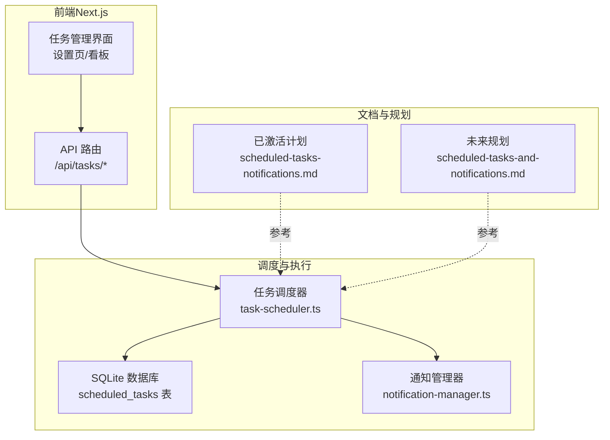
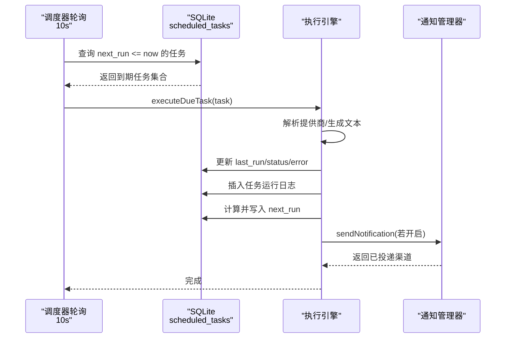
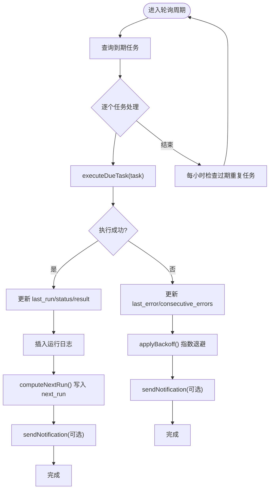
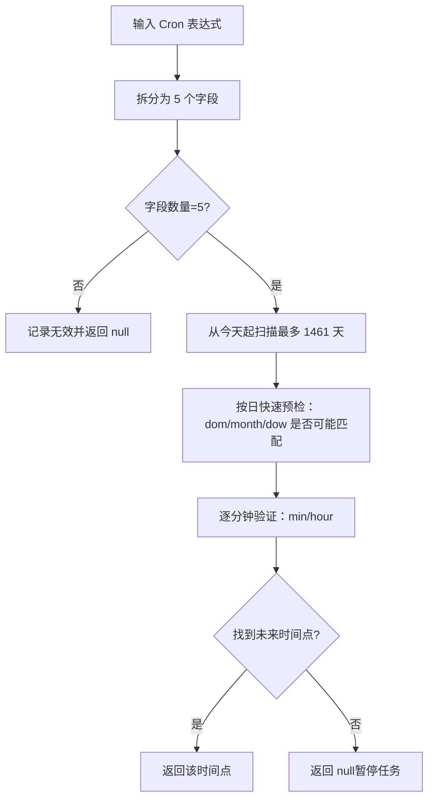
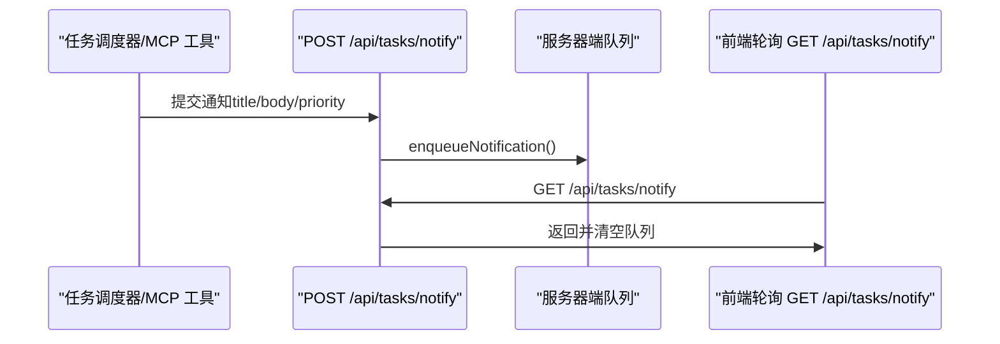
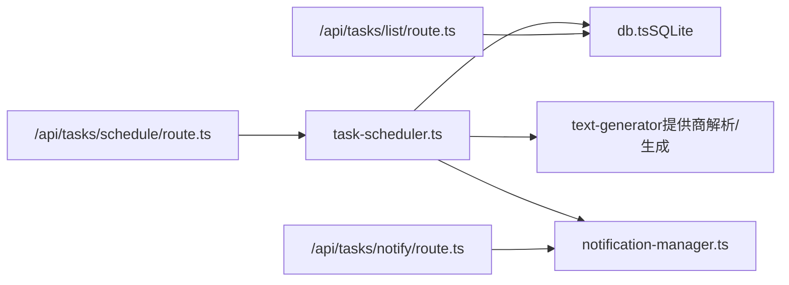
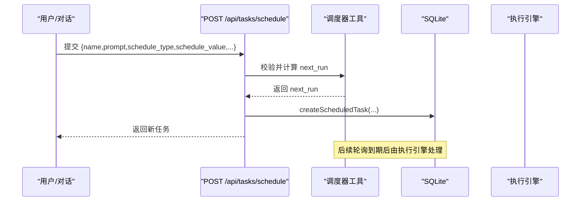

# 任务调度

<cite>
**本文引用的文件**
- [src/lib/task-scheduler.ts](file://src/lib/task-scheduler.ts)
- [src/__tests__/unit/task-scheduler.test.ts](file://src/__tests__/unit/task-scheduler.test.ts)
- [docs/exec-plans/active/scheduled-tasks-notifications.md](file://docs/exec-plans/active/scheduled-tasks-notifications.md)
- [docs/future/scheduled-tasks-and-notifications.md](file://docs/future/scheduled-tasks-and-notifications.md)
- [src/app/api/tasks/schedule/route.ts](file://src/app/api/tasks/schedule/route.ts)
- [src/app/api/tasks/list/route.ts](file://src/app/api/tasks/list/route.ts)
- [src/app/api/tasks/notify/route.ts](file://src/app/api/tasks/notify/route.ts)
- [src/lib/notification-manager.ts](file://src/lib/notification-manager.ts)
- [src/app/api/tasks/route.ts](file://src/app/api/tasks/route.ts)
</cite>

## 目录
1. [简介](#简介)
2. [项目结构](#项目结构)
3. [核心组件](#核心组件)
4. [架构总览](#架构总览)
5. [详细组件分析](#详细组件分析)
6. [依赖分析](#依赖分析)
7. [性能考虑](#性能考虑)
8. [故障排除指南](#故障排除指南)
9. [结论](#结论)
10. [附录](#附录)

## 简介
本文件面向 CodePilot 的任务调度系统，系统性阐述任务计划程序的实现原理、Cron 表达式解析、任务优先级管理，以及定时任务、重复任务、一次性任务的创建与管理。文档还覆盖任务执行监控、状态跟踪、通知机制，并提供配置选项、性能优化与故障排除指南。目标读者既包括需要快速上手的使用者，也包括希望深入理解实现细节的开发者。

## 项目结构
围绕任务调度的核心代码主要分布在以下位置：
- 调度器与解析逻辑：src/lib/task-scheduler.ts
- 通知管理与队列：src/lib/notification-manager.ts
- API 路由（创建、查询、通知）：src/app/api/tasks/*
- 文档规划（已激活与未来规划）：docs/exec-plans/active/scheduled-tasks-notifications.md、docs/future/scheduled-tasks-and-notifications.md
- 单元测试：src/__tests__/unit/task-scheduler.test.ts

**图表来源**
- [src/lib/task-scheduler.ts:1-526](file://src/lib/task-scheduler.ts#L1-L526)
- [src/lib/notification-manager.ts:1-93](file://src/lib/notification-manager.ts#L1-L93)
- [src/app/api/tasks/schedule/route.ts:1-52](file://src/app/api/tasks/schedule/route.ts#L1-L52)
- [docs/exec-plans/active/scheduled-tasks-notifications.md:1-446](file://docs/exec-plans/active/scheduled-tasks-notifications.md#L1-L446)
- [docs/future/scheduled-tasks-and-notifications.md:1-278](file://docs/future/scheduled-tasks-and-notifications.md#L1-L278)

**章节来源**
- [src/lib/task-scheduler.ts:1-526](file://src/lib/task-scheduler.ts#L1-L526)
- [src/lib/notification-manager.ts:1-93](file://src/lib/notification-manager.ts#L1-L93)
- [src/app/api/tasks/schedule/route.ts:1-52](file://src/app/api/tasks/schedule/route.ts#L1-L52)
- [docs/exec-plans/active/scheduled-tasks-notifications.md:1-446](file://docs/exec-plans/active/scheduled-tasks-notifications.md#L1-L446)
- [docs/future/scheduled-tasks-and-notifications.md:1-278](file://docs/future/scheduled-tasks-and-notifications.md#L1-L278)

## 核心组件
- 任务调度器：负责轮询 SQLite 中到期的任务，执行并推进下一次运行时间；支持一次性、固定间隔与 Cron 三种调度类型；具备指数退避、自动禁用、会话内任务等特性。
- Cron 解析器：解析五字段 Cron 表达式，扫描最多 4 年内的有效时间点，支持步进、范围、枚举等语法。
- 间隔解析器：解析“秒/分/小时/天”单位的间隔字符串，返回毫秒值。
- 通知管理器：统一多通道通知（应用内 Toast、Electron 系统通知、Telegram），并通过后端队列供前端轮询展示。
- API 路由：提供创建任务、列出任务、立即执行、暂停/恢复、取消、发送通知等接口。

**章节来源**
- [src/lib/task-scheduler.ts:1-526](file://src/lib/task-scheduler.ts#L1-L526)
- [src/lib/notification-manager.ts:1-93](file://src/lib/notification-manager.ts#L1-L93)
- [src/app/api/tasks/schedule/route.ts:1-52](file://src/app/api/tasks/schedule/route.ts#L1-L52)
- [src/app/api/tasks/list/route.ts:1-13](file://src/app/api/tasks/list/route.ts#L1-L13)
- [src/app/api/tasks/notify/route.ts:1-39](file://src/app/api/tasks/notify/route.ts#L1-L39)

## 架构总览
调度器在 Next.js 服务端以 10 秒轮询的方式运行，从 SQLite 读取到期任务并执行。执行过程采用轻量文本生成，避免重型 UI 流水线。成功与失败均记录运行日志，并根据优先级进行通知。会话内任务（内存态）与持久化任务共享同一调度循环，但仅内存任务不写回 SQLite。

**图表来源**
- [src/lib/task-scheduler.ts:57-131](file://src/lib/task-scheduler.ts#L57-L131)
- [src/lib/task-scheduler.ts:145-293](file://src/lib/task-scheduler.ts#L145-L293)
- [src/lib/notification-manager.ts:61-85](file://src/lib/notification-manager.ts#L61-L85)

**章节来源**
- [src/lib/task-scheduler.ts:57-131](file://src/lib/task-scheduler.ts#L57-L131)
- [src/lib/task-scheduler.ts:145-293](file://src/lib/task-scheduler.ts#L145-L293)
- [src/lib/notification-manager.ts:61-85](file://src/lib/notification-manager.ts#L61-L85)

## 详细组件分析

### 任务调度器（task-scheduler.ts）
- 轮询与生命周期
  - 使用全局标志确保调度器只启动一次；首次启动执行“错过任务恢复”，随后每 10 秒轮询一次。
  - 小时级检查过期的重复任务（7 天上限），超过期限自动禁用并通知。
- 任务执行
  - 成功：更新状态为 success，记录结果与耗时，计算并写入 next_run。
  - 失败：更新 last_error、consecutive_errors，应用指数退避并写入 next_run；必要时自动禁用。
  - 通知：若开启“完成后通知”，按优先级发送通知；成功与失败分别使用不同标题前缀。
  - 结果落盘：将执行结果作为 assistant 消息插入指定会话（或工作区最新会话）。
- 会话内任务
  - 保存在内存 Map 中，不写 SQLite；失败时同样应用指数退避与自动禁用；到期时在内存推进 next_run。
- Cron 解析与推进
  - 解析表达式，扫描最多 4 年内的有效时间点；若无匹配则暂停任务。
  - 重复任务推进时加入“确定性抖动”，避免大量同频任务同时触发。
- 间隔解析
  - 支持“s/m/h/d”单位，非法输入回退为默认 10 分钟。

**图表来源**
- [src/lib/task-scheduler.ts:57-131](file://src/lib/task-scheduler.ts#L57-L131)
- [src/lib/task-scheduler.ts:145-293](file://src/lib/task-scheduler.ts#L145-L293)
- [src/lib/task-scheduler.ts:308-341](file://src/lib/task-scheduler.ts#L308-L341)
- [src/lib/task-scheduler.ts:346-357](file://src/lib/task-scheduler.ts#L346-L357)

**章节来源**
- [src/lib/task-scheduler.ts:43-131](file://src/lib/task-scheduler.ts#L43-L131)
- [src/lib/task-scheduler.ts:145-293](file://src/lib/task-scheduler.ts#L145-L293)
- [src/lib/task-scheduler.ts:308-341](file://src/lib/task-scheduler.ts#L308-L341)
- [src/lib/task-scheduler.ts:346-357](file://src/lib/task-scheduler.ts#L346-L357)

### Cron 表达式解析（getNextCronTime）
- 输入：标准五字段 Cron 表达式（分钟、小时、日、月、周）。
- 算法：以当前时间为起点，最多向后扫描 1461 天（约 4 年），逐日逐分钟验证是否匹配；支持步进（*/n）、范围（a-b）、枚举（a,b,c）等语法。
- 输出：首个大于当前时间的有效时间点；若无匹配返回 null（调度器会暂停该任务）。

**图表来源**
- [src/lib/task-scheduler.ts:456-498](file://src/lib/task-scheduler.ts#L456-L498)
- [src/lib/task-scheduler.ts:500-525](file://src/lib/task-scheduler.ts#L500-L525)

**章节来源**
- [src/lib/task-scheduler.ts:456-498](file://src/lib/task-scheduler.ts#L456-L498)
- [src/lib/task-scheduler.ts:500-525](file://src/lib/task-scheduler.ts#L500-L525)
- [src/__tests__/unit/task-scheduler.test.ts:10-110](file://src/__tests__/unit/task-scheduler.test.ts#L10-L110)

### 间隔解析（parseInterval）
- 输入：形如 “30m”、“2h”、“1d”、“45s” 的字符串。
- 输出：转换为毫秒；非法输入回退为默认 10 分钟。

**章节来源**
- [src/lib/task-scheduler.ts:442-449](file://src/lib/task-scheduler.ts#L442-L449)
- [src/__tests__/unit/task-scheduler.test.ts:112-137](file://src/__tests__/unit/task-scheduler.test.ts#L112-L137)

### 通知管理器（notification-manager.ts）
- 队列机制：服务器端环形队列（最大容量 50），前端轮询 GET /api/tasks/notify 拉取并清空队列。
- 优先级策略：
  - low：仅应用内 Toast。
  - normal：Toast + Electron 系统通知。
  - urgent：Toast + 系统通知 + Telegram（若已配置）。
- 通知来源：MCP 工具或任务调度器完成/失败时触发。

**图表来源**
- [src/lib/notification-manager.ts:34-53](file://src/lib/notification-manager.ts#L34-L53)
- [src/lib/notification-manager.ts:61-85](file://src/lib/notification-manager.ts#L61-L85)
- [src/app/api/tasks/notify/route.ts:8-38](file://src/app/api/tasks/notify/route.ts#L8-L38)

**章节来源**
- [src/lib/notification-manager.ts:1-93](file://src/lib/notification-manager.ts#L1-L93)
- [src/app/api/tasks/notify/route.ts:1-39](file://src/app/api/tasks/notify/route.ts#L1-L39)

### API 路由（/api/tasks/*）
- POST /api/tasks/schedule：创建任务（校验必填字段，计算 next_run，写入 SQLite，启动调度器）。
- GET /api/tasks/list：列出任务（可按状态过滤）。
- GET /api/tasks/notify、POST /api/tasks/notify：通知队列的入队与出队。
- 其他路由（暂停/恢复/取消/立即执行）在规划文档中定义，当前仓库未见对应实现文件。

**章节来源**
- [src/app/api/tasks/schedule/route.ts:1-52](file://src/app/api/tasks/schedule/route.ts#L1-L52)
- [src/app/api/tasks/list/route.ts:1-13](file://src/app/api/tasks/list/route.ts#L1-L13)
- [src/app/api/tasks/notify/route.ts:1-39](file://src/app/api/tasks/notify/route.ts#L1-L39)
- [docs/exec-plans/active/scheduled-tasks-notifications.md:221-232](file://docs/exec-plans/active/scheduled-tasks-notifications.md#L221-L232)

## 依赖分析
- 调度器依赖
  - 数据访问：SQLite 表 scheduled_tasks（由 db.ts 提供 CRUD）。
  - 文本生成：通过提供商解析与文本生成工具执行任务 prompt。
  - 通知：统一经 notification-manager 分发。
- 通知管理器依赖
  - Telegram（urgent 时）。
  - 前端轮询拉取队列。
- API 路由依赖
  - 调度器工具函数（parseInterval、getNextCronTime、ensureSchedulerRunning）。
  - 数据库 CRUD（创建/列出任务）。

**图表来源**
- [src/lib/task-scheduler.ts:59-146](file://src/lib/task-scheduler.ts#L59-L146)
- [src/app/api/tasks/schedule/route.ts:2-45](file://src/app/api/tasks/schedule/route.ts#L2-L45)
- [src/app/api/tasks/list/route.ts:6-8](file://src/app/api/tasks/list/route.ts#L6-L8)
- [src/app/api/tasks/notify/route.ts:17-24](file://src/app/api/tasks/notify/route.ts#L17-L24)

**章节来源**
- [src/lib/task-scheduler.ts:59-146](file://src/lib/task-scheduler.ts#L59-L146)
- [src/app/api/tasks/schedule/route.ts:2-45](file://src/app/api/tasks/schedule/route.ts#L2-L45)
- [src/app/api/tasks/list/route.ts:6-8](file://src/app/api/tasks/list/route.ts#L6-L8)
- [src/app/api/tasks/notify/route.ts:17-24](file://src/app/api/tasks/notify/route.ts#L17-L24)

## 性能考虑
- 轮询频率：10 秒轮询足以覆盖大多数场景；对于“3 分钟后提醒”这类高精度需求，可考虑在 Electron 主进程实现更高精度的调度器（参考未来规划文档）。
- 抖动防护：重复任务推进时加入“确定性抖动”，避免大量任务同时触发导致的抖动风暴。
- 指数退避：失败后延迟 30s、1m、5m、15m，超过阈值自动禁用，降低对上游资源的压力。
- 会话内任务：内存态任务不写 SQLite，减少数据库 IO；失败时同样应用退避与禁用策略。
- 通知队列：服务器端环形队列，前端轮询拉取，避免阻塞执行路径。

**章节来源**
- [src/lib/task-scheduler.ts:15-19](file://src/lib/task-scheduler.ts#L15-L19)
- [src/lib/task-scheduler.ts:299-303](file://src/lib/task-scheduler.ts#L299-L303)
- [src/lib/task-scheduler.ts:346-357](file://src/lib/task-scheduler.ts#L346-L357)
- [src/lib/notification-manager.ts:23-53](file://src/lib/notification-manager.ts#L23-L53)

## 故障排除指南
- Cron 表达式无效或无未来匹配
  - 现象：创建任务时报错“无有效出现时间”或任务被暂停。
  - 排查：确认表达式字段数量与格式正确；使用测试用例验证解析行为。
  - 参考：单元测试覆盖了无效表达式、不可能日期、步进/范围/枚举等场景。
- 任务执行失败
  - 现象：任务状态变为 error，连续失败次数增加，按指数退避推进下一次运行。
  - 排查：检查提供商凭据是否配置；查看运行日志与通知；必要时手动重试或取消任务。
- 通知未送达
  - 现象：应用内 Toast 缺失或系统通知未出现。
  - 排查：确认前端轮询 /api/tasks/notify 是否正常；urgent 通知依赖 Telegram 配置。
- 会话内任务异常
  - 现象：任务在内存中失败后未推进 next_run 或被禁用。
  - 排查：检查调度器对 session 任务的处理分支与指数退避逻辑。

**章节来源**
- [src/lib/task-scheduler.ts:226-293](file://src/lib/task-scheduler.ts#L226-L293)
- [src/lib/task-scheduler.ts:346-357](file://src/lib/task-scheduler.ts#L346-L357)
- [src/lib/notification-manager.ts:61-85](file://src/lib/notification-manager.ts#L61-L85)
- [src/__tests__/unit/task-scheduler.test.ts:54-87](file://src/__tests__/unit/task-scheduler.test.ts#L54-L87)

## 结论
CodePilot 的任务调度系统以 SQLite 为核心存储，结合 10 秒轮询调度器与轻量执行引擎，实现了对一次性、固定间隔与 Cron 三类任务的稳定管理。通过指数退避、自动禁用、会话内任务与通知队列等机制，系统在可靠性与用户体验之间取得平衡。未来可进一步引入更高精度的主进程调度器与更丰富的通知渠道，以满足更复杂的业务场景。

## 附录

### 任务类型与创建流程
- 一次性（once）：指定绝对时间戳，执行后状态改为 completed。
- 固定间隔（interval）：解析“s/m/h/d”单位，基于上次运行时间推进。
- Cron：解析表达式，扫描未来有效时间点，无匹配则暂停。

**图表来源**
- [src/app/api/tasks/schedule/route.ts:4-51](file://src/app/api/tasks/schedule/route.ts#L4-L51)
- [src/lib/task-scheduler.ts:442-449](file://src/lib/task-scheduler.ts#L442-L449)
- [src/lib/task-scheduler.ts:456-498](file://src/lib/task-scheduler.ts#L456-L498)

**章节来源**
- [src/app/api/tasks/schedule/route.ts:4-51](file://src/app/api/tasks/schedule/route.ts#L4-L51)
- [src/lib/task-scheduler.ts:442-449](file://src/lib/task-scheduler.ts#L442-L449)
- [src/lib/task-scheduler.ts:456-498](file://src/lib/task-scheduler.ts#L456-L498)

### 优先级与通知策略
- low：仅应用内 Toast。
- normal：Toast + 系统通知。
- urgent：Toast + 系统通知 + Telegram（若配置）。

**章节来源**
- [src/lib/notification-manager.ts:61-85](file://src/lib/notification-manager.ts#L61-L85)
- [docs/exec-plans/active/scheduled-tasks-notifications.md:105-117](file://docs/exec-plans/active/scheduled-tasks-notifications.md#L105-L117)

### 配置选项与最佳实践
- 调度器
  - 轮询间隔：默认 10 秒；可根据任务精度需求调整（主进程方案）。
  - 指数退避：30s → 1m → 5m → 15m；超过阈值自动禁用。
  - 抖动：重复任务推进时加入确定性抖动，避免集中触发。
- Cron
  - 支持步进、范围、枚举语法；扫描上限 4 年。
- 通知
  - 低优先级仅 Toast；高优先级叠加系统通知与 Telegram。
  - 建议在任务创建时明确 notify_on_complete 与 priority。

**章节来源**
- [src/lib/task-scheduler.ts:15-19](file://src/lib/task-scheduler.ts#L15-L19)
- [src/lib/task-scheduler.ts:299-303](file://src/lib/task-scheduler.ts#L299-L303)
- [src/lib/task-scheduler.ts:346-357](file://src/lib/task-scheduler.ts#L346-L357)
- [src/lib/task-scheduler.ts:456-498](file://src/lib/task-scheduler.ts#L456-L498)
- [src/lib/notification-manager.ts:61-85](file://src/lib/notification-manager.ts#L61-L85)