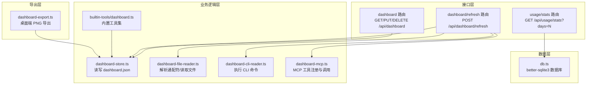
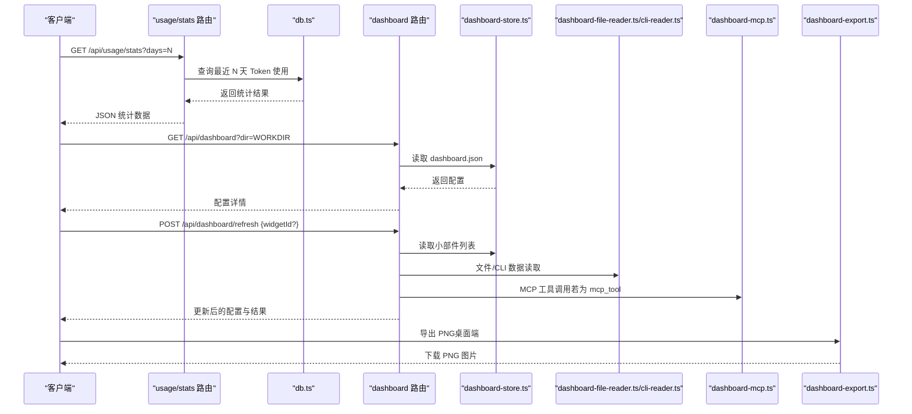
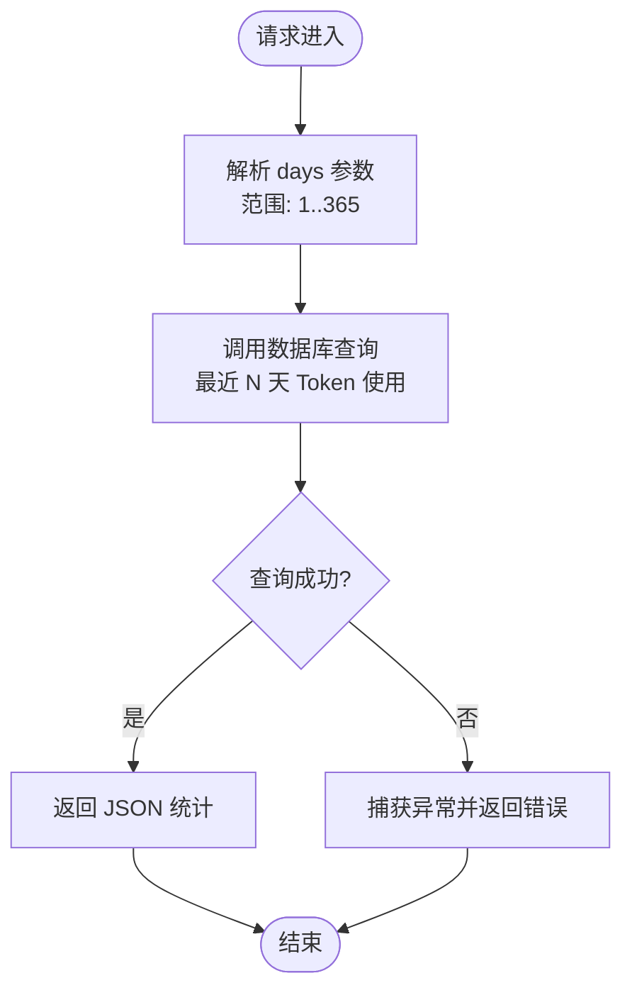
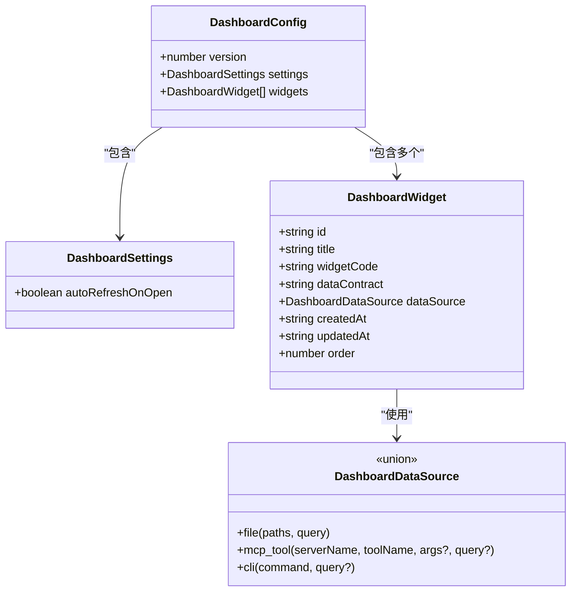
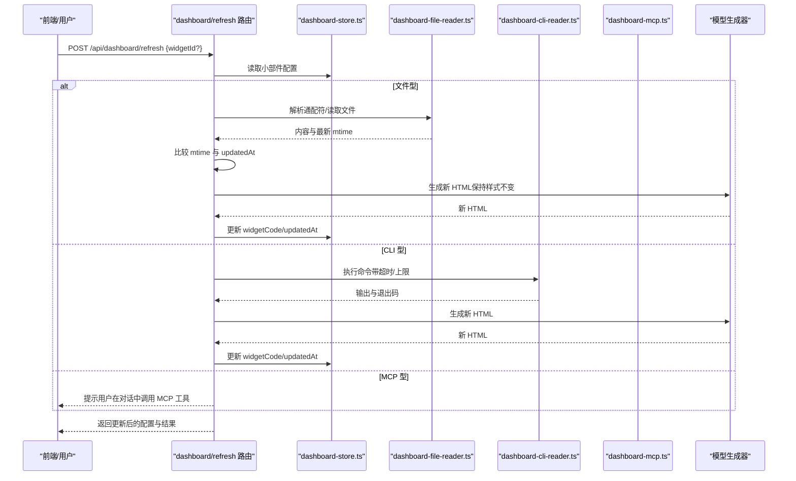
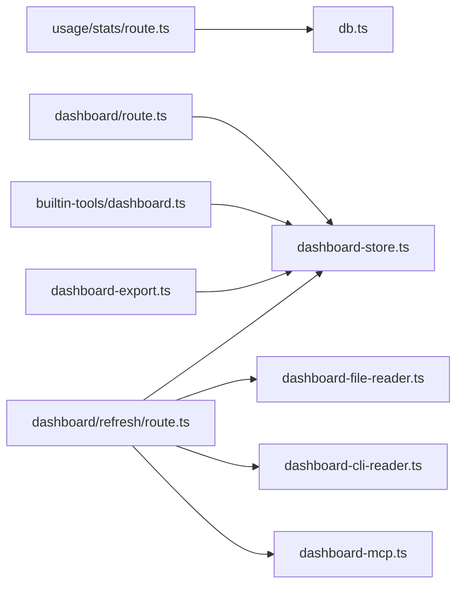

# 使用统计

<cite>
**本文引用的文件**
- [src/app/api/usage/stats/route.ts](file://src/app/api/usage/stats/route.ts)
- [src/lib/db.ts](file://src/lib/db.ts)
- [src/app/api/dashboard/route.ts](file://src/app/api/dashboard/route.ts)
- [src/app/api/dashboard/refresh/route.ts](file://src/app/api/dashboard/refresh/route.ts)
- [src/lib/dashboard-store.ts](file://src/lib/dashboard-store.ts)
- [src/lib/dashboard-file-reader.ts](file://src/lib/dashboard-file-reader.ts)
- [src/lib/dashboard-cli-reader.ts](file://src/lib/dashboard-cli-reader.ts)
- [src/lib/dashboard-mcp.ts](file://src/lib/dashboard-mcp.ts)
- [src/lib/builtin-tools/dashboard.ts](file://src/lib/builtin-tools/dashboard.ts)
- [src/lib/dashboard-export.ts](file://src/lib/dashboard-export.ts)
- [src/types/dashboard.ts](file://src/types/dashboard.ts)
</cite>

## 目录
1. [简介](#简介)
2. [项目结构](#项目结构)
3. [核心组件](#核心组件)
4. [架构总览](#架构总览)
5. [详细组件分析](#详细组件分析)
6. [依赖关系分析](#依赖关系分析)
7. [性能考量](#性能考量)
8. [故障排查指南](#故障排查指南)
9. [结论](#结论)
10. [附录](#附录)

## 简介
本文件系统性阐述 CodePilot 的“使用统计”能力：从统计数据采集机制、Token 使用量计算与成本估算模型，到仪表板数据源、图表展示与趋势分析，再到使用模式识别、效率评估与资源消耗监控，并覆盖统计数据导出、报告生成与个性化配置选项。目标是帮助开发者与使用者全面理解并高效利用该功能。

## 项目结构
围绕使用统计与仪表板的关键模块分布如下：
- 统计接口层：Next.js 路由处理请求，调用数据库工具函数返回 Token 使用统计。
- 数据存储层：基于 better-sqlite3 的本地数据库，持久化会话、消息与 Token 使用信息。
- 仪表板管理：文件型配置存储（每个工程的 .codepilot/dashboard/dashboard.json），支持增删改查与重排。
- 数据源读取：文件、CLI 命令、MCP 工具三类数据源；刷新时通过模型生成更新后的可视化代码。
- 可视化导出：桌面端专用的 PNG 导出能力，用于报告生成与分享。

**图示来源**
- [src/app/api/usage/stats/route.ts:1-20](file://src/app/api/usage/stats/route.ts#L1-L20)
- [src/app/api/dashboard/route.ts:1-64](file://src/app/api/dashboard/route.ts#L1-L64)
- [src/app/api/dashboard/refresh/route.ts:1-114](file://src/app/api/dashboard/refresh/route.ts#L1-L114)
- [src/lib/dashboard-store.ts:1-120](file://src/lib/dashboard-store.ts#L1-L120)
- [src/lib/dashboard-file-reader.ts:1-89](file://src/lib/dashboard-file-reader.ts#L1-L89)
- [src/lib/dashboard-cli-reader.ts:1-34](file://src/lib/dashboard-cli-reader.ts#L1-L34)
- [src/lib/dashboard-mcp.ts:1-298](file://src/lib/dashboard-mcp.ts#L1-L298)
- [src/lib/builtin-tools/dashboard.ts:1-108](file://src/lib/builtin-tools/dashboard.ts#L1-L108)
- [src/lib/dashboard-export.ts:1-114](file://src/lib/dashboard-export.ts#L1-L114)
- [src/lib/db.ts:1-800](file://src/lib/db.ts#L1-L800)

**章节来源**
- [src/app/api/usage/stats/route.ts:1-20](file://src/app/api/usage/stats/route.ts#L1-L20)
- [src/lib/db.ts:1-800](file://src/lib/db.ts#L1-L800)
- [src/app/api/dashboard/route.ts:1-64](file://src/app/api/dashboard/route.ts#L1-L64)
- [src/app/api/dashboard/refresh/route.ts:1-114](file://src/app/api/dashboard/refresh/route.ts#L1-L114)
- [src/lib/dashboard-store.ts:1-120](file://src/lib/dashboard-store.ts#L1-L120)
- [src/lib/dashboard-file-reader.ts:1-89](file://src/lib/dashboard-file-reader.ts#L1-L89)
- [src/lib/dashboard-cli-reader.ts:1-34](file://src/lib/dashboard-cli-reader.ts#L1-L34)
- [src/lib/dashboard-mcp.ts:1-298](file://src/lib/dashboard-mcp.ts#L1-L298)
- [src/lib/builtin-tools/dashboard.ts:1-108](file://src/lib/builtin-tools/dashboard.ts#L1-L108)
- [src/lib/dashboard-export.ts:1-114](file://src/lib/dashboard-export.ts#L1-L114)
- [src/types/dashboard.ts:1-36](file://src/types/dashboard.ts#L1-L36)

## 核心组件
- 使用统计接口：提供按天聚合的 Token 使用统计，支持 days 参数范围校验与错误处理。
- 数据库层：维护 chat_sessions、messages 表，其中 messages 表含 token_usage 字段，用于记录每次消息的 Token 消耗。
- 仪表板配置：以文件形式保存在工程根目录下的 .codepilot/dashboard/dashboard.json，支持设置自动刷新、小部件增删改查与排序。
- 数据源读取：文件型（支持通配符）、CLI 型（安全执行，带超时与输出限制）、MCP 工具型（通过 MCP 协议调用外部服务）。
- 刷新与更新：根据数据源变化，调用模型生成新的可视化代码并更新小部件。
- 导出与报告：桌面端导出 PNG，便于生成报告或分享。

**章节来源**
- [src/app/api/usage/stats/route.ts:7-19](file://src/app/api/usage/stats/route.ts#L7-L19)
- [src/lib/db.ts:100-120](file://src/lib/db.ts#L100-L120)
- [src/lib/dashboard-store.ts:29-51](file://src/lib/dashboard-store.ts#L29-L51)
- [src/lib/dashboard-file-reader.ts:11-42](file://src/lib/dashboard-file-reader.ts#L11-L42)
- [src/lib/dashboard-cli-reader.ts:15-33](file://src/lib/dashboard-cli-reader.ts#L15-L33)
- [src/app/api/dashboard/refresh/route.ts:16-73](file://src/app/api/dashboard/refresh/route.ts#L16-L73)
- [src/lib/dashboard-export.ts:88-113](file://src/lib/dashboard-export.ts#L88-L113)

## 架构总览
使用统计与仪表板的整体流程如下：

**图示来源**
- [src/app/api/usage/stats/route.ts:7-19](file://src/app/api/usage/stats/route.ts#L7-L19)
- [src/lib/db.ts:100-120](file://src/lib/db.ts#L100-L120)
- [src/app/api/dashboard/route.ts:5-17](file://src/app/api/dashboard/route.ts#L5-L17)
- [src/app/api/dashboard/refresh/route.ts:75-113](file://src/app/api/dashboard/refresh/route.ts#L75-L113)
- [src/lib/dashboard-store.ts:29-51](file://src/lib/dashboard-store.ts#L29-L51)
- [src/lib/dashboard-file-reader.ts:64-88](file://src/lib/dashboard-file-reader.ts#L64-L88)
- [src/lib/dashboard-cli-reader.ts:15-33](file://src/lib/dashboard-cli-reader.ts#L15-L33)
- [src/lib/dashboard-mcp.ts:46-297](file://src/lib/dashboard-mcp.ts#L46-L297)
- [src/lib/dashboard-export.ts:88-113](file://src/lib/dashboard-export.ts#L88-L113)

## 详细组件分析

### 使用统计接口与 Token 计算
- 接口职责：接收 days 参数（1~365），查询最近 N 天的 Token 使用统计并返回 JSON。
- 数据来源：messages 表中的 token_usage 字段，按日期分组聚合。
- 错误处理：捕获异常并返回统一错误响应。

**图示来源**
- [src/app/api/usage/stats/route.ts:7-19](file://src/app/api/usage/stats/route.ts#L7-L19)
- [src/lib/db.ts:100-120](file://src/lib/db.ts#L100-L120)

**章节来源**
- [src/app/api/usage/stats/route.ts:7-19](file://src/app/api/usage/stats/route.ts#L7-L19)
- [src/lib/db.ts:100-120](file://src/lib/db.ts#L100-L120)

### 仪表板配置与小部件管理
- 存储位置：每个工程根目录下 .codepilot/dashboard/dashboard.json。
- 支持操作：读取、新增、删除、更新、重排、移动、设置自动刷新。
- 小部件字段：id、title、widgetCode、dataContract、dataSource、createdAt/updatedAt、order 等。

**图示来源**
- [src/types/dashboard.ts:6-36](file://src/types/dashboard.ts#L6-L36)
- [src/lib/dashboard-store.ts:29-51](file://src/lib/dashboard-store.ts#L29-L51)

**章节来源**
- [src/lib/dashboard-store.ts:29-51](file://src/lib/dashboard-store.ts#L29-L51)
- [src/types/dashboard.ts:6-36](file://src/types/dashboard.ts#L6-L36)

### 数据源读取与刷新流程
- 文件型数据源：支持通配符匹配，读取文件内容并限制最大输出大小，同时记录最新修改时间。
- CLI 型数据源：在工作目录执行命令，带超时与输出上限，返回标准输出与退出码。
- MCP 工具型数据源：通过 MCP 协议调用外部工具，刷新时仅提示用户调用，不直接执行。
- 刷新策略：比较源文件的最新修改时间与小部件更新时间，若未变化则跳过更新；否则调用模型生成新的 HTML 并保存。

**图示来源**
- [src/app/api/dashboard/refresh/route.ts:16-73](file://src/app/api/dashboard/refresh/route.ts#L16-L73)
- [src/lib/dashboard-file-reader.ts:64-88](file://src/lib/dashboard-file-reader.ts#L64-L88)
- [src/lib/dashboard-cli-reader.ts:15-33](file://src/lib/dashboard-cli-reader.ts#L15-L33)
- [src/lib/dashboard-mcp.ts:135-234](file://src/lib/dashboard-mcp.ts#L135-L234)

**章节来源**
- [src/app/api/dashboard/refresh/route.ts:16-73](file://src/app/api/dashboard/refresh/route.ts#L16-L73)
- [src/lib/dashboard-file-reader.ts:11-42](file://src/lib/dashboard-file-reader.ts#L11-L42)
- [src/lib/dashboard-cli-reader.ts:15-33](file://src/lib/dashboard-cli-reader.ts#L15-L33)
- [src/lib/dashboard-mcp.ts:135-234](file://src/lib/dashboard-mcp.ts#L135-L234)

### 成本估算模型（概念性说明）
- Token 计费：依据 messages 表中的 token_usage 字段进行统计与聚合。
- 成本模型：可结合不同供应商的单价（如按 1K Tokens 计价）进行估算，具体单价需在集成层配置。
- 时间维度：支持按日/周/月等聚合，便于趋势分析与预算控制。

[本节为概念性说明，不直接分析具体文件，故无“章节来源”]

### 仪表板数据源类型与扩展点
- 文件型：适合读取工程内的配置、日志、测试报告等文本数据。
- CLI 型：适合运行 git、npm、docker 等命令获取实时状态。
- MCP 工具型：适合对接外部系统（如项目管理、监控平台）。

**章节来源**
- [src/types/dashboard.ts:6-9](file://src/types/dashboard.ts#L6-L9)
- [src/lib/dashboard-mcp.ts:24-42](file://src/lib/dashboard-mcp.ts#L24-L42)

### 可视化导出与报告生成
- 导出能力：桌面端专用，构建独立 HTML 页面，注入样式与脚本，通过隔离窗口渲染并截图生成 PNG。
- 安全策略：CSP 白名单、沙箱分区、仅允许必要域名加载脚本。
- 使用场景：将仪表板小部件导出为图片，用于报告、演示或归档。

**章节来源**
- [src/lib/dashboard-export.ts:19-83](file://src/lib/dashboard-export.ts#L19-L83)
- [src/lib/dashboard-export.ts:88-113](file://src/lib/dashboard-export.ts#L88-L113)

## 依赖关系分析
- 接口依赖：usage/stats 路由依赖 db.ts；dashboard 路由依赖 dashboard-store.ts；dashboard/refresh 路由依赖 dashboard-store.ts、dashboard-file-reader.ts、dashboard-cli-reader.ts、dashboard-mcp.ts。
- 数据依赖：messages 表的 token_usage 字段承载 Token 使用量；chat_sessions 表提供会话上下文。
- 外部依赖：better-sqlite3、@anthropic-ai/claude-agent-sdk（MCP）、Electron（导出）。

**图示来源**
- [src/app/api/usage/stats/route.ts:1-20](file://src/app/api/usage/stats/route.ts#L1-L20)
- [src/lib/db.ts:1-800](file://src/lib/db.ts#L1-L800)
- [src/app/api/dashboard/route.ts:1-64](file://src/app/api/dashboard/route.ts#L1-L64)
- [src/app/api/dashboard/refresh/route.ts:1-114](file://src/app/api/dashboard/refresh/route.ts#L1-L114)
- [src/lib/dashboard-store.ts:1-120](file://src/lib/dashboard-store.ts#L1-L120)
- [src/lib/dashboard-file-reader.ts:1-89](file://src/lib/dashboard-file-reader.ts#L1-L89)
- [src/lib/dashboard-cli-reader.ts:1-34](file://src/lib/dashboard-cli-reader.ts#L1-L34)
- [src/lib/dashboard-mcp.ts:1-298](file://src/lib/dashboard-mcp.ts#L1-L298)
- [src/lib/builtin-tools/dashboard.ts:1-108](file://src/lib/builtin-tools/dashboard.ts#L1-L108)
- [src/lib/dashboard-export.ts:1-114](file://src/lib/dashboard-export.ts#L1-L114)

**章节来源**
- [src/app/api/usage/stats/route.ts:1-20](file://src/app/api/usage/stats/route.ts#L1-L20)
- [src/lib/db.ts:1-800](file://src/lib/db.ts#L1-L800)
- [src/app/api/dashboard/route.ts:1-64](file://src/app/api/dashboard/route.ts#L1-L64)
- [src/app/api/dashboard/refresh/route.ts:1-114](file://src/app/api/dashboard/refresh/route.ts#L1-L114)
- [src/lib/dashboard-store.ts:1-120](file://src/lib/dashboard-store.ts#L1-L120)
- [src/lib/dashboard-file-reader.ts:1-89](file://src/lib/dashboard-file-reader.ts#L1-L89)
- [src/lib/dashboard-cli-reader.ts:1-34](file://src/lib/dashboard-cli-reader.ts#L1-L34)
- [src/lib/dashboard-mcp.ts:1-298](file://src/lib/dashboard-mcp.ts#L1-L298)
- [src/lib/builtin-tools/dashboard.ts:1-108](file://src/lib/builtin-tools/dashboard.ts#L1-L108)
- [src/lib/dashboard-export.ts:1-114](file://src/lib/dashboard-export.ts#L1-L114)

## 性能考量
- 数据库访问：使用 WAL 模式与索引优化查询性能；避免在热路径上执行复杂 JOIN。
- 文件读取：限制单次读取总量与文件数量，防止内存膨胀；对通配符搜索深度与结果数做上限控制。
- CLI 执行：设置超时与输出上限，避免阻塞；失败时快速返回并记录错误。
- 小部件刷新：mtime 对比减少不必要的模型调用；仅在数据真正变化时更新。
- 导出渲染：桌面端隔离窗口渲染，避免主线程阻塞；导出后及时释放内存对象。

[本节提供通用指导，不直接分析具体文件，故无“章节来源”]

## 故障排查指南
- 使用统计接口报错
  - 检查 days 参数是否在 1~365 范围内。
  - 查看数据库连接与表结构是否完整（确保 messages 表存在 token_usage 字段）。
- 仪表板读取失败
  - 确认 workingDirectory 是否传入且有效。
  - 检查 dashboard.json 是否存在、格式是否正确、版本号是否为 1。
- 刷新小部件无变化
  - 对于文件型：确认通配符匹配到文件，且源文件最新修改时间已超过小部件 updatedAt。
  - 对于 CLI 型：确认命令执行成功（退出码为 0），输出符合预期。
  - 对于 MCP 型：按提示在对话中调用相应 MCP 工具。
- 导出 PNG 抛出异常
  - 确认当前环境为桌面端（Electron），且已注入 window.electronAPI.widget.exportPng。
  - 检查 CSP 与样式注入是否正确。

**章节来源**
- [src/app/api/usage/stats/route.ts:15-18](file://src/app/api/usage/stats/route.ts#L15-L18)
- [src/lib/dashboard-store.ts:29-51](file://src/lib/dashboard-store.ts#L29-L51)
- [src/app/api/dashboard/refresh/route.ts:16-73](file://src/app/api/dashboard/refresh/route.ts#L16-L73)
- [src/lib/dashboard-cli-reader.ts:15-33](file://src/lib/dashboard-cli-reader.ts#L15-L33)
- [src/lib/dashboard-export.ts:88-113](file://src/lib/dashboard-export.ts#L88-L113)

## 结论
CodePilot 的使用统计与仪表板体系以“文件型配置 + 多数据源 + 模型驱动刷新”为核心，既保证了灵活性与安全性，又提供了强大的可视化与导出能力。通过合理的参数化与阈值控制，可在保证性能的同时满足多样化的使用场景与报告需求。

[本节为总结性内容，不直接分析具体文件，故无“章节来源”]

## 附录

### API 定义概览
- 获取使用统计
  - 方法：GET
  - 路径：/api/usage/stats
  - 查询参数：days（整数，默认 30，范围 1~365）
  - 响应：统计结果 JSON
- 仪表板管理
  - GET /api/dashboard?dir=WORKING_DIRECTORY：读取配置
  - PUT /api/dashboard：更新设置或重排小部件
  - DELETE /api/dashboard?dir=WORKING_DIRECTORY&widgetId=ID：删除小部件
- 刷新小部件
  - POST /api/dashboard/refresh：刷新指定或全部小部件

**章节来源**
- [src/app/api/usage/stats/route.ts:7-19](file://src/app/api/usage/stats/route.ts#L7-L19)
- [src/app/api/dashboard/route.ts:4-47](file://src/app/api/dashboard/route.ts#L4-L47)
- [src/app/api/dashboard/refresh/route.ts:75-113](file://src/app/api/dashboard/refresh/route.ts#L75-L113)