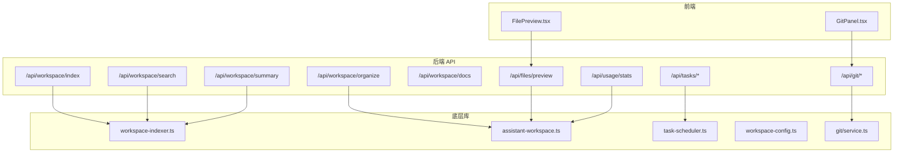
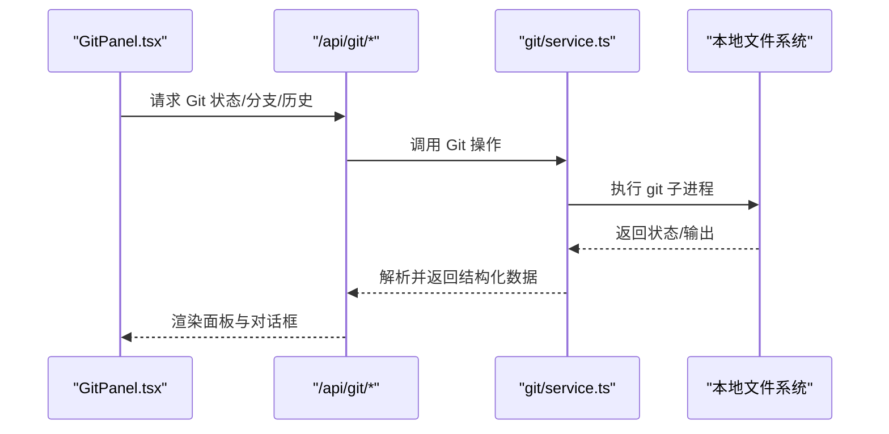
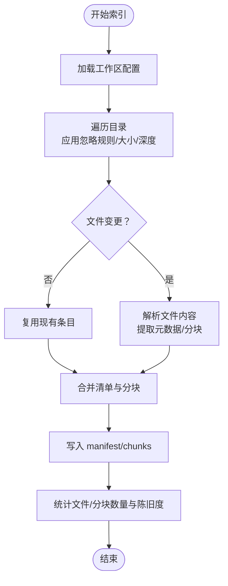
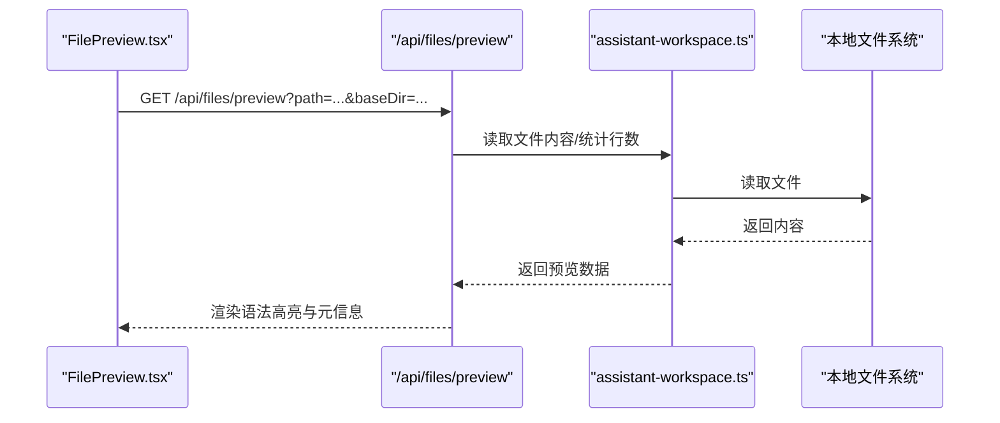
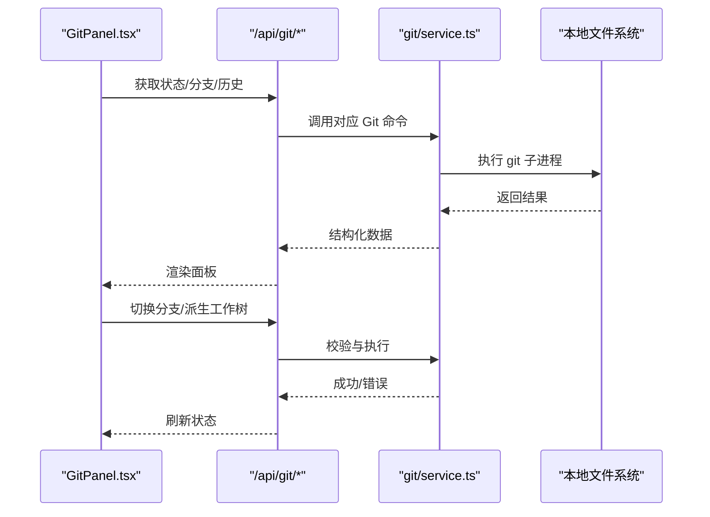
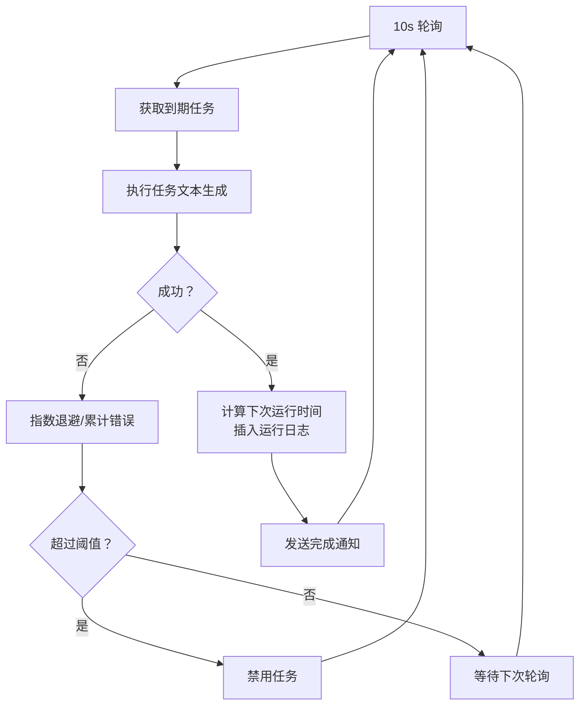
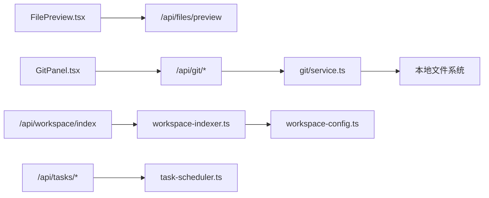

# 工作区管理

<cite>
**本文档引用的文件**
- [workspace-indexer.ts](file://src/lib/workspace-indexer.ts)
- [assistant-workspace.ts](file://src/lib/assistant-workspace.ts)
- [task-scheduler.ts](file://src/lib/task-scheduler.ts)
- [workspace-config.ts](file://src/lib/workspace-config.ts)
- [service.ts](file://src/lib/git/service.ts)
- [GitPanel.tsx](file://src/components/git/GitPanel.tsx)
- [FilePreview.tsx](file://src/components/project/FilePreview.tsx)
- [route.ts](file://src/app/api/workspace/index/route.ts)
- [route.ts](file://src/app/api/workspace/search/route.ts)
- [route.ts](file://src/app/api/workspace/organize/route.ts)
- [route.ts](file://src/app/api/workspace/summary/route.ts)
- [route.ts](file://src/app/api/workspace/docs/route.ts)
- [route.ts](file://src/app/api/workspace/checkin/route.ts)
- [route.ts](file://src/app/api/workspace/evolve-buddy/route.ts)
- [route.ts](file://src/app/api/workspace/hatch-buddy/route.ts)
- [route.ts](file://src/app/api/workspace/latest-session/route.ts)
- [route.ts](file://src/app/api/workspace/onboarding/route.ts)
- [route.ts](file://src/app/api/workspace/session/route.ts)
- [route.ts](file://src/app/api/workspace/wizard/route.ts)
- [route.ts](file://src/app/api/workspace/inspect/route.ts)
- [route.ts](file://src/app/api/workspace/quick-actions/route.ts)
- [route.ts](file://src/app/api/workspace/hook-triggered/route.ts)
- [route.ts](file://src/app/api/tasks/route.ts)
- [route.ts](file://src/app/api/tasks/schedule/route.ts)
- [route.ts](file://src/app/api/tasks/list/route.ts)
- [route.ts](file://src/app/api/tasks/[id]/route.ts)
- [route.ts](file://src/app/api/tasks/[id]/run/route.ts)
- [route.ts](file://src/app/api/tasks/[id]/pause/route.ts)
- [route.ts](file://src/app/api/tasks/notify/route.ts)
- [route.ts](file://src/app/api/git/status/route.ts)
- [route.ts](file://src/app/api/git/branches/route.ts)
- [route.ts](file://src/app/api/git/log/route.ts)
- [route.ts](file://src/app/api/git/commit/route.ts)
- [route.ts](file://src/app/api/git/checkout/route.ts)
- [route.ts](file://src/app/api/git/worktrees/route.ts)
- [route.ts](file://src/app/api/git/worktrees/derive/route.ts)
- [route.ts](file://src/app/api/git/commit-detail/[sha]/route.ts)
- [route.ts](file://src/app/api/files/preview/route.ts)
- [route.ts](file://src/app/api/usage/stats/route.ts)
</cite>

## 目录
1. [简介](#简介)
2. [项目结构](#项目结构)
3. [核心组件](#核心组件)
4. [架构总览](#架构总览)
5. [详细组件分析](#详细组件分析)
6. [依赖关系分析](#依赖关系分析)
7. [性能考量](#性能考量)
8. [故障排查指南](#故障排查指南)
9. [结论](#结论)
10. [附录](#附录)

## 简介
本文件面向 CodePilot 的“工作区管理”能力，系统性阐述以下主题：
- 文件浏览器与文件预览：目录树、文件列表、语法高亮预览、行号与语言识别
- Git 集成：状态查询、分支切换、提交、历史日志、工作树管理
- 任务调度：一次性与周期性任务、重试退避、会话内任务、过期回收
- 使用统计：运行时用量与统计上报接口
- 工作区索引机制：增量索引、分块切分、元数据提取、统计查询
- 组织与最佳实践：配置项、忽略规则、索引策略、性能优化

## 项目结构
工作区管理由“前端组件 + 后端 API + 底层库模块”三层构成：
- 前端组件负责交互与展示（如 Git 面板、文件预览）
- 后端 API 提供数据与操作接口（如工作区索引、Git 操作、任务调度）
- 底层库模块实现核心算法与工具（如索引器、任务调度器、Git 服务）

图示来源
- [GitPanel.tsx:1-146](file://src/components/git/GitPanel.tsx#L1-L146)
- [FilePreview.tsx:1-156](file://src/components/project/FilePreview.tsx#L1-L156)
- [workspace-indexer.ts:1-428](file://src/lib/workspace-indexer.ts#L1-L428)
- [assistant-workspace.ts:1-666](file://src/lib/assistant-workspace.ts#L1-L666)
- [task-scheduler.ts:1-526](file://src/lib/task-scheduler.ts#L1-L526)
- [workspace-config.ts:1-119](file://src/lib/workspace-config.ts#L1-L119)
- [service.ts:1-386](file://src/lib/git/service.ts#L1-L386)

章节来源
- [GitPanel.tsx:1-146](file://src/components/git/GitPanel.tsx#L1-L146)
- [FilePreview.tsx:1-156](file://src/components/project/FilePreview.tsx#L1-L156)
- [workspace-indexer.ts:1-428](file://src/lib/workspace-indexer.ts#L1-L428)
- [assistant-workspace.ts:1-666](file://src/lib/assistant-workspace.ts#L1-L666)
- [task-scheduler.ts:1-526](file://src/lib/task-scheduler.ts#L1-L526)
- [workspace-config.ts:1-119](file://src/lib/workspace-config.ts#L1-L119)
- [service.ts:1-386](file://src/lib/git/service.ts#L1-L386)

## 核心组件
- 工作区索引器：扫描工作区、增量更新、分块切分、元数据提取、统计查询
- 助手工作区：根文档生成、每日记忆、状态迁移、提示词组装
- 任务调度器：轮询 SQLite 查询到期任务、执行、通知、退避与过期回收
- Git 服务：仓库检测、状态、分支、提交、推送、历史、工作树派生
- 文件预览：按路径获取文件内容、语言识别、语法高亮、行数统计

章节来源
- [workspace-indexer.ts:1-428](file://src/lib/workspace-indexer.ts#L1-L428)
- [assistant-workspace.ts:1-666](file://src/lib/assistant-workspace.ts#L1-L666)
- [task-scheduler.ts:1-526](file://src/lib/task-scheduler.ts#L1-L526)
- [service.ts:1-386](file://src/lib/git/service.ts#L1-L386)
- [FilePreview.tsx:1-156](file://src/components/project/FilePreview.tsx#L1-L156)

## 架构总览
下图展示了工作区管理的关键流程：前端通过 API 访问后端，后端调用底层库完成具体操作。

图示来源
- [GitPanel.tsx:1-146](file://src/components/git/GitPanel.tsx#L1-L146)
- [service.ts:1-386](file://src/lib/git/service.ts#L1-L386)

## 详细组件分析

### 工作区索引机制
- 扫描与过滤：遍历工作区，应用忽略规则与扩展名白名单，限制最大深度与文件大小
- 增量更新：基于 manifest.jsonl 与文件修改时间判断是否需要重新索引
- 分块与元数据：按标题切分 Markdown，支持重叠窗口；提取标题、标签、别名、摘要
- 存储与统计：分别写入 manifest.jsonl 与 chunks.jsonl，并提供统计查询接口

图示来源
- [workspace-indexer.ts:255-371](file://src/lib/workspace-indexer.ts#L255-L371)
- [workspace-config.ts:59-118](file://src/lib/workspace-config.ts#L59-L118)

章节来源
- [workspace-indexer.ts:1-428](file://src/lib/workspace-indexer.ts#L1-L428)
- [workspace-config.ts:1-119](file://src/lib/workspace-config.ts#L1-L119)

### 文件预览与语法高亮
- 预览接口：根据路径与基目录获取文件内容、语言类型、行数等
- 语法高亮：基于 react-syntax-highlighter，动态选择代码主题
- 交互：面包屑、复制路径、滚动区域、加载与错误处理

图示来源
- [FilePreview.tsx:1-156](file://src/components/project/FilePreview.tsx#L1-L156)
- [assistant-workspace.ts:425-449](file://src/lib/assistant-workspace.ts#L425-L449)

章节来源
- [FilePreview.tsx:1-156](file://src/components/project/FilePreview.tsx#L1-L156)
- [assistant-workspace.ts:425-449](file://src/lib/assistant-workspace.ts#L425-L449)

### Git 集成与面板
- 面板组成：状态、分支、历史、工作树四个可折叠区块
- 状态：仓库根、分支、上游、ahead/behind、变更文件
- 分支：列出本地/远程分支，支持安全的 checkout（脏树拒绝）
- 历史：日志列表，支持查看提交详情
- 工作树：枚举工作树，支持派生新工作树（自动校验分支名）

图示来源
- [GitPanel.tsx:1-146](file://src/components/git/GitPanel.tsx#L1-L146)
- [service.ts:40-134](file://src/lib/git/service.ts#L40-L134)
- [service.ts:181-194](file://src/lib/git/service.ts#L181-L194)
- [service.ts:313-369](file://src/lib/git/service.ts#L313-L369)
- [service.ts:375-385](file://src/lib/git/service.ts#L375-L385)

章节来源
- [GitPanel.tsx:1-146](file://src/components/git/GitPanel.tsx#L1-L146)
- [service.ts:1-386](file://src/lib/git/service.ts#L1-L386)

### 任务调度与计划
- 轮询：每 10 秒轮询 SQLite 中到期的任务
- 执行：解析提供商凭据，轻量文本生成，插入运行日志，计算下次运行时间
- 通知：完成后或失败时发送通知（Toast/Electron/Telegram）
- 退避：指数退避（30s/1m/5m/15m），超过阈值自动禁用
- 会话任务：内存态任务，支持一次性与周期性，带确定性抖动避免惊群

图示来源
- [task-scheduler.ts:43-131](file://src/lib/task-scheduler.ts#L43-L131)
- [task-scheduler.ts:145-293](file://src/lib/task-scheduler.ts#L145-L293)
- [task-scheduler.ts:346-357](file://src/lib/task-scheduler.ts#L346-L357)

章节来源
- [task-scheduler.ts:1-526](file://src/lib/task-scheduler.ts#L1-L526)

### 使用统计与工作区状态
- 使用统计：提供用量统计接口，便于监控与上报
- 工作区状态：心跳检查、每日打卡、状态迁移、根文档生成、每日记忆

章节来源
- [assistant-workspace.ts:517-560](file://src/lib/assistant-workspace.ts#L517-L560)
- [assistant-workspace.ts:567-589](file://src/lib/assistant-workspace.ts#L567-L589)
- [assistant-workspace.ts:227-289](file://src/lib/assistant-workspace.ts#L227-L289)

## 依赖关系分析
- 前端组件依赖后端 API；API 依赖底层库；底层库依赖本地文件系统与外部 Git
- 任务调度器依赖数据库（SQLite）与提供商解析；Git 面板依赖 Git 服务
- 文件预览依赖工作区文件读取；索引器依赖配置与分类规则

图示来源
- [FilePreview.tsx:1-156](file://src/components/project/FilePreview.tsx#L1-L156)
- [GitPanel.tsx:1-146](file://src/components/git/GitPanel.tsx#L1-L146)
- [service.ts:1-386](file://src/lib/git/service.ts#L1-L386)
- [workspace-indexer.ts:1-428](file://src/lib/workspace-indexer.ts#L1-L428)
- [task-scheduler.ts:1-526](file://src/lib/task-scheduler.ts#L1-L526)
- [workspace-config.ts:1-119](file://src/lib/workspace-config.ts#L1-L119)

## 性能考量
- 索引性能
  - 控制最大深度与文件大小，避免大体积媒体文件进入索引
  - 合理设置分块大小与重叠，平衡检索精度与索引规模
  - 增量索引优先复用旧条目，仅对变更文件重新处理
- Git 操作
  - 使用 porcelain v2 输出，解析稳定；超时控制与缓冲区上限避免阻塞
  - 脏树拒绝 checkout，减少失败重试开销
- 任务调度
  - 10s 轮询频率适中；为相同间隔任务加入确定性抖动，避免惊群
  - 失败指数退避与自动禁用，降低无效负载
- 前端渲染
  - 文件预览按需加载，语法高亮按需渲染；长文件采用近似行数提示

[本节为通用指导，无需特定文件引用]

## 故障排查指南
- Git 面板无内容
  - 确认当前目录为 Git 仓库；非仓库时面板提示“非仓库”
  - 检查权限与子进程超时设置
- 切换分支失败
  - 若工作树脏，需先提交或暂存；非法分支名会被拒绝
- 提交失败
  - 无变更时会提示“无可提交内容”；确保已暂存或允许自动 add
- 任务未执行
  - 检查任务状态与下次运行时间；关注退避与自动禁用
  - 确认提供商凭据已配置
- 文件预览空白
  - 检查路径与 baseDir 参数；确认文件存在且可读
  - 大文件可能被忽略（受配置限制）

章节来源
- [service.ts:26-33](file://src/lib/git/service.ts#L26-L33)
- [service.ts:181-194](file://src/lib/git/service.ts#L181-L194)
- [service.ts:221-247](file://src/lib/git/service.ts#L221-L247)
- [task-scheduler.ts:160-162](file://src/lib/task-scheduler.ts#L160-L162)
- [FilePreview.tsx:38-60](file://src/components/project/FilePreview.tsx#L38-L60)

## 结论
工作区管理通过“索引 + 预览 + Git + 任务 + 统计”的组合，形成完整的本地知识体系与开发辅助闭环。合理配置索引参数、规范 Git 使用、优化任务调度策略，可显著提升体验与性能。

[本节为总结，无需特定文件引用]

## 附录

### API 一览（与工作区管理相关）
- 工作区
  - GET /api/workspace/index — 获取索引统计
  - POST /api/workspace/organize — 组织工作区（生成根文档/推断分类）
  - POST /api/workspace/search — 搜索索引
  - GET /api/workspace/summary — 摘要
  - GET /api/workspace/docs — 文档
  - POST /api/workspace/checkin — 心跳/打卡
  - POST /api/workspace/evolve-buddy — 进化伙伴
  - POST /api/workspace/hatch-buddy — 孵化伙伴
  - GET /api/workspace/latest-session — 最新会话
  - POST /api/workspace/onboarding — 引导
  - POST /api/workspace/session — 会话
  - POST /api/workspace/wizard — 向导
  - POST /api/workspace/inspect — 检查
  - POST /api/workspace/quick-actions — 快捷动作
  - POST /api/workspace/hook-triggered — 钩子触发
- 任务
  - GET /api/tasks — 列表
  - POST /api/tasks/schedule — 新建/更新
  - GET /api/tasks/list — 任务列表
  - GET /api/tasks/[id] — 任务详情
  - POST /api/tasks/[id]/run — 立即运行
  - POST /api/tasks/[id]/pause — 暂停
  - POST /api/tasks/notify — 通知
- Git
  - GET /api/git/status — 状态
  - GET /api/git/branches — 分支
  - GET /api/git/log — 历史
  - POST /api/git/commit — 提交
  - POST /api/git/checkout — 切换分支
  - GET /api/git/worktrees — 工作树
  - POST /api/git/worktrees/derive — 派生工作树
  - GET /api/git/commit-detail/[sha] — 提交详情
- 文件
  - GET /api/files/preview — 预览
- 使用统计
  - GET /api/usage/stats — 统计

章节来源
- [route.ts](file://src/app/api/workspace/index/route.ts)
- [route.ts](file://src/app/api/workspace/organize/route.ts)
- [route.ts](file://src/app/api/workspace/search/route.ts)
- [route.ts](file://src/app/api/workspace/summary/route.ts)
- [route.ts](file://src/app/api/workspace/docs/route.ts)
- [route.ts](file://src/app/api/workspace/checkin/route.ts)
- [route.ts](file://src/app/api/workspace/evolve-buddy/route.ts)
- [route.ts](file://src/app/api/workspace/hatch-buddy/route.ts)
- [route.ts](file://src/app/api/workspace/latest-session/route.ts)
- [route.ts](file://src/app/api/workspace/onboarding/route.ts)
- [route.ts](file://src/app/api/workspace/session/route.ts)
- [route.ts](file://src/app/api/workspace/wizard/route.ts)
- [route.ts](file://src/app/api/workspace/inspect/route.ts)
- [route.ts](file://src/app/api/workspace/quick-actions/route.ts)
- [route.ts](file://src/app/api/workspace/hook-triggered/route.ts)
- [route.ts](file://src/app/api/tasks/route.ts)
- [route.ts](file://src/app/api/tasks/schedule/route.ts)
- [route.ts](file://src/app/api/tasks/list/route.ts)
- [route.ts](file://src/app/api/tasks/[id]/route.ts)
- [route.ts](file://src/app/api/tasks/[id]/run/route.ts)
- [route.ts](file://src/app/api/tasks/[id]/pause/route.ts)
- [route.ts](file://src/app/api/tasks/notify/route.ts)
- [route.ts](file://src/app/api/git/status/route.ts)
- [route.ts](file://src/app/api/git/branches/route.ts)
- [route.ts](file://src/app/api/git/log/route.ts)
- [route.ts](file://src/app/api/git/commit/route.ts)
- [route.ts](file://src/app/api/git/checkout/route.ts)
- [route.ts](file://src/app/api/git/worktrees/route.ts)
- [route.ts](file://src/app/api/git/worktrees/derive/route.ts)
- [route.ts](file://src/app/api/git/commit-detail/[sha]/route.ts)
- [route.ts](file://src/app/api/files/preview/route.ts)
- [route.ts](file://src/app/api/usage/stats/route.ts)