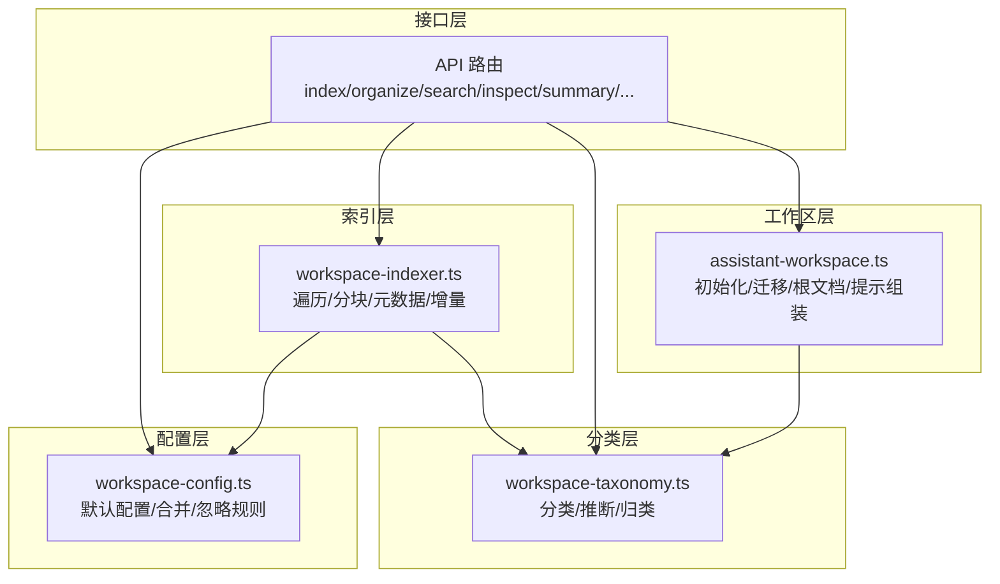
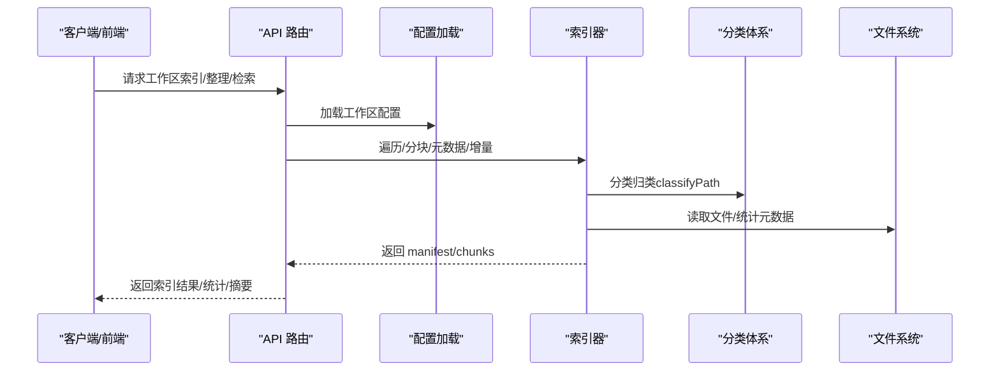
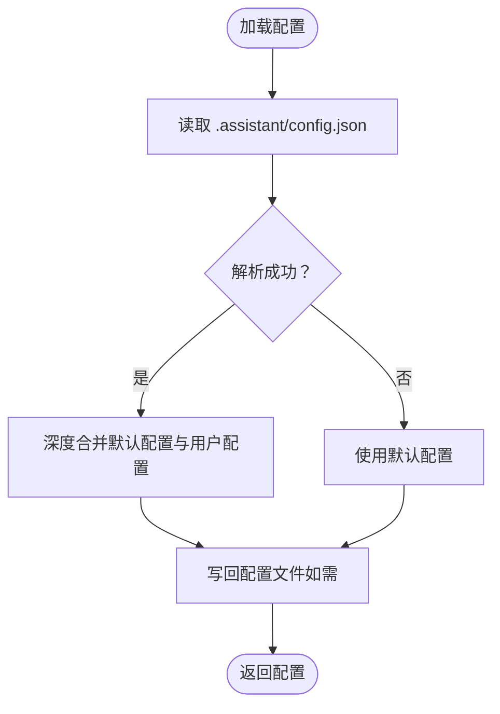
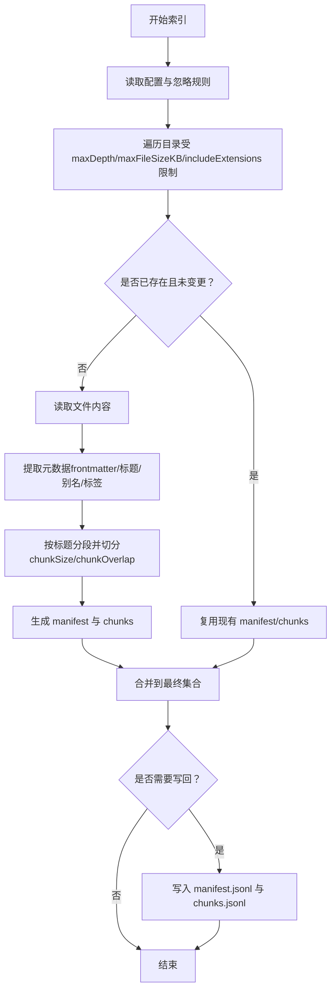
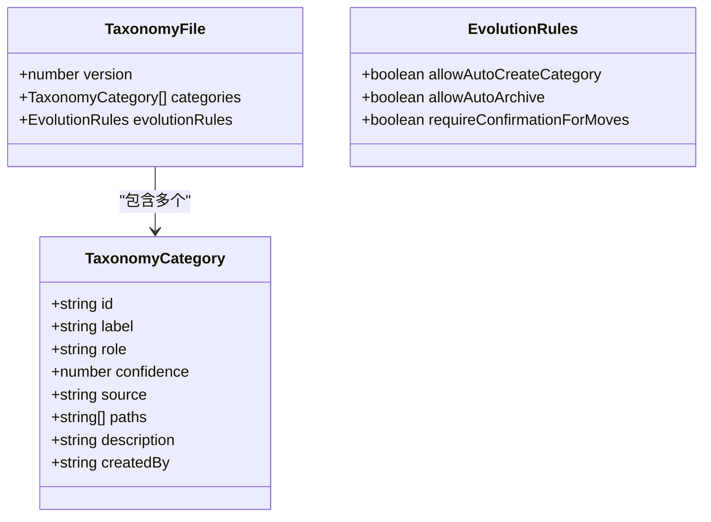
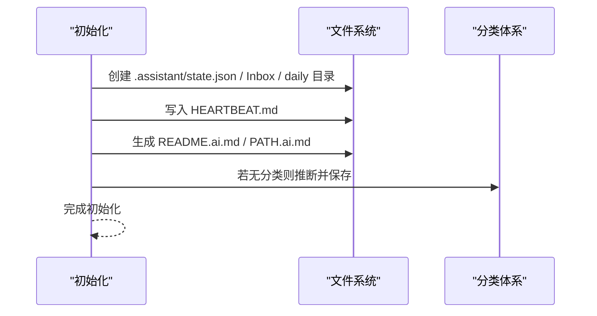
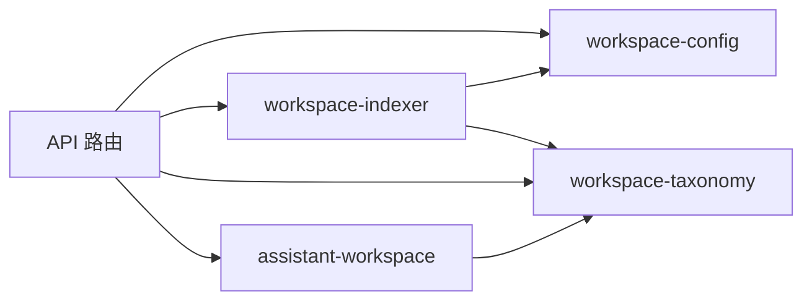

# 工作区组织

<cite>
**本文档引用的文件**
- [workspace-config.ts](file://src/lib/workspace-config.ts)
- [workspace-indexer.ts](file://src/lib/workspace-indexer.ts)
- [workspace-taxonomy.ts](file://src/lib/workspace-taxonomy.ts)
- [assistant-workspace.ts](file://src/lib/assistant-workspace.ts)
- [workspace-types.ts](file://src/components/settings/workspace-types.ts)
- [route.ts](file://src/app/api/workspace/index/route.ts)
- [route.ts](file://src/app/api/workspace/organize/route.ts)
- [route.ts](file://src/app/api/workspace/search/route.ts)
- [route.ts](file://src/app/api/workspace/inspect/route.ts)
- [route.ts](file://src/app/api/workspace/summary/route.ts)
- [route.ts](file://src/app/api/workspace/checkin/route.ts)
- [route.ts](file://src/app/api/workspace/latest-session/route.ts)
- [route.ts](file://src/app/api/workspace/session/route.ts)
- [route.ts](file://src/app/api/workspace/docs/route.ts)
- [route.ts](file://src/app/api/workspace/evolve-buddy/route.ts)
- [route.ts](file://src/app/api/workspace/hatch-buddy/route.ts)
- [route.ts](file://src/app/api/workspace/wizard/route.ts)
- [route.ts](file://src/app/api/workspace/onboarding/route.ts)
- [route.ts](file://src/app/api/workspace/quick-actions/route.ts)
- [route.ts](file://src/app/api/workspace/hook-triggered/route.ts)
- [route.ts](file://src/app/api/settings/workspace/route.ts)
</cite>

## 目录
1. [简介](#简介)
2. [项目结构](#项目结构)
3. [核心组件](#核心组件)
4. [架构总览](#架构总览)
5. [详细组件分析](#详细组件分析)
6. [依赖关系分析](#依赖关系分析)
7. [性能考量](#性能考量)
8. [故障排查指南](#故障排查指南)
9. [结论](#结论)
10. [附录](#附录)

## 简介
本文件系统性阐述 CodePilot 的“工作区组织”能力，覆盖工作区配置管理、文件索引机制与分类标签体系，解释工作区类型（general、project、notebook）的差异与适用场景，并提供忽略规则配置、索引参数调优、组织策略最佳实践，以及工作区迁移、备份恢复与性能优化建议。

## 项目结构
围绕工作区组织的关键代码分布在以下模块：
- 配置层：工作区配置加载与合并、忽略规则匹配
- 索引层：文件遍历、分块、元数据提取、增量更新
- 分类层：分类标签体系、自动推断与路径归类
- 工作区层：初始化、状态迁移、根文档生成、提示组装
- 接口层：工作区相关 API 路由（索引、整理、检索、检查等）

图表来源
- [workspace-config.ts:1-119](file://src/lib/workspace-config.ts#L1-L119)
- [workspace-indexer.ts:1-428](file://src/lib/workspace-indexer.ts#L1-L428)
- [workspace-taxonomy.ts:1-160](file://src/lib/workspace-taxonomy.ts#L1-L160)
- [assistant-workspace.ts:1-666](file://src/lib/assistant-workspace.ts#L1-L666)

章节来源
- [workspace-config.ts:1-119](file://src/lib/workspace-config.ts#L1-L119)
- [workspace-indexer.ts:1-428](file://src/lib/workspace-indexer.ts#L1-L428)
- [workspace-taxonomy.ts:1-160](file://src/lib/workspace-taxonomy.ts#L1-L160)
- [assistant-workspace.ts:1-666](file://src/lib/assistant-workspace.ts#L1-L666)

## 核心组件
- 工作区配置管理
  - 默认配置与深度合并，支持 ignore 规则、索引参数（最大文件大小、分块大小、重叠、最大深度、扩展名白名单）
  - 忽略规则采用 glob-to-regex 转换，统一斜杠规范化
- 文件索引机制
  - 递归遍历，按扩展名与大小过滤；支持增量更新（基于 mtime 对比）
  - Markdown 元数据抽取（标题、tags、aliases、headings）
  - 分块算法：按标题分段，超过阈值再按 chunkSize 与 chunkOverlap 切分
  - 生成 manifest 与 chunks 两套 JSONL 索引文件
- 分类标签系统
  - 支持手动维护 taxonomy.json 与自动推断（基于目录名映射）
  - 路径归类：最长前缀匹配，优先级最高
- 工作区初始化与状态
  - 初始化创建核心文件、Inbox、每日记忆目录、HEARTBEAT.md
  - 多版本状态迁移（schemaVersion），兼容历史字段命名
  - 自动生成根目录与子目录的 README.ai.md 与 PATH.ai.md

章节来源
- [workspace-config.ts:59-119](file://src/lib/workspace-config.ts#L59-L119)
- [workspace-indexer.ts:14-88](file://src/lib/workspace-indexer.ts#L14-L88)
- [workspace-indexer.ts:210-371](file://src/lib/workspace-indexer.ts#L210-L371)
- [workspace-taxonomy.ts:22-160](file://src/lib/workspace-taxonomy.ts#L22-L160)
- [assistant-workspace.ts:336-412](file://src/lib/assistant-workspace.ts#L336-L412)
- [assistant-workspace.ts:93-221](file://src/lib/assistant-workspace.ts#L93-L221)

## 架构总览
工作区组织的端到端流程如下：

图表来源
- [route.ts](file://src/app/api/workspace/index/route.ts)
- [route.ts](file://src/app/api/workspace/organize/route.ts)
- [route.ts](file://src/app/api/workspace/search/route.ts)
- [workspace-config.ts:59-68](file://src/lib/workspace-config.ts#L59-L68)
- [workspace-indexer.ts:300-371](file://src/lib/workspace-indexer.ts#L300-L371)
- [workspace-taxonomy.ts:119-143](file://src/lib/workspace-taxonomy.ts#L119-L143)

## 详细组件分析

### 工作区配置管理（workspace-config）
- 默认配置项
  - workspaceType: 默认 general
  - organizationStyle: mixed
  - captureDefault: Inbox
  - archivePolicy: 任务完成归档天数、项目关闭归档、内存保留天数
  - ignore: 默认忽略 .obsidian、.trash、媒体文件、node_modules、.git 等
  - index: 最大文件大小、分块大小、重叠、最大深度、扩展名白名单
- 合并与忽略匹配
  - 深度合并策略，避免覆盖非对象字段
  - glob-to-regex 转换，支持 **/ 匹配任意子路径段
- 读写配置
  - 自动创建 .assistant/config.json 目录
  - 读取失败回退默认配置

图表来源
- [workspace-config.ts:59-77](file://src/lib/workspace-config.ts#L59-L77)
- [workspace-config.ts:36-57](file://src/lib/workspace-config.ts#L36-L57)
- [workspace-config.ts:79-119](file://src/lib/workspace-config.ts#L79-L119)

章节来源
- [workspace-config.ts:59-119](file://src/lib/workspace-config.ts#L59-L119)

### 文件索引机制（workspace-indexer）
- 遍历与过滤
  - 递归遍历，受 maxDepth 限制
  - 忽略规则与大小限制（maxFileSizeKB）
  - 扩展名白名单（includeExtensions）
- 分块与元数据
  - 按标题分段，再按 chunkSize 与 chunkOverlap 切分
  - 提取 YAML frontmatter 中的 title/tags/aliases，扫描正文内 #tag
  - 计算文件与内容哈希，用于变更检测
- 增量更新
  - 读取现有 manifest/chunks
  - 基于 mtime 判定是否跳过
  - 仅在有变化时写回索引文件
- 统计与校验
  - 统计文件数、块数、最后索引时间、陈旧条目数

图表来源
- [workspace-indexer.ts:255-298](file://src/lib/workspace-indexer.ts#L255-L298)
- [workspace-indexer.ts:300-371](file://src/lib/workspace-indexer.ts#L300-L371)
- [workspace-indexer.ts:14-88](file://src/lib/workspace-indexer.ts#L14-L88)
- [workspace-indexer.ts:395-427](file://src/lib/workspace-indexer.ts#L395-L427)

章节来源
- [workspace-indexer.ts:255-371](file://src/lib/workspace-indexer.ts#L255-L371)
- [workspace-indexer.ts:395-427](file://src/lib/workspace-indexer.ts#L395-L427)

### 分类标签系统（workspace-taxonomy）
- 数据结构
  - version、categories（含 id/label/paths/role/confidence/source/description/createdBy）
  - evolutionRules：自动创建分类、自动归档、移动是否需要确认
- 自动推断
  - 基于目录名映射到 role（notes/projects/journal/archive/inbox/templates/resources/memory 等）
  - 精确名称更高置信度
- 路径归类
  - 最长前缀匹配，优先匹配更长的路径前缀
- 学习与建议
  - 可从目录结构学习新分类
  - 提供建议新分类的工厂方法

图表来源
- [workspace-taxonomy.ts:8-16](file://src/lib/workspace-taxonomy.ts#L8-L16)
- [workspace-taxonomy.ts:119-143](file://src/lib/workspace-taxonomy.ts#L119-L143)
- [workspace-taxonomy.ts:145-159](file://src/lib/workspace-taxonomy.ts#L145-L159)

章节来源
- [workspace-taxonomy.ts:1-160](file://src/lib/workspace-taxonomy.ts#L1-L160)

### 工作区初始化与状态（assistant-workspace）
- 初始化
  - 创建 .assistant/state.json、Inbox、每日记忆目录、HEARTBEAT.md
  - 生成根目录与子目录的 README.ai.md 与 PATH.ai.md
  - 若无分类，尝试从目录结构推断分类并保存
- 状态迁移
  - 多版本 schema 迁移（V1→V2→V3→V4→V5），兼容历史字段命名
- 提示组装
  - 预算感知的提示拼装，确保 claude.md 不被裁剪
- 日常记忆
  - 按日期写入 daily memory，支持读取最近 N 天

图表来源
- [assistant-workspace.ts:336-412](file://src/lib/assistant-workspace.ts#L336-L412)
- [assistant-workspace.ts:93-221](file://src/lib/assistant-workspace.ts#L93-L221)

章节来源
- [assistant-workspace.ts:336-412](file://src/lib/assistant-workspace.ts#L336-L412)
- [assistant-workspace.ts:93-221](file://src/lib/assistant-workspace.ts#L93-L221)

### 工作区类型与适用场景
- general（通用）
  - 适合个人知识库、文档仓库、笔记集合等
  - 默认组织风格 mixed，便于灵活分类
- project（项目）
  - 适合软件工程、产品设计、活动策划等项目型工作
  - 强调任务与里程碑，可结合任务追踪与归档策略
- notebook（笔记本）
  - 适合研究型、创意型工作流
  - 强调自由探索与草稿积累，配合标签与反向链接

章节来源
- [workspace-types.ts:7-16](file://src/components/settings/workspace-types.ts#L7-L16)

### 忽略规则配置与索引参数调优
- 忽略规则
  - 使用 glob 模式，支持 **/ 匹配任意子路径段
  - 建议忽略大型二进制文件、缓存目录、版本控制目录
- 索引参数
  - maxFileSizeKB：控制单文件大小上限，避免大文件占用索引空间
  - chunkSize/chunkOverlap：平衡检索精度与上下文连续性
  - maxDepth：控制索引深度，避免深层嵌套带来的性能问题
  - includeExtensions：仅索引必要扩展名，减少 IO 与存储开销
- 调优建议
  - 小型知识库：较小 chunkSize + 较小 maxDepth
  - 大型仓库：较大 chunkSize + 适当 chunkOverlap，提升跨段落检索效果
  - 高频更新：降低 maxDepth 或增加 ignore，减少频繁重索引

章节来源
- [workspace-config.ts:16-34](file://src/lib/workspace-config.ts#L16-L34)
- [workspace-indexer.ts:255-298](file://src/lib/workspace-indexer.ts#L255-L298)
- [workspace-indexer.ts:14-88](file://src/lib/workspace-indexer.ts#L14-L88)

### 组织策略最佳实践
- 目录结构
  - 以语义化目录为主，配合标签系统实现交叉检索
  - 使用 Inbox 作为收集区，定期整理到目标分类
- 标签体系
  - 统一标签命名规范，避免同义多标签
  - 在 frontmatter 与正文内保持一致的标签风格
- 归档与清理
  - 设置 archivePolicy，定期清理过期内容
  - 对已完成任务与关闭项目执行归档
- 分类演进
  - 初期允许系统自动推断，后期逐步完善 taxonomy.json
  - 对频繁移动的文件，开启 requireConfirmationForMoves

章节来源
- [workspace-taxonomy.ts:8-16](file://src/lib/workspace-taxonomy.ts#L8-L16)
- [assistant-workspace.ts:336-412](file://src/lib/assistant-workspace.ts#L336-L412)

### 工作区迁移、备份与恢复
- 迁移
  - 自动迁移：loadState 时触发多版本 schema 迁移
  - 手动迁移：提供 migrateStateV1ToV2/V3/V4/V5 等方法
- 备份
  - 备份 .assistant 目录（config.json、state.json、index/*、taxonomy.json）
  - 备份根目录文档（README.ai.md、PATH.ai.md）与每日记忆
- 恢复
  - 恢复 .assistant 与根目录文档
  - 重新运行索引，必要时调整 ignore 与索引参数

章节来源
- [assistant-workspace.ts:93-221](file://src/lib/assistant-workspace.ts#L93-L221)
- [assistant-workspace.ts:517-560](file://src/lib/assistant-workspace.ts#L517-L560)

### API 能力概览（工作区相关）
- 索引与统计
  - /api/workspace/index：索引工作区，返回文件数/块数
  - /api/workspace/inspect：检查索引状态与陈旧项
  - /api/workspace/summary：返回索引摘要
- 整理与组织
  - /api/workspace/organize：根据分类与规则整理文件
- 检索
  - /api/workspace/search：全文检索（基于索引）
- 生命周期
  - /api/workspace/checkin：心跳/签到
  - /api/workspace/latest-session、/api/workspace/session：会话管理
  - /api/workspace/docs：文档路由
  - /api/workspace/evolve-buddy、/api/workspace/hatch-buddy、/api/workspace/wizard、/api/workspace/onboarding：引导与助手流程
  - /api/workspace/quick-actions、/api/workspace/hook-triggered：快捷动作与钩子触发
- 设置
  - /api/settings/workspace：工作区设置相关

章节来源
- [route.ts](file://src/app/api/workspace/index/route.ts)
- [route.ts](file://src/app/api/workspace/organize/route.ts)
- [route.ts](file://src/app/api/workspace/search/route.ts)
- [route.ts](file://src/app/api/workspace/inspect/route.ts)
- [route.ts](file://src/app/api/workspace/summary/route.ts)
- [route.ts](file://src/app/api/workspace/checkin/route.ts)
- [route.ts](file://src/app/api/workspace/latest-session/route.ts)
- [route.ts](file://src/app/api/workspace/session/route.ts)
- [route.ts](file://src/app/api/workspace/docs/route.ts)
- [route.ts](file://src/app/api/workspace/evolve-buddy/route.ts)
- [route.ts](file://src/app/api/workspace/hatch-buddy/route.ts)
- [route.ts](file://src/app/api/workspace/wizard/route.ts)
- [route.ts](file://src/app/api/workspace/onboarding/route.ts)
- [route.ts](file://src/app/api/workspace/quick-actions/route.ts)
- [route.ts](file://src/app/api/workspace/hook-triggered/route.ts)
- [route.ts](file://src/app/api/settings/workspace/route.ts)

## 依赖关系分析
- 组件耦合
  - workspace-indexer 依赖 workspace-config 与 workspace-taxonomy
  - assistant-workspace 依赖 workspace-taxonomy 并间接影响索引输出
  - API 路由依赖上述模块提供数据与能力
- 外部依赖
  - 文件系统读写、JSONL 序列化、正则表达式匹配
- 循环依赖
  - 当前模块间无明显循环导入；若后续扩展，应避免相互 import

图表来源
- [workspace-config.ts:1-119](file://src/lib/workspace-config.ts#L1-L119)
- [workspace-indexer.ts:1-428](file://src/lib/workspace-indexer.ts#L1-L428)
- [workspace-taxonomy.ts:1-160](file://src/lib/workspace-taxonomy.ts#L1-L160)
- [assistant-workspace.ts:1-666](file://src/lib/assistant-workspace.ts#L1-L666)

章节来源
- [workspace-config.ts:1-119](file://src/lib/workspace-config.ts#L1-L119)
- [workspace-indexer.ts:1-428](file://src/lib/workspace-indexer.ts#L1-L428)
- [workspace-taxonomy.ts:1-160](file://src/lib/workspace-taxonomy.ts#L1-L160)
- [assistant-workspace.ts:1-666](file://src/lib/assistant-workspace.ts#L1-L666)

## 性能考量
- 索引性能
  - 控制 maxDepth 与 includeExtensions，减少 IO 与内存占用
  - 合理设置 chunkSize 与 chunkOverlap，在检索精度与性能间权衡
  - 使用增量更新，避免全量重索引
- 忽略规则
  - 明确忽略大型二进制与临时文件，降低索引体积
- 存储与并发
  - JSONL 文件顺序写入，避免频繁随机写
  - 大型工作区建议拆分为多个工作区或使用 ignore 精细化索引范围

## 故障排查指南
- 索引不更新
  - 检查文件 mtime 是否变化；确认 ignore 与 includeExtensions 是否正确
  - 查看 getIndexStats 的 staleCount 是否异常
- 分类不生效
  - 确认 taxonomy.json 的 paths 前缀是否与实际路径一致
  - 使用 suggestNewCategory 生成建议并手动校验
- 配置读取失败
  - 检查 .assistant/config.json 格式与权限
  - 回退至默认配置验证环境变量与路径
- 状态迁移异常
  - 检查 schemaVersion 与迁移日志
  - 手动调用对应迁移函数进行修复

章节来源
- [workspace-indexer.ts:395-427](file://src/lib/workspace-indexer.ts#L395-L427)
- [workspace-taxonomy.ts:119-143](file://src/lib/workspace-taxonomy.ts#L119-L143)
- [workspace-config.ts:59-68](file://src/lib/workspace-config.ts#L59-L68)
- [assistant-workspace.ts:517-560](file://src/lib/assistant-workspace.ts#L517-L560)

## 结论
通过配置管理、索引机制与分类标签的协同，CodePilot 的工作区组织实现了对个人知识库与项目文档的高效管理。合理设置忽略规则与索引参数、建立稳定的分类体系、并遵循迁移与备份策略，可在保证性能的同时获得良好的检索体验与组织效率。

## 附录
- 关键术语
  - manifest：文件级索引，包含路径、标题、标签、哈希、修改时间等
  - chunks：分块索引，包含块 ID、所属笔记、标题、文本片段与行列范围
  - taxonomy：分类体系，定义分类角色与路径前缀
  - evolutionRules：分类演进规则，控制自动创建、自动归档与移动确认
- 常用操作
  - 重新索引：调用 /api/workspace/index
  - 查看统计：调用 /api/workspace/inspect /api/workspace/summary
  - 整理工作区：调用 /api/workspace/organize
  - 设置工作区类型：调用 /api/settings/workspace