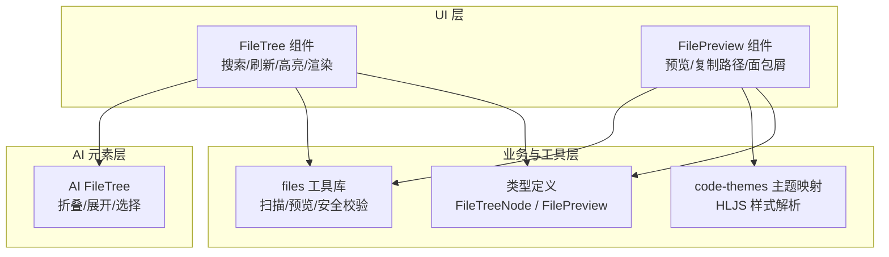
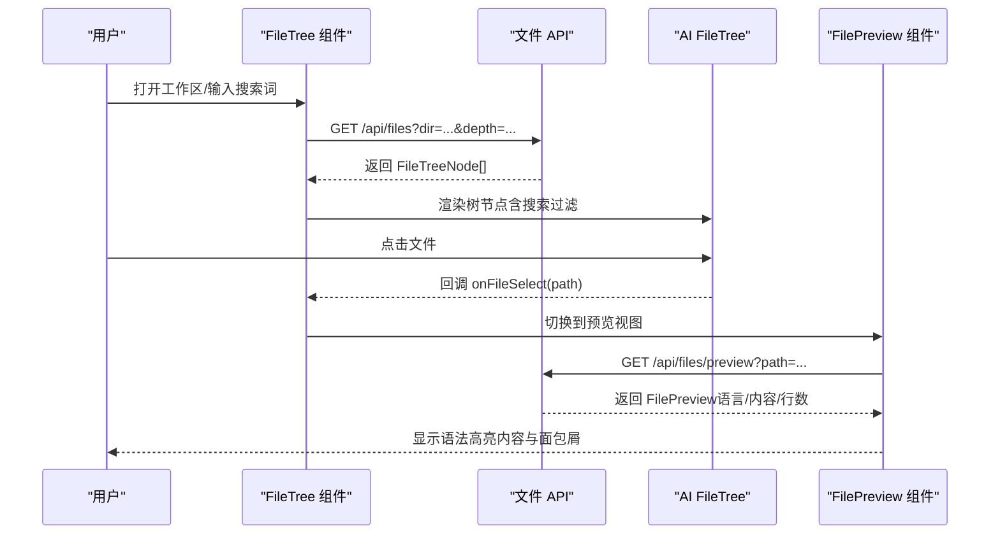
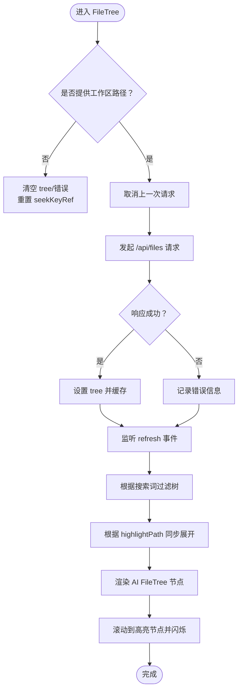
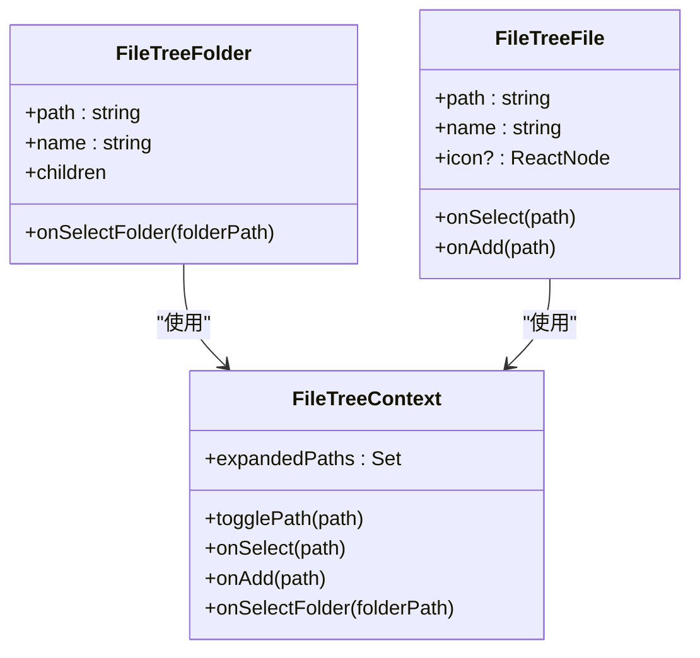
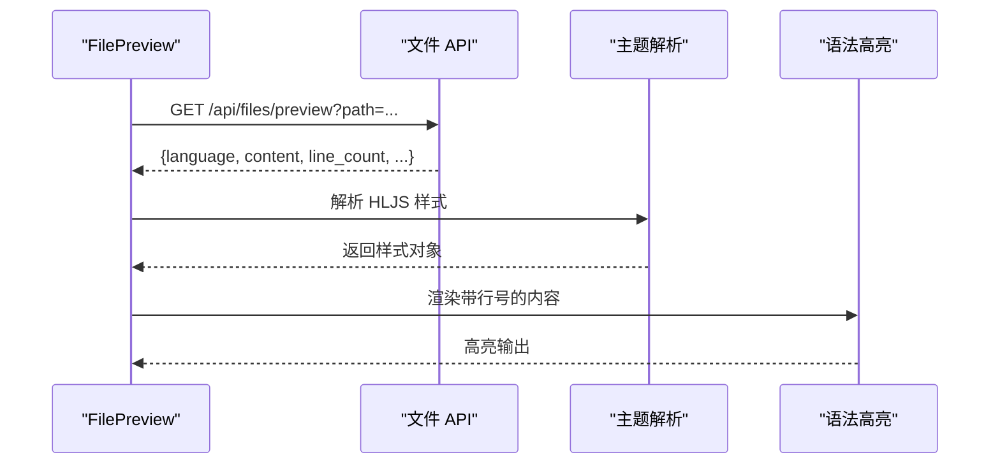
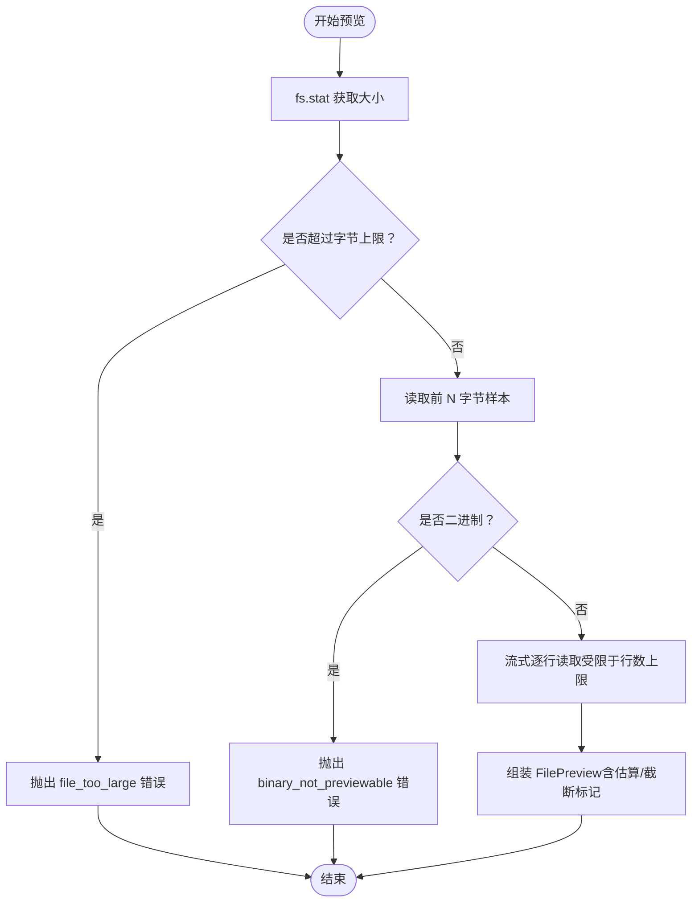
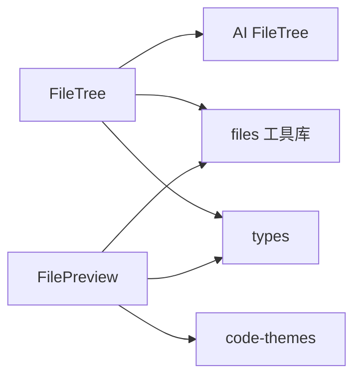

# 文件浏览器

<cite>
**本文引用的文件**
- [src/components/project/FileTree.tsx](file://src/components/project/FileTree.tsx)
- [src/components/project/FilePreview.tsx](file://src/components/project/FilePreview.tsx)
- [src/components/ai-elements/file-tree.tsx](file://src/components/ai-elements/file-tree.tsx)
- [src/lib/files.ts](file://src/lib/files.ts)
- [src/lib/theme/code-themes.ts](file://src/lib/theme/code-themes.ts)
- [src/types/index.ts](file://src/types/index.ts)
</cite>

## 目录
1. [简介](#简介)
2. [项目结构](#项目结构)
3. [核心组件](#核心组件)
4. [架构总览](#架构总览)
5. [详细组件分析](#详细组件分析)
6. [依赖关系分析](#依赖关系分析)
7. [性能考量](#性能考量)
8. [故障排查指南](#故障排查指南)
9. [结论](#结论)
10. [附录：配置与扩展](#附录配置与扩展)

## 简介
本章节面向 CodePilot 的“文件浏览器”能力，系统性说明文件树组件的实现原理、文件预览机制、语法高亮策略；详解文件类型识别、大文件处理策略、文件搜索与过滤；并覆盖文件操作（打开、预览、重命名、删除）的实现细节与用户体验优化。最后给出可配置项与自定义扩展建议。

## 项目结构
围绕文件浏览与预览的关键模块分布如下：
- UI 层
  - 项目侧文件树组件：负责搜索、刷新、高亮定位、渲染 AI 元素文件树
  - 预览面板：负责加载文件内容、语言识别、语法高亮、行号与面包屑
- AI 元素层
  - 可折叠文件树：提供文件/文件夹节点、选择与展开控制
- 业务与工具层
  - 文件扫描与预览：目录扫描、大小/二进制检测、行数上限与截断估算
  - 主题映射：代码主题解析与语法高亮样式选择
  - 类型定义：文件树节点、预览结果等数据模型

图表来源
- [src/components/project/FileTree.tsx:138-314](file://src/components/project/FileTree.tsx#L138-L314)
- [src/components/project/FilePreview.tsx:29-156](file://src/components/project/FilePreview.tsx#L29-L156)
- [src/components/ai-elements/file-tree.tsx:67-116](file://src/components/ai-elements/file-tree.tsx#L67-L116)
- [src/lib/files.ts:89-589](file://src/lib/files.ts#L89-L589)
- [src/lib/theme/code-themes.ts:145-181](file://src/lib/theme/code-themes.ts#L145-L181)
- [src/types/index.ts:40-62](file://src/types/index.ts#L40-L62)

章节来源
- [src/components/project/FileTree.tsx:1-314](file://src/components/project/FileTree.tsx#L1-L314)
- [src/components/project/FilePreview.tsx:1-156](file://src/components/project/FilePreview.tsx#L1-L156)
- [src/components/ai-elements/file-tree.tsx:1-344](file://src/components/ai-elements/file-tree.tsx#L1-L344)
- [src/lib/files.ts:1-589](file://src/lib/files.ts#L1-L589)
- [src/lib/theme/code-themes.ts:1-192](file://src/lib/theme/code-themes.ts#L1-L192)
- [src/types/index.ts:1-1321](file://src/types/index.ts#L1-L1321)

## 核心组件
- 文件树组件（FileTree）
  - 负责拉取后端文件树、搜索过滤、高亮定位、自动刷新、滚动到目标
  - 基于 AI 元素文件树进行渲染与交互
- 预览组件（FilePreview）
  - 拉取单文件预览内容，识别语言，按主题高亮，展示行数与字节数统计
- AI 文件树（AI FileTree）
  - 提供文件/文件夹节点、选择回调、添加按钮、展开状态管理
- 文件工具库（files）
  - 目录扫描、忽略规则、排序、大小统计、预览读取、二进制检测、行数上限与估算
- 代码主题映射（code-themes）
  - 解析当前主题家族，返回 HLJS 或 Prism 样式，用于语法高亮
- 类型定义（types）
  - FileTreeNode、FilePreview 等核心数据结构

章节来源
- [src/components/project/FileTree.tsx:138-314](file://src/components/project/FileTree.tsx#L138-L314)
- [src/components/project/FilePreview.tsx:29-156](file://src/components/project/FilePreview.tsx#L29-L156)
- [src/components/ai-elements/file-tree.tsx:67-116](file://src/components/ai-elements/file-tree.tsx#L67-L116)
- [src/lib/files.ts:89-589](file://src/lib/files.ts#L89-L589)
- [src/lib/theme/code-themes.ts:145-181](file://src/lib/theme/code-themes.ts#L145-L181)
- [src/types/index.ts:40-62](file://src/types/index.ts#L40-L62)

## 架构总览
文件浏览与预览的端到端流程如下：

图表来源
- [src/components/project/FileTree.tsx:154-202](file://src/components/project/FileTree.tsx#L154-L202)
- [src/components/ai-elements/file-tree.tsx:228-297](file://src/components/ai-elements/file-tree.tsx#L228-L297)
- [src/components/project/FilePreview.tsx:38-60](file://src/components/project/FilePreview.tsx#L38-L60)
- [src/lib/files.ts:487-589](file://src/lib/files.ts#L487-L589)

## 详细组件分析

### 文件树组件（FileTree）
- 数据获取与并发控制
  - 使用 AbortController 在切换工作区或重复请求时取消旧请求，避免竞态与跨会话污染
  - 成功响应后设置 tree，失败时记录错误信息
- 搜索与过滤
  - 支持按名称模糊匹配，递归保留命中节点及其祖先链
  - 过滤仅影响可见节点，不影响实际展开状态
- 高亮与滚动定位
  - 根据 highlightPath 计算父路径集合，确保展开到目标文件所在目录
  - 通过 id 定位 DOM 并平滑滚动至可视区域，带最大尝试次数防止无限等待
- 自动刷新
  - 监听窗口事件“refresh-file-tree”，在 AI 流结束后触发重新拉取
- 与 AI 文件树协作
  - 将 FileTreeNode 渲染为 FileTreeFolder/FileTreeFile，并透传选择、添加、选中文件夹等回调

图表来源
- [src/components/project/FileTree.tsx:148-258](file://src/components/project/FileTree.tsx#L148-L258)

章节来源
- [src/components/project/FileTree.tsx:138-314](file://src/components/project/FileTree.tsx#L138-L314)

### AI 文件树（AI FileTree）
- 折叠/展开
  - 内部维护展开集合，支持受控/非受控模式，暴露 onExpandedChange
- 选择与添加
  - 文件节点支持点击选择与“添加到聊天”按钮；文件夹节点点击同时切换展开与选中
- 可访问性
  - 键盘 Enter/Space 触发展开/选择
- 结构化上下文
  - 通过 Context 传递展开状态、选中路径、回调函数，降低 props 传递复杂度

图表来源
- [src/components/ai-elements/file-tree.tsx:26-116](file://src/components/ai-elements/file-tree.tsx#L26-L116)
- [src/components/ai-elements/file-tree.tsx:135-210](file://src/components/ai-elements/file-tree.tsx#L135-L210)
- [src/components/ai-elements/file-tree.tsx:228-297](file://src/components/ai-elements/file-tree.tsx#L228-L297)

章节来源
- [src/components/ai-elements/file-tree.tsx:1-344](file://src/components/ai-elements/file-tree.tsx#L1-L344)

### 文件预览组件（FilePreview）
- 加载与错误处理
  - 拉取 /api/files/preview，失败时展示错误与返回按钮
- 语言识别与主题
  - 从预览结果中读取 language，结合主题家族解析 HLJS 样式
- 面包屑与复制路径
  - 展示最近三层路径段；支持一键复制路径
- 内容渲染
  - 使用 react-syntax-highlighter 渲染，开启行号与自定义样式

图表来源
- [src/components/project/FilePreview.tsx:38-60](file://src/components/project/FilePreview.tsx#L38-L60)
- [src/lib/theme/code-themes.ts:174-181](file://src/lib/theme/code-themes.ts#L174-L181)

章节来源
- [src/components/project/FilePreview.tsx:29-156](file://src/components/project/FilePreview.tsx#L29-L156)
- [src/lib/theme/code-themes.ts:1-192](file://src/lib/theme/code-themes.ts#L1-L192)

### 文件类型识别与大文件处理
- 文件类型识别
  - 依据扩展名映射到语言标识，用于预览与语法高亮
- 大文件与二进制文件处理
  - 字节上限：超过阈值直接拒绝预览
  - 二进制检测：读取前若干字节，若不可打印比例过高则判定为二进制
  - 行数上限：不同扩展有默认上限，支持用户上限参数；超过则截断并估算总行数
  - 截断估算：基于文件大小与平均行字节数估算总行数，标记 truncated 与 line_count_exact

图表来源
- [src/lib/files.ts:487-589](file://src/lib/files.ts#L487-L589)

章节来源
- [src/lib/files.ts:21-72](file://src/lib/files.ts#L21-L72)
- [src/lib/files.ts:176-222](file://src/lib/files.ts#L176-L222)
- [src/lib/files.ts:487-589](file://src/lib/files.ts#L487-L589)

### 文件搜索与过滤
- 名称匹配
  - 不区分大小写，命中节点或其任意后代即保留整条路径
- 递归过滤
  - 对目录节点递归应用过滤逻辑，保持父子关系完整
- 实时反馈
  - 输入框变更即时生效，无需额外确认

章节来源
- [src/components/project/FileTree.tsx:69-86](file://src/components/project/FileTree.tsx#L69-L86)

### 文件操作（打开、预览、重命名、删除）
- 打开/预览
  - FileTree 通过 onSelect 回调通知上层选中文件；FilePreview 通过 /api/files/preview 获取内容
- 重命名/删除
  - 代码库中存在文件 I/O 辅助函数与错误类型，用于统一的安全校验与错误码映射，但具体路由实现不在已分析文件范围内
  - 安全校验包括：路径安全、根路径拒绝、被保护目录阻断、符号链接检测、Windows 保留名校验等
  - 错误码涵盖：路径不安全、根路径、符号链接、被保护目录、不存在、父目录不存在、非文件、非目录、目录非空、跨基目录、回收站不可用、无效文件名、写入失败等

章节来源
- [src/lib/files.ts:242-306](file://src/lib/files.ts#L242-L306)
- [src/lib/files.ts:348-365](file://src/lib/files.ts#L348-L365)
- [src/lib/files.ts:395-459](file://src/lib/files.ts#L395-L459)
- [src/lib/files.ts:461-485](file://src/lib/files.ts#L461-L485)
- [src/lib/files.ts:314-336](file://src/lib/files.ts#L314-L336)

## 依赖关系分析
- 组件耦合
  - FileTree 依赖 AI FileTree 进行渲染与交互；依赖 files 工具库进行目录扫描与预览
  - FilePreview 依赖 files 工具库进行预览读取；依赖 code-themes 进行主题解析
- 类型契约
  - FileTreeNode 与 FilePreview 作为前后端契约数据结构，贯穿 UI 与 API
- 外部依赖
  - react-syntax-highlighter（HLJS 样式）、next-themes、主题家族上下文

图表来源
- [src/components/project/FileTree.tsx:1-16](file://src/components/project/FileTree.tsx#L1-L16)
- [src/components/project/FilePreview.tsx:1-12](file://src/components/project/FilePreview.tsx#L1-L12)
- [src/components/ai-elements/file-tree.tsx:1-25](file://src/components/ai-elements/file-tree.tsx#L1-L25)
- [src/lib/files.ts:1-6](file://src/lib/files.ts#L1-L6)
- [src/lib/theme/code-themes.ts:1-12](file://src/lib/theme/code-themes.ts#L1-L12)
- [src/types/index.ts:40-62](file://src/types/index.ts#L40-L62)

章节来源
- [src/components/project/FileTree.tsx:1-16](file://src/components/project/FileTree.tsx#L1-L16)
- [src/components/project/FilePreview.tsx:1-12](file://src/components/project/FilePreview.tsx#L1-L12)
- [src/components/ai-elements/file-tree.tsx:1-25](file://src/components/ai-elements/file-tree.tsx#L1-L25)
- [src/lib/files.ts:1-6](file://src/lib/files.ts#L1-L6)
- [src/lib/theme/code-themes.ts:1-12](file://src/lib/theme/code-themes.ts#L1-L12)
- [src/types/index.ts:40-62](file://src/types/index.ts#L40-L62)

## 性能考量
- 目录扫描
  - 限制深度与忽略常见目录，避免遍历大型依赖目录
  - 排序：先目录后文件，同组内字母序，提升可读性
- 预览读取
  - 严格行数上限与字节上限，避免一次性加载超大文件
  - 二进制检测提前短路，减少无效 IO
  - 截断时以估算总行数替代全量统计，兼顾体验与性能
- UI 渲染
  - 搜索过滤仅影响可见节点，不改变展开状态
  - 高亮渲染采用行号与轻量样式，避免过度计算

## 故障排查指南
- 无法加载文件树
  - 检查工作区路径是否有效；确认网络请求是否被中断或返回错误
  - 关注控制台错误与 UI 中的错误提示
- 预览失败
  - 若提示“文件过大/二进制不可预览”，请调整文件或使用外部编辑器
  - 若提示“读取失败”，检查文件权限与是否存在
- 高亮异常
  - 确认语言识别是否正确；检查主题家族与暗/亮模式设置
- 搜索无结果
  - 确认搜索关键词大小写无关且需匹配文件名
- 刷新无效
  - 确保 AI 流结束后触发了“refresh-file-tree”事件

章节来源
- [src/components/project/FileTree.tsx:174-197](file://src/components/project/FileTree.tsx#L174-L197)
- [src/components/project/FilePreview.tsx:42-56](file://src/components/project/FilePreview.tsx#L42-L56)
- [src/lib/files.ts:228-233](file://src/lib/files.ts#L228-L233)
- [src/lib/files.ts:506-512](file://src/lib/files.ts#L506-L512)
- [src/lib/files.ts:523-529](file://src/lib/files.ts#L523-L529)

## 结论
CodePilot 的文件浏览器以清晰的分层设计实现了高效、可访问、可扩展的文件浏览与预览体验。通过严格的文件安全校验、合理的预览策略与主题映射，既保证了安全性，也兼顾了性能与可用性。后续可在 API 路由层面完善重命名/删除等操作的前端集成，并进一步优化大文件场景下的交互提示。

## 附录：配置与扩展
- 主题与语法高亮
  - 通过主题家族元数据与 resolveHljsStyle 获取 HLJS 样式，适配暗/亮模式
- 语言映射
  - 基于扩展名映射语言，便于预览与高亮
- 文件扫描与预览
  - 可通过调整行数上限、字节上限与忽略目录来优化性能与体验
- 扩展建议
  - 为 AI FileTree 增加右键菜单（新建、重命名、删除、打开外部编辑器）
  - 在 FilePreview 中增加“复制内容”“下载文件”等快捷操作
  - 为搜索增加正则/大小写敏感开关与结果计数提示
  - 在文件树中增加“最近访问/收藏”标签，提升导航效率

章节来源
- [src/lib/theme/code-themes.ts:145-181](file://src/lib/theme/code-themes.ts#L145-L181)
- [src/lib/files.ts:21-72](file://src/lib/files.ts#L21-L72)
- [src/lib/files.ts:89-164](file://src/lib/files.ts#L89-L164)
- [src/lib/files.ts:176-222](file://src/lib/files.ts#L176-L222)