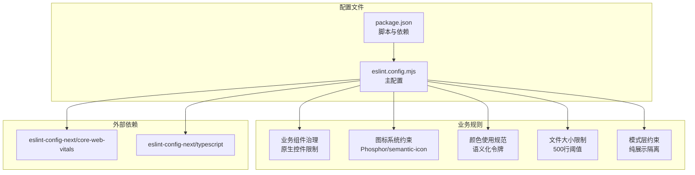
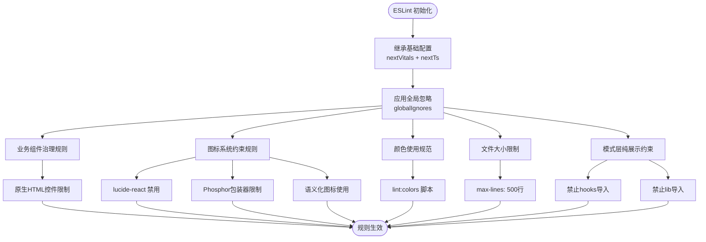
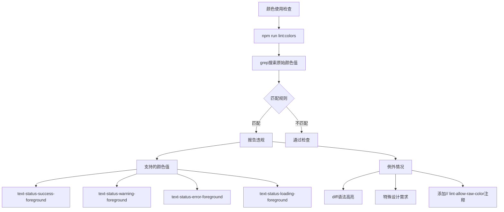
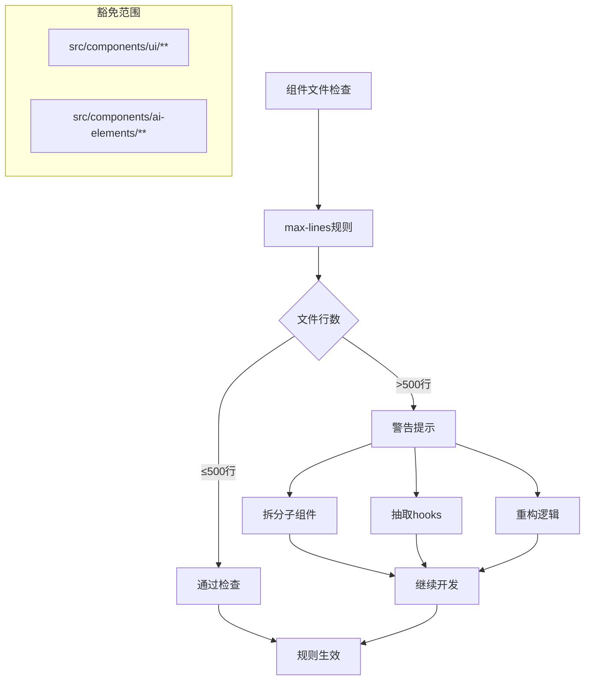
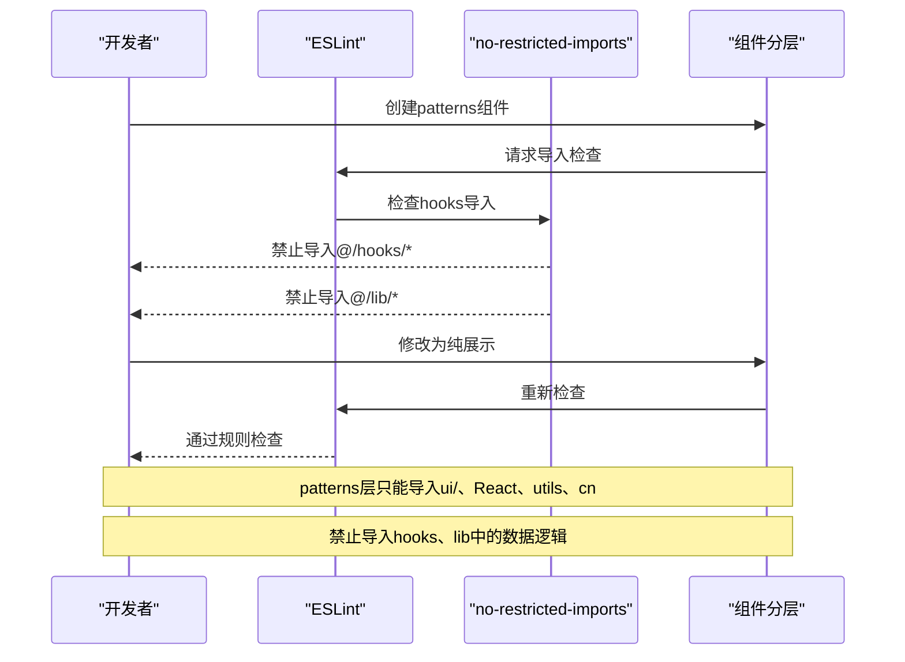
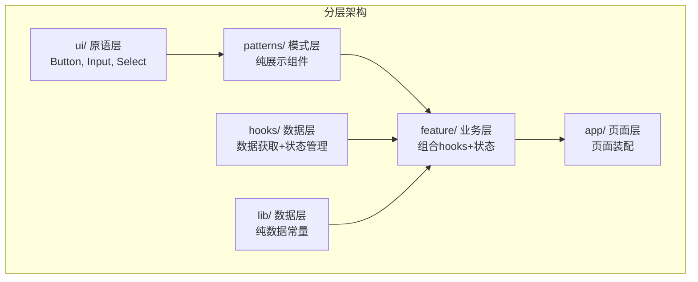
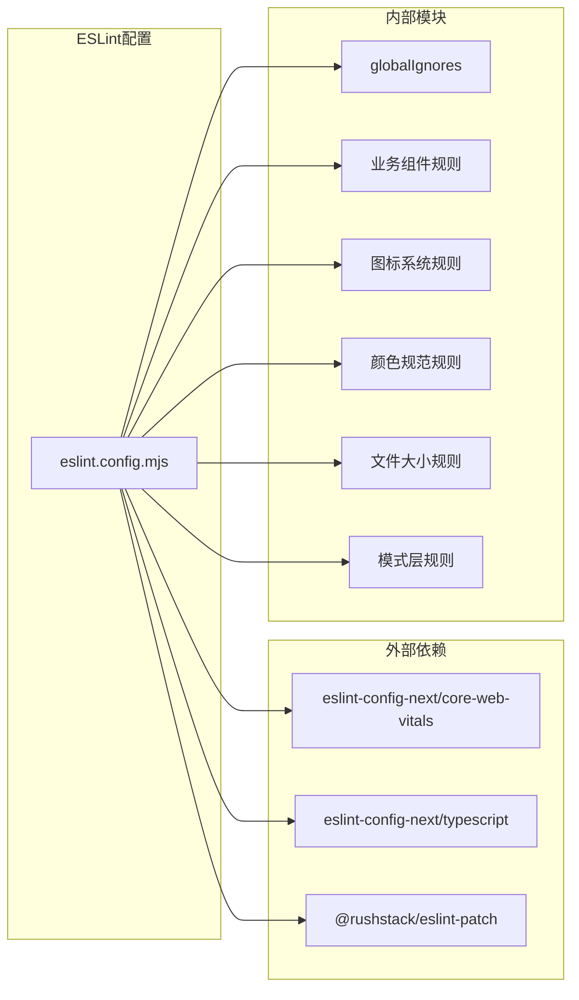

# ESLint 配置规范

<cite>
**本文档引用的文件**
- [eslint.config.mjs](file://eslint.config.mjs)
- [icon-system.md](file://docs/handover/icon-system.md)
- [ui-governance.md](file://docs/ui-governance.md)
- [package.json](file://package.json)
- [layout.tsx](file://src/app/design-system/layout.tsx)
</cite>

## 目录
1. [简介](#简介)
2. [项目结构](#项目结构)
3. [核心组件](#核心组件)
4. [架构概览](#架构概览)
5. [详细组件分析](#详细组件分析)
6. [依赖分析](#依赖分析)
7. [性能考虑](#性能考虑)
8. [故障排除指南](#故障排除指南)
9. [结论](#结论)
10. [附录](#附录)

## 简介
本规范文档详细说明了 CodePilot 项目的 ESLint 配置规则集，重点涵盖以下方面：
- nextVitals 与 nextTs 配置的继承关系与覆盖策略
- 业务组件治理规则（原生 HTML 控件使用限制、文件大小限制）
- 图标系统约束（Phosphor 与 Semantic Icon 的使用规范）
- 颜色使用规范（语义化颜色令牌与原始颜色值的限制）
- 关键规则 no-restricted-syntax、no-restricted-imports 的使用场景与例外情况
- 模式层纯展示约束的具体实施方法
- 自定义规则配置、忽略文件设置与规则覆盖策略

## 项目结构
ESLint 配置位于根目录的 `eslint.config.mjs` 文件中，采用现代 ESLint 配置格式，通过 `defineConfig` 与 `globalIgnores` 进行集中管理。



**图表来源**
- [eslint.config.mjs:1-196](file://eslint.config.mjs#L1-L196)
- [package.json:17-39](file://package.json#L17-L39)

**章节来源**
- [eslint.config.mjs:1-196](file://eslint.config.mjs#L1-L196)
- [package.json:1-157](file://package.json#L1-L157)

## 核心组件
本节概述 ESLint 配置中的四大核心组件及其职责：

### 1. 配置继承体系
- **nextVitals**: 继承 Next.js Core Web Vitals 性能指标相关规则
- **nextTs**: 继承 Next.js TypeScript 最佳实践规则
- **globalIgnores**: 覆盖默认忽略模式，添加项目特定的排除路径

### 2. 业务组件治理规则
针对业务组件（components/settings、components/bridge、components/chat 等）实施严格的组件使用规范，禁止直接使用原生 HTML 控件，强制使用统一的 UI 组件库。

### 3. 图标系统约束
实施三层图标使用策略：
- 项目级禁用：禁止直接导入 lucide-react
- 包装器级别：禁止从 @phosphor-icons/react 直接导入 Brain、Lightning、Terminal
- 语义化层：推荐使用 CodePilotIcon 作为统一入口

### 4. 颜色使用规范
通过专门的脚本进行颜色校验，禁止在业务组件中使用原始的颜色值（如 green-500、red-600 等），要求使用语义化颜色令牌。

**章节来源**
- [eslint.config.mjs:24-152](file://eslint.config.mjs#L24-L152)
- [eslint.config.mjs:154-169](file://eslint.config.mjs#L154-L169)

## 架构概览
ESLint 配置采用分层架构设计，确保规则的层次性和可维护性。



**图表来源**
- [eslint.config.mjs:5-193](file://eslint.config.mjs#L5-L193)

## 详细组件分析

### 业务组件治理规则
业务组件治理规则旨在统一组件使用标准，提升代码质量和一致性。

```mermaid
sequenceDiagram
participant Dev as "开发者"
participant ESLint as "ESLint"
participant Rule as "no-restricted-syntax"
participant UI as "UI组件库"
Dev->>ESLint : 编写业务组件
ESLint->>Rule : 检查原生HTML控件
Rule-->>Dev : 警告使用<button>
Rule-->>Dev : 警告使用<input>
Rule-->>Dev : 警告使用<select>
Rule-->>Dev : 警告使用<textarea>
Dev->>UI : 使用<Button>组件
UI-->>Dev : 提供统一样式
Dev->>UI : 使用<Input>组件
UI-->>Dev : 提供统一样式
Dev->>UI : 使用<Select>组件
UI-->>Dev : 提供统一样式
Dev->>UI : 使用<Textarea>组件
UI-->>Dev : 提供统一样式
```



**图表来源**
- [eslint.config.mjs:40-58](file://eslint.config.mjs#L40-L58)

#### 规则实施要点
- **适用范围**: settings、bridge、chat、gallery、plugins、skills、project、layout、cli-tools、app 等业务组件
- **违规类型**: 直接使用原生 button、input、select、textarea 元素
- **替代方案**: 强制使用 @/components/ui/ 目录下的统一组件
- **警告级别**: warn（不影响构建，但会提示改进）

**章节来源**
- [eslint.config.mjs:24-60](file://eslint.config.mjs#L24-L60)

### 图标系统约束
图标系统约束实施严格的三层控制策略，确保图标使用的统一性和一致性。

```mermaid
flowchart TD
A["图标导入请求"] --> B{"导入源类型"}
B --> |lucide-react| C["项目级禁用<br/>error级别"]
B --> |@phosphor-icons/react| D["包装器级别检查"]
B --> |CodePilotIcon| E["语义化图标使用<br/>推荐方案"]
D --> F{"导入名称"}
F --> |Brain/Lightning/Terminal| G["包装器禁用<br/>error级别"]
F --> |其他名称| H["允许导入<br/>但建议使用包装器"]
C --> I["错误阻止构建"]
G --> I
E --> J["通过规则检查"]
H --> J
```

**图表来源**
- [eslint.config.mjs:76-152](file://eslint.config.mjs#L76-L152)

#### 项目级禁用规则
- **禁用范围**: lucide-react 项目级禁用
- **适用范围**: 所有 src/**/*.{ts,tsx} 文件
- **违规行为**: 直接导入 lucide-react
- **处理方式**: error 级别，阻止构建
- **替代方案**: 使用 CodePilotIcon 语义化图标

#### 包装器级别限制
- **禁用范围**: 业务组件 + hooks + lib 目录
- **违规行为**: 从 @phosphor-icons/react 直接导入 Brain、Lightning、Terminal
- **处理方式**: warn 级别，提示使用语义化图标
- **原因**: Phase 7 已将这些图标映射到语义别名，避免语义混淆

#### 语义化图标使用
- **推荐方案**: 使用 CodePilotIcon 作为统一入口
- **优势**: 通过语义化别名实现图标与产品概念的解耦
- **映射关系**: Brain→memory, Lightning→runtime/skill/code, Terminal→terminal/cli

**章节来源**
- [eslint.config.mjs:76-152](file://eslint.config.mjs#L76-L152)
- [icon-system.md:125-136](file://docs/handover/icon-system.md#L125-L136)

### 颜色使用规范
颜色使用规范通过专门的脚本进行强制执行，确保颜色使用的语义化和一致性。



**图表来源**
- [eslint.config.mjs:154-158](file://eslint.config.mjs#L154-L158)
- [package.json:29](file://package.json#L29)

#### 颜色令牌规范
- **禁止使用**: 原始颜色值（如 green-500、red-600、blue-400-700）
- **推荐使用**: 语义化颜色令牌（text-status-系列）
- **例外处理**: 在确有必要时添加 `// lint-allow-raw-color` 注释

#### 实施策略
- **自动化检查**: 通过 npm 脚本进行批量检查
- **渐进式迁移**: 允许在特定场景下使用原始颜色值
- **团队协作**: 通过注释说明例外情况的原因

**章节来源**
- [eslint.config.mjs:154-158](file://eslint.config.mjs#L154-L158)
- [package.json:29](file://package.json#L29)

### 文件大小限制
组件文件大小限制确保单个组件文件不超过 500 行，提升代码可维护性。



**图表来源**
- [eslint.config.mjs:159-169](file://eslint.config.mjs#L159-L169)

#### 实施细节
- **阈值设置**: 500 行（跳过空白行和注释）
- **适用范围**: src/components/**/*.{ts,tsx}
- **豁免范围**: ui/ 和 ai-elements/ 层（独立原语库）
- **警告级别**: warn（不影响构建，但提示重构）

#### 重构指导
- **拆分子组件**: 将大组件拆分为多个小组件
- **抽取hooks**: 将复杂逻辑抽取为自定义hooks
- **功能分离**: 按功能模块重新组织代码

**章节来源**
- [eslint.config.mjs:159-169](file://eslint.config.mjs#L159-L169)
- [ui-governance.md:63-67](file://docs/ui-governance.md#L63-L67)

### 模式层纯展示约束
模式层约束确保 patterns 层组件保持纯展示特性，不包含数据逻辑。



**图表来源**
- [eslint.config.mjs:171-192](file://eslint.config.mjs#L171-L192)

#### 约束规则
- **禁止导入**: @/hooks/* 和 @/lib/*（除 @/lib/utils 外）
- **允许导入**: ui/、React、utils、cn
- **违规处理**: error 级别，阻止构建
- **适用范围**: src/components/patterns/**/*.{ts,tsx}

#### 分层架构


**图表来源**
- [ui-governance.md:3-11](file://docs/ui-governance.md#L3-L11)

**章节来源**
- [eslint.config.mjs:171-192](file://eslint.config.mjs#L171-L192)
- [ui-governance.md:13-21](file://docs/ui-governance.md#L13-L21)

## 依赖分析
ESLint 配置依赖于多个外部库和内部模块，形成完整的规则体系。



**图表来源**
- [eslint.config.mjs:1-3](file://eslint.config.mjs#L1-L3)

### 依赖关系分析
- **nextVitals**: 提供 Core Web Vitals 性能指标相关规则
- **nextTs**: 提供 TypeScript 最佳实践规则
- **globalIgnores**: 提供全局文件忽略模式
- **业务规则**: 自定义的业务组件治理规则
- **图标规则**: 图标系统的三层约束规则
- **颜色规则**: 颜色使用的语义化规范
- **文件大小规则**: 组件文件大小限制
- **模式层规则**: 组件分层约束规则

**章节来源**
- [eslint.config.mjs:1-22](file://eslint.config.mjs#L1-L22)

## 性能考虑
ESLint 配置在保证代码质量的同时，也考虑了性能优化：

### 规则执行效率
- **分层执行**: 按配置层级依次执行，避免重复检查
- **文件过滤**: 通过精确的文件匹配减少不必要的检查
- **缓存机制**: 利用 ESLint 内置缓存提升检查速度

### 构建集成
- **渐进式警告**: 大多数规则为 warn 级别，不影响构建速度
- **关键规则**: error 级别的规则（如 lucide-react 禁用）在 CI 中严格执行
- **脚本化检查**: 颜色检查通过 npm 脚本执行，避免在常规 ESLint 检查中造成性能负担

## 故障排除指南

### 常见问题与解决方案

#### 1. 图标导入违规
**问题**: 导入 lucide-react 或 @phosphor-icons/react 直接名称
**解决方案**: 
- 使用 CodePilotIcon 语义化图标
- 或使用 @/components/ui/icon 包装器组件

#### 2. 原生HTML控件警告
**问题**: 使用原生 button、input、select、textarea
**解决方案**: 使用 @/components/ui/ 对应组件

#### 3. 颜色使用错误
**问题**: 使用原始颜色值（如 green-500）
**解决方案**: 使用语义化颜色令牌（text-status-系列）

#### 4. 组件文件过大
**问题**: 单个组件超过 500 行
**解决方案**: 
- 拆分子组件
- 抽取自定义 hooks
- 重构复杂逻辑

#### 5. 模式层违规
**问题**: patterns 层导入 hooks 或 lib
**解决方案**: 
- 将数据逻辑移至 feature 层
- 使用 props 传递数据
- 保持 patterns 层纯展示特性

**章节来源**
- [eslint.config.mjs:40-192](file://eslint.config.mjs#L40-L192)

### 调试技巧
- **查看具体规则**: 使用 `eslint --print-config <file>` 查看生效的配置
- **临时禁用规则**: 在开发过程中可临时注释相关规则进行调试
- **增量检查**: 使用 `--fix` 参数自动修复可自动修复的问题

## 结论
本 ESLint 配置规范文档建立了完整的代码质量治理体系，通过四层架构确保：
- **统一性**: 通过业务组件治理和图标系统约束实现代码风格统一
- **可维护性**: 通过文件大小限制和模式层约束提升代码可维护性
- **一致性**: 通过颜色使用规范确保视觉设计一致性
- **可扩展性**: 通过清晰的分层架构支持未来的功能扩展

该配置体系不仅提升了代码质量，也为团队协作提供了明确的技术标准。

## 附录

### 规则配置速查表

| 规则类型 | 文件匹配 | 级别 | 主要作用 |
|---------|---------|------|---------|
| no-restricted-syntax | business components | warn | 禁止原生HTML控件 |
| no-restricted-imports | lucide-react | error | 项目级禁用Lucide |
| no-restricted-imports | @phosphor-icons/react | warn | 包装器级别限制 |
| max-lines | src/components/** | warn | 文件大小限制 |
| no-restricted-imports | patterns layer | error | 纯展示约束 |

### 相关文档链接
- [设计系统治理文档](file://docs/ui-governance.md)
- [图标系统交接文档](file://docs/handover/icon-system.md)
- [设计系统页面](file://src/app/design-system/layout.tsx)