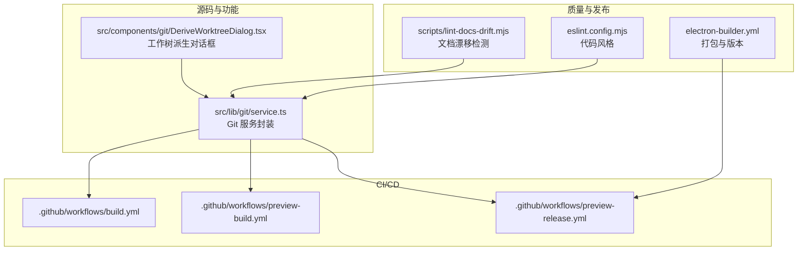
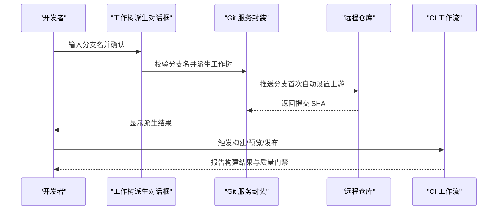
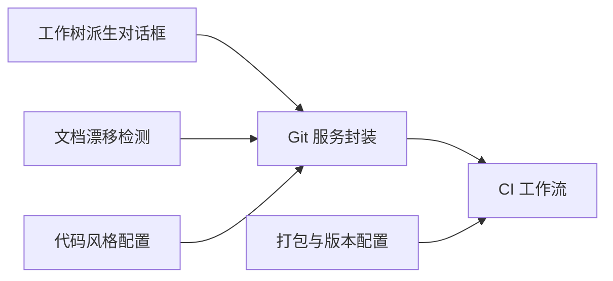

# Git 工作流规范

<cite>
**本文引用的文件**
- [src/lib/git/service.ts](file://src/lib/git/service.ts)
- [src/components/git/DeriveWorktreeDialog.tsx](file://src/components/git/DeriveWorktreeDialog.tsx)
- [.github/workflows/build.yml](file://.github/workflows/build.yml)
- [.github/workflows/preview-build.yml](file://.github/workflows/preview-build.yml)
- [.github/workflows/preview-release.yml](file://.github/workflows/preview-release.yml)
- [scripts/lint-docs-drift.mjs](file://scripts/lint-docs-drift.mjs)
- [electron-builder.yml](file://electron-builder.yml)
- [eslint.config.mjs](file://eslint.config.mjs)
- [RELEASE_NOTES.md](file://RELEASE_NOTES.md)
</cite>

## 目录
1. [引言](#引言)
2. [项目结构](#项目结构)
3. [核心组件](#核心组件)
4. [架构总览](#架构总览)
5. [详细组件分析](#详细组件分析)
6. [依赖关系分析](#依赖关系分析)
7. [性能考量](#性能考量)
8. [故障排查指南](#故障排查指南)
9. [结论](#结论)
10. [附录](#附录)

## 引言
本规范旨在统一团队在 Git 分支与提交层面的工作方式，明确分支命名约定、提交信息格式、代码审查流程、变更日志维护与版本标签管理，并配套冲突解决策略、合并请求规范与自动化检查工具配置，确保开发过程可追溯、可审计、可复现。

## 项目结构
本仓库采用多包/多应用结构，包含前端站点应用、桌面端应用、脚本工具与文档目录。与 Git 工作流相关的关键位置包括：
- 源码中的 Git 服务封装与工作树派生 UI（用于本地分支派生）
- GitHub Actions 工作流（构建、预览构建、预览发布）
- 文档漂移检测脚本（保障文档一致性）
- 发布与打包配置（版本号与产物管理）

图表来源
- [src/lib/git/service.ts:242-385](file://src/lib/git/service.ts#L242-L385)
- [src/components/git/DeriveWorktreeDialog.tsx:73-103](file://src/components/git/DeriveWorktreeDialog.tsx#L73-L103)
- [.github/workflows/build.yml](file://.github/workflows/build.yml)
- [.github/workflows/preview-build.yml](file://.github/workflows/preview-build.yml)
- [.github/workflows/preview-release.yml](file://.github/workflows/preview-release.yml)
- [scripts/lint-docs-drift.mjs:100-129](file://scripts/lint-docs-drift.mjs#L100-L129)
- [electron-builder.yml](file://electron-builder.yml)
- [eslint.config.mjs](file://eslint.config.mjs)

章节来源
- [src/lib/git/service.ts:242-385](file://src/lib/git/service.ts#L242-L385)
- [src/components/git/DeriveWorktreeDialog.tsx:73-103](file://src/components/git/DeriveWorktreeDialog.tsx#L73-L103)
- [.github/workflows/build.yml](file://.github/workflows/build.yml)
- [.github/workflows/preview-build.yml](file://.github/workflows/preview-build.yml)
- [.github/workflows/preview-release.yml](file://.github/workflows/preview-release.yml)
- [scripts/lint-docs-drift.mjs:100-129](file://scripts/lint-docs-drift.mjs#L100-L129)
- [electron-builder.yml](file://electron-builder.yml)
- [eslint.config.mjs](file://eslint.config.mjs)

## 核心组件
- Git 服务封装：提供提交、推送、分支派生、工作树派生等能力，并对分支名进行规范化处理，支持从提交输出中提取 SHA。
- 工作树派生 UI：提供交互式分支名输入与预览路径展示，便于本地快速派生新分支。
- CI/CD 工作流：定义构建、预览构建与预发布流程，作为质量门禁与发布前置条件。
- 文档漂移检测：通过脚本校验文档索引表结构与链接一致性，避免计划文档与实际状态脱节。
- 发布与打包：通过打包配置生成版本化产物，配合变更日志与标签完成发布闭环。

章节来源
- [src/lib/git/service.ts:242-385](file://src/lib/git/service.ts#L242-L385)
- [src/components/git/DeriveWorktreeDialog.tsx:73-103](file://src/components/git/DeriveWorktreeDialog.tsx#L73-L103)
- [.github/workflows/build.yml](file://.github/workflows/build.yml)
- [.github/workflows/preview-build.yml](file://.github/workflows/preview-build.yml)
- [.github/workflows/preview-release.yml](file://.github/workflows/preview-release.yml)
- [scripts/lint-docs-drift.mjs:100-129](file://scripts/lint-docs-drift.mjs#L100-L129)
- [electron-builder.yml](file://electron-builder.yml)
- [RELEASE_NOTES.md](file://RELEASE_NOTES.md)

## 架构总览
下图展示了从本地分支派生到 CI/CD 质量门禁与发布的整体流程：

图表来源
- [src/components/git/DeriveWorktreeDialog.tsx:73-103](file://src/components/git/DeriveWorktreeDialog.tsx#L73-L103)
- [src/lib/git/service.ts:242-385](file://src/lib/git/service.ts#L242-L385)
- [.github/workflows/build.yml](file://.github/workflows/build.yml)
- [.github/workflows/preview-build.yml](file://.github/workflows/preview-build.yml)
- [.github/workflows/preview-release.yml](file://.github/workflows/preview-release.yml)

## 详细组件分析

### 分支命名约定与使用场景
- 命名约定
  - 允许字符：字母、数字、点、斜杠、连字符与下划线
  - 连续特殊字符会被归一化为单个连字符，首尾的连字符会被移除
  - 分支名必须符合正则表达式要求，否则会触发错误
- 使用场景
  - feature 分支：用于新功能开发，建议以“feature/”前缀开头，便于识别与后续自动化处理
  - hotfix 分支：用于紧急修复线上问题，建议以“hotfix/”前缀开头
  - release 分支：用于发布前的最终验证与版本打标，建议以“release/”前缀开头
- 分支派生与规范化
  - 通过工作树派生对话框输入分支名，系统会进行合法性校验与规范化处理
  - 首次推送时若未设置上游，系统会自动设置并关联 origin 主分支

章节来源
- [src/lib/git/service.ts:375-385](file://src/lib/git/service.ts#L375-L385)
- [src/lib/git/service.ts:249-262](file://src/lib/git/service.ts#L249-L262)
- [src/components/git/DeriveWorktreeDialog.tsx:73-103](file://src/components/git/DeriveWorktreeDialog.tsx#L73-L103)

### 提交信息格式模板
- 提交信息应遵循“类型: 摘要”的结构，正文简述变更内容与动机，必要时附上影响范围与风险提示
- 类型建议包含：feat、fix、docs、style、refactor、perf、test、chore 等，便于自动生成变更日志与语义化版本判断
- 为保证一致性，建议在本地启用提交前钩子，对提交信息进行格式校验

章节来源
- [eslint.config.mjs](file://eslint.config.mjs)
- [scripts/lint-docs-drift.mjs:100-129](file://scripts/lint-docs-drift.mjs#L100-L129)

### 变更日志维护与版本标签管理
- 变更日志维护
  - 使用统一的变更日志文件记录每次发布的重要变更，便于回溯与用户沟通
  - 变更条目应包含变更类型、描述、影响面与修复编号（如适用）
- 版本标签管理
  - 打包配置中定义版本号与产物元数据，发布前确保标签与版本一致
  - 预发布流程通过 CI 工作流执行，完成后生成对应标签与制品

章节来源
- [RELEASE_NOTES.md](file://RELEASE_NOTES.md)
- [electron-builder.yml](file://electron-builder.yml)

### 代码审查流程与质量门禁
- 代码审查流程
  - 新功能与修复需创建合并请求（PR），至少一名审阅者批准后方可合并
  - 审查重点：功能正确性、边界条件、性能影响、安全与隐私、可测试性与可维护性
- 质量门禁
  - CI 工作流负责执行构建、测试与静态检查；仅当所有任务通过时允许合并
  - 预览构建与预发布流程分别用于阶段性验证与发布前最终验证

章节来源
- [.github/workflows/build.yml](file://.github/workflows/build.yml)
- [.github/workflows/preview-build.yml](file://.github/workflows/preview-build.yml)
- [.github/workflows/preview-release.yml](file://.github/workflows/preview-release.yml)

### 冲突解决策略
- 频繁同步主干：在长周期开发中定期 rebase 或 merge 主干分支，降低冲突规模
- 小步提交：将大改动拆分为多个小提交，便于定位与解决冲突
- 明确职责：对同一模块的多人协作需事先沟通，避免重复修改
- 工具辅助：优先使用 IDE 的合并工具与 Git 的 diff 功能，逐行核对差异
- 回滚与重做：冲突解决失败时，可基于最近一次干净提交进行重做，保留可追踪性

### 合并请求规范
- 标题与描述：标题简洁明确，描述包含背景、方案、测试要点与风险评估
- 关联问题：在描述中关联需求或缺陷编号，便于追踪
- 变更范围：限制 PR 的变更范围，避免无关改动污染审查视线
- 通过门禁：确保本地已通过全部自动化检查，CI 通过后再发起审查

### 自动化检查工具配置
- 提交信息校验：通过提交前钩子强制执行提交信息格式与规范
- 文档一致性检查：脚本扫描文档索引表，确保表格结构与链接有效
- 代码风格与规则：统一的 ESLint 配置贯穿项目，减少风格分歧带来的冲突

章节来源
- [scripts/lint-docs-drift.mjs:100-129](file://scripts/lint-docs-drift.mjs#L100-L129)
- [eslint.config.mjs](file://eslint.config.mjs)

## 依赖关系分析
- 组件耦合
  - 工作树派生 UI 依赖 Git 服务封装进行分支校验与派生
  - Git 服务封装与 CI 工作流共同决定分支推送与上游设置策略
  - 文档漂移检测脚本与发布流程共同维护文档与版本的一致性
- 外部依赖
  - CI 平台与打包工具链构成质量门禁与发布基础设施
  - 提交前钩子与代码风格配置形成统一的开发体验

图表来源
- [src/components/git/DeriveWorktreeDialog.tsx:73-103](file://src/components/git/DeriveWorktreeDialog.tsx#L73-L103)
- [src/lib/git/service.ts:242-385](file://src/lib/git/service.ts#L242-L385)
- [.github/workflows/build.yml](file://.github/workflows/build.yml)
- [.github/workflows/preview-build.yml](file://.github/workflows/preview-build.yml)
- [.github/workflows/preview-release.yml](file://.github/workflows/preview-release.yml)
- [scripts/lint-docs-drift.mjs:100-129](file://scripts/lint-docs-drift.mjs#L100-L129)
- [electron-builder.yml](file://electron-builder.yml)
- [eslint.config.mjs](file://eslint.config.mjs)

## 性能考量
- 分支派生与工作树操作：尽量在空闲分支上进行，避免频繁切换导致的缓存抖动
- CI 执行效率：将耗时任务拆分到独立步骤，利用缓存与并行执行缩短流水线时间
- 提交粒度：过小的提交会增加历史复杂度，过大提交难以审查；建议按功能边界拆分

## 故障排查指南
- 分支名不合法
  - 现象：派生分支时报错
  - 处理：检查是否包含非法字符或连续特殊字符，按约定进行规范化
- 推送失败（无上游）
  - 现象：首次推送报错
  - 处理：系统会自动设置上游并重试；若仍失败，检查远程仓库权限与网络
- CI 失败
  - 现象：构建/测试/检查任一步骤失败
  - 处理：根据失败日志定位问题，修复后重新触发对应工作流
- 文档索引异常
  - 现象：文档漂移检测脚本报错
  - 处理：修正表格结构与链接，确保每行三列且链接有效

章节来源
- [src/lib/git/service.ts:249-262](file://src/lib/git/service.ts#L249-L262)
- [src/lib/git/service.ts:375-385](file://src/lib/git/service.ts#L375-L385)
- [scripts/lint-docs-drift.mjs:100-129](file://scripts/lint-docs-drift.mjs#L100-L129)
- [.github/workflows/build.yml](file://.github/workflows/build.yml)
- [.github/workflows/preview-build.yml](file://.github/workflows/preview-build.yml)
- [.github/workflows/preview-release.yml](file://.github/workflows/preview-release.yml)

## 结论
本规范通过统一的分支命名、提交格式、审查流程与自动化检查，形成从本地开发到 CI/CD 发布的完整闭环。建议团队在日常工作中严格遵循，持续优化流程与工具，提升交付质量与效率。

## 附录
- 术语
  - feature 分支：新功能开发分支
  - hotfix 分支：紧急修复分支
  - release 分支：发布验证分支
  - 工作树：Git 工作树，用于在同一仓库内并行开发不同分支
- 参考文件
  - [src/lib/git/service.ts:242-385](file://src/lib/git/service.ts#L242-L385)
  - [src/components/git/DeriveWorktreeDialog.tsx:73-103](file://src/components/git/DeriveWorktreeDialog.tsx#L73-L103)
  - [.github/workflows/build.yml](file://.github/workflows/build.yml)
  - [.github/workflows/preview-build.yml](file://.github/workflows/preview-build.yml)
  - [.github/workflows/preview-release.yml](file://.github/workflows/preview-release.yml)
  - [scripts/lint-docs-drift.mjs:100-129](file://scripts/lint-docs-drift.mjs#L100-L129)
  - [electron-builder.yml](file://electron-builder.yml)
  - [eslint.config.mjs](file://eslint.config.mjs)
  - [RELEASE_NOTES.md](file://RELEASE_NOTES.md)