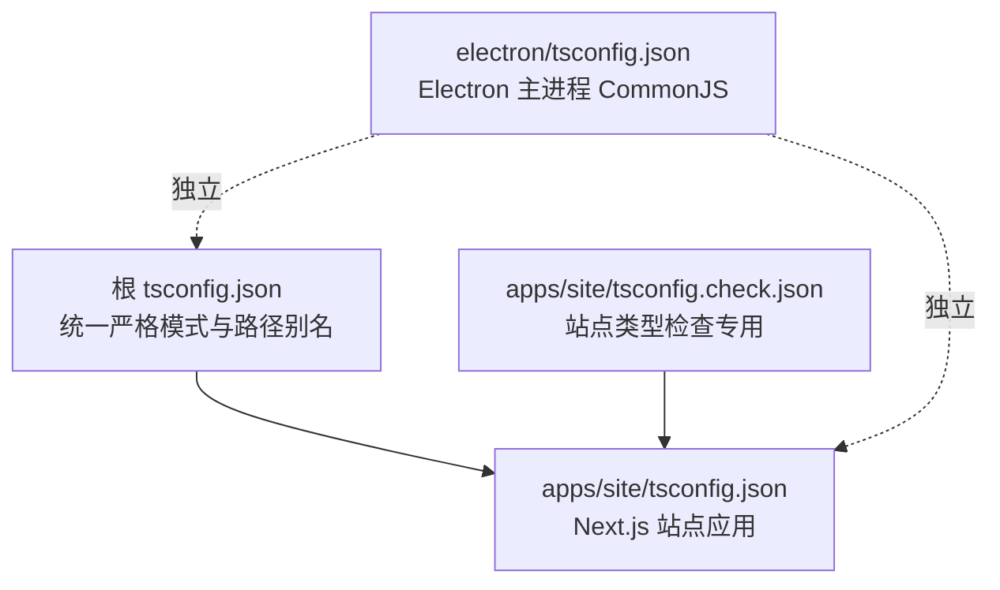
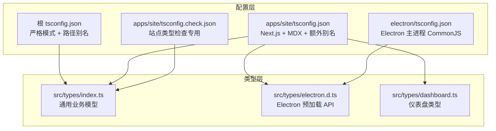
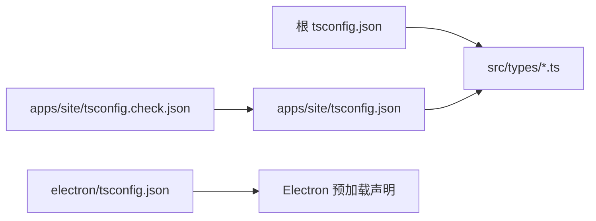

# TypeScript 编码标准

<cite>
**本文引用的文件**
- [tsconfig.json](file://tsconfig.json)
- [apps/site/tsconfig.json](file://apps/site/tsconfig.json)
- [apps/site/tsconfig.check.json](file://apps/site/tsconfig.check.json)
- [electron/tsconfig.json](file://electron/tsconfig.json)
- [src/types/index.ts](file://src/types/index.ts)
- [src/types/electron.d.ts](file://src/types/electron.d.ts)
- [src/types/dashboard.ts](file://src/types/dashboard.ts)
</cite>

## 目录
1. [引言](#引言)
2. [项目结构](#项目结构)
3. [核心组件](#核心组件)
4. [架构总览](#架构总览)
5. [详细组件分析](#详细组件分析)
6. [依赖分析](#依赖分析)
7. [性能考虑](#性能考虑)
8. [故障排查指南](#故障排查指南)
9. [结论](#结论)
10. [附录](#附录)

## 引言
本文件为本仓库的 TypeScript 编码标准与最佳实践指南，聚焦以下主题：
- tsconfig.json 配置选项与编译设置
- 类型定义规范、接口命名约定与泛型使用
- 类型安全原则、可选链与空值处理策略
- 类型推断优化、类型守卫与类型断言的安全使用
- 模块声明、路径映射与类型声明文件的组织规范

目标是帮助团队在大型多包/多应用（Next.js 应用、Electron 主进程、共享类型）环境中保持一致的类型系统设计与工程实践。

## 项目结构
本仓库包含多个 tsconfig.json 配置文件，分别服务于不同子系统：
- 根 tsconfig.json：统一的严格类型检查与路径别名配置，适用于 Next.js 应用与共享源码
- apps/site/tsconfig.json：站点应用的 Next.js 配置，包含 MDX 支持与额外路径映射
- apps/site/tsconfig.check.json：站点应用的类型检查专用配置（扩展根配置）
- electron/tsconfig.json：Electron 主进程的 CommonJS 配置，独立于 Web 应用

图表来源
- [tsconfig.json:1-47](file://tsconfig.json#L1-L47)
- [apps/site/tsconfig.json:1-46](file://apps/site/tsconfig.json#L1-L46)
- [apps/site/tsconfig.check.json:1-15](file://apps/site/tsconfig.check.json#L1-L15)
- [electron/tsconfig.json:1-12](file://electron/tsconfig.json#L1-L12)

章节来源
- [tsconfig.json:1-47](file://tsconfig.json#L1-L47)
- [apps/site/tsconfig.json:1-46](file://apps/site/tsconfig.json#L1-L46)
- [apps/site/tsconfig.check.json:1-15](file://apps/site/tsconfig.check.json#L1-L15)
- [electron/tsconfig.json:1-12](file://electron/tsconfig.json#L1-L12)

## 核心组件
- 类型定义集中管理：src/types 下按领域划分类型文件，如 index.ts（通用业务模型）、electron.d.ts（Electron 预加载 API）、dashboard.ts（仪表盘相关类型）
- 路径别名：通过 paths 统一使用 @/* 映射到 src/*
- 严格模式：启用 strict、skipLibCheck、noEmit 等，确保类型安全与构建稳定性
- 模块解析：Web 应用采用 bundler；Electron 使用 commonjs

章节来源
- [src/types/index.ts:1-800](file://src/types/index.ts#L1-L800)
- [src/types/electron.d.ts:1-138](file://src/types/electron.d.ts#L1-L138)
- [src/types/dashboard.ts:1-36](file://src/types/dashboard.ts#L1-L36)
- [tsconfig.json:21-23](file://tsconfig.json#L21-L23)

## 架构总览
类型系统与配置的协作关系如下：

图表来源
- [tsconfig.json:1-47](file://tsconfig.json#L1-L47)
- [apps/site/tsconfig.json:1-46](file://apps/site/tsconfig.json#L1-L46)
- [apps/site/tsconfig.check.json:1-15](file://apps/site/tsconfig.check.json#L1-L15)
- [electron/tsconfig.json:1-12](file://electron/tsconfig.json#L1-L12)
- [src/types/index.ts:1-800](file://src/types/index.ts#L1-L800)
- [src/types/electron.d.ts:1-138](file://src/types/electron.d.ts#L1-L138)
- [src/types/dashboard.ts:1-36](file://src/types/dashboard.ts#L1-L36)

## 详细组件分析

### tsconfig 配置与编译设置
- 目标与库：ES2017 及 dom/dom.iterable/esnext，满足现代浏览器与 Node 环境需求
- 严格性：开启 strict，提升类型安全性
- 输出控制：noEmit，配合构建工具输出
- 模块与解析：esnext + bundler，支持现代打包器的模块解析
- JSX：Web 应用使用 react-jsx；站点应用使用 preserve（由 Next/MDX 处理）
- 路径映射：@/* -> ./src/*
- 包含/排除：包含 ts/tsx/mdx 与 Next 类型目录，排除 node_modules、electron、dist-electron、scripts、apps、packages 等

章节来源
- [tsconfig.json:2-24](file://tsconfig.json#L2-L24)
- [tsconfig.json:25-45](file://tsconfig.json#L25-L45)
- [apps/site/tsconfig.json:2-32](file://apps/site/tsconfig.json#L2-L32)
- [apps/site/tsconfig.json:34-44](file://apps/site/tsconfig.json#L34-L44)
- [apps/site/tsconfig.check.json:1-14](file://apps/site/tsconfig.check.json#L1-L14)
- [electron/tsconfig.json:1-12](file://electron/tsconfig.json#L1-L12)

### 类型定义规范与接口命名约定
- 命名风格
  - 接口以大写 I 开头或直接使用名词（如 ChatSession），避免混用
  - 枚举/联合类型使用清晰语义命名（如 ChatSessionSource、TaskStatus）
  - 带可选字段的接口属性使用 ? 标记，明确可空性
- 字段可空性
  - 明确标注可选字段（如 codex_thread_id?），并在注释中说明访问约束与替代方案
  - 对于历史兼容字段，使用可选并提供迁移说明
- 嵌套结构
  - 使用接口分组表达复杂对象（如 ApiProvider、ProviderModelGroup）
  - 对 JSON 字符串字段，提供注释说明其结构（如 headers_json、env_overrides_json）

章节来源
- [src/types/index.ts:15-79](file://src/types/index.ts#L15-L79)
- [src/types/index.ts:279-301](file://src/types/index.ts#L279-L301)
- [src/types/index.ts:303-352](file://src/types/index.ts#L303-L352)

### 泛型使用最佳实践
- 在需要复用的结构中引入泛型，但避免过度抽象导致可读性下降
- 对于可能变化的数据形状，优先使用 Record/Array 等内置泛型容器
- 在类型守卫中结合泛型进行窄化，减少重复判断逻辑

（本节为通用指导，不直接分析具体文件）

### 类型安全原则
- 严格模式：启用 strict，确保未初始化变量、any 的使用受限
- 禁止隐式 any：通过严格模式与 ESLint 规则共同约束
- 不发出 JS：noEmit，避免运行时类型错误
- 跳过库检查：skipLibCheck，平衡第三方库质量与构建稳定性

章节来源
- [tsconfig.json:6-8](file://tsconfig.json#L6-L8)

### 可选链与空值处理策略
- 明确区分“不存在”和“未初始化”
  - 使用 ? 属性与可选字段，避免在调用链中出现未定义
  - 对外部输入（如 JSON 字段）进行解码后校验
- 安全访问
  - 优先使用可选链操作符（?.）与空值合并（??）处理不确定值
  - 对可能为空的全局对象（如 Electron 预加载 API）进行存在性检查

章节来源
- [src/types/index.ts:33-49](file://src/types/index.ts#L33-L49)
- [src/types/electron.d.ts:131-135](file://src/types/electron.d.ts#L131-L135)

### 类型推断优化、类型守卫与类型断言
- 类型推断优化
  - 将常量与字面量类型内联，减少中间变量的类型污染
  - 利用模板字面量与映射类型生成派生类型
- 类型守卫
  - 使用 typeof、in、自定义守卫函数对联合类型进行分支收敛
  - 对数组/对象使用 Array.isArray/Object.hasOwn 等原生守卫
- 类型断言
  - 仅在充分确保存在性时使用断言，且保留注释说明断言依据
  - 对 DOM/API 返回值进行断言前先做守卫

（本节为通用指导，不直接分析具体文件）

### 模块声明、路径映射与类型声明文件组织
- 路径映射
  - 使用 @/* 统一映射到 src，便于跨包/多应用引用
  - 站点应用额外提供 @/.source 到 .source/index.ts 的映射
- 类型声明文件
  - 将 Electron 预加载 API 声明放入独立 .d.ts 文件，避免污染实现文件
  - 仪表盘等特定领域的类型单独成文件，便于维护与复用
- 模块解析
  - Web 应用使用 bundler 解析，确保与打包器行为一致
  - Electron 主进程使用 commonjs，避免 ES 模块解析差异

章节来源
- [tsconfig.json:21-23](file://tsconfig.json#L21-L23)
- [apps/site/tsconfig.json:25-32](file://apps/site/tsconfig.json#L25-L32)
- [src/types/electron.d.ts:1-138](file://src/types/electron.d.ts#L1-L138)
- [src/types/dashboard.ts:1-36](file://src/types/dashboard.ts#L1-L36)
- [electron/tsconfig.json:3-8](file://electron/tsconfig.json#L3-L8)

## 依赖分析
类型与配置之间的耦合关系：
- Web 应用（Next.js）依赖根 tsconfig 的严格模式与路径别名
- 站点应用在 Web 基础上增加 MDX 支持与额外路径映射
- Electron 主进程使用独立 tsconfig，避免与 Web 应用产生模块解析冲突
- 类型文件通过路径别名被统一引用，降低模块路径硬编码风险

图表来源
- [tsconfig.json:1-47](file://tsconfig.json#L1-L47)
- [apps/site/tsconfig.json:1-46](file://apps/site/tsconfig.json#L1-L46)
- [apps/site/tsconfig.check.json:1-15](file://apps/site/tsconfig.check.json#L1-L15)
- [electron/tsconfig.json:1-12](file://electron/tsconfig.json#L1-L12)
- [src/types/index.ts:1-800](file://src/types/index.ts#L1-L800)
- [src/types/electron.d.ts:1-138](file://src/types/electron.d.ts#L1-L138)

章节来源
- [tsconfig.json:1-47](file://tsconfig.json#L1-L47)
- [apps/site/tsconfig.json:1-46](file://apps/site/tsconfig.json#L1-L46)
- [apps/site/tsconfig.check.json:1-15](file://apps/site/tsconfig.check.json#L1-L15)
- [electron/tsconfig.json:1-12](file://electron/tsconfig.json#L1-L12)
- [src/types/index.ts:1-800](file://src/types/index.ts#L1-L800)
- [src/types/electron.d.ts:1-138](file://src/types/electron.d.ts#L1-L138)

## 性能考虑
- 严格模式与跳过库检查的权衡：严格模式提升类型安全，skipLibCheck 减少第三方库类型带来的检查开销
- noEmit 与增量编译：noEmit 由构建工具负责输出，结合 incremental 提升开发体验
- 路径别名与模块解析：统一 @/* 映射减少相对路径长度，有利于缓存与增量编译

（本节为通用指导，不直接分析具体文件）

## 故障排查指南
- 构建报错与类型不匹配
  - 检查是否正确使用可选链与空值合并处理不确定值
  - 对外部 JSON 字段解码后进行守卫再使用
- Electron 预加载 API 访问异常
  - 确认窗口对象上的 electronAPI 是否存在，必要时添加存在性检查
- 路径解析失败
  - 核对 @/* 路径映射与实际文件位置
  - 站点应用额外确认 @/.source 映射是否正确

章节来源
- [src/types/electron.d.ts:131-135](file://src/types/electron.d.ts#L131-L135)
- [tsconfig.json:21-23](file://tsconfig.json#L21-L23)
- [apps/site/tsconfig.json:25-32](file://apps/site/tsconfig.json#L25-L32)

## 结论
本仓库的 TypeScript 编码标准围绕“严格类型、清晰路径、分层类型文件、安全的空值处理”展开。通过统一的 tsconfig 配置与模块化类型组织，确保在多应用与多包场景下保持一致的类型安全与可维护性。建议在新增模块时遵循本文档的命名、路径与类型声明规范，并在变更前进行类型检查与回归测试。

## 附录
- 术语表
  - 路径映射：通过 tsconfig 的 paths 将符号路径（如 @/*）映射到真实目录
  - 类型守卫：在运行时检查对象类型，缩小联合类型的范围
  - 可选链：使用 ?. 安全访问深层嵌套属性
  - 空值合并：使用 ?? 为未定义值提供默认值