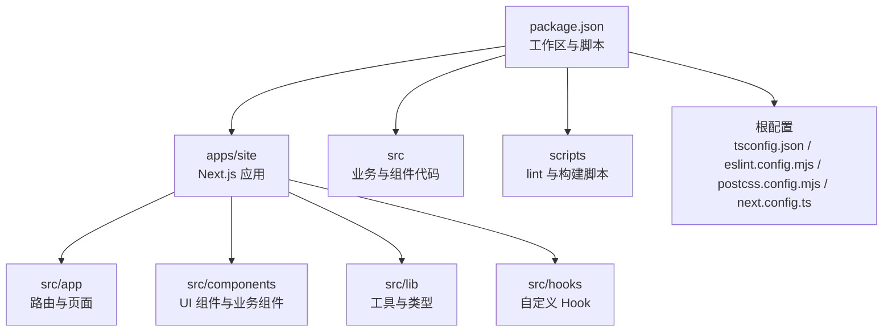
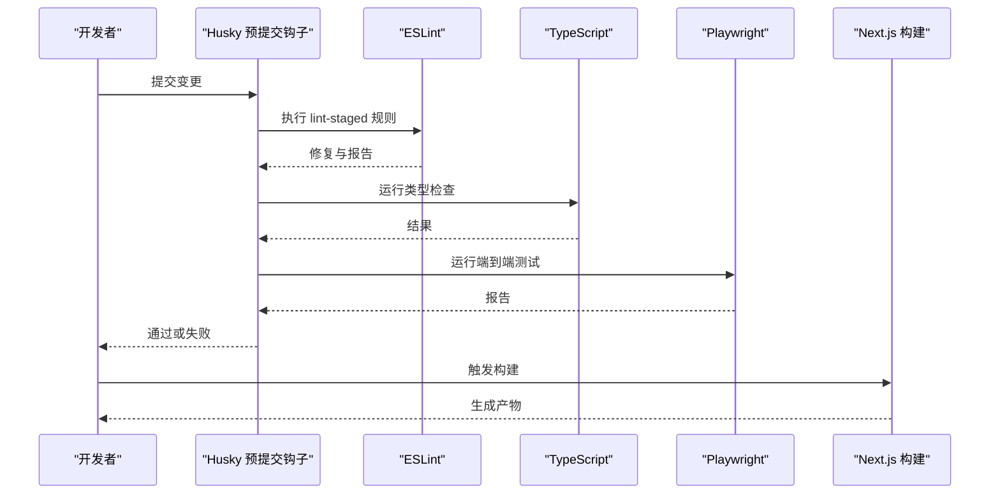
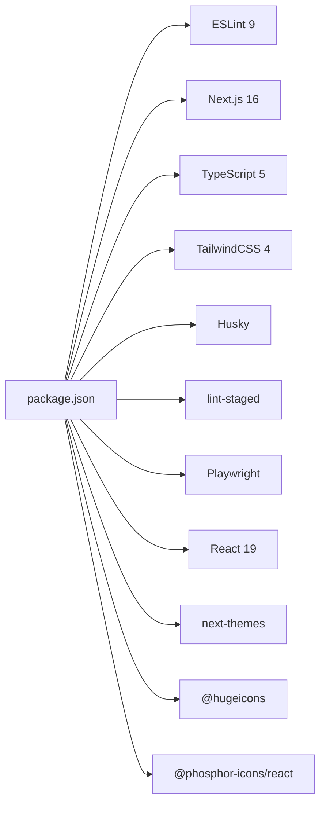

# 代码规范

<cite>
**本文引用的文件**
- [eslint.config.mjs](file://eslint.config.mjs)
- [tsconfig.json](file://tsconfig.json)
- [package.json](file://package.json)
- [.editorconfig](file://.editorconfig)
- [postcss.config.mjs](file://postcss.config.mjs)
- [next.config.ts](file://next.config.ts)
- [playwright.config.ts](file://playwright.config.ts)
- [scripts/lint-hooks.mjs](file://scripts/lint-hooks.mjs)
- [scripts/lint-docs-drift.mjs](file://scripts/lint-docs-drift.mjs)
</cite>

## 目录
1. [引言](#引言)
2. [项目结构](#项目结构)
3. [核心组件](#核心组件)
4. [架构总览](#架构总览)
5. [详细组件分析](#详细组件分析)
6. [依赖分析](#依赖分析)
7. [性能考虑](#性能考虑)
8. [故障排查指南](#故障排查指南)
9. [结论](#结论)
10. [附录](#附录)

## 引言
本文件为 CodePilot 的工程化与编码规范文档，覆盖 ESLint 规则、TypeScript 编码标准与命名约定、组件与文件组织、导入导出规则、React 组件与 Hook 最佳实践、状态管理约定、CSS 类名与样式组织、主题系统使用、Git 提交信息格式与分支命名、代码审查清单，以及自动化代码检查工具配置与自定义规则设置指引。目标是统一团队开发体验，提升可维护性与一致性。

## 项目结构
- 工程采用 Monorepo Workspace（通过工作区字段声明），主应用位于 apps/site，业务代码集中在 src 下，测试在 src/__tests__，脚本在 scripts。
- 核心工具链：Next.js 16（App Router）、TypeScript、ESLint（Flat Config）、TailwindCSS（PostCSS 插件）、Husky + lint-staged、Playwright。

图示来源
- [package.json:1-157](file://package.json#L1-L157)
- [tsconfig.json:1-47](file://tsconfig.json#L1-L47)
- [eslint.config.mjs:1-196](file://eslint.config.mjs#L1-L196)
- [postcss.config.mjs:1-8](file://postcss.config.mjs#L1-L8)
- [next.config.ts:1-101](file://next.config.ts#L1-L101)

章节来源
- [package.json:1-157](file://package.json#L1-L157)
- [tsconfig.json:1-47](file://tsconfig.json#L1-L47)
- [eslint.config.mjs:1-196](file://eslint.config.mjs#L1-L196)
- [postcss.config.mjs:1-8](file://postcss.config.mjs#L1-L8)
- [next.config.ts:1-101](file://next.config.ts#L1-L101)

## 核心组件
- ESLint 平台化配置：基于 Flat Config，继承 Next.js Core Web Vitals 与 TypeScript 规则，并进行业务域治理与图标体系约束。
- TypeScript 编译配置：严格模式、路径别名、模块解析策略、增量编译等。
- 构建与运行：Next.js Standalone 输出、内存缓存、Turbopack 工作区锚定、环境变量注入。
- 测试与质量：Playwright 端到端、lint-staged 与 Husky 预提交钩子、文档索引一致性校验脚本。

章节来源
- [eslint.config.mjs:1-196](file://eslint.config.mjs#L1-L196)
- [tsconfig.json:1-47](file://tsconfig.json#L1-L47)
- [next.config.ts:1-101](file://next.config.ts#L1-L101)
- [playwright.config.ts:1-32](file://playwright.config.ts#L1-L32)
- [package.json:17-38](file://package.json#L17-L38)

## 架构总览
下图展示从开发者提交到构建产物的关键流程，包括 ESLint 检查、预提交钩子、类型检查、端到端测试与打包。

图示来源
- [package.json:40-47](file://package.json#L40-L47)
- [scripts/lint-hooks.mjs:1-55](file://scripts/lint-hooks.mjs#L1-L55)
- [playwright.config.ts:1-32](file://playwright.config.ts#L1-L32)
- [next.config.ts:1-101](file://next.config.ts#L1-L101)

## 详细组件分析

### ESLint 配置与规则
- 基础规则
  - 继承 Next.js Core Web Vitals 与 TypeScript 规则，确保现代 Web 最佳实践与类型安全。
  - 自定义忽略范围覆盖默认忽略项，排除 apps/site 生成物与外部资料目录。
- 业务组件治理
  - 禁止直接使用原生 HTML 控件，要求使用统一 UI 组件库控件，以保证一致性与可访问性。
  - 对特定业务目录（如 settings、bridge、chat、gallery、plugins、skills、project、layout、cli-tools、app）实施更严格的限制。
- 图标体系治理（Phase 7）
  - 禁止引入 lucide-react；推荐使用语义层 CodePilotIcon（HugeIcons）。
  - 禁止直接从 @phosphor-icons/react 或 ui/icon 中按名称导入 Brain、Lightning、Terminal，防止跨语义污染。
  - 允许在 ui/icon 中使用结构性图标（如 CaretDown、CheckCircle、SpinnerGap 等）。
- 颜色使用治理
  - 不可在 className 字符串中直接使用原始状态色（如 green/red/yellow/orange/blue-{400-700}），需通过语义化类名或主题变量。
  - 如确有需要，可在该行添加注释标记以豁免（lint-allow-raw-color）。
- 文件大小限制
  - 业务组件文件最大行数限制为 500 行（跳过空行与注释），避免单文件膨胀。
- Patterns 层约束
  - Pattern 组件必须纯展示，禁止导入 hooks 与除 @/lib/utils 外的 lib 模块，仅允许使用 cn() 工具函数。

章节来源
- [eslint.config.mjs:5-196](file://eslint.config.mjs#L5-L196)

### TypeScript 编码标准与命名约定
- 编译选项
  - 目标版本与库：ES2017 与 dom/dom.iterable/esnext。
  - 严格模式开启，禁止 emit，启用 esModuleInterop 与 bundler 解析。
  - JSX 使用 react-jsx，路径别名为 @/* -> ./src/*。
  - 包含 next-env.d.ts 与所有 ts/tsx，排除 node_modules、electron、apps、packages 等目录。
- 命名约定
  - 组件文件：PascalCase（如 Button.tsx、ChatComposer.tsx）。
  - Hook 文件：useXxx.ts（如 useChat.ts、useToast.ts）。
  - 类型与接口：PascalCase（如 ChatState、MessagePayload）。
  - 常量：SCREAMING_SNAKE_CASE（如 MAX_RETRY）。
  - 变量与函数：camelCase（如 handleSend、isValid）。
  - 导出模块：默认导出用于组件，具名导出用于工具与常量。
- 路径与别名
  - 使用 @/src/* 别名，保持导入路径简洁且与工作区一致。

章节来源
- [tsconfig.json:1-47](file://tsconfig.json#L1-L47)

### 组件命名规范与文件组织
- 组件分类
  - UI 原子组件：src/components/ui（如 button、input、select、textarea）。
  - 业务组件：src/components/{feature}（如 chat、settings、bridge、plugins、skills、project、layout、cli-tools、git）。
  - 模式组件（Patterns）：src/components/patterns，纯展示层，禁止引入 hooks 与 lib。
  - AI 元素：src/components/ai-elements，Markdown/消息渲染相关。
- 文件命名
  - 组件文件：PascalCase.tsx；纯展示组件可使用同名目录内 index.tsx。
  - Hook 文件：useXxx.ts；工具函数：utils.ts。
  - 类型定义：types.ts 或在 index.ts 内导出。
- 目录组织
  - 按功能域分层：components/{feature}/**/*，避免跨域耦合。
  - 页面级组件：src/app/**/*，遵循 App Router 约定。

章节来源
- [eslint.config.mjs:24-60](file://eslint.config.mjs#L24-L60)
- [eslint.config.mjs:171-192](file://eslint.config.mjs#L171-L192)

### 导入导出规则
- 路径别名：统一使用 @/ 前缀，避免相对路径导致的脆弱性。
- 禁止跨层污染
  - business 组件禁止直接使用原生 HTML 控件与结构性图标。
  - patterns 层禁止导入 hooks 与 lib。
- 图标体系
  - 优先使用 CodePilotIcon（语义层），结构性图标使用 @/components/ui/icon。
  - 禁止直接导入 Brain/Lightning/Terminal（Phosphor 名称）。

章节来源
- [eslint.config.mjs:38-60](file://eslint.config.mjs#L38-L60)
- [eslint.config.mjs:76-152](file://eslint.config.mjs#L76-L152)
- [eslint.config.mjs:171-192](file://eslint.config.mjs#L171-L192)

### React 组件编写规范
- 结构与职责
  - 单一职责：每个组件聚焦单一功能，避免“上帝组件”。
  - 纯展示与逻辑分离：将副作用与状态迁移至 hooks，组件保持无副作用。
- Props 与类型
  - 明确 props 类型，必要时提供默认值与解构默认值。
  - 使用 TypeScript 接口描述复杂 props。
- 渲染优化
  - 合理使用 memo、useMemo、useCallback。
  - 避免在渲染期间创建新对象/数组。
- 事件处理
  - 将事件处理器上移至父组件或封装为自定义 Hook。
  - 避免在渲染中绑定方法。

章节来源
- [eslint.config.mjs:159-169](file://eslint.config.mjs#L159-L169)

### Hook 使用最佳实践
- 命名与位置
  - useXxx.ts 放置于 src/hooks，避免在组件中定义内联 Hook。
- 依赖与副作用
  - useEffect 中明确列出依赖，避免遗漏或过度依赖。
  - 将长耗时逻辑拆分为多个小 Hook，便于测试与复用。
- 数据流
  - 将异步数据与错误状态收敛到 hooks，组件只负责渲染。
- 测试
  - 为关键 Hook 编写单元测试，验证状态变化与副作用触发。

章节来源
- [eslint.config.mjs:171-192](file://eslint.config.mjs#L171-L192)

### 状态管理约定
- 全局状态
  - 优先使用 React Context 与自定义 hooks 组织状态，避免引入重型状态库。
  - 将副作用与网络请求封装在 hooks 中，组件仅消费状态。
- 本地状态
  - 使用 useState 管理 UI 状态；使用 useReducer 管理复杂状态机。
- 会话与持久化
  - 本地存储仅存放非敏感数据；敏感数据通过后端接口管理。
- 不要将 hooks 与 lib 导入混入 patterns 层。

章节来源
- [eslint.config.mjs:171-192](file://eslint.config.mjs#L171-L192)

### CSS 类名命名、样式组织与主题系统
- 类名与样式组织
  - 使用 TailwindCSS 语义化类名，避免在字符串中直接拼接颜色与尺寸。
  - 通过主题变量与 Tailwind 扩展实现主题切换。
- 颜色治理
  - 禁止在 className 中直接使用原始状态色；如确需豁免，需添加注释标记。
- 主题系统
  - 使用 next-themes 实现明暗主题切换；主题资源与变量在全局样式中集中管理。
- PostCSS 与 Tailwind
  - 通过 @tailwindcss/postcss 插件集成 Tailwind，确保样式按需生成。

章节来源
- [eslint.config.mjs:154-158](file://eslint.config.mjs#L154-L158)
- [package.json:96](file://package.json#L96)
- [postcss.config.mjs:1-8](file://postcss.config.mjs#L1-L8)

### Git 提交信息格式与分支命名
- 提交信息格式
  - 类型(scope): subject
  - 类型：feat、fix、docs、style、refactor、perf、test、chore、revert
  - scope：模块或目录（如 chat、ui、hooks、eslint）
  - subject：简短描述，不超过 50 字
- 分支命名
  - feat/description
  - fix/description
  - docs/description
  - refactor/description
  - chore/description
- 代码审查清单
  - 是否通过 ESLint、类型检查与端到端测试？
  - 是否更新了相关文档与执行计划索引？
  - 是否遵循组件与 Hook 命名、导入导出与文件大小限制？

章节来源
- [scripts/lint-docs-drift.mjs:1-146](file://scripts/lint-docs-drift.mjs#L1-L146)

### 自动化代码检查工具配置与自定义规则
- ESLint
  - 脚本：npm run lint 执行 ESLint；支持 --fix。
  - 颜色检查：npm run lint:colors 用于检测原始状态色使用。
  - Hook 校验：npm run lint:hooks 校验预提交钩子是否包含 CODEX_DISABLED=1。
  - 文档漂移检查：npm run lint:docs-drift 校验 docs/exec-plans/README.md 与索引一致性。
- lint-staged 与 Husky
  - 对 *.ts *.tsx 文件执行 eslint --fix。
  - 对 docs/exec-plans/**/*.md 执行文档漂移检查。
- Playwright
  - 端到端测试配置，支持截图对比与重试策略。
- Next.js
  - Standalone 输出、内存缓存、Turbopack 工作区锚定、实验特性限制以适配桌面应用场景。

章节来源
- [package.json:17-38](file://package.json#L17-L38)
- [package.json:40-47](file://package.json#L40-L47)
- [scripts/lint-hooks.mjs:1-55](file://scripts/lint-hooks.mjs#L1-L55)
- [scripts/lint-docs-drift.mjs:1-146](file://scripts/lint-docs-drift.mjs#L1-L146)
- [playwright.config.ts:1-32](file://playwright.config.ts#L1-L32)
- [next.config.ts:1-101](file://next.config.ts#L1-L101)

## 依赖分析
- 开发依赖
  - ESLint 9、Next.js 16、TypeScript 5、TailwindCSS 4、Husky、lint-staged、Playwright。
- 运行时依赖
  - React 19、Next-themes、@hugeicons、@phosphor-icons/react、Radix UI、AI SDK 等。
- 依赖治理
  - 通过 overrides 固定关键包版本，减少供应链风险。

图示来源
- [package.json:118-156](file://package.json#L118-L156)

章节来源
- [package.json:118-156](file://package.json#L118-L156)

## 性能考虑
- Next.js 构建与缓存
  - 使用 Standalone 输出，禁用磁盘缓存，改为内存缓存，避免安装目录写入权限问题。
  - 关闭 Turbopack 文件系统缓存，降低内存压力。
- 资源与网络
  - 外部包（native 模块、动态加载模块）作为 serverExternalPackages，避免打包失败。
- 测试与调试
  - CI 环境下限制 workers 数量与 retries，提高稳定性。

章节来源
- [next.config.ts:14-57](file://next.config.ts#L14-L57)
- [next.config.ts:61-97](file://next.config.ts#L61-L97)

## 故障排查指南
- ESLint 报错
  - 按提示修复规则冲突；对原生控件使用统一 UI 组件替代。
  - 对于颜色类报错，改用语义化类名或主题变量。
- 预提交失败
  - 确保 .husky/pre-commit 中测试命令携带 CODEX_DISABLED=1。
  - 使用 npm run lint:hooks 自检。
- 文档索引不一致
  - 使用 npm run lint:docs-drift 检查 docs/exec-plans/README.md 与 active/completed 目录一致性。
- 端到端测试失败
  - 检查 Playwright 配置与 baseURL，确保服务已启动。

章节来源
- [eslint.config.mjs:38-60](file://eslint.config.mjs#L38-L60)
- [eslint.config.mjs:154-158](file://eslint.config.mjs#L154-L158)
- [scripts/lint-hooks.mjs:1-55](file://scripts/lint-hooks.mjs#L1-L55)
- [scripts/lint-docs-drift.mjs:1-146](file://scripts/lint-docs-drift.mjs#L1-L146)
- [playwright.config.ts:1-32](file://playwright.config.ts#L1-L32)

## 结论
本规范围绕 ESLint、TypeScript、组件与文件组织、React/Hook 最佳实践、样式与主题、Git 流程与自动化工具展开，旨在统一团队开发行为、提升代码质量与可维护性。请在日常开发中严格遵守，并根据项目演进持续完善。

## 附录
- EditorConfig
  - 统一缩进（2 空格）、换行符（LF）、字符集（UTF-8）、尾随空白处理。
- Next.js 配置要点
  - Standalone 输出、内存缓存、Turbopack 工作区锚定、实验特性限制。
- Playwright 配置要点
  - 并行测试、重试策略、截图对比阈值、基地址可配置。

章节来源
- [.editorconfig:1-13](file://.editorconfig#L1-L13)
- [next.config.ts:14-57](file://next.config.ts#L14-L57)
- [playwright.config.ts:10-31](file://playwright.config.ts#L10-L31)