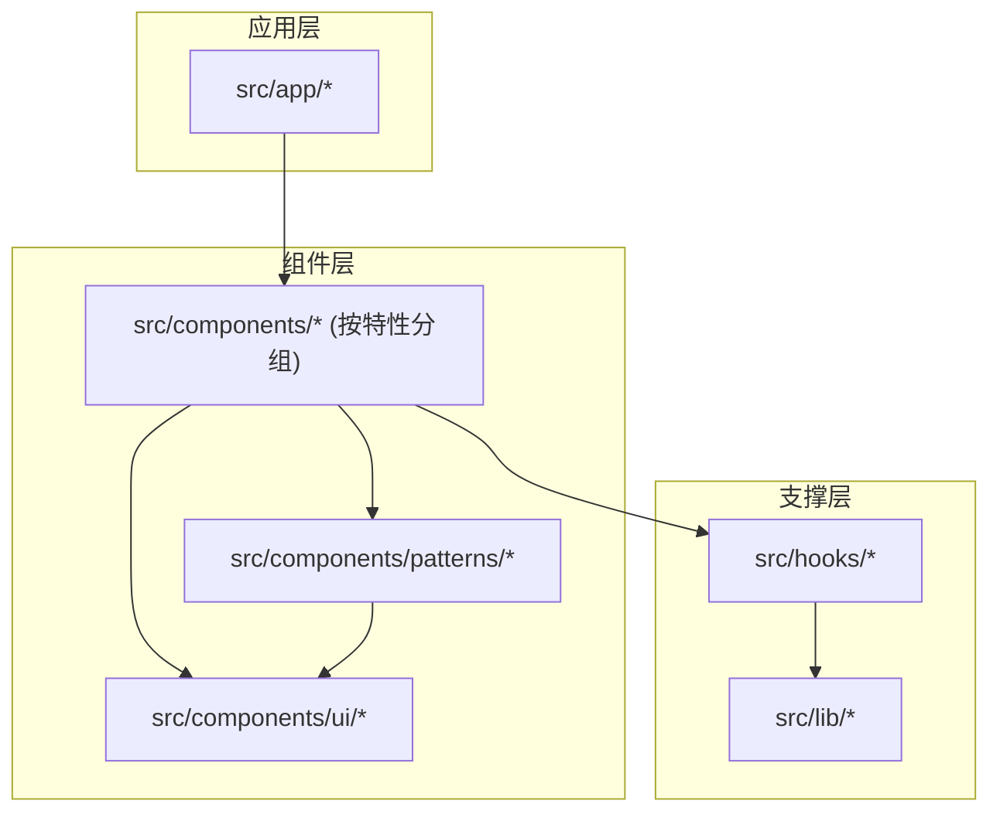
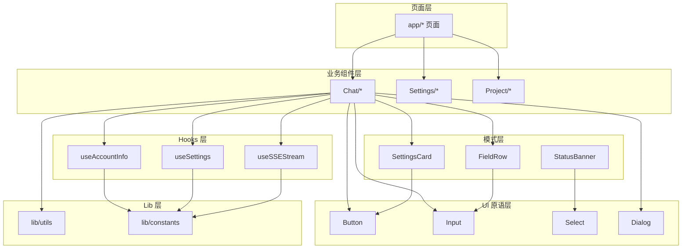
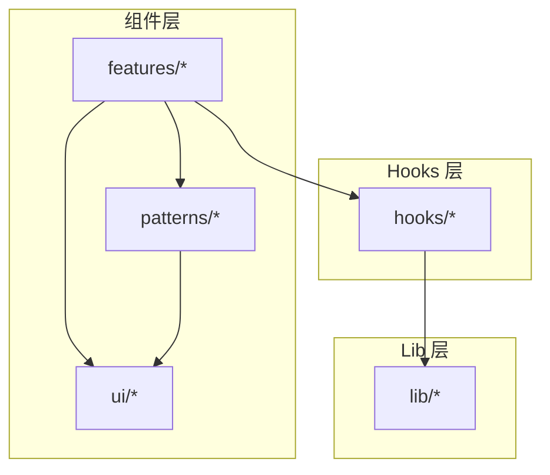

# 组件命名与组织规范

<cite>
**本文档引用的文件**
- [ui-governance.md](file://docs/handover/ui-governance.md)
- [eslint.config.mjs](file://eslint.config.mjs)
- [layout.tsx](file://apps/site/src/app/design-system/layout.tsx)
- [package.json](file://package.json)
- [package.json](file://apps/site/package.json)
</cite>

## 目录
1. [简介](#简介)
2. [项目结构](#项目结构)
3. [核心组件](#核心组件)
4. [架构总览](#架构总览)
5. [详细组件分析](#详细组件分析)
6. [依赖关系分析](#依赖关系分析)
7. [性能考量](#性能考量)
8. [故障排查指南](#故障排查指南)
9. [结论](#结论)
10. [附录](#附录)

## 简介
本规范旨在统一 React 组件的命名约定、文件与目录组织方式，并明确业务组件、UI 组件与模式组件的分类边界与命名规则。同时规范 hooks 命名、自定义 Hook 返回值约定、状态管理组件组织方式，以及组件导出策略（默认导出 vs 命名导出）。文档还涵盖组件复用性设计、单一职责原则与组件间依赖管理的最佳实践。

## 项目结构
根据现有治理文档与 ESLint 规则，项目采用“分层架构”组织组件与相关资源，确保职责清晰、依赖可控、可维护性强。

- src/components/ui/：纯 UI 原语（如 Button、Input、Select、Dialog 等），无副作用，仅负责视觉与基础交互。
- src/components/patterns/：复用型展示模式（如 SettingsCard、FieldRow、StatusBanner 等），零副作用，不引入 hooks 或业务逻辑。
- src/components/{feature}/：业务特性组件，组合 hooks、patterns 与业务状态，实现具体功能。
- src/app/：页面装配层，负责路由、布局与页面级逻辑。
- src/hooks/：数据获取与状态管理相关的自定义 hooks。
- src/lib/constants/：纯数据常量，不引用 UI 层。

图表来源
- [ui-governance.md:11-18](file://docs/handover/ui-governance.md#L11-L18)

章节来源
- [ui-governance.md:9-18](file://docs/handover/ui-governance.md#L9-L18)

## 核心组件
本节总结组件命名与组织的关键原则，结合现有治理文档与 ESLint 规则进行说明。

- 组件命名采用 PascalCase（首字母大写），以区分 React 组件与普通函数或变量。
- 文件命名采用 kebab-case（短横线分隔），便于在文件系统中排序与检索。
- 目录结构按“分层架构”组织：ui、patterns、各业务特性目录。
- 组件文件大小限制：非 ui/ 与非 ai-elements/ 的组件文件行数不超过 500 行（跳过空行与注释）。
- 模式组件（patterns）禁止引入 hooks 与业务库（仅允许使用 @/lib/utils 中的工具函数）。

章节来源
- [ui-governance.md:11-18](file://docs/handover/ui-governance.md#L11-L18)
- [eslint.config.mjs:159-195](file://eslint.config.mjs#L159-L195)

## 架构总览
下图展示了组件分层之间的依赖方向与职责边界，强调 patterns 层的纯展示定位与 hooks 的独立性。

图表来源
- [ui-governance.md:11-18](file://docs/handover/ui-governance.md#L11-L18)
- [eslint.config.mjs:171-192](file://eslint.config.mjs#L171-L192)

## 详细组件分析

### 组件分类与命名规范
- UI 原语（ui/）：命名采用 PascalCase，文件名采用 kebab-case。示例：Button、Input、Select、Dialog。
- 模式组件（patterns/）：命名采用 PascalCase，文件名采用 kebab-case。示例：SettingsCard、FieldRow、StatusBanner。该层禁止引入 hooks 与业务库。
- 业务组件（features/）：命名采用 PascalCase，文件名采用 kebab-case。示例：ChatMessageList、SettingsAppearance。该层可组合 ui、patterns、hooks 与业务状态。
- 页面组件（app/）：命名采用 PascalCase，文件名采用 kebab-case。示例：layout.tsx、page.tsx。

章节来源
- [ui-governance.md:11-18](file://docs/handover/ui-governance.md#L11-L18)

### hooks 命名约定与返回值规范
- hooks 命名采用 useXxx 形式，遵循“use + 动宾/名词”的约定，便于与其他组件区分。
- 自定义 hooks 的返回值应保持稳定的数据结构，避免频繁变更字段顺序或类型，确保调用方的解构与消费稳定。
- hooks 应尽量无副作用，避免直接操作 DOM 或发起网络请求；网络请求建议封装到 lib 层或通过参数注入。

章节来源
- [eslint.config.mjs:171-192](file://eslint.config.mjs#L171-L192)

### 状态管理组件组织
- 将状态管理逻辑集中在 hooks 层，避免在组件中直接处理复杂状态。
- 对于跨页面共享的状态，优先通过 hooks 抽象并在 app/ 布局中注入，减少组件间的耦合。
- 对于需要持久化的状态，建议在 lib 层提供存储适配器与读写接口，组件仅负责消费。

章节来源
- [ui-governance.md:11-18](file://docs/handover/ui-governance.md#L11-L18)

### 组件导出规范（默认导出 vs 命名导出）
- 对于单一职责且对外暴露明确的组件，推荐使用命名导出，便于按需引入与 Tree Shaking。
- 对于作为入口或聚合导出的模块，可使用默认导出，但需保证导出内容清晰、职责单一。
- 在 patterns 与 ui 层，建议统一使用命名导出，减少默认导出带来的歧义与打包体积问题。

章节来源
- [ui-governance.md:11-18](file://docs/handover/ui-governance.md#L11-L18)

### 组件复用性设计与单一职责原则
- 单一职责：每个组件只负责一种功能或一种展示形态，避免“巨无霸”组件。
- 可复用性：将通用逻辑抽象为 patterns，将通用样式与交互抽象为 ui 原语，业务组件仅关注业务组合。
- 参数化：通过 props 明确输入输出，避免硬编码与环境耦合。
- 依赖控制：严格遵守 patterns 层不引入 hooks 与业务库的规则，确保纯展示层的稳定性。

章节来源
- [ui-governance.md:11-18](file://docs/handover/ui-governance.md#L11-L18)
- [eslint.config.mjs:171-192](file://eslint.config.mjs#L171-L192)

### 组件间依赖管理规范
- 依赖方向：app → features → patterns → ui；hooks 独立于组件层，被组件层消费。
- 禁止环依赖：任何层之间不得形成循环引用，违反规则将触发 ESLint 错误。
- 图标与颜色：统一从 @/components/ui/icon 导入图标，颜色使用语义 token，避免硬编码色值。

章节来源
- [ui-governance.md:11-18](file://docs/handover/ui-governance.md#L11-L18)
- [eslint.config.mjs:171-192](file://eslint.config.mjs#L171-L192)

## 依赖关系分析
下图展示了组件层、hooks 层与 lib 层之间的依赖关系，强调 patterns 层的纯展示定位与 hooks 的独立性。

图表来源
- [ui-governance.md:11-18](file://docs/handover/ui-governance.md#L11-L18)
- [eslint.config.mjs:171-192](file://eslint.config.mjs#L171-L192)

章节来源
- [ui-governance.md:11-18](file://docs/handover/ui-governance.md#L11-L18)
- [eslint.config.mjs:171-192](file://eslint.config.mjs#L171-L192)

## 性能考量
- 文件大小限制：非 ui/ 与非 ai-elements/ 的组件文件行数不超过 500 行，有助于提升编译速度与可维护性。
- 按需引入：使用命名导出与 Tree Shaking，避免默认导出导致的打包体积膨胀。
- 纯展示层：patterns 层不引入 hooks 与业务库，降低渲染层的复杂度与重渲染风险。
- 图标与颜色：统一使用语义 token 与集中入口，减少重复计算与样式切换成本。

章节来源
- [eslint.config.mjs:159-195](file://eslint.config.mjs#L159-L195)
- [ui-governance.md:11-18](file://docs/handover/ui-governance.md#L11-L18)

## 故障排查指南
- ESLint 规则违规：
  - 禁止在业务组件与 app 层直接使用原生 HTML 控件，需改用 ui/ 组件。
  - 禁止直接导入 @phosphor-icons/react，需从 @/components/ui/icon 导入。
  - patterns 层禁止导入 hooks 与业务库（仅允许 @/lib/utils）。
  - 组件文件超过 500 行时，需拆分为更小的子组件。
- 设计系统参考：
  - 设计系统页面用于展示 patterns 与 UI 原语的参考用法，可在开发时对照使用。

章节来源
- [eslint.config.mjs:159-195](file://eslint.config.mjs#L159-L195)
- [ui-governance.md:22-31](file://docs/handover/ui-governance.md#L22-L31)
- [layout.tsx:1-17](file://apps/site/src/app/design-system/layout.tsx#L1-L17)

## 结论
通过分层架构与严格的命名、导出与依赖规则，项目实现了组件的高内聚、低耦合与强复用性。遵循本规范可有效避免常见反模式（如环依赖、巨无霸组件、混用原生控件等），提升团队协作效率与长期可维护性。

## 附录
- 项目根与站点应用的包配置文件可用于确认工作区与依赖范围。

章节来源
- [package.json](file://package.json)
- [package.json](file://apps/site/package.json)