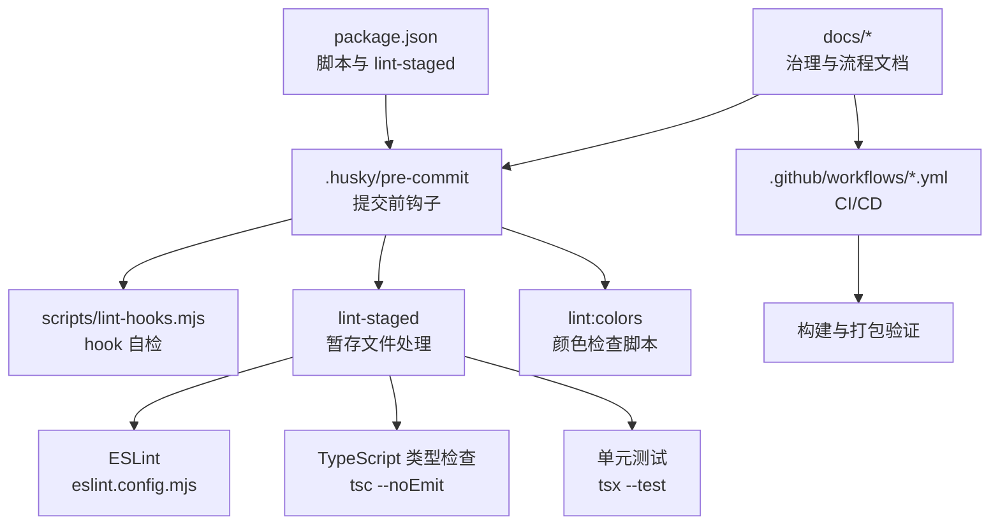
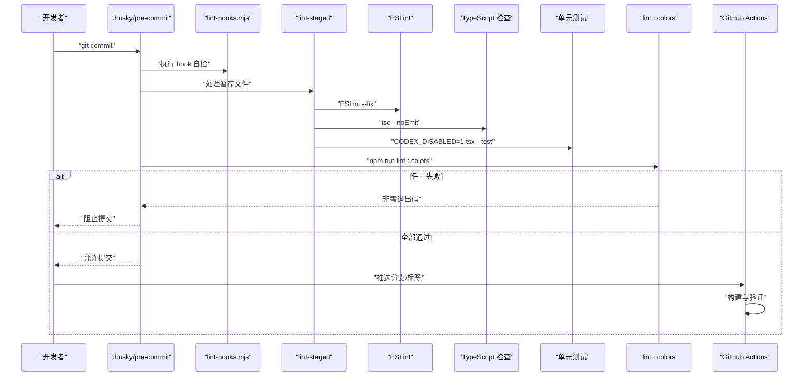
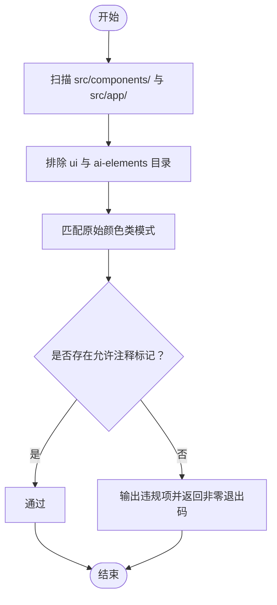
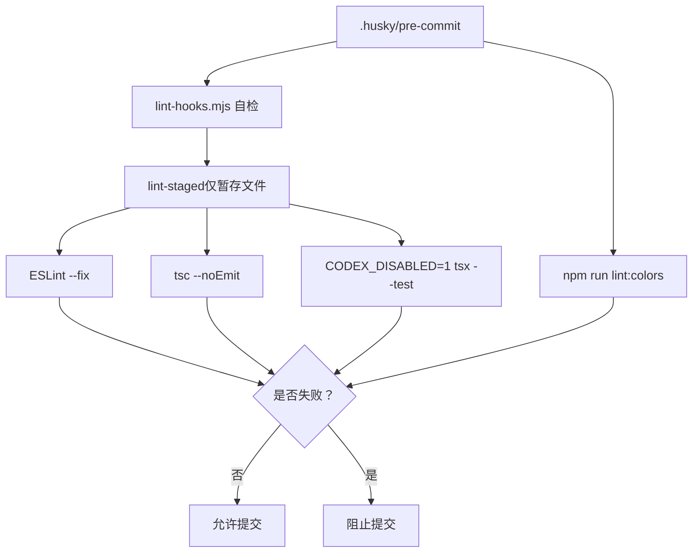
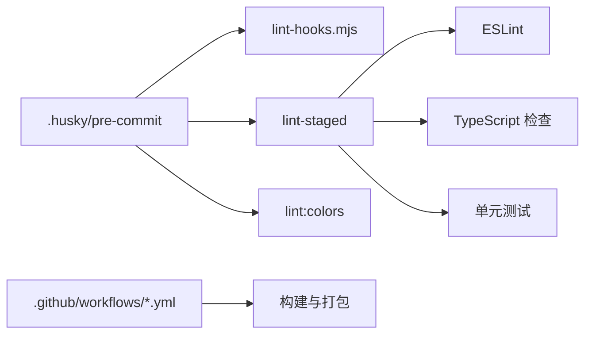

# 自动化检查工具

<cite>
**本文引用的文件**
- [eslint.config.mjs](file://eslint.config.mjs)
- [package.json](file://package.json)
- [scripts/lint-hooks.mjs](file://scripts/lint-hooks.mjs)
- [.husky/pre-commit](file://.husky/pre-commit)
- [.github/workflows/build.yml](file://.github/workflows/build.yml)
- [.github/workflows/preview-build.yml](file://.github/workflows/preview-build.yml)
- [src/__tests__/db-isolation.setup.ts](file://src/__tests__/db-isolation.setup.ts)
- [docs/handover/ui-governance.md](file://docs/handover/ui-governance.md)
- [docs/exec-plans/active/development-harness-optimization.md](file://docs/exec-plans/active/development-harness-optimization.md)
- [docs/exec-plans/completed/engineering-quality-assurance.md](file://docs/exec-plans/completed/engineering-quality-assurance.md)
- [docs/exec-plans/completed/post-refactor-cleanup.md](file://docs/exec-plans/completed/post-refactor-cleanup.md)
</cite>

## 目录
1. [简介](#简介)
2. [项目结构](#项目结构)
3. [核心组件](#核心组件)
4. [架构总览](#架构总览)
5. [组件详解](#组件详解)
6. [依赖关系分析](#依赖关系分析)
7. [性能考量](#性能考量)
8. [故障排查指南](#故障排查指南)
9. [结论](#结论)
10. [附录](#附录)

## 简介
本文件系统化梳理本仓库的自动化检查工具体系，重点覆盖以下方面：
- ESLint 颜色检查脚本（lint:colors）的使用方法与配置要点
- pre-commit hooks 的配置、代码格式化自动执行与错误修复流程
- 自动化测试触发条件、构建验证与部署前检查
- 自定义检查工具开发指南、检查规则扩展与性能优化建议
- CI/CD 集成配置、检查结果报告与问题定位工具使用方法

## 项目结构
围绕“检查工具”的关键文件分布如下：
- ESLint 配置与颜色检查脚本：eslint.config.mjs、package.json
- 提交前钩子与自检脚本：.husky/pre-commit、scripts/lint-hooks.mjs
- 测试隔离与稳定性保障：src/__tests__/db-isolation.setup.ts
- CI/CD 构建与预览工作流：.github/workflows/build.yml、.github/workflows/preview-build.yml
- 文档与治理：docs/handover/ui-governance.md、docs/exec-plans/active/development-harness-optimization.md、docs/exec-plans/completed/engineering-quality-assurance.md、docs/exec-plans/completed/post-refactor-cleanup.md

图表来源
- [package.json:17-47](file://package.json#L17-L47)
- [scripts/lint-hooks.mjs:1-54](file://scripts/lint-hooks.mjs#L1-L54)
- [eslint.config.mjs:1-196](file://eslint.config.mjs#L1-L196)

章节来源
- [package.json:17-47](file://package.json#L17-L47)
- [eslint.config.mjs:1-196](file://eslint.config.mjs#L1-L196)

## 核心组件
- ESLint 颜色检查脚本（lint:colors）
  - 作用：检测业务组件中是否使用了原始 Tailwind 颜色（如 green/emerald/red/orange/yellow/amber/blue 的 400–700），避免破坏统一的主题治理。
  - 使用方式：在本地或 CI 中执行 npm run lint:colors；若存在违规用法且未添加允许注释，则返回非零退出码。
  - 配置要点：仅扫描 src/components/ 与 src/app/，排除 ui 与 ai-elements；支持通过特定注释标记允许原始颜色的场景。

- pre-commit hooks
  - 由 Husky 在本地提交前触发，顺序执行：lint-hooks 自检、lint-staged、类型检查、单元测试。
  - 强制策略：通过 set -e 或命令链串联确保任一环节失败即阻止提交。
  - 重要保障：单元测试强制加上环境隔离开关，避免与开发服务器争用 SQLite 锁。

- lint-staged
  - 仅对暂存文件执行 ESLint 修复与文档漂移检查，降低提交耗时并聚焦变更范围。

- CI/CD 集成
  - 构建与预览工作流对版本号、依赖与运行时进行多道门禁校验，确保产物质量与可复现性。

章节来源
- [package.json:29](file://package.json#L29)
- [eslint.config.mjs:154-158](file://eslint.config.mjs#L154-L158)
- [scripts/lint-hooks.mjs:1-54](file://scripts/lint-hooks.mjs#L1-L54)
- [package.json:40-47](file://package.json#L40-L47)
- [.github/workflows/build.yml:1-46](file://.github/workflows/build.yml#L1-L46)
- [.github/workflows/preview-build.yml:60-93](file://.github/workflows/preview-build.yml#L60-L93)

## 架构总览
下图展示从本地提交到 CI 的自动化检查流水线，以及颜色检查在其中的位置与交互。

图表来源
- [scripts/lint-hooks.mjs:1-54](file://scripts/lint-hooks.mjs#L1-L54)
- [package.json:40-47](file://package.json#L40-L47)
- [package.json:21-28](file://package.json#L21-L28)
- [package.json:29](file://package.json#L29)
- [.github/workflows/build.yml:1-46](file://.github/workflows/build.yml#L1-L46)

## 组件详解

### ESLint 颜色检查脚本（lint:colors）
- 目标与范围
  - 识别业务组件中直接使用 Tailwind 原始颜色类（如 bg/text/border-green-500 等）的行为，要求统一通过语义化图标与颜色 token 使用。
  - 仅扫描 src/components/ 与 src/app/，排除 ui 与 ai-elements，避免误报。
- 允许例外
  - 若确需使用原始颜色（例如差异高亮等），可在该行添加特定注释标记以豁免本次检查。
- 执行方式
  - 本地：npm run lint:colors
  - CI：可在工作流中复用相同命令作为 Gate。

图表来源
- [package.json:29](file://package.json#L29)
- [eslint.config.mjs:154-158](file://eslint.config.mjs#L154-L158)

章节来源
- [package.json:29](file://package.json#L29)
- [eslint.config.mjs:154-158](file://eslint.config.mjs#L154-L158)
- [docs/handover/ui-governance.md:42](file://docs/handover/ui-governance.md#L42)
- [docs/handover/ui-governance.md:54](file://docs/handover/ui-governance.md#L54)
- [docs/handover/ui-governance.md:141](file://docs/handover/ui-governance.md#L141)

### pre-commit hooks 配置与执行流程
- 钩子职责
  - lint-hooks.mjs：校验 .husky/pre-commit 是否在测试命令行中携带必要的隔离开关，防止与开发服务器争用资源。
  - lint-staged：仅对暂存文件执行 ESLint 修复、文档漂移检查与类型检查。
  - 单元测试：在隔离环境下运行，避免共享数据库导致的 flaky。
- 强制策略
  - 通过 set -e 或命令链串联，确保任一环节失败即阻止提交。
- 与 lint:colors 的衔接
  - 在 lint-staged 之后执行 npm run lint:colors，形成“格式化修复 + 类型检查 + 单测 + 颜色检查”的完整闭环。

图表来源
- [scripts/lint-hooks.mjs:1-54](file://scripts/lint-hooks.mjs#L1-L54)
- [package.json:40-47](file://package.json#L40-L47)
- [package.json:21-28](file://package.json#L21-L28)
- [package.json:29](file://package.json#L29)

章节来源
- [scripts/lint-hooks.mjs:1-54](file://scripts/lint-hooks.mjs#L1-L54)
- [package.json:40-47](file://package.json#L40-L47)
- [docs/exec-plans/completed/engineering-quality-assurance.md:38](file://docs/exec-plans/completed/engineering-quality-assurance.md#L38)
- [docs/exec-plans/completed/post-refactor-cleanup.md:138](file://docs/exec-plans/completed/post-refactor-cleanup.md#L138)

### 代码格式化自动执行与错误修复流程
- lint-staged 配置
  - 对 TypeScript/TSX 文件执行 ESLint --fix；对 docs/exec-plans 下的 Markdown 文件执行文档漂移检查脚本。
- 修复与回滚
  - 修复后的文件重新加入暂存区，确保提交前干净。
- 与颜色检查的关系
  - 颜色检查独立于 lint-staged，作为额外 Gate 在提交前执行，避免原始颜色绕过修复流程。

章节来源
- [package.json:40-47](file://package.json#L40-L47)

### 自动化测试触发条件、构建验证与部署前检查
- 触发条件
  - 本地：git commit（pre-commit）
  - CI：推送分支/标签，或手动触发工作流
- 构建验证
  - 版本一致性、运行时参数门禁、依赖与二进制兼容性等多道 Gate。
- 部署前检查
  - 预览构建对版本号进行严格校验，并在构建前对源码进行多项验证，拒绝陈旧版本预览。

章节来源
- [.github/workflows/build.yml:1-46](file://.github/workflows/build.yml#L1-L46)
- [.github/workflows/preview-build.yml:60-93](file://.github/workflows/preview-build.yml#L60-L93)

### 自定义检查工具开发指南
- 开发步骤
  - 在 scripts/ 下新增脚本，遵循“失败即阻止提交”的原则，返回非零退出码。
  - 将脚本集成至 .husky/pre-commit 或 lint-staged，确保与现有流程一致。
- 规则扩展
  - 对于 ESLint 无法覆盖的场景（如颜色检查），可通过独立脚本补充 Gate。
  - 对于需要跨文件的静态分析，建议采用 grep/正则或专用工具，保持可读与可维护。
- 性能优化
  - 仅对暂存文件处理（lint-staged）；按需分组命令，避免不必要的重复执行。
  - 将重型检查（如全量测试）限制在 CI，本地保留轻量 Gate。

章节来源
- [scripts/lint-hooks.mjs:1-54](file://scripts/lint-hooks.mjs#L1-L54)
- [package.json:40-47](file://package.json#L40-L47)

### 检查规则扩展与治理
- ESLint 规则扩展
  - 可在 eslint.config.mjs 中新增文件匹配与规则集，覆盖新的业务目录或引入第三方规则集。
  - 注意区分“业务组件”与“UI 原子组件”，避免对原子组件施加过度约束。
- 文档与流程治理
  - 通过文档明确颜色治理、图标治理与提交流程，确保团队共识与可追溯性。

章节来源
- [eslint.config.mjs:24-193](file://eslint.config.mjs#L24-L193)
- [docs/handover/ui-governance.md:42](file://docs/handover/ui-governance.md#L42)

## 依赖关系分析
- 组件耦合
  - .husky/pre-commit 依赖 lint-hooks.mjs 与 lint-staged；lint-staged 依赖 ESLint、TypeScript 与单元测试。
  - lint:colors 作为独立 Gate，与上述流程并行但不互相耦合。
- 外部依赖
  - Husky、lint-staged、ESLint、TypeScript、Playwright（单元测试）与 GitHub Actions。

图表来源
- [scripts/lint-hooks.mjs:1-54](file://scripts/lint-hooks.mjs#L1-L54)
- [package.json:40-47](file://package.json#L40-L47)
- [package.json:29](file://package.json#L29)

章节来源
- [package.json:40-47](file://package.json#L40-L47)
- [scripts/lint-hooks.mjs:1-54](file://scripts/lint-hooks.mjs#L1-L54)

## 性能考量
- 本地提交阶段尽量轻量化，仅执行必要 Gate，避免长耗时任务。
- 通过 lint-staged 仅处理暂存文件，显著缩短反馈周期。
- 将重型测试与全量检查下沉至 CI，本地仅保留“快速失败”的 Gate。
- 通过测试隔离（db-isolation.setup.ts）消除 flaky，提升本地稳定性与吞吐。

章节来源
- [src/__tests__/db-isolation.setup.ts](file://src/__tests__/db-isolation.setup.ts)
- [docs/exec-plans/completed/post-refactor-cleanup.md:138](file://docs/exec-plans/completed/post-refactor-cleanup.md#L138)

## 故障排查指南
- 提交被阻止
  - 检查 .husky/pre-commit 是否包含必要的隔离开关（CODEX_DISABLED=1）。
  - 确认 lint-staged 的 ESLint 修复是否成功，以及类型检查与单元测试是否通过。
  - 运行 npm run lint:colors 检查是否存在原始颜色违规。
- 颜色检查误报
  - 在确需使用原始颜色的行添加允许注释标记，避免被 lint:colors 拦截。
- 测试不稳定
  - 确认测试隔离设置已启用，避免与开发服务器争用 SQLite。
- CI 失败
  - 查看工作流中的版本校验、运行时参数与依赖门禁，逐项修正。

章节来源
- [scripts/lint-hooks.mjs:11-18](file://scripts/lint-hooks.mjs#L11-L18)
- [package.json:29](file://package.json#L29)
- [docs/exec-plans/completed/post-refactor-cleanup.md:138](file://docs/exec-plans/completed/post-refactor-cleanup.md#L138)

## 结论
本仓库通过“pre-commit Gate + lint-staged + CI 多层验证”的体系，实现了高质量的自动化检查闭环。lint:colors 作为颜色治理的关键 Gate，与 ESLint、类型检查、单元测试协同工作，确保变更在本地与 CI 均满足质量门槛。配合严格的 CI/CD 门禁与文档治理，有效降低了回归风险并提升了交付稳定性。

## 附录
- 关键脚本与配置位置
  - 颜色检查脚本：package.json 中的 lint:colors
  - 提交前钩子：.husky/pre-commit
  - Hook 自检：scripts/lint-hooks.mjs
  - 暂存文件处理：package.json 中的 lint-staged
  - 构建与预览工作流：.github/workflows/build.yml、.github/workflows/preview-build.yml
- 相关文档
  - 颜色治理与使用规范：docs/handover/ui-governance.md
  - 开发护栏与流程演进：docs/exec-plans/active/development-harness-optimization.md、docs/exec-plans/completed/engineering-quality-assurance.md、docs/exec-plans/completed/post-refactor-cleanup.md