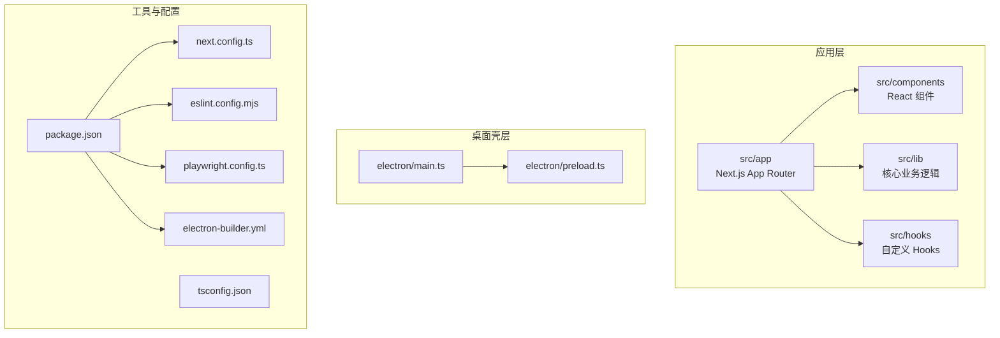
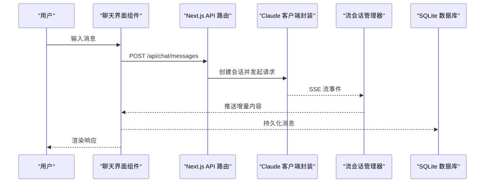
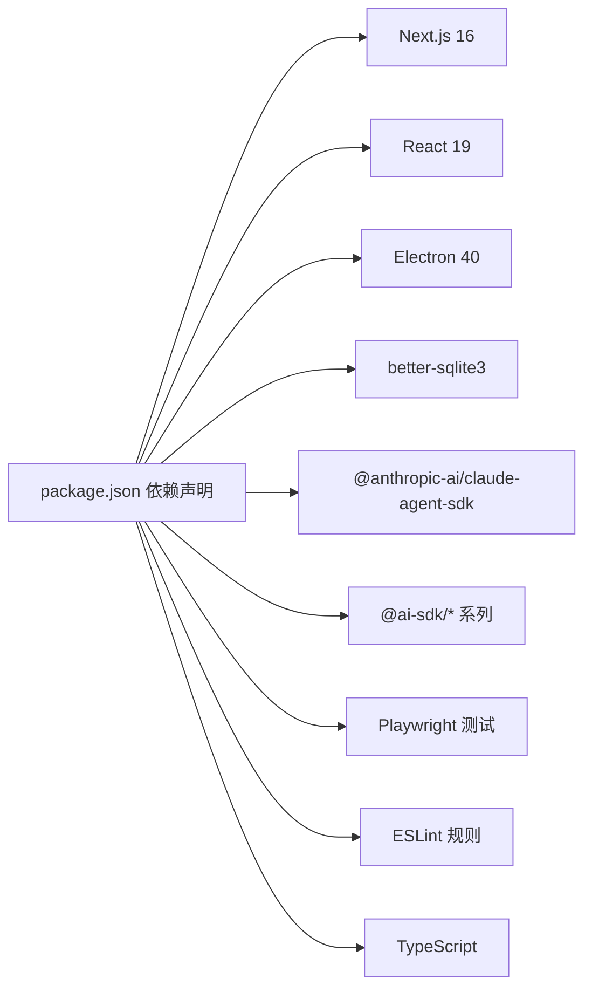

# 开发指南

<cite>
**本文引用的文件**
- [package.json](file://package.json)
- [README.md](file://README.md)
- [ARCHITECTURE.md](file://ARCHITECTURE.md)
- [eslint.config.mjs](file://eslint.config.mjs)
- [next.config.ts](file://next.config.ts)
- [.github/workflows/build.yml](file://.github/workflows/build.yml)
- [.github/workflows/preview-build.yml](file://.github/workflows/preview-build.yml)
- [tsconfig.json](file://tsconfig.json)
- [.editorconfig](file://.editorconfig)
- [playwright.config.ts](file://playwright.config.ts)
- [scripts/build-electron-dev.mjs](file://scripts/build-electron-dev.mjs)
- [scripts/lint-hooks.mjs](file://scripts/lint-hooks.mjs)
- [scripts/lint-docs-drift.mjs](file://scripts/lint-docs-drift.mjs)
- [src/__tests__/test-plan.md](file://src/__tests__/test-plan.md)
- [src/__tests__/helpers.ts](file://src/__tests__/helpers.ts)
- [electron-builder.yml](file://electron-builder.yml)
- [cache-handler.js](file://cache-handler.js)
</cite>

## 目录
1. [简介](#简介)
2. [项目结构](#项目结构)
3. [核心组件](#核心组件)
4. [架构总览](#架构总览)
5. [详细组件分析](#详细组件分析)
6. [依赖关系分析](#依赖关系分析)
7. [性能考量](#性能考量)
8. [故障排查指南](#故障排查指南)
9. [结论](#结论)
10. [附录](#附录)

## 简介
本开发指南面向新加入的开发者，帮助你快速理解并高效贡献 CodePilot 项目。内容涵盖开发环境搭建、代码规范、Git 工作流与持续集成、目录结构、构建系统与工具链、编码标准与最佳实践、调试技巧、性能优化、测试策略、代码审查与提交规范、版本管理策略，以及贡献指南。

## 项目结构
CodePilot 采用多包工作区（workspaces）组织，主要目录如下：
- apps/site：文档站点应用（Next.js App Router）
- src：主应用源码（Next.js App Router + Electron 客户端）
- electron：Electron 主进程与预加载脚本
- scripts：构建与质量检查脚本
- docs：设计决策、执行计划、技术债务等文档
- themes：主题配置
- 资料：第三方扩展包示例
- 根目录配置：package.json、tsconfig.json、eslint.config.mjs、next.config.ts、playwright.config.ts、electron-builder.yml 等

图表来源
- [package.json:1-157](file://package.json#L1-L157)
- [ARCHITECTURE.md:1-183](file://ARCHITECTURE.md#L1-L183)
- [next.config.ts:1-101](file://next.config.ts#L1-L101)
- [playwright.config.ts:1-32](file://playwright.config.ts#L1-L32)
- [electron-builder.yml:1-95](file://electron-builder.yml#L1-L95)

章节来源
- [ARCHITECTURE.md:5-53](file://ARCHITECTURE.md#L5-L53)
- [package.json:6-9](file://package.json#L6-L9)

## 核心组件
- 应用层（Next.js App Router）：提供页面与 API 路由，覆盖聊天、插件、设置、桥接、画廊等功能区域。
- 业务逻辑层（src/lib）：数据库（SQLite）、AI 客户端封装、流会话管理、文件系统、Provider 诊断、Bridge 子系统等。
- 组件层（src/components）：按功能划分的 UI 组件，遵循统一的设计与可复用原则。
- Hooks 层（src/hooks）：状态与副作用的抽象，如 SSE 流订阅、国际化、通知轮询等。
- 桌面壳层（electron）：主进程负责窗口、IPC、更新；预加载脚本暴露受限 API。

章节来源
- [ARCHITECTURE.md:8-48](file://ARCHITECTURE.md#L8-L48)
- [ARCHITECTURE.md:100-140](file://ARCHITECTURE.md#L100-L140)

## 架构总览
整体采用“Electron + Next.js App Router + better-sqlite3”的混合架构。数据流从用户输入到 API 路由，经由 Claude Agent SDK 的 SSE 流，再由流会话管理器与 Hooks 订阅渲染，并持久化到 SQLite。

图表来源
- [ARCHITECTURE.md:55-66](file://ARCHITECTURE.md#L55-L66)
- [ARCHITECTURE.md:30-41](file://ARCHITECTURE.md#L30-L41)

## 详细组件分析

### 代码规范与 ESLint
- 使用 ESLint 配置继承 Next.js 推荐规则，并进行定制化治理：
  - 业务组件禁止直接使用原生 HTML 控件，强制使用统一 UI 组件库。
  - Icon 管控：禁止直接引入 lucide-react；Phosphor 图标禁止使用特定名称（如 Brain/Lightning/Terminal），需通过语义化 CodePilotIcon。
  - 组件体积限制：非基础组件文件大小上限 500 行。
  - Pattern 组件禁止导入 hooks 与 lib，仅允许纯展示。
- 提供颜色使用检查脚本，避免在业务组件中直接使用原始状态色。

章节来源
- [eslint.config.mjs:24-193](file://eslint.config.mjs#L24-L193)

### TypeScript 与工程配置
- 编译目标 ES2017，严格模式，禁用 emit，路径别名 @/* 指向 src。
- Next.js 配置：
  - 输出 standalone，内存缓存优先，禁用文件系统缓存以避免嵌套工作树问题。
  - serverExternalPackages 排除原生模块与动态加载依赖，防止打包后缺失。
  - outputFileTracingExcludes 排除大量非必要资源，减少产物体积。
- EditorConfig 统一缩进、换行与字符集。

章节来源
- [tsconfig.json:1-47](file://tsconfig.json#L1-L47)
- [next.config.ts:5-98](file://next.config.ts#L5-L98)
- [.editorconfig:1-13](file://.editorconfig#L1-L13)

### 构建系统与打包
- Electron 开发构建：使用 esbuild 为主进程与预加载脚本生成 dist-electron 输出，支持一次性构建与 watch 模式。
- 生产构建：先执行 Next.js 构建，再由 electron-builder 打包，配置包含 macOS（dmg/zip）、Windows（NSIS）与 Linux（AppImage/deb/rpm）目标。
- 缓存策略：桌面应用使用内存缓存，避免写入只读安装目录。

章节来源
- [scripts/build-electron-dev.mjs:1-61](file://scripts/build-electron-dev.mjs#L1-L61)
- [electron-builder.yml:1-95](file://electron-builder.yml#L1-L95)
- [next.config.ts:14-15](file://next.config.ts#L14-L15)

### 测试体系
- 单元测试：tsx + node:test，带数据库隔离设置。
- E2E 测试：Playwright，覆盖聊天、插件、设置、布局、项目面板、技能编辑、增强聊天 UI 等场景。
- 测试计划：明确页面渲染、聊天流程、插件管理、设置、布局、项目面板、技能编辑、聊天 UI 增强等测试用例与验收标准。
- 辅助工具：helpers.ts 提供导航、等待、断言与定位器封装，统一测试体验。

章节来源
- [package.json:23-28](file://package.json#L23-L28)
- [playwright.config.ts:1-32](file://playwright.config.ts#L1-L32)
- [src/__tests__/test-plan.md:1-382](file://src/__tests__/test-plan.md#L1-L382)
- [src/__tests__/helpers.ts:1-515](file://src/__tests__/helpers.ts#L1-L515)

### 持续集成与发布
- 稳定版构建（build.yml）：
  - 触发条件：推送 v* 标签。
  - 关键门禁：package.json 版本一致性、Codex app-server 不使用 --listen、ClaudeCode 模型别名规范化、P0 启动回归验证、打包后原生模块 ABI 校验。
  - 平台：macOS（arm64+x64）与 Windows（NSIS 安装器），创建 GitHub Release 并上传校验和。
- 预览构建（preview-build.yml）：
  - 手动触发，仅上传工件，不创建 Release。
  - 版本来源：通过 npm version 修改 package.json 与 lockfile，确保版本单一来源。
  - 平台：macOS arm64 与 Windows x64，进行版本与 ABI 校验。

章节来源
- [.github/workflows/build.yml:1-310](file://.github/workflows/build.yml#L1-L310)
- [.github/workflows/preview-build.yml:1-325](file://.github/workflows/preview-build.yml#L1-L325)

### Git 工作流与质量门禁
- Husky 预提交钩子：lint-staged 对 TS/TSX 执行 ESLint 修复；对 docs/exec-plans 下的 Markdown 执行文档漂移检查。
- 钩子校验脚本：确保测试命令携带 CODEX_DISABLED=1，避免单元测试期间真实 Codex app-server 与开发服务器争用 SQLite。
- 文档索引校验：保证 docs/exec-plans/README.md 与 active/completed 目录一致，防止链接失效与索引缺失。

章节来源
- [package.json:40-47](file://package.json#L40-L47)
- [scripts/lint-hooks.mjs:1-55](file://scripts/lint-hooks.mjs#L1-L55)
- [scripts/lint-docs-drift.mjs:1-146](file://scripts/lint-docs-drift.mjs#L1-L146)

### 数据库与桥接子系统
- 数据库：SQLite（WAL 模式 + 外键），表结构覆盖会话、消息、设置、任务、媒体、通道绑定等。
- Bridge：将外部 IM（Telegram、飞书）连接到 CodePilot 会话，包含适配器、路由、权限、投递层与远程合约层。

章节来源
- [ARCHITECTURE.md:79-98](file://ARCHITECTURE.md#L79-L98)
- [ARCHITECTURE.md:100-140](file://ARCHITECTURE.md#L100-L140)

## 依赖关系分析

图表来源
- [package.json:48-116](file://package.json#L48-L116)
- [package.json:118-144](file://package.json#L118-L144)

章节来源
- [package.json:118-144](file://package.json#L118-L144)

## 性能考量
- 开发期性能：
  - Next.js 禁用文件系统缓存与内存限制，避免嵌套工作树导致的缓存膨胀与内存压力。
  - Electron 开发构建使用 esbuild，增量编译更快。
- 运行期性能：
  - SQLite 使用 WAL 模式提升并发读取性能。
  - 缓存处理器将 Next.js 缓存置于内存，避免写入只读安装目录。
- 测试性能：
  - Playwright 并行执行，重试策略与截图阈值已配置，便于回归与视觉对比。

章节来源
- [next.config.ts:35-47](file://next.config.ts#L35-L47)
- [next.config.ts:14-15](file://next.config.ts#L14-L15)
- [playwright.config.ts:11-25](file://playwright.config.ts#L11-L25)

## 故障排查指南
- 预提交失败（测试未加 CODEX_DISABLED=1）：
  - 现象：单元测试在本地或 CI 中卡住或锁冲突。
  - 处理：确保 .husky/pre-commit 中测试命令行包含 CODEX_DISABLED=1。
- 文档索引异常（docs/exec-plans）：
  - 现象：README.md 链接失效或索引缺失。
  - 处理：运行 lint-docs-drift.mjs，按提示修复链接与索引。
- 版本不一致（CI 稳定版）：
  - 现象：tag 版本与 package.json 不一致。
  - 处理：确认版本匹配并通过门禁检查。
- 原生模块 ABI 加载失败：
  - 现象：打包后 better-sqlite3 .node 无法在 Electron 中加载。
  - 处理：CI 中已进行 ABI 校验，确保打包产物包含正确 .node 文件。

章节来源
- [scripts/lint-hooks.mjs:38-50](file://scripts/lint-hooks.mjs#L38-L50)
- [scripts/lint-docs-drift.mjs:136-143](file://scripts/lint-docs-drift.mjs#L136-L143)
- [.github/workflows/build.yml:59-77](file://.github/workflows/build.yml#L59-L77)
- [.github/workflows/build.yml:173-195](file://.github/workflows/build.yml#L173-L195)

## 结论
本指南提供了从环境搭建到贡献协作的完整路径。建议新成员先完成环境准备与基础开发命令，再深入阅读架构文档与测试计划，逐步参与功能开发与代码审查。遵循本文的规范与流程，可显著提升开发效率与代码质量。

## 附录

### 开发环境搭建步骤
- 克隆仓库并安装依赖
- 启动浏览器模式：npm run dev
- 启动桌面模式：npm run electron:dev
- 构建生产包：npm run electron:build 或按平台选择 npm run electron:pack:mac|win|linux

章节来源
- [README.md:84-98](file://README.md#L84-L98)
- [package.json:17-38](file://package.json#L17-L38)

### 代码规范与最佳实践
- 组件层：优先使用统一 UI 组件，避免原生控件；Icon 使用 CodePilotIcon 语义层；Pattern 组件保持纯展示。
- 文件大小：业务组件不超过 500 行；复杂组件拆分。
- 导入约束：禁止直接使用 lucide-react；Phosphor 中 Brain/Lightning/Terminal 禁止直引。
- 颜色：避免在 className 字符串中使用原始状态色，必要时使用工具类或主题变量。

章节来源
- [eslint.config.mjs:38-94](file://eslint.config.mjs#L38-L94)
- [eslint.config.mjs:159-169](file://eslint.config.mjs#L159-L169)
- [eslint.config.mjs:171-192](file://eslint.config.mjs#L171-L192)

### Git 工作流与提交规范
- 分支策略：基于 main 分支创建特性分支，提交前确保本地测试通过。
- 提交信息：清晰描述变更目的与影响范围，避免“修复”“更新”等模糊词汇。
- 代码审查：PR 必须包含测试与变更说明；多人评审通过后合并。

章节来源
- [README.md:250-278](file://README.md#L250-L278)

### 版本管理策略
- 稳定版：推送 v* 标签触发 CI 构建与发布，版本号必须与 package.json 一致。
- 预览版：手动触发，版本来源于 npm version 修改的 package.json 与 lockfile，不创建 Release。

章节来源
- [.github/workflows/build.yml:18-32](file://.github/workflows/build.yml#L18-L32)
- [.github/workflows/preview-build.yml:26-49](file://.github/workflows/preview-build.yml#L26-L49)

### 贡献指南
- 报告问题：使用 Issues 模板，提供最小复现与环境信息。
- 功能请求：在 Discussions 中讨论需求背景与可行性。
- 开源协作：遵循代码风格与测试要求，提交 PR 前运行 npm run test 与类型检查。

章节来源
- [README.md:245-246](file://README.md#L245-L246)
- [README.md:250-257](file://README.md#L250-L257)