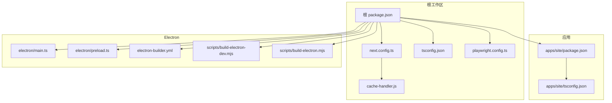
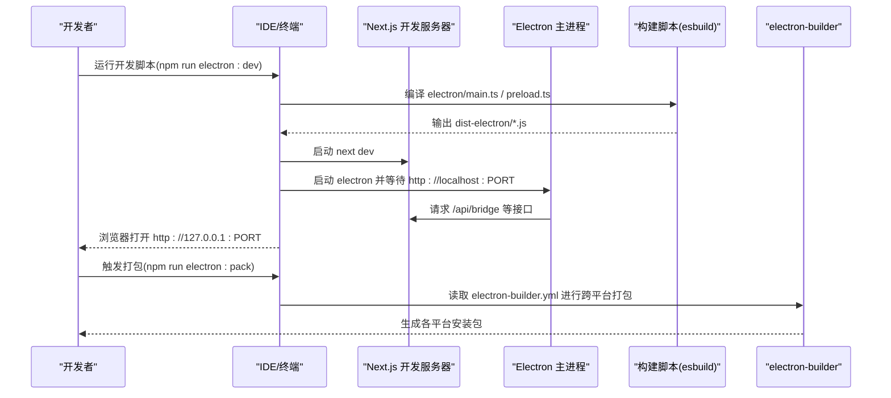
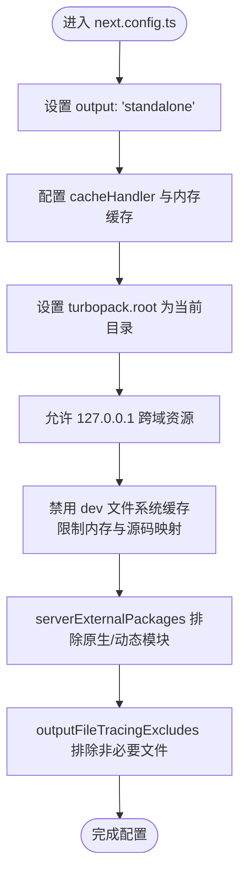
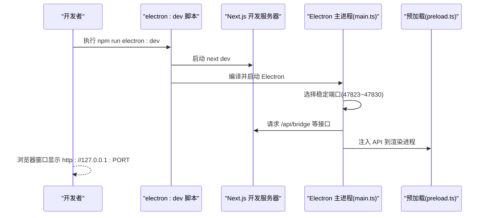
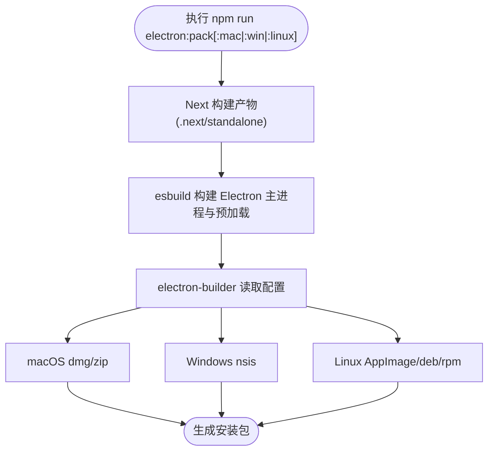
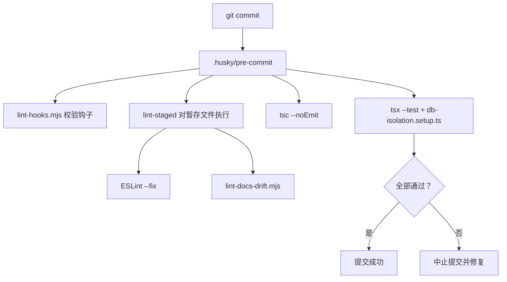
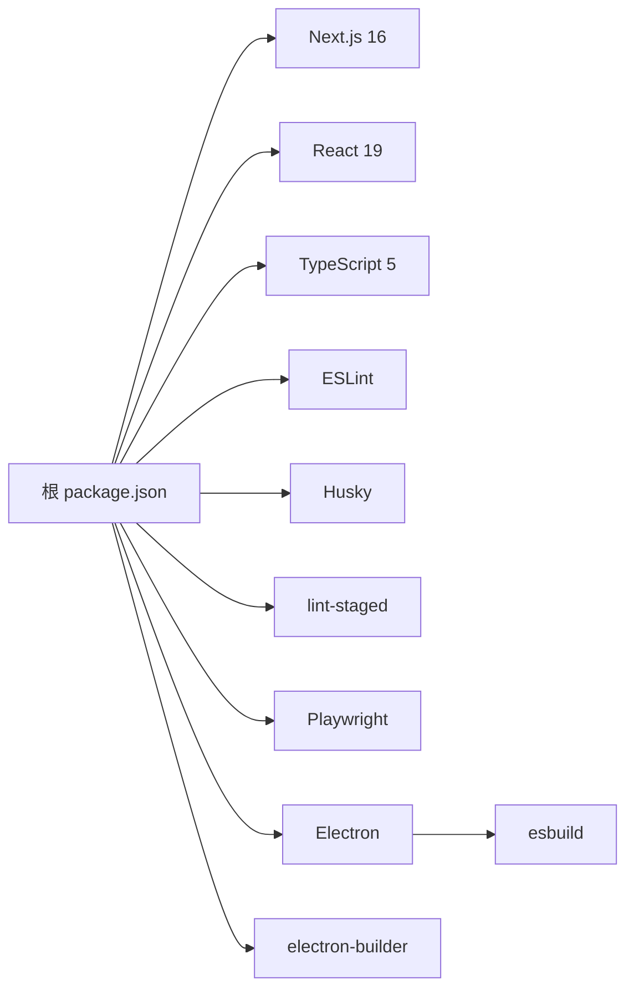

# 开发环境搭建

<cite>
**本文引用的文件**
- [package.json](file://package.json)
- [next.config.ts](file://next.config.ts)
- [tsconfig.json](file://tsconfig.json)
- [electron/tsconfig.json](file://electron/tsconfig.json)
- [scripts/build-electron-dev.mjs](file://scripts/build-electron-dev.mjs)
- [scripts/build-electron.mjs](file://scripts/build-electron.mjs)
- [electron-builder.yml](file://electron-builder.yml)
- [.husky/pre-commit](file://.husky/pre-commit)
- [scripts/lint-hooks.mjs](file://scripts/lint-hooks.mjs)
- [scripts/lint-docs-drift.mjs](file://scripts/lint-docs-drift.mjs)
- [cache-handler.js](file://cache-handler.js)
- [playwright.config.ts](file://playwright.config.ts)
- [apps/site/package.json](file://apps/site/package.json)
- [apps/site/tsconfig.json](file://apps/site/tsconfig.json)
- [electron/main.ts](file://electron/main.ts)
- [electron/preload.ts](file://electron/preload.ts)
</cite>

## 目录
1. [简介](#简介)
2. [项目结构](#项目结构)
3. [核心组件](#核心组件)
4. [架构总览](#架构总览)
5. [详细组件分析](#详细组件分析)
6. [依赖关系分析](#依赖关系分析)
7. [性能考虑](#性能考虑)
8. [故障排除指南](#故障排除指南)
9. [结论](#结论)
10. [附录](#附录)

## 简介
本指南面向首次参与 CodePilot 开发的工程师，目标是帮助你在本地快速搭建可运行的开发环境，涵盖以下方面：
- Node.js 版本与包管理器选择
- 依赖安装与工作区配置
- TypeScript 与 Next.js 开发服务器设置
- Electron 开发环境与跨平台打包
- IDE 配置与调试建议
- Git hooks 与 lint-staged 的配置与使用
- 常见问题排查与解决方案

## 项目结构
仓库采用多包工作区（monorepo）布局，核心应用位于根目录，同时包含独立的网站应用与 Electron 主进程源码。关键目录与职责如下：
- 根应用（Next.js 应用）：负责桌面端主界面与服务端逻辑
- apps/site：独立的文档/营销站点
- electron：Electron 主进程与预加载脚本
- scripts：构建与校验脚本
- 配置文件：TypeScript、Next.js、Husky、lint-staged、Playwright 等

图表来源
- [package.json:1-157](file://package.json#L1-L157)
- [next.config.ts:1-101](file://next.config.ts#L1-L101)
- [tsconfig.json:1-47](file://tsconfig.json#L1-L47)
- [apps/site/package.json:1-40](file://apps/site/package.json#L1-L40)
- [apps/site/tsconfig.json:1-46](file://apps/site/tsconfig.json#L1-L46)
- [electron-builder.yml:1-95](file://electron-builder.yml#L1-L95)
- [scripts/build-electron-dev.mjs:1-61](file://scripts/build-electron-dev.mjs#L1-L61)
- [scripts/build-electron.mjs:1-66](file://scripts/build-electron.mjs#L1-L66)
- [cache-handler.js:1-82](file://cache-handler.js#L1-L82)
- [playwright.config.ts:1-32](file://playwright.config.ts#L1-L32)

章节来源
- [package.json:1-157](file://package.json#L1-L157)
- [next.config.ts:1-101](file://next.config.ts#L1-L101)
- [tsconfig.json:1-47](file://tsconfig.json#L1-L47)
- [apps/site/package.json:1-40](file://apps/site/package.json#L1-L40)
- [apps/site/tsconfig.json:1-46](file://apps/site/tsconfig.json#L1-L46)
- [electron-builder.yml:1-95](file://electron-builder.yml#L1-L95)
- [scripts/build-electron-dev.mjs:1-61](file://scripts/build-electron-dev.mjs#L1-L61)
- [scripts/build-electron.mjs:1-66](file://scripts/build-electron.mjs#L1-L66)
- [cache-handler.js:1-82](file://cache-handler.js#L1-L82)
- [playwright.config.ts:1-32](file://playwright.config.ts#L1-L32)

## 核心组件
- 根工作区与脚本：通过根 package.json 定义工作区、脚本与依赖，统一管理 Next.js、Electron、测试与构建流程。
- Next.js 配置：next.config.ts 针对桌面应用做了缓存处理、工作区根定位、跨域资源允许等定制。
- TypeScript 配置：根 tsconfig.json 与 apps/site/tsconfig.json 分别约束编译选项与路径映射。
- Electron 构建：两套脚本分别用于开发与生产构建；electron-builder.yml 描述跨平台打包规则。
- Git hooks 与质量门禁：.husky/pre-commit 结合 lint-staged、lint-hooks.mjs、lint-docs-drift.mjs 实现提交前检查。

章节来源
- [package.json:1-157](file://package.json#L1-L157)
- [next.config.ts:1-101](file://next.config.ts#L1-L101)
- [tsconfig.json:1-47](file://tsconfig.json#L1-L47)
- [apps/site/tsconfig.json:1-46](file://apps/site/tsconfig.json#L1-L46)
- [electron-builder.yml:1-95](file://electron-builder.yml#L1-L95)
- [.husky/pre-commit:1-23](file://.husky/pre-commit#L1-L23)
- [scripts/lint-hooks.mjs:1-55](file://scripts/lint-hooks.mjs#L1-L55)
- [scripts/lint-docs-drift.mjs:1-146](file://scripts/lint-docs-drift.mjs#L1-L146)

## 架构总览
下图展示了开发时的典型交互：IDE 启动 Next.js 开发服务器，Electron 主进程在本地启动 Next 服务并注入稳定端口；开发脚本负责编译 Electron 主进程与预加载脚本；Playwright 在测试时复用开发服务器或启动独立 Web 服务。

图表来源
- [package.json:17-38](file://package.json#L17-L38)
- [scripts/build-electron-dev.mjs:1-61](file://scripts/build-electron-dev.mjs#L1-L61)
- [scripts/build-electron.mjs:1-66](file://scripts/build-electron.mjs#L1-L66)
- [electron-builder.yml:1-95](file://electron-builder.yml#L1-L95)
- [electron/main.ts:1-800](file://electron/main.ts#L1-L800)
- [playwright.config.ts:26-31](file://playwright.config.ts#L26-L31)

## 详细组件分析

### Node.js 与包管理器版本要求
- Node.js：项目使用较新的特性（如 import.meta.dirname），建议使用长期支持版本（LTS）。根据配置文件中的目标与模块系统，推荐使用 Node.js 20+。
- 包管理器：推荐使用 npm 10+ 或 pnpm 8+。项目脚本与依赖均基于 npm 生态设计，确保与 npm 的工作区与脚本执行兼容性。

章节来源
- [next.config.ts:25-30](file://next.config.ts#L25-L30)
- [package.json:1-157](file://package.json#L1-L157)

### 依赖安装与工作区配置
- 工作区：根 package.json 声明了工作区范围，包含 apps/* 与 packages/*，便于统一安装与脚本执行。
- 依赖安装：在仓库根目录执行安装，会自动为所有工作区包安装依赖，并保持版本一致。
- 本地开发脚本：
  - 根级开发：npm run dev 启动 Next.js 开发服务器
  - Electron 开发：npm run electron:dev 同时启动 Next 与 Electron，自动等待前端服务就绪后再启动应用

章节来源
- [package.json:6-9](file://package.json#L6-L9)
- [package.json:17-38](file://package.json#L17-L38)

### TypeScript 配置
- 根 tsconfig.json
  - 目标与模块：ES2017、esnext、bundler，启用 isolatedModules 与 JSX 编译
  - 路径映射：@/* 指向 src/*
  - 排除：apps、packages、scripts 等目录，避免类型检查污染
- apps/site/tsconfig.json
  - 与根配置类似，但针对文档站点的特殊需求（如 preserve JSX）
- electron/tsconfig.json
  - 目标 ES2020、CommonJS、输出到 dist-electron，严格模式与跳过库检查

章节来源
- [tsconfig.json:1-47](file://tsconfig.json#L1-L47)
- [apps/site/tsconfig.json:1-46](file://apps/site/tsconfig.json#L1-L46)
- [electron/tsconfig.json:1-12](file://electron/tsconfig.json#L1-L12)

### Next.js 开发服务器设置
- 独立输出：output: 'standalone'，便于 Electron 打包
- 内存缓存：通过 cache-handler.js 实现内存增量缓存，避免写入只读安装目录
- 工作区根定位：turbopack.root 指向当前目录，防止在子工作树中误推断父仓库根
- 跨域资源：allowedDevOrigins 允许 127.0.0.1，解决 HMR/字体跨源限制
- 开发缓存优化：禁用 dev 文件系统缓存，限制内存上限与关闭源码映射以提升稳定性
- 外部化依赖：serverExternalPackages 排除原生模块与动态加载库，避免打包错误
- 输出追踪排除：outputFileTracingExcludes 排除大量非必要文件，减少构建体积与警告

图表来源
- [next.config.ts:5-98](file://next.config.ts#L5-L98)
- [cache-handler.js:1-82](file://cache-handler.js#L1-L82)

章节来源
- [next.config.ts:1-101](file://next.config.ts#L1-L101)
- [cache-handler.js:1-82](file://cache-handler.js#L1-L82)

### Electron 开发环境配置
- 开发脚本：npm run electron:dev
  - 使用 concurrently 同步启动 next dev、Electron 主进程构建与 Electron 应用
  - 通过 wait-on 等待前端服务启动后再启动 Electron
- 主进程要点：
  - 端口分配：优先尝试稳定端口范围（47823–47830），避免 localStorage 跨重启丢失
  - 环境隔离：清理 __NEXT_PRIVATE_* 环境变量，防止与其他 Next 项目冲突
  - 原生模块 ABI 校验：打包后检测 better-sqlite3.node 与 Electron ABI 是否匹配
  - 代理与 Shell 环境：解析系统代理与用户 Shell 环境变量，保证子进程可用
- 预加载脚本：通过 contextBridge 暴露安全 API 至渲染进程，封装文件系统、对话框、通知、终端等能力

图表来源
- [package.json:33-33](file://package.json#L33-L33)
- [scripts/build-electron-dev.mjs:1-61](file://scripts/build-electron-dev.mjs#L1-L61)
- [electron/main.ts:717-795](file://electron/main.ts#L717-L795)
- [electron/preload.ts:1-118](file://electron/preload.ts#L1-L118)

章节来源
- [package.json:33-33](file://package.json#L33-L33)
- [scripts/build-electron-dev.mjs:1-61](file://scripts/build-electron-dev.mjs#L1-L61)
- [electron/main.ts:1-800](file://electron/main.ts#L1-L800)
- [electron/preload.ts:1-118](file://electron/preload.ts#L1-L118)

### 跨平台编译与打包设置
- electron-builder.yml
  - appId/productName：应用标识与名称
  - 发布：GitHub Releases 提供者
  - 输出目录：release
  - 资源：dist-electron、.next/standalone、public、themes 等
  - 打包后钩子：afterPack/afterSign
  - 平台配置：macOS（dmg/zip）、Windows（nsis）、Linux（AppImage/deb/rpm）
- 生产构建脚本：scripts/build-electron.mjs 清理 dist-electron、构建主进程与预加载、修复 standalone 符号链接

图表来源
- [package.json:35-38](file://package.json#L35-L38)
- [scripts/build-electron.mjs:1-66](file://scripts/build-electron.mjs#L1-L66)
- [electron-builder.yml:1-95](file://electron-builder.yml#L1-L95)

章节来源
- [package.json:35-38](file://package.json#L35-L38)
- [scripts/build-electron.mjs:1-66](file://scripts/build-electron.mjs#L1-L66)
- [electron-builder.yml:1-95](file://electron-builder.yml#L1-L95)

### IDE 配置与调试建议
- VSCode 推荐扩展
  - ESLint：实时语法与风格检查
  - Prettier：格式化
  - TypeScript Importer：自动导入
  - Tailwind CSS IntelliSense：CSS 类名提示
  - Playwright Test for VS Code：端到端测试调试
- 调试建议
  - Next.js：使用 V8 调试器附加到 Node 进程
  - Electron：在 VSCode 中为 main.ts 设置断点，使用 Electron 调试配置启动
  - 测试：使用 Playwright Test 扩展进行单测与截图对比

[本节为通用建议，不直接分析具体文件，故无章节来源]

### Git hooks 与 lint-staged 配置
- 提交前钩子：.husky/pre-commit
  - lint-hooks.mjs：校验提交钩子是否正确携带 CODEX_DISABLED=1 保护
  - lint-staged：对暂存文件执行 ESLint 修复与文档索引一致性检查
  - tsc：类型检查
  - 单元测试：通过 tsx 并使用数据库隔离脚本，避免锁争用
- lint-staged 配置：对 TypeScript/TSX 执行 ESLint 修复；对 docs/exec-plans 下 Markdown 执行 lint-docs-drift.mjs

图表来源
- [.husky/pre-commit:1-23](file://.husky/pre-commit#L1-L23)
- [scripts/lint-hooks.mjs:1-55](file://scripts/lint-hooks.mjs#L1-L55)
- [scripts/lint-docs-drift.mjs:1-146](file://scripts/lint-docs-drift.mjs#L1-L146)
- [package.json:40-47](file://package.json#L40-L47)

章节来源
- [.husky/pre-commit:1-23](file://.husky/pre-commit#L1-L23)
- [scripts/lint-hooks.mjs:1-55](file://scripts/lint-hooks.mjs#L1-L55)
- [scripts/lint-docs-drift.mjs:1-146](file://scripts/lint-docs-drift.mjs#L1-L146)
- [package.json:40-47](file://package.json#L40-L47)

### 测试与可视化回归
- Playwright：playwright.config.ts 支持自定义 baseURL，测试目录位于 src/__tests__/e2e，HTML 报告与首失败重试跟踪
- 单元测试：npm run test:unit 使用 tsx 并引入数据库隔离设置，避免真实数据库锁争用
- 截图回归：npm run test:visual 使用带 @visual 标签的测试，配置了最大像素差异比率

章节来源
- [playwright.config.ts:1-32](file://playwright.config.ts#L1-L32)
- [package.json:23-28](file://package.json#L23-L28)

## 依赖关系分析
- 根应用依赖 Next.js 16、React 19、TypeScript 5，以及大量 AI/编辑器/图标/监控等生态库
- Electron 与原生模块：better-sqlite3、zlib-sync 作为外部化模块，避免打包
- 构建工具：esbuild 用于 Electron 主进程与预加载脚本的快速构建；electron-builder 用于跨平台打包
- 质量门禁：Husky + lint-staged + ESLint + TypeScript + 自定义脚本

图表来源
- [package.json:48-144](file://package.json#L48-L144)
- [electron-builder.yml:1-95](file://electron-builder.yml#L1-L95)
- [scripts/build-electron-dev.mjs:29-41](file://scripts/build-electron-dev.mjs#L29-L41)

章节来源
- [package.json:48-144](file://package.json#L48-L144)
- [electron-builder.yml:1-95](file://electron-builder.yml#L1-L95)

## 性能考虑
- Next.js 开发体验优化
  - 关闭 dev 文件系统缓存与源码映射，降低内存压力
  - 限制 Turbopack 内存上限，避免大型路由图导致机器卡顿
- Electron 开发效率
  - esbuild 仅在开发阶段使用，避免生产构建开销
  - 端口稳定策略避免 localStorage 跨重启丢失带来的 UI 状态抖动
- 打包体积控制
  - outputFileTracingExcludes 排除大量非必要文件，减少 NFT 体积
  - serverExternalPackages 外部化原生/动态模块，避免打包失败

[本节为通用指导，不直接分析具体文件，故无章节来源]

## 故障排除指南
- Next 缓存写入权限错误（Windows 只读安装目录）
  - 现象：安装目录下创建 .next/cache 失败，报错 EPERM
  - 解决：使用内存缓存处理器（cache-handler.js），并设置 cacheMaxMemorySize: 0
  - 参考：next.config.ts 的 cacheHandler 与内存缓存实现
- 端口冲突导致应用无法启动
  - 现象：多个实例同时启动，端口被占用
  - 解决：主进程会尝试稳定端口范围（47823–47830），若失败则回退至系统分配端口
  - 参考：electron/main.ts 的端口分配与等待逻辑
- 原生模块 ABI 不匹配
  - 现象：better-sqlite3.node 与 Electron ABI 不兼容，启动崩溃
  - 解决：打包后进行 ABI 校验，提示重新构建或报告问题
  - 参考：electron/main.ts 的 checkNativeModuleABI
- 提交被静默放行（旧版 Husky 行为）
  - 现象：lint-staged/tsc/docs-drift 失败但最终提交成功
  - 解决：使用 lint-hooks.mjs 强制校验提交钩子中测试命令携带 CODEX_DISABLED=1
  - 参考：.husky/pre-commit 与 scripts/lint-hooks.mjs
- 文档索引不同步
  - 现象：docs/exec-plans/README.md 与实际文件不一致
  - 解决：运行 lint-docs-drift.mjs 修复索引与内部链接
  - 参考：scripts/lint-docs-drift.mjs
- Playwright 测试基地址不匹配
  - 现象：工作树在非默认端口运行，测试访问不到页面
  - 解决：设置 PLAYWRIGHT_BASE_URL 指向目标端口
  - 参考：playwright.config.ts

章节来源
- [cache-handler.js:1-82](file://cache-handler.js#L1-L82)
- [next.config.ts:5-15](file://next.config.ts#L5-L15)
- [electron/main.ts:717-795](file://electron/main.ts#L717-L795)
- [.husky/pre-commit:1-23](file://.husky/pre-commit#L1-L23)
- [scripts/lint-hooks.mjs:1-55](file://scripts/lint-hooks.mjs#L1-L55)
- [scripts/lint-docs-drift.mjs:1-146](file://scripts/lint-docs-drift.mjs#L1-L146)
- [playwright.config.ts:1-32](file://playwright.config.ts#L1-L32)

## 结论
通过以上配置与流程，你可以在本地高效地开发与调试 CodePilot：Next.js 提供快速迭代的前端体验，Electron 将其打包为跨平台桌面应用，Husky/lint-staged 保障代码质量，Playwright 提供端到端测试与可视化回归。遇到问题时，可依据“故障排除指南”逐项定位并修复。

[本节为总结，不直接分析具体文件，故无章节来源]

## 附录
- 快速开始清单
  - 安装 Node.js 20+ 与 npm 10+
  - 在仓库根目录执行依赖安装
  - 运行 npm run dev 或 npm run electron:dev
  - 使用 VSCode 打开项目并安装推荐扩展
  - 提交前确保通过 lint-staged 与类型检查
- 常用脚本
  - 开发：npm run dev、npm run electron:dev
  - 构建：npm run build、npm run electron:build
  - 打包：npm run electron:pack[:mac|:win|:linux]
  - 测试：npm run test:unit、npm run test:e2e、npm run test:visual
  - 质量：npm run lint、npm run typecheck、npm run lint:hooks、npm run lint:docs-drift

[本节为通用信息，不直接分析具体文件，故无章节来源]