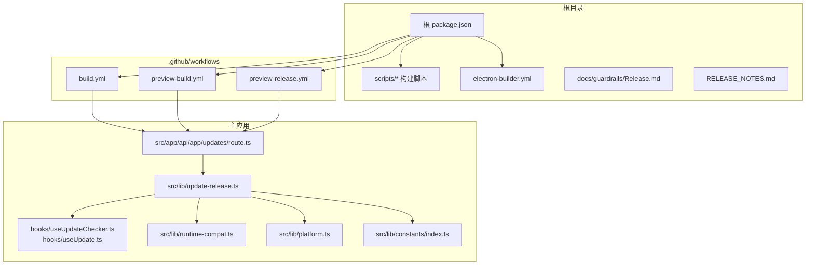
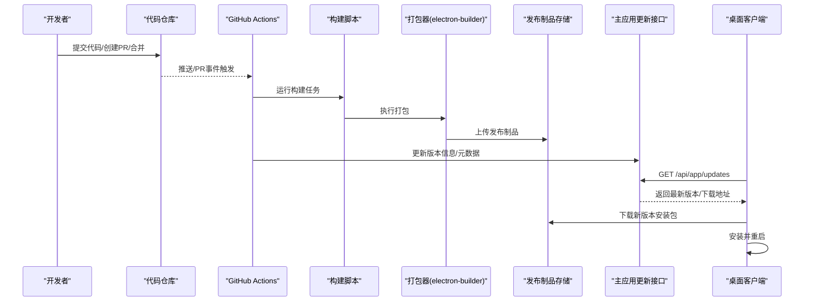
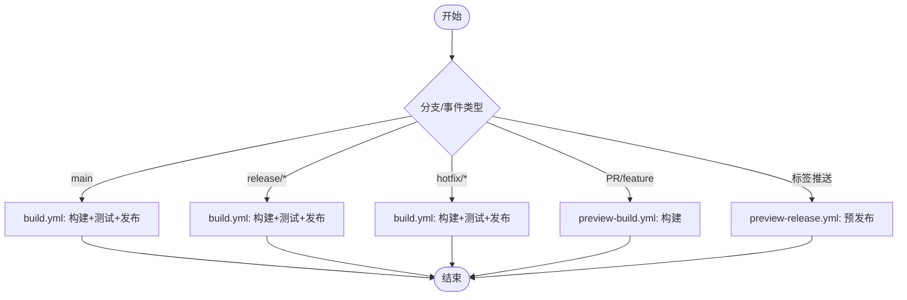
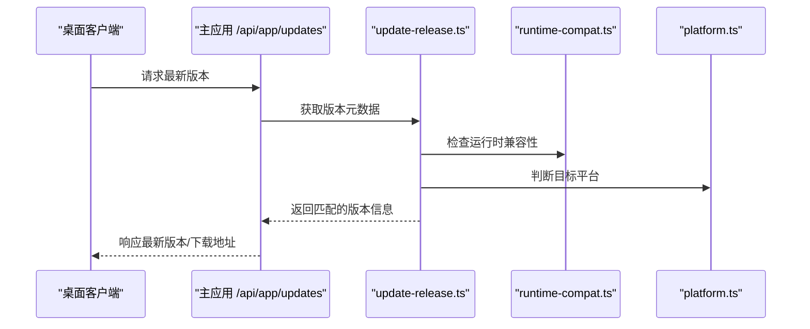
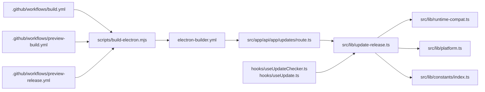

# 发布部署

<cite>
**本文引用的文件**
- [package.json](file://package.json)
- [.github/workflows/build.yml](file://.github/workflows/build.yml)
- [.github/workflows/preview-build.yml](file://.github/workflows/preview-build.yml)
- [.github/workflows/preview-release.yml](file://.github/workflows/preview-release.yml)
- [scripts/build-electron.mjs](file://scripts/build-electron.mjs)
- [scripts/build-electron-dev.mjs](file://scripts/build-electron-dev.mjs)
- [electron-builder.yml](file://electron-builder.yml)
- [src/app/api/app/updates/route.ts](file://src/app/api/app/updates/route.ts)
- [src/lib/update-release.ts](file://src/lib/update-release.ts)
- [src/hooks/useUpdateChecker.ts](file://src/hooks/useUpdateChecker.ts)
- [src/hooks/useUpdate.ts](file://src/hooks/useUpdate.ts)
- [src/lib/runtime-compat.ts](file://src/lib/runtime-compat.ts)
- [src/lib/platform.ts](file://src/lib/platform.ts)
- [src/lib/constants/index.ts](file://src/lib/constants/index.ts)
- [docs/guardrails/Release.md](file://docs/guardrails/Release.md)
- [RELEASE_NOTES.md](file://RELEASE_NOTES.md)
- [README.md](file://README.md)
</cite>

## 目录
1. [简介](#简介)
2. [项目结构](#项目结构)
3. [核心组件](#核心组件)
4. [架构总览](#架构总览)
5. [详细组件分析](#详细组件分析)
6. [依赖关系分析](#依赖关系分析)
7. [性能考虑](#性能考虑)
8. [故障排除指南](#故障排除指南)
9. [结论](#结论)
10. [附录](#附录)

## 简介
本指南面向 CodePilot 的发布与部署流程，覆盖版本管理策略（语义化版本、变更日志与标签）、CI/CD 流水线（GitHub Actions 工作流、自动化测试与发布条件）、发布流程全链路（从代码合并到最终分发）、发布前检查清单（安全扫描、性能测试、兼容性验证）、发布后监控与回滚策略，以及用户反馈收集机制。文档基于仓库中现有的发布相关配置与实现进行梳理，并提供可操作的建议与最佳实践。

## 项目结构
CodePilot 采用多包/多应用结构：根目录包含主应用与 Electron 客户端、站点应用、主题资源、脚本工具等；发布相关的自动化主要集中在 .github/workflows 下的工作流文件与构建脚本中。

**图表来源**
- [package.json](file://package.json)
- [.github/workflows/build.yml](file://.github/workflows/build.yml)
- [.github/workflows/preview-build.yml](file://.github/workflows/preview-build.yml)
- [.github/workflows/preview-release.yml](file://.github/workflows/preview-release.yml)
- [scripts/build-electron.mjs](file://scripts/build-electron.mjs)
- [electron-builder.yml](file://electron-builder.yml)
- [src/app/api/app/updates/route.ts](file://src/app/api/app/updates/route.ts)
- [src/lib/update-release.ts](file://src/lib/update-release.ts)
- [src/hooks/useUpdateChecker.ts](file://src/hooks/useUpdateChecker.ts)
- [src/hooks/useUpdate.ts](file://src/hooks/useUpdate.ts)
- [src/lib/runtime-compat.ts](file://src/lib/runtime-compat.ts)
- [src/lib/platform.ts](file://src/lib/platform.ts)
- [src/lib/constants/index.ts](file://src/lib/constants/index.ts)

**章节来源**
- [package.json](file://package.json)
- [.github/workflows/build.yml](file://.github/workflows/build.yml)
- [.github/workflows/preview-build.yml](file://.github/workflows/preview-build.yml)
- [.github/workflows/preview-release.yml](file://.github/workflows/preview-release.yml)
- [scripts/build-electron.mjs](file://scripts/build-electron.mjs)
- [electron-builder.yml](file://electron-builder.yml)
- [src/app/api/app/updates/route.ts](file://src/app/api/app/updates/route.ts)
- [src/lib/update-release.ts](file://src/lib/update-release.ts)
- [src/hooks/useUpdateChecker.ts](file://src/hooks/useUpdateChecker.ts)
- [src/hooks/useUpdate.ts](file://src/hooks/useUpdate.ts)
- [src/lib/runtime-compat.ts](file://src/lib/runtime-compat.ts)
- [src/lib/platform.ts](file://src/lib/platform.ts)
- [src/lib/constants/index.ts](file://src/lib/constants/index.ts)

## 核心组件
- 版本与发布元数据：通过根 package.json 中的版本号与构建脚本生成的产物版本号共同驱动发布。
- 自动更新服务端点：在主应用中提供 /api/app/updates 接口，用于客户端查询最新版本与下载地址。
- 客户端更新逻辑：通过 useUpdateChecker 与 useUpdate 钩子触发检查与执行更新。
- 构建与打包：使用 electron-builder.yml 进行跨平台打包，配合 scripts/build-electron.mjs 与 scripts/build-electron-dev.mjs 执行构建任务。
- CI/CD 工作流：build.yml 用于主分支构建与发布，preview-build.yml 与 preview-release.yml 用于预览分支的构建与发布。

**章节来源**
- [package.json](file://package.json)
- [src/app/api/app/updates/route.ts](file://src/app/api/app/updates/route.ts)
- [src/lib/update-release.ts](file://src/lib/update-release.ts)
- [src/hooks/useUpdateChecker.ts](file://src/hooks/useUpdateChecker.ts)
- [src/hooks/useUpdate.ts](file://src/hooks/useUpdate.ts)
- [scripts/build-electron.mjs](file://scripts/build-electron.mjs)
- [scripts/build-electron-dev.mjs](file://scripts/build-electron-dev.mjs)
- [electron-builder.yml](file://electron-builder.yml)
- [.github/workflows/build.yml](file://.github/workflows/build.yml)
- [.github/workflows/preview-build.yml](file://.github/workflows/preview-build.yml)
- [.github/workflows/preview-release.yml](file://.github/workflows/preview-release.yml)

## 架构总览
下图展示了从代码提交到客户端自动更新的端到端流程，包括 CI 触发、构建打包、版本发布与客户端检查更新的交互。

**图表来源**
- [.github/workflows/build.yml](file://.github/workflows/build.yml)
- [scripts/build-electron.mjs](file://scripts/build-electron.mjs)
- [electron-builder.yml](file://electron-builder.yml)
- [src/app/api/app/updates/route.ts](file://src/app/api/app/updates/route.ts)
- [src/lib/update-release.ts](file://src/lib/update-release.ts)
- [src/hooks/useUpdateChecker.ts](file://src/hooks/useUpdateChecker.ts)
- [src/hooks/useUpdate.ts](file://src/hooks/useUpdate.ts)

## 详细组件分析

### 版本管理策略
- 语义化版本控制：根 package.json 中的 version 字段作为主版本号来源，结合构建脚本生成的构建号或 Git 标签形成最终发布版本。
- 变更日志维护：RELEASE_NOTES.md 作为统一的变更记录文件，建议每次发布前更新该文件以记录重大功能、修复与破坏性变更。
- 标签管理：建议在合并到主分支后创建 Git 标签（如 v1.2.3），并与发布制品关联，便于追溯与回滚。

**章节来源**
- [package.json](file://package.json)
- [RELEASE_NOTES.md](file://RELEASE_NOTES.md)

### CI/CD 流水线配置
- build.yml：主分支构建与发布流水线，负责拉取代码、安装依赖、运行测试、构建应用、打包分发与发布制品。
- preview-build.yml：预览分支构建流水线，用于在 PR 或预发布分支上快速产出可测试的构建包。
- preview-release.yml：预览分支发布流水线，将预览构建结果发布为预发布版本，供测试环境使用。
- 触发条件：建议基于分支策略（如 main、release/*、hotfix/*）与标签事件（如 push tag）触发相应工作流。
- 并行任务：构建与测试可并行执行，减少整体流水线时长。

**图表来源**
- [.github/workflows/build.yml](file://.github/workflows/build.yml)
- [.github/workflows/preview-build.yml](file://.github/workflows/preview-build.yml)
- [.github/workflows/preview-release.yml](file://.github/workflows/preview-release.yml)

**章节来源**
- [.github/workflows/build.yml](file://.github/workflows/build.yml)
- [.github/workflows/preview-build.yml](file://.github/workflows/preview-build.yml)
- [.github/workflows/preview-release.yml](file://.github/workflows/preview-release.yml)

### 自动更新服务端点
- 端点位置：主应用提供 /api/app/updates 接口，返回当前可用的最新版本信息与下载地址。
- 数据来源：src/lib/update-release.ts 负责解析版本元数据、兼容性信息与平台适配，供接口层调用。
- 兼容性与平台：src/lib/runtime-compat.ts 与 src/lib/platform.ts 提供运行时兼容性判断与平台识别，确保客户端仅接收可安装版本。

**图表来源**
- [src/app/api/app/updates/route.ts](file://src/app/api/app/updates/route.ts)
- [src/lib/update-release.ts](file://src/lib/update-release.ts)
- [src/lib/runtime-compat.ts](file://src/lib/runtime-compat.ts)
- [src/lib/platform.ts](file://src/lib/platform.ts)

**章节来源**
- [src/app/api/app/updates/route.ts](file://src/app/api/app/updates/route.ts)
- [src/lib/update-release.ts](file://src/lib/update-release.ts)
- [src/lib/runtime-compat.ts](file://src/lib/runtime-compat.ts)
- [src/lib/platform.ts](file://src/lib/platform.ts)

### 客户端更新逻辑
- useUpdateChecker：周期性或按需触发检查更新，调用 update-release.ts 获取最新版本。
- useUpdate：负责下载与安装新版本，结合平台与兼容性信息执行安装流程。
- 建议：在应用启动时与后台定时任务中触发检查，避免频繁请求，合理设置缓存与重试策略。

**章节来源**
- [src/hooks/useUpdateChecker.ts](file://src/hooks/useUpdateChecker.ts)
- [src/hooks/useUpdate.ts](file://src/hooks/useUpdate.ts)
- [src/lib/update-release.ts](file://src/lib/update-release.ts)

### 构建与打包
- electron-builder.yml：定义打包配置（图标、签名、输出格式、目标平台等）。
- scripts/build-electron.mjs 与 scripts/build-electron-dev.mjs：分别用于生产构建与开发构建，处理编译、资源拷贝与打包入口。
- 建议：在 CI 中固定 Node 版本与依赖锁，确保构建一致性；对不同平台产物进行签名与校验。

**章节来源**
- [electron-builder.yml](file://electron-builder.yml)
- [scripts/build-electron.mjs](file://scripts/build-electron.mjs)
- [scripts/build-electron-dev.mjs](file://scripts/build-electron-dev.mjs)

### 发布前检查清单
- 代码质量
  - 通过所有单元测试与集成测试（含 E2E 测试）。
  - 代码审查与静态分析通过。
- 安全扫描
  - 依赖漏洞扫描（如 npm audit 或 SCA 工具）。
  - 敏感信息检查（避免硬编码密钥、令牌）。
- 性能测试
  - 启动时间、内存占用、渲染性能基准测试。
  - 关键路径（如聊天、搜索、文件导入）的端到端性能回归测试。
- 兼容性验证
  - 多平台（Windows/macOS/Linux）与多架构（x64/arm64）验证。
  - 多版本 Electron 与 Node 运行时兼容性测试。
- 文档与元数据
  - 更新 RELEASE_NOTES.md 与 CHANGELOG。
  - 确认版本号与标签一致，构建产物命名规范。
- 回归与预发布
  - 在预发布通道验证核心功能，收集内部反馈。
  - 对比预发布与正式版差异，确认无破坏性变更。

**章节来源**
- [RELEASE_NOTES.md](file://RELEASE_NOTES.md)
- [package.json](file://package.json)
- [src/lib/runtime-compat.ts](file://src/lib/runtime-compat.ts)
- [src/lib/platform.ts](file://src/lib/platform.ts)

### 发布后监控与回滚策略
- 监控指标
  - 应用崩溃率、启动失败率、更新失败率。
  - 用户活跃度、关键功能使用率、错误上报（如 Sentry）。
- 回滚策略
  - 若发现严重问题，立即回滚至上一个稳定版本。
  - 通过版本标签与制品对比快速定位问题版本。
- 用户反馈
  - 在应用内提供反馈入口，收集问题描述与日志。
  - 建立问题分类与优先级处理流程，定期复盘。

**章节来源**
- [docs/guardrails/Release.md](file://docs/guardrails/Release.md)
- [src/lib/update-release.ts](file://src/lib/update-release.ts)

## 依赖关系分析
发布相关模块之间的依赖关系如下：

**图表来源**
- [.github/workflows/build.yml](file://.github/workflows/build.yml)
- [.github/workflows/preview-build.yml](file://.github/workflows/preview-build.yml)
- [.github/workflows/preview-release.yml](file://.github/workflows/preview-release.yml)
- [scripts/build-electron.mjs](file://scripts/build-electron.mjs)
- [electron-builder.yml](file://electron-builder.yml)
- [src/app/api/app/updates/route.ts](file://src/app/api/app/updates/route.ts)
- [src/lib/update-release.ts](file://src/lib/update-release.ts)
- [src/lib/runtime-compat.ts](file://src/lib/runtime-compat.ts)
- [src/lib/platform.ts](file://src/lib/platform.ts)
- [src/lib/constants/index.ts](file://src/lib/constants/index.ts)
- [src/hooks/useUpdateChecker.ts](file://src/hooks/useUpdateChecker.ts)
- [src/hooks/useUpdate.ts](file://src/hooks/useUpdate.ts)

**章节来源**
- [.github/workflows/build.yml](file://.github/workflows/build.yml)
- [.github/workflows/preview-build.yml](file://.github/workflows/preview-build.yml)
- [.github/workflows/preview-release.yml](file://.github/workflows/preview-release.yml)
- [scripts/build-electron.mjs](file://scripts/build-electron.mjs)
- [electron-builder.yml](file://electron-builder.yml)
- [src/app/api/app/updates/route.ts](file://src/app/api/app/updates/route.ts)
- [src/lib/update-release.ts](file://src/lib/update-release.ts)
- [src/lib/runtime-compat.ts](file://src/lib/runtime-compat.ts)
- [src/lib/platform.ts](file://src/lib/platform.ts)
- [src/lib/constants/index.ts](file://src/lib/constants/index.ts)
- [src/hooks/useUpdateChecker.ts](file://src/hooks/useUpdateChecker.ts)
- [src/hooks/useUpdate.ts](file://src/hooks/useUpdate.ts)

## 性能考虑
- 构建性能
  - 使用缓存（依赖缓存、构建缓存）减少重复工作。
  - 将测试与构建并行化，缩短流水线总时长。
- 分发性能
  - 选择就近的 CDN 存储与分发，降低下载延迟。
  - 对安装包进行压缩与增量更新（如适用）。
- 客户端更新体验
  - 合理设置检查频率与缓存策略，避免频繁网络请求。
  - 提供静默更新与用户提示相结合的策略。

## 故障排除指南
- 构建失败
  - 检查 Node 版本与依赖锁是否与 CI 一致。
  - 查看构建日志中的编译错误与依赖缺失。
- 打包异常
  - 确认 electron-builder.yml 配置正确，签名证书与权限设置无误。
- 自动更新不生效
  - 核对 /api/app/updates 返回的版本信息与平台匹配情况。
  - 检查客户端钩子是否正确调用更新逻辑。
- 预发布问题
  - 确认预览工作流触发条件与产物上传路径正确。
  - 对比预发布与正式版差异，排查配置差异。

**章节来源**
- [scripts/build-electron.mjs](file://scripts/build-electron.mjs)
- [electron-builder.yml](file://electron-builder.yml)
- [src/app/api/app/updates/route.ts](file://src/app/api/app/updates/route.ts)
- [src/hooks/useUpdateChecker.ts](file://src/hooks/useUpdateChecker.ts)
- [src/hooks/useUpdate.ts](file://src/hooks/useUpdate.ts)

## 结论
本指南基于仓库现有配置与实现，给出了 CodePilot 的发布部署方法论与实操建议。建议在现有基础上完善版本标签策略、强化安全与兼容性测试、优化 CI 并行度与缓存策略，并建立完善的监控与回滚机制，以保障高质量、可追溯、可回滚的发布流程。

## 附录
- 参考文档
  - docs/guardrails/Release.md：发布守则与流程规范
  - RELEASE_NOTES.md：变更日志模板与维护指引
  - README.md：项目总体说明与上下文

**章节来源**
- [docs/guardrails/Release.md](file://docs/guardrails/Release.md)
- [RELEASE_NOTES.md](file://RELEASE_NOTES.md)
- [README.md](file://README.md)