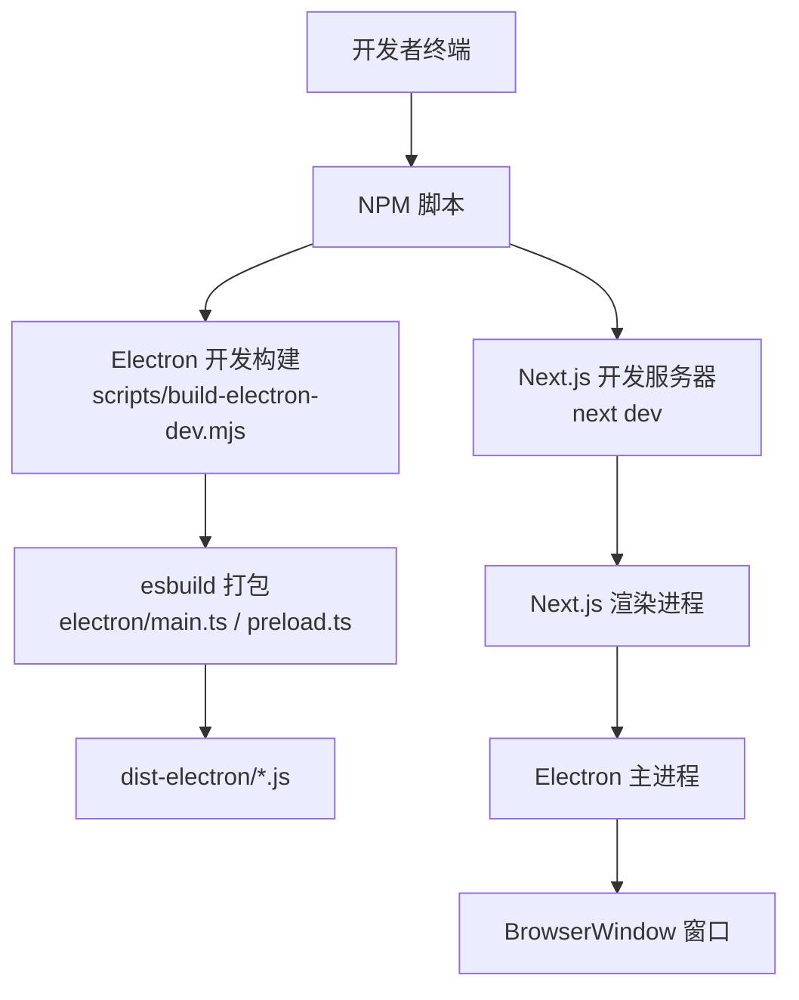
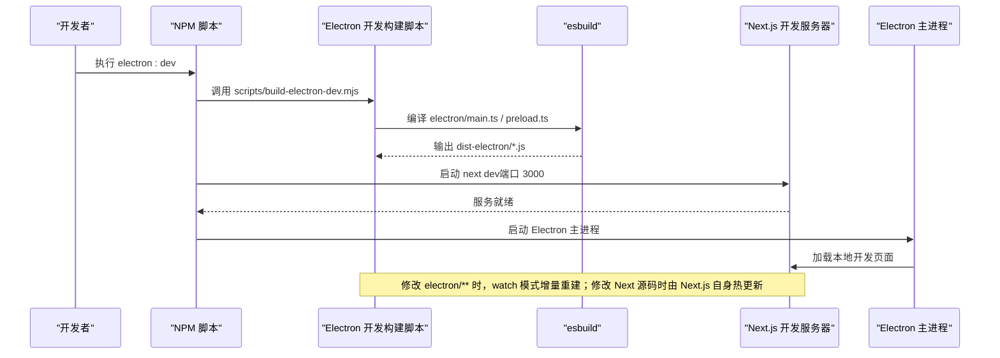
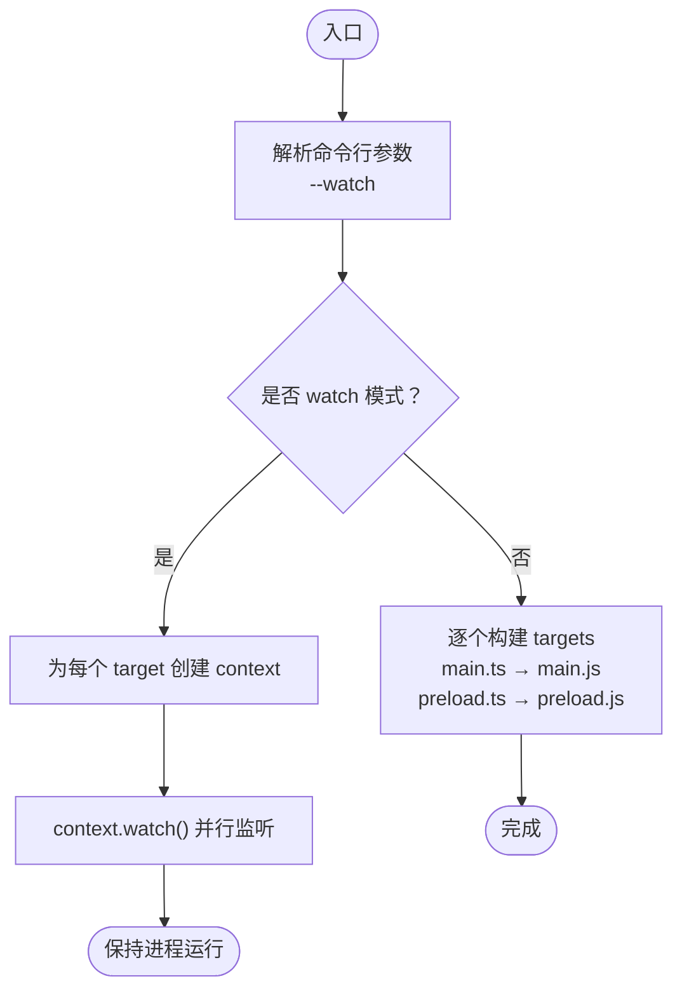
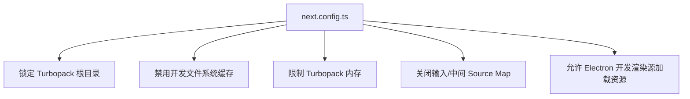
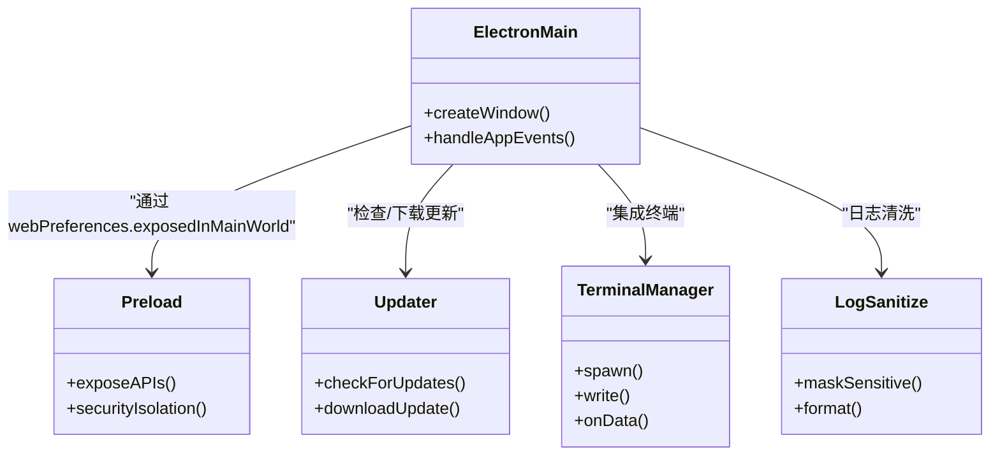
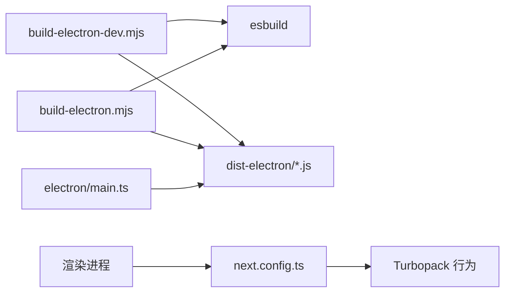

# 开发构建

<cite>
**本文引用的文件**
- [scripts/build-electron-dev.mjs](file://scripts/build-electron-dev.mjs)
- [scripts/build-electron.mjs](file://scripts/build-electron.mjs)
- [electron/tsconfig.json](file://electron/tsconfig.json)
- [next.config.ts](file://next.config.ts)
- [src/__tests__/unit/next-dev-cache-config.test.ts](file://src/__tests__/unit/next-dev-cache-config.test.ts)
- [README.md](file://README.md)
- [README_CN.md](file://README_CN.md)
- [AGENTS.md](file://AGENTS.md)
- [CLAUDE.md](file://CLAUDE.md)
- [electron/main.ts](file://electron/main.ts)
- [electron/preload.ts](file://electron/preload.ts)
- [electron/updater.ts](file://electron/updater.ts)
- [electron/terminal-manager.ts](file://electron/terminal-manager.ts)
- [electron/log-sanitize.ts](file://electron/log-sanitize.ts)
- [src/lib/mcp-loader.ts](file://src/lib/mcp-loader.ts)
</cite>

## 目录
1. [简介](#简介)
2. [项目结构](#项目结构)
3. [核心组件](#核心组件)
4. [架构总览](#架构总览)
5. [详细组件分析](#详细组件分析)
6. [依赖关系分析](#依赖关系分析)
7. [性能考量](#性能考量)
8. [故障排查指南](#故障排查指南)
9. [结论](#结论)
10. [附录](#附录)

## 简介
本指南面向 CodePilot 开发者，系统讲解开发环境搭建、脚本工作原理、优化配置与调试技巧，并提供常见问题排查方法。重点围绕以下目标展开：
- 明确 Node.js 版本要求与依赖安装步骤
- 解释 electron:dev 脚本如何并发启动 Next.js 开发服务器、Electron 主进程与预加载脚本，并说明热重载机制
- 介绍开发构建的优化配置，包括 Source Map 生成、调试工具集成与错误边界设置
- 提供断点调试、日志输出与性能分析等实用技巧
- 总结常见开发问题的定位与解决路径

## 项目结构
CodePilot 采用多包/多应用混合架构：
- 应用层：Next.js 应用位于仓库根目录（用于浏览器模式与 Electron 渲染进程）
- 桌面壳层：Electron 主进程与预加载脚本位于 electron 目录
- 构建脚本：scripts 目录下提供 Electron 开发与生产构建脚本
- 测试与配置：单元测试覆盖 Next 开发缓存策略，next.config.ts 提供开发服务器相关配置

图表来源
- [scripts/build-electron-dev.mjs:1-60](file://scripts/build-electron-dev.mjs#L1-L60)
- [electron/main.ts](file://electron/main.ts)
- [electron/preload.ts](file://electron/preload.ts)

章节来源
- [README.md:94-96](file://README.md#L94-L96)
- [README_CN.md:92-94](file://README_CN.md#L92-L94)

## 核心组件
- Electron 开发构建脚本（scripts/build-electron-dev.mjs）
  - 作用：在开发模式下编译 electron/main.ts 与 electron/preload.ts，生成 dist-electron/main.js 与 dist-electron/preload.js，并支持 watch 模式增量重建
  - 关键特性：使用 esbuild，目标平台 node，目标版本 node20，启用 sourcemap，禁用 minify，日志级别根据 watch 模式动态调整
- Electron 生产构建脚本（scripts/build-electron.mjs）
  - 作用：生产构建阶段同样编译主进程与预加载脚本，并在 next build 后修正 standalone 符号链接
- Next.js 开发配置（next.config.ts 与相关测试）
  - 作用：限制 Turbopack 根目录、禁用开发文件系统缓存、控制内存压力与 Source Map 行为，并允许 Electron 开发渲染源加载资源
- Electron 配置（electron/tsconfig.json）
  - 作用：定义 Electron 侧 TypeScript 编译选项，输出目录 dist-electron

章节来源
- [scripts/build-electron-dev.mjs:1-60](file://scripts/build-electron-dev.mjs#L1-L60)
- [scripts/build-electron.mjs:34-65](file://scripts/build-electron.mjs#L34-L65)
- [next.config.ts](file://next.config.ts)
- [src/__tests__/unit/next-dev-cache-config.test.ts:1-39](file://src/__tests__/unit/next-dev-cache-config.test.ts#L1-L39)
- [electron/tsconfig.json:1-11](file://electron/tsconfig.json#L1-L11)

## 架构总览
开发模式下的启动链路如下：
- electron:dev 脚本负责先编译 Electron 主进程与预加载脚本
- 启动 Next.js 开发服务器（监听 3000）
- Electron 主进程加载渲染进程并访问本地开发资源
- 开发过程中，Electron 侧通过 esbuild watch 实现主进程/预加载脚本的热更新（需手动重启 Electron）

图表来源
- [scripts/build-electron-dev.mjs:1-60](file://scripts/build-electron-dev.mjs#L1-L60)
- [README.md:96-96](file://README.md#L96-L96)
- [README_CN.md:94-94](file://README_CN.md#L94-L94)

## 详细组件分析

### 组件一：Electron 开发构建脚本（build-electron-dev.mjs）
- 目标与动机
  - 曾存在“跳过 Electron 编译”的做法，导致主进程变更无法及时反映到 dist-electron/main.js，引发长时间 stale 的调试成本
  - 该脚本确保在 Electron 启动前，dist-electron 中的产物是最新的
- 工作模式
  - 默认一次性构建：编译主进程与预加载脚本，完成后退出
  - watch 模式：持续监听 electron/** 变化，增量重建，保持进程常驻
- 关键配置
  - 平台与目标：platform=node，target=node20
  - 外部依赖：external=["electron"]
  - Source Map：开启 sourcemap
  - 最小化：禁用 minify
  - 日志级别：watch 模式下为 info，否则为 warning
- 注意事项
  - watch 模式下，esbuild 会保留旧产物进行增量构建；Electron 主进程本身不会自动重启，修改主进程/预加载脚本后需手动重启 Electron

图表来源
- [scripts/build-electron-dev.mjs:1-60](file://scripts/build-electron-dev.mjs#L1-L60)

章节来源
- [scripts/build-electron-dev.mjs:1-60](file://scripts/build-electron-dev.mjs#L1-L60)

### 组件二：Next.js 开发服务器优化配置
- Turbopack 根目录锁定
  - 将 Turbopack 根固定到当前工作树，避免跨工作树污染
- 禁用开发文件系统缓存
  - 避免 macOS 内存压力与恢复开销
- 内存与 Source Map 控制
  - 限制 Turbopack 内存上限，关闭输入与中间 Source Map，降低开发时资源占用
- 允许 Electron 开发渲染源加载资源
  - 在 allowedDevOrigins 中添加 127.0.0.1，使 Electron 窗口内的渲染进程可访问本地开发资源

图表来源
- [next.config.ts](file://next.config.ts)
- [src/__tests__/unit/next-dev-cache-config.test.ts:1-39](file://src/__tests__/unit/next-dev-cache-config.test.ts#L1-L39)

章节来源
- [next.config.ts](file://next.config.ts)
- [src/__tests__/unit/next-dev-cache-config.test.ts:1-39](file://src/__tests__/unit/next-dev-cache-config.test.ts#L1-L39)

### 组件三：Electron 主进程与预加载脚本
- 主进程（electron/main.ts）
  - 负责创建 BrowserWindow、加载渲染进程、处理应用生命周期与菜单等
- 预加载脚本（electron/preload.ts）
  - 提供受限的 Node/Electron API 给渲染进程，实现安全桥接
- 其他辅助模块
  - electron/updater.ts：应用更新逻辑
  - electron/terminal-manager.ts：终端管理
  - electron/log-sanitize.ts：日志清洗

图表来源
- [electron/main.ts](file://electron/main.ts)
- [electron/preload.ts](file://electron/preload.ts)
- [electron/updater.ts](file://electron/updater.ts)
- [electron/terminal-manager.ts](file://electron/terminal-manager.ts)
- [electron/log-sanitize.ts](file://electron/log-sanitize.ts)

章节来源
- [electron/main.ts](file://electron/main.ts)
- [electron/preload.ts](file://electron/preload.ts)
- [electron/updater.ts](file://electron/updater.ts)
- [electron/terminal-manager.ts](file://electron/terminal-manager.ts)
- [electron/log-sanitize.ts](file://electron/log-sanitize.ts)

### 组件四：MCP 环境变量注入（开发调试相关）
- 在开发模式下，MCP 服务器的 env 字段支持以 ${SETTING_KEY} 形式引用内部设置项，脚本会在运行时解析为实际值
- 有助于在本地快速切换 MCP 服务参数，便于联调

章节来源
- [src/lib/mcp-loader.ts:186-211](file://src/lib/mcp-loader.ts#L186-L211)

## 依赖关系分析
- 开发脚本依赖
  - scripts/build-electron-dev.mjs 依赖 esbuild 进行打包
  - scripts/build-electron.mjs 在生产构建中同样使用 esbuild，并在 next build 后修正符号链接
- 配置耦合
  - next.config.ts 与单元测试共同保证开发服务器行为符合预期（Turbopack 根、缓存、内存与 Source Map）
- 运行时耦合
  - Electron 主进程依赖 dist-electron/main.js 与 dist-electron/preload.js
  - 渲染进程依赖 Next.js 开发服务器提供的静态资源

图表来源
- [scripts/build-electron-dev.mjs:1-60](file://scripts/build-electron-dev.mjs#L1-L60)
- [scripts/build-electron.mjs:34-65](file://scripts/build-electron.mjs#L34-L65)
- [next.config.ts](file://next.config.ts)

章节来源
- [scripts/build-electron-dev.mjs:1-60](file://scripts/build-electron-dev.mjs#L1-L60)
- [scripts/build-electron.mjs:34-65](file://scripts/build-electron.mjs#L34-L65)
- [next.config.ts](file://next.config.ts)

## 性能考量
- Source Map 与调试
  - Electron 开发构建启用 sourcemap，便于断点调试与堆栈定位
  - Next.js 开发配置关闭中间与输入 Source Map，降低内存压力
- 缓存与内存
  - 禁用 Turbopack 开发文件系统缓存，避免多工作树场景下的缓存恢复导致的内存压力
  - 限制 Turbopack 内存上限，缓解大工程在开发时的内存占用
- 端口与隔离
  - 在多工作树并行开发时，建议使用非默认端口（如 3001）避免冲突

章节来源
- [scripts/build-electron-dev.mjs:33-41](file://scripts/build-electron-dev.mjs#L33-L41)
- [src/__tests__/unit/next-dev-cache-config.test.ts:26-34](file://src/__tests__/unit/next-dev-cache-config.test.ts#L26-L34)
- [AGENTS.md:33-35](file://AGENTS.md#L33-L35)

## 故障排查指南
- 症状：Electron 启动后界面无效果或样式异常
  - 可能原因：主进程/预加载脚本未重新编译，仍使用旧的 dist-electron/*.js
  - 处理：执行 electron:dev 以触发一次性构建，或在 watch 模式下等待增量重建完成
- 症状：Next.js 开发服务器频繁卡顿或内存飙升
  - 可能原因：Turbopack 文件系统缓存导致 macOS 恢复时内存压力
  - 处理：确认 next.config.ts 的相关配置已生效；必要时临时禁用缓存或降低内存上限
- 症状：Electron 开发渲染源无法加载本地资源
  - 可能原因：allowedDevOrigins 未包含 127.0.0.1
  - 处理：检查 next.config.ts 的 allowedDevOrigins 设置
- 症状：修改 electron/** 后 Electron 未自动重启
  - 可能原因：watch 模式下 Electron 主进程不会自动重启
  - 处理：手动重启 Electron；若使用 IDE/终端，请确保脚本仍在运行

章节来源
- [scripts/build-electron-dev.mjs:23-26](file://scripts/build-electron-dev.mjs#L23-L26)
- [src/__tests__/unit/next-dev-cache-config.test.ts:26-34](file://src/__tests__/unit/next-dev-cache-config.test.ts#L26-L34)
- [next.config.ts](file://next.config.ts)

## 结论
- 开发模式推荐使用 electron:dev，它确保 Electron 主进程与预加载脚本在启动前完成最新编译
- Next.js 开发服务器通过严格的 Turbopack 与缓存策略，显著降低开发时的内存与缓存开销
- Source Map 与调试工具配合，可有效提升断点调试与性能分析效率
- 遇到 stale 产物或资源加载问题，优先检查 Electron 开发构建脚本与 Next.js 开发配置

## 附录

### A. 开发环境搭建与脚本说明
- Node.js 版本要求
  - Electron 开发构建脚本目标为 node20；生产构建脚本目标为 node18
  - 建议使用与目标一致或兼容的 Node.js 版本
- 依赖安装
  - 在仓库根目录执行安装命令，确保所有子模块与脚本依赖可用
- 启动方式
  - 浏览器模式：npm run dev（端口 3000）
  - 桌面应用模式：npm run electron:dev（同时启动 Next.js 与 Electron）

章节来源
- [scripts/build-electron-dev.mjs:36-36](file://scripts/build-electron-dev.mjs#L36-L36)
- [scripts/build-electron.mjs:38-38](file://scripts/build-electron.mjs#L38-L38)
- [README.md:94-96](file://README.md#L94-L96)
- [README_CN.md:92-94](file://README_CN.md#L92-L94)

### B. 开发调试技巧
- 断点调试
  - Electron 主进程/预加载脚本启用 sourcemap，可在 IDE 中直接断点
  - 渲染进程断点可结合浏览器开发者工具
- 日志输出
  - 使用 electron/log-sanitize.ts 进行日志清洗与格式化
  - 在开发模式下，MCP 环境变量可通过 ${SETTING_KEY} 注入，便于快速切换参数
- 性能分析
  - 利用 Next.js 开发配置中的内存限制与 Source Map 关闭策略，减少干扰
  - 如需深入分析，可参考 AGENTS.md/CLAUDE.md 中关于 Chrome DevTools/CDP 的使用建议

章节来源
- [scripts/build-electron-dev.mjs:38-38](file://scripts/build-electron-dev.mjs#L38-L38)
- [electron/log-sanitize.ts](file://electron/log-sanitize.ts)
- [src/lib/mcp-loader.ts:186-211](file://src/lib/mcp-loader.ts#L186-L211)
- [AGENTS.md:19-19](file://AGENTS.md#L19-L19)
- [CLAUDE.md:19-19](file://CLAUDE.md#L19-L19)