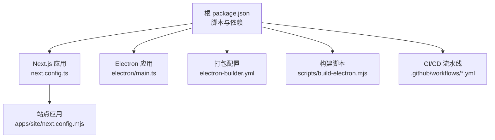
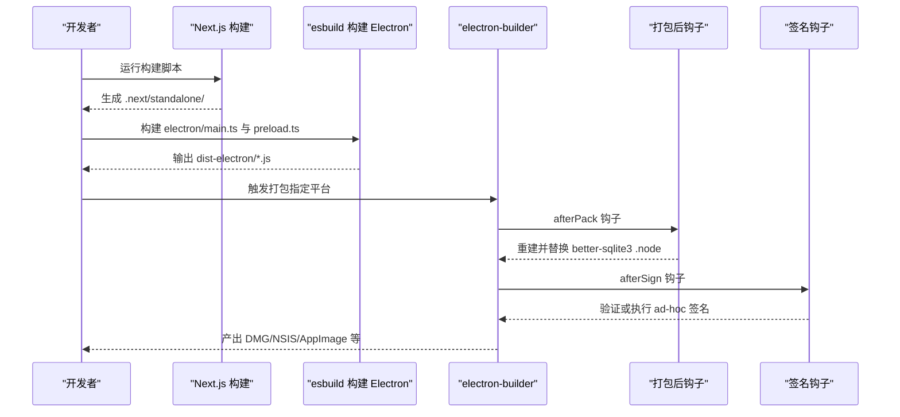
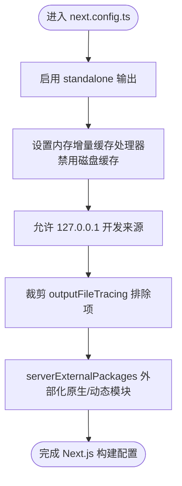
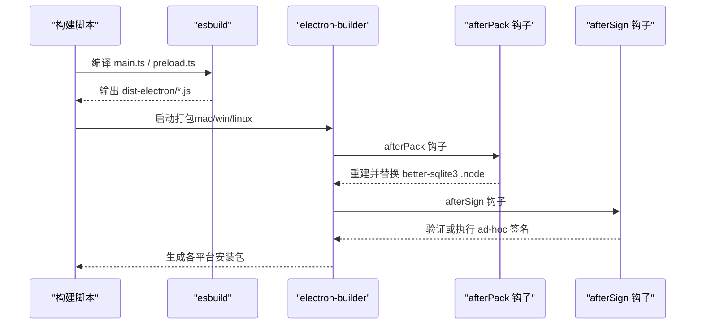
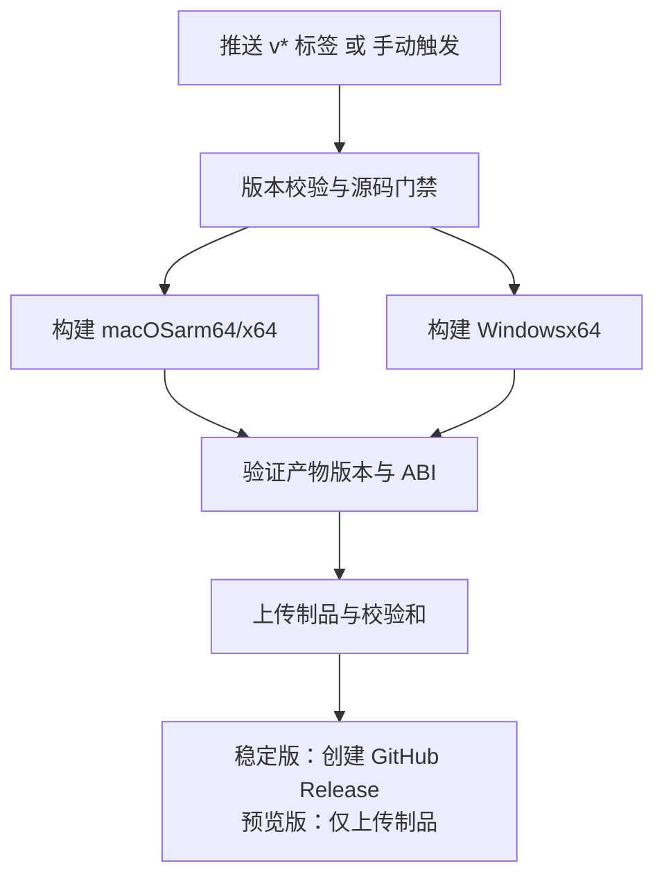
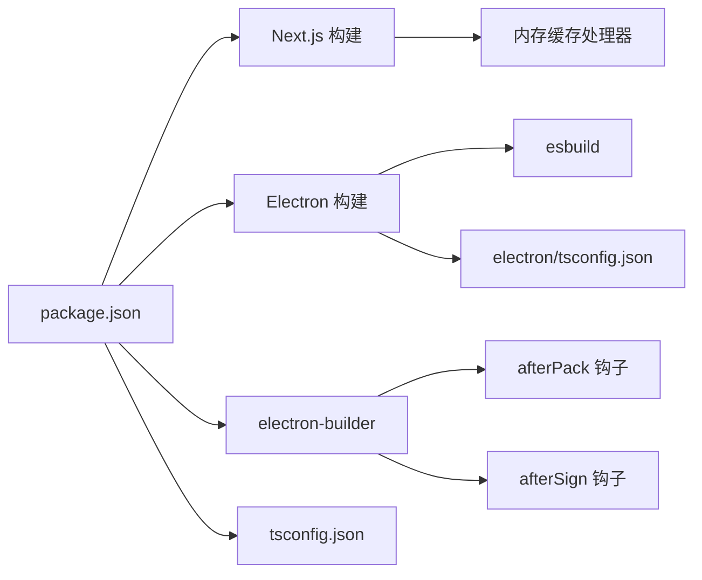

# 构建与部署

<cite>
**本文引用的文件**
- [package.json](file://package.json)
- [next.config.ts](file://next.config.ts)
- [electron-builder.yml](file://electron-builder.yml)
- [scripts/build-electron.mjs](file://scripts/build-electron.mjs)
- [scripts/build-electron-dev.mjs](file://scripts/build-electron-dev.mjs)
- [scripts/after-pack.js](file://scripts/after-pack.js)
- [scripts/after-sign.js](file://scripts/after-sign.js)
- [.github/workflows/build.yml](file://.github/workflows/build.yml)
- [.github/workflows/preview-build.yml](file://.github/workflows/preview-build.yml)
- [cache-handler.js](file://cache-handler.js)
- [electron/main.ts](file://electron/main.ts)
- [electron/updater.ts](file://electron/updater.ts)
- [apps/site/next.config.mjs](file://apps/site/next.config.mjs)
- [tsconfig.json](file://tsconfig.json)
- [electron/tsconfig.json](file://electron/tsconfig.json)
</cite>

## 目录
1. [简介](#简介)
2. [项目结构](#项目结构)
3. [核心组件](#核心组件)
4. [架构总览](#架构总览)
5. [详细组件分析](#详细组件分析)
6. [依赖关系分析](#依赖关系分析)
7. [性能考量](#性能考量)
8. [故障排查指南](#故障排查指南)
9. [结论](#结论)
10. [附录](#附录)

## 简介
本指南面向 CodePilot 的构建与部署流程，覆盖以下主题：
- 开发构建流程（Next.js + Electron）
- 生产构建配置与打包（electron-builder）
- Next.js 构建优化、代码分割与静态资源处理
- 跨平台打包、签名与自动更新策略
- 发布流程、版本管理与渠道分发
- CI/CD 配置、自动化部署与回滚策略
- 构建优化技巧、包大小分析与性能监控方法

## 项目结构
本仓库采用多包工作区结构，核心应用位于根目录，Next.js 前端与 Electron 主进程分别由独立配置驱动；CI/CD 使用 GitHub Actions 在不同平台上执行稳定版与预览版构建。

图示来源
- [package.json](file://package.json)
- [next.config.ts](file://next.config.ts)
- [electron-builder.yml](file://electron-builder.yml)
- [scripts/build-electron.mjs](file://scripts/build-electron.mjs)
- [.github/workflows/build.yml](file://.github/workflows/build.yml)
- [apps/site/next.config.mjs](file://apps/site/next.config.mjs)

章节来源
- [package.json](file://package.json)
- [next.config.ts](file://next.config.ts)
- [electron-builder.yml](file://electron-builder.yml)
- [scripts/build-electron.mjs](file://scripts/build-electron.mjs)
- [.github/workflows/build.yml](file://.github/workflows/build.yml)
- [apps/site/next.config.mjs](file://apps/site/next.config.mjs)

## 核心组件
- Next.js 构建与缓存：通过 standalone 输出与内存增量缓存处理器，适配桌面应用只读安装目录场景。
- Electron 打包：使用 esbuild 构建主进程与预加载脚本，electron-builder 统一打包与分发。
- CI/CD：两条流水线分别负责稳定版发布与预览版产物生成与校验。
- 自动更新：当前禁用原生自动更新，推荐用户从 GitHub Releases 下载更新。

章节来源
- [next.config.ts](file://next.config.ts)
- [cache-handler.js](file://cache-handler.js)
- [electron-builder.yml](file://electron-builder.yml)
- [scripts/build-electron.mjs](file://scripts/build-electron.mjs)
- [electron/updater.ts](file://electron/updater.ts)
- [.github/workflows/build.yml](file://.github/workflows/build.yml)
- [.github/workflows/preview-build.yml](file://.github/workflows/preview-build.yml)

## 架构总览
下图展示从源码到可分发包的关键步骤：Next.js 构建 → Electron 主/预加载构建 → electron-builder 打包 → 平台特定后处理（原生模块重建、签名）。

图示来源
- [scripts/build-electron.mjs](file://scripts/build-electron.mjs)
- [scripts/after-pack.js](file://scripts/after-pack.js)
- [scripts/after-sign.js](file://scripts/after-sign.js)
- [electron-builder.yml](file://electron-builder.yml)

## 详细组件分析

### Next.js 构建与优化
- Standalone 输出：在只读安装目录运行时避免写入缓存，使用内存增量缓存处理器替代默认文件系统缓存。
- 缓存配置：禁用磁盘缓存，自定义增量缓存处理器，限制最大条目数，避免长期运行导致内存膨胀。
- 开发体验：允许来自 127.0.0.1 的资源以支持 Electron 开发模式下的 HMR/字体等资源加载。
- 输出追踪裁剪：排除文档、测试、脚本等非必要目录，减少 NFT 清单体积。
- 独立外部化：对原生模块与动态加载库进行 serverExternalPackages 处理，避免打包失败。
- 站点应用：apps/site 使用 MDX 支持与输出追踪根路径配置，确保文档站点构建稳定。

图示来源
- [next.config.ts](file://next.config.ts)
- [cache-handler.js](file://cache-handler.js)
- [apps/site/next.config.mjs](file://apps/site/next.config.mjs)

章节来源
- [next.config.ts](file://next.config.ts)
- [cache-handler.js](file://cache-handler.js)
- [apps/site/next.config.mjs](file://apps/site/next.config.mjs)

### Electron 应用构建与打包
- 主进程与预加载构建：使用 esbuild 将 TypeScript 编译为 Node.js 可执行的 JS，并生成 sourcemap。
- 清理与复制：每次构建前清理 dist-electron，避免陈旧文件污染 asar。
- 站点资源打包：electron-builder 将 .next/standalone 与 public、themes 等资源复制到最终包中。
- 原生模块处理：afterPack 钩子在打包后重建 better-sqlite3 以匹配目标 Electron ABI，并替换所有 .node 文件。
- 签名与验证：afterSign 钩子在无真实证书时执行 ad-hoc 签名，保证更新器 ShipIt 能验证签名；有真实证书时跳过 ad-hoc 并验证签名有效性。
- 自动更新：当前禁用原生自动更新，建议用户从 GitHub Releases 下载最新版本。

图示来源
- [scripts/build-electron.mjs](file://scripts/build-electron.mjs)
- [scripts/after-pack.js](file://scripts/after-pack.js)
- [scripts/after-sign.js](file://scripts/after-sign.js)
- [electron-builder.yml](file://electron-builder.yml)
- [electron/updater.ts](file://electron/updater.ts)

章节来源
- [scripts/build-electron.mjs](file://scripts/build-electron.mjs)
- [scripts/build-electron-dev.mjs](file://scripts/build-electron-dev.mjs)
- [scripts/after-pack.js](file://scripts/after-pack.js)
- [scripts/after-sign.js](file://scripts/after-sign.js)
- [electron-builder.yml](file://electron-builder.yml)
- [electron/main.ts](file://electron/main.ts)
- [electron/updater.ts](file://electron/updater.ts)

### CI/CD 与发布流程
- 稳定版流水线（build.yml）：在推送 v* 标签时触发，校验版本一致性、启动回归基线与原生模块 ABI，分别构建 macOS（arm64+x64）与 Windows（x64），上传产物并创建 GitHub Release。
- 预览版流水线（preview-build.yml）：手动触发，严格校验源码状态与版本来源单一性，仅生成预览版安装包与校验信息，不创建 Release。
- 关键门禁：禁止 Codex app-server 使用 --listen；ClaudeCode 对裸 “sonnet” 模型别名进行规范；P0 启动回归用例；打包后原生模块 ABI 可加载。

图示来源
- [.github/workflows/build.yml](file://.github/workflows/build.yml)
- [.github/workflows/preview-build.yml](file://.github/workflows/preview-build.yml)

章节来源
- [.github/workflows/build.yml](file://.github/workflows/build.yml)
- [.github/workflows/preview-build.yml](file://.github/workflows/preview-build.yml)

### 版本管理与渠道分发
- 版本来源：统一来源于 package.json，CI 中通过 npm version 固化，确保前端 NEXT_PUBLIC_APP_VERSION、桌面应用版本与包元数据一致。
- 渠道策略：
  - 稳定版：GitHub Releases，发布说明来自 RELEASE_NOTES.md。
  - 预览版：仅上传制品与校验信息，不创建 Release，便于追溯到具体 CI 运行。
- 自动更新：当前禁用原生自动更新，用户从 Releases 下载更新。

章节来源
- [.github/workflows/build.yml](file://.github/workflows/build.yml)
- [.github/workflows/preview-build.yml](file://.github/workflows/preview-build.yml)
- [electron/updater.ts](file://electron/updater.ts)

## 依赖关系分析
- 构建工具链：Next.js（standalone）、esbuild（Electron）、electron-builder（打包）、@electron/rebuild（原生模块重编译）。
- 运行时依赖：Sentry（错误上报）、electron-updater（自动更新，当前禁用）、better-sqlite3（原生模块）。
- 类型与配置：tsconfig.json 控制主应用类型检查；electron/tsconfig.json 控制 Electron 构建输出目录。

图示来源
- [package.json](file://package.json)
- [scripts/build-electron.mjs](file://scripts/build-electron.mjs)
- [scripts/after-pack.js](file://scripts/after-pack.js)
- [scripts/after-sign.js](file://scripts/after-sign.js)
- [next.config.ts](file://next.config.ts)
- [cache-handler.js](file://cache-handler.js)
- [tsconfig.json](file://tsconfig.json)
- [electron/tsconfig.json](file://electron/tsconfig.json)

章节来源
- [package.json](file://package.json)
- [tsconfig.json](file://tsconfig.json)
- [electron/tsconfig.json](file://electron/tsconfig.json)

## 性能考量
- Next.js 构建优化
  - Standalone 输出：减少运行时依赖扫描与打包体积。
  - 内存增量缓存：避免在只读安装目录写入缓存，降低 I/O 与权限问题风险。
  - 输出追踪裁剪：排除文档与测试资源，缩短 NFT 分析范围。
  - serverExternalPackages：避免原生模块与动态加载库被错误打包。
- Electron 打包优化
  - afterPack 钩子：仅在打包后重建 better-sqlite3，避免开发阶段的额外开销。
  - asarUnpack：对 .node 与 better-sqlite3 目录进行解包，确保原生模块可用。
- 开发体验
  - electron:dev：使用 esbuild watch 模式增量构建，提升迭代速度。
  - allowedDevOrigins：允许 127.0.0.1 资源，避免跨域阻断 HMR/字体等。

章节来源
- [next.config.ts](file://next.config.ts)
- [cache-handler.js](file://cache-handler.js)
- [scripts/build-electron.mjs](file://scripts/build-electron.mjs)
- [scripts/build-electron-dev.mjs](file://scripts/build-electron-dev.mjs)
- [electron-builder.yml](file://electron-builder.yml)

## 故障排查指南
- 原生模块 ABI 不匹配
  - 现象：better-sqlite3 加载失败，提示 NODE_MODULE_VERSION。
  - 排查：确认 afterPack 是否成功重建并替换 .node；检查 Electron 版本与 Node ABI 是否一致。
  - 参考：主进程 ABI 校验逻辑与钩子实现。
- 签名问题
  - 现象：未签名或签名验证失败。
  - 排查：确认是否提供 CSC_LINK/CSC_NAME 或系统证书；若无证书，afterSign 将执行 ad-hoc 签名并验证。
- 缓存写入权限错误
  - 现象：只读安装目录下无法创建 .next/cache 导致 EPERM。
  - 解决：使用内存缓存处理器，避免写入只读路径。
- 开发资源跨域阻断
  - 现象：HMR/字体资源被拦截。
  - 解决：配置 allowedDevOrigins 允许 127.0.0.1。
- CI 构建失败
  - 现象：版本不一致、Codex 使用 --listen、sonnet 别名未规范化。
  - 解决：遵循 CI 门禁，确保提交包含必需修复与版本补丁。

章节来源
- [scripts/after-pack.js](file://scripts/after-pack.js)
- [scripts/after-sign.js](file://scripts/after-sign.js)
- [electron/main.ts](file://electron/main.ts)
- [cache-handler.js](file://cache-handler.js)
- [next.config.ts](file://next.config.ts)
- [.github/workflows/build.yml](file://.github/workflows/build.yml)
- [.github/workflows/preview-build.yml](file://.github/workflows/preview-build.yml)

## 结论
本指南总结了 CodePilot 的构建与部署全链路：以 Next.js standalone 适配桌面运行环境，以 esbuild + electron-builder 完成跨平台打包，并通过 CI/CD 确保版本一致性与质量门禁。当前自动更新策略为用户从 Releases 下载更新，原生自动更新处于禁用状态。建议在后续版本中考虑引入更完善的签名与公证流程，以及可选的自动更新通道。

## 附录

### 开发构建流程
- 启动 Next.js 开发服务器与 Electron 主进程：
  - 使用脚本同时启动 next dev、Electron 主进程与预加载构建（watch 模式）。
- Electron 开发构建：
  - 提供一次性构建与 watch 模式，确保编辑后 Electron 主进程代码及时生效。

章节来源
- [package.json](file://package.json)
- [scripts/build-electron-dev.mjs](file://scripts/build-electron-dev.mjs)

### 生产构建与打包
- 步骤概览：
  - Next.js 构建 → Electron 主/预加载构建 → electron-builder 打包 → afterPack 重建原生模块 → afterSign 签名验证。
- 平台差异：
  - macOS：支持 dmg 与 zip，启用硬编码运行时与继承权限。
  - Windows：NSIS 安装器，支持选择安装路径与桌面快捷方式。
  - Linux：AppImage、deb、rpm，架构由 CI 参数控制。

章节来源
- [package.json](file://package.json)
- [scripts/build-electron.mjs](file://scripts/build-electron.mjs)
- [electron-builder.yml](file://electron-builder.yml)

### 自动更新机制
- 当前策略：禁用原生自动更新，用户从 GitHub Releases 下载更新。
- 建议：如需启用原生自动更新，可在 macOS 引入公证流程并在 CI 中配置签名证书。

章节来源
- [electron/updater.ts](file://electron/updater.ts)

### 版本管理与发布
- 单一版本源：package.json，CI 中通过 npm version 固化版本。
- 稳定版：v* 标签触发，创建 GitHub Release 并附带发布说明与校验和。
- 预览版：手动触发，仅上传制品与校验信息，不创建 Release。

章节来源
- [.github/workflows/build.yml](file://.github/workflows/build.yml)
- [.github/workflows/preview-build.yml](file://.github/workflows/preview-build.yml)

### 包大小分析与性能监控
- 包大小分析建议：
  - 使用 electron-builder 的 asar 与 asarUnpack 策略，结合 afterPack 替换 .node 的方式评估原生模块占比。
  - 对 Next.js 输出进行文件级分析，关注 .next/standalone 与 public/themes 的体积贡献。
- 性能监控建议：
  - 在 Sentry 初始化位置捕获早期崩溃，结合错误上报定位打包与运行期异常。
  - 在 CI 中增加产物校验（版本号、签名、better-sqlite3 ABI），作为回归监控的一部分。

章节来源
- [electron-builder.yml](file://electron-builder.yml)
- [scripts/after-pack.js](file://scripts/after-pack.js)
- [scripts/after-sign.js](file://scripts/after-sign.js)
- [package.json](file://package.json)