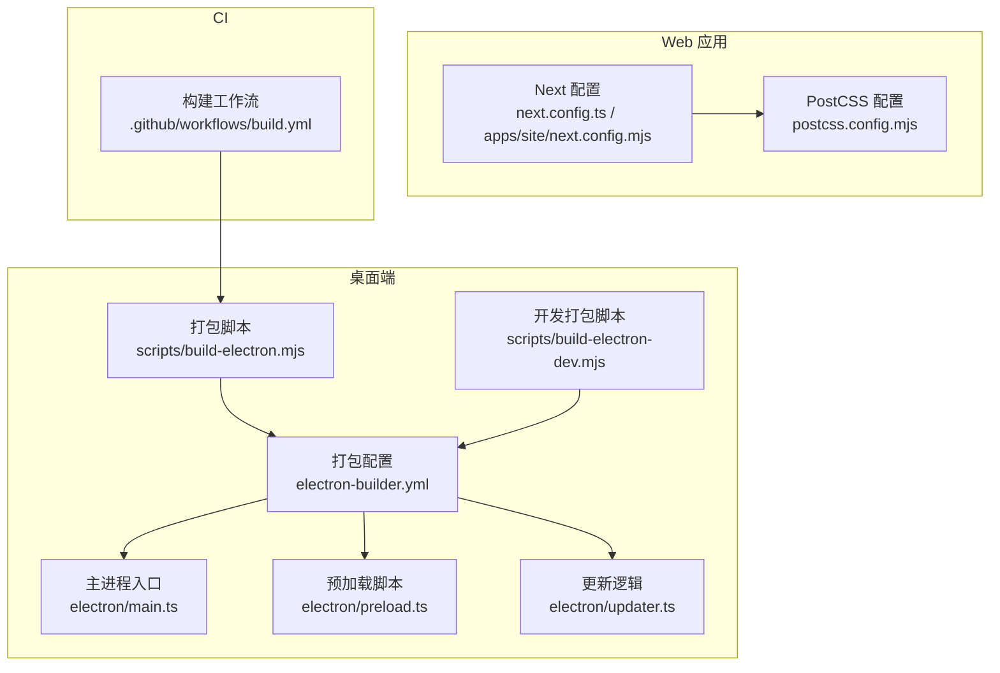
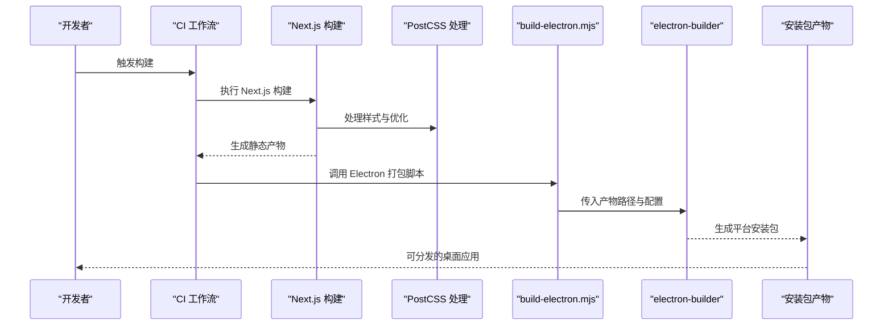
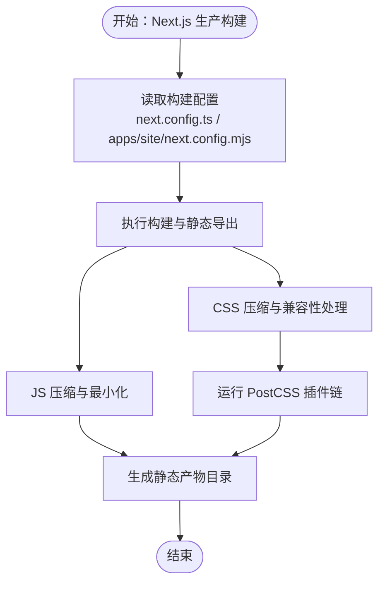
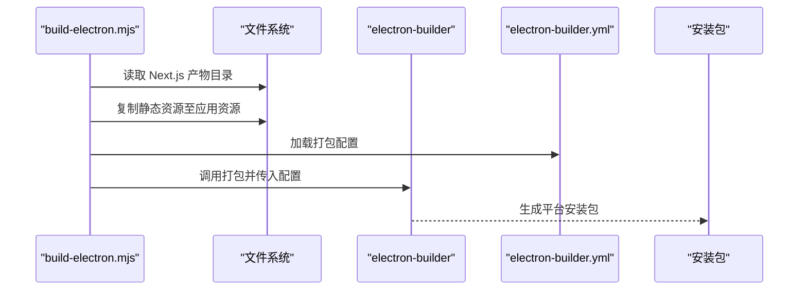
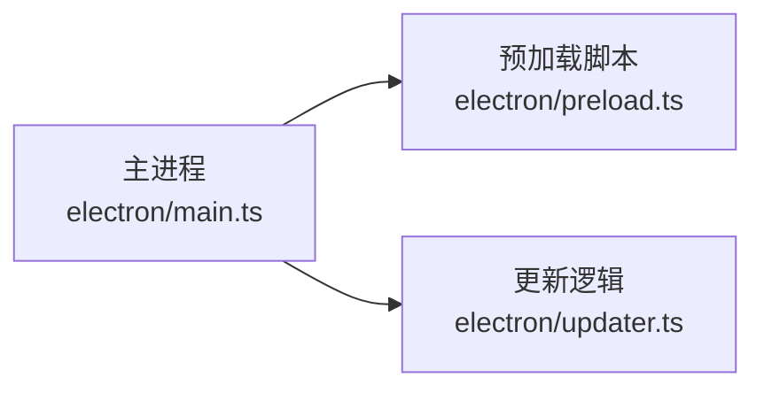
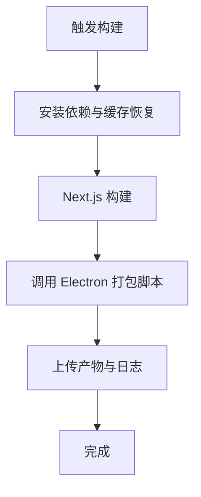
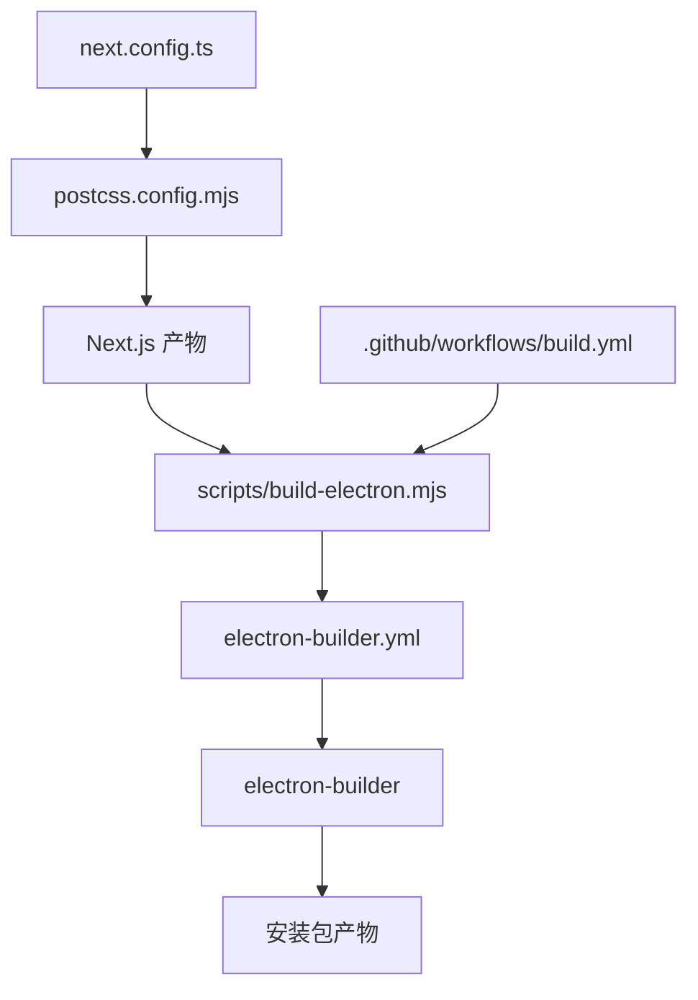

# 生产构建

<cite>
**本文引用的文件**
- [next.config.ts](file://next.config.ts)
- [next.config.mjs](file://apps/site/next.config.mjs)
- [postcss.config.mjs](file://postcss.config.mjs)
- [scripts/build-electron.mjs](file://scripts/build-electron.mjs)
- [scripts/build-electron-dev.mjs](file://scripts/build-electron-dev.mjs)
- [electron/main.ts](file://electron/main.ts)
- [electron/preload.ts](file://electron/preload.ts)
- [electron/updater.ts](file://electron/updater.ts)
- [electron-builder.yml](file://electron-builder.yml)
- [.github/workflows/build.yml](file://.github/workflows/build.yml)
- [package.json](file://package.json)
</cite>

## 目录
1. [简介](#简介)
2. [项目结构](#项目结构)
3. [核心组件](#核心组件)
4. [架构总览](#架构总览)
5. [详细组件分析](#详细组件分析)
6. [依赖关系分析](#依赖关系分析)
7. [性能考量](#性能考量)
8. [故障排查指南](#故障排查指南)
9. [结论](#结论)
10. [附录](#附录)

## 简介
本指南面向生产环境，系统化阐述 CodePilot 的构建流程与优化策略，覆盖以下要点：
- Next.js 静态资源优化、代码分割与压缩配置
- electron:build 脚本的执行步骤（前端产物处理与主进程打包）
- 构建优化策略（Tree Shaking、Bundle 分析、缓存配置）
- 构建产物验证（文件完整性与性能基准）
- 常见构建失败原因与修复方案

## 项目结构
本仓库采用多包/多应用组织方式：
- Web 应用：Next.js 应用位于根目录与 apps/site
- 桌面端：Electron 主进程、预加载脚本与更新逻辑位于 electron/
- 构建脚本：scripts/ 下提供 Electron 打包脚本
- 打包配置：electron-builder.yml 统一管理打包参数
- CI：.github/workflows/build.yml 定义流水线任务

图表来源
- [next.config.ts](file://next.config.ts)
- [next.config.mjs](file://apps/site/next.config.mjs)
- [postcss.config.mjs](file://postcss.config.mjs)
- [scripts/build-electron.mjs](file://scripts/build-electron.mjs)
- [scripts/build-electron-dev.mjs](file://scripts/build-electron-dev.mjs)
- [electron/main.ts](file://electron/main.ts)
- [electron/preload.ts](file://electron/preload.ts)
- [electron/updater.ts](file://electron/updater.ts)
- [electron-builder.yml](file://electron-builder.yml)
- [.github/workflows/build.yml](file://.github/workflows/build.yml)

章节来源
- [next.config.ts](file://next.config.ts)
- [next.config.mjs](file://apps/site/next.config.mjs)
- [postcss.config.mjs](file://postcss.config.mjs)
- [scripts/build-electron.mjs](file://scripts/build-electron.mjs)
- [scripts/build-electron-dev.mjs](file://scripts/build-electron-dev.mjs)
- [electron-builder.yml](file://electron-builder.yml)
- [.github/workflows/build.yml](file://.github/workflows/build.yml)

## 核心组件
- Next.js 构建配置：控制静态导出、产物目录、实验性功能与优化开关
- PostCSS：统一样式处理与优化
- Electron 打包脚本：封装前端产物复制、资源注入与 electron-builder 调用
- electron-builder.yml：定义输出平台、安装包格式、签名与自动更新策略
- CI 工作流：自动化触发构建、上传与发布

章节来源
- [next.config.ts](file://next.config.ts)
- [postcss.config.mjs](file://postcss.config.mjs)
- [scripts/build-electron.mjs](file://scripts/build-electron.mjs)
- [electron-builder.yml](file://electron-builder.yml)
- [.github/workflows/build.yml](file://.github/workflows/build.yml)

## 架构总览
生产构建分为两条主线：
- Web 端：Next.js 进行页面与静态资源构建，PostCSS 优化样式，最终产出静态文件
- 桌面端：Electron 打包脚本将 Web 产物注入到可执行包中，并通过 electron-builder 输出各平台安装包

图表来源
- [.github/workflows/build.yml](file://.github/workflows/build.yml)
- [scripts/build-electron.mjs](file://scripts/build-electron.mjs)
- [electron-builder.yml](file://electron-builder.yml)

## 详细组件分析

### Next.js 生产构建与优化
- 静态资源优化
  - 使用静态导出（Static Export）以获得最佳 CDN 友好性与部署灵活性
  - 启用图片与字体的自动优化与按需加载
- 代码分割
  - 利用 Next.js 的路由级代码分割，确保首屏仅加载必要模块
  - 动态导入（Dynamic Imports）用于非关键路径组件与第三方库
- 压缩与最小化
  - 在生产模式下自动启用 JS/HTML/CSS 压缩
  - PostCSS 插件链负责 CSS 压缩与兼容性处理
- 缓存策略
  - 产物目录与哈希命名确保浏览器与 CDN 缓存失效可控
  - 静态资源版本化与增量缓存友好

图表来源
- [next.config.ts](file://next.config.ts)
- [next.config.mjs](file://apps/site/next.config.mjs)
- [postcss.config.mjs](file://postcss.config.mjs)

章节来源
- [next.config.ts](file://next.config.ts)
- [next.config.mjs](file://apps/site/next.config.mjs)
- [postcss.config.mjs](file://postcss.config.mjs)

### Electron 打包脚本（electron:build）
- 执行步骤
  - 读取 Next.js 构建产物目录
  - 将静态资源复制到 Electron 应用资源目录
  - 注入预加载脚本与主进程入口
  - 调用 electron-builder 并传入打包配置
- 前端产物处理
  - 自动识别静态导出产物并进行注入
  - 保持资源路径与哈希命名一致性
- 主进程打包
  - 依据 electron-builder.yml 配置输出平台与安装包格式
  - 支持签名、自动更新与侧载策略

图表来源
- [scripts/build-electron.mjs](file://scripts/build-electron.mjs)
- [electron-builder.yml](file://electron-builder.yml)

章节来源
- [scripts/build-electron.mjs](file://scripts/build-electron.mjs)
- [electron-builder.yml](file://electron-builder.yml)

### Electron 主进程与预加载
- 主进程入口
  - 初始化窗口、菜单、托盘与更新逻辑
- 预加载脚本
  - 为渲染进程暴露安全的 API 桥接
- 更新逻辑
  - 与主进程协同实现应用内更新与版本检测

图表来源
- [electron/main.ts](file://electron/main.ts)
- [electron/preload.ts](file://electron/preload.ts)
- [electron/updater.ts](file://electron/updater.ts)

章节来源
- [electron/main.ts](file://electron/main.ts)
- [electron/preload.ts](file://electron/preload.ts)
- [electron/updater.ts](file://electron/updater.ts)

### CI 构建工作流
- 触发条件
  - 推送至受保护分支或手动触发
- 步骤概览
  - 安装依赖与缓存恢复
  - 运行 Next.js 构建
  - 执行 Electron 打包脚本
  - 上传构建产物与日志
- 结果
  - 生成可分发的桌面端安装包

图表来源
- [.github/workflows/build.yml](file://.github/workflows/build.yml)

章节来源
- [.github/workflows/build.yml](file://.github/workflows/build.yml)

## 依赖关系分析
- Web 与桌面端耦合点
  - Next.js 产物作为 Electron 应用的静态资源源
  - electron-builder.yml 作为统一打包契约
- 关键依赖链
  - next.config.ts → PostCSS → Next.js 构建产物
  - scripts/build-electron.mjs → electron-builder.yml → electron-builder → 安装包
  - .github/workflows/build.yml → scripts/build-electron.mjs

图表来源
- [next.config.ts](file://next.config.ts)
- [postcss.config.mjs](file://postcss.config.mjs)
- [scripts/build-electron.mjs](file://scripts/build-electron.mjs)
- [electron-builder.yml](file://electron-builder.yml)
- [.github/workflows/build.yml](file://.github/workflows/build.yml)

章节来源
- [next.config.ts](file://next.config.ts)
- [postcss.config.mjs](file://postcss.config.mjs)
- [scripts/build-electron.mjs](file://scripts/build-electron.mjs)
- [electron-builder.yml](file://electron-builder.yml)
- [.github/workflows/build.yml](file://.github/workflows/build.yml)

## 性能考量
- Tree Shaking
  - 使用生产模式构建，未使用的模块将被移除
  - 确保模块导出采用 ES Module 形式，避免副作用污染
- Bundle 分析
  - 在本地或 CI 中启用分析报告，定位大体积依赖与重复模块
  - 结合代码分割策略，拆分第三方库与业务代码
- 缓存配置
  - 利用 Next.js 的产物哈希命名与 CDN 缓存头
  - electron-builder.yml 中设置合理的缓存与签名策略
- 样式优化
  - PostCSS 插件链负责压缩与兼容性处理，减少运行时开销

章节来源
- [next.config.ts](file://next.config.ts)
- [postcss.config.mjs](file://postcss.config.mjs)
- [electron-builder.yml](file://electron-builder.yml)

## 故障排查指南
- Next.js 构建失败
  - 检查 next.config.ts 与 apps/site/next.config.mjs 的配置冲突
  - 确认依赖安装与 Node 版本满足要求
  - 查看构建日志中的类型错误与语法问题
- PostCSS 处理异常
  - 核对 postcss.config.mjs 的插件顺序与兼容性
  - 清理缓存后重试构建
- Electron 打包失败
  - 确认 scripts/build-electron.mjs 能正确读取 Next.js 产物目录
  - 检查 electron-builder.yml 的输出路径与签名配置
  - 验证平台依赖（如 macOS 的 codesign）是否就绪
- CI 构建中断
  - 检查 .github/workflows/build.yml 的步骤与环境变量
  - 确认缓存命中与依赖锁定文件一致

章节来源
- [next.config.ts](file://next.config.ts)
- [next.config.mjs](file://apps/site/next.config.mjs)
- [postcss.config.mjs](file://postcss.config.mjs)
- [scripts/build-electron.mjs](file://scripts/build-electron.mjs)
- [electron-builder.yml](file://electron-builder.yml)
- [.github/workflows/build.yml](file://.github/workflows/build.yml)

## 结论
通过明确的 Next.js 优化策略与 Electron 打包脚本协作，CodePilot 的生产构建具备良好的可维护性与可扩展性。建议在持续集成中加入 Bundle 分析与性能基线监控，以保障构建质量与用户体验。

## 附录
- 构建产物验证清单
  - 文件完整性：校验产物目录存在且无缺失
  - 性能基线：记录构建时间、包体大小与关键指标
  - 平台一致性：在目标平台运行安装包，验证启动与更新流程
- 常用命令参考
  - Next.js 生产构建：在根目录执行生产构建命令
  - Electron 开发打包：使用 scripts/build-electron-dev.mjs
  - Electron 生产打包：使用 scripts/build-electron.mjs
  - CI 触发：推送或手动触发 .github/workflows/build.yml

章节来源
- [scripts/build-electron-dev.mjs](file://scripts/build-electron-dev.mjs)
- [scripts/build-electron.mjs](file://scripts/build-electron.mjs)
- [.github/workflows/build.yml](file://.github/workflows/build.yml)
- [package.json](file://package.json)