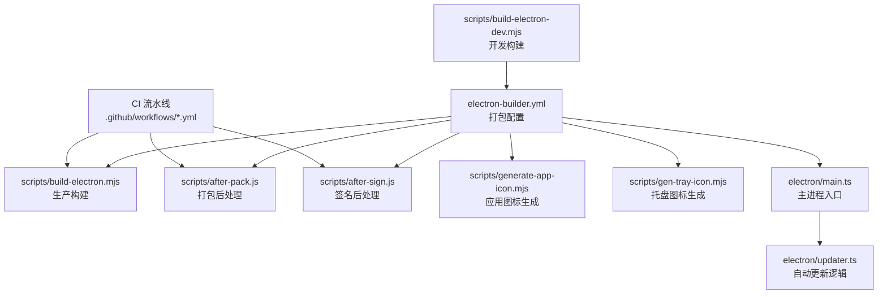
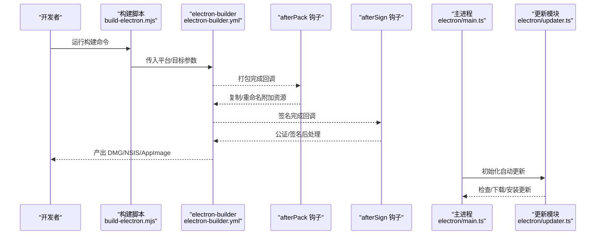
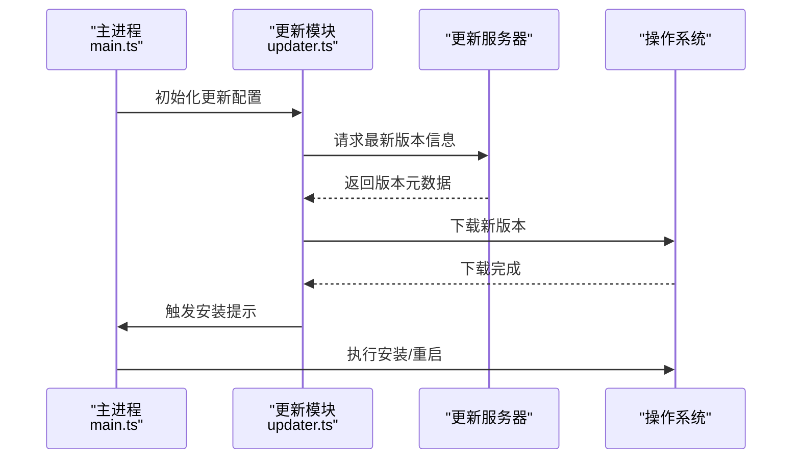
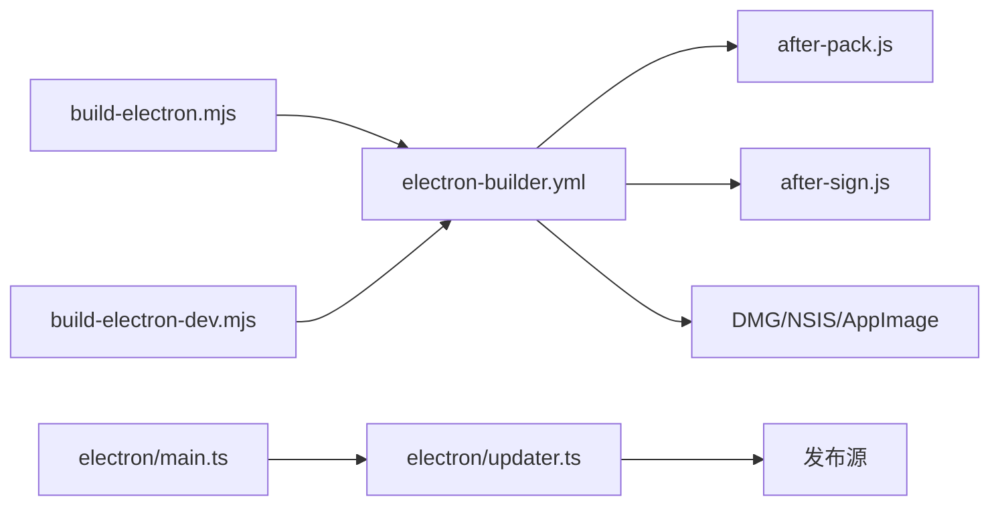

# 跨平台打包

<cite>
**本文引用的文件**
- [electron-builder.yml](file://electron-builder.yml)
- [build-electron.mjs](file://scripts/build-electron.mjs)
- [build-electron-dev.mjs](file://scripts/build-electron-dev.mjs)
- [after-pack.js](file://scripts/after-pack.js)
- [after-sign.js](file://scripts/after-sign.js)
- [gen-tray-icon.mjs](file://scripts/gen-tray-icon.mjs)
- [generate-app-icon.mjs](file://scripts/generate-app-icon.mjs)
- [main.ts](file://electron/main.ts)
- [updater.ts](file://electron/updater.ts)
- [build.yml](file://.github/workflows/build.yml)
- [preview-build.yml](file://.github/workflows/preview-build.yml)
- [preview-release.yml](file://.github/workflows/preview-release.yml)
</cite>

## 目录
1. [简介](#简介)
2. [项目结构](#项目结构)
3. [核心组件](#核心组件)
4. [架构总览](#架构总览)
5. [详细组件分析](#详细组件分析)
6. [依赖关系分析](#依赖关系分析)
7. [性能考虑](#性能考虑)
8. [故障排查指南](#故障排查指南)
9. [结论](#结论)
10. [附录](#附录)

## 简介
本指南面向 CodePilot 的跨平台打包与分发，围绕 electron-builder 配置、图标资源处理、签名证书、平台目标（macOS DMG、Windows NSIS、Linux AppImage）、自动更新机制、平台特定优化以及打包测试与常见问题进行系统化说明。文档以仓库中现有配置与脚本为依据，避免臆测，确保可操作性与可追溯性。

## 项目结构
与打包密切相关的目录与文件：
- 打包配置：electron-builder.yml
- 构建脚本：scripts/build-electron.mjs、scripts/build-electron-dev.mjs
- 后处理钩子：scripts/after-pack.js、scripts/after-sign.js
- 图标生成：scripts/gen-tray-icon.mjs、scripts/generate-app-icon.mjs
- 应用入口与更新：electron/main.ts、electron/updater.ts
- CI 流水线：.github/workflows/*.yml

图表来源
- [electron-builder.yml](file://electron-builder.yml)
- [build-electron.mjs](file://scripts/build-electron.mjs)
- [build-electron-dev.mjs](file://scripts/build-electron-dev.mjs)
- [after-pack.js](file://scripts/after-pack.js)
- [after-sign.js](file://scripts/after-sign.js)
- [generate-app-icon.mjs](file://scripts/generate-app-icon.mjs)
- [gen-tray-icon.mjs](file://scripts/gen-tray-icon.mjs)
- [main.ts](file://electron/main.ts)
- [updater.ts](file://electron/updater.ts)
- [build.yml](file://.github/workflows/build.yml)
- [preview-build.yml](file://.github/workflows/preview-build.yml)
- [preview-release.yml](file://.github/workflows/preview-release.yml)

章节来源
- [electron-builder.yml](file://electron-builder.yml)
- [build-electron.mjs](file://scripts/build-electron.mjs)
- [build-electron-dev.mjs](file://scripts/build-electron-dev.mjs)
- [after-pack.js](file://scripts/after-pack.js)
- [after-sign.js](file://scripts/after-sign.js)
- [generate-app-icon.mjs](file://scripts/generate-app-icon.mjs)
- [gen-tray-icon.mjs](file://scripts/gen-tray-icon.mjs)
- [main.ts](file://electron/main.ts)
- [updater.ts](file://electron/updater.ts)
- [.github/workflows/build.yml](file://.github/workflows/build.yml)
- [.github/workflows/preview-build.yml](file://.github/workflows/preview-build.yml)
- [.github/workflows/preview-release.yml](file://.github/workflows/preview-release.yml)

## 核心组件
- electron-builder 配置：定义目标平台、输出格式、签名策略、DMG/NSIS/AppImage 参数、图标与版权信息等。
- 构建脚本：封装生产与开发环境的打包命令，调用 electron-builder 并传递参数。
- 后处理钩子：afterPack 用于在打包完成后复制额外资源或重命名产物；afterSign 用于签名后执行额外步骤（如公证）。
- 图标生成：自动生成多尺寸应用图标与托盘图标，保证各平台显示一致。
- 主进程与更新：主进程负责初始化窗口与菜单；自动更新模块负责检查更新、下载与安装。

章节来源
- [electron-builder.yml](file://electron-builder.yml)
- [build-electron.mjs](file://scripts/build-electron.mjs)
- [build-electron-dev.mjs](file://scripts/build-electron-dev.mjs)
- [after-pack.js](file://scripts/after-pack.js)
- [after-sign.js](file://scripts/after-sign.js)
- [generate-app-icon.mjs](file://scripts/generate-app-icon.mjs)
- [gen-tray-icon.mjs](file://scripts/gen-tray-icon.mjs)
- [main.ts](file://electron/main.ts)
- [updater.ts](file://electron/updater.ts)

## 架构总览
下图展示从构建到分发的关键流程：开发者通过脚本触发 electron-builder，按平台生成对应包体；CI 可选地执行签名与公证；最终产物由自动更新模块管理版本与升级。

图表来源
- [build-electron.mjs](file://scripts/build-electron.mjs)
- [electron-builder.yml](file://electron-builder.yml)
- [after-pack.js](file://scripts/after-pack.js)
- [after-sign.js](file://scripts/after-sign.js)
- [main.ts](file://electron/main.ts)
- [updater.ts](file://electron/updater.ts)

## 详细组件分析

### electron-builder 配置要点
- 目标平台与输出格式
  - macOS：DMG 安装包，支持签名与公证。
  - Windows：NSIS 安装程序，支持签名与防火墙例外处理。
  - Linux：AppImage，支持桌面集成与权限声明。
- 图标资源
  - 应用图标与托盘图标由脚本生成，确保多分辨率覆盖。
- 签名证书
  - macOS 使用 Apple 证书进行签名与公证；Windows 使用代码签名证书。
- 自动更新
  - 通过主进程与更新模块配合，结合 CI 发布渠道实现版本发布与增量更新。

章节来源
- [electron-builder.yml](file://electron-builder.yml)

### 构建脚本与 CI 集成
- 生产构建脚本
  - 封装 electron-builder 命令，设置输出目录与平台参数，便于本地与 CI 复用。
- 开发构建脚本
  - 用于本地调试，可能禁用某些签名或启用热重载相关开关。
- CI 流水线
  - build.yml：常规构建与测试。
  - preview-build.yml：预览分支构建。
  - preview-release.yml：预览分支发布。

章节来源
- [build-electron.mjs](file://scripts/build-electron.mjs)
- [build-electron-dev.mjs](file://scripts/build-electron-dev.mjs)
- [.github/workflows/build.yml](file://.github/workflows/build.yml)
- [.github/workflows/preview-build.yml](file://.github/workflows/preview-build.yml)
- [.github/workflows/preview-release.yml](file://.github/workflows/preview-release.yml)

### 后处理钩子
- afterPack
  - 在打包完成后执行，常用于复制额外资源、重命名产物或修正权限。
- afterSign
  - 在签名完成后执行，常用于 Apple 公证、Windows 推送签名记录等。

章节来源
- [after-pack.js](file://scripts/after-pack.js)
- [after-sign.js](file://scripts/after-sign.js)

### 图标生成脚本
- generate-app-icon.mjs：生成多尺寸应用图标，适配 macOS、Windows、Linux。
- gen-tray-icon.mjs：生成托盘图标，保证在不同系统下清晰显示。

章节来源
- [generate-app-icon.mjs](file://scripts/generate-app-icon.mjs)
- [gen-tray-icon.mjs](file://scripts/gen-tray-icon.mjs)

### 主进程与自动更新
- electron/main.ts：应用主进程入口，负责窗口、菜单与生命周期管理。
- electron/updater.ts：自动更新模块，负责检查更新、下载与安装流程。

图表来源
- [main.ts](file://electron/main.ts)
- [updater.ts](file://electron/updater.ts)

章节来源
- [main.ts](file://electron/main.ts)
- [updater.ts](file://electron/updater.ts)

### 平台特定优化建议
- macOS
  - 沙盒权限：根据功能需求在 Info.plist 中声明所需权限；对磁盘访问、剪贴板、辅助功能等进行最小授权。
  - DMG 体验：使用背景图与图标布局提升视觉一致性；确保“打开方式”与“移动到应用程序”路径正确。
  - 公证流程：在 CI 中配置 Apple ID 凭据，完成签名与公证，避免 Gatekeeper 拦截。
- Windows
  - 防火墙规则：安装程序应添加出站/入站规则（如需要），并在卸载时清理。
  - 升级策略：使用 NSIS 的静默升级与重启策略，避免用户中断。
  - 病毒扫描：提前进行多引擎扫描，减少误报。
- Linux
  - 桌面集成：生成 .desktop 文件，注册图标与启动器；确保 AppImage 可执行位与权限正确。
  - 权限与路径：避免硬编码路径，使用 XDG 目录；对日志与缓存目录进行权限控制。

章节来源
- [electron-builder.yml](file://electron-builder.yml)

### 自动更新机制配置
- 更新服务器设置
  - 在 electron-builder.yml 中配置发布源（如 GitHub Releases 或自建 CDN）。
  - 在 updater.ts 中设置请求头、超时与错误重试策略。
- 版本发布流程
  - 通过 CI 触发发布，上传产物至发布源；客户端在启动或定时任务中检查更新。
  - 对于重大变更，提供更新日志与兼容性提示。

章节来源
- [electron-builder.yml](file://electron-builder.yml)
- [updater.ts](file://electron/updater.ts)

### 打包测试方法
- 本地测试
  - 使用开发构建脚本在各平台验证窗口、菜单与基本功能。
  - 手动运行 afterPack/afterSign 钩子，确认资源复制与签名状态。
- 自动化测试
  - 在 CI 中分别运行 macOS、Windows、Linux 的构建任务，收集日志与产物。
  - 对 DMG/NSIS/AppImage 进行完整性校验与最小功能回归测试。

章节来源
- [build-electron-dev.mjs](file://scripts/build-electron-dev.mjs)
- [.github/workflows/build.yml](file://.github/workflows/build.yml)

### 常见平台问题与解决方案
- macOS
  - 问题：首次打开被拦截或提示来自未知开发者。
    - 解决：完成公证与签名；引导用户右键“打开”或在系统偏好中允许。
  - 问题：沙盒导致无法访问剪贴板或文件。
    - 解决：在 Info.plist 中声明所需 Entitlements，并最小化权限范围。
- Windows
  - 问题：安装后无法联网或被杀软拦截。
    - 解决：在防火墙放行；提交白名单申请；在安装前进行病毒扫描。
  - 问题：卸载残留文件夹。
    - 解决：在 NSIS 脚本中清理所有用户数据与缓存目录。
- Linux
  - 问题：AppImage 无法启动或图标不显示。
    - 解决：确保可执行位与 .desktop 注册；检查 AppImageMounter 与桌面环境兼容性。

章节来源
- [electron-builder.yml](file://electron-builder.yml)
- [after-pack.js](file://scripts/after-pack.js)
- [after-sign.js](file://scripts/after-sign.js)

## 依赖关系分析
- 构建链路
  - 脚本 → electron-builder → 平台产物 → CI 发布
- 配置耦合
  - electron-builder.yml 与脚本参数强耦合；钩子与平台特性强耦合。
- 更新链路
  - 主进程 → 更新模块 → 发布源 → 用户设备

图表来源
- [build-electron.mjs](file://scripts/build-electron.mjs)
- [build-electron-dev.mjs](file://scripts/build-electron-dev.mjs)
- [electron-builder.yml](file://electron-builder.yml)
- [after-pack.js](file://scripts/after-pack.js)
- [after-sign.js](file://scripts/after-sign.js)
- [main.ts](file://electron/main.ts)
- [updater.ts](file://electron/updater.ts)

章节来源
- [build-electron.mjs](file://scripts/build-electron.mjs)
- [build-electron-dev.mjs](file://scripts/build-electron-dev.mjs)
- [electron-builder.yml](file://electron-builder.yml)
- [after-pack.js](file://scripts/after-pack.js)
- [after-sign.js](file://scripts/after-sign.js)
- [main.ts](file://electron/main.ts)
- [updater.ts](file://electron/updater.ts)

## 性能考虑
- 构建时间
  - 缓存 node_modules 与 Electron 制品；并行执行多平台构建任务。
- 产物体积
  - 移除开发依赖与调试符号；对静态资源进行压缩与去重。
- 更新效率
  - 使用差分更新与断点续传；合理设置检查频率与网络超时。

## 故障排查指南
- 构建失败
  - 检查 electron-builder.yml 的平台目标与签名参数是否匹配当前环境。
  - 查看 CI 日志中的钩子执行结果与签名状态。
- 更新异常
  - 核对发布源地址与版本元数据格式；在 updater.ts 中增加日志与重试。
- 平台差异
  - macOS：确认公证与权限；Windows：确认防火墙与杀软；Linux：确认 .desktop 与 AppImageMounter。

章节来源
- [electron-builder.yml](file://electron-builder.yml)
- [after-pack.js](file://scripts/after-pack.js)
- [after-sign.js](file://scripts/after-sign.js)
- [updater.ts](file://electron/updater.ts)

## 结论
本指南基于仓库现有配置与脚本，给出了 CodePilot 跨平台打包的完整实践路径。通过规范的 electron-builder 配置、完善的图标与签名流程、可扩展的自动更新机制以及平台特定优化，能够稳定产出高质量的 DMG、NSIS 与 AppImage 产物，并在 CI 中实现自动化发布与验证。

## 附录
- 快速参考
  - 构建命令：使用 scripts/build-electron.mjs 触发生产构建。
  - 开发调试：使用 scripts/build-electron-dev.mjs。
  - 平台目标：在 electron-builder.yml 中维护 macOS/Windows/Linux 的具体参数。
  - 更新配置：在 electron/updater.ts 与 electron-builder.yml 中协同设置发布源与检查策略。