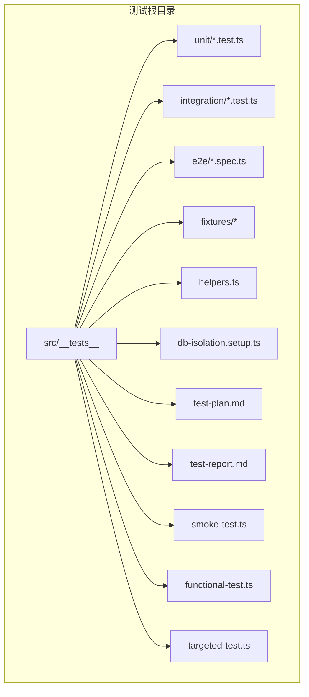
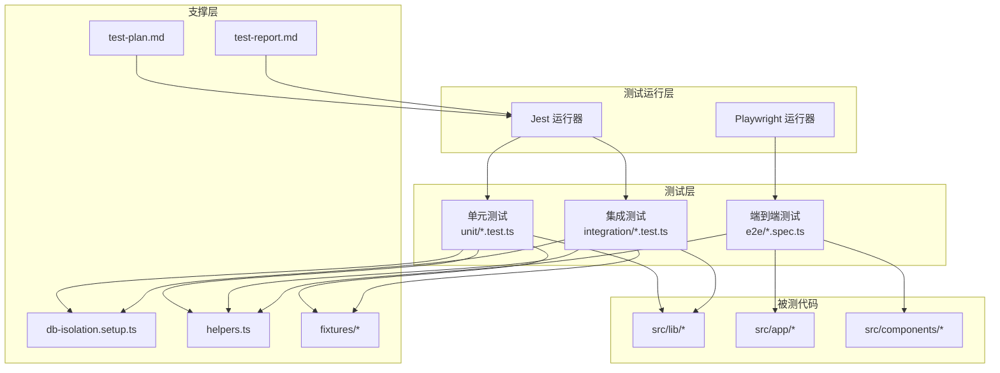
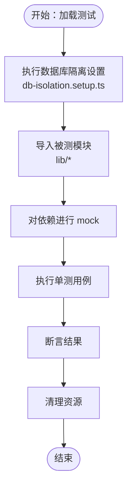
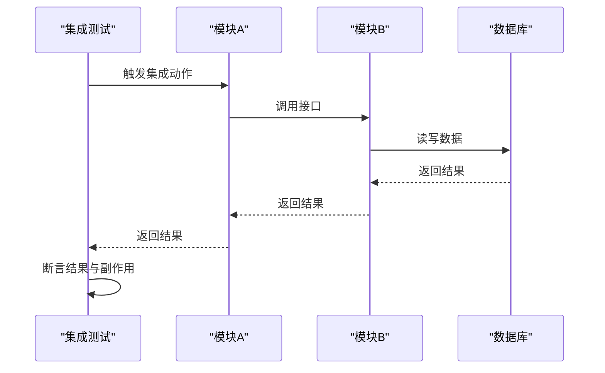
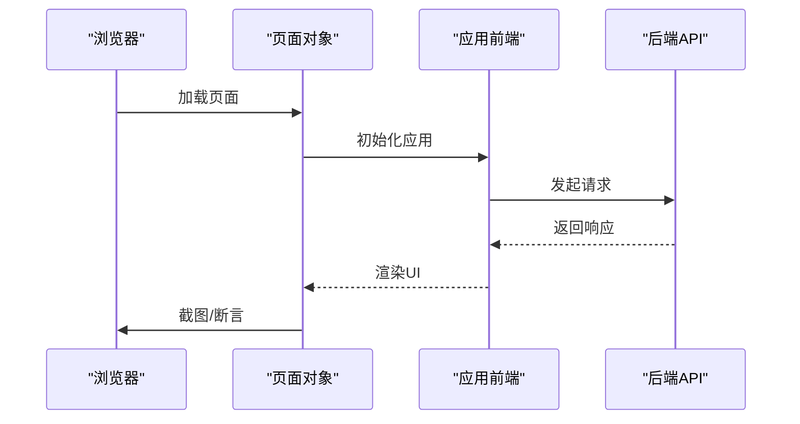
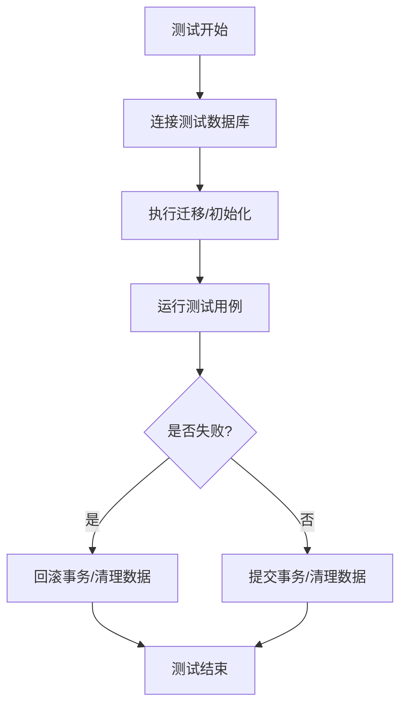
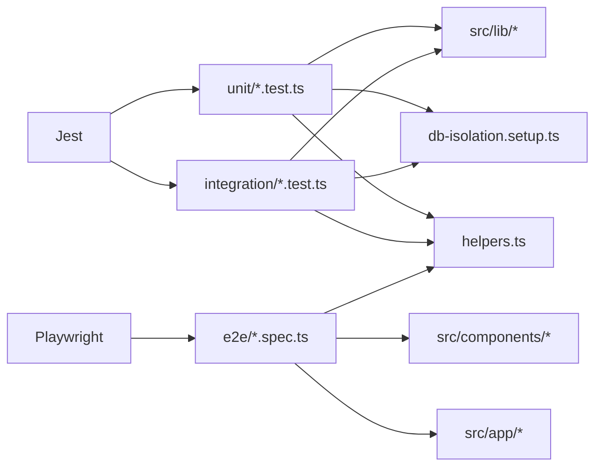

# 单元测试

<cite>
**本文引用的文件**
- [package.json](file://package.json)
- [playwright.config.ts](file://playwright.config.ts)
- [src/__tests__/db-isolation.setup.ts](file://src/__tests__/db-isolation.setup.ts)
- [src/__tests__/helpers.ts](file://src/__tests__/helpers.ts)
- [src/__tests__/smoke-test.ts](file://src/__tests__/smoke-test.ts)
- [src/__tests__/functional-test.ts](file://src/__tests__/functional-test.ts)
- [src/__tests__/targeted-test.ts](file://src/__tests__/targeted-test.ts)
- [src/__tests__/test-plan.md](file://src/__tests__/test-plan.md)
- [src/__tests__/test-report.md](file://src/__tests__/test-report.md)
- [src/__tests__/unit/agent-loop-messages.test.ts](file://src/__tests__/unit/agent-loop-messages.test.ts)
- [src/__tests__/unit/assistant-workspace.test.ts](file://src/__tests__/unit/assistant-workspace.test.ts)
- [src/__tests__/unit/codex-account-state.test.ts](file://src/__tests__/unit/codex-account-state.test.ts)
- [src/__tests__/unit/context-assembler.test.ts](file://src/__tests__/unit/context-assembler.test.ts)
- [src/__tests__/unit/context-breakdown.test.ts](file://src/__tests__/unit/context-breakdown.test.ts)
- [src/__tests__/unit/context-pruner.test.ts](file://src/__tests__/unit/context-pruner.test.ts)
- [src/__tests__/unit/context-usage-walk.test.ts](file://src/__tests__/unit/context-usage-walk.test.ts)
- [src/__tests__/unit/db-shutdown.test.ts](file://src/__tests__/unit/db-shutdown.test.ts)
- [src/__tests__/unit/message-normalizer.test.ts](file://src/__tests__/unit/message-normalizer.test.ts)
- [src/__tests__/unit/runtime-session-store.test.ts](file://src/__tests__/unit/runtime-session-store.test.ts)
- [src/__tests__/unit/workspace-sidebar.test.ts](file://src/__tests__/unit/workspace-sidebar.test.ts)
- [src/__tests__/integration/warm-query-poc.test.ts](file://src/__tests__/integration/warm-query-poc.test.ts)
- [src/__tests__/integration/hooks-poc.test.ts](file://src/__tests__/integration/hooks-poc.test.ts)
- [src/__tests__/integration/multi-defer-poc.test.ts](file://src/__tests__/integration/multi-defer-poc.test.ts)
- [src/__tests__/e2e/chat.spec.ts](file://src/__tests__/e2e/chat.spec.ts)
- [src/__tests__/e2e/smoke.spec.ts](file://src/__tests__/e2e/smoke.spec.ts)
- [src/__tests__/e2e/layout.spec.ts](file://src/__tests__/e2e/layout.spec.ts)
- [src/__tests__/e2e/settings.spec.ts](file://src/__tests__/e2e/settings.spec.ts)
- [src/__tests__/e2e/skills.spec.ts](file://src/__tests__/e2e/skills.spec.ts)
- [src/__tests__/e2e/visual-regression.spec.ts](file://src/__tests__/e2e/visual-regression.spec.ts)
- [src/lib/db.ts](file://src/lib/db.ts)
- [src/lib/chat-runtime.ts](file://src/lib/chat-runtime.ts)
- [src/lib/context-assembler.ts](file://src/lib/context-assembler.ts)
- [src/lib/context-breakdown.ts](file://src/lib/context-breakdown.ts)
- [src/lib/context-pruner.ts](file://src/lib/context-pruner.ts)
- [src/lib/context-usage-walk.ts](file://src/lib/context-usage-walk.ts)
- [src/lib/runtime-session-store.ts](file://src/lib/runtime-session-store.ts)
- [src/lib/workspace-sidebar.ts](file://src/lib/workspace-sidebar.ts)
- [src/lib/message-normalizer.ts](file://src/lib/message-normalizer.ts)
- [src/lib/codex-account-state.ts](file://src/lib/codex-account-state.ts)
- [src/lib/agent-loop-messages.ts](file://src/lib/agent-loop-messages.ts)
- [src/lib/assistant-workspace.ts](file://src/lib/assistant-workspace.ts)
- [src/lib/utils.ts](file://src/lib/utils.ts)
</cite>

## 目录
1. [简介](#简介)
2. [项目结构](#项目结构)
3. [核心组件](#核心组件)
4. [架构总览](#架构总览)
5. [详细组件分析](#详细组件分析)
6. [依赖关系分析](#依赖关系分析)
7. [性能考量](#性能考量)
8. [故障排查指南](#故障排查指南)
9. [结论](#结论)
10. [附录](#附录)

## 简介
本文件面向 CodePilot 的测试体系，系统性梳理单元测试、集成测试与端到端测试的组织方式、断言与模拟策略、数据库隔离与测试数据准备、覆盖率与报告生成、以及在持续集成中的执行流程。文档同时给出调试技巧、性能测试与边界条件测试的最佳实践，帮助开发者高效构建高质量的测试。

## 项目结构
测试目录采用分层组织：单元测试（unit）、集成测试（integration）、端到端测试（e2e），并辅以通用设置与辅助工具。整体结构如下：

图表来源
- [src/__tests__/helpers.ts](file://src/__tests__/helpers.ts)
- [src/__tests__/db-isolation.setup.ts](file://src/__tests__/db-isolation.setup.ts)
- [src/__tests__/test-plan.md](file://src/__tests__/test-plan.md)
- [src/__tests__/test-report.md](file://src/__tests__/test-report.md)

章节来源
- [src/__tests__/helpers.ts](file://src/__tests__/helpers.ts)
- [src/__tests__/db-isolation.setup.ts](file://src/__tests__/db-isolation.setup.ts)
- [src/__tests__/test-plan.md](file://src/__tests__/test-plan.md)
- [src/__tests__/test-report.md](file://src/__tests__/test-report.md)

## 核心组件
- 测试运行器与配置
  - Jest 运行时通过 package.json 中的脚本进行调用，支持测试过滤、覆盖率统计与报告输出。
  - Playwright 配置用于端到端测试，定义浏览器环境、超时与截图等参数。
- 测试文件命名规范
  - 单元测试：以 .test.ts 结尾，位于 src/__tests__/unit/ 下。
  - 集成测试：以 .test.ts 结尾，位于 src/__tests__/integration/ 下。
  - 端到端测试：以 .spec.ts 结尾，位于 src/__tests__/e2e/ 下。
- 断言与模拟
  - 使用 Jest 内建断言与 mock 机制；部分测试通过自定义 helpers 提供断言封装与通用行为。
- 数据库隔离
  - 通过 db-isolation.setup.ts 在每个测试前/后执行数据库初始化与清理，确保测试互不干扰。
- 测试数据与夹具
  - fixtures 目录存放跨测试复用的数据文件；单元测试中可按需导入或通过 mock 注入。
- 报告与计划
  - test-plan.md 与 test-report.md 记录测试策略与结果归档，便于追踪与审计。

章节来源
- [package.json](file://package.json)
- [playwright.config.ts](file://playwright.config.ts)
- [src/__tests__/db-isolation.setup.ts](file://src/__tests__/db-isolation.setup.ts)
- [src/__tests__/helpers.ts](file://src/__tests__/helpers.ts)
- [src/__tests__/test-plan.md](file://src/__tests__/test-plan.md)
- [src/__tests__/test-report.md](file://src/__tests__/test-report.md)

## 架构总览
下图展示测试体系的总体架构与交互关系：

图表来源
- [src/__tests__/db-isolation.setup.ts](file://src/__tests__/db-isolation.setup.ts)
- [src/__tests__/helpers.ts](file://src/__tests__/helpers.ts)
- [src/__tests__/test-plan.md](file://src/__tests__/test-plan.md)
- [src/__tests__/test-report.md](file://src/__tests__/test-report.md)
- [src/__tests__/unit/agent-loop-messages.test.ts](file://src/__tests__/unit/agent-loop-messages.test.ts)
- [src/__tests__/integration/warm-query-poc.test.ts](file://src/__tests__/integration/warm-query-poc.test.ts)
- [src/__tests__/e2e/chat.spec.ts](file://src/__tests__/e2e/chat.spec.ts)

## 详细组件分析

### 单元测试（Unit Tests）
- 组织结构
  - 按功能模块划分，如上下文处理、会话存储、消息规范化、工作区侧边栏等。
  - 典型文件路径参考：src/__tests__/unit/*.test.ts。
- 断言与模拟
  - 使用 Jest 断言进行值比较、异步行为验证与异常捕获。
  - 对外部依赖（如数据库、HTTP 客户端）进行 mock，避免真实 I/O 干扰。
- 数据库隔离
  - 在 db-isolation.setup.ts 中统一管理数据库初始化与回滚，保证每个测试用例的独立性。
- 示例文件
  - 上下文组装：context-assembler.test.ts
  - 上下文裁剪：context-pruner.test.ts
  - 上下文使用遍历：context-usage-walk.test.ts
  - 会话存储：runtime-session-store.test.ts
  - 消息规范化：message-normalizer.test.ts
  - 工作区侧边栏：workspace-sidebar.test.ts
  - 账号状态：codex-account-state.test.ts
  - 助手工作区：assistant-workspace.test.ts
  - Agent 循环消息：agent-loop-messages.test.ts

图表来源
- [src/__tests__/db-isolation.setup.ts](file://src/__tests__/db-isolation.setup.ts)
- [src/__tests__/unit/context-assembler.test.ts](file://src/__tests__/unit/context-assembler.test.ts)
- [src/__tests__/unit/context-pruner.test.ts](file://src/__tests__/unit/context-pruner.test.ts)
- [src/__tests__/unit/context-usage-walk.test.ts](file://src/__tests__/unit/context-usage-walk.test.ts)
- [src/__tests__/unit/runtime-session-store.test.ts](file://src/__tests__/unit/runtime-session-store.test.ts)
- [src/__tests__/unit/message-normalizer.test.ts](file://src/__tests__/unit/message-normalizer.test.ts)
- [src/__tests__/unit/workspace-sidebar.test.ts](file://src/__tests__/unit/workspace-sidebar.test.ts)
- [src/__tests__/unit/codex-account-state.test.ts](file://src/__tests__/unit/codex-account-state.test.ts)
- [src/__tests__/unit/assistant-workspace.test.ts](file://src/__tests__/unit/assistant-workspace.test.ts)
- [src/__tests__/unit/agent-loop-messages.test.ts](file://src/__tests__/unit/agent-loop-messages.test.ts)

章节来源
- [src/__tests__/unit/context-assembler.test.ts](file://src/__tests__/unit/context-assembler.test.ts)
- [src/__tests__/unit/context-pruner.test.ts](file://src/__tests__/unit/context-pruner.test.ts)
- [src/__tests__/unit/context-usage-walk.test.ts](file://src/__tests__/unit/context-usage-walk.test.ts)
- [src/__tests__/unit/runtime-session-store.test.ts](file://src/__tests__/unit/runtime-session-store.test.ts)
- [src/__tests__/unit/message-normalizer.test.ts](file://src/__tests__/unit/message-normalizer.test.ts)
- [src/__tests__/unit/workspace-sidebar.test.ts](file://src/__tests__/unit/workspace-sidebar.test.ts)
- [src/__tests__/unit/codex-account-state.test.ts](file://src/__tests__/unit/codex-account-state.test.ts)
- [src/__tests__/unit/assistant-workspace.test.ts](file://src/__tests__/unit/assistant-workspace.test.ts)
- [src/__tests__/unit/agent-loop-messages.test.ts](file://src/__tests__/unit/agent-loop-messages.test.ts)

### 集成测试（Integration Tests）
- 目标
  - 验证模块间协作、事件流与跨层调用的正确性。
- 示例
  - hooks-poc.test.ts：钩子相关集成场景。
  - multi-defer-poc.test.ts：多延迟任务集成。
  - warm-query-poc.test.ts：预热查询集成。
- 断言与模拟
  - 对外部服务与中间件进行最小化 mock，尽可能使用真实依赖以提升可信度。

图表来源
- [src/__tests__/integration/hooks-poc.test.ts](file://src/__tests__/integration/hooks-poc.test.ts)
- [src/__tests__/integration/multi-defer-poc.test.ts](file://src/__tests__/integration/multi-defer-poc.test.ts)
- [src/__tests__/integration/warm-query-poc.test.ts](file://src/__tests__/integration/warm-query-poc.test.ts)

章节来源
- [src/__tests__/integration/hooks-poc.test.ts](file://src/__tests__/integration/hooks-poc.test.ts)
- [src/__tests__/integration/multi-defer-poc.test.ts](file://src/__tests__/integration/multi-defer-poc.test.ts)
- [src/__tests__/integration/warm-query-poc.test.ts](file://src/__tests__/integration/warm-query-poc.test.ts)

### 端到端测试（E2E Tests）
- 目标
  - 验证用户关键路径与界面交互，覆盖聊天、布局、设置、技能与视觉回归等场景。
- 示例
  - chat.spec.ts、layout.spec.ts、settings.spec.ts、skills.spec.ts、visual-regression.spec.ts、smoke.spec.ts。
- 执行环境
  - 通过 Playwright 配置启动浏览器，执行真实用户操作序列。

图表来源
- [playwright.config.ts](file://playwright.config.ts)
- [src/__tests__/e2e/chat.spec.ts](file://src/__tests__/e2e/chat.spec.ts)
- [src/__tests__/e2e/layout.spec.ts](file://src/__tests__/e2e/layout.spec.ts)
- [src/__tests__/e2e/settings.spec.ts](file://src/__tests__/e2e/settings.spec.ts)
- [src/__tests__/e2e/skills.spec.ts](file://src/__tests__/e2e/skills.spec.ts)
- [src/__tests__/e2e/visual-regression.spec.ts](file://src/__tests__/e2e/visual-regression.spec.ts)
- [src/__tests__/e2e/smoke.spec.ts](file://src/__tests__/e2e/smoke.spec.ts)

章节来源
- [playwright.config.ts](file://playwright.config.ts)
- [src/__tests__/e2e/chat.spec.ts](file://src/__tests__/e2e/chat.spec.ts)
- [src/__tests__/e2e/layout.spec.ts](file://src/__tests__/e2e/layout.spec.ts)
- [src/__tests__/e2e/settings.spec.ts](file://src/__tests__/e2e/settings.spec.ts)
- [src/__tests__/e2e/skills.spec.ts](file://src/__tests__/e2e/skills.spec.ts)
- [src/__tests__/e2e/visual-regression.spec.ts](file://src/__tests__/e2e/visual-regression.spec.ts)
- [src/__tests__/e2e/smoke.spec.ts](file://src/__tests__/e2e/smoke.spec.ts)

### 数据库隔离测试
- 设计原则
  - 每个测试前后自动初始化与清理数据库，避免状态污染。
- 关键点
  - 在 db-isolation.setup.ts 中注册全局设置与清理逻辑。
  - 单元测试与集成测试均依赖该隔离机制。
- 建议
  - 尽量使用事务回滚或临时表，减少全量初始化成本。
  - 对于昂贵的初始化步骤，考虑共享只读快照或增量准备。

图表来源
- [src/__tests__/db-isolation.setup.ts](file://src/__tests__/db-isolation.setup.ts)
- [src/__tests__/unit/db-shutdown.test.ts](file://src/__tests__/unit/db-shutdown.test.ts)

章节来源
- [src/__tests__/db-isolation.setup.ts](file://src/__tests__/db-isolation.setup.ts)
- [src/__tests__/unit/db-shutdown.test.ts](file://src/__tests__/unit/db-shutdown.test.ts)

### 测试数据准备与夹具（Fixtures）
- 夹具类型
  - JSON/TS 文件：用于模拟外部服务响应、消息体、工具调用结果等。
- 使用建议
  - 将常用夹具集中管理，按模块划分目录，便于复用与维护。
  - 对于端到端测试，结合 Playwright 的上下文注入，减少重复准备。

章节来源
- [src/__tests__/fixtures/widget-message-tool-uses.json](file://src/__tests__/fixtures/widget-message-tool-uses.json)
- [src/__tests__/fixtures/fixture-mcp-server.ts](file://src/__tests__/fixtures/fixture-mcp-server.ts)

### 测试覆盖率统计与报告
- 覆盖率
  - 通过 Jest 配置生成语句、分支、函数与行级覆盖率报告。
- 报告
  - test-report.md 用于记录每次测试运行的结果摘要与问题跟踪。
- CI 集成
  - 在持续集成流水线中执行测试与覆盖率收集，失败即阻断发布。

章节来源
- [src/__tests__/test-report.md](file://src/__tests__/test-report.md)
- [package.json](file://package.json)

### 测试调试技巧
- 快速定位
  - 使用 --testNamePattern 或 --testPathPattern 精确筛选目标用例。
  - 在 helpers.ts 中添加统一的日志与断言包装，便于批量输出。
- 模拟策略
  - 对外部依赖进行最小化 mock，保留关键路径的真实行为。
- 数据隔离
  - 确保每个测试前后数据库状态一致，必要时使用事务回滚。
- 端到端调试
  - 在 Playwright 中启用慢动作模式与截图，逐步回放用户操作。

章节来源
- [src/__tests__/helpers.ts](file://src/__tests__/helpers.ts)
- [playwright.config.ts](file://playwright.config.ts)

### 性能测试与边界条件
- 性能测试
  - 对热点路径（如上下文组装、消息规范化、会话存储）进行基准测试，记录耗时与内存占用。
- 边界条件
  - 输入为空、超长字符串、极端数值、并发访问等场景应纳入测试矩阵。
- 可观测性
  - 在 helpers.ts 中统一埋点与采样，便于后续分析与优化。

章节来源
- [src/__tests__/unit/context-assembler.test.ts](file://src/__tests__/unit/context-assembler.test.ts)
- [src/__tests__/unit/message-normalizer.test.ts](file://src/__tests__/unit/message-normalizer.test.ts)
- [src/__tests__/unit/runtime-session-store.test.ts](file://src/__tests__/unit/runtime-session-store.test.ts)

## 依赖关系分析
- 测试对被测代码的依赖
  - 单元测试直接依赖 src/lib/* 模块；集成测试依赖模块间的协作；端到端测试依赖前端页面与后端 API。
- 外部依赖
  - Jest 与 Playwright 作为测试运行器；数据库驱动与 HTTP 客户端通过 mock 解耦。
- 设置与工具
  - db-isolation.setup.ts 与 helpers.ts 为所有测试提供统一的基础设施。

图表来源
- [src/__tests__/db-isolation.setup.ts](file://src/__tests__/db-isolation.setup.ts)
- [src/__tests__/helpers.ts](file://src/__tests__/helpers.ts)
- [src/__tests__/unit/context-assembler.test.ts](file://src/__tests__/unit/context-assembler.test.ts)
- [src/__tests__/integration/warm-query-poc.test.ts](file://src/__tests__/integration/warm-query-poc.test.ts)
- [src/__tests__/e2e/chat.spec.ts](file://src/__tests__/e2e/chat.spec.ts)

章节来源
- [src/__tests__/db-isolation.setup.ts](file://src/__tests__/db-isolation.setup.ts)
- [src/__tests__/helpers.ts](file://src/__tests__/helpers.ts)

## 性能考量
- 测试执行效率
  - 合理拆分测试套件，避免长串依赖链；优先使用轻量级 mock。
- 数据库开销
  - 利用事务回滚与共享初始化，减少重复迁移与数据准备。
- 端到端测试
  - 控制浏览器实例数量与并行度，合理设置超时与重试策略。

## 故障排查指南
- 常见问题
  - 数据库状态不一致：检查 db-isolation.setup.ts 是否正确执行。
  - 外部依赖不稳定：确认 mock 行为与期望一致，必要时降级为真实服务。
  - 端到端不稳定：开启慢动作与截图，逐步回放用户操作。
- 工具与日志
  - 在 helpers.ts 中统一输出日志与断言包装，便于快速定位失败点。

章节来源
- [src/__tests__/db-isolation.setup.ts](file://src/__tests__/db-isolation.setup.ts)
- [src/__tests__/helpers.ts](file://src/__tests__/helpers.ts)

## 结论
CodePilot 的测试体系以 Jest 与 Playwright 为核心，配合统一的数据库隔离与夹具管理，实现了从单元到端到端的全栈覆盖。通过标准化的命名规范、断言与模拟策略，以及完善的报告与计划文档，团队可以高效地迭代功能并保障质量。建议在 CI 中强制执行覆盖率门槛与端到端冒烟测试，持续提升测试有效性。

## 附录
- 测试文件命名规范
  - 单元测试：unit/*.test.ts
  - 集成测试：integration/*.test.ts
  - 端到端测试：e2e/*.spec.ts
- 关键测试入口
  - smoke-test.ts、functional-test.ts、targeted-test.ts 用于快速验证与定向回归。
- 文档与报告
  - test-plan.md 与 test-report.md 用于测试策略与结果归档。

章节来源
- [src/__tests__/smoke-test.ts](file://src/__tests__/smoke-test.ts)
- [src/__tests__/functional-test.ts](file://src/__tests__/functional-test.ts)
- [src/__tests__/targeted-test.ts](file://src/__tests__/targeted-test.ts)
- [src/__tests__/test-plan.md](file://src/__tests__/test-plan.md)
- [src/__tests__/test-report.md](file://src/__tests__/test-report.md)