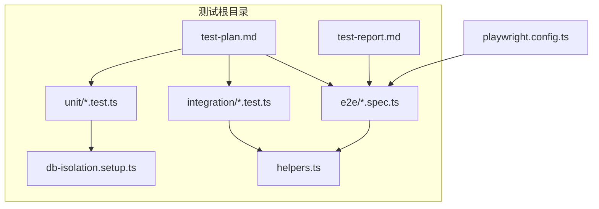
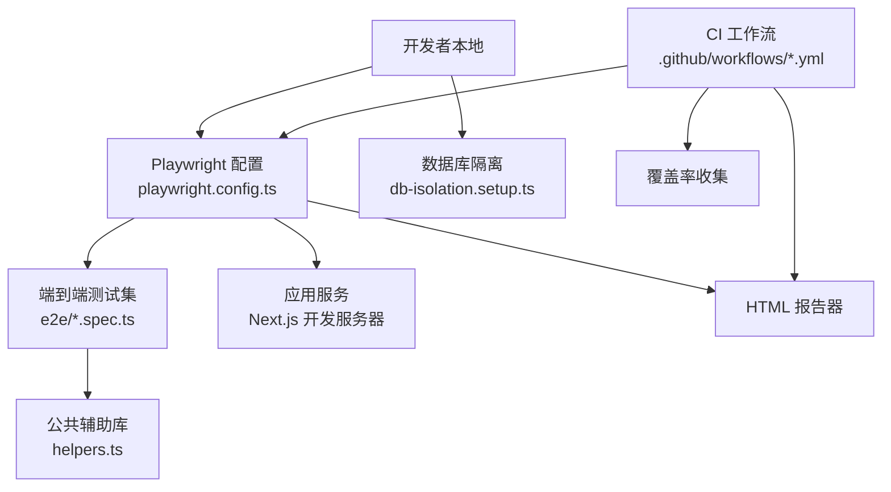
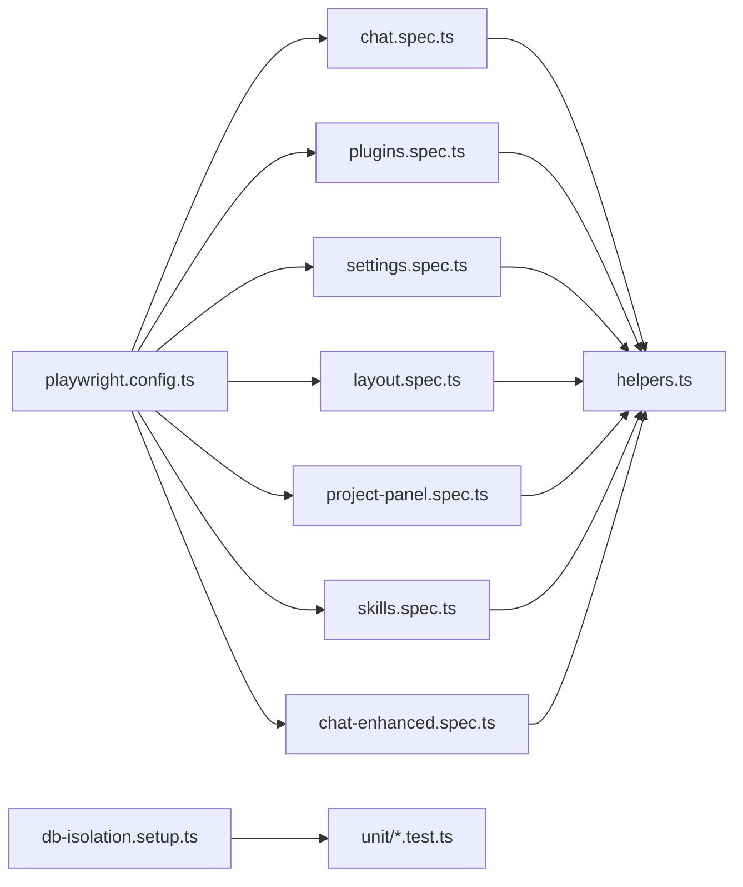

# 测试策略

<cite>
**本文引用的文件**
- [playwright.config.ts](file://playwright.config.ts)
- [helpers.ts](file://src/__tests__/helpers.ts)
- [db-isolation.setup.ts](file://src/__tests__/db-isolation.setup.ts)
- [test-plan.md](file://src/__tests__/test-plan.md)
- [test-report.md](file://src/__tests__/test-report.md)
- [chat.spec.ts](file://src/__tests__/e2e/chat.spec.ts)
- [plugins.spec.ts](file://src/__tests__/e2e/plugins.spec.ts)
- [settings.spec.ts](file://src/__tests__/e2e/settings.spec.ts)
- [layout.spec.ts](file://src/__tests__/e2e/layout.spec.ts)
- [project-panel.spec.ts](file://src/__tests__/e2e/project-panel.spec.ts)
- [skills.spec.ts](file://src/__tests__/e2e/skills.spec.ts)
- [chat-enhanced.spec.ts](file://src/__tests__/e2e/chat-enhanced.spec.ts)
- [visual-regression.spec.ts](file://src/__tests__/e2e/visual-regression.spec.ts)
- [smoke.spec.ts](file://src/__tests__/e2e/smoke.spec.ts)
- [card-gutter-geometry.spec.ts](file://src/__tests__/e2e/card-gutter-geometry.spec.ts)
- [context-chips-send-clear.spec.ts](file://src/__tests__/e2e/context-chips-send-clear.spec.ts)
- [global-search-file-seek.spec.ts](file://src/__tests__/e2e/global-search-file-seek.spec.ts)
- [global-search-modes.spec.ts](file://src/__tests__/e2e/global-search-modes.spec.ts)
- [mention-picker-style.spec.ts](file://src/__tests__/e2e/mention-picker-style.spec.ts)
- [mention-ui.spec.ts](file://src/__tests__/e2e/mention-ui.spec.ts)
- [run-checkpoint-confirm.spec.ts](file://src/__tests__/e2e/run-checkpoint-confirm.spec.ts)
- [hooks-poc.test.ts](file://src/__tests__/integration/hooks-poc.test.ts)
- [multi-defer-poc.test.ts](file://src/__tests__/integration/multi-defer-poc.test.ts)
- [warm-query-poc.test.ts](file://src/__tests__/integration/warm-query-poc.test.ts)
- [build.yml](file://.github/workflows/build.yml)
- [preview-build.yml](file://.github/workflows/preview-build.yml)
- [preview-release.yml](file://.github/workflows/preview-release.yml)
</cite>

## 目录
1. [引言](#引言)
2. [项目结构](#项目结构)
3. [核心组件](#核心组件)
4. [架构总览](#架构总览)
5. [详细组件分析](#详细组件分析)
6. [依赖分析](#依赖分析)
7. [性能考虑](#性能考虑)
8. [故障排查指南](#故障排查指南)
9. [结论](#结论)
10. [附录](#附录)

## 引言
本测试策略文档面向 CodePilot 的前端与全栈功能，系统化阐述单元测试、集成测试与端到端（E2E）测试的组织结构、执行方式与最佳实践。重点覆盖 Playwright 测试框架配置、测试用例编写规范与断言方法；并给出组件测试、API 测试与数据库测试的实施建议。同时，文档明确测试覆盖率目标、测试数据管理与模拟对象使用策略，并说明在 CI/CD 中的测试执行流程、测试报告生成与性能测试策略，最后提供测试调试技巧、可视化测试与回归测试管理指南。

## 项目结构
测试相关目录与文件分布如下：
- 端到端测试：位于 src/__tests__/e2e，按页面/功能模块划分，如 chat.spec.ts、plugins.spec.ts、settings.spec.ts、layout.spec.ts、project-panel.spec.ts、skills.spec.ts、chat-enhanced.spec.ts 等。
- 集成测试：位于 src/__tests__/integration，包含钩子、延迟与查询预热等场景的测试文件。
- 单元测试：位于 src/__tests__/unit，覆盖运行时、工具链、上下文处理、权限与桥接等模块的大量测试用例。
- 公共辅助：src/__tests__/helpers.ts 提供导航、等待、定位器与断言辅助函数；src/__tests__/db-isolation.setup.ts 提供数据库隔离设置。
- 文档与报告：src/__tests__/test-plan.md 提供测试计划与验收标准；src/__tests__/test-report.md 提供浏览器测试报告示例。
- 框架配置：playwright.config.ts 定义 Playwright 运行参数、截图阈值、Web 服务器启动命令与报告格式等。

图表来源
- [playwright.config.ts:1-32](file://playwright.config.ts#L1-L32)
- [helpers.ts:1-515](file://src/__tests__/helpers.ts#L1-L515)
- [db-isolation.setup.ts:1-54](file://src/__tests__/db-isolation.setup.ts#L1-L54)
- [test-plan.md:1-382](file://src/__tests__/test-plan.md#L1-L382)
- [test-report.md:1-206](file://src/__tests__/test-report.md#L1-L206)

章节来源
- [playwright.config.ts:1-32](file://playwright.config.ts#L1-L32)
- [helpers.ts:1-515](file://src/__tests__/helpers.ts#L1-L515)
- [db-isolation.setup.ts:1-54](file://src/__tests__/db-isolation.setup.ts#L1-L54)
- [test-plan.md:1-382](file://src/__tests__/test-plan.md#L1-L382)
- [test-report.md:1-206](file://src/__tests__/test-report.md#L1-L206)

## 核心组件
- Playwright 配置与运行参数
  - 测试目录、并行度、重试次数、工作进程数、报告器、基础 URL、截图阈值、Web 服务器启动命令与复用策略等均在 playwright.config.ts 中集中定义。
- E2E 辅助库
  - helpers.ts 提供导航、等待、定位器与断言辅助函数，统一页面交互与断言风格，减少重复代码。
- 数据库隔离
  - db-isolation.setup.ts 在每个 worker 进程内为单元测试创建独立临时数据库目录，避免并发写入导致的竞态与真实数据库污染。
- 测试计划与报告
  - test-plan.md 明确测试范围、验收标准与文件结构；test-report.md 展示测试结果统计、缺陷记录与截图归档。

章节来源
- [playwright.config.ts:10-31](file://playwright.config.ts#L10-L31)
- [helpers.ts:7-32](file://src/__tests__/helpers.ts#L7-L32)
- [helpers.ts:34-74](file://src/__tests__/helpers.ts#L34-L74)
- [helpers.ts:80-98](file://src/__tests__/helpers.ts#L80-L98)
- [helpers.ts:104-115](file://src/__tests__/helpers.ts#L104-L115)
- [helpers.ts:131-147](file://src/__tests__/helpers.ts#L131-L147)
- [helpers.ts:485-515](file://src/__tests__/helpers.ts#L485-L515)
- [db-isolation.setup.ts:31-53](file://src/__tests__/db-isolation.setup.ts#L31-L53)
- [test-plan.md:367-382](file://src/__tests__/test-plan.md#L367-L382)

## 架构总览
下图展示测试体系在本地开发与 CI 环境中的执行路径与职责分工：

图表来源
- [playwright.config.ts:10-31](file://playwright.config.ts#L10-L31)
- [helpers.ts:1-515](file://src/__tests__/helpers.ts#L1-L515)
- [db-isolation.setup.ts:1-54](file://src/__tests__/db-isolation.setup.ts#L1-L54)
- [.github/workflows/build.yml](file://.github/workflows/build.yml)
- [.github/workflows/preview-build.yml](file://.github/workflows/preview-build.yml)
- [.github/workflows/preview-release.yml](file://.github/workflows/preview-release.yml)

## 详细组件分析

### Playwright 测试框架配置
- 基础 URL 支持通过环境变量覆盖，便于多工作树并行开发与 CI 环境切换。
- 并行执行、重试策略与工作进程数根据是否处于 CI 环境动态调整，平衡稳定性与速度。
- 截图断言阈值可配置，确保视觉回归测试对像素差异的容忍度可控。
- Web 服务器启动命令与复用策略避免 CI 中不必要的冷启动开销。

章节来源
- [playwright.config.ts:3-8](file://playwright.config.ts#L3-L8)
- [playwright.config.ts:10-16](file://playwright.config.ts#L10-L16)
- [playwright.config.ts:17-25](file://playwright.config.ts#L17-L25)
- [playwright.config.ts:26-31](file://playwright.config.ts#L26-L31)

### E2E 辅助库与断言方法
- 导航与等待
  - 统一禁用更新弹窗以稳定冒烟测试；提供页面就绪等待与流式响应开始/结束等待。
- 定位器封装
  - 封装常用 UI 元素定位器（聊天输入、发送/停止按钮、侧边栏、主题切换、文件树、技能编辑器等），降低选择器脆弱性与复制粘贴成本。
- 断言辅助
  - 收集控制台错误并过滤非关键项；提供页面加载时间断言，确保性能门槛达标。

章节来源
- [helpers.ts:7-32](file://src/__tests__/helpers.ts#L7-L32)
- [helpers.ts:34-74](file://src/__tests__/helpers.ts#L34-L74)
- [helpers.ts:80-98](file://src/__tests__/helpers.ts#L80-L98)
- [helpers.ts:104-115](file://src/__tests__/helpers.ts#L104-L115)
- [helpers.ts:131-147](file://src/__tests__/helpers.ts#L131-L147)
- [helpers.ts:485-515](file://src/__tests__/helpers.ts#L485-L515)

### 数据库隔离与单元测试稳定性
- 每个 worker 进程分配独立临时数据目录，预触发表示全新安装的空数据库，避免真实用户数据库被污染。
- 通过环境变量禁用迁移逻辑，确保测试数据库初始化路径一致且可预测。

章节来源
- [db-isolation.setup.ts:31-53](file://src/__tests__/db-isolation.setup.ts#L31-L53)

### 端到端测试组织与执行
- 文件命名与分层
  - chat.spec.ts、plugins.spec.ts、settings.spec.ts、layout.spec.ts、project-panel.spec.ts、skills.spec.ts、chat-enhanced.spec.ts 等按页面/功能模块划分，便于维护与并行执行。
- 扩展场景
  - visual-regression.spec.ts、smoke.spec.ts、card-gutter-geometry.spec.ts、context-chips-send-clear.spec.ts、global-search-file-seek.spec.ts、global-search-modes.spec.ts、mention-picker-style.spec.ts、mention-ui.spec.ts、run-checkpoint-confirm.spec.ts 等覆盖视觉回归、冒烟、几何布局、全局搜索与提及 UI 等专项。
- 执行入口
  - Playwright 通过 testDir 指向 e2e 目录，结合配置文件中的 workers、retries、reporter 等参数执行。

章节来源
- [test-plan.md:367-382](file://src/__tests__/test-plan.md#L367-L382)
- [playwright.config.ts:11](file://playwright.config.ts#L11)

### 集成测试与 API 场景
- 钩子与延迟
  - hooks-poc.test.ts、multi-defer-poc.test.ts、warm-query-poc.test.ts 等用于验证异步钩子、延迟与查询预热等场景，确保运行时行为符合预期。
- 建议
  - 对外部依赖（如 SSE、MCP、第三方 API）进行路由拦截或本地桩，保证测试确定性与可重复性。

章节来源
- [hooks-poc.test.ts](file://src/__tests__/integration/hooks-poc.test.ts)
- [multi-defer-poc.test.ts](file://src/__tests__/integration/multi-defer-poc.test.ts)
- [warm-query-poc.test.ts](file://src/__tests__/integration/warm-query-poc.test.ts)

### 组件测试与断言规范
- 通用规范
  - 使用定位器封装与等待函数，避免硬编码选择器与超时。
  - 对关键交互（发送消息、切换主题、面板折叠/展开、文件树筛选）编写断言，覆盖状态变化与可见性。
  - 使用“页面加载时间”断言确保性能门槛达标。
- 视觉回归
  - 利用截图阈值与 HTML 报告器生成对比，识别 UI 变更风险。

章节来源
- [helpers.ts:80-98](file://src/__tests__/helpers.ts#L80-L98)
- [helpers.ts:485-515](file://src/__tests__/helpers.ts#L485-L515)
- [playwright.config.ts:17-25](file://playwright.config.ts#L17-L25)

### 数据库测试最佳实践
- 隔离策略
  - 通过 db-isolation.setup.ts 为每个 worker 创建独立临时数据库目录，避免并发写入与真实数据库污染。
- 初始化与清理
  - 预触发表示全新安装的空数据库，确保每次测试从一致状态开始；测试结束后无需手动清理，由临时目录生命周期管理。
- 外部依赖
  - 对涉及数据库的 API 或服务端接口，优先使用路由拦截或内存数据库替代真实数据库，提升稳定性与速度。

章节来源
- [db-isolation.setup.ts:31-53](file://src/__tests__/db-isolation.setup.ts#L31-L53)

### 测试覆盖率与报告
- 覆盖率收集
  - 在 CI 中启用覆盖率收集，建议结合 Playwright 与 Jest/TSX 的覆盖率工具，分别统计 E2E 与单元测试覆盖率。
- 报告生成
  - 使用 HTML 报告器输出测试结果与截图，便于回溯问题与回归验证。
- 报告示例
  - test-report.md 提供了分类统计、缺陷记录与截图归档的模板，可用于团队内部评审与知识沉淀。

章节来源
- [playwright.config.ts:16](file://playwright.config.ts#L16)
- [test-report.md:10-26](file://src/__tests__/test-report.md#L10-L26)

### CI/CD 中的测试执行流程
- 工作流文件
  - build.yml、preview-build.yml、preview-release.yml 分别对应主干构建、预览构建与预发布流程，可在其中集成测试步骤与覆盖率上传。
- 执行策略
  - 在 CI 中启用重试与受限工作进程，确保稳定性；在 PR 与主干分支采用不同策略（如更严格的重试与更全面的报告）。
- 结果反馈
  - 将 HTML 报告与截图上传至制品库，便于审阅与审计。

章节来源
- [.github/workflows/build.yml](file://.github/workflows/build.yml)
- [.github/workflows/preview-build.yml](file://.github/workflows/preview-build.yml)
- [.github/workflows/preview-release.yml](file://.github/workflows/preview-release.yml)

### 性能测试策略
- 页面加载时间
  - 使用 helpers.ts 中的页面加载时间断言，确保所有页面在约定时间内完成渲染。
- 交互响应时间
  - 对关键交互（点击、输入、滚动）设定响应时间阈值，保障用户体验。
- 视觉回归与动画
  - 通过截图阈值与动画过渡时间检查，避免 UI 动画卡顿与样式漂移。

章节来源
- [helpers.ts:508-515](file://src/__tests__/helpers.ts#L508-L515)
- [test-plan.md:353-364](file://src/__tests__/test-plan.md#L353-L364)

### 回归测试管理
- 冒烟测试
  - smoke.spec.ts 作为快速健康检查，确保核心路径可用；建议在每次提交后运行。
- 视觉回归
  - visual-regression.spec.ts 用于捕捉 UI 变更；建议在设计稿冻结或重大更新前运行。
- 专项测试
  - card-gutter-geometry.spec.ts、context-chips-send-clear.spec.ts、global-search-file-seek.spec.ts、global-search-modes.spec.ts、mention-picker-style.spec.ts、mention-ui.spec.ts、run-checkpoint-confirm.spec.ts 等覆盖特定场景，形成稳定的回归矩阵。

章节来源
- [smoke.spec.ts](file://src/__tests__/e2e/smoke.spec.ts)
- [visual-regression.spec.ts](file://src/__tests__/e2e/visual-regression.spec.ts)
- [card-gutter-geometry.spec.ts](file://src/__tests__/e2e/card-gutter-geometry.spec.ts)
- [context-chips-send-clear.spec.ts](file://src/__tests__/e2e/context-chips-send-clear.spec.ts)
- [global-search-file-seek.spec.ts](file://src/__tests__/e2e/global-search-file-seek.spec.ts)
- [global-search-modes.spec.ts](file://src/__tests__/e2e/global-search-modes.spec.ts)
- [mention-picker-style.spec.ts](file://src/__tests__/e2e/mention-picker-style.spec.ts)
- [mention-ui.spec.ts](file://src/__tests__/e2e/mention-ui.spec.ts)
- [run-checkpoint-confirm.spec.ts](file://src/__tests__/e2e/run-checkpoint-confirm.spec.ts)

## 依赖分析
- 组件耦合
  - E2E 测试高度依赖 helpers.ts 中的导航与等待函数；db-isolation.setup.ts 为单元测试提供隔离保障。
- 外部依赖
  - Playwright 依赖 Next.js 开发服务器；截图与报告依赖 HTML 报告器；CI 依赖工作流文件中的测试步骤。
- 循环依赖
  - 当前结构清晰，未发现循环依赖迹象。

图表来源
- [playwright.config.ts:10-31](file://playwright.config.ts#L10-L31)
- [helpers.ts:1-515](file://src/__tests__/helpers.ts#L1-L515)
- [db-isolation.setup.ts:1-54](file://src/__tests__/db-isolation.setup.ts#L1-L54)

## 性能考虑
- 并行与重试
  - 在本地开发中启用 fullyParallel 与较低重试次数；在 CI 中限制 workers 并提高重试次数，平衡速度与稳定性。
- 截图阈值
  - 合理设置 toHaveScreenshot 的 maxDiffPixelRatio，避免对微小差异过度敏感。
- 页面加载与交互
  - 使用统一的等待与断言辅助，确保关键路径在可接受的时间范围内完成。

章节来源
- [playwright.config.ts:12-16](file://playwright.config.ts#L12-L16)
- [playwright.config.ts:22-24](file://playwright.config.ts#L22-L24)
- [helpers.ts:80-98](file://src/__tests__/helpers.ts#L80-L98)
- [helpers.ts:508-515](file://src/__tests__/helpers.ts#L508-L515)

## 故障排查指南
- 控制台错误收集
  - 使用 collectConsoleErrors 与 filterCriticalErrors 过滤已知非关键错误，聚焦真实问题。
- 截图与报告
  - 在首次重试时开启 trace，结合 HTML 报告定位失败原因。
- 数据库污染
  - 若出现并发写入或真实数据库污染，检查 db-isolation.setup.ts 是否正确设置临时目录与迁移禁用标志。
- 环境变量
  - 在多工作树并行开发时，使用 PLAYWRIGHT_BASE_URL 指定不同端口，避免端口冲突。

章节来源
- [helpers.ts:485-505](file://src/__tests__/helpers.ts#L485-L505)
- [playwright.config.ts:17-20](file://playwright.config.ts#L17-L20)
- [db-isolation.setup.ts:31-53](file://src/__tests__/db-isolation.setup.ts#L31-L53)
- [playwright.config.ts:5-8](file://playwright.config.ts#L5-L8)

## 结论
本测试策略以 Playwright 为核心，结合统一的辅助库与数据库隔离机制，构建了覆盖端到端、集成与单元测试的完整体系。通过明确的文件组织、断言规范与 CI/CD 流程，能够持续保障代码质量与用户体验。建议在后续迭代中进一步完善覆盖率指标、扩展 API 测试与数据库测试场景，并将可视化测试与回归矩阵常态化纳入日常开发流程。

## 附录
- 测试文件结构参考
  - src/__tests__/e2e 下按页面/功能模块划分的测试文件清单见 test-plan.md 的“Test File Structure”部分。
- 测试报告模板
  - test-report.md 提供了分类统计、缺陷记录与截图归档的模板，可用于团队内部评审与知识沉淀。

章节来源
- [test-plan.md:367-382](file://src/__tests__/test-plan.md#L367-L382)
- [test-report.md:10-26](file://src/__tests__/test-report.md#L10-L26)