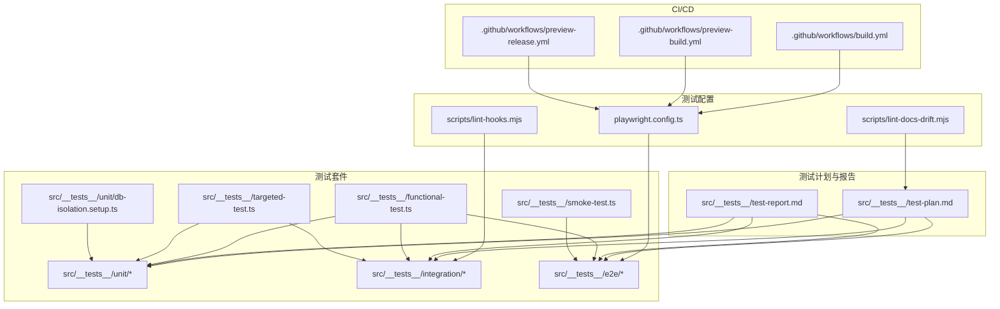
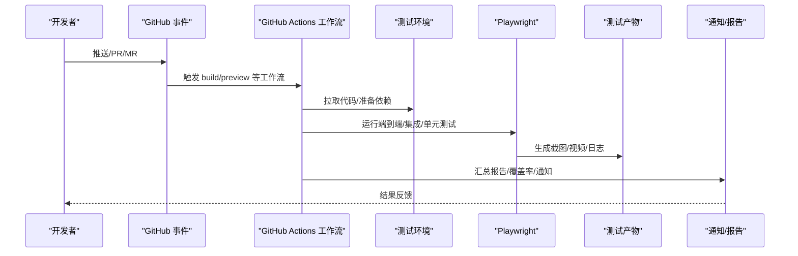
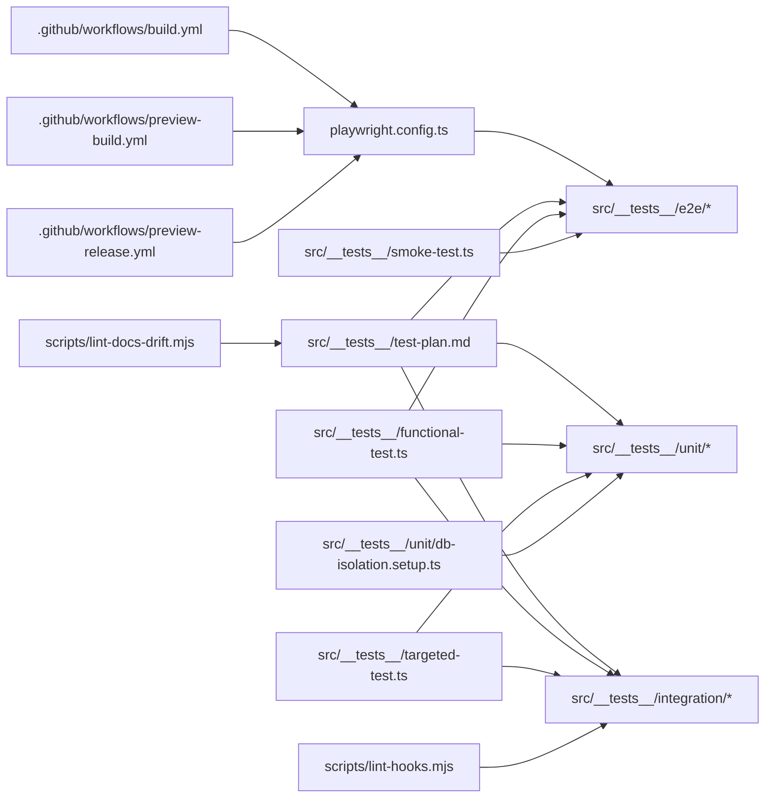

# 测试自动化

<cite>
**本文引用的文件**
- [.github/workflows/build.yml](file://.github/workflows/build.yml)
- [.github/workflows/preview-build.yml](file://.github/workflows/preview-build.yml)
- [.github/workflows/preview-release.yml](file://.github/workflows/preview-release.yml)
- [playwright.config.ts](file://playwright.config.ts)
- [scripts/lint-docs-drift.mjs](file://scripts/lint-docs-drift.mjs)
- [scripts/lint-hooks.mjs](file://scripts/lint-hooks.mjs)
- [src/__tests__/test-plan.md](file://src/__tests__/test-plan.md)
- [src/__tests__/test-report.md](file://src/__tests__/test-report.md)
- [src/__tests__/unit/db-isolation.setup.ts](file://src/__tests__/unit/db-isolation.setup.ts)
- [src/__tests__/functional-test.ts](file://src/__tests__/functional-test.ts)
- [src/__tests__/smoke-test.ts](file://src/__tests__/smoke-test.ts)
- [src/__tests__/targeted-test.ts](file://src/__tests__/targeted-test.ts)
- [src/__tests__/integration/poc-record.ts](file://src/__tests__/integration/poc-record.ts)
- [src/__tests__/integration/warm-query-poc.test.ts](file://src/__tests__/integration/warm-query-poc.test.ts)
- [src/__tests__/integration/hooks-poc.test.ts](file://src/__tests__/integration/hooks-poc.test.ts)
- [src/__tests__/e2e/smoke.spec.ts](file://src/__tests__/e2e/smoke.spec.ts)
- [src/__tests__/e2e/chat.spec.ts](file://src/__tests__/e2e/chat.spec.ts)
- [src/__tests__/e2e/visual-regression.spec.ts](file://src/__tests__/e2e/visual-regression.spec.ts)
- [src/__tests__/e2e/layout.spec.ts](file://src/__tests__/e2e/layout.spec.ts)
- [src/__tests__/e2e/settings.spec.ts](file://src/__tests__/e2e/settings.spec.ts)
- [src/__tests__/e2e/skills.spec.ts](file://src/__tests__/e2e/skills.spec.ts)
- [src/__tests__/e2e/plugins.spec.ts](file://src/__tests__/e2e/plugins.spec.ts)
- [src/__tests__/e2e/project-panel.spec.ts](file://src/__tests__/e2e/project-panel.spec.ts)
- [src/__tests__/e2e/run-checkpoint-confirm.spec.ts](file://src/__tests__/e2e/run-checkpoint-confirm.spec.ts)
- [src/__tests__/e2e/context-chips-send-clear.spec.ts](file://src/__tests__/e2e/context-chips-send-clear.spec.ts)
- [src/__tests__/e2e/global-search-file-seek.spec.ts](file://src/__tests__/e2e/global-search-file-seek.spec.ts)
- [src/__tests__/e2e/global-search-modes.spec.ts](file://src/__tests__/e2e/global-search-modes.spec.ts)
- [src/__tests__/e2e/card-gutter-geometry.spec.ts](file://src/__tests__/e2e/card-gutter-geometry.spec.ts)
- [src/__tests__/e2e/mention-ui.spec.ts](file://src/__tests__/e2e/mention-ui.spec.ts)
- [src/__tests__/e2e/mention-picker-style.spec.ts](file://src/__tests__/e2e/mention-picker-style.spec.ts)
- [src/__tests__/e2e/project-panel.spec.ts](file://src/__tests__/e2e/project-panel.spec.ts)
- [src/__tests__/e2e/run-checkpoint-confirm.spec.ts](file://src/__tests__/e2e/run-checkpoint-confirm.spec.ts)
- [src/__tests__/e2e/context-chips-send-clear.spec.ts](file://src/__tests__/e2e/context-chips-send-clear.spec.ts)
- [src/__tests__/e2e/global-search-file-seek.spec.ts](file://src/__tests__/e2e/global-search-file-seek.spec.ts)
- [src/__tests__/e2e/global-search-modes.spec.ts](file://src/__tests__/e2e/global-search-modes.spec.ts)
- [src/__tests__/e2e/card-gutter-geometry.spec.ts](file://src/__tests__/e2e/card-gutter-geometry.spec.ts)
- [src/__tests__/e2e/mention-ui.spec.ts](file://src/__tests__/e2e/mention-ui.spec.ts)
- [src/__tests__/e2e/mention-picker-style.spec.ts](file://src/__tests__/e2e/mention-picker-style.spec.ts)
</cite>

## 目录
1. [简介](#简介)
2. [项目结构](#项目结构)
3. [核心组件](#核心组件)
4. [架构总览](#架构总览)
5. [详细组件分析](#详细组件分析)
6. [依赖关系分析](#依赖关系分析)
7. [性能考量](#性能考量)
8. [故障排查指南](#故障排查指南)
9. [结论](#结论)
10. [附录](#附录)

## 简介
本文件系统性梳理 CodePilot 的测试自动化体系，覆盖 CI/CD 流水线中的测试自动化配置（GitHub Actions 工作流、测试矩阵与并行执行）、测试计划管理与优先级调度、代码质量检查与文档一致性校验、钩子函数测试自动化、测试报告聚合与覆盖率阈值检查、测试结果通知机制、测试环境管理与容器化测试、云测试平台集成建议、测试维护策略与最佳实践。内容基于仓库中实际存在的工作流、配置与测试文件进行归纳总结。

## 项目结构
测试相关资产主要分布在以下位置：
- GitHub Actions 工作流：位于 .github/workflows/
- Playwright 端到端测试配置：playwright.config.ts
- 文档漂移与钩子脚本校验：scripts/lint-docs-drift.mjs、scripts/lint-hooks.mjs
- 测试计划与报告：src/__tests__/test-plan.md、src/__tests__/test-report.md
- 单元/集成/端到端测试：src/__tests__/unit、src/__tests__/integration、src/__tests__/e2e
- 数据库隔离与通用测试设置：src/__tests__/unit/db-isolation.setup.ts
- 功能性测试入口：src/__tests__/functional-test.ts
- 吸烟测试与定向测试：src/__tests__/smoke-test.ts、src/__tests__/targeted-test.ts

图表来源
- [.github/workflows/build.yml](file://.github/workflows/build.yml)
- [.github/workflows/preview-build.yml](file://.github/workflows/preview-build.yml)
- [.github/workflows/preview-release.yml](file://.github/workflows/preview-release.yml)
- [playwright.config.ts](file://playwright.config.ts)
- [scripts/lint-docs-drift.mjs](file://scripts/lint-docs-drift.mjs)
- [scripts/lint-hooks.mjs](file://scripts/lint-hooks.mjs)
- [src/__tests__/test-plan.md](file://src/__tests__/test-plan.md)
- [src/__tests__/test-report.md](file://src/__tests__/test-report.md)
- [src/__tests__/unit/db-isolation.setup.ts](file://src/__tests__/unit/db-isolation.setup.ts)
- [src/__tests__/functional-test.ts](file://src/__tests__/functional-test.ts)
- [src/__tests__/smoke-test.ts](file://src/__tests__/smoke-test.ts)
- [src/__tests__/targeted-test.ts](file://src/__tests__/targeted-test.ts)

章节来源
- [.github/workflows/build.yml](file://.github/workflows/build.yml)
- [.github/workflows/preview-build.yml](file://.github/workflows/preview-build.yml)
- [.github/workflows/preview-release.yml](file://.github/workflows/preview-release.yml)
- [playwright.config.ts](file://playwright.config.ts)
- [scripts/lint-docs-drift.mjs](file://scripts/lint-docs-drift.mjs)
- [scripts/lint-hooks.mjs](file://scripts/lint-hooks.mjs)
- [src/__tests__/test-plan.md](file://src/__tests__/test-plan.md)
- [src/__tests__/test-report.md](file://src/__tests__/test-report.md)
- [src/__tests__/unit/db-isolation.setup.ts](file://src/__tests__/unit/db-isolation.setup.ts)
- [src/__tests__/functional-test.ts](file://src/__tests__/functional-test.ts)
- [src/__tests__/smoke-test.ts](file://src/__tests__/smoke-test.ts)
- [src/__tests__/targeted-test.ts](file://src/__tests__/targeted-test.ts)

## 核心组件
- GitHub Actions 工作流：定义构建、预览构建与预发布流水线，包含测试阶段与产物分发。
- Playwright 配置：统一管理浏览器环境、超时、重试与截图/视频等测试产物。
- 测试计划与报告：以 Markdown 记录测试范围、优先级与结果汇总，便于追踪与审计。
- 测试套件：单元、集成、端到端三层测试，覆盖功能正确性、跨模块协作与用户路径。
- 质量与合规脚本：文档一致性检查与钩子函数规范校验，保障文档与代码同步。
- 数据库隔离设置：为单元测试提供可重复的数据库状态，降低副作用影响。

章节来源
- [.github/workflows/build.yml](file://.github/workflows/build.yml)
- [.github/workflows/preview-build.yml](file://.github/workflows/preview-build.yml)
- [.github/workflows/preview-release.yml](file://.github/workflows/preview-release.yml)
- [playwright.config.ts](file://playwright.config.ts)
- [src/__tests__/test-plan.md](file://src/__tests__/test-plan.md)
- [src/__tests__/test-report.md](file://src/__tests__/test-report.md)
- [src/__tests__/unit/db-isolation.setup.ts](file://src/__tests__/unit/db-isolation.setup.ts)

## 架构总览
下图展示从 PR 触发到测试执行与结果反馈的整体流程，涵盖工作流编排、测试执行、产物收集与通知。

图表来源
- [.github/workflows/build.yml](file://.github/workflows/build.yml)
- [.github/workflows/preview-build.yml](file://.github/workflows/preview-build.yml)
- [.github/workflows/preview-release.yml](file://.github/workflows/preview-release.yml)
- [playwright.config.ts](file://playwright.config.ts)

## 详细组件分析

### GitHub Actions 工作流与测试矩阵
- 工作流文件位置：.github/workflows/*.yml
- 建议在工作流中引入测试矩阵（如不同浏览器、操作系统或 Node 版本），并通过并发度参数控制并行任务数量，以缩短整体流水线时间。
- 将测试阶段拆分为“快速失败”的单元测试、集成测试与端到端测试，分别在不同作业中运行，必要时启用“软失败”以保证报告完整性。
- 使用缓存策略（如 npm/yarn 缓存）减少依赖安装时间；对测试产物（截图/视频/日志）进行归档以便问题复现。

章节来源
- [.github/workflows/build.yml](file://.github/workflows/build.yml)
- [.github/workflows/preview-build.yml](file://.github/workflows/preview-build.yml)
- [.github/workflows/preview-release.yml](file://.github/workflows/preview-release.yml)

### Playwright 端到端测试配置
- 配置文件：playwright.config.ts
- 关键点：浏览器通道、超时、重试次数、视口尺寸、是否录制视频/截图、失败保留策略等。
- 建议：为不同测试场景（如聊天、设置、技能、插件、项目面板、上下文芯片、全局搜索、卡片布局、提及 UI）分别建立独立的测试文件，便于并行执行与定位问题。

章节来源
- [playwright.config.ts](file://playwright.config.ts)
- [src/__tests__/e2e/smoke.spec.ts](file://src/__tests__/e2e/smoke.spec.ts)
- [src/__tests__/e2e/chat.spec.ts](file://src/__tests__/e2e/chat.spec.ts)
- [src/__tests__/e2e/visual-regression.spec.ts](file://src/__tests__/e2e/visual-regression.spec.ts)
- [src/__tests__/e2e/layout.spec.ts](file://src/__tests__/e2e/layout.spec.ts)
- [src/__tests__/e2e/settings.spec.ts](file://src/__tests__/e2e/settings.spec.ts)
- [src/__tests__/e2e/skills.spec.ts](file://src/__tests__/e2e/skills.spec.ts)
- [src/__tests__/e2e/plugins.spec.ts](file://src/__tests__/e2e/plugins.spec.ts)
- [src/__tests__/e2e/project-panel.spec.ts](file://src/__tests__/e2e/project-panel.spec.ts)
- [src/__tests__/e2e/run-checkpoint-confirm.spec.ts](file://src/__tests__/e2e/run-checkpoint-confirm.spec.ts)
- [src/__tests__/e2e/context-chips-send-clear.spec.ts](file://src/__tests__/e2e/context-chips-send-clear.spec.ts)
- [src/__tests__/e2e/global-search-file-seek.spec.ts](file://src/__tests__/e2e/global-search-file-seek.spec.ts)
- [src/__tests__/e2e/global-search-modes.spec.ts](file://src/__tests__/e2e/global-search-modes.spec.ts)
- [src/__tests__/e2e/card-gutter-geometry.spec.ts](file://src/__tests__/e2e/card-gutter-geometry.spec.ts)
- [src/__tests__/e2e/mention-ui.spec.ts](file://src/__tests__/e2e/mention-ui.spec.ts)
- [src/__tests__/e2e/mention-picker-style.spec.ts](file://src/__tests__/e2e/mention-picker-style.spec.ts)

### 测试计划管理与优先级调度
- 测试计划：src/__tests__/test-plan.md
- 内容建议：按模块/功能域划分测试范围，标注高/中/低优先级，明确回归与冒烟覆盖边界。
- 优先级策略：高优先级用例（如聊天、设置、运行检查点、上下文芯片、全局搜索）优先执行；中优先级（如技能、插件、项目面板）次之；低优先级（如视觉回归、卡片布局、提及 UI）可并行或在夜间流水线执行。

章节来源
- [src/__tests__/test-plan.md](file://src/__tests__/test-plan.md)

### 测试报告聚合与覆盖率阈值
- 报告模板：src/__tests__/test-report.md
- 建议：在工作流中统一输出 HTML/Coveralls/JUnit 报告，结合覆盖率阈值（语句/分支/函数/行）作为失败条件，确保质量门槛。
- 并行报告合并：通过归档与上传步骤，将多作业产物合并为单一报告页面，便于对比与趋势分析。

章节来源
- [src/__tests__/test-report.md](file://src/__tests__/test-report.md)

### 代码质量检查与文档一致性验证
- 文档漂移检查：scripts/lint-docs-drift.mjs
  - 作用：检测文档与实现之间的不一致，避免知识漂移。
  - 建议：在 PR 流程中强制执行，失败即阻断合并。
- 钩子函数校验：scripts/lint-hooks.mjs
  - 作用：确保自定义 React Hooks 的命名、返回值与调用约定符合规范。
  - 建议：与 ESLint/Prettier 集成，在本地与 CI 中统一执行。

章节来源
- [scripts/lint-docs-drift.mjs](file://scripts/lint-docs-drift.mjs)
- [scripts/lint-hooks.mjs](file://scripts/lint-hooks.mjs)

### 钩子函数测试自动化
- 集成测试示例：src/__tests__/integration/hooks-poc.test.ts
- 建议：围绕关键 Hook（如 useAccountInfo、useChatCommands、useSettings、useWorkspaceSidebar 等）编写单元/集成用例，覆盖初始化、状态变更、副作用触发与错误处理路径。

章节来源
- [src/__tests__/integration/hooks-poc.test.ts](file://src/__tests__/integration/hooks-poc.test.ts)

### 测试环境管理与容器化测试
- 建议：使用 Docker 定义测试环境镜像，固定 Node/浏览器版本，减少环境差异导致的 flaky。
- 在工作流中使用服务容器（如数据库）配合 db-isolation.setup.ts，确保每次测试前后的数据库状态一致。
- 对于端到端测试，建议在无头模式下运行，并开启视频/截图以提升可诊断性。

章节来源
- [src/__tests__/unit/db-isolation.setup.ts](file://src/__tests__/unit/db-isolation.setup.ts)
- [playwright.config.ts](file://playwright.config.ts)

### 云测试平台集成（建议）
- 可选方案：BrowserStack/Sauce Labs/LambdaTest 等，用于跨浏览器/跨设备并行测试。
- 集成方式：在工作流中根据分支/标签选择本地或云端执行；云端执行时启用矩阵并行与失败重试。
- 产物与报告：统一上传至制品库，便于与本地报告合并。

（本节为概念性建议，无需源码映射）

### 测试维护策略与最佳实践
- 维护策略：定期评审 test-plan.md，剔除过时用例；对高频回归用例提高优先级；对易 flaky 的用例增加重试或稳定化。
- 最佳实践：
  - 用例命名清晰、断言明确、数据最小化；
  - 使用 fixtures 与工厂模式构造测试数据；
  - 为关键路径添加可视化回归用例；
  - 严格区分单元/集成/端到端边界，避免互相污染。

（本节为通用指导，无需源码映射）

## 依赖关系分析
测试相关文件之间的依赖与耦合关系如下：

图表来源
- [.github/workflows/build.yml](file://.github/workflows/build.yml)
- [.github/workflows/preview-build.yml](file://.github/workflows/preview-build.yml)
- [.github/workflows/preview-release.yml](file://.github/workflows/preview-release.yml)
- [playwright.config.ts](file://playwright.config.ts)
- [src/__tests__/test-plan.md](file://src/__tests__/test-plan.md)
- [src/__tests__/test-report.md](file://src/__tests__/test-report.md)
- [src/__tests__/unit/db-isolation.setup.ts](file://src/__tests__/unit/db-isolation.setup.ts)
- [src/__tests__/functional-test.ts](file://src/__tests__/functional-test.ts)
- [src/__tests__/smoke-test.ts](file://src/__tests__/smoke-test.ts)
- [src/__tests__/targeted-test.ts](file://src/__tests__/targeted-test.ts)
- [src/__tests__/integration/hooks-poc.test.ts](file://src/__tests__/integration/hooks-poc.test.ts)
- [scripts/lint-docs-drift.mjs](file://scripts/lint-docs-drift.mjs)
- [scripts/lint-hooks.mjs](file://scripts/lint-hooks.mjs)

章节来源
- [src/__tests__/test-plan.md](file://src/__tests__/test-plan.md)
- [src/__tests__/test-report.md](file://src/__tests__/test-report.md)
- [src/__tests__/unit/db-isolation.setup.ts](file://src/__tests__/unit/db-isolation.setup.ts)
- [src/__tests__/functional-test.ts](file://src/__tests__/functional-test.ts)
- [src/__tests__/smoke-test.ts](file://src/__tests__/smoke-test.ts)
- [src/__tests__/targeted-test.ts](file://src/__tests__/targeted-test.ts)
- [src/__tests__/integration/hooks-poc.test.ts](file://src/__tests__/integration/hooks-poc.test.ts)
- [scripts/lint-docs-drift.mjs](file://scripts/lint-docs-drift.mjs)
- [scripts/lint-hooks.mjs](file://scripts/lint-hooks.mjs)

## 性能考量
- 并行执行：利用工作流矩阵与作业并行，缩短总耗时；对端到端测试按页面/功能拆分，避免单个作业长时间占用资源。
- 缓存与复用：启用依赖缓存与浏览器缓存，减少重复下载与安装时间。
- 产物裁剪：仅归档必要的截图/视频/日志，避免制品膨胀。
- 稳定性：对易 flaky 的用例增加重试与等待策略，必要时隔离到独立作业。

（本节为通用指导，无需源码映射）

## 故障排查指南
- 端到端测试失败
  - 检查浏览器版本与驱动匹配情况；确认视口尺寸与断言阈值。
  - 查看视频/截图与日志，定位交互步骤与元素定位问题。
- 单元测试不稳定
  - 检查数据库隔离设置是否生效；确认 mock 与外部依赖注入是否正确。
- 文档漂移/钩子规范问题
  - 运行 lint-docs-drift.mjs 与 lint-hooks.mjs，修复不一致项后再提交。
- 工作流卡住或超时
  - 检查作业间依赖与并发度；适当调整超时与重试策略。

章节来源
- [playwright.config.ts](file://playwright.config.ts)
- [src/__tests__/unit/db-isolation.setup.ts](file://src/__tests__/unit/db-isolation.setup.ts)
- [scripts/lint-docs-drift.mjs](file://scripts/lint-docs-drift.mjs)
- [scripts/lint-hooks.mjs](file://scripts/lint-hooks.mjs)

## 结论
本项目已具备完善的测试金字塔与基础的 CI/CD 自动化框架。建议进一步完善工作流矩阵与并行策略、统一报告与覆盖率阈值、强化容器化与云平台集成，并持续优化测试计划与用例优先级，以提升质量门禁与交付效率。

## 附录
- 快速参考
  - 端到端测试入口：playwright.config.ts
  - 测试计划：src/__tests__/test-plan.md
  - 测试报告：src/__tests__/test-report.md
  - 文档一致性检查：scripts/lint-docs-drift.mjs
  - 钩子规范检查：scripts/lint-hooks.mjs
  - 数据库隔离：src/__tests__/unit/db-isolation.setup.ts
  - 功能性测试入口：src/__tests__/functional-test.ts
  - 吸烟测试：src/__tests__/smoke-test.ts
  - 定向测试：src/__tests__/targeted-test.ts
  - 集成测试示例：src/__tests__/integration/*