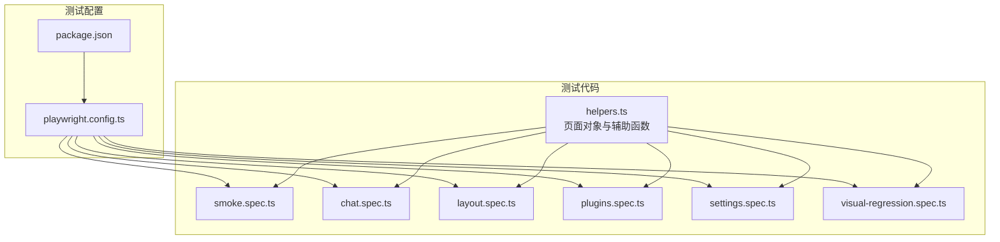
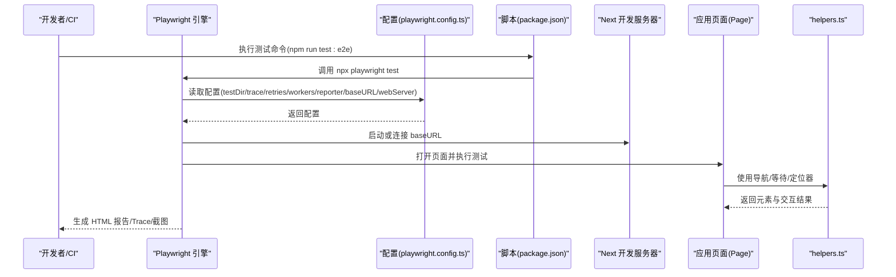
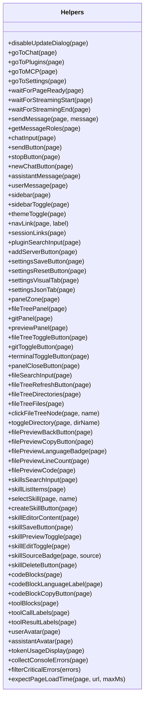
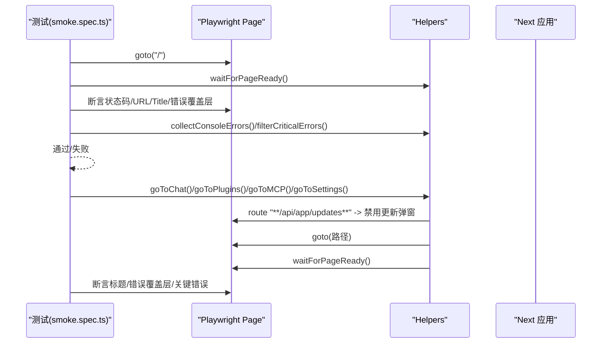
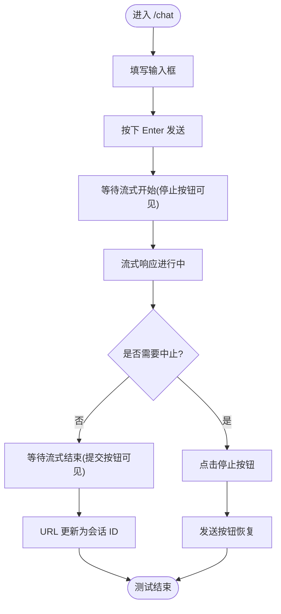
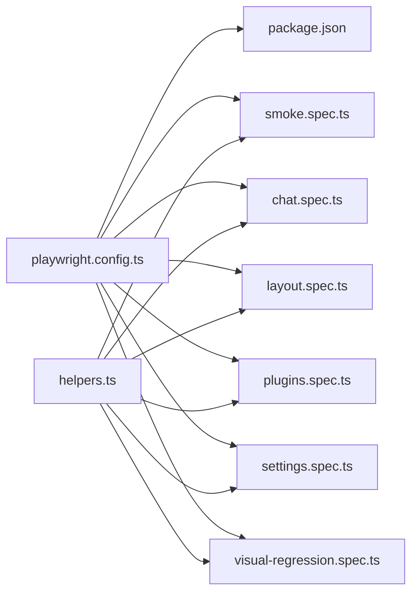

# 端到端测试

<cite>
**本文引用的文件**
- [playwright.config.ts](file://playwright.config.ts)
- [package.json](file://package.json)
- [src/__tests__/helpers.ts](file://src/__tests__/helpers.ts)
- [src/__tests__/e2e/smoke.spec.ts](file://src/__tests__/e2e/smoke.spec.ts)
- [src/__tests__/e2e/chat.spec.ts](file://src/__tests__/e2e/chat.spec.ts)
- [src/__tests__/e2e/layout.spec.ts](file://src/__tests__/e2e/layout.spec.ts)
- [src/__tests__/e2e/plugins.spec.ts](file://src/__tests__/e2e/plugins.spec.ts)
- [src/__tests__/e2e/settings.spec.ts](file://src/__tests__/e2e/settings.spec.ts)
- [src/__tests__/e2e/visual-regression.spec.ts](file://src/__tests__/e2e/visual-regression.spec.ts)
</cite>

## 目录
1. [简介](#简介)
2. [项目结构](#项目结构)
3. [核心组件](#核心组件)
4. [架构总览](#架构总览)
5. [详细组件分析](#详细组件分析)
6. [依赖关系分析](#依赖关系分析)
7. [性能考量](#性能考量)
8. [故障排查指南](#故障排查指南)
9. [结论](#结论)
10. [附录](#附录)

## 简介
本文件面向 CodePilot 的端到端测试体系，系统化阐述基于 Playwright 的测试配置、浏览器自动化与页面对象模型（Page Object Model）实践，覆盖测试场景设计、用户交互模拟与界面元素验证方法。同时提供 Electron 桌面应用测试策略、跨平台兼容性测试建议、测试数据与环境管理、测试执行流水线、测试报告与截图录制、视频回放、调试技巧、稳定性优化与并行执行方案。

## 项目结构
- 测试运行时配置集中在根目录的 Playwright 配置文件中，定义测试目录、并行策略、重试次数、报告器、基础 URL、Web 服务器启动方式等。
- 端到端测试位于 src/__tests__/e2e，包含多个特性域的测试文件：冒烟测试、聊天页、布局、插件与 MCP、设置、视觉回归等。
- 辅助工具集中于 src/__tests__/helpers，封装导航、等待、定位器与断言辅助函数，形成统一的页面对象模型与交互层。

**图表来源**
- [playwright.config.ts:1-32](file://playwright.config.ts#L1-L32)
- [package.json:17-38](file://package.json#L17-L38)
- [src/__tests__/helpers.ts:1-515](file://src/__tests__/helpers.ts#L1-L515)
- [src/__tests__/e2e/smoke.spec.ts:1-124](file://src/__tests__/e2e/smoke.spec.ts#L1-L124)
- [src/__tests__/e2e/chat.spec.ts:1-194](file://src/__tests__/e2e/chat.spec.ts#L1-L194)
- [src/__tests__/e2e/layout.spec.ts:1-349](file://src/__tests__/e2e/layout.spec.ts#L1-L349)
- [src/__tests__/e2e/plugins.spec.ts:1-193](file://src/__tests__/e2e/plugins.spec.ts#L1-L193)
- [src/__tests__/e2e/settings.spec.ts:1-230](file://src/__tests__/e2e/settings.spec.ts#L1-L230)
- [src/__tests__/e2e/visual-regression.spec.ts:1-80](file://src/__tests__/e2e/visual-regression.spec.ts#L1-L80)

**章节来源**
- [playwright.config.ts:1-32](file://playwright.config.ts#L1-L32)
- [package.json:17-38](file://package.json#L17-L38)

## 核心组件
- Playwright 配置与执行
  - 测试目录：src/__tests__/e2e
  - 并行策略：fullyParallel 开启
  - 重试策略：CI 环境下重试 2 次，本地为 0
  - 工作进程：CI 环境固定为 1，本地未指定
  - 报告器：HTML 报告
  - Trace：首次重试时开启，便于定位问题
  - 基础 URL：优先从环境变量 PLAYWRIGHT_BASE_URL 读取，默认 http://localhost:3000
  - Web 服务器：通过 npm run dev 启动 Next 应用，复用现有开发服务
- 页面对象与辅助函数
  - 导航：禁用更新弹窗路由、跳转到 /chat、/plugins、/plugins/mcp、/settings 等，并等待页面就绪
  - 等待：网络空闲后延迟等待，流式开始/结束的指示器等待
  - 定位器：统一导出常用 UI 元素选择器，如聊天输入框、发送/停止按钮、侧边栏、会话链接、面板开关等
  - 断言辅助：收集控制台错误、过滤非关键错误、断言页面加载时间
- 测试用例组织
  - 冒烟测试：首页重定向、各页面标题与错误覆盖、深度链接重定向校验
  - 聊天页：页面渲染、UI 元素可见性、消息发送与停止、流式响应、历史记录、URL 更新
  - 布局：侧边栏可见性、新对话按钮、聊天列表、主题切换、移动端响应式、三栏布局（已标记待重构）
  - 插件/MCP：页面加载、MCP 服务器添加与 JSON 配置编辑（已标记待重构）
  - 设置：页面加载、可视化/JSON 编辑模式切换、保存/重置按钮状态（已标记待重构）
  - 视觉回归：设计系统与设置页截图对比（默认跳过，需手动更新基线）

**章节来源**
- [playwright.config.ts:10-31](file://playwright.config.ts#L10-L31)
- [src/__tests__/helpers.ts:14-84](file://src/__tests__/helpers.ts#L14-L84)
- [src/__tests__/helpers.ts:131-296](file://src/__tests__/helpers.ts#L131-L296)
- [src/__tests__/e2e/smoke.spec.ts:12-123](file://src/__tests__/e2e/smoke.spec.ts#L12-L123)
- [src/__tests__/e2e/chat.spec.ts:20-193](file://src/__tests__/e2e/chat.spec.ts#L20-L193)
- [src/__tests__/e2e/layout.spec.ts:19-348](file://src/__tests__/e2e/layout.spec.ts#L19-L348)
- [src/__tests__/e2e/plugins.spec.ts:18-192](file://src/__tests__/e2e/plugins.spec.ts#L18-L192)
- [src/__tests__/e2e/settings.spec.ts:20-229](file://src/__tests__/e2e/settings.spec.ts#L20-L229)
- [src/__tests__/e2e/visual-regression.spec.ts:16-79](file://src/__tests__/e2e/visual-regression.spec.ts#L16-L79)

## 架构总览
下图展示 Playwright 测试在本地开发与 CI 环境中的执行路径与关键组件交互。

**图表来源**
- [playwright.config.ts:10-31](file://playwright.config.ts#L10-L31)
- [package.json:24-26](file://package.json#L24-L26)

## 详细组件分析

### Playwright 配置与执行策略
- 并行与重试
  - fullyParallel：提升吞吐量
  - CI 环境 retries=2，降低偶发失败影响
  - workers=1（CI）确保稳定；本地未指定以充分利用 CPU
- 报告与追踪
  - reporter: 'html' 输出可浏览的测试报告
  - trace: 'on-first-retry' 在首次重试时启用，便于问题复盘
- 环境适配
  - baseURL 支持通过 PLAYWRIGHT_BASE_URL 动态覆盖，避免多工作树端口冲突
  - webServer 复用现有 dev 服务，避免额外构建成本
- 命令入口
  - npm run test:e2e：标准端到端测试
  - npm run test:smoke：按标签运行冒烟测试
  - npm run test:visual：按标签运行视觉回归测试

**章节来源**
- [playwright.config.ts:10-31](file://playwright.config.ts#L10-L31)
- [package.json:24-26](file://package.json#L24-L26)

### 页面对象模型与辅助函数
- 导航与等待
  - 禁用更新弹窗路由，避免外部网络对测试稳定性的影响
  - 统一 waitForPageReady：网络空闲 + 固定延迟，保证动态内容加载完成
  - 流式交互：等待“停止”按钮出现/消失，判断流式开始/结束
- 定位器抽象
  - 聊天：输入框、发送/停止按钮、用户/助手消息容器、新对话按钮
  - 布局：侧边栏、侧边栏切换、主题切换、导航链接、会话链接
  - 面板：UnifiedTopBar 下的文件树/Git/终端面板及其开关与关闭按钮
  - 插件/MCP：搜索输入、添加服务器按钮、JSON 配置编辑器
  - 设置：保存/重置按钮、可视化/JSON 编辑器标签
- 断言与诊断
  - collectConsoleErrors：捕获页面控制台错误
  - filterCriticalErrors：过滤非关键错误（favicon/hydrat/Warning/DevTools）
  - expectPageLoadTime：断言页面加载耗时

**图表来源**
- [src/__tests__/helpers.ts:14-514](file://src/__tests__/helpers.ts#L14-L514)

**章节来源**
- [src/__tests__/helpers.ts:14-514](file://src/__tests__/helpers.ts#L14-L514)

### 冒烟测试（Smoke）
- 场景要点
  - 首页重定向至 /chat
  - 各页面标题不含 404/500，无构建错误覆盖层
  - 深度链接 /settings/codex 重定向至 /settings/runtime，并校验目标页面存在 Codex 引擎卡片
  - 控制台错误过滤，仅保留关键错误
- 适用范围
  - 快速验证主路由与关键页面可用性
  - 作为 CI 合入门禁的基础测试集

**图表来源**
- [src/__tests__/e2e/smoke.spec.ts:12-123](file://src/__tests__/e2e/smoke.spec.ts#L12-L123)
- [src/__tests__/helpers.ts:14-84](file://src/__tests__/helpers.ts#L14-L84)

**章节来源**
- [src/__tests__/e2e/smoke.spec.ts:12-123](file://src/__tests__/e2e/smoke.spec.ts#L12-L123)
- [src/__tests__/helpers.ts:485-514](file://src/__tests__/helpers.ts#L485-L514)

### 聊天页测试（Chat）
- 页面渲染
  - 首页重定向、页面加载时间断言、无控制台错误
  - 无消息时显示空状态（标题与描述）
- UI 元素
  - 新建会话按钮、输入框占位符、发送按钮可见性
- 发送消息与流式响应
  - 输入文本、触发发送、停止按钮替换、助手头像出现、URL 更新为会话 ID
  - 中止生成：点击停止后发送按钮恢复
- 历史记录
  - 侧边栏包含聊天列表或空状态提示

**图表来源**
- [src/__tests__/e2e/chat.spec.ts:86-171](file://src/__tests__/e2e/chat.spec.ts#L86-L171)
- [src/__tests__/helpers.ts:86-98](file://src/__tests__/helpers.ts#L86-L98)

**章节来源**
- [src/__tests__/e2e/chat.spec.ts:20-193](file://src/__tests__/e2e/chat.spec.ts#L20-L193)
- [src/__tests__/helpers.ts:104-109](file://src/__tests__/helpers.ts#L104-L109)

### 布局测试（Layout）
- 侧边栏
  - 桌面端可见且宽度在合理区间；包含“新建对话”按钮与聊天列表
- 主题切换与导航高亮（标记待重构）
  - 切换按钮存在；暗色模式应用正确；导航高亮随路由变化
- 移动端响应式（标记待重构）
  - 小屏汉堡菜单、侧边栏遮罩、打开/关闭行为
- 三栏布局（标记待重构）
  - /chat/[id] 路由下右侧面板可见；非聊天路由隐藏；折叠时主内容自适应

**章节来源**
- [src/__tests__/e2e/layout.spec.ts:19-348](file://src/__tests__/e2e/layout.spec.ts#L19-L348)

### 插件与 MCP 测试（Plugins）
- 当前状态：测试文件被标记为跳过，等待与新路由/布局对齐
- 历史职责
  - 插件页与 MCP 管理页加载时间与错误断言
  - 插件页重定向至 /skills，MCP 页重定向至 /mcp
  - 添加 MCP 服务器对话框字段与取消行为
  - JSON 配置编辑器的切换与保存/格式化按钮

**章节来源**
- [src/__tests__/e2e/plugins.spec.ts:18-192](file://src/__tests__/e2e/plugins.spec.ts#L18-L192)

### 设置页测试（Settings）
- 当前状态：测试文件被标记为跳过，等待与新布局对齐
- 历史职责
  - 页面加载时间与错误断言
  - 可视化/JSON 编辑器模式切换
  - 保存/重置按钮状态与交互
  - 深度链接到技能编辑器的加载与错误断言

**章节来源**
- [src/__tests__/e2e/settings.spec.ts:20-229](file://src/__tests__/e2e/settings.spec.ts#L20-L229)

### 视觉回归测试（Visual Regression）
- 当前状态：测试被标记为跳过
- 职责
  - 设计系统页面与关键区块截图
  - 设置页全页截图
  - 基线更新：通过标签与 --update-snapshots 参数更新
  - 默认不参与常规门禁，避免机器差异导致失败

**章节来源**
- [src/__tests__/e2e/visual-regression.spec.ts:16-79](file://src/__tests__/e2e/visual-regression.spec.ts#L16-L79)

## 依赖关系分析
- 配置依赖
  - playwright.config.ts 依赖 package.json 中的脚本与依赖版本
  - baseURL 与 webServer 复用 Next 开发服务器，减少构建开销
- 测试依赖
  - 所有 e2e 测试依赖 helpers.ts 提供的导航、等待与定位器
  - 控制台错误收集与过滤依赖浏览器 console 事件
- 可能的耦合点
  - 页面布局/文案变更可能影响定位器与断言，需同步更新 helpers 与测试
  - 深度链接与路由重定向会影响冒烟测试与部分交互流程

**图表来源**
- [playwright.config.ts:10-31](file://playwright.config.ts#L10-L31)
- [package.json:24-26](file://package.json#L24-L26)
- [src/__tests__/helpers.ts:1-515](file://src/__tests__/helpers.ts#L1-L515)
- [src/__tests__/e2e/smoke.spec.ts:1-124](file://src/__tests__/e2e/smoke.spec.ts#L1-L124)
- [src/__tests__/e2e/chat.spec.ts:1-194](file://src/__tests__/e2e/chat.spec.ts#L1-L194)
- [src/__tests__/e2e/layout.spec.ts:1-349](file://src/__tests__/e2e/layout.spec.ts#L1-L349)
- [src/__tests__/e2e/plugins.spec.ts:1-193](file://src/__tests__/e2e/plugins.spec.ts#L1-L193)
- [src/__tests__/e2e/settings.spec.ts:1-230](file://src/__tests__/e2e/settings.spec.ts#L1-L230)
- [src/__tests__/e2e/visual-regression.spec.ts:1-80](file://src/__tests__/e2e/visual-regression.spec.ts#L1-L80)

**章节来源**
- [playwright.config.ts:10-31](file://playwright.config.ts#L10-L31)
- [package.json:24-26](file://package.json#L24-L26)
- [src/__tests__/helpers.ts:1-515](file://src/__tests__/helpers.ts#L1-L515)

## 性能考量
- 并行执行
  - fullyParallel 提升整体吞吐；CI 环境 workers=1 保障稳定性
- 重试策略
  - CI 环境 retries=2，平衡稳定性与耗时
- 等待策略
  - waitForPageReady 结合网络空闲与固定延迟，避免过早断言
  - 流式等待基于可见性与 aria-label 切换，减少轮询
- 资源复用
  - webServer 复用 dev 服务，避免重复构建
- 截图与报告
  - HTML 报告与 Trace 便于快速定位失败原因，减少人工排查成本

[本节为通用指导，无需具体文件分析]

## 故障排查指南
- 常见问题
  - 页面加载超时：检查 waitForPageReady 与网络空闲状态；确认 baseURL 与端口
  - 控制台错误导致失败：使用 collectConsoleErrors + filterCriticalErrors 过滤非关键错误
  - 深度链接重定向：冒烟测试已覆盖 /settings/codex → /settings/runtime 的重定向
  - 流式响应不稳定：使用 waitForStreamingStart/End 与 stopButton/sendButton 切换断言
- 排查步骤
  - 启用 trace：在首次重试时自动开启，查看交互序列与 DOM 状态
  - 查看 HTML 报告：定位失败用例与截图
  - 本地复现：设置 PLAYWRIGHT_BASE_URL 指向当前 dev 端口
- 修复建议
  - 定位器健壮性：优先使用语义化属性（aria-label/name）而非文案
  - 断言稳定性：避免硬编码尺寸与文案，采用范围断言与结构化匹配

**章节来源**
- [playwright.config.ts:17-20](file://playwright.config.ts#L17-L20)
- [src/__tests__/helpers.ts:485-514](file://src/__tests__/helpers.ts#L485-L514)
- [src/__tests__/e2e/smoke.spec.ts:92-122](file://src/__tests__/e2e/smoke.spec.ts#L92-L122)

## 结论
CodePilot 的端到端测试以 Playwright 为核心，结合统一的页面对象模型与辅助函数，实现了对主路由、聊天交互、布局与设置等关键领域的自动化覆盖。通过合理的并行与重试策略、可控的环境变量与 Web 服务器复用，测试在本地与 CI 中均具备良好稳定性。建议持续完善视觉回归与移动端响应式测试，并逐步迁移已标记跳过的布局与页面测试，以进一步提升覆盖率与维护效率。

[本节为总结，无需具体文件分析]

## 附录

### Electron 桌面应用测试策略
- 现状与建议
  - 当前 Playwright 配置针对 Web 应用；Electron 桌面应用通常使用原生窗口与系统级交互
  - 若需在 CI 中测试桌面行为，可考虑：
    - 使用 Playwright 的 Electron 渲染进程测试（需调整配置与页面对象）
    - 或采用独立的桌面测试套件（如基于 Electron 的 e2e 框架），并与 Web 测试解耦
- 关键关注点
  - 菜单栏、托盘、系统通知、文件系统访问等原生能力
  - 多窗口与多实例行为
  - 跨平台差异（macOS/Windows/Linux）

[本节为概念性建议，无需具体文件分析]

### 跨平台兼容性测试
- 建议
  - 在 CI 中分阶段运行：先在 Linux（更快），再在 macOS/Windows（必要时）
  - 使用不同 viewport 与设备模拟（移动端、平板）
  - 对关键交互（拖拽、右键菜单、快捷键）分别验证
- 数据与环境
  - 使用环境变量隔离不同平台的差异（如字体、路径分隔符）
  - 截图与视频录制在不同平台可能有细微差异，建议统一基准或按平台分组

[本节为通用指导，无需具体文件分析]

### 测试数据管理与环境配置
- 环境变量
  - PLAYWRIGHT_BASE_URL：覆盖 baseURL，支持多工作树并行开发
  - CI：控制 retries 与 workers 数量
- 数据隔离
  - 使用独立的测试数据库或内存存储，避免与开发数据冲突
  - 对于需要真实 API 的场景，建议使用 Mock 或沙箱环境

**章节来源**
- [playwright.config.ts:3-8](file://playwright.config.ts#L3-L8)
- [src/__tests__/helpers.ts:14-32](file://src/__tests__/helpers.ts#L14-L32)

### 测试执行流水线
- 建议步骤
  - 安装依赖与启动 Next 开发服务器
  - 运行冒烟测试（快速门禁）
  - 并行执行其余 e2e 测试
  - 生成 HTML 报告与 Trace，上传 Artifacts
  - 视觉回归测试按需单独执行并更新基线
- 命令参考
  - npm run test:e2e
  - npm run test:smoke
  - npm run test:visual

**章节来源**
- [package.json:24-26](file://package.json#L24-L26)
- [playwright.config.ts:10-31](file://playwright.config.ts#L10-L31)

### 测试报告、截图与视频回放
- 报告器
  - HTML 报告：可浏览的测试结果与附件
- 截图与视频
  - 截图：用于视觉回归与问题定位
  - 视频：配合 Trace 与截图进行回放
- Trace
  - 首次重试时自动开启，便于复盘交互序列

**章节来源**
- [playwright.config.ts:16-20](file://playwright.config.ts#L16-L20)

### 调试技巧与稳定性优化
- 调试
  - 使用 trace 与 HTML 报告定位失败用例
  - 在本地设置 PLAYWRIGHT_BASE_URL 指向 dev 服务
  - 逐步缩小断言范围，先断言结构再断言文案
- 稳定性
  - 使用 aria-label 与语义化属性替代文案断言
  - 等待策略：网络空闲 + 显式等待 + 固定延迟
  - 控制台错误过滤，避免第三方资源干扰

**章节来源**
- [playwright.config.ts:17-20](file://playwright.config.ts#L17-L20)
- [src/__tests__/helpers.ts:485-514](file://src/__tests__/helpers.ts#L485-L514)

### 并行测试执行方案
- 并行策略
  - fullyParallel：提升吞吐
  - CI workers=1：避免资源竞争
- 分组执行
  - 使用标签区分冒烟、视觉回归与其他 e2e 测试，按需并行或串行
- 资源管理
  - 复用 dev 服务，避免重复构建
  - 控制并发数，避免内存与 CPU 压力过大

**章节来源**
- [playwright.config.ts:12-15](file://playwright.config.ts#L12-L15)
- [package.json:24-26](file://package.json#L24-L26)