# 集成测试

<cite>
**本文引用的文件**
- [playwright.config.ts](file://playwright.config.ts)
- [test-plan.md](file://src/__tests__/test-plan.md)
- [test-report.md](file://src/__tests__/test-report.md)
- [db-isolation.setup.ts](file://src/__tests__/db-isolation.setup.ts)
- [functional-test.ts](file://src/__tests__/functional-test.ts)
- [smoke-test.ts](file://src/__tests__/smoke-test.ts)
- [targeted-test.ts](file://src/__tests__/targeted-test.ts)
- [hooks-poc.test.ts](file://src/__tests__/integration/hooks-poc.test.ts)
- [multi-defer-poc.test.ts](file://src/__tests__/integration/multi-defer-poc.test.ts)
- [warm-query-poc.test.ts](file://src/__tests__/integration/warm-query-poc.test.ts)
- [permission-event-contract.test.ts](file://src/__tests__/unit/permission-event-contract.test.ts)
- [runtime-event-contract.test.ts](file://src/__tests__/unit/runtime-event-contract.test.ts)
- [harness-context-compiler.test.ts](file://src/__tests__/unit/harness-context-compiler.test.ts)
- [harness-capability-contract.test.ts](file://src/__tests__/unit/harness-capability-contract.test.ts)
- [provider-resolver.test.ts](file://src/__tests__/unit/provider-resolver.test.ts)
- [widget-system.test.ts](file://src/__tests__/unit/widget-system.test.ts)
- [context-breakdown.test.ts](file://src/__tests__/unit/context-breakdown.test.ts)
- [message-persistence.test.ts](file://src/__tests__/unit/message-persistence.test.ts)
- [task-scheduler.test.ts](file://src/__tests__/unit/task-scheduler.test.ts)
- [openai-oauth-retry.test.ts](file://src/__tests__/unit/openai-oauth-retry.test.ts)
- [db-shutdown.test.ts](file://src/__tests__/unit/db-shutdown.test.ts)
- [cache-handler.js](file://cache-handler.js)
- [db.ts](file://src/lib/db.ts)
- [mcp-loader.ts](file://src/lib/mcp-loader.ts)
- [mcp-connection-manager.ts](file://src/lib/mcp-connection-manager.ts)
- [claude-client.ts](file://src/lib/claude-client.ts)
- [openai-oauth-manager.ts](file://src/lib/openai-oauth-manager.ts)
- [runtime-compat.ts](file://src/lib/runtime-compat.ts)
- [sdk-model-usage.ts](file://src/lib/sdk-model-usage.ts)
- [provider-resolver.ts](file://src/lib/provider-resolver.ts)
- [widget-system.ts](file://src/lib/widget-system.ts)
- [context-assembler.ts](file://src/lib/context-assembler.ts)
- [message-normalizer.ts](file://src/lib/message-normalizer.ts)
- [task-scheduler.ts](file://src/lib/task-scheduler.ts)
- [stream-session-manager.ts](file://src/lib/stream-session-manager.ts)
- [notification-manager.ts](file://src/lib/notification-manager.ts)
- [workspace-sidebar.ts](file://src/lib/workspace-sidebar.ts)
- [assistant-workspace.ts](file://src/lib/assistant-workspace.ts)
- [chat-runtime.ts](file://src/lib/chat-runtime.ts)
- [dashboard-store.ts](file://src/lib/dashboard-store.ts)
- [media-saver.ts](file://src/lib/media-saver.ts)
- [image-generator.ts](file://src/lib/image-generator.ts)
- [memory-extractor.ts](file://src/lib/memory-extractor.ts)
- [workspace-indexer.ts](file://src/lib/workspace-indexer.ts)
- [workspace-organizer.ts](file://src/lib/workspace-organizer.ts)
- [workspace-retrieval.ts](file://src/lib/workspace-retrieval.ts)
- [workspace-taxonomy.ts](file://src/lib/workspace-taxonomy.ts)
- [file-utils.ts](file://src/lib/file-utils.ts)
- [file-write-tools.ts](file://src/lib/file-write-tools.ts)
- [files.ts](file://src/lib/files.ts)
- [git.ts](file://src/lib/git.ts)
- [cli-tools-mcp.ts](file://src/lib/cli-tools-mcp.ts)
- [plugin-discovery.ts](file://src/lib/plugin-discovery.ts)
- [theme.ts](file://src/lib/theme.ts)
- [platform.ts](file://src/lib/platform.ts)
- [update-release.ts](file://src/lib/update-release.ts)
- [terminal.ts](file://src/lib/terminal.ts)
- [terminal-manager.ts](file://electron/terminal-manager.ts)
- [main.ts](file://electron/main.ts)
- [preload.ts](file://electron/preload.ts)
- [updater.ts](file://electron/updater.ts)
- [instrumentation.ts](file://src/instrumentation.ts)
</cite>

## 目录
1. [引言](#引言)
2. [项目结构](#项目结构)
3. [核心组件](#核心组件)
4. [架构总览](#架构总览)
5. [详细组件分析](#详细组件分析)
6. [依赖关系分析](#依赖关系分析)
7. [性能考量](#性能考量)
8. [故障排查指南](#故障排查指南)
9. [结论](#结论)
10. [附录](#附录)

## 引言
本文件面向 CodePilot 的集成测试体系，系统阐述系统级测试的设计原则与实施方法，覆盖模块间接口测试、API 集成测试、第三方服务集成验证；解释功能性测试用例设计、业务流程测试与数据流测试策略；提供数据库、缓存与外部依赖的集成测试方法；明确测试环境搭建、测试数据同步与测试隔离策略；给出测试用例优先级排序、回归测试管理与性能基准测试建议；最后提供测试调试工具使用与故障诊断方法。

## 项目结构
CodePilot 的测试体系由三类测试构成：端到端（E2E）测试、集成测试（Integration）与单元测试（Unit）。其中：
- 端到端测试：基于 Playwright 的浏览器自动化，覆盖用户主流程与界面交互。
- 集成测试：关注模块间协作、事件契约、运行时兼容性与跨子系统的功能集成。
- 单元测试：聚焦具体函数、类与工具方法的行为验证。

测试配置与报告：
- 测试运行器与浏览器配置：playwright.config.ts
- 测试计划与报告：src/__tests__/test-plan.md、src/__tests__/test-report.md
- 数据库隔离：src/__tests__/db-isolation.setup.ts
- 功能性测试入口：src/__tests__/functional-test.ts
- 烟雾测试入口：src/__tests__/smoke-test.ts
- 目标化测试入口：src/__tests__/targeted-test.ts

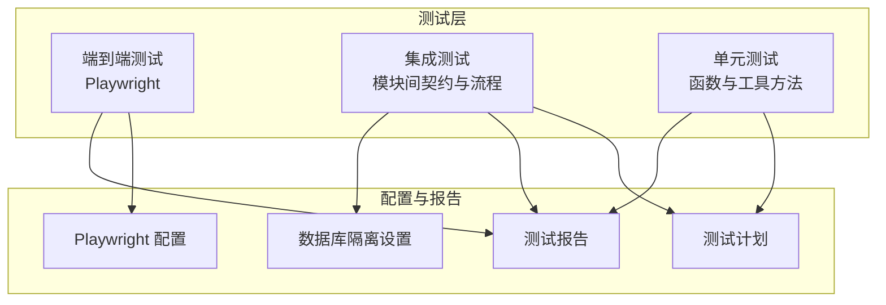

**图表来源**
- [playwright.config.ts](file://playwright.config.ts)
- [test-plan.md](file://src/__tests__/test-plan.md)
- [test-report.md](file://src/__tests__/test-report.md)
- [db-isolation.setup.ts](file://src/__tests__/db-isolation.setup.ts)

**章节来源**
- [playwright.config.ts](file://playwright.config.ts)
- [test-plan.md](file://src/__tests__/test-plan.md)
- [test-report.md](file://src/__tests__/test-report.md)
- [db-isolation.setup.ts](file://src/__tests__/db-isolation.setup.ts)

## 核心组件
- 端到端测试框架：Playwright，负责浏览器自动化、页面交互与视觉回归。
- 集成测试套件：覆盖事件契约、运行时兼容、权限与桥接系统等跨模块行为。
- 单元测试套件：覆盖工具函数、消息处理、上下文组装、任务调度、OAuth 重试、数据库关闭等。
- 测试基础设施：数据库隔离设置、测试入口脚本（功能性/烟雾/目标化）。
- 外部依赖与第三方服务：Claude、OpenAI/OAuth、MCP 系统、Electron 主进程与渲染进程通信。

**章节来源**
- [playwright.config.ts](file://playwright.config.ts)
- [functional-test.ts](file://src/__tests__/functional-test.ts)
- [smoke-test.ts](file://src/__tests__/smoke-test.ts)
- [targeted-test.ts](file://src/__tests__/targeted-test.ts)
- [db-isolation.setup.ts](file://src/__tests__/db-isolation.setup.ts)

## 架构总览
下图展示集成测试在系统中的位置与交互关系：

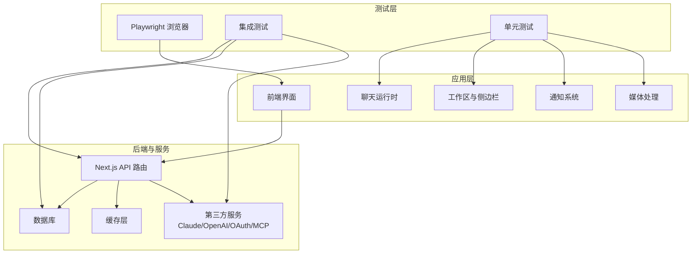

**图表来源**
- [chat-runtime.ts](file://src/lib/chat-runtime.ts)
- [workspace-sidebar.ts](file://src/lib/workspace-sidebar.ts)
- [notification-manager.ts](file://src/lib/notification-manager.ts)
- [media-saver.ts](file://src/lib/media-saver.ts)
- [db.ts](file://src/lib/db.ts)
- [claude-client.ts](file://src/lib/claude-client.ts)
- [openai-oauth-manager.ts](file://src/lib/openai-oauth-manager.ts)
- [mcp-loader.ts](file://src/lib/mcp-loader.ts)

## 详细组件分析

### 模块间接口测试
- 事件契约测试：验证运行时事件、权限事件、编排器事件的一致性与完整性。
- 运行时兼容性：确保不同运行时版本下的行为一致性与回退策略。
- 桥接系统：验证 MCP、内置桥接与外部桥接的路由与调用契约。

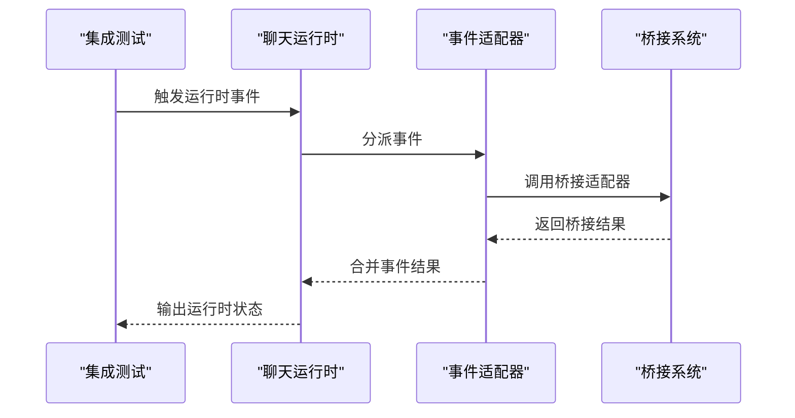

**图表来源**
- [runtime-event-contract.test.ts](file://src/__tests__/unit/runtime-event-contract.test.ts)
- [permission-event-contract.test.ts](file://src/__tests__/unit/permission-event-contract.test.ts)
- [harness-context-compiler.test.ts](file://src/__tests__/unit/harness-context-compiler.test.ts)
- [harness-capability-contract.test.ts](file://src/__tests__/unit/harness-capability-contract.test.ts)
- [chat-runtime.ts](file://src/lib/chat-runtime.ts)
- [mcp-loader.ts](file://src/lib/mcp-loader.ts)

**章节来源**
- [runtime-event-contract.test.ts](file://src/__tests__/unit/runtime-event-contract.test.ts)
- [permission-event-contract.test.ts](file://src/__tests__/unit/permission-event-contract.test.ts)
- [harness-context-compiler.test.ts](file://src/__tests__/unit/harness-context-compiler.test.ts)
- [harness-capability-contract.test.ts](file://src/__tests__/unit/harness-capability-contract.test.ts)

### API 集成测试
- 路由覆盖：确保 API 路由按预期响应，参数校验与错误处理正确。
- 第三方服务集成：验证 Claude、OpenAI OAuth、MCP 等外部服务调用链路。
- 缓存与数据库：验证写入、查询、事务与一致性。

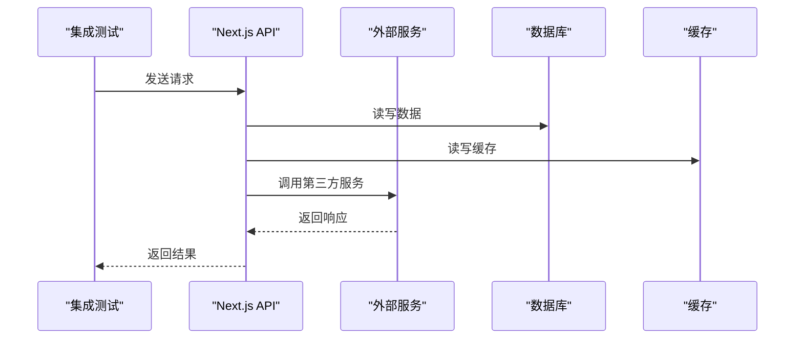

**图表来源**
- [claude-client.ts](file://src/lib/claude-client.ts)
- [openai-oauth-manager.ts](file://src/lib/openai-oauth-manager.ts)
- [mcp-loader.ts](file://src/lib/mcp-loader.ts)
- [db.ts](file://src/lib/db.ts)
- [cache-handler.js](file://cache-handler.js)

**章节来源**
- [claude-client.ts](file://src/lib/claude-client.ts)
- [openai-oauth-manager.ts](file://src/lib/openai-oauth-manager.ts)
- [mcp-loader.ts](file://src/lib/mcp-loader.ts)
- [db.ts](file://src/lib/db.ts)
- [cache-handler.js](file://cache-handler.js)

### 第三方服务集成验证
- OAuth 重试与刷新：验证 OpenAI OAuth 的重试机制与令牌刷新流程。
- MCP 连接与加载：验证 MCP 服务器连接、工具发现与调用。
- Claude 会话与状态：验证会话建立、状态同步与错误恢复。

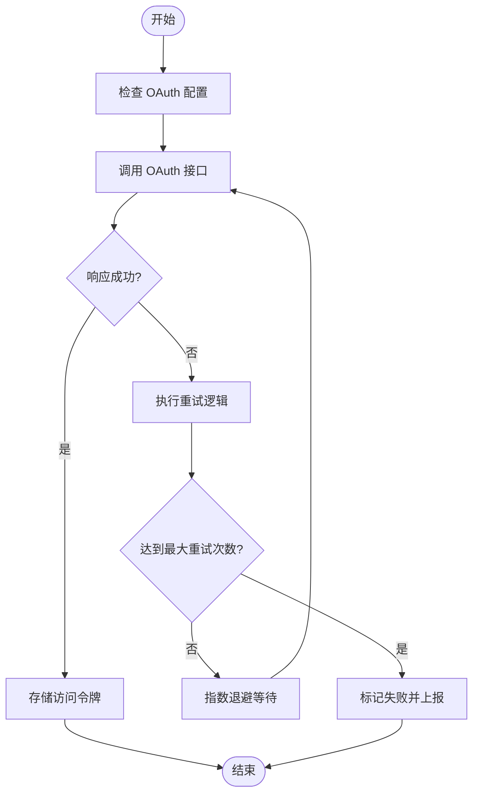

**图表来源**
- [openai-oauth-retry.test.ts](file://src/__tests__/unit/openai-oauth-retry.test.ts)
- [openai-oauth-manager.ts](file://src/lib/openai-oauth-manager.ts)
- [mcp-connection-manager.ts](file://src/lib/mcp-connection-manager.ts)
- [mcp-loader.ts](file://src/lib/mcp-loader.ts)

**章节来源**
- [openai-oauth-retry.test.ts](file://src/__tests__/unit/openai-oauth-retry.test.ts)
- [openai-oauth-manager.ts](file://src/lib/openai-oauth-manager.ts)
- [mcp-connection-manager.ts](file://src/lib/mcp-connection-manager.ts)
- [mcp-loader.ts](file://src/lib/mcp-loader.ts)

### 功能性测试用例设计
- 用户主流程：从登录到发起对话、查看历史、保存与导出。
- 权限与安全：验证权限边界、桥接可见性与事件分发。
- 工具与插件：验证 CLI 工具、MCP 工具与内置工具的可用性。
- 媒体与文件：验证图片生成、媒体导入与文件写入。

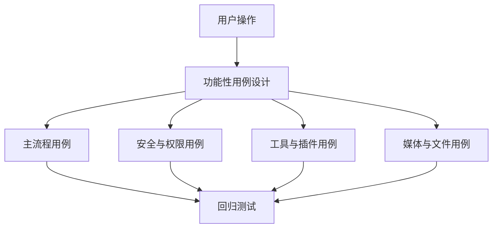

**图表来源**
- [widget-system.test.ts](file://src/__tests__/unit/widget-system.test.ts)
- [provider-resolver.test.ts](file://src/__tests__/unit/provider-resolver.test.ts)
- [image-generator.ts](file://src/lib/image-generator.ts)
- [media-saver.ts](file://src/lib/media-saver.ts)
- [file-write-tools.ts](file://src/lib/file-write-tools.ts)

**章节来源**
- [widget-system.test.ts](file://src/__tests__/unit/widget-system.test.ts)
- [provider-resolver.test.ts](file://src/__tests__/unit/provider-resolver.test.ts)
- [image-generator.ts](file://src/lib/image-generator.ts)
- [media-saver.ts](file://src/lib/media-saver.ts)
- [file-write-tools.ts](file://src/lib/file-write-tools.ts)

### 业务流程测试
- 上下文组装与压缩：验证上下文断点、压缩与修剪策略。
- 任务调度与通知：验证定时任务、通知触发与去重。
- 工作区索引与检索：验证索引构建、分类与快速检索。

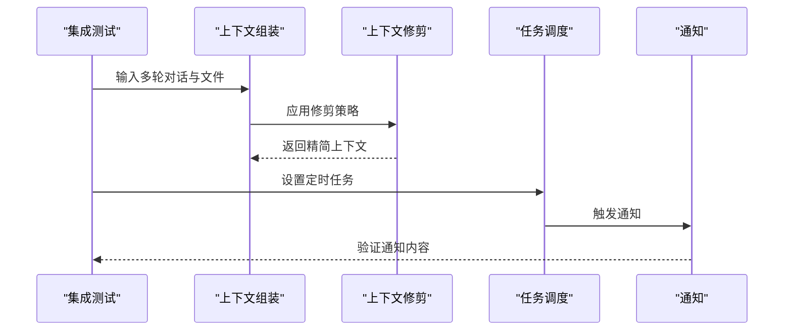

**图表来源**
- [context-breakdown.test.ts](file://src/__tests__/unit/context-breakdown.test.ts)
- [context-assembler.ts](file://src/lib/context-assembler.ts)
- [context-pruner.ts](file://src/lib/context-pruner.ts)
- [task-scheduler.ts](file://src/lib/task-scheduler.ts)
- [notification-manager.ts](file://src/lib/notification-manager.ts)

**章节来源**
- [context-breakdown.test.ts](file://src/__tests__/unit/context-breakdown.test.ts)
- [context-assembler.ts](file://src/lib/context-assembler.ts)
- [task-scheduler.ts](file://src/lib/task-scheduler.ts)
- [notification-manager.ts](file://src/lib/notification-manager.ts)

### 数据流测试策略
- 写入路径：消息持久化、文件写入、媒体保存。
- 读取路径：消息拉取、上下文组装、工作区检索。
- 清理与关闭：数据库关闭、缓存失效与资源释放。

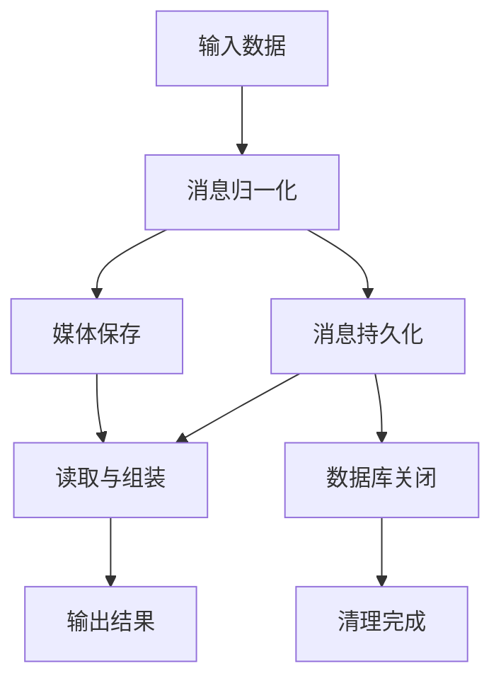

**图表来源**
- [message-normalizer.ts](file://src/lib/message-normalizer.ts)
- [message-persistence.test.ts](file://src/__tests__/unit/message-persistence.test.ts)
- [media-saver.ts](file://src/lib/media-saver.ts)
- [db-shutdown.test.ts](file://src/__tests__/unit/db-shutdown.test.ts)

**章节来源**
- [message-normalizer.ts](file://src/lib/message-normalizer.ts)
- [message-persistence.test.ts](file://src/__tests__/unit/message-persistence.test.ts)
- [media-saver.ts](file://src/lib/media-saver.ts)
- [db-shutdown.test.ts](file://src/__tests__/unit/db-shutdown.test.ts)

### 数据库集成测试
- 隔离与回滚：每个测试独立数据库实例或事务，避免污染。
- 连接池与并发：验证高并发场景下的连接与锁。
- 关闭与清理：测试数据库关闭流程与资源回收。

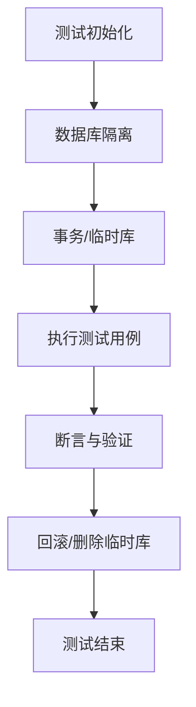

**图表来源**
- [db-isolation.setup.ts](file://src/__tests__/db-isolation.setup.ts)
- [db.ts](file://src/lib/db.ts)
- [db-shutdown.test.ts](file://src/__tests__/unit/db-shutdown.test.ts)

**章节来源**
- [db-isolation.setup.ts](file://src/__tests__/db-isolation.setup.ts)
- [db.ts](file://src/lib/db.ts)
- [db-shutdown.test.ts](file://src/__tests__/unit/db-shutdown.test.ts)

### 缓存集成测试
- 缓存命中与失效：验证热点数据的缓存命中率与过期策略。
- 并发一致性：验证多线程/多进程下的缓存一致性。
- 缓存与数据库一致性：验证读写一致性与最终一致。

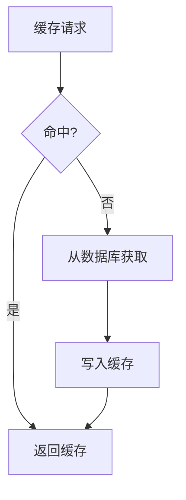

**图表来源**
- [cache-handler.js](file://cache-handler.js)
- [db.ts](file://src/lib/db.ts)

**章节来源**
- [cache-handler.js](file://cache-handler.js)
- [db.ts](file://src/lib/db.ts)

### 外部依赖测试
- MCP 工具链：验证工具发现、调用与错误传播。
- 第三方认证：验证 OAuth 刷新与重试。
- Claude 会话：验证会话生命周期与状态同步。

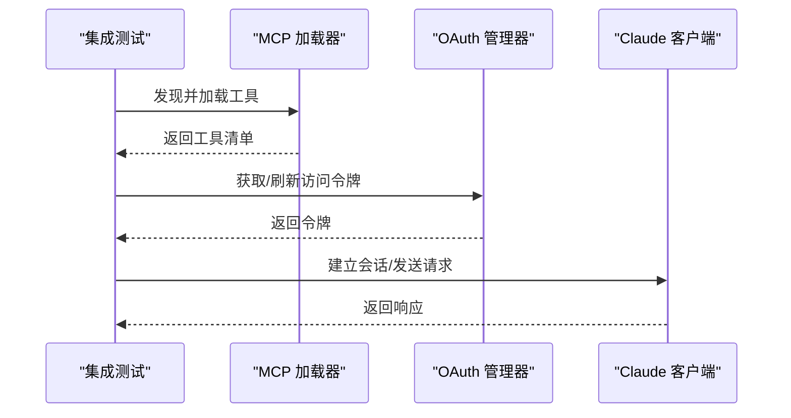

**图表来源**
- [mcp-loader.ts](file://src/lib/mcp-loader.ts)
- [openai-oauth-manager.ts](file://src/lib/openai-oauth-manager.ts)
- [claude-client.ts](file://src/lib/claude-client.ts)

**章节来源**
- [mcp-loader.ts](file://src/lib/mcp-loader.ts)
- [openai-oauth-manager.ts](file://src/lib/openai-oauth-manager.ts)
- [claude-client.ts](file://src/lib/claude-client.ts)

## 依赖关系分析
- 组件耦合：运行时、上下文组装、任务调度与通知之间存在强耦合，需通过契约测试保证稳定性。
- 外部依赖：MCP、Claude、OpenAI/OAuth 影响端到端与集成测试的稳定性，应采用桩/模拟或沙箱环境。
- 事件驱动：权限事件、运行时事件与桥接事件形成事件驱动架构，需重点验证事件传递与处理。

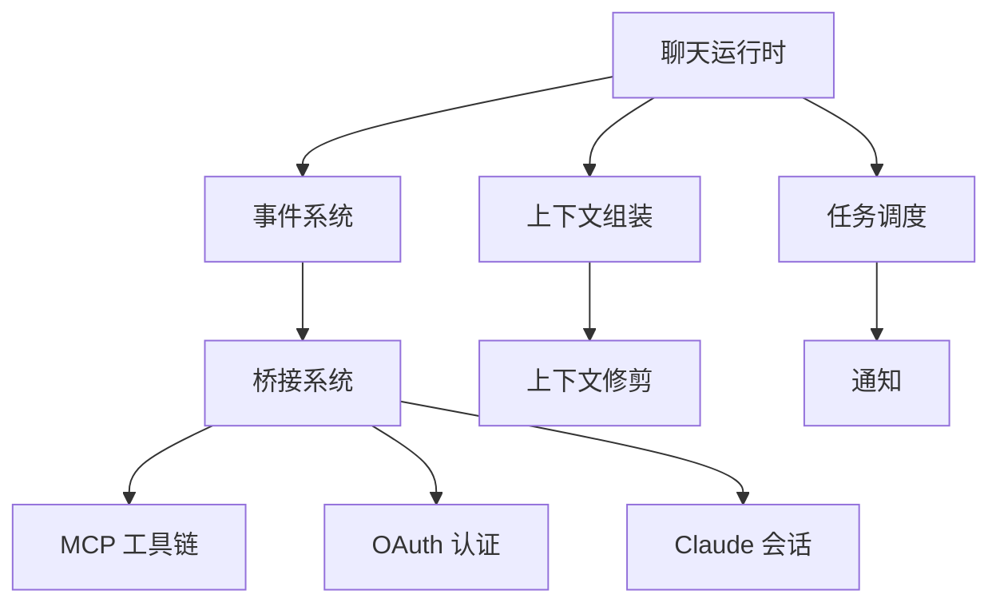

**图表来源**
- [chat-runtime.ts](file://src/lib/chat-runtime.ts)
- [context-assembler.ts](file://src/lib/context-assembler.ts)
- [task-scheduler.ts](file://src/lib/task-scheduler.ts)
- [notification-manager.ts](file://src/lib/notification-manager.ts)
- [mcp-loader.ts](file://src/lib/mcp-loader.ts)
- [openai-oauth-manager.ts](file://src/lib/openai-oauth-manager.ts)
- [claude-client.ts](file://src/lib/claude-client.ts)

**章节来源**
- [chat-runtime.ts](file://src/lib/chat-runtime.ts)
- [context-assembler.ts](file://src/lib/context-assembler.ts)
- [task-scheduler.ts](file://src/lib/task-scheduler.ts)
- [notification-manager.ts](file://src/lib/notification-manager.ts)
- [mcp-loader.ts](file://src/lib/mcp-loader.ts)
- [openai-oauth-manager.ts](file://src/lib/openai-oauth-manager.ts)
- [claude-client.ts](file://src/lib/claude-client.ts)

## 性能考量
- 基准测试：对关键路径（消息归一化、上下文组装、任务调度）进行基准测试，记录吞吐量与延迟。
- 并发测试：模拟高并发场景，评估数据库连接池与缓存命中率。
- 回归性能：将性能指标纳入回归测试，防止性能退化。

[本节为通用指导，无需特定文件引用]

## 故障排查指南
- 日志与监控：启用应用级与测试级日志，定位异常。
- 断点与快照：在关键节点设置断点，捕获状态快照。
- 外部依赖问题：检查 MCP 服务器、OAuth 令牌与 Claude 会话状态。
- 数据库与缓存：确认连接字符串、事务隔离级别与缓存键空间。

**章节来源**
- [instrumentation.ts](file://src/instrumentation.ts)
- [mcp-connection-manager.ts](file://src/lib/mcp-connection-manager.ts)
- [openai-oauth-manager.ts](file://src/lib/openai-oauth-manager.ts)
- [claude-client.ts](file://src/lib/claude-client.ts)

## 结论
通过端到端、集成与单元测试的协同，CodePilot 能够在模块间接口、API、第三方服务与数据流层面进行全面验证。结合数据库隔离、缓存与外部依赖的专项测试，以及完善的测试计划与报告机制，可有效保障系统稳定性与可维护性。

[本节为总结，无需特定文件引用]

## 附录

### 测试环境搭建
- 本地开发：安装依赖后启动 Next.js 开发服务器与数据库/缓存服务。
- CI 环境：使用 Playwright Docker 镜像，配置数据库与第三方服务的容器化依赖。
- 环境变量：确保测试环境变量与生产最小差异，便于复现问题。

**章节来源**
- [playwright.config.ts](file://playwright.config.ts)

### 测试数据同步与隔离
- 初始化脚本：在测试前执行数据迁移与种子数据加载。
- 隔离策略：使用独立数据库实例或事务，测试结束后回滚或删除。
- 数据清理：确保测试不会遗留敏感数据或状态。

**章节来源**
- [db-isolation.setup.ts](file://src/__tests__/db-isolation.setup.ts)

### 测试用例优先级与回归管理
- 优先级：阻塞性（崩溃/安全）> 功能性（核心流程）> 边缘性（UI/国际化）。
- 回归：每次变更后运行烟雾测试与关键路径测试，确保主流程稳定。
- 报告：使用统一测试报告模板，记录失败用例与修复进度。

**章节来源**
- [smoke-test.ts](file://src/__tests__/smoke-test.ts)
- [test-report.md](file://src/__tests__/test-report.md)

### 集成测试入口与组织
- 功能性测试：覆盖主要业务流程与用户路径。
- 烟雾测试：快速验证核心功能是否正常。
- 目标化测试：针对特定模块或缺陷修复进行定向验证。

**章节来源**
- [functional-test.ts](file://src/__tests__/functional-test.ts)
- [smoke-test.ts](file://src/__tests__/smoke-test.ts)
- [targeted-test.ts](file://src/__tests__/targeted-test.ts)

### Electron 与桌面端集成测试要点
- 主进程与渲染进程通信：验证 preload 脚本与 IPC 通道。
- 终端管理：验证终端生命周期与资源回收。
- 自动更新：验证更新流程与回滚策略。

**章节来源**
- [main.ts](file://electron/main.ts)
- [preload.ts](file://electron/preload.ts)
- [terminal-manager.ts](file://electron/terminal-manager.ts)
- [updater.ts](file://electron/updater.ts)