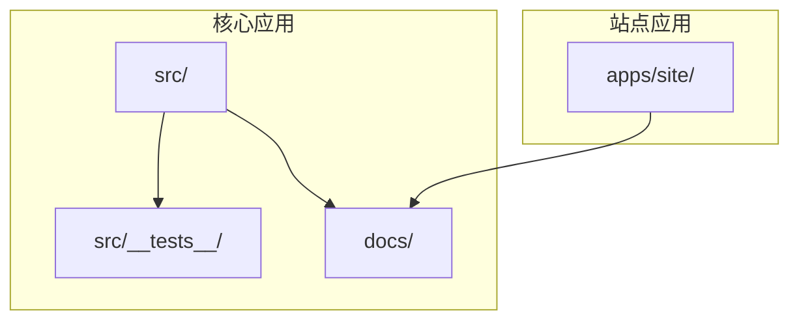
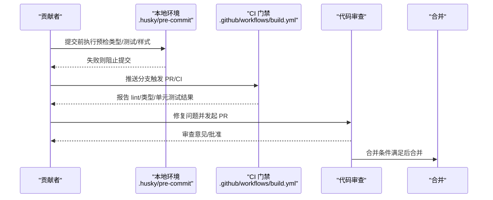
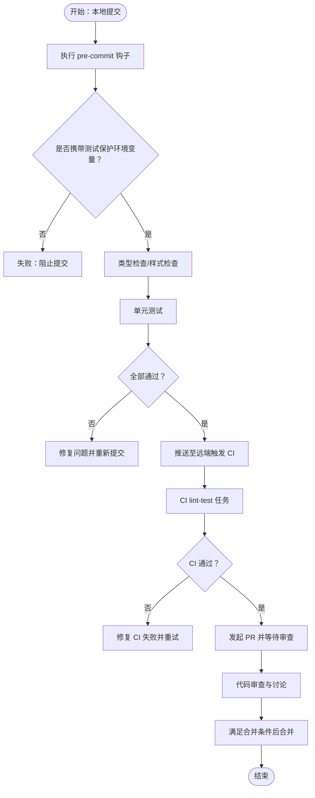
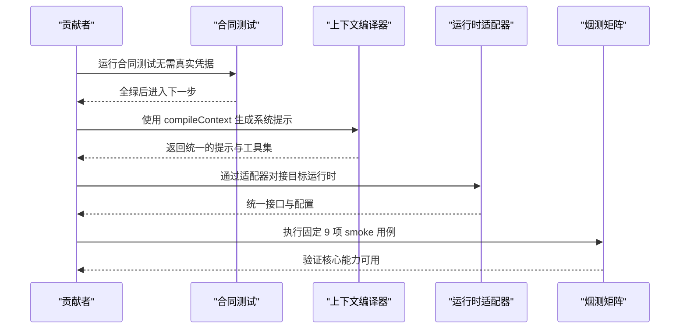
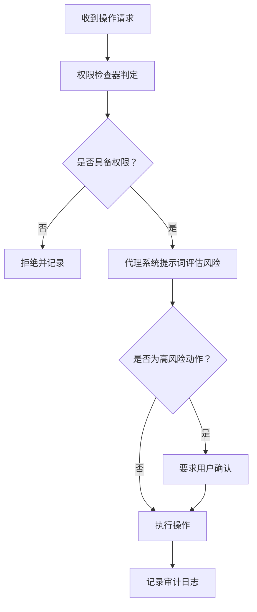
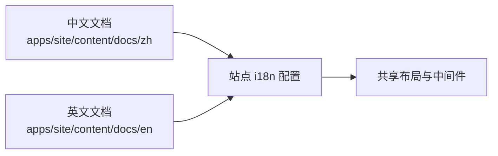
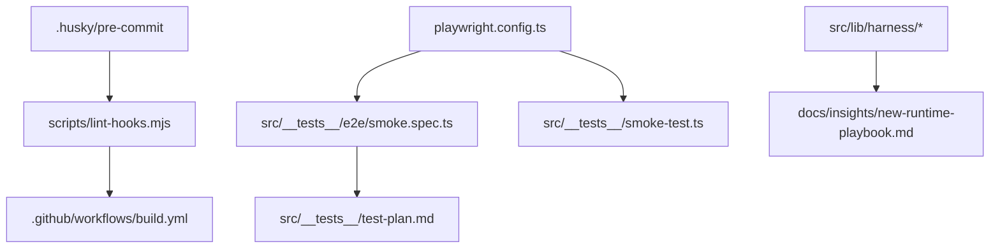

# 贡献指南

<cite>
**本文引用的文件**   
- [README.md](file://README.md)
- [README_CN.md](file://README_CN.md)
- [ARCHITECTURE.md](file://ARCHITECTURE.md)
- [docs/insights/new-runtime-playbook.md](file://docs/insights/new-runtime-playbook.md)
- [docs/exec-plans/completed/engineering-quality-assurance.md](file://docs/exec-plans/completed/engineering-quality-assurance.md)
- [docs/guardrails/Runtime.md](file://docs/guardrails/Runtime.md)
- [.github/workflows/build.yml](file://.github/workflows/build.yml)
- [.husky/pre-commit](file://.husky/pre-commit)
- [scripts/lint-hooks.mjs](file://scripts/lint-hooks.mjs)
- [playwright.config.ts](file://playwright.config.ts)
- [src/__tests__/smoke-test.ts](file://src/__tests__/smoke-test.ts)
- [src/__tests__/e2e/smoke.spec.ts](file://src/__tests__/e2e/smoke.spec.ts)
- [src/__tests__/test-plan.md](file://src/__tests__/test-plan.md)
- [src/__tests__/functional-test.ts](file://src/__tests__/functional-test.ts)
- [src/__tests__/unit/instrumentation-shape.test.ts](file://src/__tests__/unit/instrumentation-shape.test.ts)
- [src/components/skills/CreateSkillDialog.tsx](file://src/components/skills/CreateSkillDialog.tsx)
- [src/lib/agent-system-prompt.ts](file://src/lib/agent-system-prompt.ts)
- [src/lib/harness/capability-contract.ts](file://src/lib/harness/capability-contract.ts)
- [src/lib/harness/context-compiler.ts](file://src/lib/harness/context-compiler.ts)
- [src/lib/harness/runtime-adapter.ts](file://src/lib/harness/runtime-adapter.ts)
- [src/lib/harness/artifact-contract.ts](file://src/lib/harness/artifact-contract.ts)
- [src/lib/codex/app-server-client.ts](file://src/lib/codex/app-server-client.ts)
- [src/lib/provider-resolver.ts](file://src/lib/provider-resolver.ts)
- [src/lib/permission-checker.ts](file://src/lib/permission-checker.ts)
- [src/lib/agent-loop.ts](file://src/lib/agent-loop.ts)
- [src/lib/agent-task-runner.ts](file://src/lib/agent-task-runner.ts)
- [src/hooks/useTranslation.ts](file://src/hooks/useTranslation.ts)
- [apps/site/src/lib/i18n.ts](file://apps/site/src/lib/i18n.ts)
- [apps/site/content/docs/zh/](file://apps/site/content/docs/zh/)
- [apps/site/content/docs/en/](file://apps/site/content/docs/en/)
- [apps/site/src/lib/source.ts](file://apps/site/src/lib/source.ts)
- [apps/site/src/lib/layout.shared.tsx](file://apps/site/src/lib/layout.shared.tsx)
- [apps/site/src/middleware.ts](file://apps/site/src/middleware.ts)
- [apps/site/src/lib/site.config.ts](file://apps/site/src/lib/site.config.ts)
- [apps/site/package.json](file://apps/site/package.json)
- [package.json](file://package.json)
</cite>

## 目录
1. 引言
2. 项目结构
3. 核心组件
4. 架构总览
5. 详细组件分析
6. 依赖关系分析
7. 性能考量
8. 故障排查指南
9. 结论
10. 附录

## 引言
本贡献指南面向希望参与 CodePilot 开源项目的开发者，涵盖从入门到协作的全流程：如何提交 Issue 与 Pull Request、功能开发流程、代码审查与合并标准、文档与翻译贡献、社区参与规范，以及新贡献者的入门与成长路径。同时，文档阐述项目的设计理念、架构决策与执行计划，帮助贡献者理解“为何如此设计”和“如何正确演进”。

## 项目结构
CodePilot 采用多包/多应用混合结构：
- 核心应用与库位于根目录的 src/，包含前端页面、组件、Hooks、Libraries、测试与类型定义。
- 文档与执行计划位于 docs/，覆盖架构、洞察、交接、研究、未来规划等。
- 站点应用位于 apps/site/，采用 Next.js 与多语言内容管理。
- 质量保障与测试策略集中在 src/__tests__/ 与 Playwright 配置中。

图表来源
- [ARCHITECTURE.md](file://ARCHITECTURE.md)
- [apps/site/src/lib/site.config.ts](file://apps/site/src/lib/site.config.ts)

章节来源
- [ARCHITECTURE.md](file://ARCHITECTURE.md)
- [README.md](file://README.md)
- [README_CN.md](file://README_CN.md)

## 核心组件
- 质量与测试体系：包括本地 pre-commit 钩子、CI 门禁、单元/集成/端到端测试与烟测矩阵。
- 架构契约与运行时适配：Harness 能力契约、上下文编译器、运行时适配器与产物契约，确保多运行时一致性。
- 安全与权限：权限检查器、代理系统提示词与工具使用守则，降低风险操作。
- 文档与国际化：站点内容与多语言支持、i18n 配置与布局共享逻辑。
- 社区与贡献：Issue/PR 模板、审查标准、合并要求与导师制度。

章节来源
- [docs/exec-plans/completed/engineering-quality-assurance.md](file://docs/exec-plans/completed/engineering-quality-assurance.md)
- [src/lib/harness/capability-contract.ts](file://src/lib/harness/capability-contract.ts)
- [src/lib/harness/context-compiler.ts](file://src/lib/harness/context-compiler.ts)
- [src/lib/harness/runtime-adapter.ts](file://src/lib/harness/runtime-adapter.ts)
- [src/lib/harness/artifact-contract.ts](file://src/lib/harness/artifact-contract.ts)
- [src/lib/permission-checker.ts](file://src/lib/permission-checker.ts)
- [src/lib/agent-system-prompt.ts](file://src/lib/agent-system-prompt.ts)
- [apps/site/src/lib/i18n.ts](file://apps/site/src/lib/i18n.ts)
- [apps/site/src/lib/layout.shared.tsx](file://apps/site/src/lib/layout.shared.tsx)

## 架构总览
CodePilot 的贡献流程围绕“本地验证 → CI 门禁 → 合理的审查与合并”展开。本地通过 Husky 预提交钩子与 lint-staged 保证基础质量；CI 通过 GitHub Actions 执行 lint、类型检查与单元测试；端到端测试与烟测矩阵用于覆盖关键路径。

图表来源
- [.husky/pre-commit](file://.husky/pre-commit)
- [.github/workflows/build.yml](file://.github/workflows/build.yml)
- [scripts/lint-hooks.mjs](file://scripts/lint-hooks.mjs)

章节来源
- [docs/exec-plans/completed/engineering-quality-assurance.md](file://docs/exec-plans/completed/engineering-quality-assurance.md)
- [.husky/pre-commit](file://.husky/pre-commit)
- [.github/workflows/build.yml](file://.github/workflows/build.yml)

## 详细组件分析

### 质量与测试体系
- 本地验证：pre-commit 钩子要求测试命令携带特定环境变量保护，防止意外副作用；脚本会校验该保护是否生效。
- CI 门禁：构建工作流包含 lint、类型检查与单元测试，PR 需等待上游任务通过。
- 烟测与端到端：烟测脚本与 Playwright 端到端测试共同覆盖核心页面与交互；测试计划定义验收标准与文件结构。
- 合同测试：Harness 能力契约与上下文编译器契约确保不同运行时的一致行为；新运行时接入需先通过合同测试门禁。

图表来源
- [scripts/lint-hooks.mjs](file://scripts/lint-hooks.mjs)
- [.husky/pre-commit](file://.husky/pre-commit)
- [.github/workflows/build.yml](file://.github/workflows/build.yml)
- [src/__tests__/smoke-test.ts](file://src/__tests__/smoke-test.ts)
- [src/__tests__/e2e/smoke.spec.ts](file://src/__tests__/e2e/smoke.spec.ts)
- [src/__tests__/test-plan.md](file://src/__tests__/test-plan.md)

章节来源
- [docs/exec-plans/completed/engineering-quality-assurance.md](file://docs/exec-plans/completed/engineering-quality-assurance.md)
- [scripts/lint-hooks.mjs](file://scripts/lint-hooks.mjs)
- [.husky/pre-commit](file://.husky/pre-commit)
- [.github/workflows/build.yml](file://.github/workflows/build.yml)
- [playwright.config.ts](file://playwright.config.ts)
- [src/__tests__/smoke-test.ts](file://src/__tests__/smoke-test.ts)
- [src/__tests__/e2e/smoke.spec.ts](file://src/__tests__/e2e/smoke.spec.ts)
- [src/__tests__/test-plan.md](file://src/__tests__/test-plan.md)
- [src/__tests__/functional-test.ts](file://src/__tests__/functional-test.ts)

### 架构契约与运行时接入流程
- 合同测试门禁：新运行时接入必须先通过合同测试，确保工具集、上下文编译、产物渲染等契约一致。
- 固定烟测矩阵：统一 9 项 smoke 用例，避免“自由发挥”导致的能力遗漏。
- 运行时适配器：通过适配器统一对接不同运行时，屏蔽差异并提供一致的系统提示与工具集。

图表来源
- [docs/insights/new-runtime-playbook.md](file://docs/insights/new-runtime-playbook.md)
- [src/lib/harness/capability-contract.ts](file://src/lib/harness/capability-contract.ts)
- [src/lib/harness/context-compiler.ts](file://src/lib/harness/context-compiler.ts)
- [src/lib/harness/runtime-adapter.ts](file://src/lib/harness/runtime-adapter.ts)
- [src/lib/harness/artifact-contract.ts](file://src/lib/harness/artifact-contract.ts)

章节来源
- [docs/insights/new-runtime-playbook.md](file://docs/insights/new-runtime-playbook.md)
- [src/lib/harness/capability-contract.ts](file://src/lib/harness/capability-contract.ts)
- [src/lib/harness/context-compiler.ts](file://src/lib/harness/context-compiler.ts)
- [src/lib/harness/runtime-adapter.ts](file://src/lib/harness/runtime-adapter.ts)
- [src/lib/harness/artifact-contract.ts](file://src/lib/harness/artifact-contract.ts)

### 安全与权限
- 权限检查器：集中处理权限判定与注册，确保对敏感操作进行前置校验。
- 代理系统提示词：明确“高风险动作需确认”“优先使用专用工具”的原则，降低误操作风险。
- 工具使用守则：强调专用工具优先，避免直接使用 Bash 工具执行可能影响全局的操作。

图表来源
- [src/lib/permission-checker.ts](file://src/lib/permission-checker.ts)
- [src/lib/agent-system-prompt.ts](file://src/lib/agent-system-prompt.ts)

章节来源
- [src/lib/permission-checker.ts](file://src/lib/permission-checker.ts)
- [src/lib/agent-system-prompt.ts](file://src/lib/agent-system-prompt.ts)

### 文档与国际化
- 站点内容：apps/site/content/docs/zh 与 en 目录分别维护中英文文档，采用多语言内容管理与路由。
- 国际化：站点侧 i18n 配置与布局共享逻辑，确保界面与文案的统一。
- 文档贡献：遵循现有目录结构与命名约定，保持内容与主题一致。

图表来源
- [apps/site/content/docs/zh/](file://apps/site/content/docs/zh/)
- [apps/site/content/docs/en/](file://apps/site/content/docs/en/)
- [apps/site/src/lib/i18n.ts](file://apps/site/src/lib/i18n.ts)
- [apps/site/src/lib/layout.shared.tsx](file://apps/site/src/lib/layout.shared.tsx)
- [apps/site/src/middleware.ts](file://apps/site/src/middleware.ts)

章节来源
- [apps/site/content/docs/zh/](file://apps/site/content/docs/zh/)
- [apps/site/content/docs/en/](file://apps/site/content/docs/en/)
- [apps/site/src/lib/i18n.ts](file://apps/site/src/lib/i18n.ts)
- [apps/site/src/lib/layout.shared.tsx](file://apps/site/src/lib/layout.shared.tsx)
- [apps/site/src/middleware.ts](file://apps/site/src/middleware.ts)

### 社区与贡献实践
- 新贡献者入门：阅读 README 与 ARCHITECTURE，熟悉项目背景与总体架构；从最小可运行改动入手，逐步深入。
- 导师制度：建议通过 Issue/PR 与维护者沟通，寻求指导与反馈。
- 技能发展：结合测试计划与执行计划，逐步掌握测试、文档、架构契约与运行时适配等关键能力。

章节来源
- [README.md](file://README.md)
- [ARCHITECTURE.md](file://ARCHITECTURE.md)
- [docs/exec-plans/completed/engineering-quality-assurance.md](file://docs/exec-plans/completed/engineering-quality-assurance.md)

## 依赖关系分析
- 质量链路：.husky/pre-commit → scripts/lint-hooks.mjs → .github/workflows/build.yml。
- 测试链路：playwright.config.ts → src/__tests__/e2e/smoke.spec.ts 与 src/__tests__/smoke-test.ts → src/__tests__/test-plan.md。
- 架构契约：src/lib/harness/*.ts 与 docs/insights/new-runtime-playbook.md。

图表来源
- [.husky/pre-commit](file://.husky/pre-commit)
- [scripts/lint-hooks.mjs](file://scripts/lint-hooks.mjs)
- [.github/workflows/build.yml](file://.github/workflows/build.yml)
- [playwright.config.ts](file://playwright.config.ts)
- [src/__tests__/e2e/smoke.spec.ts](file://src/__tests__/e2e/smoke.spec.ts)
- [src/__tests__/smoke-test.ts](file://src/__tests__/smoke-test.ts)
- [src/__tests__/test-plan.md](file://src/__tests__/test-plan.md)
- [src/lib/harness/capability-contract.ts](file://src/lib/harness/capability-contract.ts)
- [src/lib/harness/context-compiler.ts](file://src/lib/harness/context-compiler.ts)
- [src/lib/harness/runtime-adapter.ts](file://src/lib/harness/runtime-adapter.ts)
- [src/lib/harness/artifact-contract.ts](file://src/lib/harness/artifact-contract.ts)
- [docs/insights/new-runtime-playbook.md](file://docs/insights/new-runtime-playbook.md)

章节来源
- [.husky/pre-commit](file://.husky/pre-commit)
- [scripts/lint-hooks.mjs](file://scripts/lint-hooks.mjs)
- [.github/workflows/build.yml](file://.github/workflows/build.yml)
- [playwright.config.ts](file://playwright.config.ts)
- [src/__tests__/e2e/smoke.spec.ts](file://src/__tests__/e2e/smoke.spec.ts)
- [src/__tests__/smoke-test.ts](file://src/__tests__/smoke-test.ts)
- [src/__tests__/test-plan.md](file://src/__tests__/test-plan.md)
- [src/lib/harness/capability-contract.ts](file://src/lib/harness/capability-contract.ts)
- [src/lib/harness/context-compiler.ts](file://src/lib/harness/context-compiler.ts)
- [src/lib/harness/runtime-adapter.ts](file://src/lib/harness/runtime-adapter.ts)
- [src/lib/harness/artifact-contract.ts](file://src/lib/harness/artifact-contract.ts)
- [docs/insights/new-runtime-playbook.md](file://docs/insights/new-runtime-playbook.md)

## 性能考量
- 端到端测试性能：Playwright 配置支持并行与重试策略，CI 中限制 worker 数量以平衡稳定性与速度。
- 烟测与验收：测试计划定义了页面加载、交互响应与截图差异阈值等性能指标，作为验收门槛。
- 本地开发体验：通过环境变量与端口配置支持多工作树并行开发，减少冲突。

章节来源
- [playwright.config.ts](file://playwright.config.ts)
- [src/__tests__/test-plan.md](file://src/__tests__/test-plan.md)

## 故障排查指南
- 预提交失败：检查 .husky/pre-commit 是否包含必要的测试保护环境变量，参考 scripts/lint-hooks.mjs 的校验逻辑。
- CI 失败：查看 .github/workflows/build.yml 的 lint-test 任务输出，定位类型/测试/样式问题。
- 烟测异常：使用 src/__tests__/e2e/smoke.spec.ts 或 src/__tests__/smoke-test.ts 进行复现与调试。
- 合同测试门禁：确保新运行时接入前通过 Harness 能力契约与上下文编译器契约测试。
- 权限相关问题：核对 src/lib/permission-checker.ts 的判定逻辑与代理系统提示词的评估流程。

章节来源
- [scripts/lint-hooks.mjs](file://scripts/lint-hooks.mjs)
- [.husky/pre-commit](file://.husky/pre-commit)
- [.github/workflows/build.yml](file://.github/workflows/build.yml)
- [src/__tests__/e2e/smoke.spec.ts](file://src/__tests__/e2e/smoke.spec.ts)
- [src/__tests__/smoke-test.ts](file://src/__tests__/smoke-test.ts)
- [src/lib/harness/capability-contract.ts](file://src/lib/harness/capability-contract.ts)
- [src/lib/harness/context-compiler.ts](file://src/lib/harness/context-compiler.ts)
- [src/lib/permission-checker.ts](file://src/lib/permission-checker.ts)

## 结论
CodePilot 的贡献流程以“质量优先、契约驱动、安全可控”为核心原则。通过本地预检、CI 门禁、合同测试与烟测矩阵，确保每次改动在可控范围内演进。新贡献者应从最小改动入手，遵循测试与文档规范，并在必要时寻求导师指导。随着执行计划与洞察文档的推进，项目将持续完善工程质量与运行时一致性，欢迎更多伙伴加入。

## 附录

### Issue 与 Pull Request 提交流程
- Issue
  - 在提交前搜索已有 Issue，避免重复。
  - 使用清晰标题与完整描述，附上复现步骤、期望行为与实际行为。
  - 标注合适的标签（如 bug、enhancement、docs 等）。
- Pull Request
  - 从功能分支发起 PR，描述变更动机、影响范围与测试策略。
  - 确保通过本地与 CI 验证，遵循代码风格与审查意见。
  - 合并前清理不必要的提交历史，保持提交信息清晰。

章节来源
- [docs/exec-plans/completed/engineering-quality-assurance.md](file://docs/exec-plans/completed/engineering-quality-assurance.md)

### 代码审查标准与合并要求
- 审查标准
  - 功能正确性与边界处理。
  - 性能与可维护性，避免引入复杂度。
  - 安全性与权限控制，遵循代理系统提示词与权限检查器。
  - 文档与测试：新增功能需配套文档与测试。
- 合并要求
  - 至少一名维护者批准。
  - CI 通过且无未解决的审查意见。
  - 合同测试与烟测矩阵通过（涉及运行时或核心路径变更时）。

章节来源
- [src/lib/agent-system-prompt.ts](file://src/lib/agent-system-prompt.ts)
- [src/lib/permission-checker.ts](file://src/lib/permission-checker.ts)
- [docs/insights/new-runtime-playbook.md](file://docs/insights/new-runtime-playbook.md)

### 文档贡献方式与翻译规范
- 文档结构：遵循 apps/site/content/docs/zh 与 en 的目录组织，保持主题一致。
- 翻译规范：优先基于现有英文内容翻译，保持术语一致；必要时与维护者沟通确认。
- 更新流程：在 PR 中说明文档变更范围与影响，确保与代码同步更新。

章节来源
- [apps/site/content/docs/zh/](file://apps/site/content/docs/zh/)
- [apps/site/content/docs/en/](file://apps/site/content/docs/en/)
- [apps/site/src/lib/i18n.ts](file://apps/site/src/lib/i18n.ts)

### 新贡献者入门与导师制度
- 入门步骤
  - 阅读 README 与 ARCHITECTURE，理解项目背景与总体架构。
  - 从最小改动（如修复拼写、补充测试、完善文档）开始。
  - 熟悉测试计划与执行计划，逐步掌握质量保障与运行时接入流程。
- 导师制度
  - 通过 Issue/PR 与维护者沟通，寻求指导与反馈。
  - 参与代码审查，学习最佳实践与设计思路。

章节来源
- [README.md](file://README.md)
- [ARCHITECTURE.md](file://ARCHITECTURE.md)
- [docs/exec-plans/completed/engineering-quality-assurance.md](file://docs/exec-plans/completed/engineering-quality-assurance.md)

### 功能开发流程与示例
- 示例：技能创建对话框
  - 行为：提供模板选择、名称校验、作用域选择与创建流程。
  - 交互：使用翻译钩子与 UI 组件，确保本地化与一致性。
  - 测试：可通过单元测试覆盖输入校验与异步创建流程。

章节来源
- [src/components/skills/CreateSkillDialog.tsx](file://src/components/skills/CreateSkillDialog.tsx)
- [src/hooks/useTranslation.ts](file://src/hooks/useTranslation.ts)

### 问题报告模板与功能请求格式
- 问题报告模板（建议）
  - 标题：简洁描述问题
  - 环境：操作系统、浏览器/平台版本、CodePilot 版本
  - 复现步骤：最小可复现步骤
  - 期望行为：预期结果
  - 实际行为：实际结果
  - 日志/截图：附带相关日志或截图
- 功能请求格式（建议）
  - 背景与动机：为什么需要该功能
  - 用户场景：典型使用场景
  - 建议方案：简述实现思路
  - 影响范围：对现有功能的影响
  - 附件/草图：相关设计或截图

章节来源
- [src/lib/agent-system-prompt.ts](file://src/lib/agent-system-prompt.ts)

### 讨论参与指南
- 积极反馈：对审查意见给出明确回复与修改说明。
- 尊重与包容：遵守社区行为准则，保持建设性讨论。
- 透明沟通：在 Issue/PR 中公开讨论进展与决策依据。

章节来源
- [docs/guardrails/Runtime.md](file://docs/guardrails/Runtime.md)