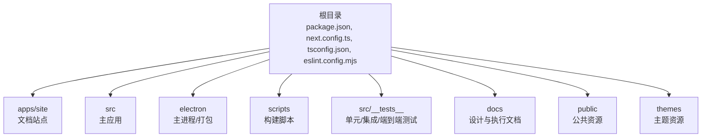
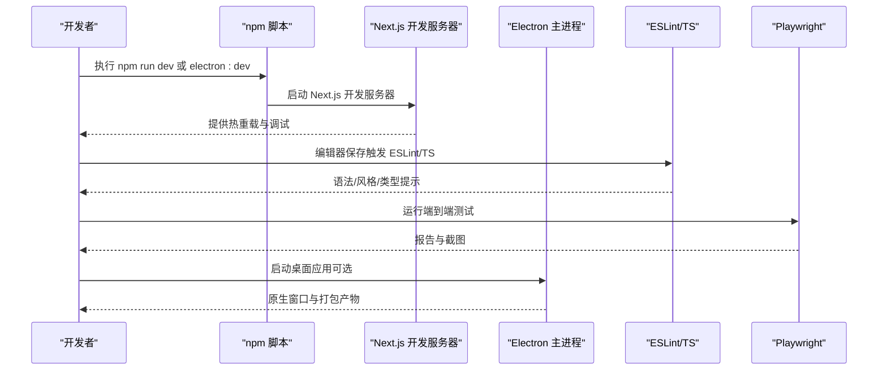
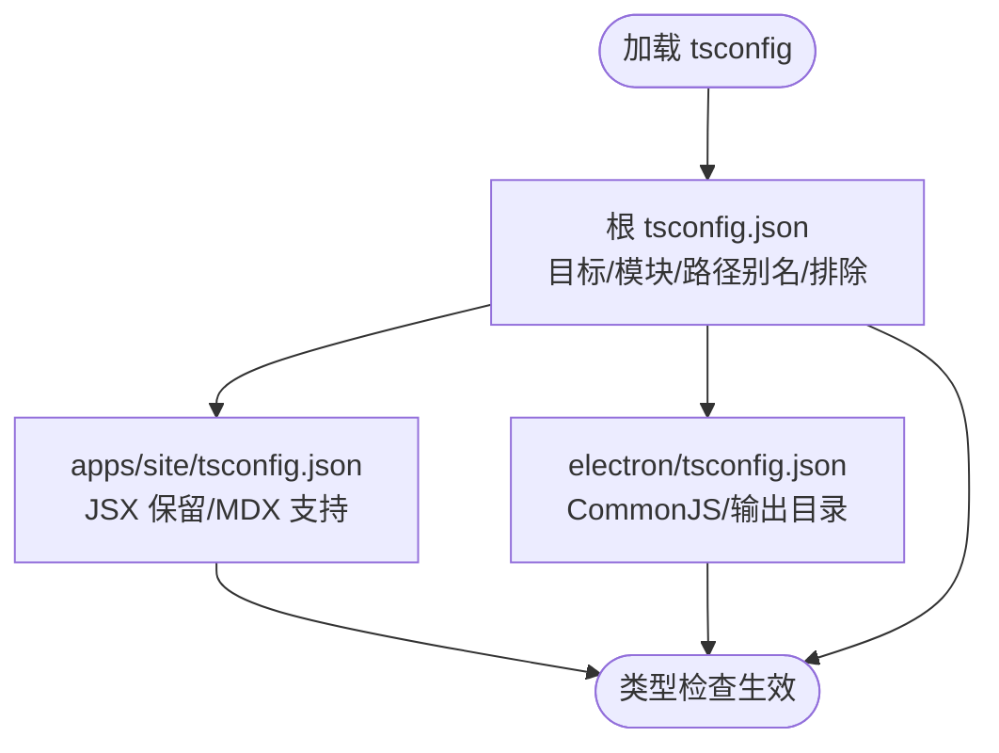
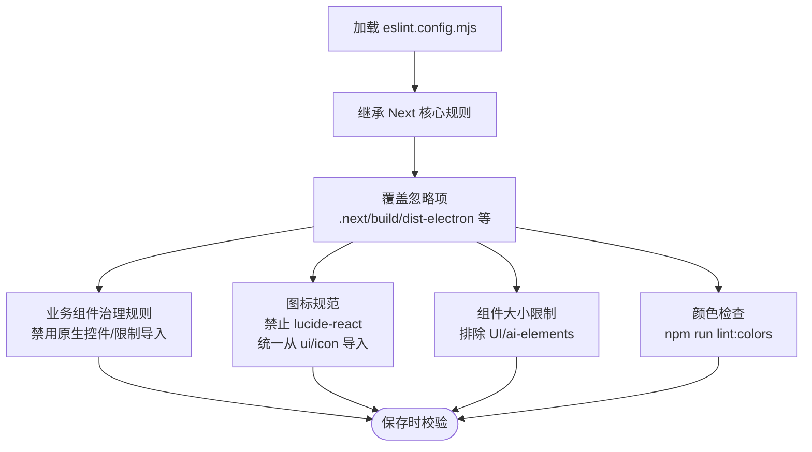
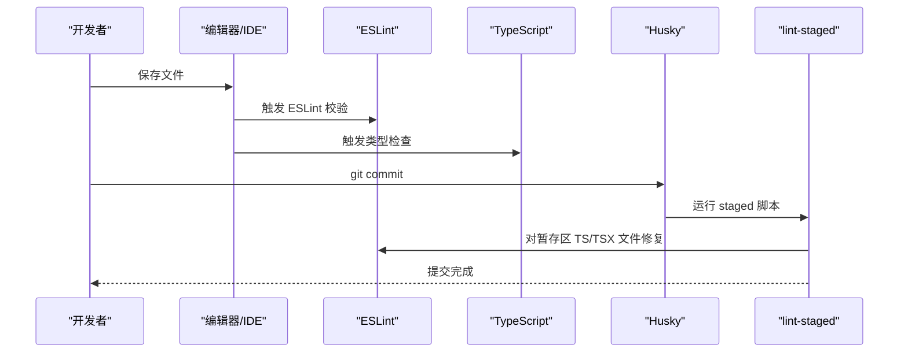
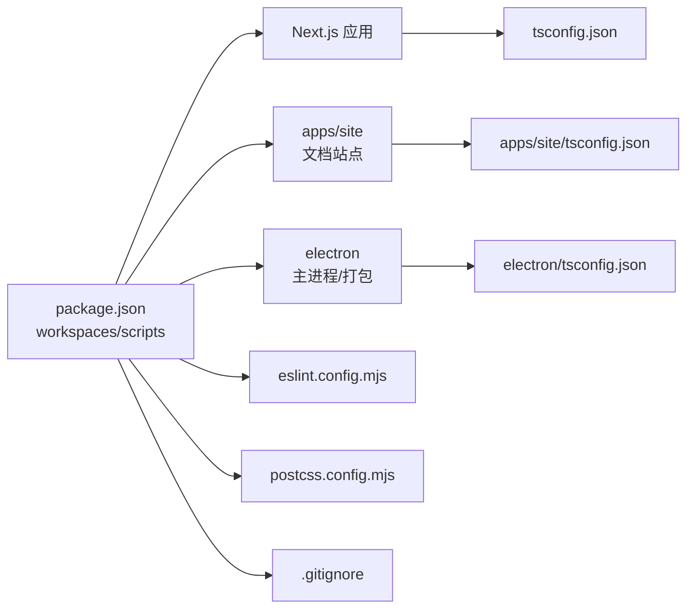

# 开发环境搭建

<cite>
**本文档引用的文件**
- [package.json](file://package.json)
- [README.md](file://README.md)
- [next.config.ts](file://next.config.ts)
- [apps/site/next.config.mjs](file://apps/site/next.config.mjs)
- [tsconfig.json](file://tsconfig.json)
- [apps/site/tsconfig.json](file://apps/site/tsconfig.json)
- [electron/tsconfig.json](file://electron/tsconfig.json)
- [eslint.config.mjs](file://eslint.config.mjs)
- [postcss.config.mjs](file://postcss.config.mjs)
- [apps/site/postcss.config.mjs](file://apps/site/postcss.config.mjs)
- [components.json](file://components.json)
- [.gitignore](file://.gitignore)
- [playwright.config.ts](file://playwright.config.ts)
</cite>

## 目录
1. [简介](#简介)
2. [项目结构](#项目结构)
3. [核心组件](#核心组件)
4. [架构总览](#架构总览)
5. [详细组件分析](#详细组件分析)
6. [依赖关系分析](#依赖关系分析)
7. [性能考虑](#性能考虑)
8. [故障排除指南](#故障排除指南)
9. [结论](#结论)
10. [附录](#附录)

## 简介
本指南面向开发者，帮助你在本地快速搭建 CodePilot 的开发环境。你将学到：
- 系统要求与前置条件（Node.js 18+、npm 9+）
- 依赖安装与工作区管理
- 关键配置文件的作用与解读（tsconfig.json、eslint.config.mjs、next.config.ts 等）
- 开发服务器启动、热重载与调试
- 代码格式化、Lint、Pre-commit Hooks 配置与使用
- 常见环境问题排查与解决方案

## 项目结构
CodePilot 采用多包工作区（monorepo）结构，主要包含：
- 根目录：应用与工具配置、脚本、测试配置
- apps/site：文档站点（Next.js + MDX）
- src：主应用（Next.js 应用）
- electron：Electron 主进程与打包配置
- scripts：构建与打包脚本
- 资料：第三方示例插件包

**图表来源**
- [package.json:1-148](file://package.json#L1-L148)
- [next.config.ts:1-59](file://next.config.ts#L1-L59)
- [tsconfig.json:1-45](file://tsconfig.json#L1-L45)

**章节来源**
- [package.json:6-9](file://package.json#L6-L9)
- [README.md:82-96](file://README.md#L82-L96)

## 核心组件
- 包管理与工作区：通过 workspaces 管理多个包，统一安装与脚本执行
- 构建与运行：Next.js 作为主框架；Electron 用于桌面应用；apps/site 使用独立 Next 配置
- 类型检查：TypeScript 配置在根与各子应用中分别定义
- Lint 与格式化：ESLint 配置集中于根目录，PostCSS/Tailwind 通过配置文件启用
- 测试：Playwright 端到端测试，配合 TSX 单元测试

**章节来源**
- [package.json:6-36](file://package.json#L6-L36)
- [next.config.ts:1-59](file://next.config.ts#L1-L59)
- [apps/site/next.config.mjs:1-16](file://apps/site/next.config.mjs#L1-L16)
- [tsconfig.json:1-45](file://tsconfig.json#L1-L45)
- [apps/site/tsconfig.json:1-46](file://apps/site/tsconfig.json#L1-L46)
- [eslint.config.mjs:1-152](file://eslint.config.mjs#L1-L152)
- [postcss.config.mjs:1-8](file://postcss.config.mjs#L1-L8)
- [apps/site/postcss.config.mjs:1-8](file://apps/site/postcss.config.mjs#L1-L8)
- [playwright.config.ts:1-25](file://playwright.config.ts#L1-L25)

## 架构总览
开发时的核心流程：
- 启动 Next.js 开发服务器（浏览器模式或 Electron 模式）
- 代码变更触发热重载（Turbopack/Next Dev）
- ESLint 与 TypeScript 在编辑器与提交前进行质量把关
- Playwright 在本地或 CI 中运行端到端测试

**图表来源**
- [package.json:17-36](file://package.json#L17-L36)
- [playwright.config.ts:19-23](file://playwright.config.ts#L19-L23)
- [eslint.config.mjs:1-152](file://eslint.config.mjs#L1-L152)

## 详细组件分析

### 系统要求与前置条件
- Node.js：18+
- npm：9+（随 Node 18 推荐）
- 可选：Claude Code CLI（提升文件编辑、终端命令、git 操作能力）

**章节来源**
- [README.md:84-87](file://README.md#L84-L87)
- [README.md:80](file://README.md#L80)

### 依赖安装与工作区
- 使用 npm 安装根依赖，自动处理 workspaces 下的子包
- 建议使用 Node 18+ 以获得最佳兼容性与性能

**章节来源**
- [README.md:89-96](file://README.md#L89-L96)
- [package.json:6-9](file://package.json#L6-L9)

### 环境变量与运行时配置
- 版本号注入：NEXT_PUBLIC_APP_VERSION 来源于 package.json 版本
- Sentry DSN：用于前端错误上报（仅公共变量）
- 输出追踪排除：减少构建产物体积，避免非必要文件进入 NFT 清单

**章节来源**
- [next.config.ts:15-18](file://next.config.ts#L15-L18)
- [next.config.ts:28-55](file://next.config.ts#L28-L55)

### TypeScript 配置
- 根 tsconfig.json
  - 目标与模块解析：ES2017 + bundler
  - 路径别名：@/*
  - 排除范围：electron、apps、packages 等
- apps/site/tsconfig.json
  - JSX 保留（preserve），便于 MDX 处理
  - 路径别名：@/*、@/.source
- electron/tsconfig.json
  - CommonJS 目标，输出到 dist-electron

**图表来源**
- [tsconfig.json:1-45](file://tsconfig.json#L1-L45)
- [apps/site/tsconfig.json:1-46](file://apps/site/tsconfig.json#L1-L46)
- [electron/tsconfig.json:1-12](file://electron/tsconfig.json#L1-L12)

**章节来源**
- [tsconfig.json:1-45](file://tsconfig.json#L1-L45)
- [apps/site/tsconfig.json:1-46](file://apps/site/tsconfig.json#L1-L46)
- [electron/tsconfig.json:1-12](file://electron/tsconfig.json#L1-L12)

### ESLint 配置与规则
- 基于 eslint-config-next 的 Core Web Vitals 与 TypeScript 规则
- 自定义治理规则：
  - 业务组件禁止直接使用原生 HTML 控件，需使用统一 UI 组件库
  - 禁止直接引入 lucide-react
  - 限制业务组件中对 hooks/lib 的导入（模式层组件必须纯展示）
  - 组件文件大小上限（排除 UI/ai-elements）
- 颜色使用：提供 npm run lint:colors 用于检测原始状态色

**图表来源**
- [eslint.config.mjs:1-152](file://eslint.config.mjs#L1-L152)

**章节来源**
- [eslint.config.mjs:1-152](file://eslint.config.mjs#L1-L152)

### PostCSS 与 Tailwind 配置
- 根 postcss.config.mjs：启用 @tailwindcss/postcss 插件
- apps/site/postcss.config.mjs：同理，确保文档站点样式一致
- components.json：定义 UI 命名空间与别名，便于使用 shadcn/ui

**章节来源**
- [postcss.config.mjs:1-8](file://postcss.config.mjs#L1-L8)
- [apps/site/postcss.config.mjs:1-8](file://apps/site/postcss.config.mjs#L1-L8)
- [components.json:1-24](file://components.json#L1-L24)

### Next.js 配置
- 根 next.config.ts
  - standalone 输出，适合 Electron 打包
  - serverExternalPackages：排除原生模块与动态 require 的包
  - outputFileTracingExcludes：排除大量非代码文件，减少 NFT 体积
- apps/site/next.config.mjs
  - 启用 MDX 支持（createMDX）
  - outputFileTracingRoot 指向仓库根，便于静态导出与内容扫描

**章节来源**
- [next.config.ts:1-59](file://next.config.ts#L1-L59)
- [apps/site/next.config.mjs:1-16](file://apps/site/next.config.mjs#L1-L16)

### 开发服务器启动与热重载
- 浏览器模式：npm run dev（Next.js 开发服务器，端口 3000）
- Electron 模式：npm run electron:dev（同时启动 Next.js 与 Electron）
- 热重载：Turbopack/Next Dev 自动刷新页面与组件

**章节来源**
- [README.md:218-221](file://README.md#L218-L221)
- [package.json:18-31](file://package.json#L18-L31)
- [playwright.config.ts:19-23](file://playwright.config.ts#L19-L23)

### 调试环境设置
- 浏览器调试：打开 http://localhost:3000，使用浏览器开发者工具
- Electron 调试：npm run electron:dev 启动原生窗口，可在 Electron DevTools 中调试
- Sentry：已配置公共 DSN，便于捕获前端异常

**章节来源**
- [next.config.ts:17-18](file://next.config.ts#L17-L18)
- [README.md:218-221](file://README.md#L218-L221)

### 代码格式化、Lint 与 Pre-commit Hooks
- ESLint：npm run lint 或在编辑器中集成
- TypeScript：npm run typecheck
- 颜色检查：npm run lint:colors（检测原始状态色）
- Pre-commit：husky + lint-staged，提交前自动修复 TS/TSX 文件

**图表来源**
- [package.json:21-22](file://package.json#L21-L22)
- [package.json:29](file://package.json#L29)
- [package.json:38-42](file://package.json#L38-L42)
- [eslint.config.mjs:1-152](file://eslint.config.mjs#L1-L152)

**章节来源**
- [package.json:21-42](file://package.json#L21-L42)
- [eslint.config.mjs:1-152](file://eslint.config.mjs#L1-L152)

### 测试与可视化回归
- 单元测试：tsx --test（根脚本）
- 端到端测试：Playwright，本地通过 npm run test:e2e 或 test:visual
- 测试基座：webServer 指向 http://localhost:3000，复用 dev 服务

**章节来源**
- [package.json:23-28](file://package.json#L23-L28)
- [playwright.config.ts:1-25](file://playwright.config.ts#L1-L25)

## 依赖关系分析
- 根 package.json 定义工作区与脚本，依赖 Next.js 16、React 19、Electron 等
- apps/site 使用独立的 next.config.mjs 与 tsconfig.json，支持 MDX 文档
- electron 子包有独立 tsconfig.json，输出到 dist-electron
- .gitignore 排除 node_modules、.next、dist-electron、data、release 等

**图表来源**
- [package.json:6-148](file://package.json#L6-L148)
- [tsconfig.json:1-45](file://tsconfig.json#L1-L45)
- [apps/site/tsconfig.json:1-46](file://apps/site/tsconfig.json#L1-L46)
- [electron/tsconfig.json:1-12](file://electron/tsconfig.json#L1-L12)
- [eslint.config.mjs:1-152](file://eslint.config.mjs#L1-L152)
- [postcss.config.mjs:1-8](file://postcss.config.mjs#L1-L8)
- [.gitignore:1-70](file://.gitignore#L1-L70)

**章节来源**
- [package.json:6-148](file://package.json#L6-L148)
- [.gitignore:1-70](file://.gitignore#L1-L70)

## 性能考虑
- 使用 Next.js standalone 输出，结合 serverExternalPackages 排除原生模块，减少打包体积
- outputFileTracingExcludes 排除 docs、apps、scripts 等非代码目录，避免不必要的文件被追踪进 NFT
- Electron 模式下，主进程与渲染进程分离，利用独立 tsconfig 与输出目录

**章节来源**
- [next.config.ts:4-55](file://next.config.ts#L4-L55)
- [electron/tsconfig.json:1-12](file://electron/tsconfig.json#L1-L12)

## 故障排除指南
- 端口占用
  - 现象：无法启动 dev 或 electron:dev
  - 处理：关闭占用 3000/随机端口的进程，或调整端口后重启
- 原生模块打包失败
  - 现象：构建时报错，提及原生模块不可捆绑
  - 处理：确认 next.config.ts 的 serverExternalPackages 已包含对应包
- Sentry DSN 未生效
  - 现象：前端无错误上报
  - 处理：确认 NEXT_PUBLIC_SENTRY_DSN 已正确注入
- MDX 内容不更新
  - 现象：apps/site 文档内容修改后未反映
  - 处理：清理 apps/site/.next 与 .source 缓存后重新构建
- 颜色规范违规
  - 现象：ESLint 报告使用了原始状态色
  - 处理：使用统一 UI 组件或添加注释豁免（谨慎使用）
- 提交被拒绝
  - 现象：husky/lint-staged 修复失败
  - 处理：查看控制台输出，修复 ESLint 错误后再提交

**章节来源**
- [next.config.ts:14-18](file://next.config.ts#L14-L18)
- [apps/site/next.config.mjs:10](file://apps/site/next.config.mjs#L10)
- [eslint.config.mjs:110-125](file://eslint.config.mjs#L110-L125)
- [package.json:30](file://package.json#L30)
- [package.json:38-42](file://package.json#L38-L42)

## 结论
通过本指南，你可以基于 Node.js 18+ 与 npm 9+ 快速搭建 CodePilot 开发环境。理解并合理配置 tsconfig、eslint、next.config 与 PostCSS/Tailwind，将显著提升开发效率与代码质量。借助 ESLint、TypeScript、lint-staged 与 Playwright，你可以在提交前及时发现并修复问题，确保跨平台（浏览器/Electron）的一致体验。

## 附录
- 常用命令
  - npm run dev：浏览器模式开发
  - npm run electron:dev：Electron 桌面应用开发
  - npm run build：生产构建
  - npm run electron:build / electron:pack：打包 Electron
  - npm run lint / typecheck：代码质量检查
  - npm run test / test:e2e / test:visual：测试套件
- 目录与文件
  - 根配置：package.json、next.config.ts、tsconfig.json、eslint.config.mjs、postcss.config.mjs、components.json
  - 文档站点：apps/site/next.config.mjs、apps/site/tsconfig.json、apps/site/postcss.config.mjs、apps/site/source.config.ts
  - Electron：electron/tsconfig.json、scripts/build-electron.mjs
  - 测试：playwright.config.ts、src/__tests__/*

**章节来源**
- [package.json:17-36](file://package.json#L17-L36)
- [playwright.config.ts:1-25](file://playwright.config.ts#L1-L25)
- [apps/site/next.config.mjs:1-16](file://apps/site/next.config.mjs#L1-L16)
- [apps/site/tsconfig.json:1-46](file://apps/site/tsconfig.json#L1-L46)
- [apps/site/postcss.config.mjs:1-8](file://apps/site/postcss.config.mjs#L1-L8)
- [apps/site/source.config.ts:1-12](file://apps/site/source.config.ts#L1-L12)
- [electron/tsconfig.json:1-12](file://electron/tsconfig.json#L1-L12)
- [components.json:1-24](file://components.json#L1-L24)