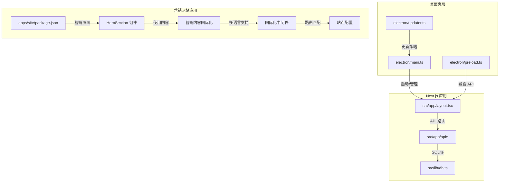
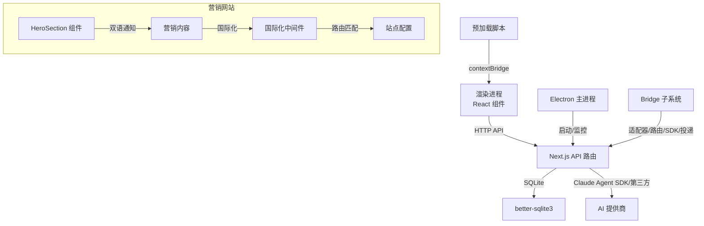
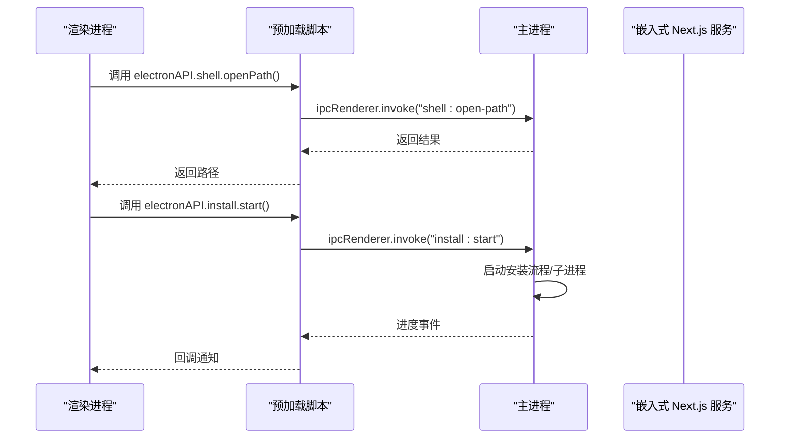
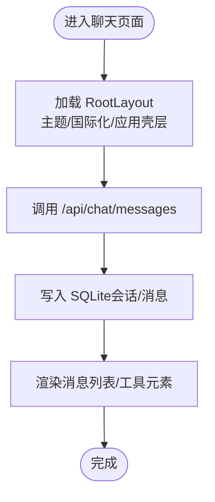
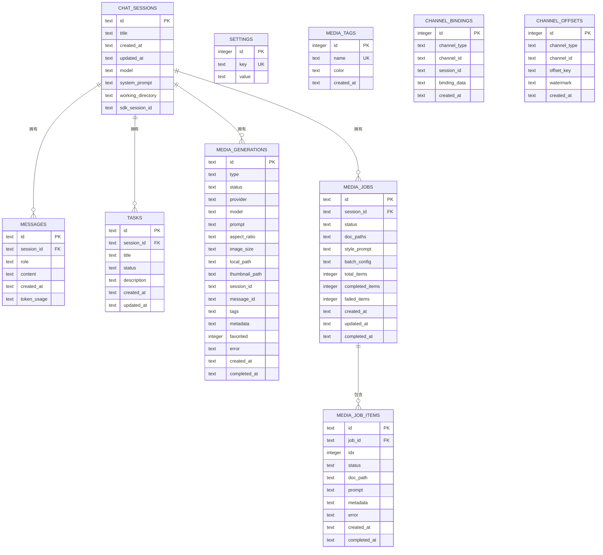
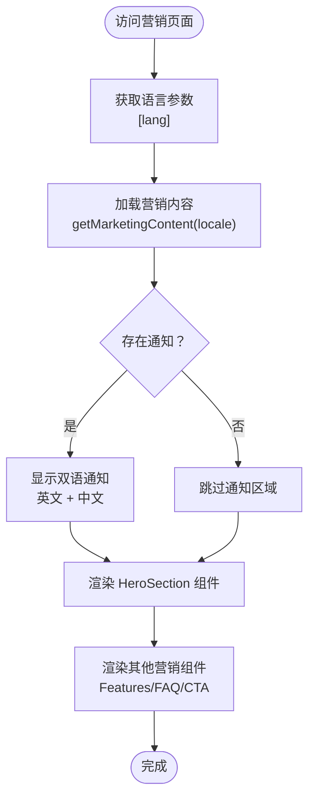
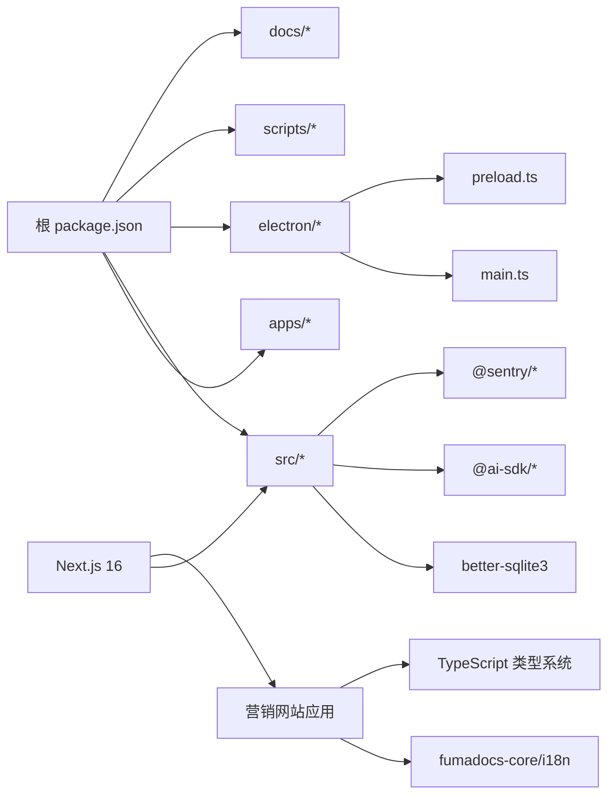

# 开发者指南

<cite>
**本文引用的文件**
- [package.json](file://package.json)
- [ARCHITECTURE.md](file://ARCHITECTURE.md)
- [README.md](file://README.md)
- [electron/main.ts](file://electron/main.ts)
- [electron/preload.ts](file://electron/preload.ts)
- [electron/updater.ts](file://electron/updater.ts)
- [scripts/build-electron.mjs](file://scripts/build-electron.mjs)
- [next.config.ts](file://next.config.ts)
- [tsconfig.json](file://tsconfig.json)
- [eslint.config.mjs](file://eslint.config.mjs)
- [playwright.config.ts](file://playwright.config.ts)
- [src/lib/db.ts](file://src/lib/db.ts)
- [src/app/api/chat/messages/route.ts](file://src/app/api/chat/messages/route.ts)
- [src/app/layout.tsx](file://src/app/layout.tsx)
- [apps/site/package.json](file://apps/site/package.json)
- [apps/site/src/components/marketing/HeroSection.tsx](file://apps/site/src/components/marketing/HeroSection.tsx)
- [apps/site/content/marketing/en.ts](file://apps/site/content/marketing/en.ts)
- [apps/site/content/marketing/zh.ts](file://apps/site/content/marketing/zh.ts)
- [apps/site/content/marketing/index.ts](file://apps/site/content/marketing/index.ts)
- [apps/site/src/app/[lang]/(marketing)/page.tsx](file://apps/site/src/app/[lang]/(marketing)/page.tsx)
- [apps/site/src/lib/i18n.ts](file://apps/site/src/lib/i18n.ts)
- [apps/site/src/middleware.ts](file://apps/site/src/middleware.ts)
- [apps/site/src/lib/site.config.ts](file://apps/site/src/lib/site.config.ts)
</cite>

## 目录
1. [简介](#简介)
2. [项目结构](#项目结构)
3. [核心组件](#核心组件)
4. [架构总览](#架构总览)
5. [详细组件分析](#详细组件分析)
6. [依赖分析](#依赖分析)
7. [性能考虑](#性能考虑)
8. [故障排除指南](#故障排除指南)
9. [结论](#结论)
10. [附录](#附录)

## 简介
本指南面向希望参与 CodePilot 开发的工程师，覆盖项目架构、技术栈、开发环境搭建、代码结构、模块依赖、构建流程、测试策略、Electron 主进程与渲染进程交互、Next.js 应用路由与 React 组件架构、编码与提交规范、CI/CD 流程，以及调试技巧、性能分析与故障排除方法。目标是帮助你快速理解并高效贡献。

## 项目结构
- 顶层使用 npm workspaces 管理多应用与包，核心应用位于 apps/* 与 src/*，桌面壳层位于 electron/*，脚本与打包配置位于根目录。
- 核心应用采用 Next.js App Router（版本 16），前后端一体化，API 路由集中于 src/app/api 下；桌面壳层基于 Electron 40，通过 UtilityProcess 运行嵌入式 Next.js 服务。
- 数据持久化使用 better-sqlite3（WAL 模式），数据库文件位于用户目录 ~/.codepilot/codepilot.db。
- 文档与设计决策集中在 docs/ 与 ARCHITECTURE.md，便于追溯与复用。
- **新增** 营销网站应用（apps/site）采用独立的 Next.js 应用，包含完整的国际化营销页面与组件系统。

**图表来源**
- [electron/main.ts:1-800](file://electron/main.ts#L1-L800)
- [electron/preload.ts:1-94](file://electron/preload.ts#L1-L94)
- [src/app/layout.tsx:1-75](file://src/app/layout.tsx#L1-L75)
- [src/app/api/chat/messages/route.ts:1-99](file://src/app/api/chat/messages/route.ts#L1-L99)
- [src/lib/db.ts:1-200](file://src/lib/db.ts#L1-L200)
- [apps/site/package.json:1-40](file://apps/site/package.json#L1-L40)
- [apps/site/src/components/marketing/HeroSection.tsx:1-100](file://apps/site/src/components/marketing/HeroSection.tsx#L1-L100)
- [apps/site/src/lib/i18n.ts:1-9](file://apps/site/src/lib/i18n.ts#L1-L9)

**章节来源**
- [package.json:1-148](file://package.json#L1-L148)
- [ARCHITECTURE.md:1-183](file://ARCHITECTURE.md#L1-L183)
- [README.md:1-287](file://README.md#L1-L287)

## 核心组件
- Electron 主进程：负责应用生命周期、窗口管理、系统托盘、通知、嵌入式 Next.js 服务启动与健康检查、代理与环境注入、安装向导与终端管理等。
- 预加载脚本：通过 contextBridge 暴露受限的原生能力给渲染进程，包括文件系统路径解析、对话框、安装向导、桥接状态查询、代理解析、终端、通知等。
- Next.js 应用：App Router + React 19，页面与 API 路由统一在 src/app 下，布局与主题、国际化、应用壳层在 layout.tsx 中装配。
- **新增** 营销网站应用：独立的 Next.js 应用，包含 HeroSection 组件、营销内容国际化、滚动导航、特性展示等完整营销页面。
- 数据层：SQLite（better-sqlite3）WAL 模式，提供会话、消息、设置、任务、媒体生成与批处理、通道绑定等表，支持跨进程并发读取。
- 测试与质量：Playwright E2E、tsx 单元测试、ESLint、husky/lint-staged、颜色校验脚本。

**章节来源**
- [electron/main.ts:1-800](file://electron/main.ts#L1-L800)
- [electron/preload.ts:1-94](file://electron/preload.ts#L1-L94)
- [src/app/layout.tsx:1-75](file://src/app/layout.tsx#L1-L75)
- [src/lib/db.ts:1-200](file://src/lib/db.ts#L1-L200)
- [package.json:17-36](file://package.json#L17-L36)
- [playwright.config.ts:1-25](file://playwright.config.ts#L1-L25)
- [eslint.config.mjs:1-152](file://eslint.config.mjs#L1-L152)

## 架构总览
- 桌面壳层（Electron 40）作为容器，启动嵌入式 Next.js 服务（standalone 输出），渲染进程通过 API 路由与数据库交互。
- 数据流：用户输入 → 渲染组件 → API 路由 → 业务库（如 Claude SDK、文件系统、数据库）→ 渲染组件更新。
- Bridge 子系统：将外部 IM（Telegram、飞书等）消息接入 CodePilot 会话，经由适配器、路由、SDK 流与投递层完成双向通信。
- **新增** 营销网站架构：独立的 Next.js 应用，采用 fumadocs-core/i18n 实现国际化，HeroSection 组件支持双语通知显示。
- 打包与发布：Next.js 构建后由 esbuild 打包 Electron 主进程与预加载脚本，再由 electron-builder 产出多平台安装包。

**图表来源**
- [ARCHITECTURE.md:55-120](file://ARCHITECTURE.md#L55-L120)
- [electron/main.ts:662-720](file://electron/main.ts#L662-L720)
- [src/app/api/chat/messages/route.ts:1-99](file://src/app/api/chat/messages/route.ts#L1-L99)
- [src/lib/db.ts:1-200](file://src/lib/db.ts#L1-L200)
- [apps/site/src/components/marketing/HeroSection.tsx:23-48](file://apps/site/src/components/marketing/HeroSection.tsx#L23-L48)
- [apps/site/src/lib/i18n.ts:1-9](file://apps/site/src/lib/i18n.ts#L1-L9)

**章节来源**
- [ARCHITECTURE.md:1-183](file://ARCHITECTURE.md#L1-L183)

## 详细组件分析

### Electron 主进程与渲染进程交互
- 主进程职责
  - 安全初始化 Sentry（可被用户标记禁用）
  - 启动嵌入式 Next.js 服务（UtilityProcess），稳定端口策略避免 localStorage Origin 不一致
  - 系统托盘与后台通知轮询（无窗口时）
  - 代理解析与用户 Shell 环境注入
  - 安装向导、终端管理、Bridge 状态查询与停止
  - ABI 兼容性检查（native module better-sqlite3）
- 预加载脚本职责
  - 暴露受控 API：版本信息、文件系统路径解析、对话框、安装向导、桥接状态、代理解析、终端、通知等
  - 使用 contextBridge 保证隔离与安全
- 交互要点
  - 渲染进程通过 window.electronAPI 调用预加载暴露的方法
  - 主进程通过 ipcMain 与预加载脚本通信，实现安装、终端、通知等能力

**图表来源**
- [electron/preload.ts:22-40](file://electron/preload.ts#L22-L40)
- [electron/main.ts:1-800](file://electron/main.ts#L1-L800)

**章节来源**
- [electron/main.ts:1-800](file://electron/main.ts#L1-L800)
- [electron/preload.ts:1-94](file://electron/preload.ts#L1-L94)

### Next.js 应用路由与 React 组件架构
- App Router（版本 16）：页面与 API 路由统一在 src/app 下，支持多语言路由、中间件、全局样式与布局。
- 布局与主题：RootLayout 负责字体、主题提供者、国际化、应用壳层装配，并从数据库读取主题偏好。
- API 路由示例：/api/chat/messages 支持新增消息与内容更新，写入 SQLite 并返回结果。
- 组件组织：components/ 按功能域划分（chat、layout、settings、bridge、plugins、ui 等），遵循 UI 治理与图标规范。

**图表来源**
- [src/app/layout.tsx:1-75](file://src/app/layout.tsx#L1-L75)
- [src/app/api/chat/messages/route.ts:1-99](file://src/app/api/chat/messages/route.ts#L1-L99)
- [src/lib/db.ts:100-120](file://src/lib/db.ts#L100-L120)

**章节来源**
- [src/app/layout.tsx:1-75](file://src/app/layout.tsx#L1-L75)
- [src/app/api/chat/messages/route.ts:1-99](file://src/app/api/chat/messages/route.ts#L1-L99)
- [src/lib/db.ts:1-200](file://src/lib/db.ts#L1-L200)

### 数据库与数据流
- SQLite（better-sqlite3）：WAL 模式 + 外键约束，表结构覆盖会话、消息、设置、任务、媒体生成与批处理、通道绑定等。
- 数据迁移：首次访问时自动迁移旧位置数据库文件，确保用户数据连续性。
- 数据流：消息持久化、媒体生成、任务调度、Bridge 通道绑定均通过 API 路由写入数据库。

**图表来源**
- [src/lib/db.ts:98-200](file://src/lib/db.ts#L98-L200)

**章节来源**
- [src/lib/db.ts:1-200](file://src/lib/db.ts#L1-L200)
- [ARCHITECTURE.md:79-99](file://ARCHITECTURE.md#L79-L99)

### 营销网站组件架构与国际化实现

**新增** 营销网站应用采用独立的 Next.js 应用架构，包含完整的国际化营销页面系统：

#### HeroSection 组件的双语通知系统
- **通知结构**：HeroSection 组件支持可选的通知区域，当存在 `content.notice` 时显示双语通知横幅
- **双语显示**：同时显示英文原文和中文翻译，使用醒目的渐变背景突出显示
- **交互设计**：通知区域采用渐变边框和悬停效果，提供清晰的视觉层次
- **内容结构**：
  - `label`：通知标签（如"项目公告 / Project update"）
  - `english`：英文内容描述
  - `chinese`：中文内容描述
  - `cta`：行动号召按钮文本
  - `href`：跳转链接

#### 营销内容国际化系统
- **类型定义**：`MarketingContent` 接口定义完整的营销内容结构
- **多语言支持**：独立的英文（en.ts）和中文（zh.ts）内容文件
- **内容同步**：两个语言版本共享相同的接口结构，确保内容一致性
- **动态加载**：通过 `getMarketingContent(locale)` 函数根据语言环境动态加载内容

#### 国际化中间件与路由
- **中间件配置**：使用 fumadocs-core/i18n 实现国际化中间件
- **语言配置**：支持英语（en）和中文（zh）两种语言
- **路由匹配**：通过 `[lang]` 参数实现多语言路由
- **隐藏默认语言**：默认语言（en）路由不显示语言前缀

**图表来源**
- [apps/site/src/components/marketing/HeroSection.tsx:23-48](file://apps/site/src/components/marketing/HeroSection.tsx#L23-L48)
- [apps/site/content/marketing/en.ts:73-93](file://apps/site/content/marketing/en.ts#L73-L93)
- [apps/site/src/app/[lang]/(marketing)/page.tsx:42-43](file://apps/site/src/app/[lang]/(marketing)/page.tsx#L42-L43)

**章节来源**
- [apps/site/src/components/marketing/HeroSection.tsx:1-100](file://apps/site/src/components/marketing/HeroSection.tsx#L1-L100)
- [apps/site/content/marketing/en.ts:1-262](file://apps/site/content/marketing/en.ts#L1-L262)
- [apps/site/content/marketing/zh.ts:1-192](file://apps/site/content/marketing/zh.ts#L1-L192)
- [apps/site/content/marketing/index.ts:1-12](file://apps/site/content/marketing/index.ts#L1-L12)
- [apps/site/src/app/[lang]/(marketing)/page.tsx:1-58](file://apps/site/src/app/[lang]/(marketing)/page.tsx#L1-L58)
- [apps/site/src/lib/i18n.ts:1-9](file://apps/site/src/lib/i18n.ts#L1-L9)
- [apps/site/src/middleware.ts:1-9](file://apps/site/src/middleware.ts#L1-L9)

### Bridge 子系统（远程 IM 控制）
- 适配器抽象与注册工厂、消息路由、Conversation Engine、权限 Broker、投递层、Markdown 渲染、Channel Plugin 层（飞书等）、Remote Core 合约。
- 通过 API 路由与 SDK 流对接，实现 IM → CodePilot 会话 → SDK → IM 的闭环。

**章节来源**
- [ARCHITECTURE.md:100-141](file://ARCHITECTURE.md#L100-L141)

## 依赖分析
- 依赖管理：npm workspaces 管理 apps/* 与 packages/*，根 package.json 定义脚本与共享依赖。
- 技术栈：Electron 40、Next.js 16（App Router）、React 19、Tailwind CSS 4、better-sqlite3、@ai-sdk、@sentry、@larksuiteoapi、@codemirror、@phosphor-icons/react 等。
- **新增** 营销网站依赖：fumadocs-core/i18n、Next.js App Router、TypeScript 类型系统。
- 构建与打包：Next.js standalone 输出 + esbuild 打包 Electron 主进程与预加载脚本 + electron-builder 多平台打包。
- 质量保障：ESLint（含 UI 治理规则）、husky + lint-staged、Playwright E2E、tsx 单元测试、颜色校验脚本。

**图表来源**
- [package.json:6-9](file://package.json#L6-L9)
- [ARCHITECTURE.md:169-183](file://ARCHITECTURE.md#L169-L183)
- [apps/site/package.json:1-40](file://apps/site/package.json#L1-L40)

**章节来源**
- [package.json:1-148](file://package.json#L1-L148)
- [ARCHITECTURE.md:169-183](file://ARCHITECTURE.md#L169-L183)

## 性能考虑
- SQLite WAL 模式提升并发读取性能，外键约束保障一致性。
- 嵌入式 Next.js 服务稳定端口策略避免 localStorage Origin 变更导致的 UI 状态丢失。
- serverExternalPackages 配置避免原生模块与动态依赖被错误打包，减少体积与启动风险。
- 主进程对 better-sqlite3 的 ABI 兼容性检查，防止因 Node.js ABI 不匹配导致崩溃。
- 代理解析与用户 Shell 环境注入，确保网络与命令行工具可用性，减少运行时失败重试。
- **新增** 营销网站优化：静态资源缓存、组件懒加载、国际化内容预加载，提升首屏加载性能。

**章节来源**
- [src/lib/db.ts:89-96](file://src/lib/db.ts#L89-L96)
- [next.config.ts:6-14](file://next.config.ts#L6-L14)
- [electron/main.ts:329-377](file://electron/main.ts#L329-L377)

## 故障排除指南
- 启动失败（端口占用）
  - 现象：应用无法绑定稳定端口，启动超时。
  - 处理：检查 STABLE_PORTS 范围是否被占用；若全部失败，退回 OS 动态端口，UI 状态可能不持久。
- ABI 不兼容（better-sqlite3）
  - 现象：启动时报 NODE_MODULE_VERSION 错误。
  - 处理：确认构建时针对 Electron ABI 重新编译原生模块；或重新打包应用。
- 代理问题
  - 现象：国内网络环境下无法访问上游。
  - 处理：主进程会尝试解析系统代理并注入环境变量；检查系统代理设置或手动注入 HTTP_PROXY/HTTPS_PROXY。
- 无窗口时通知
  - 现象：关闭窗口后未收到通知。
  - 处理：主进程会启动后台通知轮询；若仍无通知，检查服务器侧通知队列与网络连通性。
- Sentry 初始化
  - 现象：启动即崩溃或异常未上报。
  - 处理：检查用户自定义禁用标记文件；确认 DSN 正确；必要时临时禁用以定位早期崩溃原因。
- **新增** 营销网站国际化问题
  - 现象：语言切换失效或内容不显示。
  - 处理：检查中间件配置、语言文件完整性、路由参数传递；确认 `getMarketingContent` 函数正确返回内容。

**章节来源**
- [electron/main.ts:539-617](file://electron/main.ts#L539-L617)
- [electron/main.ts:329-377](file://electron/main.ts#L329-L377)
- [electron/main.ts:420-452](file://electron/main.ts#L420-L452)
- [electron/main.ts:269-321](file://electron/main.ts#L269-L321)

## 结论
CodePilot 采用"Electron + Next.js App Router + better-sqlite3"的混合架构，既具备桌面应用的原生能力，又保持 Web 应用的开发效率。通过清晰的模块边界（主进程/预加载/渲染进程、API 路由、业务库、UI 组件）、完善的质量体系与可观测性（Sentry、日志、通知轮询），以及稳健的构建与打包流程，能够支撑复杂 AI Agent 场景下的持续演进与高质量交付。

**新增** 营销网站应用的加入进一步完善了项目的技术栈，采用独立的 Next.js 应用架构，实现了完整的国际化营销页面系统，包括 HeroSection 组件的双语通知功能和基于 fumadocs-core/i18n 的国际化中间件，为用户提供了更好的多语言体验。

## 附录

### 开发环境搭建
- 前置条件：Node.js 18+、npm 9+。
- 安装依赖：克隆仓库后执行安装。
- 开发模式：
  - 浏览器模式：npm run dev（Next.js 开发服务器）
  - 桌面模式：npm run electron:dev（同时启动 Next.js 与 Electron）
  - **新增** 营销网站：在 apps/site 目录下执行 npm run dev 启动独立的营销网站应用
- 构建与打包：
  - 生产构建：npm run build
  - Electron 构建：npm run electron:build
  - 多平台打包：分别执行 electron:pack、electron:pack:mac、electron:pack:win、electron:pack:linux

**章节来源**
- [README.md:82-96](file://README.md#L82-L96)
- [package.json:17-36](file://package.json#L17-L36)

### 测试策略
- 单元测试：tsx + node:test，覆盖业务逻辑与工具函数。
- 端到端测试：Playwright，支持视觉回归与交互验证。
- 质量门禁：ESLint、husky + lint-staged、颜色校验脚本。
- **新增** 营销网站测试：组件单元测试、国际化内容验证、多语言路由测试。

**章节来源**
- [package.json:23-28](file://package.json#L23-L28)
- [playwright.config.ts:1-25](file://playwright.config.ts#L1-L25)
- [eslint.config.mjs:1-152](file://eslint.config.mjs#L1-L152)

### 编码规范与提交规范
- ESLint 规则：
  - 禁止直接使用原生 HTML 控件，统一使用 ui/ 组件库。
  - 禁止在业务组件中直接引入 lucide-react；图标统一从 @/components/ui/icon 导入。
  - 组件文件大小限制（除 ui/ 与 ai-elements/）。
  - patterns 层禁止导入 hooks/lib。
- **新增** 营销网站规范：
  - 营销内容必须在英文和中文文件中保持结构一致
  - HeroSection 组件的 notice 字段为可选属性
  - 国际化中间件必须正确配置语言列表
- 提交规范：husky + lint-staged 在提交前自动格式化 TS/TSX 文件。
- 颜色规范：通过 npm run lint:colors 检查业务组件中是否使用了原始状态色（如 green-400/500 等）。

**章节来源**
- [eslint.config.mjs:24-148](file://eslint.config.mjs#L24-L148)
- [package.json:38-42](file://package.json#L38-L42)

### CI/CD 流程
- 推送 v* 标签触发全平台构建并创建 GitHub Release。
- Electron 构建脚本清理 dist-electron、打包主进程与预加载脚本、修正 standalone 符号链接后交由 electron-builder 打包。
- **新增** 营销网站部署：独立的构建流程，确保国际化内容正确打包和部署。

**章节来源**
- [README.md:270-276](file://README.md#L270-L276)
- [scripts/build-electron.mjs:1-66](file://scripts/build-electron.mjs#L1-L66)

### 调试技巧
- 日志与输出：主进程 stdout/stderr 会记录服务器启动与错误信息；预加载脚本通过 ipcRenderer.invoke/send 与主进程通信。
- Sentry：早期崩溃捕获与错误上报；可通过用户标记文件禁用。
- 本地数据库：开发模式下位于 ./data/，生产模式位于 ~/.codepilot/codepilot.db；可直接查看与验证数据一致性。
- 环境变量：主进程会合并用户 Shell 环境与系统代理，确保网络与命令行工具可用。
- **新增** 营销网站调试：
  - 检查国际化中间件是否正确拦截请求
  - 验证营销内容文件的 TypeScript 类型检查
  - 确认 HeroSection 组件的双语通知渲染效果

**章节来源**
- [electron/main.ts:693-720](file://electron/main.ts#L693-L720)
- [electron/main.ts:1-20](file://electron/main.ts#L1-L20)
- [src/lib/db.ts:11-12](file://src/lib/db.ts#L11-L12)

### 营销组件开发指南

**新增** 为开发者提供营销组件开发的详细指导：

#### HeroSection 组件开发
- **通知区域**：使用 `content.notice` 条件渲染，支持可选通知显示
- **双语内容**：同时渲染英文原文和中文翻译，使用不同的标题样式区分语言
- **交互设计**：渐变边框、悬停效果、圆角设计，确保视觉层次清晰
- **响应式布局**：适配移动端和桌面端的不同屏幕尺寸

#### 营销内容国际化
- **类型安全**：通过 `MarketingContent` 接口确保内容结构的一致性
- **内容同步**：英文和中文内容文件必须保持相同的键名和结构
- **动态加载**：使用 `getMarketingContent(locale)` 函数根据语言环境动态加载内容
- **回退机制**：当指定语言内容不存在时自动回退到英文版本

#### 国际化中间件配置
- **语言列表**：在 `i18n.ts` 中配置支持的语言列表
- **默认语言**：设置默认语言为英语（en）
- **路由规则**：通过中间件配置实现语言前缀的自动处理
- **隐藏默认语言**：默认语言路由不显示语言前缀，提升用户体验

**章节来源**
- [apps/site/src/components/marketing/HeroSection.tsx:1-100](file://apps/site/src/components/marketing/HeroSection.tsx#L1-L100)
- [apps/site/content/marketing/en.ts:1-262](file://apps/site/content/marketing/en.ts#L1-L262)
- [apps/site/content/marketing/zh.ts:1-192](file://apps/site/content/marketing/zh.ts#L1-L192)
- [apps/site/content/marketing/index.ts:1-12](file://apps/site/content/marketing/index.ts#L1-L12)
- [apps/site/src/lib/i18n.ts:1-9](file://apps/site/src/lib/i18n.ts#L1-L9)
- [apps/site/src/middleware.ts:1-9](file://apps/site/src/middleware.ts#L1-L9)