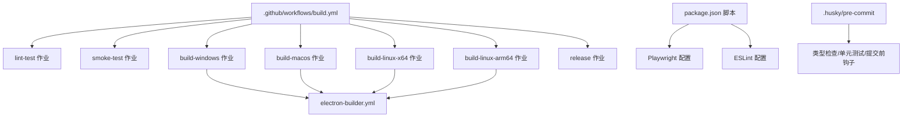
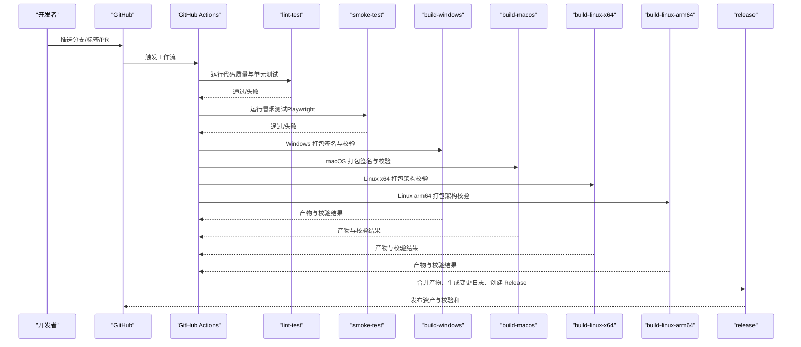
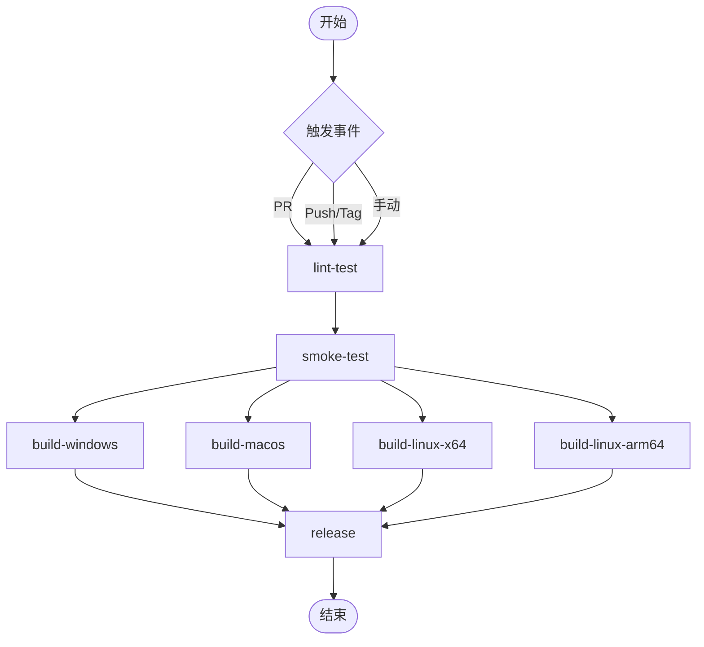
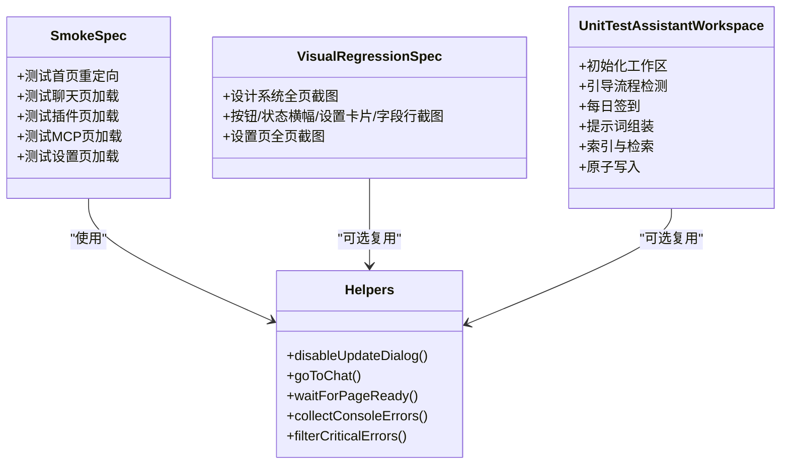
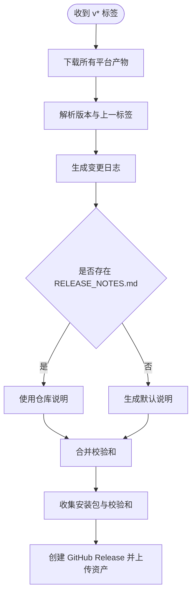
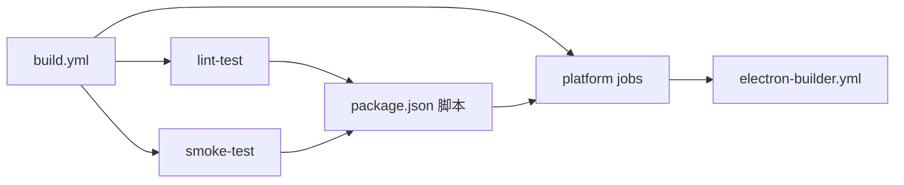

# CI/CD 流程

<cite>
**本文引用的文件**
- [.github/workflows/build.yml](file://.github/workflows/build.yml)
- [package.json](file://package.json)
- [playwright.config.ts](file://playwright.config.ts)
- [src/__tests__/e2e/visual-regression.spec.ts](file://src/__tests__/e2e/visual-regression.spec.ts)
- [src/__tests__/e2e/smoke.spec.ts](file://src/__tests__/e2e/smoke.spec.ts)
- [src/__tests__/smoke-test.ts](file://src/__tests__/smoke-test.ts)
- [src/__tests__/helpers.ts](file://src/__tests__/helpers.ts)
- [src/__tests__/unit/assistant-workspace.test.ts](file://src/__tests__/unit/assistant-workspace.test.ts)
- [src/__tests__/integration/warm-query-poc.test.ts](file://src/__tests__/integration/warm-query-poc.test.ts)
- [src/__tests__/test-plan.md](file://src/__tests__/test-plan.md)
- [eslint.config.mjs](file://eslint.config.mjs)
- [.husky/pre-commit](file://.husky/pre-commit)
- [electron-builder.yml](file://electron-builder.yml)
- [scripts/build-electron.mjs](file://scripts/build-electron.mjs)
- [tsconfig.json](file://tsconfig.json)
</cite>

## 目录
1. [简介](#简介)
2. [项目结构](#项目结构)
3. [核心组件](#核心组件)
4. [架构总览](#架构总览)
5. [详细组件分析](#详细组件分析)
6. [依赖关系分析](#依赖关系分析)
7. [性能考量](#性能考量)
8. [故障排查指南](#故障排查指南)
9. [结论](#结论)
10. [附录](#附录)

## 简介
本指南面向 CodePilot 的 CI/CD 自动化流程，覆盖 GitHub Actions 工作流配置、构建矩阵与平台分发、测试自动化策略（单元测试、冒烟测试、端到端测试、可视化回归测试）、代码质量检查与安全扫描、发布自动化与版本管理、变更日志生成，以及常见问题排查与性能优化建议。文档同时提供关键流程的时序图与类图，帮助读者快速理解并落地实施。

## 项目结构
仓库采用多工作区与多测试类型的组织方式：
- 根目录包含工作流、脚本、构建配置与测试套件
- 应用层位于 apps/*，业务逻辑与组件位于 src/*
- 测试分为单元测试、集成测试、端到端测试与可视化回归测试
- 发布流程由 GitHub Actions 驱动，使用 electron-builder 进行跨平台打包

图表来源
- [.github/workflows/build.yml:1-476](file://.github/workflows/build.yml#L1-L476)
- [package.json:17-36](file://package.json#L17-L36)
- [playwright.config.ts:1-25](file://playwright.config.ts#L1-L25)
- [eslint.config.mjs:1-152](file://eslint.config.mjs#L1-L152)
- [.husky/pre-commit:1-4](file://.husky/pre-commit#L1-L4)
- [electron-builder.yml:1-94](file://electron-builder.yml#L1-L94)

章节来源
- [.github/workflows/build.yml:1-476](file://.github/workflows/build.yml#L1-L476)
- [package.json:17-36](file://package.json#L17-L36)
- [playwright.config.ts:1-25](file://playwright.config.ts#L1-L25)
- [eslint.config.mjs:1-152](file://eslint.config.mjs#L1-L152)
- [.husky/pre-commit:1-4](file://.husky/pre-commit#L1-L4)
- [electron-builder.yml:1-94](file://electron-builder.yml#L1-L94)

## 核心组件
- GitHub Actions 工作流：定义触发条件、权限、作业依赖与平台分发
- 测试框架：Playwright（E2E/可视化回归）、Node:test（单元/集成）
- 代码质量：ESLint（含自定义规则）、类型检查（TypeScript）
- 打包与发布：electron-builder、签名与校验、发布到 GitHub Releases
- 提交前钩子：husky + lint-staged + 类型检查 + 单元测试

章节来源
- [.github/workflows/build.yml:25-476](file://.github/workflows/build.yml#L25-L476)
- [package.json:17-36](file://package.json#L17-L36)
- [playwright.config.ts:1-25](file://playwright.config.ts#L1-L25)
- [eslint.config.mjs:1-152](file://eslint.config.mjs#L1-L152)
- [.husky/pre-commit:1-4](file://.husky/pre-commit#L1-L4)
- [electron-builder.yml:1-94](file://electron-builder.yml#L1-L94)

## 架构总览
下图展示从代码推送/PR到跨平台发布的关键路径，包括质量门禁、测试与打包、发布与校验。

图表来源
- [.github/workflows/build.yml:3-476](file://.github/workflows/build.yml#L3-L476)

章节来源
- [.github/workflows/build.yml:3-476](file://.github/workflows/build.yml#L3-L476)

## 详细组件分析

### GitHub Actions 工作流与构建矩阵
- 触发条件
  - PR 到 main 分支
  - 推送到主干或匹配 v* 标签（触发发布）
  - 手动触发（可选择平台）
- 权限
  - 允许上传发布资产与写入内容
- 作业编排
  - lint-test：Node 20 + 缓存 + Lint + 类型检查 + 单测
  - smoke-test：安装浏览器依赖后运行冒烟测试，并在失败时上传 Playwright 报告
  - 平台作业：Windows/macOS/Linux（x64/arm64）并行执行
  - release：收集所有平台产物，合并校验和，生成变更日志并创建 GitHub Release

图表来源
- [.github/workflows/build.yml:3-476](file://.github/workflows/build.yml#L3-L476)

章节来源
- [.github/workflows/build.yml:3-476](file://.github/workflows/build.yml#L3-L476)

### 代码质量检查与安全扫描
- ESLint
  - 使用 next/eslint-config 基础规则并扩展自定义规则
  - 禁止直接使用原生 HTML 控件与 lucide 图标，强制统一 UI 组件
  - 组件文件大小限制、模式层禁止导入数据逻辑等治理规则
  - 提供颜色使用检查脚本（lint:colors），用于检测业务组件中的原始状态色
- 类型检查
  - TypeScript 严格模式，配合 esbuild 与 Next 构建链路
- 提交前钩子
  - husky + lint-staged + tsc --noEmit + 单元测试，确保本地质量门禁

章节来源
- [eslint.config.mjs:1-152](file://eslint.config.mjs#L1-L152)
- [tsconfig.json:1-45](file://tsconfig.json#L1-L45)
- [.husky/pre-commit:1-4](file://.husky/pre-commit#L1-L4)

### 测试自动化策略
- 单元测试（Node:test）
  - 示例：assistant-workspace.test.ts 展示了工作区初始化、引导流程、每日签到、提示词组装、索引与检索、原子写入等场景
  - 通过临时目录隔离数据库与文件系统，保证可重复性
- 冒烟测试（Playwright）
  - smoke.spec.ts：验证首页重定向、聊天页、插件页、MCP 管理页、设置页加载正确性与无错误覆盖
  - helpers.ts：提供路由拦截（禁用更新弹窗）、等待策略、断言工具与定位器集合
  - legacy smoke-test.ts：历史脚本，现推荐使用 Playwright 版本
- 端到端测试（Playwright）
  - playwright.config.ts：启用并行、重试策略、HTML 报告、trace 等
  - test-plan.md：定义页面渲染、聊天流程、插件管理、设置、布局、项目面板、技能编辑器、增强聊天 UI 等测试范围与验收标准
- 可视化回归测试（Playwright）
  - visual-regression.spec.ts：设计系统与关键页面的截图对比，支持更新基线与差异阈值控制
  - 该测试集默认跳过，避免在标准 E2E 网关中阻塞发布

图表来源
- [src/__tests__/e2e/smoke.spec.ts:1-92](file://src/__tests__/e2e/smoke.spec.ts#L1-L92)
- [src/__tests__/helpers.ts:1-515](file://src/__tests__/helpers.ts#L1-L515)
- [src/__tests__/e2e/visual-regression.spec.ts:1-80](file://src/__tests__/e2e/visual-regression.spec.ts#L1-L80)
- [src/__tests__/unit/assistant-workspace.test.ts:1-613](file://src/__tests__/unit/assistant-workspace.test.ts#L1-L613)

章节来源
- [src/__tests__/e2e/smoke.spec.ts:1-92](file://src/__tests__/e2e/smoke.spec.ts#L1-L92)
- [src/__tests__/helpers.ts:1-515](file://src/__tests__/helpers.ts#L1-L515)
- [src/__tests__/e2e/visual-regression.spec.ts:1-80](file://src/__tests__/e2e/visual-regression.spec.ts#L1-L80)
- [src/__tests__/unit/assistant-workspace.test.ts:1-613](file://src/__tests__/unit/assistant-workspace.test.ts#L1-L613)
- [playwright.config.ts:1-25](file://playwright.config.ts#L1-L25)
- [src/__tests__/test-plan.md:1-382](file://src/__tests__/test-plan.md#L1-L382)

### 性能基准测试与 SDK POC
- warm-query-poc.test.ts：针对 Claude Agent SDK 的预热查询进行端到端延迟测量，比较冷启动与预热路径的首字节延迟分布，记录决策依据并输出结果到研究文档
- 通过 includePartialMessages 等选项确保采样指标为用户可见的首字节延迟

章节来源
- [src/__tests__/integration/warm-query-poc.test.ts:1-176](file://src/__tests__/integration/warm-query-poc.test.ts#L1-L176)

### 发布自动化与版本管理
- 触发条件：推送到 v* 标签
- 产物收集：下载各平台产物，合并校验和文件
- 版本与变更日志：从标签名解析版本号；若存在上一个标签则生成区间日志；否则回退到 HEAD
- 发布内容：安装包 + 校验和文件；若仓库存在 RELEASE_NOTES.md 则使用，否则生成默认说明
- 平台打包：electron-builder 按平台目标生成 DMG/ZIP/EXE/AppImage/DEB/RPM，并生成 SHA-256 校验和

图表来源
- [.github/workflows/build.yml:375-476](file://.github/workflows/build.yml#L375-L476)

章节来源
- [.github/workflows/build.yml:375-476](file://.github/workflows/build.yml#L375-L476)

### 打包与签名校验
- Windows
  - 使用 electron-builder 打包 NSIS 安装包
  - 生成 SHA-256 校验和
- macOS
  - 解码 P12 证书并校验 Team Identifier 与签名有效性
  - 生成 DMG/ZIP 并校验签名
- Linux
  - x64/arm64 分别校验 AppImage/DEB/RPM 架构与内容完整性
  - 生成对应校验和

章节来源
- [.github/workflows/build.yml:76-476](file://.github/workflows/build.yml#L76-L476)
- [electron-builder.yml:1-94](file://electron-builder.yml#L1-L94)
- [scripts/build-electron.mjs:1-66](file://scripts/build-electron.mjs#L1-L66)

## 依赖关系分析
- 工作流对测试与构建的耦合
  - lint-test 与 smoke-test 作为后续平台作业的前置条件，形成串行门禁
- 测试与被测应用的解耦
  - Playwright 通过本地开发服务器启动应用，避免与生产构建强耦合
- 打包与发布
  - electron-builder 配置集中于 yml，工作流仅负责收集与发布

图表来源
- [.github/workflows/build.yml:25-476](file://.github/workflows/build.yml#L25-L476)
- [package.json:17-36](file://package.json#L17-L36)
- [electron-builder.yml:1-94](file://electron-builder.yml#L1-L94)

章节来源
- [.github/workflows/build.yml:25-476](file://.github/workflows/build.yml#L25-L476)
- [package.json:17-36](file://package.json#L17-L36)
- [electron-builder.yml:1-94](file://electron-builder.yml#L1-L94)

## 性能考量
- 并行与资源
  - E2E 测试启用 fullyParallel，CI 中设置 workers=1 降低并发竞争
  - Playwright 重试策略在 CI 上开启，提升稳定性
- 构建与打包
  - electron-builder 按平台分别构建，避免交叉编译复杂度
  - Linux 作业区分 x64/arm64，使用原生 ARM runner 保障稳定性
- 测试覆盖率
  - 建议在 CI 中增加可视化回归测试（@visual）与性能基准测试（@perf）的可选执行，避免阻塞主发布通道
- 日志与报告
  - 失败时上传 Playwright 报告，便于离线分析

章节来源
- [playwright.config.ts:1-25](file://playwright.config.ts#L1-L25)
- [.github/workflows/build.yml:48-75](file://.github/workflows/build.yml#L48-L75)

## 故障排查指南
- macOS 签名失败
  - 检查 MAC_CERT_P12_BASE64 与密码是否正确设置
  - 校验 Team Identifier 是否为 K9X599X9Q2
  - 使用 codesign 验证签名与严格校验
- Linux 架构不匹配
  - 确认 AppImage/DEB/RPM 的架构与预期一致
  - 检查 dpkg/rpm 查询输出与 file 命令结果
- Windows 校验和缺失
  - 确认 release 目录存在安装包与校验和文件
- 变更日志为空
  - 若无上一标签，回退到 HEAD；确认 git log 区间正确
- 提交前失败
  - husky 钩子会执行 lint-staged、类型检查与单测，逐一修复问题

章节来源
- [.github/workflows/build.yml:120-189](file://.github/workflows/build.yml#L120-L189)
- [.github/workflows/build.yml:226-271](file://.github/workflows/build.yml#L226-L271)
- [.github/workflows/build.yml:401-416](file://.github/workflows/build.yml#L401-L416)
- [.husky/pre-commit:1-4](file://.husky/pre-commit#L1-L4)

## 结论
本指南梳理了 CodePilot 的 CI/CD 自动化流程：以 GitHub Actions 为核心，结合 ESLint、TypeScript、Playwright 与 electron-builder，实现跨平台打包、质量门禁与发布自动化。通过明确的测试策略与性能基准，可在保证质量的同时加速交付。建议在日常开发中充分利用提交前钩子与本地测试，减少 CI 失败率；在发布前进行可视化回归与性能评估，确保用户体验稳定。

## 附录
- 常用命令与入口
  - Lint：npm run lint
  - 类型检查：npm run typecheck
  - 单元测试：npm run test:unit
  - 冒烟测试：npm run test:smoke
  - 端到端测试：npm run test:e2e
  - 可视化回归：npm run test:visual
  - SDK POC：CLAUDE_SDK_POC=1 npm run test:sdk-poc
- 关键配置参考
  - ESLint：eslint.config.mjs
  - Playwright：playwright.config.ts
  - electron-builder：electron-builder.yml
  - 提交前钩子：.husky/pre-commit
  - 构建脚本：scripts/build-electron.mjs