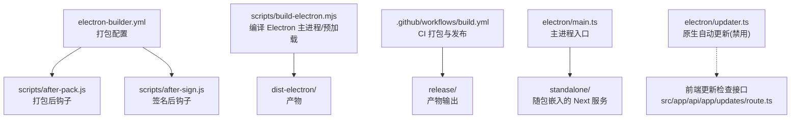
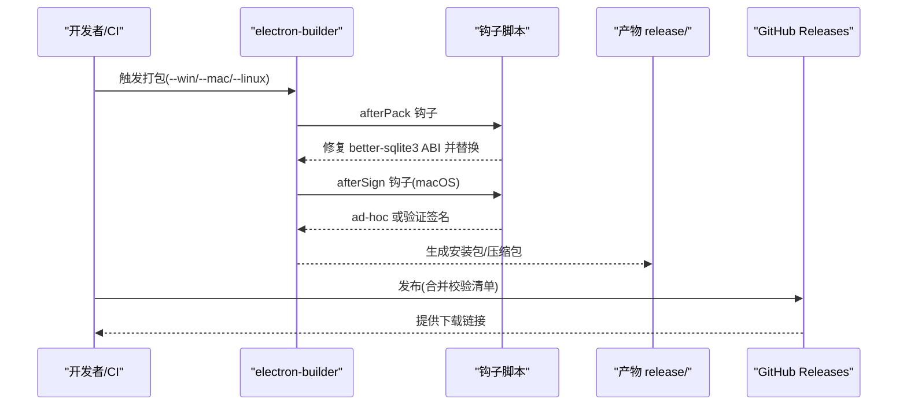
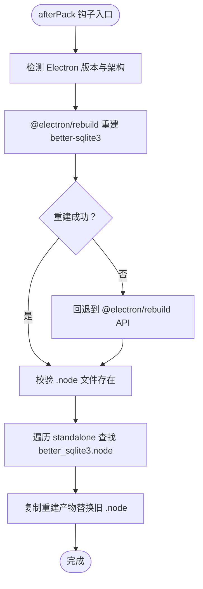
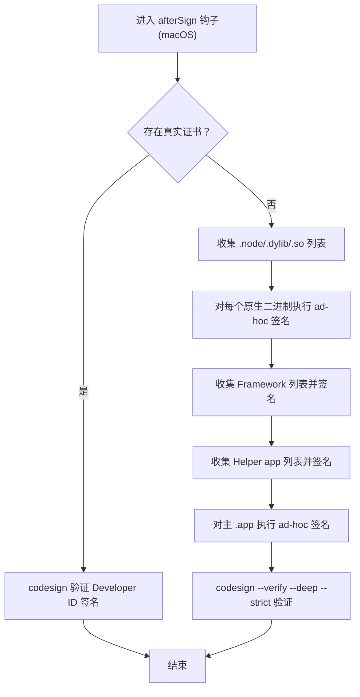
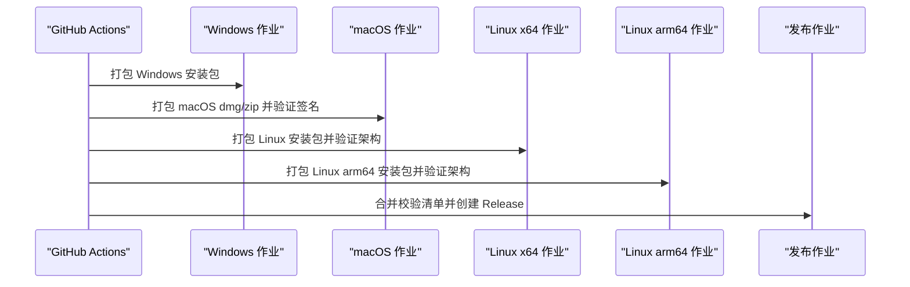
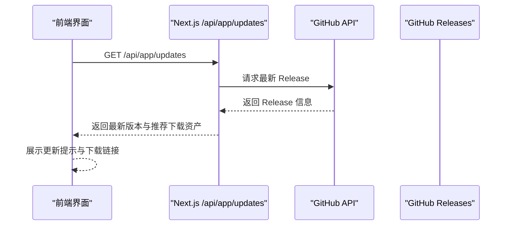
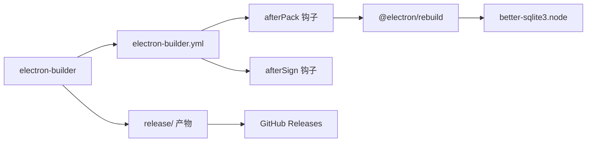

# 多平台打包

<cite>
**本文引用的文件**
- [electron-builder.yml](file://electron-builder.yml)
- [scripts/build-electron.mjs](file://scripts/build-electron.mjs)
- [scripts/after-pack.js](file://scripts/after-pack.js)
- [scripts/after-sign.js](file://scripts/after-sign.js)
- [.github/workflows/build.yml](file://.github/workflows/build.yml)
- [electron/updater.ts](file://electron/updater.ts)
- [package.json](file://package.json)
- [electron/main.ts](file://electron/main.ts)
- [src/app/api/app/updates/route.ts](file://src/app/api/app/updates/route.ts)
</cite>

## 目录
1. [简介](#简介)
2. [项目结构](#项目结构)
3. [核心组件](#核心组件)
4. [架构总览](#架构总览)
5. [详细组件分析](#详细组件分析)
6. [依赖关系分析](#依赖关系分析)
7. [性能考量](#性能考量)
8. [故障排查指南](#故障排查指南)
9. [结论](#结论)
10. [附录](#附录)

## 简介
本指南面向 CodePilot 的多平台打包与发布，覆盖 macOS、Windows、Linux 三端的打包配置差异、electron-builder 参数、签名与公证策略、自动更新机制、平台特定图标与安装器定制、系统集成设置、发布渠道与校验清单生成，以及常见问题诊断与解决建议。文档同时给出关键流程图与时序图，帮助读者快速理解从构建到发布的全链路。

## 项目结构
围绕打包与发布的相关目录与文件如下：
- 打包配置：electron-builder.yml
- 构建脚本：scripts/build-electron.mjs
- 打包后钩子：scripts/after-pack.js、scripts/after-sign.js
- CI 工作流：.github/workflows/build.yml
- 应用入口与运行时：electron/main.ts
- 自动更新禁用实现：electron/updater.ts
- 前端更新检查接口：src/app/api/app/updates/route.ts
- 包管理与脚本：package.json

图表来源
- [electron-builder.yml:1-94](file://electron-builder.yml#L1-L94)
- [scripts/build-electron.mjs:1-66](file://scripts/build-electron.mjs#L1-L66)
- [scripts/after-pack.js:1-127](file://scripts/after-pack.js#L1-L127)
- [scripts/after-sign.js:1-184](file://scripts/after-sign.js#L1-L184)
- [.github/workflows/build.yml:1-476](file://.github/workflows/build.yml#L1-L476)
- [electron/main.ts:1-800](file://electron/main.ts#L1-L800)
- [electron/updater.ts:1-20](file://electron/updater.ts#L1-L20)
- [src/app/api/app/updates/route.ts:1-81](file://src/app/api/app/updates/route.ts#L1-L81)

章节来源
- [electron-builder.yml:1-94](file://electron-builder.yml#L1-L94)
- [scripts/build-electron.mjs:1-66](file://scripts/build-electron.mjs#L1-L66)
- [.github/workflows/build.yml:1-476](file://.github/workflows/build.yml#L1-L476)

## 核心组件
- electron-builder 配置：定义应用元数据、目标平台、安装器类型、图标、权限、打包产物过滤、额外资源、打包后/签名后钩子等。
- 构建脚本：使用 esbuild 编译 Electron 主进程与预加载脚本，并清理 dist-electron 以避免残留。
- 打包后钩子：针对 better-sqlite3 进行 ABI 兼容性重建与替换，确保跨平台可运行。
- 签名后钩子：macOS 在无真实证书时执行 ad-hoc 签名，保证 ShipIt 验证通过；有证书时验证 Developer ID 签名。
- CI 工作流：按平台并行构建，生成校验清单，最终在打标签时发布到 GitHub Releases。
- 自动更新：原生 electron-updater 已禁用，改为前端通过 GitHub Releases 提示用户下载最新版本。
- 图标与系统集成：平台特定图标路径、Linux 桌面条目、Windows 安装器选项、macOS 权限与硬化运行时。

章节来源
- [electron-builder.yml:1-94](file://electron-builder.yml#L1-L94)
- [scripts/after-pack.js:1-127](file://scripts/after-pack.js#L1-L127)
- [scripts/after-sign.js:1-184](file://scripts/after-sign.js#L1-L184)
- [.github/workflows/build.yml:1-476](file://.github/workflows/build.yml#L1-L476)
- [electron/updater.ts:1-20](file://electron/updater.ts#L1-L20)
- [src/app/api/app/updates/route.ts:1-81](file://src/app/api/app/updates/route.ts#L1-L81)

## 架构总览
下图展示从本地或 CI 触发到产物发布的整体流程，包括打包、签名、校验与发布。

图表来源
- [electron-builder.yml:44-46](file://electron-builder.yml#L44-L46)
- [scripts/after-pack.js:17-127](file://scripts/after-pack.js#L17-L127)
- [scripts/after-sign.js:80-184](file://scripts/after-sign.js#L80-L184)
- [.github/workflows/build.yml:94-114](file://.github/workflows/build.yml#L94-L114)
- [.github/workflows/build.yml:417-476](file://.github/workflows/build.yml#L417-L476)

## 详细组件分析

### electron-builder 配置与平台差异
- 应用标识与输出
  - appId、productName、发布渠道 provider/github、输出目录 directories.output。
- 文件与资源
  - files 过滤规则，排除源码与构建中间产物；extraResources 将 .next/standalone、public、themes、build/icon.* 等打入包内。
- 打包后钩子
  - afterPack: scripts/after-pack.js；用于处理 better-sqlite3 的 ABI 重建与替换。
  - afterSign: scripts/after-sign.js；macOS 签名与验证。
- macOS
  - 图标 build/icon.icns、分类 category、产物命名模板 artifactName。
  - 硬化运行时 hardenedRuntime、门禁评估 gatekeeperAssess、entitlements 与继承 plist。
  - notarize 当前为 false（未启用公证）。
  - 目标 dmg/zip，支持 x64/arm64。
- Windows
  - 图标 build/icon.ico、NSIS 安装器、目标 x64/arm64。
  - NSIS 选项：允许自定义安装目录、桌面/开始菜单快捷方式、单击安装等。
  - 产物命名模板 artifactName。
- Linux
  - 图标 build/icon.png、分类 Development、桌面条目 desktop。
  - 目标 AppImage/deb/rpm；架构由 CI 通过 --x64/--arm64 控制，避免交叉编译原生模块失败。

章节来源
- [electron-builder.yml:1-94](file://electron-builder.yml#L1-L94)

### 打包后钩子：better-sqlite3 ABI 兼容性修复
该钩子在打包完成后执行，确保 standalone 中的 better-sqlite3.node 与 Electron ABI 兼容：
- 通过 @electron/rebuild 对 better-sqlite3 进行目标 Electron 版本与架构的重建。
- 校验重建产物存在后，遍历 standalone 路径替换所有 better_sqlite3.node。
- 若通过 @electron/rebuild API 失败则回退到命令行方式。
- 记录替换数量与警告日志，便于排障。

图表来源
- [scripts/after-pack.js:17-127](file://scripts/after-pack.js#L17-L127)

章节来源
- [scripts/after-pack.js:1-127](file://scripts/after-pack.js#L1-L127)

### 签名后钩子：macOS ad-hoc 签名与验证
- 检测是否具备真实证书（CSC_LINK/CSC_NAME 或本地 Keychain Developer ID 签名）。
- 若有真实证书：跳过 ad-hoc 签名，仅进行严格验证。
- 若无证书：对 .node/.dylib/.so、Framework、Helper app、主 .app 逐层执行 ad-hoc 签名。
- 最终执行 deep --strict 验证，确保 ShipIt 可以验证签名完整性。

图表来源
- [scripts/after-sign.js:80-184](file://scripts/after-sign.js#L80-L184)

章节来源
- [scripts/after-sign.js:1-184](file://scripts/after-sign.js#L1-L184)

### CI 工作流：平台并行构建与发布
- 并行作业：Windows、macOS、Linux x64、Linux arm64。
- macOS：解码 P12 证书，设置 CSC_LINK/CSC_KEY_PASSWORD，调用 electron-builder 打包，最后 codesign 验证。
- Linux：分别针对 x64 与 arm64 使用独立作业，验证 AppImage/Deb/RPM 架构正确性。
- Windows：生成 SHA256 校验清单，上传 artifacts。
- 发布阶段：合并各平台校验清单，创建 GitHub Release，上传安装包与 checksums。

图表来源
- [.github/workflows/build.yml:76-115](file://.github/workflows/build.yml#L76-L115)
- [.github/workflows/build.yml:116-204](file://.github/workflows/build.yml#L116-L204)
- [.github/workflows/build.yml:205-374](file://.github/workflows/build.yml#L205-L374)
- [.github/workflows/build.yml:375-476](file://.github/workflows/build.yml#L375-L476)

章节来源
- [.github/workflows/build.yml:1-476](file://.github/workflows/build.yml#L1-L476)

### 自动更新机制与前端检查
- 原生自动更新已禁用（electron-updater），原因：macOS 使用 Developer ID 签名但未公证，用户通过下载最新 DMG 更新。
- 前端提供 /api/app/updates 接口，查询 GitHub Releases 获取最新版本信息，按当前宿主平台与架构推荐下载资产，供 UI 展示“有新版本”提示。

图表来源
- [electron/updater.ts:1-20](file://electron/updater.ts#L1-L20)
- [src/app/api/app/updates/route.ts:35-81](file://src/app/api/app/updates/route.ts#L35-L81)

章节来源
- [electron/updater.ts:1-20](file://electron/updater.ts#L1-L20)
- [src/app/api/app/updates/route.ts:1-81](file://src/app/api/app/updates/route.ts#L1-L81)

### 平台特定图标与系统集成
- macOS
  - 图标：build/icon.icns；Category：Developer Tools；产物：dmg/zip；硬化运行时开启；entitlements 与继承 plist。
- Windows
  - 图标：build/icon.ico；安装器：NSIS；快捷方式：桌面与开始菜单；可选自定义安装目录。
- Linux
  - 图标：build/icon.png；目标：AppImage/deb/rpm；desktop 条目包含名称、注释、分类、WMClass。
- 主进程图标选择：根据平台返回不同资源路径，开发态指向 build/icon.png。

章节来源
- [electron-builder.yml:50-94](file://electron-builder.yml#L50-L94)
- [electron/main.ts:722-733](file://electron/main.ts#L722-L733)

## 依赖关系分析
- electron-builder 依赖 electron、electron-builder、@electron/rebuild（通过 afterPack 钩子使用）。
- better-sqlite3 作为原生模块，必须与 Electron ABI 兼容，否则会在运行时报错。
- CI 依赖 GitHub Releases 作为发布渠道，使用校验清单辅助完整性校验。

图表来源
- [electron-builder.yml:44-46](file://electron-builder.yml#L44-L46)
- [scripts/after-pack.js:32-63](file://scripts/after-pack.js#L32-L63)
- [.github/workflows/build.yml:417-476](file://.github/workflows/build.yml#L417-L476)

章节来源
- [package.json:108-136](file://package.json#L108-L136)
- [scripts/after-pack.js:1-127](file://scripts/after-pack.js#L1-L127)
- [.github/workflows/build.yml:1-476](file://.github/workflows/build.yml#L1-L476)

## 性能考量
- 打包体积与冷启动
  - asarUnpack 配置将某些 .node 与 better-sqlite3 子树排除在 asar 外，有助于减少解压开销并提升加载速度。
- 构建缓存与增量
  - 清理 dist-electron 避免陈旧文件污染；CI 中使用 npm ci 与缓存加速依赖安装。
- 平台特定优化
  - Linux arm64 使用专用 runner，避免跨编译工具链复杂度导致的失败与耗时。
- 原生模块兼容
  - afterPack 钩子确保 better-sqlite3.node 与 Electron ABI 一致，避免运行时崩溃与二次加载失败。

章节来源
- [electron-builder.yml:47-49](file://electron-builder.yml#L47-L49)
- [scripts/build-electron.mjs:26-60](file://scripts/build-electron.mjs#L26-L60)
- [.github/workflows/build.yml:288-374](file://.github/workflows/build.yml#L288-L374)
- [scripts/after-pack.js:32-127](file://scripts/after-pack.js#L32-L127)

## 故障排查指南
- better-sqlite3 加载失败（MODULE_NOT_FOUND/NODE_MODULE_VERSION）
  - 现象：启动即崩溃或弹出错误框。
  - 原因：原生模块 ABI 不匹配。
  - 解决：确认 afterPack 钩子已重建并替换 better_sqlite3.node；检查 Electron 版本与架构；重新打包。
  - 参考：主进程 ABI 校验逻辑与钩子行为。
- macOS 签名验证失败
  - 现象：codesign --verify 报错。
  - 原因：无证书或签名被破坏。
  - 解决：确保 CSC_LINK/CSC_KEY_PASSWORD 正确；若无证书，afterSign 会执行 ad-hoc 签名；再次验证。
- Windows 安装器无法创建快捷方式
  - 现象：桌面/开始菜单未出现快捷方式。
  - 原因：NSIS 配置 perMachine/createDesktopShortcut/createStartMenuShortcut。
  - 解决：调整 electron-builder.yml 中 nsis 选项；在受控环境中以管理员权限安装。
- Linux 安装包架构不正确
  - 现象：AppImage/Deb/RPM 架构与预期不符。
  - 原因：CI 未指定 --x64/--arm64 或交叉编译失败。
  - 解决：确认对应作业使用了正确的架构标志；必要时切换到专用 runner。
- 前端更新检查无结果
  - 现象：/api/app/updates 返回空或错误。
  - 原因：网络异常或 GitHub API 限制。
  - 解决：检查网络连通性与 GitHub API 可达性；重试请求。

章节来源
- [electron/main.ts:329-377](file://electron/main.ts#L329-L377)
- [scripts/after-pack.js:32-127](file://scripts/after-pack.js#L32-L127)
- [scripts/after-sign.js:114-184](file://scripts/after-sign.js#L114-L184)
- [electron-builder.yml:64-94](file://electron-builder.yml#L64-L94)
- [.github/workflows/build.yml:205-374](file://.github/workflows/build.yml#L205-L374)
- [src/app/api/app/updates/route.ts:35-81](file://src/app/api/app/updates/route.ts#L35-L81)

## 结论
本项目采用 electron-builder 统一配置三端打包，结合 afterPack/afterSign 钩子保障原生模块 ABI 兼容与 macOS 签名完整性；CI 实现并行构建与发布，配合校验清单提升分发可靠性。原生自动更新已禁用，改由前端检查与 GitHub Releases 引导用户下载最新版本。遵循本文档的配置要点与排障建议，可在多平台上稳定产出高质量安装包。

## 附录

### 关键配置项速查
- 应用元数据与发布
  - appId/productName/publish/provider/repo
- 输出与资源
  - directories.output、files 过滤、extraResources
- 钩子
  - afterPack/afterSign
- macOS
  - icon/category/artifactName、hardenedRuntime、gatekeeperAssess、entitlements、entitlementsInherit、notarize、targets(dmg/zip)
- Windows
  - icon、target(nsis)、nsis 选项、artifactName
- Linux
  - icon/category/desktop、targets(AppImage/deb/rpm)

章节来源
- [electron-builder.yml:1-94](file://electron-builder.yml#L1-L94)