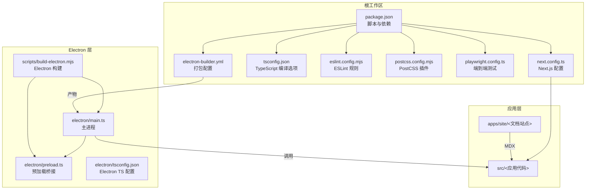
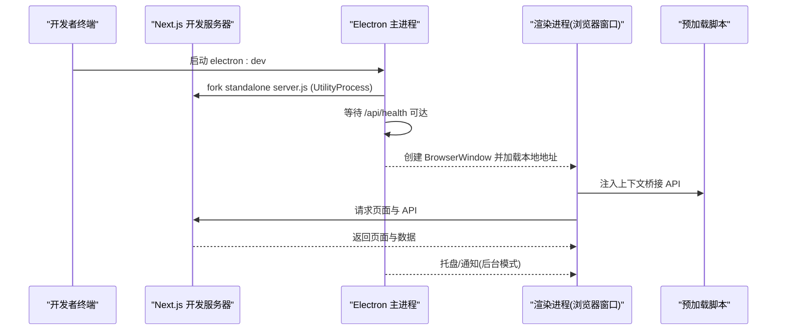
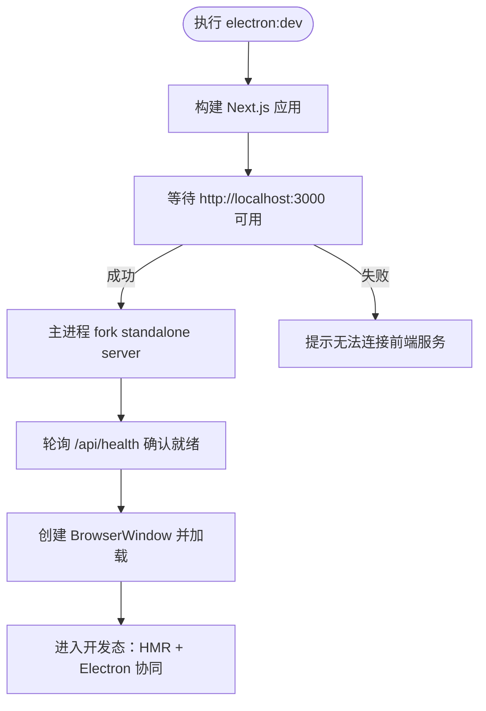
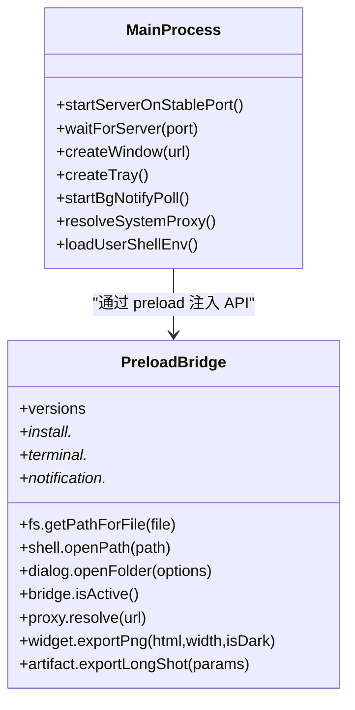
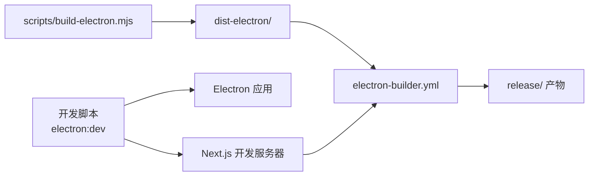

# 开发构建

<cite>
**本文引用的文件**
- [package.json](file://package.json)
- [next.config.ts](file://next.config.ts)
- [tsconfig.json](file://tsconfig.json)
- [eslint.config.mjs](file://eslint.config.mjs)
- [electron/main.ts](file://electron/main.ts)
- [electron/preload.ts](file://electron/preload.ts)
- [electron/tsconfig.json](file://electron/tsconfig.json)
- [scripts/build-electron.mjs](file://scripts/build-electron.mjs)
- [electron-builder.yml](file://electron-builder.yml)
- [apps/site/next.config.mjs](file://apps/site/next.config.mjs)
- [apps/site/tsconfig.json](file://apps/site/tsconfig.json)
- [postcss.config.mjs](file://postcss.config.mjs)
- [playwright.config.ts](file://playwright.config.ts)
</cite>

## 目录
1. [简介](#简介)
2. [项目结构](#项目结构)
3. [核心组件](#核心组件)
4. [架构总览](#架构总览)
5. [详细组件分析](#详细组件分析)
6. [依赖关系分析](#依赖关系分析)
7. [性能考量](#性能考量)
8. [故障排查指南](#故障排查指南)
9. [结论](#结论)
10. [附录](#附录)

## 简介
本指南面向 CodePilot 的开发者，系统性讲解如何搭建与运行开发环境，涵盖以下主题：
- 开发服务器启动流程与热重载机制
- 并发开发模式（前端 Next.js 与 Electron 主进程协同）
- Next.js 开发配置与输出策略
- TypeScript 编译选项与路径别名
- ESLint 规则与代码治理
- Electron 开发模式下主进程与渲染进程的协作方式
- 开发工具链、调试技巧与性能监控
- 常见问题与最佳实践

## 项目结构
该项目采用多包工作区布局，核心目录与职责如下：
- apps/site：文档站点应用（MDX 支持）
- src：桌面端主应用源码（Next.js App Router + Electron 打包）
- electron：Electron 主进程与预加载脚本
- scripts：打包与后处理脚本
- themes：主题资源
- 资料：外部插件与示例包
- 根级配置：package.json、next.config.ts、tsconfig.json、eslint.config.mjs、postcss.config.mjs、playwright.config.ts、electron-builder.yml

图表来源
- [package.json:17-36](file://package.json#L17-L36)
- [next.config.ts:4-56](file://next.config.ts#L4-L56)
- [tsconfig.json:21-23](file://tsconfig.json#L21-L23)
- [electron/main.ts:662-720](file://electron/main.ts#L662-L720)
- [electron/preload.ts:4-93](file://electron/preload.ts#L4-L93)
- [scripts/build-electron.mjs:26-60](file://scripts/build-electron.mjs#L26-L60)
- [electron-builder.yml:7-46](file://electron-builder.yml#L7-L46)

章节来源
- [package.json:1-148](file://package.json#L1-L148)
- [next.config.ts:1-59](file://next.config.ts#L1-L59)
- [tsconfig.json:1-45](file://tsconfig.json#L1-L45)
- [apps/site/next.config.mjs:1-16](file://apps/site/next.config.mjs#L1-L16)
- [apps/site/tsconfig.json:1-46](file://apps/site/tsconfig.json#L1-L46)
- [electron/tsconfig.json:1-12](file://electron/tsconfig.json#L1-L12)
- [postcss.config.mjs:1-8](file://postcss.config.mjs#L1-L8)
- [playwright.config.ts:1-25](file://playwright.config.ts#L1-L25)
- [electron-builder.yml:1-94](file://electron-builder.yml#L1-L94)

## 核心组件
- 开发脚本与并发模式
  - 使用 concurrently 同时启动 Next.js 开发服务器与 Electron 应用，并通过 wait-on 等待本地 3000 端口可用后再启动 Electron，确保渲染进程能访问已启动的服务。
- Next.js 开发配置
  - standalone 输出用于 Electron 打包；serverExternalPackages 排除原生模块与特定 SDK，避免打包错误；outputFileTracingExcludes 过滤非代码资源，减少 NFT 体积。
- TypeScript 编译
  - 严格模式、隔离模块、增量编译、路径别名 @/* 指向 src；Electron 主进程使用 CommonJS 目标。
- ESLint
  - 基于 eslint-config-next 的规则集，自定义业务组件治理、图标导入限制、组件文件大小限制等。
- PostCSS/Tailwind
  - 通过 @tailwindcss/postcss 插件启用 Tailwind 功能。
- Electron 开发
  - 主进程以 UtilityProcess 方式启动 Next.js standalone server，保证端口稳定与本地存储一致性；预加载脚本暴露安全 API 给渲染进程。

章节来源
- [package.json:17-36](file://package.json#L17-L36)
- [next.config.ts:4-56](file://next.config.ts#L4-L56)
- [tsconfig.json:2-24](file://tsconfig.json#L2-L24)
- [eslint.config.mjs:5-149](file://eslint.config.mjs#L5-L149)
- [postcss.config.mjs:1-8](file://postcss.config.mjs#L1-L8)
- [electron/main.ts:662-720](file://electron/main.ts#L662-L720)
- [electron/preload.ts:4-93](file://electron/preload.ts#L4-L93)
- [electron/tsconfig.json:2-9](file://electron/tsconfig.json#L2-L9)

## 架构总览
开发阶段的系统由“前端 Next.js 服务”和“Electron 主进程”组成，二者通过本地回环网络通信。主进程负责：
- 启动/管理嵌入式 Next.js standalone server
- 提供系统托盘与后台通知轮询
- 解析用户 Shell 环境与系统代理
- 安全地向渲染进程暴露有限 API

图表来源
- [package.json:31](file://package.json#L31)
- [electron/main.ts:572-660](file://electron/main.ts#L572-L660)
- [electron/main.ts:768-800](file://electron/main.ts#L768-L800)
- [electron/preload.ts:4-93](file://electron/preload.ts#L4-L93)

## 详细组件分析

### 开发服务器启动与热重载
- 启动顺序
  - 先执行 next dev，再等待 http://localhost:3000 就绪，最后启动 Electron。该顺序确保渲染进程可直接访问前端服务。
- 热重载机制
  - Next.js 在开发模式下自动监听文件变更并触发 HMR；Electron 不参与前端热更新逻辑，但会保持对本地服务的连接。
- 端口稳定性
  - 主进程尝试固定端口范围（47823–47830），避免每次重启导致 localStorage origin 变化造成状态丢失。若失败则回落到系统分配端口。

图表来源
- [package.json:31](file://package.json#L31)
- [electron/main.ts:572-660](file://electron/main.ts#L572-L660)
- [playwright.config.ts:19-23](file://playwright.config.ts#L19-L23)

章节来源
- [package.json:18-21](file://package.json#L18-L21)
- [package.json:31](file://package.json#L31)
- [playwright.config.ts:19-23](file://playwright.config.ts#L19-L23)
- [electron/main.ts:539-617](file://electron/main.ts#L539-L617)

### Next.js 开发配置与输出策略
- standalone 输出
  - 将 Next.js 产物打包为可独立运行的 standalone，便于 Electron 直接分发。
- serverExternalPackages
  - 排除 better-sqlite3、discord.js、@anthropic-ai/claude-agent-sdk 等原生或特殊打包模块，避免运行时缺失文件。
- outputFileTracingExcludes
  - 排除文档、示例、缓存与测试产物，减少 NFT 清单体积，避免构建警告。
- 环境变量
  - 注入应用版本与 Sentry DSN 等公共变量。

章节来源
- [next.config.ts:4-56](file://next.config.ts#L4-L56)

### TypeScript 编译选项与路径别名
- 通用工程
  - 严格模式、隔离模块、增量编译、ESNext 模块解析、React JSX 编译、路径别名 @/* 指向 src。
- Electron 主进程
  - CommonJS 目标、严格模式、跳过库检查。
- 文档站点
  - MDX 支持、路径别名 @/* 与 @/.source。

章节来源
- [tsconfig.json:2-24](file://tsconfig.json#L2-L24)
- [electron/tsconfig.json:2-9](file://electron/tsconfig.json#L2-L9)
- [apps/site/tsconfig.json:2-33](file://apps/site/tsconfig.json#L2-L33)

### ESLint 配置与代码治理
- 基于 eslint-config-next 的核心规则
- 业务组件治理
  - 禁止直接使用原生 HTML 控件，强制使用统一 UI 组件库。
  - 限制在特定目录内使用 @phosphor-icons/react，统一通过 ui/icon 导入。
- 图标与颜色规范
  - 禁止在业务组件中直接引入 lucide-react；提供颜色检查脚本辅助治理。
- 组件规模限制
  - 对非 UI 组件文件行数进行警告阈值控制。
- Patterns 层纯展示约束
  - 禁止在 patterns 层引入 hooks 或 lib，仅允许受控的工具函数。

章节来源
- [eslint.config.mjs:5-149](file://eslint.config.mjs#L5-L149)

### Electron 开发模式下的主进程与渲染进程协同
- 主进程职责
  - 启动/管理嵌入式 Next.js server（UtilityProcess）
  - 系统托盘与后台通知轮询
  - 用户 Shell 环境与系统代理注入
  - 安装/卸载流程与终端管理
- 预加载脚本
  - 暴露受限 API 给渲染进程，包括版本信息、文件系统路径解析、对话框、安装器、代理解析、终端、通知等。
- 窗口与导航
  - 外部链接在系统默认浏览器打开，避免 Electron 窗口被滥用。

图表来源
- [electron/main.ts:572-660](file://electron/main.ts#L572-L660)
- [electron/main.ts:768-800](file://electron/main.ts#L768-L800)
- [electron/preload.ts:4-93](file://electron/preload.ts#L4-L93)

章节来源
- [electron/main.ts:15-19](file://electron/main.ts#L15-L19)
- [electron/main.ts:38-46](file://electron/main.ts#L38-L46)
- [electron/main.ts:539-617](file://electron/main.ts#L539-L617)
- [electron/main.ts:269-321](file://electron/main.ts#L269-L321)
- [electron/main.ts:420-452](file://electron/main.ts#L420-L452)
- [electron/main.ts:385-412](file://electron/main.ts#L385-L412)
- [electron/preload.ts:4-93](file://electron/preload.ts#L4-L93)

### 开发工具链与调试技巧
- 测试与可视化回归
  - Playwright 配置指向本地 3000 端口，支持并行与截图对比。
- 类型检查与单元测试
  - 提供 typecheck 与 test:unit 脚本，建议在提交前先执行类型检查。
- ESLint 团队治理
  - 通过 lint-staged 与 husky 在提交前自动修复，减少违规代码进入主分支。
- 性能监控
  - Sentry 已在主进程初始化，捕获早期崩溃；同时在 Next.js 环境变量中注入 DSN。

章节来源
- [playwright.config.ts:1-25](file://playwright.config.ts#L1-L25)
- [package.json:23-28](file://package.json#L23-L28)
- [eslint.config.mjs:38-59](file://eslint.config.mjs#L38-L59)
- [eslint.config.mjs:66-77](file://eslint.config.mjs#L66-L77)
- [next.config.ts:15-18](file://next.config.ts#L15-L18)
- [electron/main.ts:15-19](file://electron/main.ts#L15-L19)

### 性能监控设置
- Sentry 初始化
  - 主进程优先初始化，避免早期崩溃未被捕获；支持用户关闭上报的标记文件。
- Next.js 环境变量
  - 注入 DSN 以便前端与服务端均启用监控。
- 通知轮询
  - 在无窗口时由主进程轮询通知接口并直接弹出系统通知，降低渲染进程压力。

章节来源
- [electron/main.ts:15-19](file://electron/main.ts#L15-L19)
- [next.config.ts:15-18](file://next.config.ts#L15-L18)
- [electron/main.ts:269-321](file://electron/main.ts#L269-L321)

## 依赖关系分析
- 开发脚本耦合
  - electron:dev 依赖 next dev 与 wait-on；playwright 依赖本地 dev 服务。
- Next.js 产物与 Electron 打包
  - scripts/build-electron.mjs 将主进程与预加载脚本分别打包至 dist-electron；electron-builder.yml 将 .next/standalone 作为 extraResources 注入最终包。
- 路径别名与模块解析
  - tsconfig.json 与 apps/site/tsconfig.json 的路径别名确保跨应用一致的模块解析行为。

图表来源
- [package.json:31](file://package.json#L31)
- [scripts/build-electron.mjs:26-60](file://scripts/build-electron.mjs#L26-L60)
- [electron-builder.yml:20-46](file://electron-builder.yml#L20-L46)

章节来源
- [package.json:17-36](file://package.json#L17-L36)
- [scripts/build-electron.mjs:26-60](file://scripts/build-electron.mjs#L26-L60)
- [electron-builder.yml:1-94](file://electron-builder.yml#L1-L94)

## 性能考量
- 端口稳定性与本地存储
  - 固定端口范围避免 localStorage origin 变更导致的状态重置，提升用户体验。
- outputFileTracingExcludes
  - 排除大量非代码资源，减少 NFT 清单扫描与打包体积。
- 原生模块与打包策略
  - serverExternalPackages 排除原生模块，避免打包失败与运行时缺失。
- 通知轮询与渲染进程解耦
  - 后台模式下由主进程直接弹出系统通知，避免渲染进程忙于轮询。

章节来源
- [electron/main.ts:539-617](file://electron/main.ts#L539-L617)
- [next.config.ts:28-55](file://next.config.ts#L28-L55)
- [next.config.ts:14](file://next.config.ts#L14)
- [electron/main.ts:269-321](file://electron/main.ts#L269-L321)

## 故障排查指南
- 端口冲突与本地存储丢失
  - 现象：应用启动后主题/模型等设置丢失。
  - 原因：所有稳定端口被占用，回落到系统分配端口。
  - 处理：释放占用端口或等待主进程选择其他稳定端口。
- 原生模块 ABI 不匹配
  - 现象：better-sqlite3 加载失败，提示 NODE_MODULE_VERSION。
  - 原因：构建时原生模块与 Electron ABI 不兼容。
  - 处理：重新为 Electron ABI 构建原生模块或使用 asarUnpack 配置。
- 系统代理未生效
  - 现象：某些请求无法走代理。
  - 原因：Shell 环境未导出 HTTP_PROXY/HTTPS_PROXY。
  - 处理：主进程会尝试解析系统代理，若仍无效，请手动注入或检查系统代理设置。
- Sentry 上报被禁用
  - 现象：应用启动时检测到禁用标记文件。
  - 处理：移除 ~/.codepilot/sentry-disabled 标记文件或修改其内容。
- 端到端测试失败
  - 现象：Playwright 无法连接 http://localhost:3000。
  - 处理：确认本地开发服务器已启动且端口未被占用。

章节来源
- [electron/main.ts:329-377](file://electron/main.ts#L329-L377)
- [electron/main.ts:420-452](file://electron/main.ts#L420-L452)
- [electron/main.ts:15-19](file://electron/main.ts#L15-L19)
- [playwright.config.ts:19-23](file://playwright.config.ts#L19-L23)

## 结论
本指南从开发服务器启动、热重载、并发开发模式、Next.js 与 Electron 配置、TypeScript 与 ESLint、调试与性能监控等方面，系统阐述了 CodePilot 的开发构建流程。遵循本文档的步骤与最佳实践，可显著提升开发效率与稳定性。

## 附录
- 常用脚本
  - 开发：npm run dev、npm run electron:dev
  - 构建：npm run build、npm run electron:build、npm run electron:pack
  - 测试：npm run test、npm run test:unit、npm run test:e2e
  - 质量：npm run lint、npm run typecheck
- 关键配置文件定位
  - Next.js：next.config.ts、apps/site/next.config.mjs
  - TypeScript：tsconfig.json、electron/tsconfig.json、apps/site/tsconfig.json
  - ESLint：eslint.config.mjs
  - PostCSS：postcss.config.mjs
  - Electron：electron/main.ts、electron/preload.ts、scripts/build-electron.mjs、electron-builder.yml
  - 端到端：playwright.config.ts