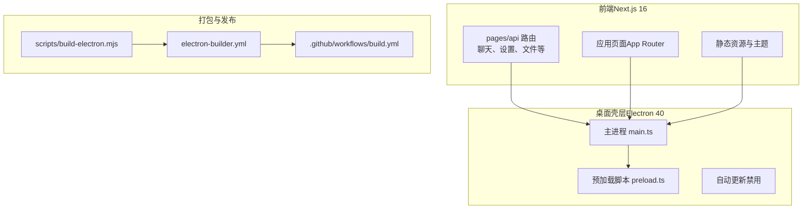
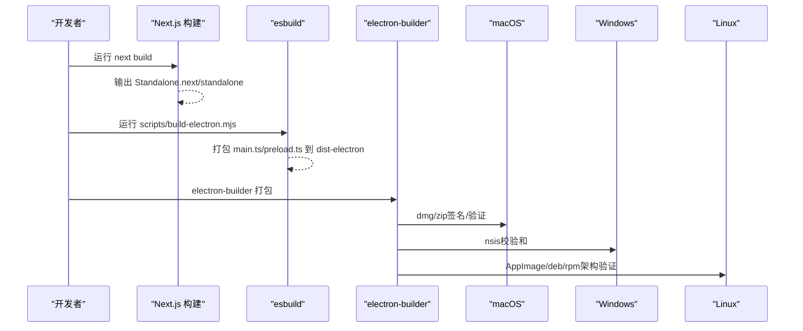
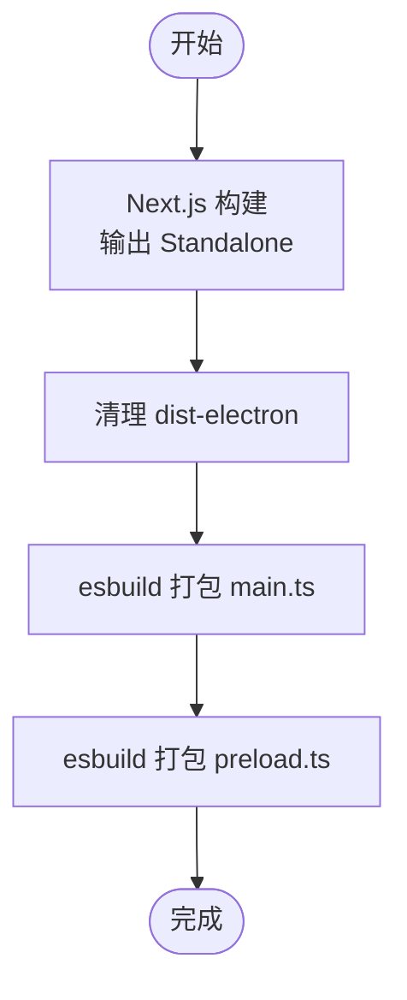
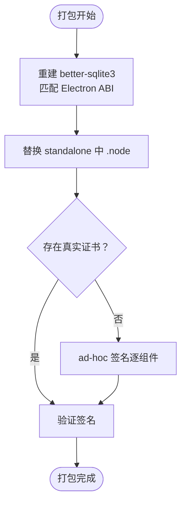
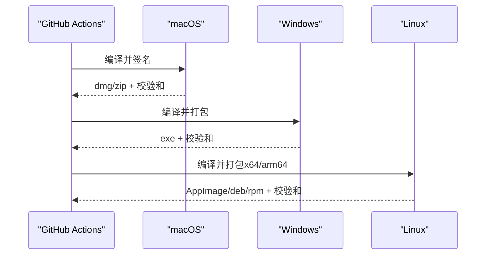
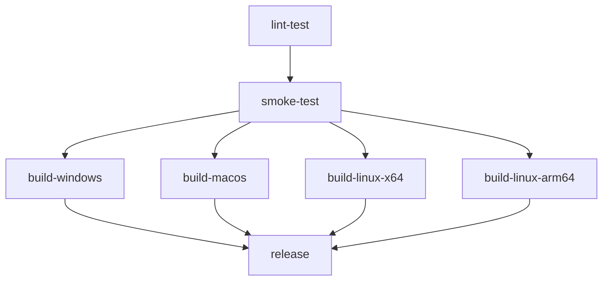
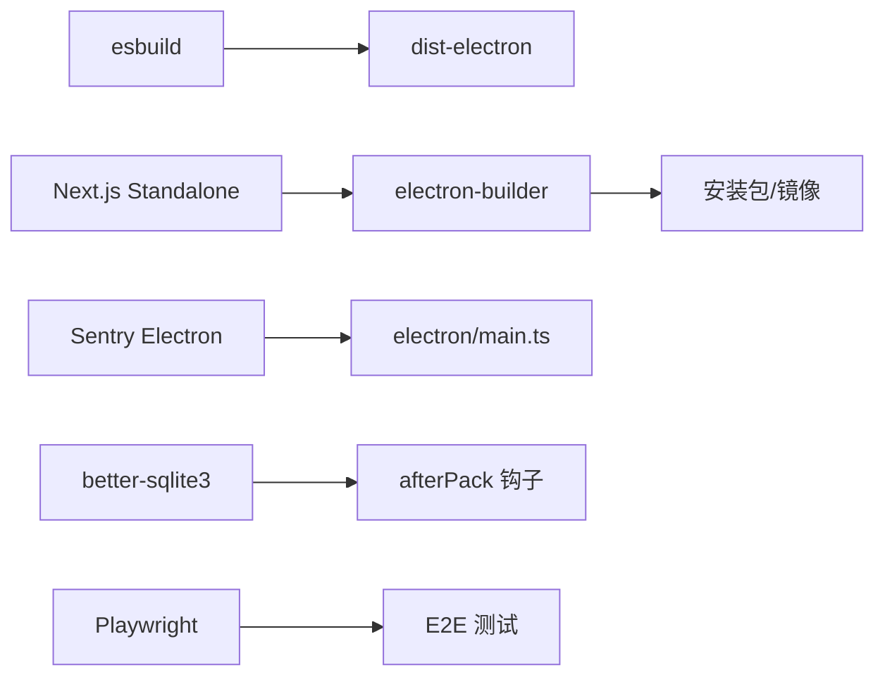

# 构建与部署

<cite>
**本文引用的文件**
- [package.json](file://package.json)
- [next.config.ts](file://next.config.ts)
- [electron-builder.yml](file://electron-builder.yml)
- [scripts/build-electron.mjs](file://scripts/build-electron.mjs)
- [scripts/after-pack.js](file://scripts/after-pack.js)
- [scripts/after-sign.js](file://scripts/after-sign.js)
- [.github/workflows/build.yml](file://.github/workflows/build.yml)
- [electron/main.ts](file://electron/main.ts)
- [electron/updater.ts](file://electron/updater.ts)
- [playwright.config.ts](file://playwright.config.ts)
- [src/__tests__/test-plan.md](file://src/__tests__/test-plan.md)
- [README.md](file://README.md)
- [ARCHITECTURE.md](file://ARCHITECTURE.md)
</cite>

## 目录
1. [简介](#简介)
2. [项目结构](#项目结构)
3. [核心组件](#核心组件)
4. [架构总览](#架构总览)
5. [详细组件分析](#详细组件分析)
6. [依赖分析](#依赖分析)
7. [性能考虑](#性能考虑)
8. [故障排查指南](#故障排查指南)
9. [结论](#结论)
10. [附录](#附录)

## 简介
本指南面向 CodePilot 项目的构建与部署，覆盖开发构建流程、生产构建优化、代码分割策略、Electron 打包配置与签名、自动更新机制、多平台构建（macOS、Windows、Linux）、CI/CD 流程、自动化测试与发布流程，并提供构建优化技巧、包体积分析与性能监控配置建议。

## 项目结构
CodePilot 采用多包工作区结构，前端基于 Next.js 16 App Router，桌面壳层使用 Electron 40，后端 API 与业务逻辑位于 Next.js 的 app/api 路由中；Electron 主进程负责嵌入 Next.js Standalone 服务器并管理原生能力。

图表来源
- [package.json](file://package.json)
- [next.config.ts](file://next.config.ts)
- [electron-builder.yml](file://electron-builder.yml)
- [scripts/build-electron.mjs](file://scripts/build-electron.mjs)
- [.github/workflows/build.yml](file://.github/workflows/build.yml)

章节来源
- [package.json](file://package.json)
- [next.config.ts](file://next.config.ts)
- [ARCHITECTURE.md](file://ARCHITECTURE.md)

## 核心组件
- 开发构建流程
  - Next.js 构建：输出 Standalone，保留原生模块与外部依赖，避免捆绑无法打包的原生二进制。
  - Electron 构建：使用 esbuild 将主进程与预加载脚本分别打包至 dist-electron。
- 生产构建优化
  - 使用 serverExternalPackages 排除原生模块与动态依赖，减少捆绑体积。
  - outputFileTracingExcludes 排除非必要文件，降低 NFT 跟踪范围。
- 代码分割策略
  - App Router 默认按路由分割；结合 Electron Standalone，按需加载页面与 API 路由。
- Electron 打包与签名
  - electron-builder 配置产物、目标平台、图标、权限与签名策略。
  - afterPack 钩子重建 better-sqlite3 以匹配 Electron ABI。
  - afterSign 钩子在无证书时进行 ad-hoc 签名验证。
- 自动更新机制
  - 当前禁用原生自动更新，macOS 通过浏览器检查更新，Windows/Linux 通过安装包升级。
- 多平台构建
  - macOS：dmg/zip（arm64/x64），签名与签名验证。
  - Windows：NSIS（x64/arm64），生成校验和。
  - Linux：AppImage/deb/rpm（x64/arm64），架构验证。
- CI/CD 与自动化测试
  - GitHub Actions 流水线：lint、类型检查、单元测试、冒烟测试、多平台打包、发布。
  - Playwright 配置与测试计划。

章节来源
- [package.json](file://package.json)
- [next.config.ts](file://next.config.ts)
- [electron-builder.yml](file://electron-builder.yml)
- [scripts/build-electron.mjs](file://scripts/build-electron.mjs)
- [scripts/after-pack.js](file://scripts/after-pack.js)
- [scripts/after-sign.js](file://scripts/after-sign.js)
- [playwright.config.ts](file://playwright.config.ts)
- [src/__tests__/test-plan.md](file://src/__tests__/test-plan.md)
- [.github/workflows/build.yml](file://.github/workflows/build.yml)

## 架构总览
Electron 主进程启动 Utility Process 运行 Next.js Standalone 服务器，渲染进程通过 preload 暴露受控 API 与自动更新入口。打包阶段将 Next.js 输出复制到 standalone 目录，Electron 资源路径指向该目录。

图表来源
- [scripts/build-electron.mjs](file://scripts/build-electron.mjs)
- [electron-builder.yml](file://electron-builder.yml)
- [.github/workflows/build.yml](file://.github/workflows/build.yml)

章节来源
- [electron/main.ts](file://electron/main.ts)
- [electron/updater.ts](file://electron/updater.ts)

## 详细组件分析

### 开发构建流程
- Next.js 构建
  - 输出 Standalone，保留原生模块与动态依赖，避免捆绑失败。
  - 排除大量非代码与文档文件，减少 NFT 跟踪范围。
- Electron 构建
  - 清理 dist-electron，确保无陈旧产物。
  - 使用 esbuild 打包主进程与预加载脚本，开启 sourcemap，关闭压缩以便调试。
- 本地开发
  - 提供 electron:dev 脚本，同时启动 Next.js 与 Electron。

图表来源
- [scripts/build-electron.mjs](file://scripts/build-electron.mjs)
- [next.config.ts](file://next.config.ts)

章节来源
- [scripts/build-electron.mjs](file://scripts/build-electron.mjs)
- [next.config.ts](file://next.config.ts)
- [package.json](file://package.json)

### 生产构建优化与代码分割
- serverExternalPackages
  - 排除 better-sqlite3、discord.js、zlib-sync、@anthropic-ai/claude-agent-sdk 等无法捆绑的原生/动态依赖。
- outputFileTracingExcludes
  - 排除 README、docs、apps、scripts 等非运行必需文件，避免污染 NFT。
- App Router 代码分割
  - 按路由自动分割，结合 Electron Standalone，按需加载页面与 API。

章节来源
- [next.config.ts](file://next.config.ts)

### Electron 打包配置与签名
- electron-builder.yml
  - appId/productName/publish 配置。
  - files/extras 包含 dist-electron 与 .next/standalone。
  - macOS：硬实时、权限文件、目标 dmg/zip、架构 x64/arm64。
  - Windows：NSIS 安装器、架构 x64/arm64。
  - Linux：AppImage/deb/rpm、架构通过 CI 参数传入。
  - asarUnpack：原生 .node 与 better-sqlite3。
- afterPack 钩子
  - 重建 better-sqlite3 以匹配 Electron ABI，并替换 standalone 中所有 .node 文件。
- afterSign 钩子
  - 若存在真实证书则验证签名；否则进行 ad-hoc 签名并严格验证。

图表来源
- [electron-builder.yml](file://electron-builder.yml)
- [scripts/after-pack.js](file://scripts/after-pack.js)
- [scripts/after-sign.js](file://scripts/after-sign.js)

章节来源
- [electron-builder.yml](file://electron-builder.yml)
- [scripts/after-pack.js](file://scripts/after-pack.js)
- [scripts/after-sign.js](file://scripts/after-sign.js)

### 自动更新机制
- 当前策略
  - 禁用原生 electron-updater。
  - macOS 用户从 GitHub Releases 下载最新 DMG。
  - 前端 /api/app/updates 提示版本更新信息。
- 设计意图
  - macOS 使用 Developer ID 签名但未公证，用户侧更新更可控。

章节来源
- [electron/updater.ts](file://electron/updater.ts)
- [README.md](file://README.md)

### 多平台构建流程
- macOS
  - 通过 CI 解码证书并签名，随后严格验证签名。
  - 生成 dmg/zip，计算 SHA-256 校验和。
- Windows
  - 生成 NSIS 安装包，计算 SHA-256 校验和。
- Linux
  - 分别构建 x64 与 arm64，验证 ELF/architecture 正确性，生成校验和。

图表来源
- [.github/workflows/build.yml](file://.github/workflows/build.yml)

章节来源
- [.github/workflows/build.yml](file://.github/workflows/build.yml)

### CI/CD 流程与自动化测试
- 流水线阶段
  - lint-test：代码规范与类型检查。
  - smoke-test：Playwright 冒烟测试。
  - 平台构建：Windows/macOS/Linux（并行或按需触发）。
  - release：收集产物、生成变更日志、创建 GitHub Release。
- Playwright
  - 配置 E2E 测试环境、报告与重试策略。
  - 测试计划覆盖页面渲染、聊天流程、插件管理、设置、布局与项目面板等。

图表来源
- [.github/workflows/build.yml](file://.github/workflows/build.yml)
- [playwright.config.ts](file://playwright.config.ts)
- [src/__tests__/test-plan.md](file://src/__tests__/test-plan.md)

章节来源
- [.github/workflows/build.yml](file://.github/workflows/build.yml)
- [playwright.config.ts](file://playwright.config.ts)
- [src/__tests__/test-plan.md](file://src/__tests__/test-plan.md)

## 依赖分析
- 构建工具链
  - esbuild：快速打包主进程与预加载脚本。
  - electron-builder：跨平台打包与签名。
  - Next.js Standalone：独立运行的 Node 服务器。
- 运行时依赖
  - better-sqlite3：本地数据库，需在打包后重建以匹配 Electron ABI。
  - Sentry Electron：崩溃上报初始化于主进程早期。
- 测试与质量保障
  - Playwright：端到端测试与截图对比。
  - 单元测试：tsx + node:test。

图表来源
- [scripts/build-electron.mjs](file://scripts/build-electron.mjs)
- [electron-builder.yml](file://electron-builder.yml)
- [electron/main.ts](file://electron/main.ts)
- [scripts/after-pack.js](file://scripts/after-pack.js)
- [playwright.config.ts](file://playwright.config.ts)

章节来源
- [package.json](file://package.json)
- [electron/main.ts](file://electron/main.ts)

## 性能考虑
- 构建性能
  - esbuild 打包主进程与预加载脚本，避免压缩以提升可读性与定位问题效率。
  - Next.js Standalone 仅复制必要资源，减少打包体积。
- 运行性能
  - better-sqlite3 在 afterPack 阶段重建并替换，避免 ABI 不匹配导致的崩溃。
  - 主进程在启动时进行端口稳定性选择，避免频繁 localStorage 清空影响体验。
- 监控与可观测性
  - Sentry Electron 初始化于主进程早期，捕获早期崩溃。
  - 建议在 CI 中记录构建时间与产物大小，形成趋势基线。

章节来源
- [scripts/build-electron.mjs](file://scripts/build-electron.mjs)
- [scripts/after-pack.js](file://scripts/after-pack.js)
- [electron/main.ts](file://electron/main.ts)

## 故障排查指南
- better-sqlite3 ABI 不匹配
  - 现象：启动时报 NODE_MODULE_VERSION 或模块加载失败。
  - 处理：确认 afterPack 阶段已重建并替换 .node 文件；若未找到，检查 standalone 路径与打包配置。
- 签名问题（macOS）
  - 现象：Gatekeeper 提示或签名验证失败。
  - 处理：若使用真实证书，确保 CI 解码证书并通过 codesign 验证；若无证书，afterSign 将执行 ad-hoc 签名并严格验证。
- Windows/Linux 架构不匹配
  - 现象：AppImage/Deb/RPM 架构不符。
  - 处理：核对 CI 参数（--x64/--arm64）与打包命令；验证文件头与包元数据。
- 自动更新未生效
  - 现象：应用内无自动更新弹窗。
  - 处理：当前禁用原生自动更新，macOS 通过浏览器检查更新，其他平台通过安装包升级。

章节来源
- [scripts/after-pack.js](file://scripts/after-pack.js)
- [scripts/after-sign.js](file://scripts/after-sign.js)
- [.github/workflows/build.yml](file://.github/workflows/build.yml)
- [electron/updater.ts](file://electron/updater.ts)

## 结论
本指南梳理了 CodePilot 的构建与部署全链路：从 Next.js Standalone 构建、Electron 打包与签名，到多平台产物生成与发布；并结合 CI/CD 与自动化测试保障质量。针对原生模块兼容性与签名策略提供了明确的钩子与验证步骤，确保跨平台一致性与安全性。

## 附录
- 快速命令
  - 开发：npm run electron:dev
  - 构建：npm run build
  - Electron 构建：npm run electron:build
  - 打包：npm run electron:pack（或指定平台）
- 版本与发布
  - 推送 v* 标签触发全量构建与发布，自动生成变更日志与校验和文件。

章节来源
- [package.json](file://package.json)
- [.github/workflows/build.yml](file://.github/workflows/build.yml)
- [README.md](file://README.md)