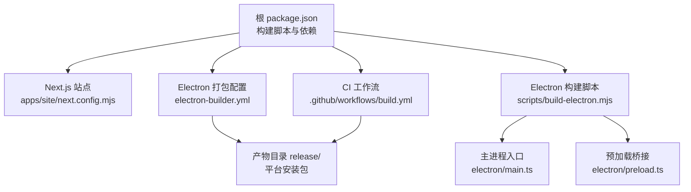
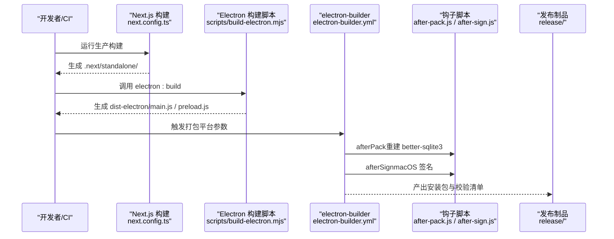
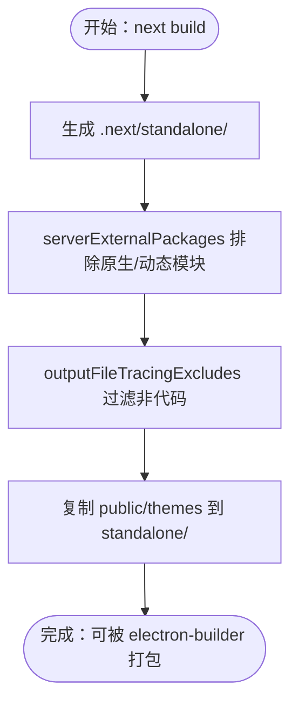
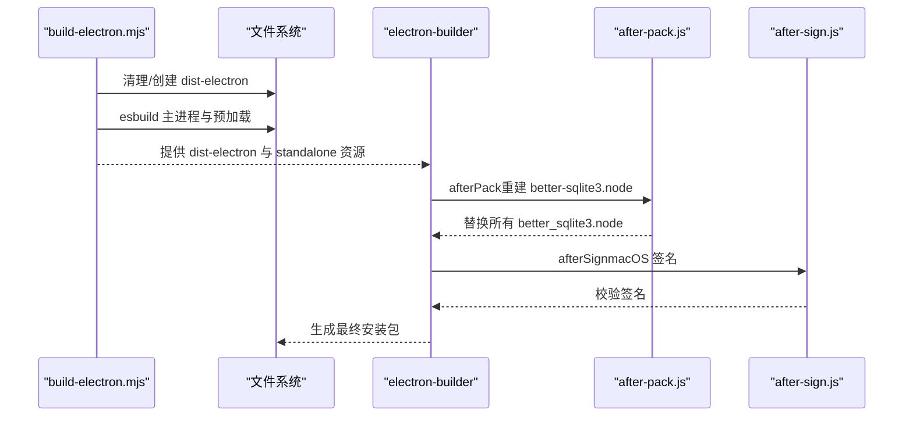
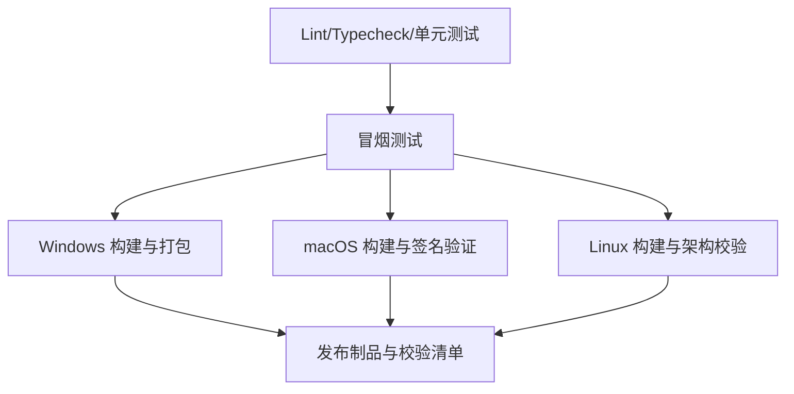
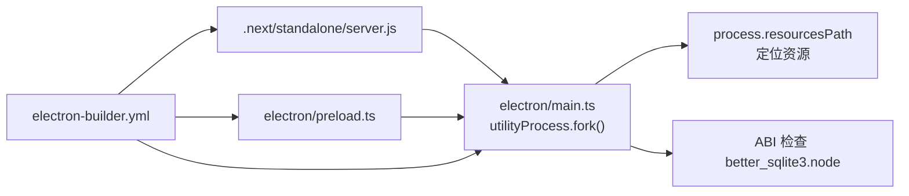

# 生产构建

<cite>
**本文引用的文件**   
- [package.json](file://package.json)
- [next.config.ts](file://next.config.ts)
- [apps/site/next.config.mjs](file://apps/site/next.config.mjs)
- [electron-builder.yml](file://electron-builder.yml)
- [scripts/build-electron.mjs](file://scripts/build-electron.mjs)
- [.github/workflows/build.yml](file://.github/workflows/build.yml)
- [scripts/after-pack.js](file://scripts/after-pack.js)
- [scripts/after-sign.js](file://scripts/after-sign.js)
- [electron/main.ts](file://electron/main.ts)
- [electron/preload.ts](file://electron/preload.ts)
- [postcss.config.mjs](file://postcss.config.mjs)
- [tsconfig.json](file://tsconfig.json)
</cite>

## 目录
1. [简介](#简介)
2. [项目结构](#项目结构)
3. [核心组件](#核心组件)
4. [架构总览](#架构总览)
5. [详细组件分析](#详细组件分析)
6. [依赖关系分析](#依赖关系分析)
7. [性能考量](#性能考量)
8. [故障排查指南](#故障排查指南)
9. [结论](#结论)
10. [附录](#附录)

## 简介
本指南面向 CodePilot 的生产构建与打包流程，覆盖以下主题：
- Next.js 生产构建优化、代码分割策略、静态资源处理
- Electron 应用的打包流程、依赖优化、资源压缩
- 构建产物分析、包体积优化技巧、性能基准测试
- 构建缓存配置、并行构建优化、构建产物验证
- 构建失败排查与性能调优建议

目标是帮助你在 CI/本地环境中稳定、可重复地产出最小化、可签名、可分发的桌面应用。

## 项目结构
本仓库采用多包工作区布局，核心构建相关模块包括：
- 根级构建脚本与配置：package.json、next.config.ts、electron-builder.yml、scripts/*
- 站点子应用（apps/site）：独立的 Next.js 文档站点，使用 MDX 扩展
- Electron 主进程与预加载：electron/main.ts、electron/preload.ts
- 工作流与产物验证：.github/workflows/build.yml

图表来源
- [package.json:17-36](file://package.json#L17-L36)
- [apps/site/next.config.mjs:1-16](file://apps/site/next.config.mjs#L1-L16)
- [electron-builder.yml:1-94](file://electron-builder.yml#L1-L94)
- [scripts/build-electron.mjs:26-60](file://scripts/build-electron.mjs#L26-L60)
- [electron/main.ts:1-800](file://electron/main.ts#L1-L800)
- [.github/workflows/build.yml:76-115](file://.github/workflows/build.yml#L76-L115)

章节来源
- [package.json:17-36](file://package.json#L17-L36)
- [next.config.ts:4-56](file://next.config.ts#L4-L56)
- [apps/site/next.config.mjs:1-16](file://apps/site/next.config.mjs#L1-L16)
- [electron-builder.yml:1-94](file://electron-builder.yml#L1-L94)
- [scripts/build-electron.mjs:26-60](file://scripts/build-electron.mjs#L26-L60)
- [.github/workflows/build.yml:76-115](file://.github/workflows/build.yml#L76-L115)

## 核心组件
- Next.js 生产构建与输出
  - 使用 standalone 输出模式，便于嵌入 Electron 资源
  - serverExternalPackages 排除原生/动态模块，避免打包错误
  - outputFileTracingExcludes 过滤非代码资源，减少 NFT 体积
- Electron 打包与运行时
  - esbuild 构建主进程与预加载脚本，生成 dist-electron
  - electron-builder 将 .next/standalone 与 public/themes 等资源打包进应用
  - afterPack 钩子重建 better-sqlite3 以适配 Electron ABI
  - afterSign 钩子在无证书时执行 ad-hoc 签名，保证更新器可用
- CI/CD 流水线
  - 并行构建 Windows/macOS/Linux，分别校验架构与签名
  - 生成 SHA-256 校验清单并上传制品

章节来源
- [next.config.ts:4-56](file://next.config.ts#L4-L56)
- [electron-builder.yml:1-94](file://electron-builder.yml#L1-L94)
- [scripts/build-electron.mjs:26-60](file://scripts/build-electron.mjs#L26-L60)
- [scripts/after-pack.js:17-126](file://scripts/after-pack.js#L17-L126)
- [scripts/after-sign.js:80-183](file://scripts/after-sign.js#L80-L183)
- [.github/workflows/build.yml:76-115](file://.github/workflows/build.yml#L76-L115)

## 架构总览
下图展示从构建到分发的关键路径：Next.js 产物经 Electron 打包，再由 CI 分发到各平台。

图表来源
- [next.config.ts:4-56](file://next.config.ts#L4-L56)
- [scripts/build-electron.mjs:26-60](file://scripts/build-electron.mjs#L26-L60)
- [electron-builder.yml:1-94](file://electron-builder.yml#L1-L94)
- [scripts/after-pack.js:17-126](file://scripts/after-pack.js#L17-L126)
- [scripts/after-sign.js:80-183](file://scripts/after-sign.js#L80-L183)

## 详细组件分析

### Next.js 生产构建与优化
- standalone 输出模式
  - 优点：将运行时服务器打包为可独立运行的 server.js，便于 Electron 嵌入
  - 影响：需要额外处理原生/动态模块与静态资源复制
- serverExternalPackages
  - 将 better-sqlite3、discord.js、@discordjs/ws、zlib-sync、@anthropic-ai/claude-agent-sdk 留在 node_modules，避免打包导致的运行时缺失或错误
- outputFileTracingExcludes
  - 排除文档、示例、测试等非必要资源，降低 NFT 体积，避免“意外追踪”告警
- 站点应用（apps/site）
  - 使用 MDX 扩展，通过 outputFileTracingRoot 指定追踪根目录，确保内容扫描正确

图表来源
- [next.config.ts:4-56](file://next.config.ts#L4-L56)
- [apps/site/next.config.mjs:10](file://apps/site/next.config.mjs#L10)
- [electron-builder.yml:20-41](file://electron-builder.yml#L20-L41)

章节来源
- [next.config.ts:4-56](file://next.config.ts#L4-L56)
- [apps/site/next.config.mjs:10](file://apps/site/next.config.mjs#L10)

### Electron 构建与打包
- 主进程与预加载构建
  - 使用 esbuild，bundle + sourcemap，target=node18，external: electron
  - 输出 dist-electron/main.js 与 preload.js
- 打包配置
  - files/exclude 控制打包范围
  - extraResources 将 .next/standalone、public、themes 复制到应用资源
  - asarUnpack 包含 .node 文件，避免运行时损坏
- 钩子脚本
  - afterPack：重建 better-sqlite3 以匹配 Electron ABI，并替换所有 better_sqlite3.node
  - afterSign：macOS 无证书时执行 ad-hoc 签名，严格校验签名完整性

图表来源
- [scripts/build-electron.mjs:26-60](file://scripts/build-electron.mjs#L26-L60)
- [electron-builder.yml:20-46](file://electron-builder.yml#L20-L46)
- [scripts/after-pack.js:17-126](file://scripts/after-pack.js#L17-L126)
- [scripts/after-sign.js:80-183](file://scripts/after-sign.js#L80-L183)

章节来源
- [scripts/build-electron.mjs:26-60](file://scripts/build-electron.mjs#L26-L60)
- [electron-builder.yml:20-46](file://electron-builder.yml#L20-L46)
- [scripts/after-pack.js:17-126](file://scripts/after-pack.js#L17-L126)
- [scripts/after-sign.js:80-183](file://scripts/after-sign.js#L80-L183)

### CI/CD 与产物验证
- 并行作业
  - Windows/macOS/Linux 各自构建与校验
  - macOS 使用证书签名；无证书时 after-sign 执行 ad-hoc 签名
- 架构与签名验证
  - Windows/Linux 校验安装包类型与架构
  - macOS 校验签名证书与 Team Identifier，并 deep strict 校验
- 产物与校验
  - 生成 SHA-256 校验清单并上传制品

图表来源
- [.github/workflows/build.yml:26-75](file://.github/workflows/build.yml#L26-L75)
- [.github/workflows/build.yml:116-203](file://.github/workflows/build.yml#L116-L203)
- [.github/workflows/build.yml:205-286](file://.github/workflows/build.yml#L205-L286)
- [.github/workflows/build.yml:288-373](file://.github/workflows/build.yml#L288-L373)

章节来源
- [.github/workflows/build.yml:76-115](file://.github/workflows/build.yml#L76-L115)
- [.github/workflows/build.yml:116-203](file://.github/workflows/build.yml#L116-L203)
- [.github/workflows/build.yml:205-286](file://.github/workflows/build.yml#L205-L286)
- [.github/workflows/build.yml:288-373](file://.github/workflows/build.yml#L288-L373)

### 构建产物分析与包体积优化
- 体积构成
  - Next.js standalone：server.js、node_modules、.next/static、public
  - Electron 主进程/预加载：dist-electron/main.js / preload.js
  - 静态资源：themes/*.json、public/*
- 优化策略
  - 使用 serverExternalPackages 排除原生/动态模块，避免打包
  - outputFileTracingExcludes 过滤文档/媒体/测试等非必要文件
  - electron-builder files/exclude 精确控制打包范围
  - asarUnpack 仅对 .node 文件启用，减小整体包体
- 建议
  - 对第三方库进行按需引入与懒加载
  - 移除未使用的 CSS/字体/图片
  - 在 CI 中记录并对比 release/ 目录大小，建立基线

章节来源
- [next.config.ts:14-55](file://next.config.ts#L14-L55)
- [electron-builder.yml:9-46](file://electron-builder.yml#L9-L46)

### 性能基准测试与构建缓存
- 构建缓存
  - GitHub Actions 使用 npm cache: cache: npm
  - 建议：在本地使用 pnpm/nx 等工具加速增量构建
- 并行构建
  - CI 中 Windows/macOS/Linux 作业并行执行
  - 本地开发：使用 concurrently 同时启动 Next 开发与 Electron
- 基准指标
  - 记录 next build 时间、electron:build 时间、打包时间
  - 记录 release/ 产物大小（尤其是 .node 与 .next/static）

章节来源
- [.github/workflows/build.yml:32-34](file://.github/workflows/build.yml#L32-L34)
- [package.json:31](file://package.json#L31)

### 构建产物验证清单
- Windows
  - 校验安装包类型（NSIS）、架构（x64/arm64）
  - 校验 SHA-256 校验清单
- macOS
  - 校验签名证书与 Team Identifier
  - deep strict 校验签名完整性
- Linux
  - 校验 AppImage/Deb/RPM 架构
  - 校验 SHA-256 校验清单

章节来源
- [.github/workflows/build.yml:94-114](file://.github/workflows/build.yml#L94-L114)
- [.github/workflows/build.yml:149-188](file://.github/workflows/build.yml#L149-L188)
- [.github/workflows/build.yml:223-270](file://.github/workflows/build.yml#L223-L270)
- [.github/workflows/build.yml:310-357](file://.github/workflows/build.yml#L310-L357)

## 依赖关系分析
- Next.js 与 Electron 的耦合点
  - Electron 通过 process.resourcesPath 定位 standalone/server.js
  - 主进程在启动前进行 better-sqlite3 ABI 兼容性检查
- 打包阶段的外部依赖
  - better-sqlite3：通过 afterPack 重建并替换 .node
  - Sentry：主进程初始化，预加载暴露版本信息

图表来源
- [electron/main.ts:329-377](file://electron/main.ts#L329-L377)
- [electron/main.ts:662-720](file://electron/main.ts#L662-L720)
- [electron/preload.ts:1-94](file://electron/preload.ts#L1-L94)
- [electron-builder.yml:20-46](file://electron-builder.yml#L20-L46)

章节来源
- [electron/main.ts:329-377](file://electron/main.ts#L329-L377)
- [electron/main.ts:662-720](file://electron/main.ts#L662-L720)
- [electron/preload.ts:1-94](file://electron/preload.ts#L1-L94)
- [electron-builder.yml:20-46](file://electron-builder.yml#L20-L46)

## 性能考量
- 构建性能
  - 使用 esbuild 构建 Electron 主进程/预加载，避免 TypeScript 编译开销
  - 使用 Next.js standalone 输出，减少运行时打包复杂度
- 运行时性能
  - serverExternalPackages 排除原生模块，避免打包失败与体积膨胀
  - outputFileTracingExcludes 减少 NFT 路径扫描范围
- 资源处理
  - public/themes 独立复制，避免与应用主包混淆
  - asarUnpack 仅针对 .node，保持其他资源可读性与可调试性

章节来源
- [scripts/build-electron.mjs:35-42](file://scripts/build-electron.mjs#L35-L42)
- [next.config.ts:14-55](file://next.config.ts#L14-L55)
- [electron-builder.yml:47-48](file://electron-builder.yml#L47-L48)

## 故障排查指南
- better-sqlite3 ABI 不匹配
  - 现象：启动时报 NODE_MODULE_VERSION 错误
  - 处理：afterPack 会自动重建并替换 .node；若失败，检查 Electron 版本与架构是否一致
- 站点构建告警“意外追踪”
  - 现象：构建日志出现“next.config.ts 被意外追踪”的警告
  - 处理：outputFileTracingExcludes 已过滤常见目录/扩展名；如仍有告警，确认 apps/docs/** 是否仍被扫描
- macOS 签名失败
  - 现象：签名验证失败或 Team Identifier 不匹配
  - 处理：确认 CSC_LINK/CSC_NAME 或本地 Developer ID 签名；无证书时 after-sign 会执行 ad-hoc 签名
- Linux 架构不匹配
  - 现象：AppImage/Deb/RPM 架构与预期不符
  - 处理：确认 CI 使用的 runner 架构与 electron-builder 参数一致
- 本地开发无法访问某些原生模块
  - 现象：打包后运行正常，但开发环境报错
  - 处理：确保 serverExternalPackages 正确排除对应模块

章节来源
- [scripts/after-pack.js:17-126](file://scripts/after-pack.js#L17-L126)
- [next.config.ts:19-55](file://next.config.ts#L19-L55)
- [scripts/after-sign.js:80-183](file://scripts/after-sign.js#L80-L183)
- [.github/workflows/build.yml:223-270](file://.github/workflows/build.yml#L223-L270)
- [.github/workflows/build.yml:310-357](file://.github/workflows/build.yml#L310-L357)

## 结论
本指南总结了 CodePilot 的生产构建与打包实践：以 Next.js standalone 为核心，结合 Electron 打包与钩子脚本，实现跨平台、可签名、可验证的构建流程。通过 serverExternalPackages、outputFileTracingExcludes、精确的打包规则与 CI 校验，能够有效控制包体积并提升稳定性。建议在团队内固化构建指标与校验清单，持续优化构建速度与产物质量。

## 附录
- 关键配置与脚本路径
  - 构建脚本与命令：[package.json:17-36](file://package.json#L17-L36)
  - Next.js 构建配置：[next.config.ts:4-56](file://next.config.ts#L4-L56)
  - 站点应用配置：[apps/site/next.config.mjs:1-16](file://apps/site/next.config.mjs#L1-L16)
  - Electron 打包配置：[electron-builder.yml:1-94](file://electron-builder.yml#L1-L94)
  - Electron 构建脚本：[scripts/build-electron.mjs:26-60](file://scripts/build-electron.mjs#L26-L60)
  - CI 工作流：[.github/workflows/build.yml:1-476](file://.github/workflows/build.yml#L1-L476)
  - 打包后处理（原生模块）：[scripts/after-pack.js:17-126](file://scripts/after-pack.js#L17-L126)
  - 打包后处理（签名）：[scripts/after-sign.js:80-183](file://scripts/after-sign.js#L80-L183)
  - 主进程入口：[electron/main.ts:1-800](file://electron/main.ts#L1-L800)
  - 预加载桥接：[electron/preload.ts:1-94](file://electron/preload.ts#L1-L94)
  - PostCSS 配置：[postcss.config.mjs:1-8](file://postcss.config.mjs#L1-L8)
  - TypeScript 配置：[tsconfig.json:1-45](file://tsconfig.json#L1-L45)