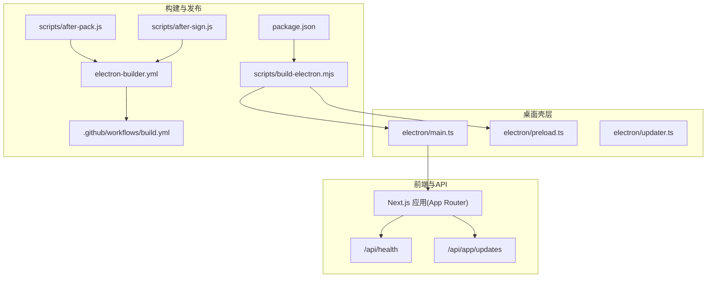
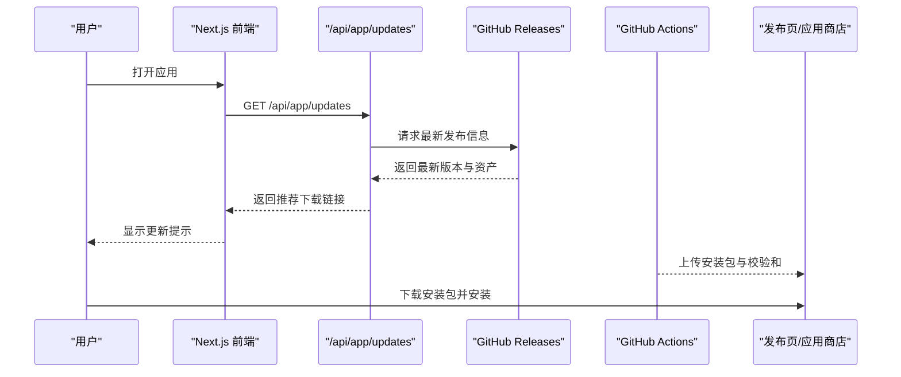
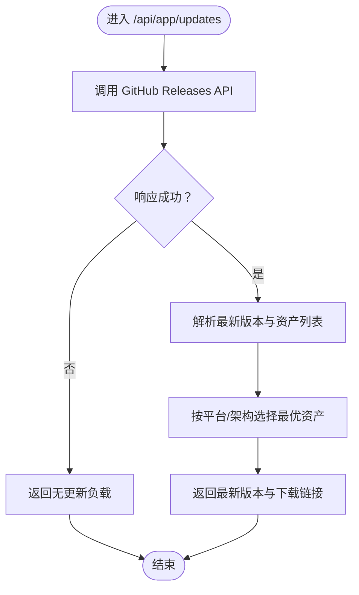
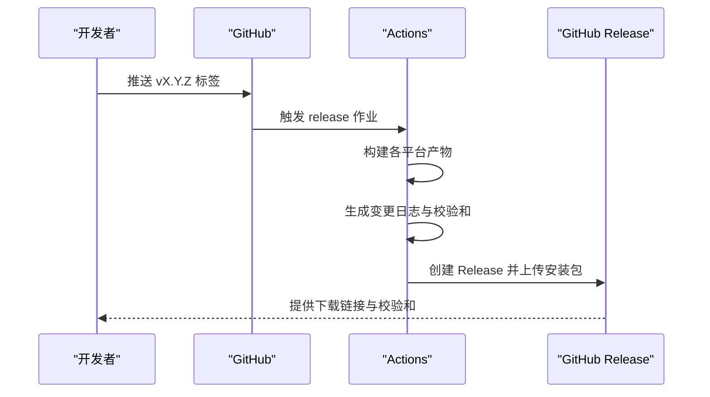
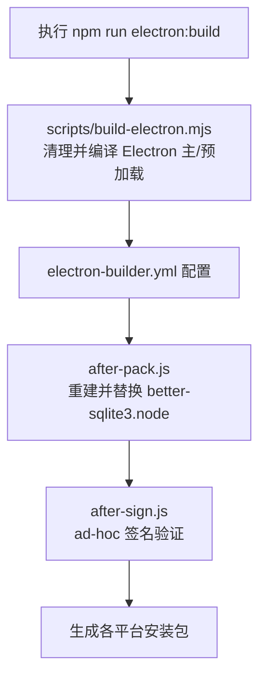
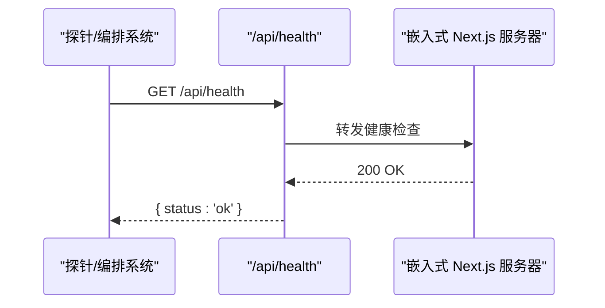
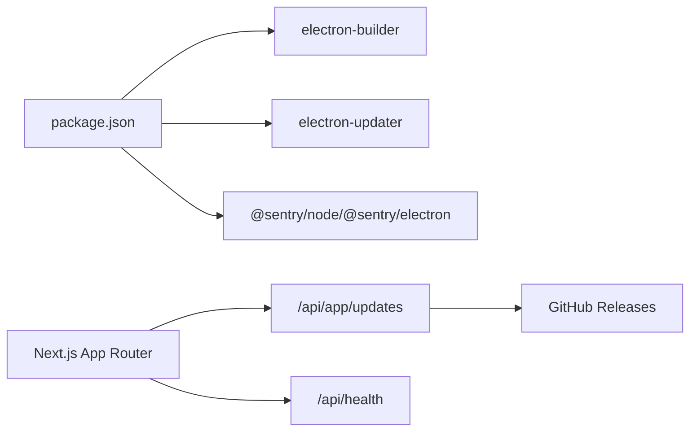

# 部署配置

<cite>
**本文引用的文件**
- [electron\updater.ts](file://electron/updater.ts)
- [electron\main.ts](file://electron/main.ts)
- [electron-builder.yml](file://electron-builder.yml)
- [.github\workflows\build.yml](file://.github/workflows/build.yml)
- [scripts\build-electron.mjs](file://scripts/build-electron.mjs)
- [scripts\after-pack.js](file://scripts/after-pack.js)
- [scripts\after-sign.js](file://scripts/after-sign.js)
- [src\app\api\app\updates\route.ts](file://src/app/api/app/updates/route.ts)
- [src\lib\update-release.ts](file://src/lib/update-release.ts)
- [src\app\api\health\route.ts](file://src/app/api/health/route.ts)
- [src\lib\platform.ts](file://src/lib/platform.ts)
- [src\instrumentation.ts](file://src/instrumentation.ts)
- [package.json](file://package.json)
- [ARCHITECTURE.md](file://ARCHITECTURE.md)
</cite>

## 目录
1. [简介](#简介)
2. [项目结构](#项目结构)
3. [核心组件](#核心组件)
4. [架构总览](#架构总览)
5. [详细组件分析](#详细组件分析)
6. [依赖分析](#依赖分析)
7. [性能考虑](#性能考虑)
8. [故障排查指南](#故障排查指南)
9. [结论](#结论)
10. [附录](#附录)

## 简介
本指南面向 CodePilot 的部署与运维团队，系统阐述应用分发策略、更新机制与版本发布流程；解释自动更新实现原理、更新通道管理与回滚策略；说明应用商店发布流程、企业内部分发方案与私有部署配置；并提供部署监控、健康检查与故障转移机制的最佳实践。

## 项目结构
CodePilot 采用 Electron + Next.js 的桌面应用架构，打包与发布由 GitHub Actions 与 electron-builder 驱动，更新检查由前端 API 调用 GitHub Releases 实现。

**图表来源**
- [electron\main.ts:1-120](file://electron/main.ts#L1-L120)
- [electron\updater.ts:1-20](file://electron/updater.ts#L1-L20)
- [src\app\api\health\route.ts:1-6](file://src/app/api/health/route.ts#L1-L6)
- [src\app\api\app\updates\route.ts:1-81](file://src/app/api/app/updates/route.ts#L1-L81)
- [package.json:17-36](file://package.json#L17-L36)
- [electron-builder.yml:1-94](file://electron-builder.yml#L1-L94)
- [.github\workflows\build.yml:1-60](file://.github/workflows/build.yml#L1-L60)
- [scripts\after-pack.js:1-40](file://scripts/after-pack.js#L1-L40)
- [scripts\after-sign.js:1-40](file://scripts/after-sign.js#L1-L40)
- [scripts\build-electron.mjs:1-30](file://scripts/build-electron.mjs#L1-L30)

**章节来源**
- [ARCHITECTURE.md:1-53](file://ARCHITECTURE.md#L1-L53)
- [package.json:17-36](file://package.json#L17-L36)
- [electron-builder.yml:1-94](file://electron-builder.yml#L1-L94)
- [.github\workflows\build.yml:1-60](file://.github/workflows/build.yml#L1-L60)

## 核心组件
- 桌面壳层与服务进程
  - 主进程负责窗口、系统托盘、通知、子进程与本地健康检查；嵌入式 Next.js 服务器通过 UtilityProcess 启动，避免额外 Dock 图标。
- 更新检查
  - 前端 /api/app/updates 查询 GitHub Releases，按平台与架构选择最优资产；当前版本号来自环境变量 NEXT_PUBLIC_APP_VERSION。
- 构建与打包
  - 使用 esbuild 打包 Electron 主进程与预加载脚本；electron-builder 配置产物、目标平台与签名；after-pack 钩子重建并替换 better-sqlite3 的 .node 文件；after-sign 钩子进行 ad-hoc 签名验证。
- 发布流水线
  - GitHub Actions 根据分支与标签触发，分别构建 Windows/macOS/Linux 产物，生成校验和，最终在发布页上传资产。

**章节来源**
- [electron\main.ts:662-720](file://electron/main.ts#L662-L720)
- [src\app\api\app\updates\route.ts:35-80](file://src/app/api/app/updates/route.ts#L35-L80)
- [src\lib\update-release.ts:45-76](file://src/lib/update-release.ts#L45-L76)
- [scripts\build-electron.mjs:26-60](file://scripts/build-electron.mjs#L26-L60)
- [scripts\after-pack.js:32-63](file://scripts/after-pack.js#L32-L63)
- [scripts\after-sign.js:80-127](file://scripts/after-sign.js#L80-L127)
- [.github\workflows\build.yml:375-476](file://.github/workflows/build.yml#L375-L476)

## 架构总览
下图展示从用户侧到发布系统的整体部署路径：桌面壳层承载前端与 API，更新检查通过 GitHub Releases 获取最新版本信息，构建与签名由 CI/CD 完成，产物在发布页分发。

**图表来源**
- [src\app\api\app\updates\route.ts:35-80](file://src/app/api/app/updates/route.ts#L35-L80)
- [.github\workflows\build.yml:417-476](file://.github/workflows/build.yml#L417-L476)

## 详细组件分析

### 自动更新实现原理与通道管理
- 原理
  - 桌面端原生自动更新被显式禁用，用户通过浏览器访问 GitHub Releases 下载最新 DMG/EXE/AppImage。
  - 前端 /api/app/updates 作为“浏览器模式更新检查”，查询 GitHub Releases 最新版本，返回推荐资产与下载链接。
- 通道管理
  - 当前仅使用 GitHub Releases 作为单一通道；未实现多通道（如灰度、内测通道）。
- 回滚策略
  - 由于禁用原生自动更新，回滚需用户手动下载历史版本安装包；建议在发布页保留历史版本下载链接以便回滚。

**图表来源**
- [src\app\api\app\updates\route.ts:35-80](file://src/app/api/app/updates/route.ts#L35-L80)
- [src\lib\update-release.ts:45-76](file://src/lib/update-release.ts#L45-L76)
- [src\lib\platform.ts:39-59](file://src/lib/platform.ts#L39-L59)

**章节来源**
- [electron\updater.ts:1-20](file://electron/updater.ts#L1-L20)
- [src\app\api\app\updates\route.ts:1-81](file://src/app/api/app/updates/route.ts#L1-L81)
- [src\lib\update-release.ts:1-77](file://src/lib/update-release.ts#L1-L77)
- [src\lib\platform.ts:39-59](file://src/lib/platform.ts#L39-L59)

### 版本发布流程
- 触发条件
  - 推送以 v 开头的标签时，工作流自动触发发布。
- 步骤
  - 下载各平台产物 → 生成变更日志 → 合并校验和 → 创建 GitHub Release 并上传资产。
- 产物与校验
  - Windows: EXE 安装包
  - macOS: DMG/ZIP
  - Linux: AppImage/Deb/RPM
  - 生成 SHA-256 校验和文件并随发布页提供。

**图表来源**
- [.github\workflows\build.yml:375-476](file://.github/workflows/build.yml#L375-L476)

**章节来源**
- [.github\workflows\build.yml:1-60](file://.github/workflows/build.yml#L1-L60)
- [.github\workflows\build.yml:375-476](file://.github/workflows/build.yml#L375-L476)

### 构建与打包配置
- Electron 打包
  - 使用 esbuild 将 electron/main.ts 与 electron/preload.ts 编译为 dist-electron/main.js 与 preload.js。
  - 清理 dist-electron/ 防止旧产物污染。
- 资源与签名
  - electron-builder 配置输出目录、目标平台与产物命名；after-pack 钩子重建并替换 better-sqlite3 的 .node；after-sign 钩子在无证书时进行 ad-hoc 签名验证。
- 平台差异
  - macOS: 硬化运行时、entitlements、不启用 notarize；支持 DMG/ZIP。
  - Windows: NSIS 安装包，快捷方式与安装目录可配置。
  - Linux: AppImage/Deb/RPM，架构通过 CI 参数控制。

**图表来源**
- [scripts\build-electron.mjs:26-60](file://scripts/build-electron.mjs#L26-L60)
- [electron-builder.yml:1-94](file://electron-builder.yml#L1-L94)
- [scripts\after-pack.js:32-63](file://scripts/after-pack.js#L32-L63)
- [scripts\after-sign.js:130-171](file://scripts/after-sign.js#L130-L171)

**章节来源**
- [scripts\build-electron.mjs:1-66](file://scripts/build-electron.mjs#L1-L66)
- [electron-builder.yml:1-94](file://electron-builder.yml#L1-L94)
- [scripts\after-pack.js:1-127](file://scripts/after-pack.js#L1-L127)
- [scripts\after-sign.js:1-184](file://scripts/after-sign.js#L1-L184)

### 部署监控、健康检查与故障转移
- 健康检查
  - /api/health 返回 { status: 'ok' }，用于外部探活与容器编排健康检查。
- 运行时监控
  - Next.js instrumentation 在服务启动时初始化 Sentry（尊重用户 opt-out 标记），并初始化运行时日志与任务调度器。
- 故障转移
  - 当前未实现服务端故障转移；桌面端通过本地健康检查与重试策略保证可用性（例如服务启动超时与端口冲突处理）。

**图表来源**
- [src\app\api\health\route.ts:1-6](file://src/app/api/health/route.ts#L1-L6)
- [electron\main.ts:619-660](file://electron/main.ts#L619-L660)

**章节来源**
- [src\app\api\health\route.ts:1-6](file://src/app/api/health/route.ts#L1-L6)
- [src\instrumentation.ts:5-62](file://src/instrumentation.ts#L5-L62)
- [electron\main.ts:619-660](file://electron/main.ts#L619-L660)

### 应用商店发布与企业内部分发
- 应用商店发布
  - macOS: 通过 DMG/ZIP 产物提交至 Mac App Store（若采用官方渠道）；当前仓库配置未启用 notarize，建议在正式上架前补齐。
- 企业内部分发
  - 使用 GitHub Releases 作为企业内部分发源，结合校验和文件进行完整性校验；可在企业软件分发平台（如 MDM）推送安装包。
- 私有部署配置
  - 通过自建发布页或企业镜像站托管安装包与校验和；在 CI 中生成统一校验和文件并上传。

**章节来源**
- [electron-builder.yml:50-63](file://electron-builder.yml#L50-L63)
- [.github\workflows\build.yml:417-476](file://.github/workflows/build.yml#L417-L476)

## 依赖分析
- 外部依赖
  - electron-builder: 负责跨平台打包与签名。
  - electron-updater: 依赖存在但当前禁用原生自动更新。
  - Sentry: 服务端与桌面端错误采集（尊重用户 opt-out）。
- 内部依赖
  - Next.js App Router 提供 API 路由与页面；平台检测与更新选择逻辑位于 src/lib。

**图表来源**
- [package.json:43-108](file://package.json#L43-L108)
- [src\app\api\app\updates\route.ts:1-81](file://src/app/api/app/updates/route.ts#L1-L81)
- [src\app\api\health\route.ts:1-6](file://src/app/api/health/route.ts#L1-L6)

**章节来源**
- [package.json:43-108](file://package.json#L43-L108)
- [src\app\api\app\updates\route.ts:1-81](file://src/app/api/app/updates/route.ts#L1-L81)
- [src\app\api\health\route.ts:1-6](file://src/app/api/health/route.ts#L1-L6)

## 性能考虑
- 端口分配与稳定性
  - 采用稳定端口范围（47823–47830）减少 localStorage origin 变更导致的 UI 状态丢失；失败时回退到动态端口。
- 健康检查与超时
  - 健康检查与启动超时均设置合理阈值，避免长时间阻塞启动流程。
- 原生模块兼容性
  - after-pack 钩子确保 better-sqlite3 的 .node 与 Electron ABI 匹配，降低崩溃风险。

**章节来源**
- [electron\main.ts:539-617](file://electron/main.ts#L539-L617)
- [electron\main.ts:619-660](file://electron/main.ts#L619-L660)
- [scripts\after-pack.js:32-63](file://scripts/after-pack.js#L32-L63)

## 故障排查指南
- 原生模块 ABI 不匹配
  - 现象：启动时报 better-sqlite3 加载失败。
  - 处理：确认 after-pack 钩子已重建并替换 .node；检查 Electron 版本与构建环境一致。
- 签名问题（macOS）
  - 现象：未检测到 Developer ID 签名或签名验证失败。
  - 处理：after-sign 钩子会在无证书时进行 ad-hoc 签名；确保 CI 提供正确的证书与密码。
- 服务启动失败
  - 现象：健康检查超时或端口占用。
  - 处理：查看服务输出日志；尝试更换稳定端口或使用动态端口回退。
- 更新检查失败
  - 现象：/api/app/updates 返回无更新或空资产。
  - 处理：确认 NEXT_PUBLIC_APP_VERSION 与 GitHub Releases 标签一致；检查网络可达性与缓存刷新。

**章节来源**
- [scripts\after-pack.js:32-63](file://scripts/after-pack.js#L32-L63)
- [scripts\after-sign.js:93-127](file://scripts/after-sign.js#L93-L127)
- [electron\main.ts:619-660](file://electron/main.ts#L619-L660)
- [src\app\api\app\updates\route.ts:35-80](file://src/app/api/app/updates/route.ts#L35-L80)

## 结论
CodePilot 当前采用“禁用原生自动更新 + 浏览器模式更新检查”的混合策略，结合 GitHub Actions 与 electron-builder 实现跨平台稳定发布。建议在后续版本中引入多通道更新与原生自动更新能力，并完善健康检查与故障转移机制，以提升生产环境的可靠性与可观测性。

## 附录
- 关键配置与脚本
  - 构建脚本：package.json 中的 electron:* 脚本
  - 打包配置：electron-builder.yml
  - CI 发布：.github/workflows/build.yml
  - 更新检查：src/app/api/app/updates/route.ts
  - 平台与架构：src/lib/platform.ts
  - 运行时监控：src/instrumentation.ts

**章节来源**
- [package.json:17-36](file://package.json#L17-L36)
- [electron-builder.yml:1-94](file://electron-builder.yml#L1-L94)
- [.github\workflows\build.yml:1-60](file://.github/workflows/build.yml#L1-L60)
- [src\app\api\app\updates\route.ts:1-81](file://src/app/api/app/updates/route.ts#L1-L81)
- [src\lib\platform.ts:39-59](file://src/lib/platform.ts#L39-L59)
- [src\instrumentation.ts:5-62](file://src/instrumentation.ts#L5-L62)