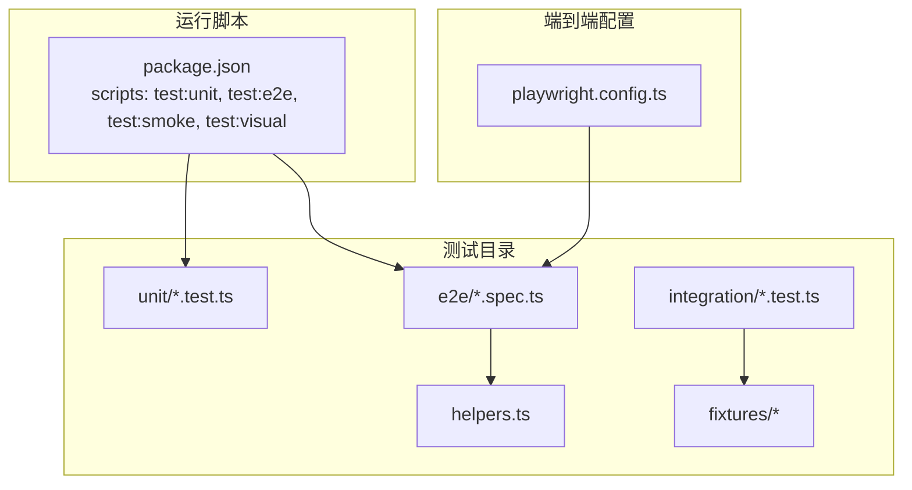
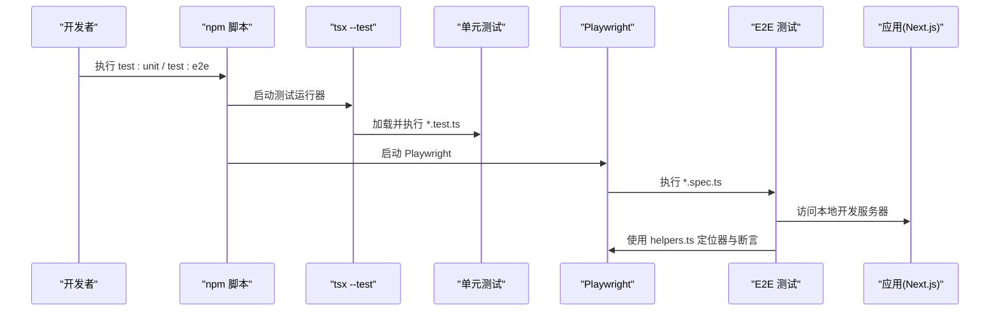
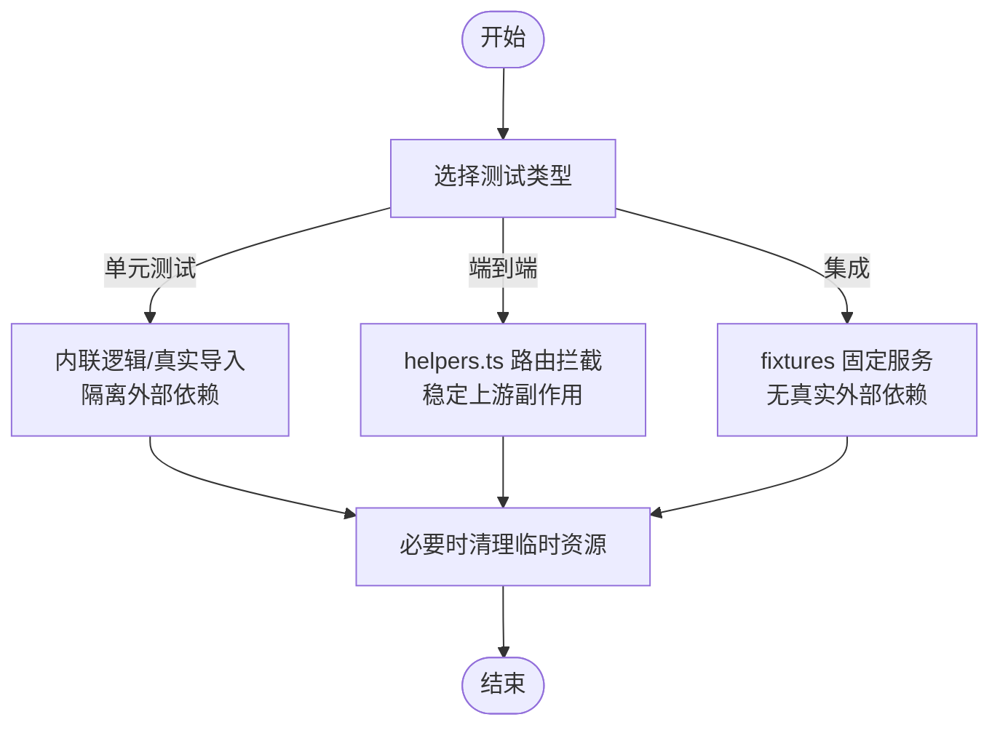
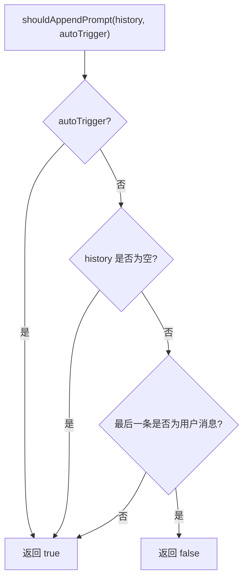
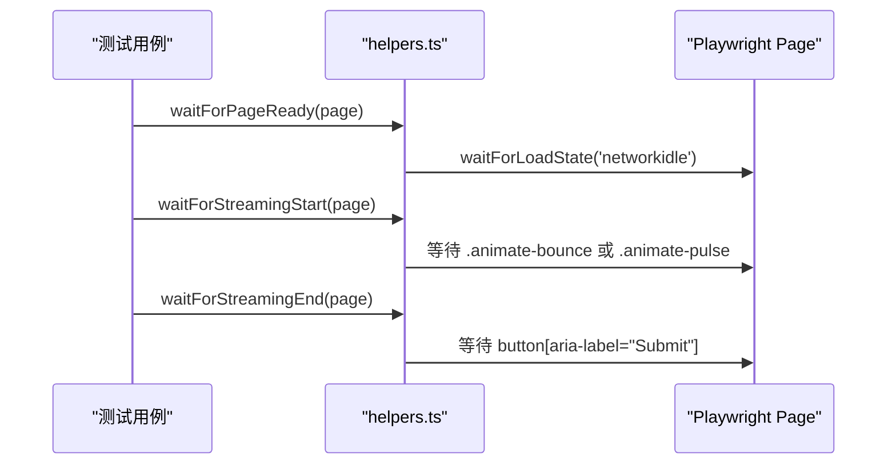
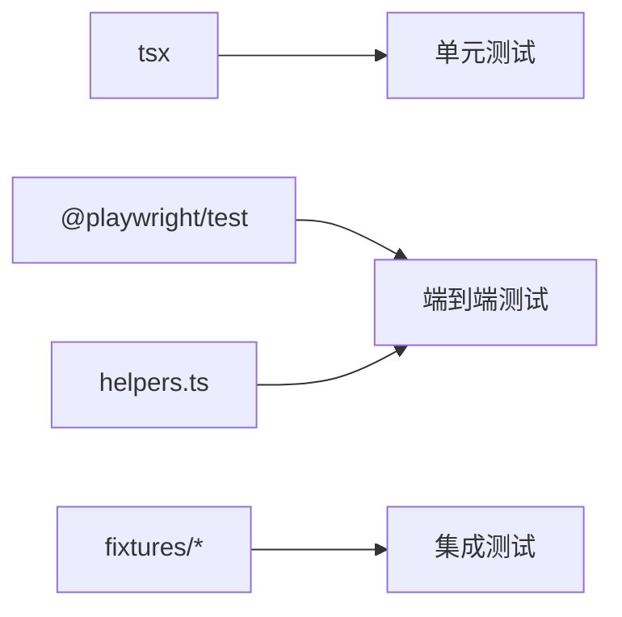

# 单元测试

<cite>
**本文引用的文件**   
- [package.json](file://package.json)
- [playwright.config.ts](file://playwright.config.ts)
- [src/__tests__/helpers.ts](file://src/__tests__/helpers.ts)
- [src/__tests__/e2e/chat.spec.ts](file://src/__tests__/e2e/chat.spec.ts)
- [src/__tests__/unit/agent-loop-messages.test.ts](file://src/__tests__/unit/agent-loop-messages.test.ts)
- [src/__tests__/unit/context-assembler.test.ts](file://src/__tests__/unit/context-assembler.test.ts)
- [src/__tests__/fixtures/fixture-mcp-server.ts](file://src/__tests__/fixtures/fixture-mcp-server.ts)
- [src/__tests__/integration/warm-query-poc.test.ts](file://src/__tests__/integration/warm-query-poc.test.ts)
- [src/__tests__/integration/provider-resolver.test.ts](file://src/__tests__/integration/provider-resolver.test.ts)
</cite>

## 目录
1. [简介](#简介)
2. [项目结构](#项目结构)
3. [核心组件](#核心组件)
4. [架构总览](#架构总览)
5. [详细组件分析](#详细组件分析)
6. [依赖分析](#依赖分析)
7. [性能考虑](#性能考虑)
8. [故障排查指南](#故障排查指南)
9. [结论](#结论)
10. [附录](#附录)

## 简介
本指南面向 CodePilot 的测试体系，系统性阐述单元测试的实施方法与最佳实践，覆盖以下主题：
- Jest/Node:test 风格的测试运行与配置
- 测试文件命名规范与组织结构
- Mock 策略：数据库连接、API 调用、外部依赖
- 具体测试示例：业务逻辑、工具函数、集成/端到端
- 测试覆盖率与数据准备
- 异步测试处理与常见模式：断言、异常、边界条件

## 项目结构
测试目录采用按类型分层的组织方式：
- 单元测试：src/__tests__/unit/*.test.ts
- 集成测试：src/__tests__/integration/*.test.ts
- 端到端测试：src/__tests__/e2e/*.spec.ts
- 辅助工具：src/__tests__/helpers.ts
- 固定数据/夹具：src/__tests__/fixtures/*

**图表来源**
- [package.json:23-28](file://package.json#L23-L28)
- [playwright.config.ts:1-25](file://playwright.config.ts#L1-L25)

**章节来源**
- [package.json:17-28](file://package.json#L17-L28)
- [playwright.config.ts:1-25](file://playwright.config.ts#L1-L25)

## 核心组件
- 测试运行器与脚本
  - 使用 tsx --test 运行单元测试，统一入口为 npm 脚本 test:unit
  - 端到端测试通过 Playwright，脚本 test:e2e、test:smoke、test:visual
- 测试辅助库
  - helpers.ts 提供页面导航、等待、定位器与断言辅助，用于 E2E 场景
- 夹具与固定数据
  - fixtures 提供可复用的 MCP 服务示例，便于集成测试

**章节来源**
- [package.json:23-28](file://package.json#L23-L28)
- [src/__tests__/helpers.ts:1-515](file://src/__tests__/helpers.ts#L1-L515)
- [src/__tests__/fixtures/fixture-mcp-server.ts:1-46](file://src/__tests__/fixtures/fixture-mcp-server.ts#L1-L46)

## 架构总览
下图展示测试执行路径与关键交互：

**图表来源**
- [package.json:23-28](file://package.json#L23-L28)
- [playwright.config.ts:19-23](file://playwright.config.ts#L19-L23)
- [src/__tests__/e2e/chat.spec.ts:1-194](file://src/__tests__/e2e/chat.spec.ts#L1-L194)
- [src/__tests__/helpers.ts:1-515](file://src/__tests__/helpers.ts#L1-L515)

## 详细组件分析

### 测试运行与配置
- 单元测试
  - 命令：npm run test:unit
  - 运行器：tsx --test
  - 目标：src/__tests__/unit/*.test.ts
- 端到端测试
  - 命令：npm run test:e2e、test:smoke、test:visual
  - 配置：playwright.config.ts 指定 testDir、并发、重试、报告器、trace 等
  - 应用：本地开发服务器 http://localhost:3000
- 集成测试
  - 示例：warm-query-poc.test.ts 展示对 Claude Agent SDK 的预热查询性能评估
  - 示例：provider-resolver.test.ts 展示对供应商解析与环境注入的断言

**章节来源**
- [package.json:23-28](file://package.json#L23-L28)
- [playwright.config.ts:1-25](file://playwright.config.ts#L1-L25)
- [src/__tests__/integration/warm-query-poc.test.ts:1-176](file://src/__tests__/integration/warm-query-poc.test.ts#L1-L176)
- [src/__tests__/integration/provider-resolver.test.ts:1-800](file://src/__tests__/integration/provider-resolver.test.ts#L1-L800)

### 测试文件命名规范与组织结构
- 单元测试：unit/*.test.ts
- 集成测试：integration/*.test.ts（含 -poc.test.ts）
- 端到端测试：e2e/*.spec.ts
- 辅助工具：helpers.ts
- 夹具：fixtures/*

命名建议
- 以被测模块名作为前缀，如 context-assembler.test.ts
- 行为驱动：描述具体行为或场景，如 agent-loop-messages.test.ts
- 集成/端到端：以 .spec.ts 结尾，便于区分

**章节来源**
- [src/__tests__/unit/agent-loop-messages.test.ts:1-132](file://src/__tests__/unit/agent-loop-messages.test.ts#L1-L132)
- [src/__tests__/unit/context-assembler.test.ts:1-118](file://src/__tests__/unit/context-assembler.test.ts#L1-L118)
- [src/__tests__/e2e/chat.spec.ts:1-194](file://src/__tests__/e2e/chat.spec.ts#L1-L194)

### Mock 策略与外部依赖隔离
- 数据库连接
  - 在纯单元测试中避免真实数据库访问，通过“内联逻辑”或“真实导入但隔离 IO”的方式验证核心逻辑
  - 示例：agent-loop-messages.test.ts 将去重逻辑内联在测试文件中，避免依赖 DB/流式基础设施
- API 调用
  - 端到端场景使用 helpers.ts 中的路由拦截禁用上游更新弹窗，确保稳定性
  - 集成场景使用 fixtures 中的 MCP 服务示例，避免真实外部服务
- 外部依赖
  - 使用真实模块导入时，注意临时文件与资源清理（见 message-builder 测试中的临时目录清理）

**图表来源**
- [src/__tests__/unit/agent-loop-messages.test.ts:15-48](file://src/__tests__/unit/agent-loop-messages.test.ts#L15-L48)
- [src/__tests__/helpers.ts:14-32](file://src/__tests__/helpers.ts#L14-L32)
- [src/__tests__/fixtures/fixture-mcp-server.ts:16-45](file://src/__tests__/fixtures/fixture-mcp-server.ts#L16-L45)

**章节来源**
- [src/__tests__/unit/agent-loop-messages.test.ts:15-48](file://src/__tests__/unit/agent-loop-messages.test.ts#L15-L48)
- [src/__tests__/helpers.ts:14-32](file://src/__tests__/helpers.ts#L14-L32)
- [src/__tests__/fixtures/fixture-mcp-server.ts:16-45](file://src/__tests__/fixtures/fixture-mcp-server.ts#L16-L45)

### 具体测试示例

#### 业务逻辑测试：消息构建与去重
- agent-loop-messages.test.ts
  - 内联函数：验证 agent-loop 去重策略（自动触发、历史为空、最后一条为用户消息等）
  - 真实导入：对 message-builder 的 buildCoreMessages 进行断言，覆盖文本合并、multipart 内容、心跳 ACK 跳过、缺失文件回退等

**图表来源**
- [src/__tests__/unit/agent-loop-messages.test.ts:17-25](file://src/__tests__/unit/agent-loop-messages.test.ts#L17-L25)

**章节来源**
- [src/__tests__/unit/agent-loop-messages.test.ts:17-48](file://src/__tests__/unit/agent-loop-messages.test.ts#L17-L48)
- [src/__tests__/unit/agent-loop-messages.test.ts:52-131](file://src/__tests__/unit/agent-loop-messages.test.ts#L52-L131)

#### 工具函数测试：上下文组装
- context-assembler.test.ts
  - 断言不同入口点（desktop/bridge）、会话类型、系统提示拼接顺序与生成式 UI 开关

**章节来源**
- [src/__tests__/unit/context-assembler.test.ts:41-117](file://src/__tests__/unit/context-assembler.test.ts#L41-L117)

#### 集成测试：MCP 固定服务
- fixture-mcp-server.ts
  - 提供三个确定性工具：ping、fail_always、echo，用于集成测试的稳定输入

**章节来源**
- [src/__tests__/fixtures/fixture-mcp-server.ts:16-45](file://src/__tests__/fixtures/fixture-mcp-server.ts#L16-L45)

#### 端到端测试：聊天页面
- chat.spec.ts
  - 页面加载时间、控制台错误过滤、空状态、输入框占位符、发送按钮、停止按钮、URL 更新、侧边栏会话列表等
  - 使用 helpers.ts 的导航与等待辅助函数

**章节来源**
- [src/__tests__/e2e/chat.spec.ts:20-194](file://src/__tests__/e2e/chat.spec.ts#L20-L194)
- [src/__tests__/helpers.ts:34-98](file://src/__tests__/helpers.ts#L34-L98)

### 异步测试处理与常见模式
- 异步断言
  - 端到端：waitForStreamingStart/End、waitForPageReady、expectPageLoadTime
  - 集成：measureLatencies 收集首次事件与首次文本时间
- 异常测试
  - warm-query-poc.test.ts 中 fail_always 抛出错误，验证错误路径
- 边界条件
  - message-builder 对缺失文件回退、心跳 ACK 跳过、multipart 合并等边界进行断言

**图表来源**
- [src/__tests__/helpers.ts:80-98](file://src/__tests__/helpers.ts#L80-L98)

**章节来源**
- [src/__tests__/helpers.ts:80-98](file://src/__tests__/helpers.ts#L80-L98)
- [src/__tests__/integration/warm-query-poc.test.ts:43-71](file://src/__tests__/integration/warm-query-poc.test.ts#L43-L71)

## 依赖分析
- 测试运行依赖
  - tsx：运行 TypeScript 测试文件
  - @playwright/test：端到端测试框架
- 测试耦合度
  - helpers.ts 与 E2E 测试强耦合，提供稳定的定位器与等待策略
  - fixtures 与集成测试弱耦合，仅暴露工具与服务接口

**图表来源**
- [package.json:129-135](file://package.json#L129-L135)
- [playwright.config.ts:1-25](file://playwright.config.ts#L1-L25)

**章节来源**
- [package.json:129-135](file://package.json#L129-L135)
- [playwright.config.ts:1-25](file://playwright.config.ts#L1-L25)

## 性能考虑
- 端到端测试
  - 使用 trace: 'on-first-retry' 与 HTML 报告器，便于定位失败原因
  - 通过路由拦截禁用可能遮挡 UI 的弹窗，减少不稳定因素
- 集成测试
  - 使用固定 MCP 服务，避免网络抖动影响性能评估
  - warm-query-poc.test.ts 通过 includePartialMessages 精确测量首字节延迟

**章节来源**
- [playwright.config.ts:9-18](file://playwright.config.ts#L9-L18)
- [src/__tests__/helpers.ts:14-32](file://src/__tests__/helpers.ts#L14-L32)
- [src/__tests__/integration/warm-query-poc.test.ts:73-152](file://src/__tests__/integration/warm-query-poc.test.ts#L73-L152)

## 故障排查指南
- 控制台错误收集与过滤
  - collectConsoleErrors 收集页面错误
  - filterCriticalErrors 过滤 favicon/hydration/Warning/DevTools 等非关键错误
- 页面加载时间断言
  - expectPageLoadTime 在指定时间内断言页面完成加载
- 端到端调试
  - 使用 trace: 'on-first-retry' 生成报告，结合 waitForStreamingStart/End 等辅助函数定位问题

**章节来源**
- [src/__tests__/helpers.ts:485-515](file://src/__tests__/helpers.ts#L485-L515)
- [playwright.config.ts:12](file://playwright.config.ts#L12)

## 结论
本指南总结了 CodePilot 的测试实践：以 tsx --test 为核心运行单元测试，以 Playwright 驱动端到端测试，并通过 helpers.ts 与 fixtures 实现稳定的外部依赖隔离。建议在新增功能时遵循：
- 单元测试优先，尽量内联或真实导入关键逻辑
- 端到端测试关注用户路径与关键 UI 行为
- 集成测试使用固定服务与明确的断言标准
- 严格的数据准备与清理，确保可重复性

## 附录
- 运行命令参考
  - 单元测试：npm run test:unit
  - 端到端：npm run test:e2e
  - 烟雾测试：npm run test:smoke
  - 可视化回归：npm run test:visual
- 关键文件索引
  - 测试运行配置：package.json
  - 端到端配置：playwright.config.ts
  - E2E 辅助：src/__tests__/helpers.ts
  - 单元示例：src/__tests__/unit/*.test.ts
  - 集成示例：src/__tests__/integration/*.test.ts
  - 固定服务：src/__tests__/fixtures/*