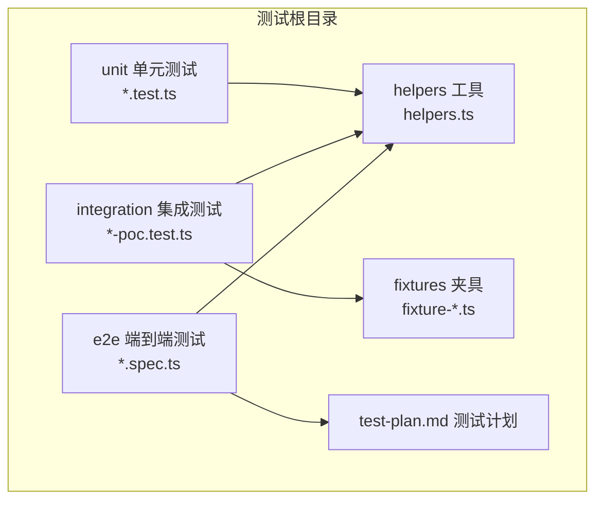
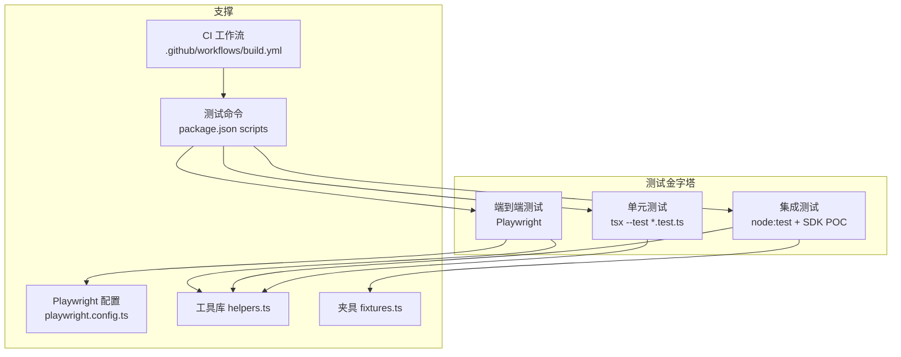
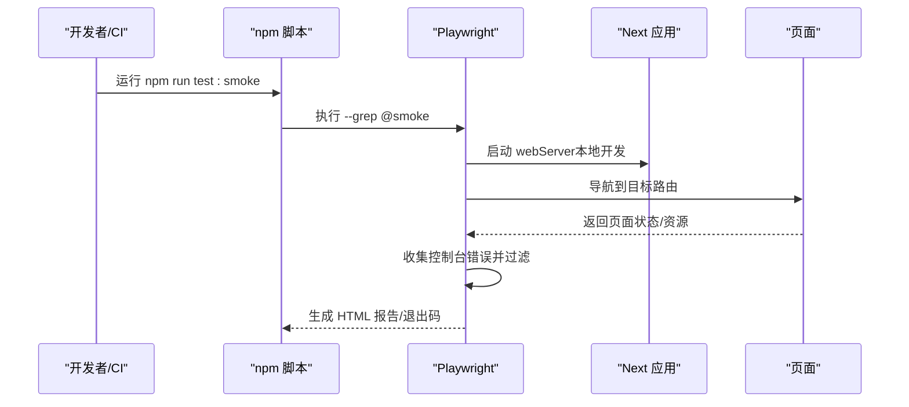
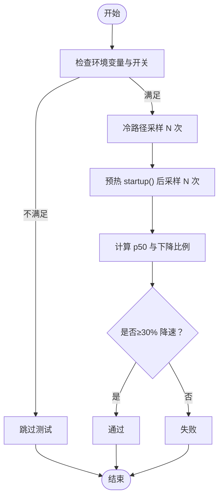
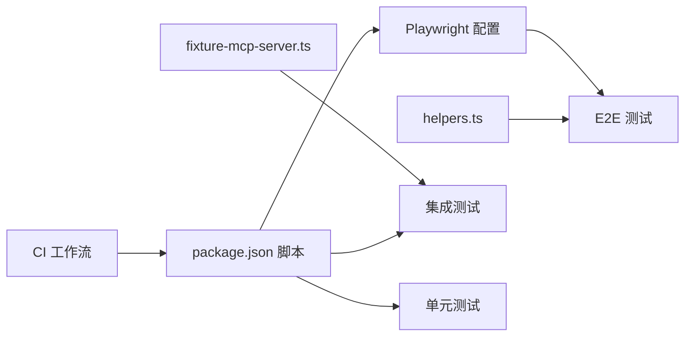

# 测试策略

<cite>
**本文引用的文件**
- [playwright.config.ts](file://playwright.config.ts)
- [package.json](file://package.json)
- [.github/workflows/build.yml](file://.github/workflows/build.yml)
- [src/__tests__/test-plan.md](file://src/__tests__/test-plan.md)
- [src/__tests__/helpers.ts](file://src/__tests__/helpers.ts)
- [src/__tests__/fixtures/fixture-mcp-server.ts](file://src/__tests__/fixtures/fixture-mcp-server.ts)
- [src/__tests__/e2e/smoke.spec.ts](file://src/__tests__/e2e/smoke.spec.ts)
- [src/__tests__/e2e/chat.spec.ts](file://src/__tests__/e2e/chat.spec.ts)
- [src/__tests__/e2e/plugins.spec.ts](file://src/__tests__/e2e/plugins.spec.ts)
- [src/__tests__/e2e/visual-regression.spec.ts](file://src/__tests__/e2e/visual-regression.spec.ts)
- [src/__tests__/integration/warm-query-poc.test.ts](file://src/__tests__/integration/warm-query-poc.test.ts)
- [src/__tests__/integration/hooks-poc.test.ts](file://src/__tests__/integration/hooks-poc.test.ts)
- [src/__tests__/integration/multi-defer-poc.test.ts](file://src/__tests__/integration/multi-defer-poc.test.ts)
- [src/__tests__/unit/claude-settings-credentials.test.ts](file://src/__tests__/unit/claude-settings-credentials.test.ts)
</cite>

## 目录
1. [引言](#引言)
2. [项目结构](#项目结构)
3. [核心组件](#核心组件)
4. [架构总览](#架构总览)
5. [详细组件分析](#详细组件分析)
6. [依赖关系分析](#依赖关系分析)
7. [性能考量](#性能考量)
8. [故障排查指南](#故障排查指南)
9. [结论](#结论)
10. [附录](#附录)

## 引言
本文件为 CodePilot 项目的测试策略与实施指南，围绕测试金字塔（单元测试、集成测试、端到端测试）进行系统化设计，覆盖 API 测试、UI 测试、组件测试、性能测试、安全测试与兼容性测试。文档基于仓库现有 Playwright、Node:test 与 tsx 的测试基础设施，结合 CI 工作流，给出可操作的测试文件组织、用例编写规范、Mock 策略、测试数据准备与环境配置建议，并提供在持续集成中执行测试的实践路径。

## 项目结构
测试相关代码集中于 src/__tests__ 目录，按“测试类型/子目录 + 具体用例”的方式组织，辅以共享工具与夹具：
- 单元测试：src/__tests__/unit/*.test.ts
- 集成测试：src/__tests__/integration/*.test.ts（含 POC）
- 端到端测试：src/__tests__/e2e/*.spec.ts
- 共享工具：src/__tests__/helpers.ts
- 夹具：src/__tests__/fixtures/*
- 测试计划与报告：src/__tests__/test-plan.md、src/__tests__/test-report.md
- 截图与视觉回归：src/__tests__/screenshots、src/__tests__/e2e/visual-regression.spec.ts

图表来源
- [src/__tests__/test-plan.md](file://src/__tests__/test-plan.md)
- [src/__tests__/helpers.ts](file://src/__tests__/helpers.ts)
- [src/__tests__/fixtures/fixture-mcp-server.ts](file://src/__tests__/fixtures/fixture-mcp-server.ts)

章节来源
- [src/__tests__/test-plan.md](file://src/__tests__/test-plan.md)
- [src/__tests__/helpers.ts](file://src/__tests__/helpers.ts)

## 核心组件
- Playwright 配置与运行参数：定义测试目录、并行度、重试、工作进程、报告器、trace、webServer 启动等。
- 测试脚本与命令：通过 package.json 中的 npm scripts 统一入口，支持单元测试、冒烟测试、端到端测试、可视化回归、SDK POC 等。
- CI 工作流：GitHub Actions 将 Lint、Typecheck、Unit、冒烟测试作为构建前置步骤，确保质量门槛。
- 测试工具库：helpers.ts 提供页面导航、等待、断言、定位器与控制台错误收集等通用能力；fixtures 提供 MCP 服务器等本地化依赖。

章节来源
- [playwright.config.ts](file://playwright.config.ts)
- [package.json](file://package.json)
- [.github/workflows/build.yml](file://.github/workflows/build.yml)
- [src/__tests__/helpers.ts](file://src/__tests__/helpers.ts)
- [src/__tests__/fixtures/fixture-mcp-server.ts](file://src/__tests__/fixtures/fixture-mcp-server.ts)

## 架构总览
下图展示测试金字塔在本项目中的落地：最底层是单元测试，中间层是集成测试（含 SDK POC），最上层是端到端测试（含冒烟与可视化回归）。Playwright 作为 E2E 执行引擎，Node:test 与 tsx 支持集成与单元测试；helpers.ts 与 fixtures.ts 为测试提供稳定、可复用的支撑。

图表来源
- [playwright.config.ts](file://playwright.config.ts)
- [package.json](file://package.json)
- [.github/workflows/build.yml](file://.github/workflows/build.yml)
- [src/__tests__/helpers.ts](file://src/__tests__/helpers.ts)
- [src/__tests__/fixtures/fixture-mcp-server.ts](file://src/__tests__/fixtures/fixture-mcp-server.ts)

## 详细组件分析

### 测试文件组织与命名规范
- 单元测试：位于 src/__tests__/unit，文件名以 .test.ts 结尾，使用 Node:test 语法，适合纯函数、工具模块与业务逻辑验证。
- 集成测试：位于 src/__tests__/integration，文件名以 -poc.test.ts 结尾，用于对真实 SDK 或外部服务进行能力验证（如 warm-query、hooks、multi-defer）。
- 端到端测试：位于 src/__tests__/e2e，文件名以 .spec.ts 结尾，使用 Playwright 断言与交互，覆盖页面渲染、用户流程与可视化回归。
- 共享工具：helpers.ts 提供导航、等待、断言、定位器与控制台错误过滤等；fixtures.ts 提供本地 MCP 服务器等稳定依赖。
- 命名约定：用例描述采用“动作 + 条件”语义，便于 grep 与分组执行；标签如 @smoke、@visual 用于筛选。

章节来源
- [src/__tests__/test-plan.md](file://src/__tests__/test-plan.md)
- [src/__tests__/helpers.ts](file://src/__tests__/helpers.ts)
- [src/__tests__/fixtures/fixture-mcp-server.ts](file://src/__tests__/fixtures/fixture-mcp-server.ts)

### Playwright 配置与运行参数
- 测试目录：testDir 指向 src/__tests__/e2e
- 并行与重试：CI 环境启用并行与重试，本地开发关闭并行以提升调试效率
- 报告器与 trace：HTML 报告器与首次重试时生成 trace，便于问题定位
- webServer：自动启动 Next 开发服务器，避免外部依赖
- 截图阈值：maxDiffPixelRatio 控制像素差异容忍度，保证视觉回归稳定

章节来源
- [playwright.config.ts](file://playwright.config.ts)

### 测试脚本与命令
- 单元测试：npm run test:unit 使用 tsx --test 运行 unit 目录下的所有测试
- 冒烟测试：npm run test:smoke 使用 --grep @smoke 运行标记的冒烟用例
- 端到端测试：npm run test:e2e 运行 e2e 目录下全部用例
- 可视化回归：npm run test:visual 使用 --grep @visual 运行视觉回归用例
- SDK POC：npm run test:sdk-poc 设置 CLAUDE_SDK_POC=1 运行集成 POC 测试
- 全量测试：npm test 先 typecheck 再执行单元测试

章节来源
- [package.json](file://package.json)

### CI 中的测试执行
- Lint 与 Typecheck：作为流水线前置步骤，确保代码质量
- 单元测试：在 lint-test job 中执行
- 冒烟测试：在 smoke-test job 中安装浏览器并运行 @smoke 用例
- 视觉回归：默认跳过，需本地手动更新基线或在 CI 中显式开启
- 报告上传：冒烟测试失败时上传 Playwright HTML 报告

章节来源
- [.github/workflows/build.yml](file://.github/workflows/build.yml)

### Mock 策略
- 页面级 Mock：helpers.ts 中通过 page.route 对特定 API（如应用更新弹窗接口）进行拦截，返回确定性响应，避免上游变更影响测试稳定性
- 外部服务 Mock：fixtures/fixture-mcp-server.ts 提供本地 MCP 工具集，包含 ping、fail_always、echo 等，用于集成测试中稳定地触发工具调用与错误路径
- 控制台错误过滤：helpers.ts 提供 collectConsoleErrors 与 filterCriticalErrors，剔除非关键错误，聚焦真实问题

章节来源
- [src/__tests__/helpers.ts](file://src/__tests__/helpers.ts)
- [src/__tests__/fixtures/fixture-mcp-server.ts](file://src/__tests__/fixtures/fixture-mcp-server.ts)

### API 测试实施方案
- 目标：验证后端路由与数据一致性，确保接口行为符合预期
- 方法：在 E2E 层通过 Playwright 访问路由并断言响应状态、内容与交互反馈；在集成测试层使用 Node:test 直接调用 SDK 查询并断言延迟、钩子回调与 stderr 行为
- 关键点：使用 helpers.ts 的 waitForStreamingStart/End 等等待策略；对可能产生控制帧污染的场景，通过 canUseTool 与 hooks 验证 SDK 行为

章节来源
- [src/__tests__/e2e/chat.spec.ts](file://src/__tests__/e2e/chat.spec.ts)
- [src/__tests__/integration/hooks-poc.test.ts](file://src/__tests__/integration/hooks-poc.test.ts)

### UI 测试实施方案
- 目标：验证页面渲染、交互元素可见性、布局与主题切换
- 方法：使用 helpers.ts 定位器（如 chatInput、sendButton、assistantMessage 等）与断言；对加载时间与无 JS 错误进行验收
- 关键点：禁用更新弹窗干扰；对滚动、动画与响应式布局进行断言

章节来源
- [src/__tests__/e2e/chat.spec.ts](file://src/__tests__/e2e/chat.spec.ts)
- [src/__tests__/e2e/smoke.spec.ts](file://src/__tests__/e2e/smoke.spec.ts)

### 组件测试实施方案
- 目标：验证 UI 组件在不同状态下的渲染与交互
- 方法：在 E2E 中通过 Playwright 操作组件并断言 DOM 状态；在单元测试中对纯函数与工具模块进行断言
- 关键点：组件定位器应尽量稳定（如 aria-label、role），避免文案变化导致断言失效

章节来源
- [src/__tests__/helpers.ts](file://src/__tests__/helpers.ts)
- [src/__tests__/unit/claude-settings-credentials.test.ts](file://src/__tests__/unit/claude-settings-credentials.test.ts)

### 性能测试
- 首 token 延迟：warm-query-poc.test.ts 通过 startup + query 组合测量冷热路径差异，要求 p50 降低≥30%
- 多并发延迟条目：multi-defer-poc.test.ts 分类 SDK 是否支持单轮多并发 defer，指导 UI 设计决策
- 加载时间与交互响应：helpers.ts 提供 expectPageLoadTime 与 waitForStreamingStart/End 等等待策略，结合测试计划中的验收标准

章节来源
- [src/__tests__/integration/warm-query-poc.test.ts](file://src/__tests__/integration/warm-query-poc.test.ts)
- [src/__tests__/integration/multi-defer-poc.test.ts](file://src/__tests__/integration/multi-defer-poc.test.ts)
- [src/__tests__/helpers.ts](file://src/__tests__/helpers.ts)
- [src/__tests__/test-plan.md](file://src/__tests__/test-plan.md)

### 安全测试
- 凭据桥接与回退：claude-settings-credentials.test.ts 验证 ~/.claude/settings.json 与 claude.json 的优先级、空值处理与异常情况，防止凭据丢失或错误注入
- 权限控制：hooks POC 中通过 canUseTool 拒绝特定工具，验证 PermissionDenied 钩子触发与 stderr 不被污染

章节来源
- [src/__tests__/unit/claude-settings-credentials.test.ts](file://src/__tests__/unit/claude-settings-credentials.test.ts)
- [src/__tests__/integration/hooks-poc.test.ts](file://src/__tests__/integration/hooks-poc.test.ts)

### 兼容性测试
- 多平台产物校验：CI 中对 Windows、macOS、Linux 的产物进行架构与签名检查，确保各平台安装包可用
- 浏览器与平台差异：Playwright 在 CI 中安装 Chromium，本地可扩展 Firefox/WebKit；通过 @visual 用例在不同机器上生成/对比快照

章节来源
- [.github/workflows/build.yml](file://.github/workflows/build.yml)
- [src/__tests__/e2e/visual-regression.spec.ts](file://src/__tests__/e2e/visual-regression.spec.ts)

### 端到端测试流程（序列图）
以下序列图展示冒烟测试从入口到结果的关键步骤，体现 Playwright 的启动、导航与断言流程。

图表来源
- [package.json](file://package.json)
- [playwright.config.ts](file://playwright.config.ts)
- [src/__tests__/e2e/smoke.spec.ts](file://src/__tests__/e2e/smoke.spec.ts)

### 集成测试（SDK POC）流程（流程图）
以下流程图展示 warm-query POC 的冷热路径采样与统计过程，体现延迟测量与阈值判定。

图表来源
- [src/__tests__/integration/warm-query-poc.test.ts](file://src/__tests__/integration/warm-query-poc.test.ts)

## 依赖关系分析
- 测试工具与夹具：helpers.ts 为 E2E 与部分集成测试提供统一定位器与等待策略；fixture-mcp-server.ts 为集成测试提供稳定的 MCP 工具集合
- Playwright 与 Next：playwright.config.ts 通过 webServer 自动启动 Next 开发服务器，减少外部依赖
- CI 与测试：build.yml 将 Lint、Typecheck、Unit、冒烟测试串联为流水线阶段，确保每次变更都经过基础质量门

图表来源
- [playwright.config.ts](file://playwright.config.ts)
- [package.json](file://package.json)
- [.github/workflows/build.yml](file://.github/workflows/build.yml)
- [src/__tests__/helpers.ts](file://src/__tests__/helpers.ts)
- [src/__tests__/fixtures/fixture-mcp-server.ts](file://src/__tests__/fixtures/fixture-mcp-server.ts)

章节来源
- [playwright.config.ts](file://playwright.config.ts)
- [package.json](file://package.json)
- [.github/workflows/build.yml](file://.github/workflows/build.yml)
- [src/__tests__/helpers.ts](file://src/__tests__/helpers.ts)
- [src/__tests__/fixtures/fixture-mcp-server.ts](file://src/__tests__/fixtures/fixture-mcp-server.ts)

## 性能考量
- 首 token 延迟：通过 warm-query POC 评估预热收益，要求 p50 降速≥30%，并记录采样来源以排除“消息级延迟”误判
- 多并发延迟条目：通过 multi-defer POC 判定 SDK 是否支持单轮多并发 defer，决定 UI 设计取舍
- 页面加载与交互：使用 helpers.ts 的等待与断言策略，结合测试计划中的验收阈值（如页面加载时间、无 JS 错误）

章节来源
- [src/__tests__/integration/warm-query-poc.test.ts](file://src/__tests__/integration/warm-query-poc.test.ts)
- [src/__tests__/integration/multi-defer-poc.test.ts](file://src/__tests__/integration/multi-defer-poc.test.ts)
- [src/__tests__/helpers.ts](file://src/__tests__/helpers.ts)
- [src/__tests__/test-plan.md](file://src/__tests__/test-plan.md)

## 故障排查指南
- 控制台错误：使用 helpers.ts 的 collectConsoleErrors 与 filterCriticalErrors，剔除 favicon、hydration、Warning、DevTools 等非关键错误，聚焦真实问题
- 更新弹窗干扰：通过 helpers.ts 的 disableUpdateDialog 对 /api/app/updates 进行拦截，避免更新提示遮挡弹窗影响测试
- 截图差异：调整 playwright.config.ts 中的 maxDiffPixelRatio，或在本地使用 --update-snapshots 更新基线
- CI 报告：冒烟测试失败时，下载 playwright-report 以查看 trace 与截图

章节来源
- [src/__tests__/helpers.ts](file://src/__tests__/helpers.ts)
- [playwright.config.ts](file://playwright.config.ts)
- [.github/workflows/build.yml](file://.github/workflows/build.yml)

## 结论
本测试策略以 Playwright 为核心驱动端到端测试，配合 Node:test 与 tsx 的单元/集成测试，形成完整的测试金字塔。通过 helpers.ts 与 fixtures.ts 提供稳定、可复用的支撑，结合 CI 的质量门禁，确保功能正确性、性能表现与跨平台兼容性。建议在后续迭代中逐步完善可视化回归与 API 层断言，持续优化测试覆盖率与执行效率。

## 附录
- 测试计划与验收标准：参考 src/__tests__/test-plan.md 中的页面渲染、聊天流程、插件管理、设置页、布局功能、项目面板、技能编辑器与聊天 UI 增强等验收指标
- 视觉回归：参考 src/__tests__/e2e/visual-regression.spec.ts，使用 @visual 标签与 --update-snapshots 更新基线
- SDK POC：参考 src/__tests__/integration/*-poc.test.ts，结合 CLAUDE_SDK_POC 环境变量启用

章节来源
- [src/__tests__/test-plan.md](file://src/__tests__/test-plan.md)
- [src/__tests__/e2e/visual-regression.spec.ts](file://src/__tests__/e2e/visual-regression.spec.ts)
- [src/__tests__/integration/warm-query-poc.test.ts](file://src/__tests__/integration/warm-query-poc.test.ts)
- [src/__tests__/integration/hooks-poc.test.ts](file://src/__tests__/integration/hooks-poc.test.ts)
- [src/__tests__/integration/multi-defer-poc.test.ts](file://src/__tests__/integration/multi-defer-poc.test.ts)