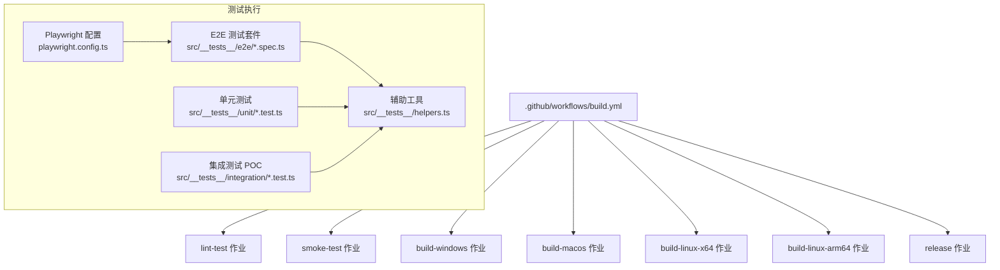
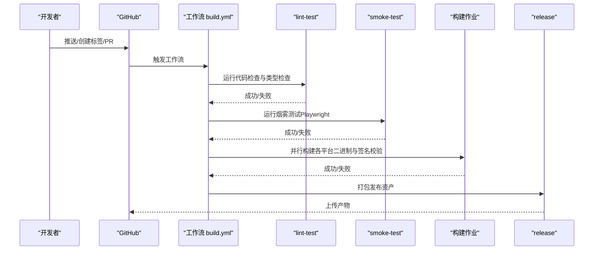
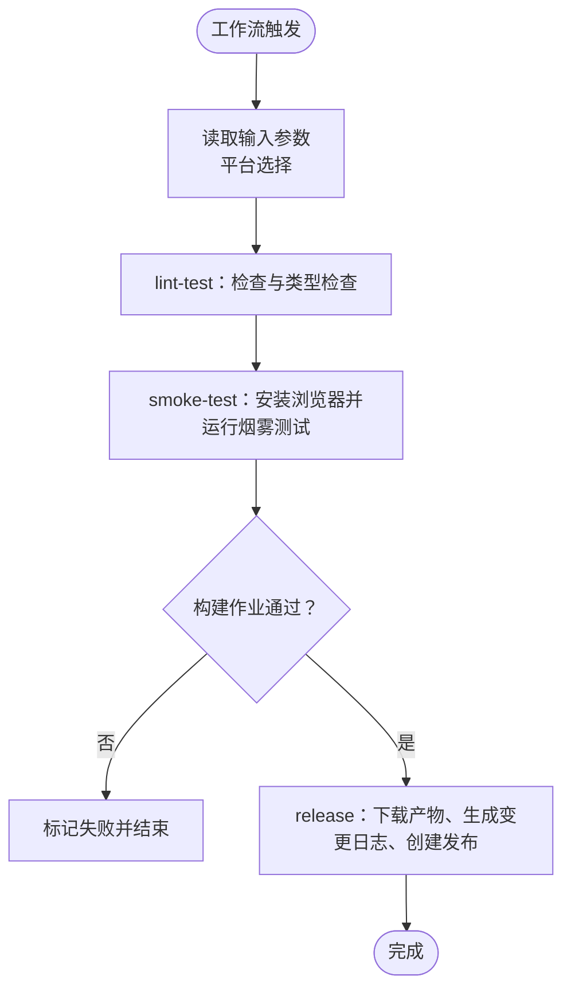
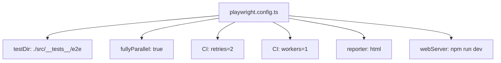
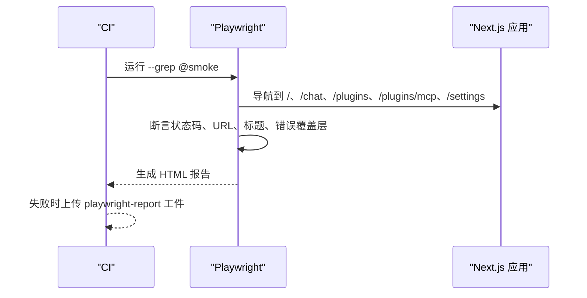
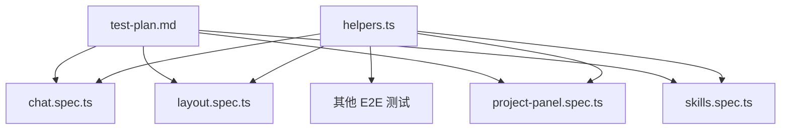
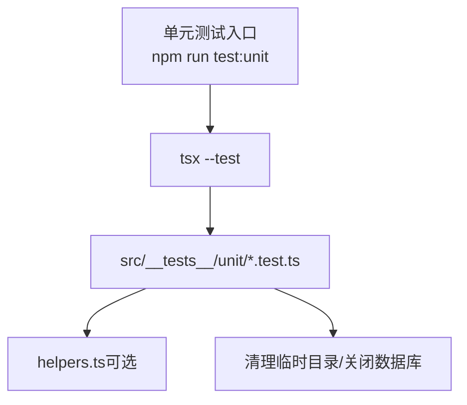
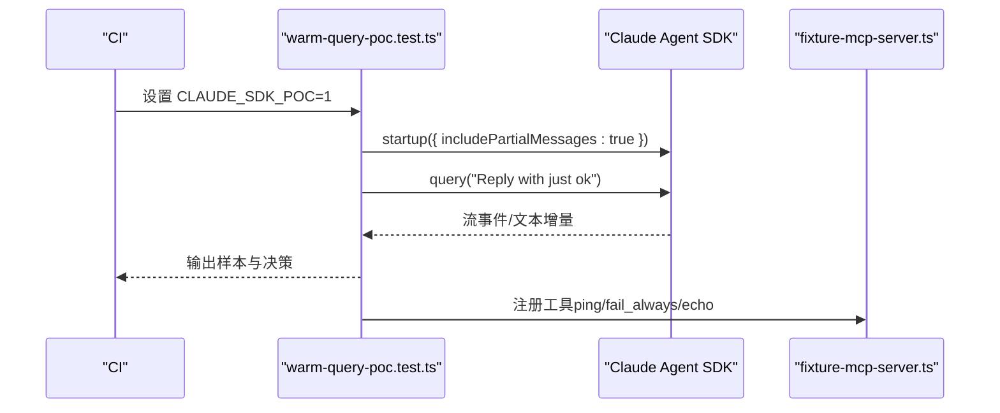
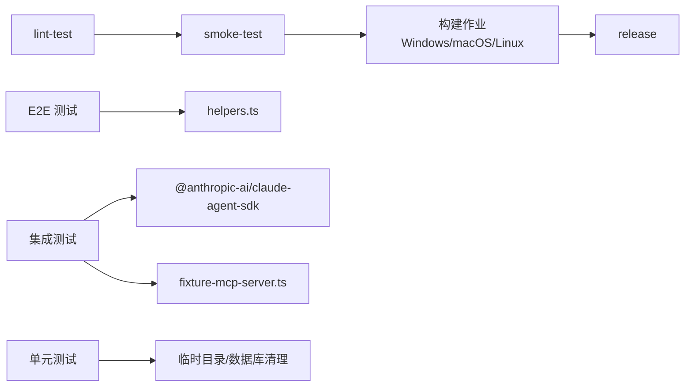

# 测试自动化

<cite>
**本文引用的文件**
- [.github/workflows/build.yml](file://.github/workflows/build.yml)
- [package.json](file://package.json)
- [playwright.config.ts](file://playwright.config.ts)
- [src/__tests__/e2e/smoke.spec.ts](file://src/__tests__/e2e/smoke.spec.ts)
- [src/__tests__/e2e/chat.spec.ts](file://src/__tests__/e2e/chat.spec.ts)
- [src/__tests__/e2e/layout.spec.ts](file://src/__tests__/e2e/layout.spec.ts)
- [src/__tests__/e2e/project-panel.spec.ts](file://src/__tests__/e2e/project-panel.spec.ts)
- [src/__tests__/helpers.ts](file://src/__tests__/helpers.ts)
- [src/__tests__/smoke-test.ts](file://src/__tests__/smoke-test.ts)
- [src/__tests__/unit/assistant-workspace.test.ts](file://src/__tests__/unit/assistant-workspace.test.ts)
- [src/__tests__/integration/warm-query-poc.test.ts](file://src/__tests__/integration/warm-query-poc.test.ts)
- [src/__tests__/fixtures/fixture-mcp-server.ts](file://src/__tests__/fixtures/fixture-mcp-server.ts)
- [src/__tests__/test-plan.md](file://src/__tests__/test-plan.md)
</cite>

## 目录
1. [简介](#简介)
2. [项目结构](#项目结构)
3. [核心组件](#核心组件)
4. [架构总览](#架构总览)
5. [详细组件分析](#详细组件分析)
6. [依赖关系分析](#依赖关系分析)
7. [性能考量](#性能考量)
8. [故障排查指南](#故障排查指南)
9. [结论](#结论)
10. [附录](#附录)

## 简介
本文件面向 CodePilot 的测试自动化流水线，系统化梳理 GitHub Actions 工作流配置、测试触发条件、矩阵与并行执行策略，并对持续集成中的单元测试、集成测试、端到端测试进行分层说明。文档还覆盖测试报告生成、覆盖率统计、测试结果通知的配置思路；测试环境管理、依赖安装与缓存策略；以及测试失败处理、重试机制与测试数据清理的自动化实践建议。

## 项目结构
围绕测试自动化，仓库的关键目录与文件如下：
- GitHub Actions 工作流：.github/workflows/build.yml
- 测试脚本与 Playwright 配置：package.json、playwright.config.ts
- 端到端测试：src/__tests__/e2e/*.spec.ts
- 辅助工具与断言：src/__tests__/helpers.ts
- 旧版烟雾测试脚本：src/__tests__/smoke-test.ts
- 单元测试：src/__tests__/unit/*.test.ts
- 集成测试（POC）：src/__tests__/integration/*.test.ts
- 测试夹具：src/__tests__/fixtures/*.ts
- 测试计划与文件结构：src/__tests__/test-plan.md

图表来源
- [.github/workflows/build.yml:25-476](file://.github/workflows/build.yml#L25-L476)
- [playwright.config.ts:1-25](file://playwright.config.ts#L1-L25)
- [package.json:17-37](file://package.json#L17-L37)

章节来源
- [.github/workflows/build.yml:1-476](file://.github/workflows/build.yml#L1-L476)
- [package.json:17-37](file://package.json#L17-L37)
- [playwright.config.ts:1-25](file://playwright.config.ts#L1-L25)

## 核心组件
- GitHub Actions 工作流
  - 触发条件：手动触发、拉取请求、推送标签
  - 作业编排：lint-test → smoke-test → 并行构建与签名验证 → 发布
- Playwright 配置
  - 测试目录、并行度、重试次数、报告器、Web 服务器启动
- 测试脚本与命令
  - 单元测试、烟雾测试、端到端测试、可视化回归测试、集成 POC
- 测试辅助工具
  - 页面导航、等待、断言、定位器、控制台错误收集与过滤

章节来源
- [.github/workflows/build.yml:3-25](file://.github/workflows/build.yml#L3-L25)
- [playwright.config.ts:3-24](file://playwright.config.ts#L3-L24)
- [package.json:23-26](file://package.json#L23-L26)

## 架构总览
下图展示从触发到产物发布的测试自动化流水线，以及测试类型在 CI 中的分布与依赖关系。

图表来源
- [.github/workflows/build.yml:25-476](file://.github/workflows/build.yml#L25-L476)

## 详细组件分析

### GitHub Actions 工作流配置
- 触发条件
  - 手动触发：可选择目标平台（all/windows/macos/linux）
  - PR：针对 main 分支
  - 推送：匹配 v* 标签时触发发布
- 作业与依赖
  - lint-test：运行代码检查与类型检查
  - smoke-test：安装浏览器依赖后运行烟雾测试，失败时上传 Playwright 报告
  - 构建作业：Windows/macOS/Linux（x64/arm64）并行执行，含签名与校验
  - release：下载所有构建产物，合并校验和，生成变更日志并创建发布
- 缓存与环境
  - 使用 actions/setup-node@v4 的 npm 缓存
  - macOS 作业使用签名证书（Secrets），Linux 作业使用 arm64 runner 标签

图表来源
- [.github/workflows/build.yml:3-25](file://.github/workflows/build.yml#L3-L25)
- [.github/workflows/build.yml:25-476](file://.github/workflows/build.yml#L25-L476)

章节来源
- [.github/workflows/build.yml:3-25](file://.github/workflows/build.yml#L3-L25)
- [.github/workflows/build.yml:25-476](file://.github/workflows/build.yml#L25-L476)

### Playwright 配置与测试执行策略
- 配置要点
  - testDir 指向 E2E 测试目录
  - fullyParallel 启用完全并行
  - CI 环境启用 retries=2，workers=1 以稳定并发
  - reporter 使用 HTML 报告
  - webServer 自动启动本地开发服务，支持复用现有进程
- 执行策略
  - 使用 npx playwright test 运行全部 E2E
  - 使用 --grep @smoke 运行烟雾测试
  - 使用 --grep @visual 运行可视化回归测试

图表来源
- [playwright.config.ts:3-24](file://playwright.config.ts#L3-L24)

章节来源
- [playwright.config.ts:1-25](file://playwright.config.ts#L1-L25)
- [package.json:24-26](file://package.json#L24-L26)

### 烟雾测试（Smoke Test）
- 作用：快速验证首页重定向、聊天页、插件页、MCP 管理页、设置页等核心路由加载与无错误
- 执行方式
  - 旧版脚本：src/__tests__/smoke-test.ts（已标注弃用）
  - 推荐：使用 Playwright 套件 src/__tests__/e2e/smoke.spec.ts，配合 npx playwright test --grep @smoke
- 失败处理
  - CI 中失败自动上传 playwright-report 目录作为工件

图表来源
- [.github/workflows/build.yml:65-74](file://.github/workflows/build.yml#L65-L74)
- [src/__tests__/e2e/smoke.spec.ts:1-92](file://src/__tests__/e2e/smoke.spec.ts#L1-L92)

章节来源
- [src/__tests__/e2e/smoke.spec.ts:1-92](file://src/__tests__/e2e/smoke.spec.ts#L1-L92)
- [.github/workflows/build.yml:65-74](file://.github/workflows/build.yml#L65-L74)

### 端到端测试（E2E）
- 测试范围
  - 聊天页面渲染、消息发送与流式响应、停止生成、历史会话、侧边栏与布局、项目面板（V2/V3）、技能编辑器、UI 增强等
- 结构与约定
  - 测试文件按功能模块划分（chat、plugins、settings、layout、project-panel、skills、chat-enhanced 等）
  - 使用 helpers.ts 提供统一的导航、等待、断言与定位器
- 测试计划
  - test-plan.md 描述了端到端测试的整体规划、验收标准与文件结构

图表来源
- [src/__tests__/helpers.ts:1-515](file://src/__tests__/helpers.ts#L1-L515)
- [src/__tests__/e2e/chat.spec.ts:1-194](file://src/__tests__/e2e/chat.spec.ts#L1-L194)
- [src/__tests__/e2e/layout.spec.ts:1-349](file://src/__tests__/e2e/layout.spec.ts#L1-L349)
- [src/__tests__/e2e/project-panel.spec.ts:1-159](file://src/__tests__/e2e/project-panel.spec.ts#L1-L159)
- [src/__tests__/test-plan.md:1-382](file://src/__tests__/test-plan.md#L1-L382)

章节来源
- [src/__tests__/e2e/chat.spec.ts:1-194](file://src/__tests__/e2e/chat.spec.ts#L1-L194)
- [src/__tests__/e2e/layout.spec.ts:1-349](file://src/__tests__/e2e/layout.spec.ts#L1-L349)
- [src/__tests__/e2e/project-panel.spec.ts:1-159](file://src/__tests__/e2e/project-panel.spec.ts#L1-L159)
- [src/__tests__/helpers.ts:1-515](file://src/__tests__/helpers.ts#L1-L515)
- [src/__tests__/test-plan.md:1-382](file://src/__tests__/test-plan.md#L1-L382)

### 单元测试（Unit Test）
- 执行方式：npm run test:unit（基于 tsx --test）
- 示例：assistant-workspace.test.ts 展示了临时目录隔离、数据库初始化、状态持久化、工作区索引与检索等逻辑的测试
- 最佳实践
  - 使用临时目录隔离文件系统操作
  - 在导入前设置环境变量（如数据目录）
  - 清理资源（删除临时目录、关闭数据库）

图表来源
- [package.json](file://package.json#L23)
- [src/__tests__/unit/assistant-workspace.test.ts:1-613](file://src/__tests__/unit/assistant-workspace.test.ts#L1-L613)

章节来源
- [package.json](file://package.json#L23)
- [src/__tests__/unit/assistant-workspace.test.ts:1-613](file://src/__tests__/unit/assistant-workspace.test.ts#L1-L613)

### 集成测试（Integration POC）
- 目标：验证 Claude Agent SDK 的预热查询（WarmQuery）是否能显著降低首 token 延迟（≥30% p50）
- 关键点
  - 使用 @anthropic-ai/claude-agent-sdk 的 startup/query
  - includePartialMessages 必须为 true 以测量首字符延迟
  - 记录结果至文档并进行决策判定
- 夹具：fixture-mcp-server.ts 提供确定性工具（ping、fail_always、echo）用于 POC

图表来源
- [src/__tests__/integration/warm-query-poc.test.ts:1-176](file://src/__tests__/integration/warm-query-poc.test.ts#L1-L176)
- [src/__tests__/fixtures/fixture-mcp-server.ts:1-46](file://src/__tests__/fixtures/fixture-mcp-server.ts#L1-L46)

章节来源
- [src/__tests__/integration/warm-query-poc.test.ts:1-176](file://src/__tests__/integration/warm-query-poc.test.ts#L1-L176)
- [src/__tests__/fixtures/fixture-mcp-server.ts:1-46](file://src/__tests__/fixtures/fixture-mcp-server.ts#L1-L46)

### 测试报告生成与通知
- 报告生成
  - Playwright 使用 HTML 报告器，输出 HTML 报告
  - CI 中失败时上传 playwright-report 作为工件
- 覆盖率统计
  - 当前未见覆盖率收集脚本或配置，可在后续引入（例如 Jest 或其他覆盖率工具）
- 结果通知
  - 可结合 GitHub Checks 或第三方通知服务（如 Slack/Webhook）在工作流完成后发送通知

章节来源
- [playwright.config.ts](file://playwright.config.ts#L9)
- [.github/workflows/build.yml:68-74](file://.github/workflows/build.yml#L68-L74)

### 测试环境管理、依赖安装与缓存
- Node.js 版本与缓存
  - actions/setup-node@v4 指定 Node 20，并启用 npm 缓存
- 依赖安装
  - npm ci 保证锁定版本一致性
- 浏览器依赖
  - npx playwright install --with-deps chromium 安装浏览器
- Web 服务器
  - playwright.config.ts 中 webServer 使用 npm run dev，支持复用现有进程

章节来源
- [.github/workflows/build.yml:31-34](file://.github/workflows/build.yml#L31-L34)
- [.github/workflows/build.yml](file://.github/workflows/build.yml#L62)
- [playwright.config.ts:19-23](file://playwright.config.ts#L19-L23)

### 测试失败处理、重试机制与数据清理
- 重试机制
  - Playwright 在 CI 中 retries=2，首次失败自动重试
- 失败处理
  - CI 中失败自动上传 playwright-report 工件，便于离线分析
- 数据清理
  - 单元测试使用临时目录并在结束后删除
  - 数据库连接在测试结束后关闭

章节来源
- [playwright.config.ts](file://playwright.config.ts#L7)
- [.github/workflows/build.yml:68-74](file://.github/workflows/build.yml#L68-L74)
- [src/__tests__/unit/assistant-workspace.test.ts:50-52](file://src/__tests__/unit/assistant-workspace.test.ts#L50-L52)
- [src/__tests__/unit/assistant-workspace.test.ts:608-612](file://src/__tests__/unit/assistant-workspace.test.ts#L608-L612)

## 依赖关系分析
- 工作流依赖
  - lint-test 是后续作业的前提
  - smoke-test 是构建作业的前提
  - 构建作业之间相互独立，可并行执行
- 测试依赖
  - E2E 测试依赖 helpers.ts 提供的导航与断言
  - 集成测试依赖 Claude Agent SDK 与夹具服务器
  - 单元测试依赖临时目录与数据库清理

图表来源
- [.github/workflows/build.yml:25-476](file://.github/workflows/build.yml#L25-L476)
- [src/__tests__/helpers.ts:1-515](file://src/__tests__/helpers.ts#L1-L515)
- [src/__tests__/integration/warm-query-poc.test.ts:24-29](file://src/__tests__/integration/warm-query-poc.test.ts#L24-L29)
- [src/__tests__/fixtures/fixture-mcp-server.ts:13-45](file://src/__tests__/fixtures/fixture-mcp-server.ts#L13-L45)
- [src/__tests__/unit/assistant-workspace.test.ts:21-52](file://src/__tests__/unit/assistant-workspace.test.ts#L21-L52)

章节来源
- [.github/workflows/build.yml:25-476](file://.github/workflows/build.yml#L25-L476)
- [src/__tests__/helpers.ts:1-515](file://src/__tests__/helpers.ts#L1-L515)

## 性能考量
- 并行与稳定性
  - Playwright fullyParallel=true 提升吞吐，但需注意资源竞争；CI 中 workers=1 降低干扰
  - retries=2 平衡误报与真实失败
- 启动与等待
  - waitForPageReady 与网络空闲状态确保页面稳定
  - webServer.reuseExistingServer=true 在非 CI 环境复用进程，减少冷启动
- 资源限制
  - macOS 构建作业设置超时，避免长时间挂起
  - Linux 构建作业校验产物架构，确保正确性

章节来源
- [playwright.config.ts:5-8](file://playwright.config.ts#L5-L8)
- [.github/workflows/build.yml:149-154](file://.github/workflows/build.yml#L149-L154)
- [.github/workflows/build.yml:226-270](file://.github/workflows/build.yml#L226-L270)

## 故障排查指南
- Playwright 报告
  - CI 失败时下载 playwright-report 工件，查看 HTML 报告与截图
- 控制台错误
  - helpers.ts 提供 collectConsoleErrors 与 filterCriticalErrors，过滤已知非关键错误
- 烟雾测试
  - 使用 npx playwright test --grep @smoke 快速验证核心路由
- 数据清理
  - 单元测试结束后删除临时目录并关闭数据库，避免磁盘占用与锁文件问题

章节来源
- [.github/workflows/build.yml:68-74](file://.github/workflows/build.yml#L68-L74)
- [src/__tests__/helpers.ts:485-515](file://src/__tests__/helpers.ts#L485-L515)
- [src/__tests__/unit/assistant-workspace.test.ts:50-52](file://src/__tests__/unit/assistant-workspace.test.ts#L50-L52)
- [src/__tests__/unit/assistant-workspace.test.ts:608-612](file://src/__tests__/unit/assistant-workspace.test.ts#L608-L612)

## 结论
本测试自动化流水线以 GitHub Actions 为核心，结合 Playwright 的 E2E 能力与 tsx 的单元测试，实现了从代码检查、烟雾测试到多平台构建与发布的全链路自动化。通过 retries、并行与工件上传等机制，提升了稳定性与可观测性。建议后续补充覆盖率统计与通知机制，以进一步完善质量保障闭环。

## 附录
- 测试文件结构参考 test-plan.md
- Playwright 配置与脚本命令参考 playwright.config.ts 与 package.json

章节来源
- [src/__tests__/test-plan.md:367-382](file://src/__tests__/test-plan.md#L367-L382)
- [playwright.config.ts:1-25](file://playwright.config.ts#L1-L25)
- [package.json:17-37](file://package.json#L17-L37)