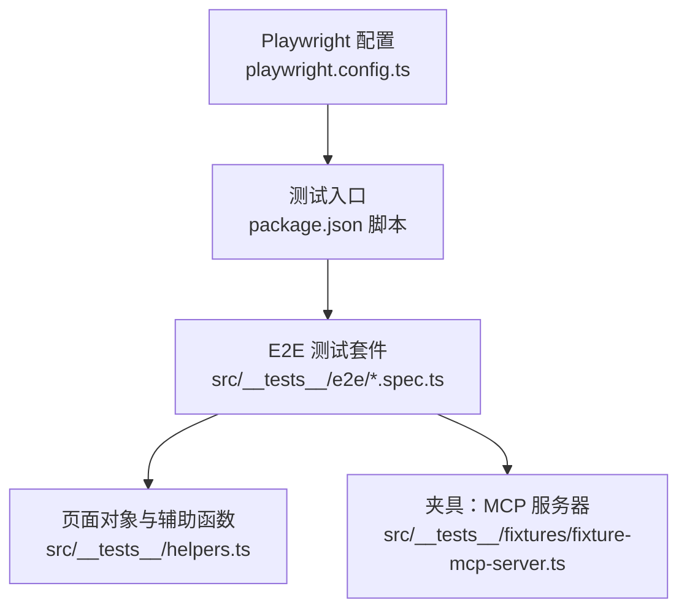
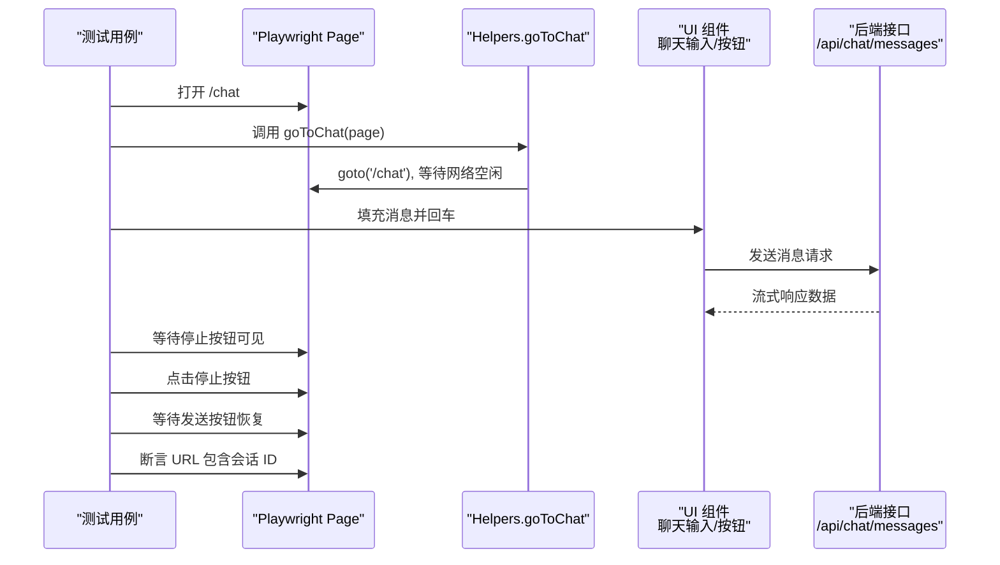
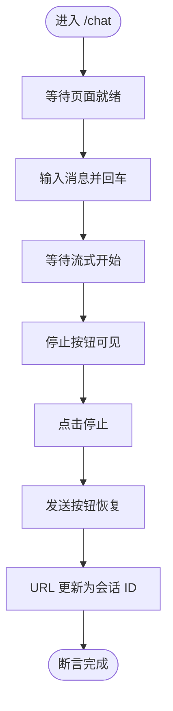
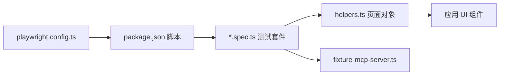

# 端到端测试

<cite>
**本文引用的文件**
- [playwright.config.ts](file://playwright.config.ts)
- [package.json](file://package.json)
- [src/__tests__/e2e/chat.spec.ts](file://src/__tests__/e2e/chat.spec.ts)
- [src/__tests__/e2e/settings.spec.ts](file://src/__tests__/e2e/settings.spec.ts)
- [src/__tests__/e2e/plugins.spec.ts](file://src/__tests__/e2e/plugins.spec.ts)
- [src/__tests__/e2e/smoke.spec.ts](file://src/__tests__/e2e/smoke.spec.ts)
- [src/__tests__/e2e/visual-regression.spec.ts](file://src/__tests__/e2e/visual-regression.spec.ts)
- [src/__tests__/e2e/project-panel.spec.ts](file://src/__tests__/e2e/project-panel.spec.ts)
- [src/__tests__/e2e/global-search-file-seek.spec.ts](file://src/__tests__/e2e/global-search-file-seek.spec.ts)
- [src/__tests__/e2e/layout.spec.ts](file://src/__tests__/e2e/layout.spec.ts)
- [src/__tests__/helpers.ts](file://src/__tests__/helpers.ts)
- [src/__tests__/fixtures/fixture-mcp-server.ts](file://src/__tests__/fixtures/fixture-mcp-server.ts)
</cite>

## 目录
1. [简介](#简介)
2. [项目结构](#项目结构)
3. [核心组件](#核心组件)
4. [架构总览](#架构总览)
5. [详细组件分析](#详细组件分析)
6. [依赖关系分析](#依赖关系分析)
7. [性能考虑](#性能考虑)
8. [故障排查指南](#故障排查指南)
9. [结论](#结论)
10. [附录](#附录)

## 简介
本文件为 CodePilot 的端到端测试（E2E）全面测试方案，基于 Playwright 测试框架，覆盖聊天对话流程、设置配置、文件操作、插件与 MCP 管理等核心场景。文档从测试框架配置入手，系统阐述页面对象模型（POM）设计、测试用例实现、测试环境搭建、截图对比、视频录制与错误捕获，并给出性能测试、可访问性测试与跨浏览器兼容性的实施建议。

## 项目结构
- 测试框架与运行脚本
  - Playwright 配置位于根目录，定义测试目录、并行策略、重试次数、报告器、trace 与 WebServer 启动参数。
  - 根 package.json 提供测试命令：单元测试、冒烟测试、E2E 全量与视觉回归测试等。
- 测试组织
  - E2E 测试集中于 src/__tests__/e2e 下，按功能模块拆分 spec 文件。
  - 辅助工具 helpers.ts 提供导航、等待、断言与页面对象定位器，统一测试实现风格。
  - 视觉回归测试与冒烟测试分别独立 spec，便于按需执行。
- 测试夹具
  - fixture-mcp-server.ts 提供本地 MCP 工具服务，用于集成测试与错误路径验证。

**图表来源**
- [playwright.config.ts:1-25](file://playwright.config.ts#L1-L25)
- [package.json:17-36](file://package.json#L17-L36)
- [src/__tests__/e2e/chat.spec.ts:1-194](file://src/__tests__/e2e/chat.spec.ts#L1-L194)
- [src/__tests__/helpers.ts:1-515](file://src/__tests__/helpers.ts#L1-L515)
- [src/__tests__/fixtures/fixture-mcp-server.ts:1-46](file://src/__tests__/fixtures/fixture-mcp-server.ts#L1-L46)

**章节来源**
- [playwright.config.ts:1-25](file://playwright.config.ts#L1-L25)
- [package.json:17-36](file://package.json#L17-L36)

## 核心组件
- Playwright 配置
  - 指定测试目录、并行与重试策略、CI 环境下的工作线程数、HTML 报告器、默认 baseURL、trace 策略与截图阈值。
  - 内置 WebServer 自动启动 Next 开发服务器，支持复用现有进程以提升 CI 效率。
- 页面对象与辅助函数（POM）
  - 导航：goToChat、goToSettings、goToPlugins、goToMCP、goToConversation 等。
  - 等待：waitForPageReady、waitForStreamingStart、waitForStreamingEnd。
  - 通用定位器：chatInput、sendButton、stopButton、newChatButton、assistantMessage、sidebar、navLink、sessionLinks 等。
  - 面板与文件树：fileTreePanel、fileSearchInput、fileTreeRefreshButton、panelCloseButton 等。
  - 技能编辑器：skillsSearchInput、skillListItems、createSkillButton、skillEditorContent、skillSaveButton、skillPreviewToggle、skillEditToggle、skillDeleteButton。
  - 断言与日志：collectConsoleErrors、filterCriticalErrors、expectPageLoadTime。
- 测试夹具
  - fixtureMcpServer：创建本地 MCP 服务器，暴露 ping、fail_always、echo 等工具，用于无外部依赖的集成测试。

**章节来源**
- [playwright.config.ts:1-25](file://playwright.config.ts#L1-L25)
- [src/__tests__/helpers.ts:1-515](file://src/__tests__/helpers.ts#L1-L515)
- [src/__tests__/fixtures/fixture-mcp-server.ts:1-46](file://src/__tests__/fixtures/fixture-mcp-server.ts#L1-L46)

## 架构总览
下图展示一次典型聊天对话 E2E 流程：测试驱动浏览器访问 /chat，输入消息并触发发送，等待流式响应结束，断言 URL 更新与侧边栏会话链接出现。

**图表来源**
- [src/__tests__/e2e/chat.spec.ts:86-171](file://src/__tests__/e2e/chat.spec.ts#L86-L171)
- [src/__tests__/helpers.ts:34-46](file://src/__tests__/helpers.ts#L34-L46)
- [src/__tests__/helpers.ts:104-109](file://src/__tests__/helpers.ts#L104-L109)
- [src/__tests__/helpers.ts:140-147](file://src/__tests__/helpers.ts#L140-L147)
- [src/__tests__/helpers.ts:96-98](file://src/__tests__/helpers.ts#L96-L98)

## 详细组件分析

### 聊天对话流程测试
- 场景覆盖
  - 页面渲染与加载时间、控制台错误过滤、空状态提示。
  - 输入框可见与占位符、发送按钮、停止按钮在流式过程中的切换。
  - 流式响应开始与结束、助手头像显示、URL 重定向至会话详情。
  - 停止生成、历史记录（会话列表）与侧边栏交互。
- 关键断言与定位器
  - 输入框与按钮：chatInput、sendButton、stopButton。
  - 助手消息容器：assistantMessage。
  - 会话链接：sessionLinks；新会话按钮：newChatButton。
  - 等待函数：waitForStreamingStart、waitForStreamingEnd。
- 参考实现路径
  - [聊天测试套件:1-194](file://src/__tests__/e2e/chat.spec.ts#L1-L194)
  - [页面对象与等待函数:131-170](file://src/__tests__/helpers.ts#L131-L170)
  - [流式等待与按钮切换:87-98](file://src/__tests__/helpers.ts#L87-L98)

**图表来源**
- [src/__tests__/e2e/chat.spec.ts:104-141](file://src/__tests__/e2e/chat.spec.ts#L104-L141)
- [src/__tests__/helpers.ts:87-98](file://src/__tests__/helpers.ts#L87-L98)

**章节来源**
- [src/__tests__/e2e/chat.spec.ts:20-194](file://src/__tests__/e2e/chat.spec.ts#L20-L194)
- [src/__tests__/helpers.ts:131-170](file://src/__tests__/helpers.ts#L131-L170)

### 设置配置测试
- 场景覆盖
  - 页面加载时间与控制台错误。
  - 可视化编辑器与 JSON 编辑器模式切换、保存/重置按钮状态。
  - 特定标签页（如 Skills）导航与内容可见性。
- 关键断言与定位器
  - 保存/重置按钮：settingsSaveButton、settingsResetButton。
  - 编辑器标签：settingsVisualTab、settingsJsonTab。
  - 标签页导航：goToSettingsTab。
- 参考实现路径
  - [设置测试套件:1-230](file://src/__tests__/e2e/settings.spec.ts#L1-L230)
  - [设置导航与标签页:62-74](file://src/__tests__/helpers.ts#L62-L74)

**章节来源**
- [src/__tests__/e2e/settings.spec.ts:15-230](file://src/__tests__/e2e/settings.spec.ts#L15-L230)
- [src/__tests__/helpers.ts:62-74](file://src/__tests__/helpers.ts#L62-L74)

### 插件与 MCP 管理测试
- 场景覆盖
  - 页面加载时间与控制台错误。
  - 插件首页标题与跳转、MCP 服务器列表与添加对话框字段校验。
  - JSON 配置编辑器可用性与按钮存在性。
- 关键断言与定位器
  - 搜索输入：pluginSearchInput。
  - 添加服务器按钮：addServerButton。
  - 导航：goToPlugins、goToMCP。
- 参考实现路径
  - [插件测试套件:1-193](file://src/__tests__/e2e/plugins.spec.ts#L1-L193)
  - [导航与定位器:48-60](file://src/__tests__/helpers.ts#L48-L60)

**章节来源**
- [src/__tests__/e2e/plugins.spec.ts:13-193](file://src/__tests__/e2e/plugins.spec.ts#L13-L193)
- [src/__tests__/helpers.ts:48-60](file://src/__tests__/helpers.ts#L48-L60)

### 冒烟测试
- 场景覆盖
  - 首页重定向至 /chat、各页面标题不含 404/500、无构建错误覆盖层、控制台无严重错误。
- 参考实现路径
  - [冒烟测试套件:1-92](file://src/__tests__/e2e/smoke.spec.ts#L1-L92)

**章节来源**
- [src/__tests__/e2e/smoke.spec.ts:12-92](file://src/__tests__/e2e/smoke.spec.ts#L12-L92)

### 视觉回归测试
- 场景覆盖
  - 设计系统页面与关键区块截图、设置页面全屏截图。
  - 截图阈值与更新基线命令。
- 注意事项
  - 当前视觉回归测试被跳过，基线已删除且平台相关，建议在本地更新基线后再发布。
- 参考实现路径
  - [视觉回归测试套件:1-80](file://src/__tests__/e2e/visual-regression.spec.ts#L1-L80)

**章节来源**
- [src/__tests__/e2e/visual-regression.spec.ts:16-80](file://src/__tests__/e2e/visual-regression.spec.ts#L16-L80)

### 项目面板（文件树）测试
- 场景覆盖
  - 面板默认隐藏、切换按钮可见、打开/关闭行为、宽度校验。
  - 文件搜索输入、刷新按钮、过滤与清空逻辑。
- 参考实现路径
  - [项目面板测试套件:1-159](file://src/__tests__/e2e/project-panel.spec.ts#L1-L159)
  - [面板与文件树定位器:236-331](file://src/__tests__/helpers.ts#L236-L331)

**章节来源**
- [src/__tests__/e2e/project-panel.spec.ts:16-159](file://src/__tests__/e2e/project-panel.spec.ts#L16-L159)
- [src/__tests__/helpers.ts:236-331](file://src/__tests__/helpers.ts#L236-L331)

### 全局搜索与文件深链定位测试
- 场景覆盖
  - 在不同工作区会话中通过查询参数深链定位目标文件，重复定位与跨会话定位均应稳定高亮。
- 实现要点
  - 使用 /api/chat/sessions 创建会话，构造临时文件树，断言文件树面板可见与高亮文本。
- 参考实现路径
  - [全局搜索文件深链测试:1-62](file://src/__tests__/e2e/global-search-file-seek.spec.ts#L1-L62)

**章节来源**
- [src/__tests__/e2e/global-search-file-seek.spec.ts:15-62](file://src/__tests__/e2e/global-search-file-seek.spec.ts#L15-L62)

### 布局与响应式测试
- 场景覆盖
  - 侧边栏可见性与宽度范围、新会话按钮、聊天列表可见性。
  - 移动端侧边栏汉堡菜单、遮罩层与布局适配。
  - 头部标题与导航高亮（当前多处测试标记跳过，待重构）。
- 参考实现路径
  - [布局测试套件:1-349](file://src/__tests__/e2e/layout.spec.ts#L1-L349)
  - [侧边栏与主题定位器:177-190](file://src/__tests__/helpers.ts#L177-L190)

**章节来源**
- [src/__tests__/e2e/layout.spec.ts:19-349](file://src/__tests__/e2e/layout.spec.ts#L19-L349)
- [src/__tests__/helpers.ts:177-190](file://src/__tests__/helpers.ts#L177-L190)

## 依赖关系分析
- 测试配置与运行
  - playwright.config.ts 定义测试目录、并行度、重试、报告器与 WebServer。
  - package.json 提供 test:smoke、test:e2e、test:visual 等脚本，统一入口。
- POM 与测试耦合
  - 所有 spec 仅依赖 helpers.ts 中的导航与定位器，降低耦合、提升复用。
- 外部依赖
  - Next 开发服务器由 Playwright 内置 WebServer 管理，避免外部进程管理复杂度。
  - MCP 工具服务通过本地夹具提供，减少对外部服务的依赖。

**图表来源**
- [playwright.config.ts:1-25](file://playwright.config.ts#L1-L25)
- [package.json:17-36](file://package.json#L17-L36)
- [src/__tests__/e2e/chat.spec.ts:1-194](file://src/__tests__/e2e/chat.spec.ts#L1-L194)
- [src/__tests__/helpers.ts:1-515](file://src/__tests__/helpers.ts#L1-L515)
- [src/__tests__/fixtures/fixture-mcp-server.ts:1-46](file://src/__tests__/fixtures/fixture-mcp-server.ts#L1-L46)

**章节来源**
- [playwright.config.ts:1-25](file://playwright.config.ts#L1-L25)
- [package.json:17-36](file://package.json#L17-L36)
- [src/__tests__/helpers.ts:1-515](file://src/__tests__/helpers.ts#L1-L515)

## 性能考虑
- 加载时间断言
  - 使用 expectPageLoadTime 对页面加载进行时间预算断言，确保关键页面在合理时间内完成渲染。
- 并行与重试
  - CI 环境启用有限工作线程与重试策略，平衡稳定性与速度。
- 截图阈值
  - 截图对比 maxDiffPixelRatio 控制像素差异容忍度，避免轻微样式抖动导致失败。
- 建议
  - 将长耗时的流式响应测试拆分为独立套件，避免阻塞主流水线。
  - 对频繁变更的视觉区域采用更宽松的阈值或分段截图。

**章节来源**
- [src/__tests__/helpers.ts:507-515](file://src/__tests__/helpers.ts#L507-L515)
- [playwright.config.ts:5-8](file://playwright.config.ts#L5-L8)
- [playwright.config.ts:14-18](file://playwright.config.ts#L14-L18)

## 故障排查指南
- 控制台错误过滤
  - 使用 collectConsoleErrors 收集错误，filterCriticalErrors 过滤非关键错误（如 favicon、hydration、开发工具警告），保留严重问题线索。
- 更新对话框干扰
  - goTo* 辅助函数内置路由拦截，返回“无更新”以避免更新提示遮挡弹窗影响测试稳定性。
- Trace 与报告
  - 配置 trace: 'on-first-retry'，在首次重试时生成 trace，便于定位失败原因。
- 常见问题
  - 页面未就绪：确保调用 waitForPageReady 或使用 goTo* 辅助函数。
  - 流式响应不稳定：使用 waitForStreamingStart/End 等待点替代固定等待。
  - 视觉回归失败：检查 maxDiffPixelRatio 与基线更新策略。

**章节来源**
- [src/__tests__/helpers.ts:14-32](file://src/__tests__/helpers.ts#L14-L32)
- [src/__tests__/helpers.ts:485-505](file://src/__tests__/helpers.ts#L485-L505)
- [playwright.config.ts:11-13](file://playwright.config.ts#L11-L13)

## 结论
本测试方案以 Playwright 为核心，结合统一的页面对象模型与辅助函数，覆盖聊天、设置、插件/MCP、文件树与布局等关键功能域。通过加载时间断言、trace 与报告、截图阈值与错误过滤，形成稳定的 E2E 质量门禁。建议在 CI 中优先运行冒烟与核心功能测试，视觉回归与长耗时测试在本地或专用流水线执行，持续优化测试稳定性与效率。

## 附录

### Playwright 配置要点
- 测试目录与并行
  - testDir: ./src/__tests__/e2e
  - fullyParallel: true
  - workers: CI 环境限制为 1，本地未指定以充分利用资源
- 重试与报告
  - CI 环境 retries=2；reporter: 'html'
- 默认行为
  - baseURL: http://localhost:3000
  - trace: 'on-first-retry'
  - 截图 maxDiffPixelRatio: 0.01
- 内置 WebServer
  - 命令: npm run dev
  - URL: http://localhost:3000
  - 复用现有进程: 非 CI 环境

**章节来源**
- [playwright.config.ts:3-24](file://playwright.config.ts#L3-L24)

### 测试命令与分组
- 单元测试：npm run test:unit
- 冒烟测试：npm run test:smoke（按 @smoke 标签筛选）
- 全量 E2E：npm run test:e2e
- 视觉回归：npm run test:visual（按 @visual 标签筛选）

**章节来源**
- [package.json:23-28](file://package.json#L23-L28)

### 页面对象模型（POM）清单
- 导航类
  - goToChat、goToSettings、goToPlugins、goToMCP、goToConversation、goToSettingsTab
- 等待类
  - waitForPageReady、waitForStreamingStart、waitForStreamingEnd
- 通用定位器
  - chatInput、sendButton、stopButton、newChatButton、assistantMessage、userMessage、sidebar、sessionLinks、navLink、themeToggle、sidebarToggle
- 面板与文件树
  - panelZone、fileTreePanel、gitPanel、previewPanel、fileTreeToggleButton、gitToggleButton、terminalToggleButton、panelCloseButton、fileSearchInput、fileTreeRefreshButton、fileTreeDirectories、fileTreeFiles、clickFileTreeNode、toggleDirectory
- 文件预览
  - filePreviewBackButton、filePreviewCopyButton、filePreviewLanguageBadge、filePreviewLineCount、filePreviewCode
- 技能编辑器
  - skillsSearchInput、skillListItems、createSkillButton、skillEditorContent、skillSaveButton、skillPreviewToggle、skillEditToggle、skillSourceBadge、skillDeleteButton
- 断言与日志
  - collectConsoleErrors、filterCriticalErrors、expectPageLoadTime

**章节来源**
- [src/__tests__/helpers.ts:34-74](file://src/__tests__/helpers.ts#L34-L74)
- [src/__tests__/helpers.ts:131-296](file://src/__tests__/helpers.ts#L131-L296)
- [src/__tests__/helpers.ts:302-360](file://src/__tests__/helpers.ts#L302-L360)
- [src/__tests__/helpers.ts:381-431](file://src/__tests__/helpers.ts#L381-L431)
- [src/__tests__/helpers.ts:485-515](file://src/__tests__/helpers.ts#L485-L515)