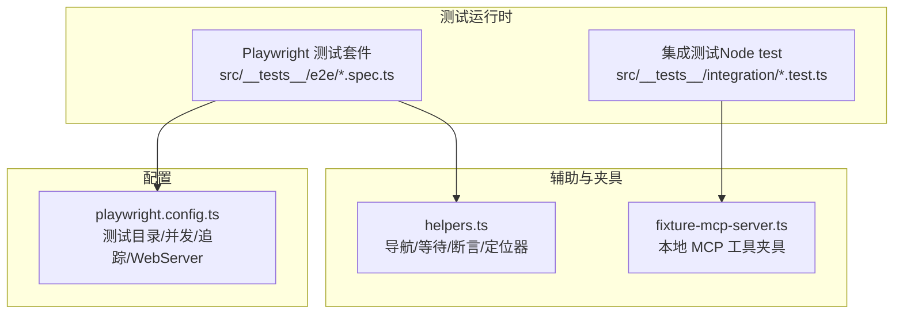
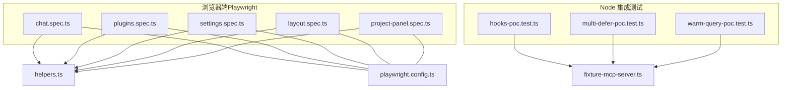
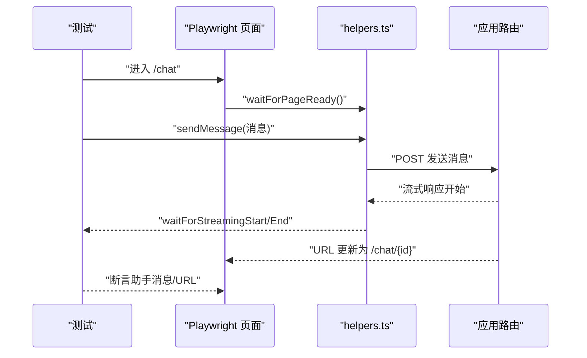
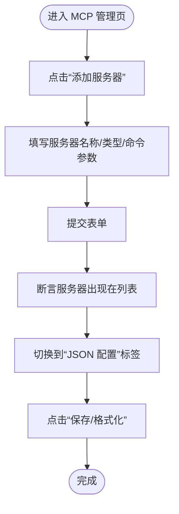
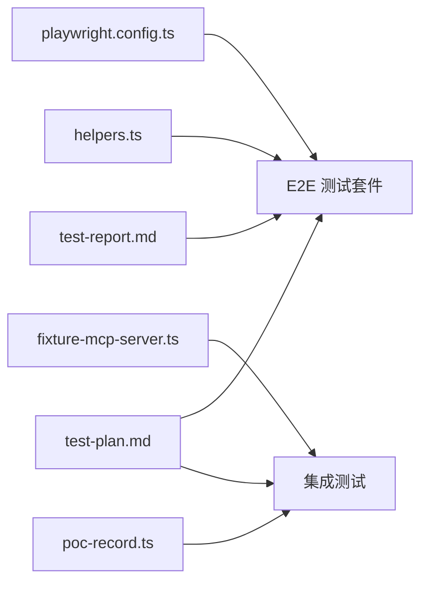

# 集成测试

<cite>
**本文引用的文件**
- [playwright.config.ts](file://playwright.config.ts)
- [src/__tests__/test-plan.md](file://src/__tests__/test-plan.md)
- [src/__tests__/test-report.md](file://src/__tests__/test-report.md)
- [src/__tests__/helpers.ts](file://src/__tests__/helpers.ts)
- [src/__tests__/fixtures/fixture-mcp-server.ts](file://src/__tests__/fixtures/fixture-mcp-server.ts)
- [src/__tests__/integration/hooks-poc.test.ts](file://src/__tests__/integration/hooks-poc.test.ts)
- [src/__tests__/integration/multi-defer-poc.test.ts](file://src/__tests__/integration/multi-defer-poc.test.ts)
- [src/__tests__/integration/poc-record.ts](file://src/__tests__/integration/poc-record.ts)
- [src/__tests__/integration/warm-query-poc.test.ts](file://src/__tests__/integration/warm-query-poc.test.ts)
- [src/__tests__/e2e/chat.spec.ts](file://src/__tests__/e2e/chat.spec.ts)
- [src/__tests__/e2e/plugins.spec.ts](file://src/__tests__/e2e/plugins.spec.ts)
- [src/__tests__/e2e/settings.spec.ts](file://src/__tests__/e2e/settings.spec.ts)
- [src/__tests__/e2e/layout.spec.ts](file://src/__tests__/e2e/layout.spec.ts)
- [src/__tests__/e2e/project-panel.spec.ts](file://src/__tests__/e2e/project-panel.spec.ts)
</cite>

## 目录
1. [引言](#引言)
2. [项目结构](#项目结构)
3. [核心组件](#核心组件)
4. [架构总览](#架构总览)
5. [详细组件分析](#详细组件分析)
6. [依赖关系分析](#依赖关系分析)
7. [性能考量](#性能考量)
8. [故障排查指南](#故障排查指南)
9. [结论](#结论)
10. [附录](#附录)

## 引言
本实施方案面向 CodePilot 的集成测试体系，目标是建立覆盖模块间交互、API 接口集成、数据库操作以及外部服务（如 MCP 服务器）的完整测试方案。文档将明确设计原则、测试范围、夹具（fixtures）使用方法、测试数据管理策略，并给出具体测试场景：聊天会话集成、桥接系统测试、MCP 服务器集成。同时涵盖测试环境配置、数据库初始化、外部服务模拟、测试数据清理、测试隔离与并发处理策略。

## 项目结构
当前仓库中测试相关组织如下：
- 端到端测试（E2E）：位于 src/__tests__/e2e，采用 Playwright，覆盖页面渲染、布局导航、聊天流、插件与设置等。
- 集成测试（Integration）：位于 src/__tests__/integration，采用 Node 内置 test，围绕 Claude Agent SDK 的 POC 场景进行能力验证。
- 辅助工具与夹具：helpers.ts 提供导航、等待、断言与定位器；fixtures/fixture-mcp-server.ts 提供本地 MCP 工具夹具。
- 测试计划与报告：test-plan.md 与 test-report.md 记录测试范围、用例与结果统计。

图表来源
- [playwright.config.ts:1-25](file://playwright.config.ts#L1-L25)
- [src/__tests__/helpers.ts:1-515](file://src/__tests__/helpers.ts#L1-L515)
- [src/__tests__/fixtures/fixture-mcp-server.ts:1-46](file://src/__tests__/fixtures/fixture-mcp-server.ts#L1-L46)

章节来源
- [playwright.config.ts:1-25](file://playwright.config.ts#L1-L25)
- [src/__tests__/test-plan.md:367-382](file://src/__tests__/test-plan.md#L367-L382)

## 核心组件
- 测试运行框架与配置
  - Playwright 配置定义了测试目录、并行度、重试策略、报告器、trace 与 WebServer 启动命令，确保端到端测试在本地开发服务器上稳定运行。
- 辅助工具（helpers）
  - 导航函数：禁用更新提示弹窗、统一 goto 封装、等待页面就绪。
  - 等待与流式响应：等待流开始/结束、等待网络空闲。
  - 定位器：聊天输入、发送/停止按钮、侧边栏、主题切换、导航链接、文件树面板等。
  - 断言与日志：收集控制台错误、过滤非关键错误、断言页面加载时间。
- 夹具（fixtures）
  - 本地 MCP 工具夹具：提供 ping、fail_always、echo 等确定性工具，用于无外部依赖的集成测试。
- 集成测试（POC）
  - hooks-poc：验证查询选项组合下钩子回调触发与 stderr 不被污染。
  - multi-defer-poc：验证单轮是否可产生多个并发 deferred_tool_use。
  - warm-query-poc：验证 startup() 预热对首 token 延迟的收益及选项变更后的行为差异。
  - poc-record：将 POC 结果写入 docs/research/agent-sdk-0-2-111-capabilities.md.json。

章节来源
- [src/__tests__/helpers.ts:1-515](file://src/__tests__/helpers.ts#L1-L515)
- [src/__tests__/fixtures/fixture-mcp-server.ts:1-46](file://src/__tests__/fixtures/fixture-mcp-server.ts#L1-L46)
- [src/__tests__/integration/hooks-poc.test.ts:1-133](file://src/__tests__/integration/hooks-poc.test.ts#L1-L133)
- [src/__tests__/integration/multi-defer-poc.test.ts:1-95](file://src/__tests__/integration/multi-defer-poc.test.ts#L1-L95)
- [src/__tests__/integration/warm-query-poc.test.ts:1-176](file://src/__tests__/integration/warm-query-poc.test.ts#L1-L176)
- [src/__tests__/integration/poc-record.ts:1-58](file://src/__tests__/integration/poc-record.ts#L1-L58)

## 架构总览
下图展示端到端测试与集成测试在整体系统中的位置，以及与辅助工具、夹具的关系。

图表来源
- [src/__tests__/e2e/chat.spec.ts:1-194](file://src/__tests__/e2e/chat.spec.ts#L1-L194)
- [src/__tests__/e2e/plugins.spec.ts:1-193](file://src/__tests__/e2e/plugins.spec.ts#L1-L193)
- [src/__tests__/e2e/settings.spec.ts:1-230](file://src/__tests__/e2e/settings.spec.ts#L1-L230)
- [src/__tests__/e2e/layout.spec.ts:1-349](file://src/__tests__/e2e/layout.spec.ts#L1-L349)
- [src/__tests__/e2e/project-panel.spec.ts:1-159](file://src/__tests__/e2e/project-panel.spec.ts#L1-L159)
- [src/__tests__/integration/hooks-poc.test.ts:1-133](file://src/__tests__/integration/hooks-poc.test.ts#L1-L133)
- [src/__tests__/integration/multi-defer-poc.test.ts:1-95](file://src/__tests__/integration/multi-defer-poc.test.ts#L1-L95)
- [src/__tests__/integration/warm-query-poc.test.ts:1-176](file://src/__tests__/integration/warm-query-poc.test.ts#L1-L176)
- [src/__tests__/helpers.ts:1-515](file://src/__tests__/helpers.ts#L1-L515)
- [src/__tests__/fixtures/fixture-mcp-server.ts:1-46](file://src/__tests__/fixtures/fixture-mcp-server.ts#L1-L46)
- [playwright.config.ts:1-25](file://playwright.config.ts#L1-L25)

## 详细组件分析

### 设计原则与测试范围
- 模块间交互测试
  - 通过 helpers.ts 统一导航与等待，确保跨模块交互（如从聊天到会话历史、从设置到技能编辑）的稳定性。
  - 使用定位器抽象 UI 变化（如“新对话”按钮文本随语言变化），降低维护成本。
- API 接口集成测试
  - 端到端测试通过 Playwright 对路由与页面行为进行验证；集成测试通过 Node test 对 SDK 查询流程进行验证。
  - 使用路由拦截（如 /api/app/updates）避免外部依赖影响测试稳定性。
- 数据库操作测试
  - 当前 E2E 未直接访问数据库；若需数据库测试，建议在独立测试环境中以事务包裹或使用内存数据库镜像。

章节来源
- [src/__tests__/helpers.ts:14-32](file://src/__tests__/helpers.ts#L14-L32)
- [src/__tests__/test-plan.md:1-382](file://src/__tests__/test-plan.md#L1-L382)

### 测试夹具（fixtures）使用方法与测试数据管理
- 本地 MCP 工具夹具
  - 通过 createSdkMcpServer 创建三个确定性工具：ping（恒返回 pong）、fail_always（抛出异常）、echo（回显输入）。
  - 在集成测试中作为查询选项的 mcpServers 注入，避免真实外部 MCP 服务器依赖。
- 测试数据创建与管理
  - 通过 fixtures/fixture-mcp-server.ts 提供稳定的工具集，便于在多轮测试中复现相同行为。
  - 对于需要持久化状态的场景，可在测试前注入固定数据，在测试后清理（见“测试数据清理”）。

章节来源
- [src/__tests__/fixtures/fixture-mcp-server.ts:16-45](file://src/__tests__/fixtures/fixture-mcp-server.ts#L16-L45)

### 具体测试场景

#### 聊天会话集成
- 目标：验证从发起消息到生成响应、URL 更新、会话历史呈现的完整链路。
- 关键步骤
  - 导航至 /chat，等待页面就绪。
  - 输入消息并发送，等待流开始与结束。
  - 断言 URL 更新为 /chat/{session-id}，断言助手消息出现。
- 适用文件
  - [src/__tests__/e2e/chat.spec.ts:1-194](file://src/__tests__/e2e/chat.spec.ts#L1-L194)
  - [src/__tests__/helpers.ts:104-109](file://src/__tests__/helpers.ts#L104-L109)

图表来源
- [src/__tests__/e2e/chat.spec.ts:86-155](file://src/__tests__/e2e/chat.spec.ts#L86-L155)
- [src/__tests__/helpers.ts:86-98](file://src/__tests__/helpers.ts#L86-L98)

章节来源
- [src/__tests__/e2e/chat.spec.ts:86-155](file://src/__tests__/e2e/chat.spec.ts#L86-L155)
- [src/__tests__/helpers.ts:86-98](file://src/__tests__/helpers.ts#L86-L98)

#### 桥接系统测试
- 目标：验证桥接通道（如飞书、Discord、QQ、Telegram、微信）的配置与状态管理。
- 方法
  - 通过设置页导航与定位器访问桥接配置区域，断言各通道的开关、状态与配置项可见。
  - 若涉及外部服务，建议使用路由拦截或本地模拟服务，确保测试可重复。
- 适用文件
  - [src/__tests__/e2e/settings.spec.ts:1-230](file://src/__tests__/e2e/settings.spec.ts#L1-L230)
  - [src/__tests__/helpers.ts:212-230](file://src/__tests__/helpers.ts#L212-L230)

章节来源
- [src/__tests__/e2e/settings.spec.ts:1-230](file://src/__tests__/e2e/settings.spec.ts#L1-L230)
- [src/__tests__/helpers.ts:212-230](file://src/__tests__/helpers.ts#L212-L230)

#### MCP 服务器集成
- 目标：验证 MCP 服务器的添加、编辑、删除与 JSON 配置模式。
- 方法
  - 使用 helpers.ts 中的定位器打开“添加服务器”对话框，填写表单并提交。
  - 切换到“JSON 配置”标签，断言保存与格式化按钮可用。
  - 使用 fixture-mcp-server.ts 注入本地工具，验证工具调用路径。
- 适用文件
  - [src/__tests__/e2e/plugins.spec.ts:1-193](file://src/__tests__/e2e/plugins.spec.ts#L1-L193)
  - [src/__tests__/fixtures/fixture-mcp-server.ts:1-46](file://src/__tests__/fixtures/fixture-mcp-server.ts#L1-L46)

图表来源
- [src/__tests__/e2e/plugins.spec.ts:118-191](file://src/__tests__/e2e/plugins.spec.ts#L118-L191)
- [src/__tests__/helpers.ts:207-210](file://src/__tests__/helpers.ts#L207-L210)

章节来源
- [src/__tests__/e2e/plugins.spec.ts:118-191](file://src/__tests__/e2e/plugins.spec.ts#L118-L191)
- [src/__tests__/helpers.ts:207-210](file://src/__tests__/helpers.ts#L207-L210)

### 测试环境配置、数据库初始化与外部服务模拟
- 测试环境配置
  - Playwright 通过 playwright.config.ts 指定测试目录、并行度、重试次数、报告器与 WebServer 启动命令，确保端到端测试在本地开发服务器上运行。
- 数据库初始化
  - 若需要数据库测试，建议在测试前执行初始化脚本（如迁移/种子），并在测试后回滚或清空。
- 外部服务模拟
  - 使用 helpers.ts 中的路由拦截禁用更新提示弹窗，避免外部 API 影响测试稳定性。
  - 集成测试通过 fixture-mcp-server.ts 提供本地 MCP 工具，避免真实外部 MCP 服务器依赖。

章节来源
- [playwright.config.ts:19-23](file://playwright.config.ts#L19-L23)
- [src/__tests__/helpers.ts:14-32](file://src/__tests__/helpers.ts#L14-L32)
- [src/__tests__/fixtures/fixture-mcp-server.ts:16-45](file://src/__tests__/fixtures/fixture-mcp-server.ts#L16-L45)

### 测试数据清理、测试隔离与并发测试
- 测试数据清理
  - 对于需要持久化状态的场景，建议在 beforeEach/afterEach 中清理数据（如删除临时会话、恢复默认设置）。
  - 对于外部服务（如 MCP），在测试结束后关闭或重置服务实例。
- 测试隔离
  - 使用独立的浏览器上下文或页面实例，避免跨用例状态污染。
  - 使用路由拦截与定位器抽象，减少对全局状态的依赖。
- 并发测试
  - Playwright 支持 fullyParallel，CI 下限制 workers 数量以平衡速度与稳定性。
  - 集成测试（Node test）可通过环境变量启用 POC，避免在 CI 中写入报告文件。

章节来源
- [playwright.config.ts:5-8](file://playwright.config.ts#L5-L8)
- [src/__tests__/integration/poc-record.ts:45-57](file://src/__tests__/integration/poc-record.ts#L45-L57)

## 依赖关系分析
- E2E 测试依赖 helpers.ts 提供的导航与等待逻辑，以及 playwright.config.ts 的运行时配置。
- 集成测试依赖 fixture-mcp-server.ts 提供的本地工具，以及 poc-record.ts 的结果记录。
- 测试计划与报告文件为测试范围与结果统计提供依据。

图表来源
- [playwright.config.ts:1-25](file://playwright.config.ts#L1-L25)
- [src/__tests__/helpers.ts:1-515](file://src/__tests__/helpers.ts#L1-L515)
- [src/__tests__/fixtures/fixture-mcp-server.ts:1-46](file://src/__tests__/fixtures/fixture-mcp-server.ts#L1-L46)
- [src/__tests__/integration/poc-record.ts:1-58](file://src/__tests__/integration/poc-record.ts#L1-L58)
- [src/__tests__/test-plan.md:1-382](file://src/__tests__/test-plan.md#L1-L382)
- [src/__tests__/test-report.md:1-206](file://src/__tests__/test-report.md#L1-L206)

章节来源
- [playwright.config.ts:1-25](file://playwright.config.ts#L1-L25)
- [src/__tests__/helpers.ts:1-515](file://src/__tests__/helpers.ts#L1-L515)
- [src/__tests__/fixtures/fixture-mcp-server.ts:1-46](file://src/__tests__/fixtures/fixture-mcp-server.ts#L1-L46)
- [src/__tests__/integration/poc-record.ts:1-58](file://src/__tests__/integration/poc-record.ts#L1-L58)
- [src/__tests__/test-plan.md:1-382](file://src/__tests__/test-plan.md#L1-L382)
- [src/__tests__/test-report.md:1-206](file://src/__tests__/test-report.md#L1-L206)

## 性能考量
- 页面加载时间阈值：测试计划中设定页面加载时间应小于 3 秒。
- 交互响应时间阈值：交互响应时间应小于 500ms。
- 主题切换与动画：要求无闪烁、平滑过渡。
- 测试执行时间：通过并行与重试策略在保证稳定性的同时提升效率。

章节来源
- [src/__tests__/test-plan.md:353-364](file://src/__tests__/test-plan.md#L353-L364)
- [src/__tests__/test-report.md:197-206](file://src/__tests__/test-report.md#L197-L206)
- [playwright.config.ts:7-8](file://playwright.config.ts#L7-L8)

## 故障排查指南
- 控制台错误
  - 使用 helpers.ts 的 collectConsoleErrors 与 filterCriticalErrors 收集并过滤非关键错误，定位问题根因。
- 流式响应问题
  - 使用 waitForStreamingStart/End 精确定位流开始与结束时机，结合断言辅助定位卡顿或中断。
- 更新提示弹窗干扰
  - 通过路由拦截禁用 /api/app/updates，避免外部版本检查导致的弹窗遮挡与交互不稳定。
- 集成测试结果记录
  - poc-record.ts 将 POC 结果写入 docs/research/agent-sdk-0-2-111-capabilities.md.json，若写入失败会在控制台警告，不影响测试执行。

章节来源
- [src/__tests__/helpers.ts:485-515](file://src/__tests__/helpers.ts#L485-L515)
- [src/__tests__/helpers.ts:86-98](file://src/__tests__/helpers.ts#L86-L98)
- [src/__tests__/helpers.ts:14-32](file://src/__tests__/helpers.ts#L14-L32)
- [src/__tests__/integration/poc-record.ts:45-57](file://src/__tests__/integration/poc-record.ts#L45-L57)

## 结论
本实施方案基于现有 Playwright 与 Node test 能力，结合 helpers.ts 与 fixtures，构建了覆盖端到端与集成场景的测试体系。通过路由拦截、定位器抽象与 POC 验证，实现了对外部依赖的最小化与测试稳定性保障。建议后续逐步完善数据库测试与布局/插件重写后的 E2E 用例，持续优化测试覆盖率与执行效率。

## 附录
- 测试计划与报告
  - [src/__tests__/test-plan.md:1-382](file://src/__tests__/test-plan.md#L1-L382)
  - [src/__tests__/test-report.md:1-206](file://src/__tests__/test-report.md#L1-L206)
- 集成测试与夹具
  - [src/__tests__/integration/hooks-poc.test.ts:1-133](file://src/__tests__/integration/hooks-poc.test.ts#L1-L133)
  - [src/__tests__/integration/multi-defer-poc.test.ts:1-95](file://src/__tests__/integration/multi-defer-poc.test.ts#L1-L95)
  - [src/__tests__/integration/warm-query-poc.test.ts:1-176](file://src/__tests__/integration/warm-query-poc.test.ts#L1-L176)
  - [src/__tests__/integration/poc-record.ts:1-58](file://src/__tests__/integration/poc-record.ts#L1-L58)
  - [src/__tests__/fixtures/fixture-mcp-server.ts:1-46](file://src/__tests__/fixtures/fixture-mcp-server.ts#L1-L46)
- 端到端测试
  - [src/__tests__/e2e/chat.spec.ts:1-194](file://src/__tests__/e2e/chat.spec.ts#L1-L194)
  - [src/__tests__/e2e/plugins.spec.ts:1-193](file://src/__tests__/e2e/plugins.spec.ts#L1-L193)
  - [src/__tests__/e2e/settings.spec.ts:1-230](file://src/__tests__/e2e/settings.spec.ts#L1-L230)
  - [src/__tests__/e2e/layout.spec.ts:1-349](file://src/__tests__/e2e/layout.spec.ts#L1-L349)
  - [src/__tests__/e2e/project-panel.spec.ts:1-159](file://src/__tests__/e2e/project-panel.spec.ts#L1-L159)