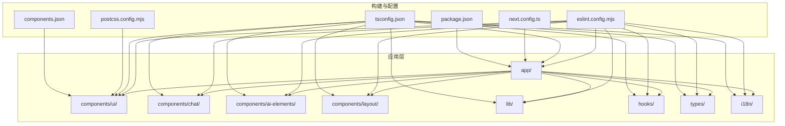
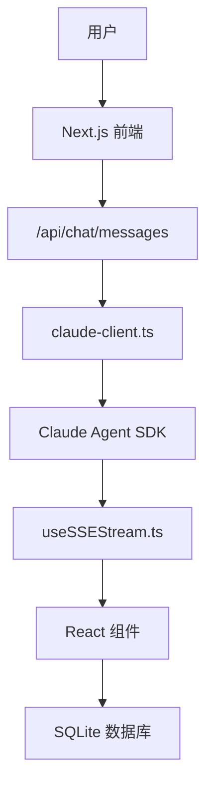
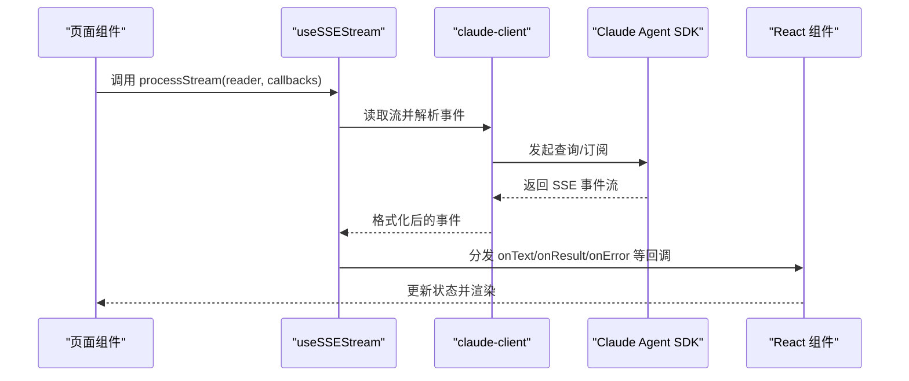
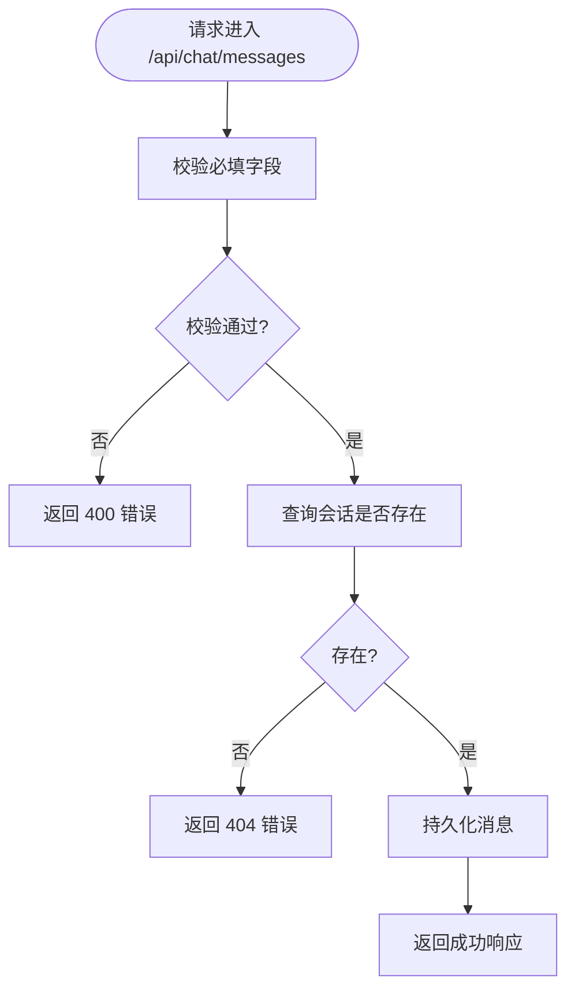
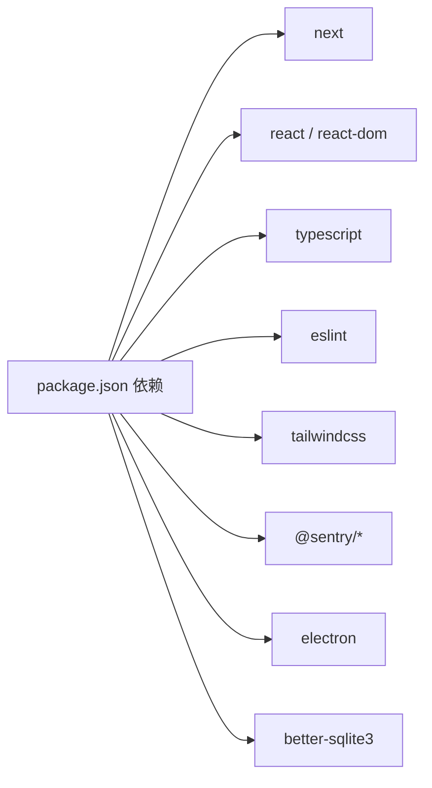

# 编码规范

<cite>
**本文引用的文件**
- [eslint.config.mjs](file://eslint.config.mjs)
- [tsconfig.json](file://tsconfig.json)
- [package.json](file://package.json)
- [next.config.ts](file://next.config.ts)
- [postcss.config.mjs](file://postcss.config.mjs)
- [components.json](file://components.json)
- [ARCHITECTURE.md](file://ARCHITECTURE.md)
- [README.md](file://README.md)
- [src/lib/utils.ts](file://src/lib/utils.ts)
- [src/components/ui/button.tsx](file://src/components/ui/button.tsx)
- [src/hooks/useSSEStream.ts](file://src/hooks/useSSEStream.ts)
- [src/lib/claude-client.ts](file://src/lib/claude-client.ts)
- [src/app/api/chat/messages/route.ts](file://src/app/api/chat/messages/route.ts)
- [src/components/chat/MessageItem.tsx](file://src/components/chat/MessageItem.tsx)
</cite>

## 目录
1. [简介](#简介)
2. [项目结构](#项目结构)
3. [核心组件](#核心组件)
4. [架构总览](#架构总览)
5. [详细组件分析](#详细组件分析)
6. [依赖分析](#依赖分析)
7. [性能考虑](#性能考虑)
8. [故障排查指南](#故障排查指南)
9. [结论](#结论)
10. [附录](#附录)

## 简介
本文件为 CodePilot 项目的编码规范与最佳实践指南，覆盖 TypeScript 编码规范、命名约定、文件组织原则；React 组件开发规范、Hook 使用规范、状态管理模式；API 设计原则、错误处理规范、日志记录标准；代码注释规范、文档编写要求、测试覆盖率标准；以及 ESLint 配置说明、TypeScript 配置要点、代码风格检查流程。目标是统一团队开发体验，提升可维护性与协作效率。

## 项目结构
- 采用“特性分层 + 功能域划分”的混合组织方式：
  - app/：Next.js App Router 页面与 API 路由
  - components/：按功能域分目录的 React 组件（ui、chat、ai-elements、layout、plugins、settings、bridge、skills、project、gallery）
  - hooks/：自定义 Hook
  - lib/：核心业务逻辑（数据库、AI 客户端、运行时、工具集等）
  - types/：全局 TypeScript 类型
  - i18n/：国际化资源
  - electron/：桌面壳子相关
- 顶层配置文件：
  - ESLint、TypeScript、Next.js、Tailwind PostCSS、组件库别名等

**图表来源**
- [ARCHITECTURE.md](file://ARCHITECTURE.md)
- [eslint.config.mjs](file://eslint.config.mjs)
- [tsconfig.json](file://tsconfig.json)
- [next.config.ts](file://next.config.ts)
- [postcss.config.mjs](file://postcss.config.mjs)
- [components.json](file://components.json)
- [package.json](file://package.json)

**章节来源**
- [ARCHITECTURE.md](file://ARCHITECTURE.md)
- [README.md](file://README.md)

## 核心组件
- 组件库与通用工具
  - 组件库：基于 shadcn/ui，使用 @phosphor-icons/react 作为图标库，通过 alias 统一导入路径
  - 工具函数：cn()、日期与本地时区辅助函数等
- 自定义 Hook：useSSEStream 提供 SSE 事件解析与回调分发
- 业务客户端：claude-client 封装 Claude Agent SDK 的流式对话、MCP 注入、权限与环境隔离
- API 层：/api/chat/messages 提供消息持久化与更新能力

**章节来源**
- [components.json](file://components.json)
- [src/lib/utils.ts](file://src/lib/utils.ts)
- [src/components/ui/button.tsx](file://src/components/ui/button.tsx)
- [src/hooks/useSSEStream.ts](file://src/hooks/useSSEStream.ts)
- [src/lib/claude-client.ts](file://src/lib/claude-client.ts)
- [src/app/api/chat/messages/route.ts](file://src/app/api/chat/messages/route.ts)

## 架构总览
- 前端与 API：Next.js App Router + React 19 + TypeScript
- 数据流：用户输入 → API → 业务客户端（claude-client）→ SDK 流 → Hook 解析 → UI 渲染 → 数据库持久化
- 桌面壳：Electron 40，独立打包与签名策略
- 样式与主题：Tailwind CSS 4 + Radix UI，支持深浅主题切换
- 日志与监控：Sentry（浏览器/Node/Electron），环形日志缓存（自动脱敏）

**图表来源**
- [ARCHITECTURE.md](file://ARCHITECTURE.md)
- [src/app/api/chat/messages/route.ts](file://src/app/api/chat/messages/route.ts)
- [src/lib/claude-client.ts](file://src/lib/claude-client.ts)
- [src/hooks/useSSEStream.ts](file://src/hooks/useSSEStream.ts)

## 详细组件分析

### TypeScript 编码规范
- 严格模式与增量编译
  - 严格模式开启，禁止隐式 any，确保类型安全
  - 启用增量编译，提升开发体验
- 模块解析与路径映射
  - 使用 bundler 解析与路径别名 @/*，避免相对路径地狱
- 语言与模块目标
  - ES2017 目标，支持现代浏览器特性
- 独立模块与 Emit
  - isolatedModules + noEmit，配合 tsserver 与构建链路分离
- 生成类型
  - 包含 Next.js 类型与 .mts 支持

**章节来源**
- [tsconfig.json](file://tsconfig.json)

### 命名约定
- 文件与目录
  - 组件目录按功能域命名（如 components/chat、components/ui）
  - 类型文件以 index.ts 或具体名称（如 types/index.ts）
- 组件与 Hook
  - 组件首字母大写，Hook 以 use 开头（如 useSSEStream）
- 变量与函数
  - 驼峰命名，避免缩写；描述性强的变量名优先
- 常量与枚举
  - 常量全大写蛇形；枚举使用 PascalCase
- 路径别名
  - 统一使用 @/ 前缀，减少层级拼写错误

**章节来源**
- [ARCHITECTURE.md](file://ARCHITECTURE.md)
- [components.json](file://components.json)

### 文件组织原则
- 按功能域分层：components/ 下按领域划分（ui、chat、ai-elements、layout 等）
- 业务逻辑集中：lib/ 下存放核心业务（数据库、AI 客户端、运行时、工具集）
- 类型集中：types/ 下统一声明业务类型
- 国际化：i18n/ 下按语言拆分
- API：app/api/ 下按资源域组织路由

**章节来源**
- [ARCHITECTURE.md](file://ARCHITECTURE.md)

### React 组件开发规范
- 组件职责单一，尽量无副作用
- 使用受控组件与受控状态，避免直接操作 DOM
- 使用 className 合并与样式工具函数（如 cn）
- 图标与交互元素统一从 ui/ 导入，避免原生 HTML 控件
- 事件处理与回调参数明确，避免闭包陷阱
- 性能优化：合理使用 memo、useMemo、useCallback，避免不必要的重渲染

**章节来源**
- [src/components/ui/button.tsx](file://src/components/ui/button.tsx)
- [src/lib/utils.ts](file://src/lib/utils.ts)
- [eslint.config.mjs](file://eslint.config.mjs)

### Hook 使用规范
- useSSEStream
  - 通过稳定回调引用避免闭包捕获旧状态
  - 明确事件类型与回调职责，保证错误与结果处理一致
  - 对结构化错误进行友好展示与恢复建议拼接
- 其他 Hook
  - 保持纯函数式，避免在条件分支中声明 Hook
  - 明确依赖数组，避免无限重渲染或状态不同步

**图表来源**
- [src/hooks/useSSEStream.ts](file://src/hooks/useSSEStream.ts)
- [src/lib/claude-client.ts](file://src/lib/claude-client.ts)

**章节来源**
- [src/hooks/useSSEStream.ts](file://src/hooks/useSSEStream.ts)
- [src/lib/claude-client.ts](file://src/lib/claude-client.ts)

### 状态管理模式
- 本地状态：组件内 useState/useReducer 管理 UI 状态
- 全局状态：通过 React Context 或集中式 Store（如需要）管理跨组件共享状态
- 流式状态：SSE 事件驱动的状态更新，使用 Hook 统一分发
- 会话与历史：通过数据库持久化，组件只负责读取与展示

**章节来源**
- [src/hooks/useSSEStream.ts](file://src/hooks/useSSEStream.ts)
- [src/app/api/chat/messages/route.ts](file://src/app/api/chat/messages/route.ts)

### API 设计原则
- REST 风格：清晰的资源命名与 HTTP 方法语义
- 请求与响应：明确字段与类型，必要时提供示例
- 错误处理：返回标准错误码与错误信息，便于前端统一处理
- 安全性：对敏感数据进行脱敏与最小暴露

**图表来源**
- [src/app/api/chat/messages/route.ts](file://src/app/api/chat/messages/route.ts)

**章节来源**
- [src/app/api/chat/messages/route.ts](file://src/app/api/chat/messages/route.ts)

### 错误处理规范
- 结构化错误：后端返回结构化错误对象，前端拼接用户提示与恢复建议
- SSE 错误：在 Hook 中解析并拼接错误文本，提供可点击的跳转链接
- 通用兜底：对不可解析的错误进行降级处理，避免崩溃

**章节来源**
- [src/hooks/useSSEStream.ts](file://src/hooks/useSSEStream.ts)

### 日志记录标准
- 环形日志：前端与服务端均提供环形缓冲日志，支持自动脱敏
- Sentry 集成：浏览器、Node、Electron 三端接入，统一上报
- 日志级别：区分 info/warn/error，避免噪声

**章节来源**
- [ARCHITECTURE.md](file://ARCHITECTURE.md)

### 代码注释规范
- 函数与复杂逻辑：提供简要说明与参数/返回值说明
- 边界条件与异常：标注边界与异常场景
- 外部依赖与兼容性：说明平台差异与兼容性注意事项

**章节来源**
- [src/lib/claude-client.ts](file://src/lib/claude-client.ts)

### 文档编写要求
- 架构文档：保持与实现同步，新增功能需补充“触及点”
- API 文档：在路由文件中提供简要说明与示例字段
- 用户文档：README 与 docs/handover 下的决策文档

**章节来源**
- [ARCHITECTURE.md](file://ARCHITECTURE.md)
- [README.md](file://README.md)

### 测试覆盖率标准
- 单元测试：优先覆盖核心业务逻辑与边界条件
- 端到端测试：关键流程（聊天、文件操作、权限请求）必须覆盖
- 可视化回归：定期运行视觉回归测试，防止 UI 回退

**章节来源**
- [package.json](file://package.json)

## 依赖分析
- 构建与运行时
  - Next.js 16（App Router）、React 19、TypeScript 5
  - Electron 40（桌面壳）、better-sqlite3（本地数据库）
  - Sentry（错误监控）
- 样式与组件
  - Tailwind CSS 4、Radix UI、shadcn/ui、@phosphor-icons/react
- AI 与工具
  - Claude Agent SDK、@ai-sdk/*、@larksuiteoapi/node-sdk 等

**图表来源**
- [package.json](file://package.json)

**章节来源**
- [package.json](file://package.json)

## 性能考虑
- 懒加载与动态导入：对重型模块（如导出、渲染器）采用动态导入
- 组件渲染优化：合理使用 memo、useMemo、useCallback，避免重复渲染
- SSE 流解析：在 Hook 中按事件类型分发，避免阻塞主线程
- 打包与输出：Next.js standalone 输出，排除非必要目录，减小包体积

**章节来源**
- [next.config.ts](file://next.config.ts)
- [src/hooks/useSSEStream.ts](file://src/hooks/useSSEStream.ts)

## 故障排查指南
- ESLint 规则违规
  - 使用内置规则：禁用原生 HTML 控件、限制图标导入、组件大小限制、模式层禁止导入数据逻辑等
  - 使用颜色检查脚本：lint:colors 用于检查原始颜色使用
- 构建问题
  - 独立模块与打包：确保 isolatedModules 与 serverExternalPackages 正确配置
  - 输出排除：outputFileTracingExcludes 排除文档与资源目录
- 运行时问题
  - Sentry 初始化：确认 DSN 与环境变量正确
  - 环形日志：检查日志容量与脱敏策略

**章节来源**
- [eslint.config.mjs](file://eslint.config.mjs)
- [next.config.ts](file://next.config.ts)
- [package.json](file://package.json)

## 结论
本规范以项目现有配置与实现为基础，结合 ESLint、TypeScript、Next.js 与 React 最佳实践，形成统一的编码与协作标准。建议在日常开发中严格遵循，并持续根据项目演进进行修订与完善。

## 附录

### ESLint 配置说明
- 核心规则
  - 禁止使用原生 HTML 控件，强制使用 ui/ 组件
  - 禁止直接引入 lucide-react，统一使用 @phosphor-icons/react
  - 在业务组件中限制直接引入 @phosphor-icons/react，统一从 @/components/ui/icon 导入
  - 组件文件大小限制（排除 ui/ 与 ai-elements/）
  - 模式层组件禁止导入 hooks 与 lib（仅允许 @/lib/utils）
- 脚本
  - lint:colors：基于 grep 的颜色检查脚本，支持 lint-allow-raw-color 注释豁免

**章节来源**
- [eslint.config.mjs](file://eslint.config.mjs)

### TypeScript 配置要点
- 严格模式、增量编译、路径别名 @/*
- 模块解析：bundler
- 目标：ES2017
- 独立模块：isolatedModules + noEmit

**章节来源**
- [tsconfig.json](file://tsconfig.json)

### 代码风格检查流程
- 提交前：npm run lint 与 npm run typecheck
- 颜色检查：npm run lint:colors
- 提交钩子：husky + lint-staged 自动修复

**章节来源**
- [package.json](file://package.json)