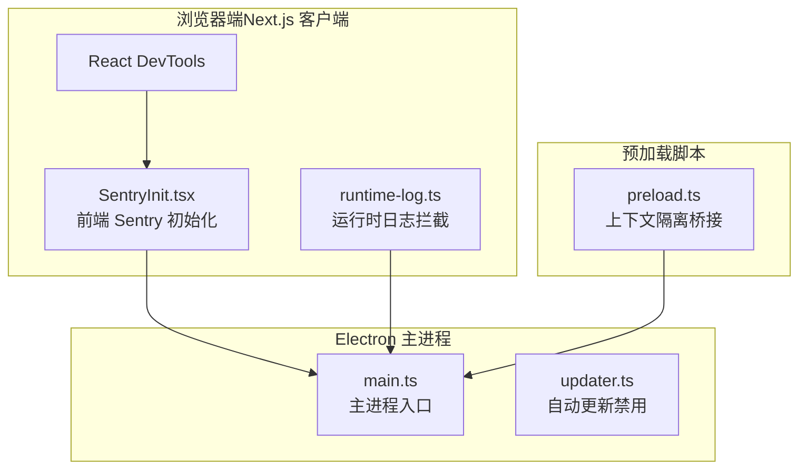
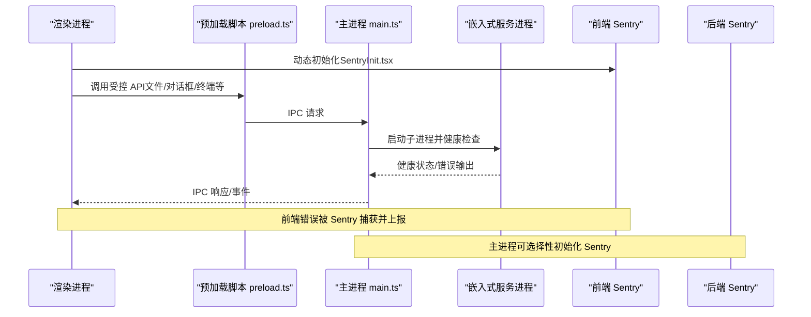
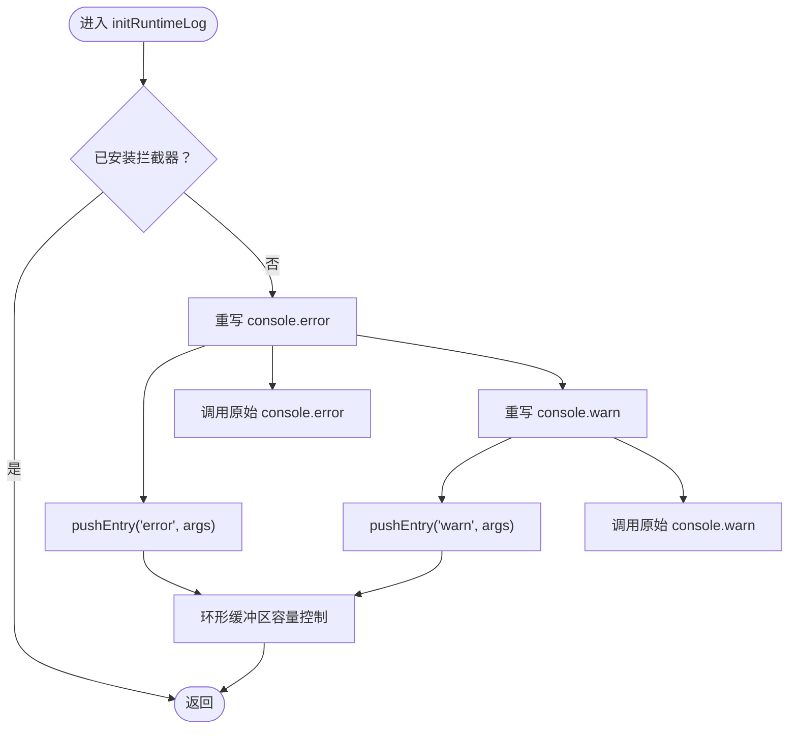
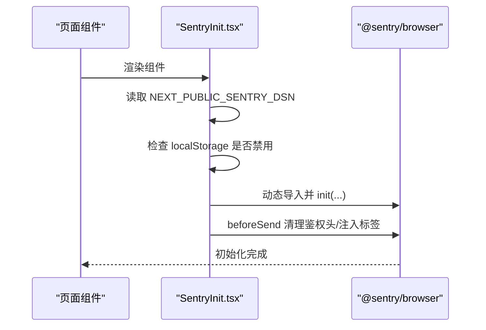
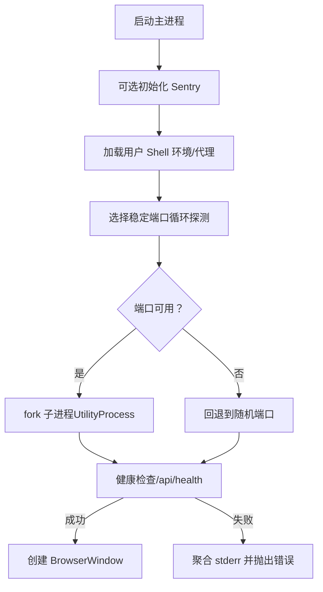
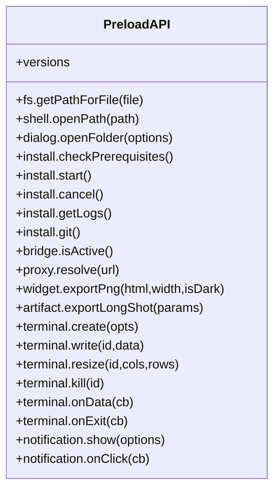
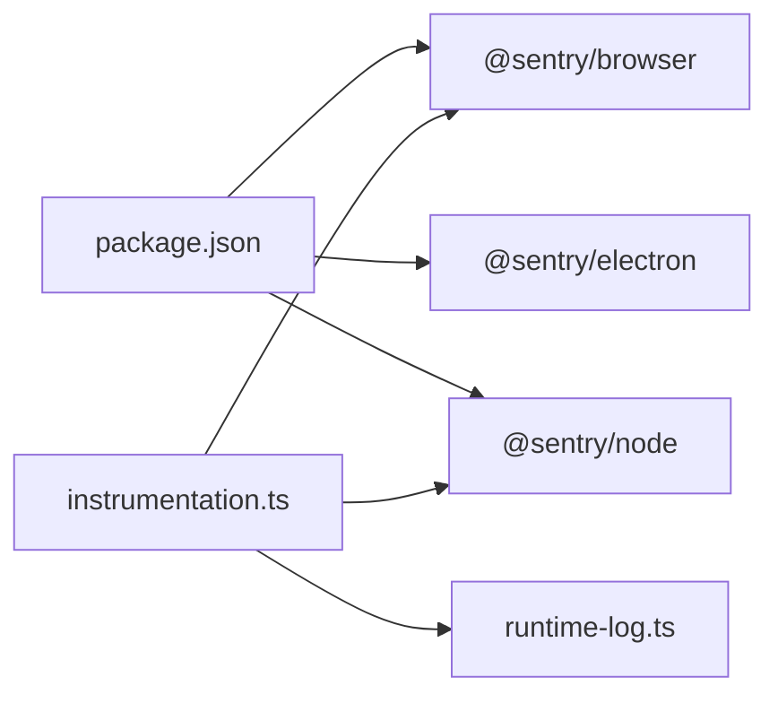

# 调试与性能分析

<cite>
**本文引用的文件**
- [runtime-log.ts](file://src/lib/runtime-log.ts)
- [instrumentation.ts](file://src/instrumentation.ts)
- [SentryInit.tsx](file://src/components/layout/SentryInit.tsx)
- [main.ts](file://electron/main.ts)
- [preload.ts](file://electron/preload.ts)
- [updater.ts](file://electron/updater.ts)
- [package.json](file://package.json)
</cite>

## 目录
1. [简介](#简介)
2. [项目结构](#项目结构)
3. [核心组件](#核心组件)
4. [架构总览](#架构总览)
5. [详细组件分析](#详细组件分析)
6. [依赖关系分析](#依赖关系分析)
7. [性能考量](#性能考量)
8. [故障排查指南](#故障排查指南)
9. [结论](#结论)

## 简介
本指南聚焦于 CodePilot 的调试与性能分析实践，覆盖以下方面：
- 开发工具使用：Chrome DevTools、Electron DevTools、React DevTools
- 日志系统配置、运行时日志采集、错误追踪机制
- 性能分析方法：内存使用分析、CPU 性能分析、网络请求监控
- 断点调试技巧、异步代码调试、跨进程通信调试
- 常见问题诊断与性能优化建议

## 项目结构
CodePilot 采用 Next.js 前端 + Electron 主进程的桌面应用架构。调试与性能分析涉及三类关键路径：
- 浏览器端（Next.js 客户端）：React DevTools、Sentry 前端初始化、运行时日志拦截
- Electron 主进程：Sentry 初始化、子进程启动与健康检查、IPC 通道
- Electron 预加载脚本：向渲染进程暴露安全 API、终端与通知等桥接能力

**图示来源**
- [SentryInit.tsx:1-73](file://src/components/layout/SentryInit.tsx#L1-L73)
- [runtime-log.ts:1-115](file://src/lib/runtime-log.ts#L1-L115)
- [main.ts:1-800](file://electron/main.ts#L1-L800)
- [preload.ts:1-94](file://electron/preload.ts#L1-L94)
- [updater.ts:1-20](file://electron/updater.ts#L1-L20)

**章节来源**
- [package.json:1-148](file://package.json#L1-L148)
- [main.ts:1-800](file://electron/main.ts#L1-L800)
- [preload.ts:1-94](file://electron/preload.ts#L1-L94)
- [SentryInit.tsx:1-73](file://src/components/layout/SentryInit.tsx#L1-L73)
- [runtime-log.ts:1-115](file://src/lib/runtime-log.ts#L1-L115)

## 核心组件
- 运行时日志拦截器：在开发期拦截 console.error/warn，写入环形缓冲区，并进行敏感信息脱敏，便于“Doctor 导出”功能导出最近日志。
- Sentry 前端初始化：按需动态加载 @sentry/browser，支持用户本地存储级关闭、忽略特定非动作错误、清理鉴权头、注入平台标签。
- Electron 主进程：初始化 Sentry（可选）、启动嵌入式 Next.js 子进程、健康检查、托盘与后台通知轮询、系统代理解析、端口分配策略。
- 预加载脚本：通过 contextBridge 暴露受控 API 至渲染进程，包括文件路径解析、对话框、安装流程、桥接状态、代理解析、终端、通知等。

**章节来源**
- [runtime-log.ts:1-115](file://src/lib/runtime-log.ts#L1-L115)
- [instrumentation.ts:1-63](file://src/instrumentation.ts#L1-L63)
- [SentryInit.tsx:1-73](file://src/components/layout/SentryInit.tsx#L1-L73)
- [main.ts:1-800](file://electron/main.ts#L1-L800)
- [preload.ts:1-94](file://electron/preload.ts#L1-L94)

## 架构总览
下图展示调试与性能分析相关的关键交互：

**图示来源**
- [SentryInit.tsx:10-72](file://src/components/layout/SentryInit.tsx#L10-L72)
- [preload.ts:4-93](file://electron/preload.ts#L4-L93)
- [main.ts:662-720](file://electron/main.ts#L662-L720)
- [instrumentation.ts:5-62](file://src/instrumentation.ts#L5-L62)

## 详细组件分析

### 组件一：运行时日志拦截器（runtime-log.ts）
- 设计要点
  - 使用全局对象保存状态，确保热重载期间不重复安装拦截器
  - 环形缓冲区限制容量，避免内存膨胀
  - 对日志消息进行敏感信息脱敏（令牌、密钥、URL、路径等）
  - 提供获取最近日志与清空日志的接口，用于 Doctor 导出
- 关键行为
  - 拦截 console.error/console.warn，拼接参数为字符串，长度上限截断
  - 在生产环境与开发环境均可工作，开发期更利于定位问题
- 适用场景
  - 快速导出最近运行时警告与错误
  - 辅助前端/主进程联调时的上下文记录

**图示来源**
- [runtime-log.ts:85-100](file://src/lib/runtime-log.ts#L85-L100)
- [runtime-log.ts:58-79](file://src/lib/runtime-log.ts#L58-L79)

**章节来源**
- [runtime-log.ts:1-115](file://src/lib/runtime-log.ts#L1-L115)

### 组件二：Sentry 前端初始化（SentryInit.tsx）
- 设计要点
  - 仅在存在 DSN 时初始化，避免无意义打包
  - 支持用户通过本地存储关闭上报
  - 忽略预期非动作错误（如 Abort、ResizeObserver 循环等）
  - 上报前清理鉴权头，注入平台与 Electron 标签
- 适用场景
  - 前端异常可视化与趋势分析
  - 与后端 Sentry 协同定位跨端问题

**图示来源**
- [SentryInit.tsx:10-69](file://src/components/layout/SentryInit.tsx#L10-L69)

**章节来源**
- [SentryInit.tsx:1-73](file://src/components/layout/SentryInit.tsx#L1-L73)

### 组件三：Electron 主进程（main.ts）
- 设计要点
  - 可选 Sentry 初始化（基于用户标记文件），避免隐私冲突
  - 使用 Electron UtilityProcess 启动嵌入式 Next.js 服务器，避免额外 Dock 图标
  - 健康检查与超时处理，失败时聚合子进程 stderr 输出
  - 托盘模式与后台通知轮询，提升无窗口时可用性
  - 系统代理解析、用户 Shell 环境加载、PATH 扩展
  - 端口分配策略：稳定端口优先，失败回退至随机端口，避免 localStorage Origin 变化导致设置丢失
- 适用场景
  - 跨进程通信调试、子进程生命周期管理、网络代理与环境变量问题定位

**图示来源**
- [main.ts:572-660](file://electron/main.ts#L572-L660)
- [main.ts:662-720](file://electron/main.ts#L662-L720)

**章节来源**
- [main.ts:1-800](file://electron/main.ts#L1-L800)

### 组件四：预加载脚本（preload.ts）
- 设计要点
  - 通过 contextBridge 暴露受控 API，避免直接启用 Node 集成
  - 暴露文件路径解析、对话框、安装流程、桥接状态、代理解析、终端、通知等
  - 以 IPC 形式与主进程通信，便于调试与可观测
- 适用场景
  - 渲染进程侧断点调试、IPC 通道问题定位、终端与通知行为验证

**图示来源**
- [preload.ts:4-93](file://electron/preload.ts#L4-L93)

**章节来源**
- [preload.ts:1-94](file://electron/preload.ts#L1-L94)

### 组件五：自动更新（updater.ts）
- 设计要点
  - 当前禁用原生自动更新，提示用户从 GitHub Releases 下载
  - 保留占位函数以便未来启用
- 适用场景
  - 版本发布流程与用户引导说明

**章节来源**
- [updater.ts:1-20](file://electron/updater.ts#L1-L20)

## 依赖关系分析
- 包管理与脚本
  - package.json 定义了开发与构建脚本，以及 Electron 开发联跑命令
  - 依赖 @sentry/browser、@sentry/electron、@sentry/node，分别用于前端、Electron 主进程与 Node 服务端
- 运行时日志与 Sentry 注入
  - instrumentation.ts 在 Node 服务端注册时初始化 Sentry 并调用 initRuntimeLog，确保 Doctor 导出功能可用

**图示来源**
- [package.json:43-108](file://package.json#L43-L108)
- [instrumentation.ts:5-62](file://src/instrumentation.ts#L5-L62)
- [runtime-log.ts:85-100](file://src/lib/runtime-log.ts#L85-L100)

**章节来源**
- [package.json:1-148](file://package.json#L1-L148)
- [instrumentation.ts:1-63](file://src/instrumentation.ts#L1-L63)

## 性能考量
- 内存使用分析
  - 运行时日志采用环形缓冲区，容量固定，避免长期运行内存增长
  - 建议：在性能测试中开启 Doctor 导出，结合内存快照定位异常增长点
- CPU 性能分析
  - 使用 Chrome DevTools 的 Performance 面板录制渲染与主线程任务
  - Electron 主进程可通过 Node Inspector 或 Electron DevTools 分析子进程 CPU 占用
- 网络请求监控
  - 使用 Network 面板观察 API 调用、响应时间与错误率
  - Sentry 可辅助识别异常请求与超时
- 端口与健康检查
  - 主进程对嵌入式服务的健康检查与超时处理，有助于快速发现启动卡顿或崩溃

**章节来源**
- [runtime-log.ts:13-14](file://src/lib/runtime-log.ts#L13-L14)
- [main.ts:619-660](file://electron/main.ts#L619-L660)

## 故障排查指南
- 前端错误追踪
  - 确认 SentryInit.tsx 已正确初始化，且未被用户本地存储禁用
  - 查看 Sentry 面板中的错误聚合与上下文标签（平台、Electron 标识）
- 运行时日志导出
  - 在 Doctor 导出功能中获取最近日志，核对敏感信息是否已脱敏
- Electron 主进程问题
  - 检查子进程 stderr 输出与健康检查结果，确认端口占用与代理配置
  - 若托盘模式下通知未显示，检查后台轮询逻辑与系统通知权限
- 自动更新
  - 当前禁用原生更新，遵循 GitHub Releases 发布流程

**章节来源**
- [SentryInit.tsx:10-69](file://src/components/layout/SentryInit.tsx#L10-L69)
- [runtime-log.ts:105-114](file://src/lib/runtime-log.ts#L105-L114)
- [main.ts:662-720](file://electron/main.ts#L662-L720)
- [updater.ts:12-19](file://electron/updater.ts#L12-L19)

## 结论
本指南提供了 CodePilot 在开发与生产环境下的调试与性能分析路径：从前端 React DevTools、Sentry 前端初始化，到 Electron 主进程与预加载脚本的 IPC 桥接，再到运行时日志拦截与健康检查。结合内存、CPU、网络与跨进程通信的调试手段，可系统性地定位与优化性能问题。