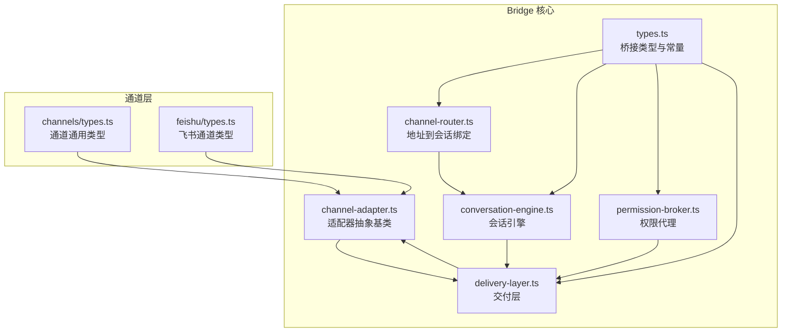
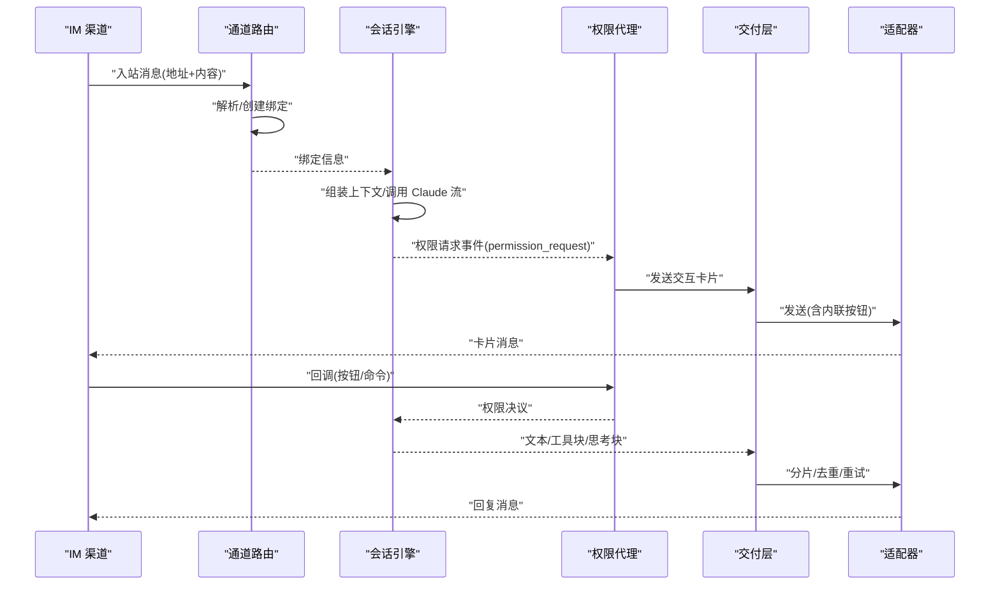
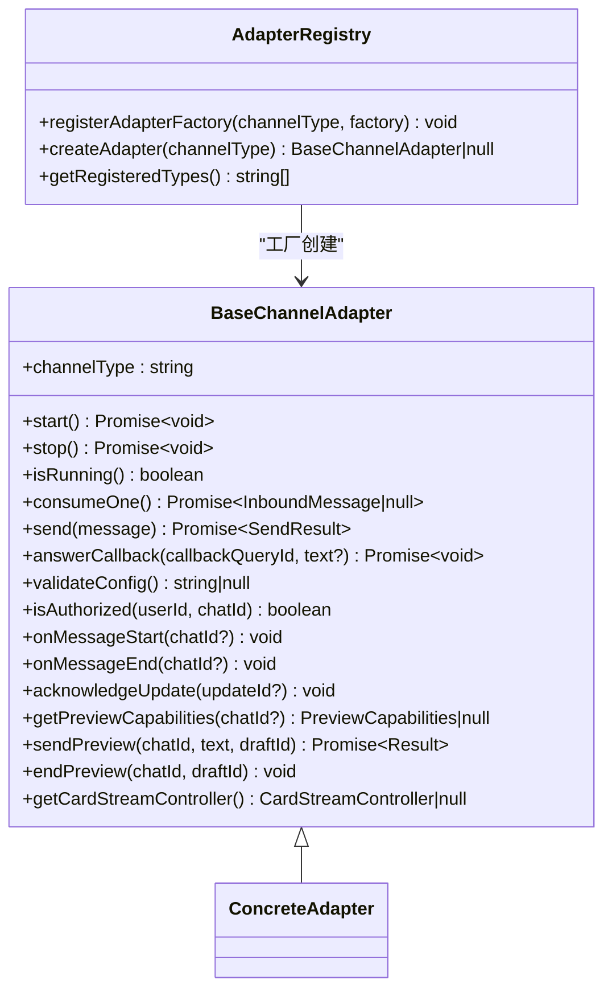
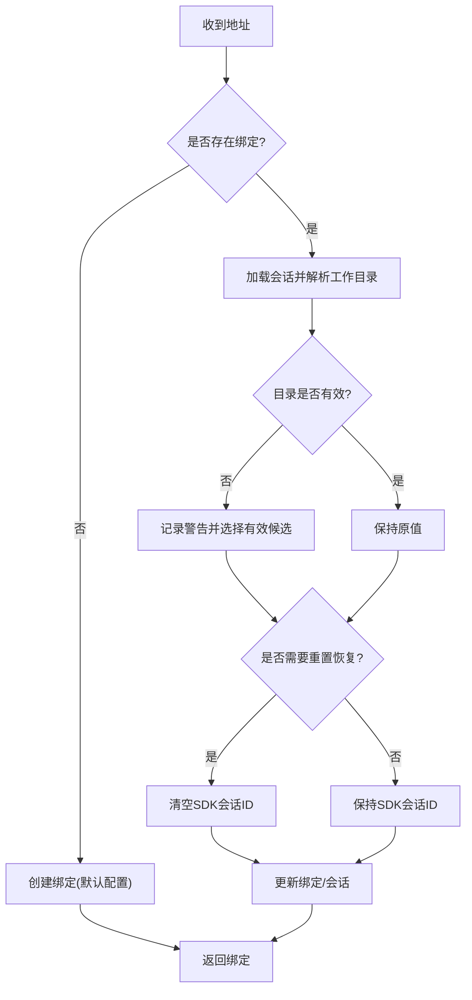
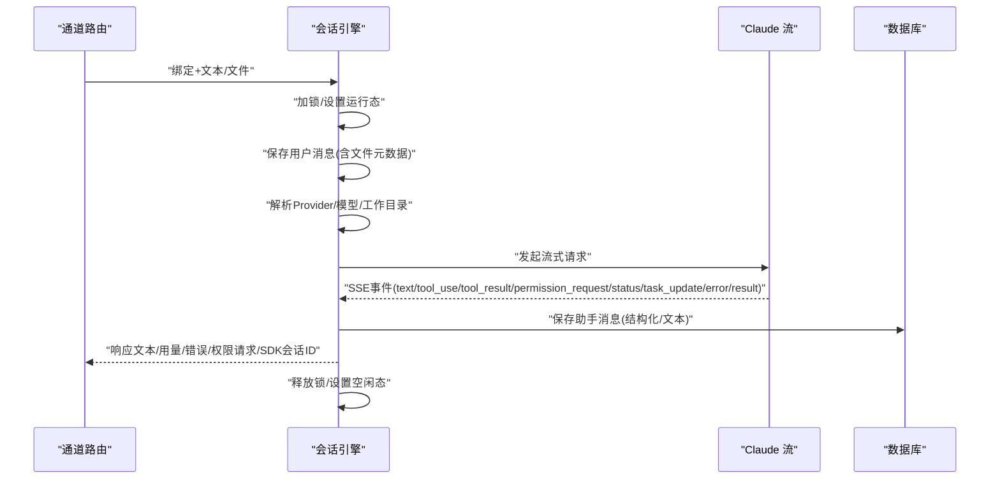
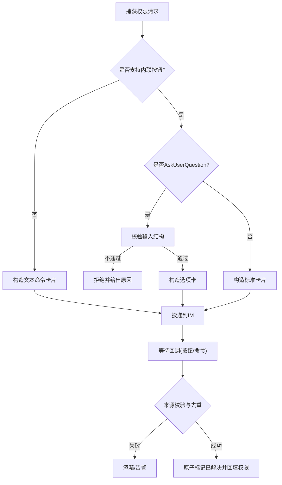
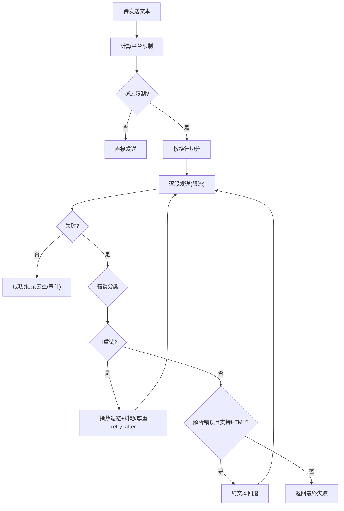
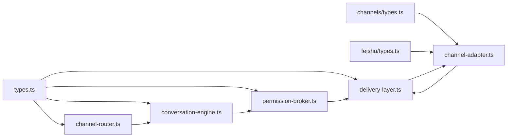

# Bridge 子系统架构

<cite>
**本文引用的文件**
- [channel-adapter.ts](file://src/lib/bridge/channel-adapter.ts)
- [channel-router.ts](file://src/lib/bridge/channel-router.ts)
- [conversation-engine.ts](file://src/lib/bridge/conversation-engine.ts)
- [permission-broker.ts](file://src/lib/bridge/permission-broker.ts)
- [delivery-layer.ts](file://src/lib/bridge/delivery-layer.ts)
- [types.ts](file://src/lib/bridge/types.ts)
- [channels/types.ts](file://src/lib/channels/types.ts)
- [feishu/types.ts](file://src/lib/channels/feishu/types.ts)
</cite>

## 目录
1. [引言](#引言)
2. [项目结构](#项目结构)
3. [核心组件](#核心组件)
4. [架构总览](#架构总览)
5. [详细组件分析](#详细组件分析)
6. [依赖关系分析](#依赖关系分析)
7. [性能考量](#性能考量)
8. [故障排查指南](#故障排查指南)
9. [结论](#结论)
10. [附录](#附录)

## 引言
本文件面向 CodePilot Bridge 子系统，系统性阐述其基于“适配器模式”的架构设计与实现要点，覆盖以下主题：
- 适配器模式在 Bridge 中的应用：channel-adapter.ts 抽象基类、具体通道适配器的扩展点与注册机制
- 消息路由与会话绑定：channel-router.ts 将 IM 地址解析为 CodePilot 会话并维护绑定关系
- 会话引擎：conversation-engine.ts 将入站消息经由 Claude 流式对话处理后落库并返回响应文本
- 权限管理：permission-broker.ts 在流式过程中转发权限请求到 IM 并处理回调
- 交付层：delivery-layer.ts 实现消息分片、去重、重试、速率限制与审计日志
- Markdown 到渠道特定格式的转换流程与渲染路径
- Bridge 生命周期管理、错误处理与性能优化策略

## 项目结构
Bridge 子系统位于 src/lib/bridge 目录，围绕“适配器 + 路由 + 引擎 + 权限 + 交付”的分层组织，配合 src/lib/channels 提供各平台适配器的类型与实现入口。

图表来源
- [channel-adapter.ts:16-105](file://src/lib/bridge/channel-adapter.ts#L16-L105)
- [channel-router.ts:32-125](file://src/lib/bridge/channel-router.ts#L32-L125)
- [conversation-engine.ts:88-284](file://src/lib/bridge/conversation-engine.ts#L88-L284)
- [permission-broker.ts:134-314](file://src/lib/bridge/permission-broker.ts#L134-L314)
- [delivery-layer.ts:142-219](file://src/lib/bridge/delivery-layer.ts#L142-L219)
- [types.ts:11-179](file://src/lib/bridge/types.ts#L11-L179)
- [channels/types.ts](file://src/lib/channels/types.ts)
- [feishu/types.ts](file://src/lib/channels/feishu/types.ts)

章节来源
- [channel-adapter.ts:1-123](file://src/lib/bridge/channel-adapter.ts#L1-L123)
- [channel-router.ts:1-174](file://src/lib/bridge/channel-router.ts#L1-L174)
- [conversation-engine.ts:1-573](file://src/lib/bridge/conversation-engine.ts#L1-L573)
- [permission-broker.ts:1-501](file://src/lib/bridge/permission-broker.ts#L1-L501)
- [delivery-layer.ts:1-357](file://src/lib/bridge/delivery-layer.ts#L1-L357)
- [types.ts:1-180](file://src/lib/bridge/types.ts#L1-L180)
- [channels/types.ts](file://src/lib/channels/types.ts)
- [feishu/types.ts](file://src/lib/channels/feishu/types.ts)

## 核心组件
- 适配器抽象基类：定义统一的生命周期、消息收发、权限回调、预览能力等接口，支持按通道类型注册与创建实例
- 通道路由：将 IM 地址解析为或创建 CodePilot 会话绑定，负责工作目录与 SDK 会话 ID 的自愈与更新
- 会话引擎：负责获取会话锁、组装上下文、调用 Claude 流式接口、消费 SSE、落库与结果提取
- 权限代理：在流式中捕获权限请求，构造交互卡片并投递到 IM；处理回调并回填权限状态
- 交付层：对输出文本进行分片、速率限制、重试与错误分类、去重与审计日志

章节来源
- [channel-adapter.ts:16-105](file://src/lib/bridge/channel-adapter.ts#L16-L105)
- [channel-router.ts:32-125](file://src/lib/bridge/channel-router.ts#L32-L125)
- [conversation-engine.ts:88-284](file://src/lib/bridge/conversation-engine.ts#L88-L284)
- [permission-broker.ts:134-314](file://src/lib/bridge/permission-broker.ts#L134-L314)
- [delivery-layer.ts:142-219](file://src/lib/bridge/delivery-layer.ts#L142-L219)

## 架构总览
Bridge 通过“适配器模式”解耦不同 IM 渠道，统一由路由与引擎协调，权限与交付层贯穿于消息往返的全链路。

图表来源
- [channel-router.ts:32-125](file://src/lib/bridge/channel-router.ts#L32-L125)
- [conversation-engine.ts:88-284](file://src/lib/bridge/conversation-engine.ts#L88-L284)
- [permission-broker.ts:134-314](file://src/lib/bridge/permission-broker.ts#L134-L314)
- [delivery-layer.ts:142-219](file://src/lib/bridge/delivery-layer.ts#L142-L219)
- [channel-adapter.ts:16-105](file://src/lib/bridge/channel-adapter.ts#L16-L105)

## 详细组件分析

### 适配器模式与通道适配器基类
- 抽象职责：生命周期(start/stop/isRunning)、消息消费(consumeOne)、消息发送(send)、可选能力(answerCallback、预览、卡片流控制器)
- 注册机制：以通道类型为键的工厂映射，支持运行时动态创建适配器实例
- 扩展点：各通道适配器仅需实现抽象方法，即可无缝接入 Bridge

图表来源
- [channel-adapter.ts:16-105](file://src/lib/bridge/channel-adapter.ts#L16-L105)
- [channels/types.ts](file://src/lib/channels/types.ts)

章节来源
- [channel-adapter.ts:16-105](file://src/lib/bridge/channel-adapter.ts#L16-L105)

### 通道路由与会话绑定
- 解析逻辑：根据通道类型+聊天ID查找或创建绑定，自动修复工作目录与 SDK 会话 ID
- 创建绑定：生成新会话并写入默认模型/提供方/工作目录等配置
- 绑定更新：支持更新 SDK 会话 ID、工作目录、模型、模式、提供方与激活状态
- 自愈策略：当工作目录失效或来源变更时，清理 SDK 会话 ID 防止错误恢复

图表来源
- [channel-router.ts:32-125](file://src/lib/bridge/channel-router.ts#L32-L125)

章节来源
- [channel-router.ts:32-125](file://src/lib/bridge/channel-router.ts#L32-L125)

### 会话引擎：流式处理与落库
- 会话锁：进程内加锁避免并发冲突，定时续期，异常释放
- 上下文装配：历史消息、系统提示、工作目录、MCP 服务器等
- Provider 解析：按绑定/会话/全局顺序解析，协议与模型一致性校验
- 流式消费：逐行解析 SSE 事件，累积文本、记录工具使用/结果、权限请求、技能建议、任务同步、状态变更与用量统计
- 结果提取：优先文本块，若无文本但有思考块则补充摘要提示；异常时尽力落库并返回用户可读错误

图表来源
- [conversation-engine.ts:88-284](file://src/lib/bridge/conversation-engine.ts#L88-L284)
- [conversation-engine.ts:290-572](file://src/lib/bridge/conversation-engine.ts#L290-L572)

章节来源
- [conversation-engine.ts:88-284](file://src/lib/bridge/conversation-engine.ts#L88-L284)
- [conversation-engine.ts:290-572](file://src/lib/bridge/conversation-engine.ts#L290-L572)

### 权限代理：交互卡片与回调处理
- 请求转发：将权限请求转为交互卡片(允许/允许会话/拒绝)，支持飞书等带内联按钮的通道与文本命令两种形态
- AskUserQuestion 特例：单选单题选项卡，严格校验输入结构，不支持多选/多题/无选项
- 去重与安全：按请求ID去重，回调时校验聊天ID与消息ID，原子标记已解决，防止重复处理
- 自动批准：会话切换至 full_access 时批量自动批准待决权限

图表来源
- [permission-broker.ts:134-314](file://src/lib/bridge/permission-broker.ts#L134-L314)
- [permission-broker.ts:380-469](file://src/lib/bridge/permission-broker.ts#L380-L469)

章节来源
- [permission-broker.ts:134-314](file://src/lib/bridge/permission-broker.ts#L134-L314)
- [permission-broker.ts:380-469](file://src/lib/bridge/permission-broker.ts#L380-L469)

### 交付层：分片、速率限制与重试
- 文本分片：按平台最大长度切分，优先在换行处切割，避免截断单词
- 速率限制：每聊天 20 条/分钟桶，多段消息之间追加固定延迟
- 错误分类与重试：区分限流/服务端/客户端/解析错误/网络错误，采用指数退避+抖动，尊重 429 的 retry_after
- HTML 回退：遇到实体解析错误，立即尝试纯文本发送
- 去重与审计：基于键值去重，记录出站参考与审计摘要

图表来源
- [delivery-layer.ts:41-64](file://src/lib/bridge/delivery-layer.ts#L41-L64)
- [delivery-layer.ts:139-219](file://src/lib/bridge/delivery-layer.ts#L139-L219)
- [delivery-layer.ts:224-267](file://src/lib/bridge/delivery-layer.ts#L224-L267)

章节来源
- [delivery-layer.ts:41-64](file://src/lib/bridge/delivery-layer.ts#L41-L64)
- [delivery-layer.ts:139-219](file://src/lib/bridge/delivery-layer.ts#L139-L219)
- [delivery-layer.ts:224-267](file://src/lib/bridge/delivery-layer.ts#L224-L267)

### Markdown 到渠道特定格式的转换流程
- 预渲染路径：deliverRendered 接受已渲染的 TelegramChunk（包含 HTML 与纯文本），逐段发送并回退到纯文本
- 交付层分片：chunkText 对长文本进行行级切分，确保平台兼容
- 通道类型约束：types.ts 定义各平台消息上限，delivery-layer.ts 动态选择对应限制

章节来源
- [delivery-layer.ts:273-356](file://src/lib/bridge/delivery-layer.ts#L273-L356)
- [types.ts:171-179](file://src/lib/bridge/types.ts#L171-L179)

### Bridge 生命周期管理
- 适配器生命周期：start/stop 必须幂等，isRunning 用于状态查询；部分适配器支持延迟偏移确认与预览能力
- 会话生命周期：引擎在处理前后设置运行态，定期续期会话锁，异常时释放锁并回滚状态
- 路由自愈：工作目录变化或来源重置时，清理 SDK 会话 ID 防止错误恢复

章节来源
- [channel-adapter.ts:20-34](file://src/lib/bridge/channel-adapter.ts#L20-L34)
- [conversation-engine.ts:113-118](file://src/lib/bridge/conversation-engine.ts#L113-L118)
- [channel-router.ts:23-25](file://src/lib/bridge/channel-router.ts#L23-L25)
- [channel-router.ts:62-65](file://src/lib/bridge/channel-router.ts#L62-L65)

## 依赖关系分析
Bridge 各模块之间的依赖与耦合关系如下：

图表来源
- [types.ts:1-180](file://src/lib/bridge/types.ts#L1-L180)
- [channel-router.ts:8-21](file://src/lib/bridge/channel-router.ts#L8-L21)
- [conversation-engine.ts:12-33](file://src/lib/bridge/conversation-engine.ts#L12-L33)
- [permission-broker.ts:12-18](file://src/lib/bridge/permission-broker.ts#L12-L18)
- [delivery-layer.ts:6-24](file://src/lib/bridge/delivery-layer.ts#L6-L24)
- [channel-adapter.ts:8-14](file://src/lib/bridge/channel-adapter.ts#L8-L14)
- [channels/types.ts](file://src/lib/channels/types.ts)
- [feishu/types.ts](file://src/lib/channels/feishu/types.ts)

章节来源
- [types.ts:1-180](file://src/lib/bridge/types.ts#L1-L180)
- [channel-router.ts:8-21](file://src/lib/bridge/channel-router.ts#L8-L21)
- [conversation-engine.ts:12-33](file://src/lib/bridge/conversation-engine.ts#L12-L33)
- [permission-broker.ts:12-18](file://src/lib/bridge/permission-broker.ts#L12-L18)
- [delivery-layer.ts:6-24](file://src/lib/bridge/delivery-layer.ts#L6-L24)
- [channel-adapter.ts:8-14](file://src/lib/bridge/channel-adapter.ts#L8-L14)
- [channels/types.ts](file://src/lib/channels/types.ts)
- [feishu/types.ts](file://src/lib/channels/feishu/types.ts)

## 性能考量
- 会话锁与续期：避免并发冲突，降低数据库争用；注意异常路径释放锁
- 速率限制：每聊天 20 条/分钟，多段消息间追加延迟，减少平台限流触发
- 分片与回退：优先行级切分，解析错误时快速回退到纯文本，提升成功率
- 去重与审计：减少重复发送，便于问题追踪与计费核对
- 工作目录自愈：避免无效目录导致的 SDK 会话恢复失败，减少重试成本

## 故障排查指南
- 会话忙：若获取会话锁失败，返回“正在处理其他请求”，检查并发与锁续期
- 速率限制：429 时尊重 retry_after 并增加缓冲；否则指数退避
- 解析错误：HTML 实体解析失败时自动回退纯文本；检查富文本格式与实体边界
- 权限回调异常：校验聊天ID/消息ID一致性，查看去重标记；并发场景下关注原子标记
- 文件上传：上传目录不存在时降级为占位提示；检查工作目录与磁盘权限
- SDK 会话恢复：工作目录变更时清空 SDK 会话 ID，避免错误恢复

章节来源
- [conversation-engine.ts:100-111](file://src/lib/bridge/conversation-engine.ts#L100-L111)
- [delivery-layer.ts:128-135](file://src/lib/bridge/delivery-layer.ts#L128-L135)
- [delivery-layer.ts:238-253](file://src/lib/bridge/delivery-layer.ts#L238-L253)
- [permission-broker.ts:399-415](file://src/lib/bridge/permission-broker.ts#L399-L415)
- [conversation-engine.ts:133-155](file://src/lib/bridge/conversation-engine.ts#L133-L155)

## 结论
Bridge 子系统通过清晰的分层与适配器模式，实现了跨 IM 渠道的一致体验。通道路由与会话引擎承担“连接与对话”的核心职责，权限代理与交付层保障“交互与可靠送达”。结合分片、去重、重试与速率限制，系统在复杂网络环境下仍能稳定运行。后续可在通道适配器注册、Markdown 渲染与权限策略扩展方面继续演进。

## 附录
- 类型与常量：统一定义通道类型、地址、消息、绑定、状态、审计与平台限制
- 通道类型：channels/types.ts 提供通用通道类型，feishu/types.ts 提供飞书特有类型

章节来源
- [types.ts:11-179](file://src/lib/bridge/types.ts#L11-L179)
- [channels/types.ts](file://src/lib/channels/types.ts)
- [feishu/types.ts](file://src/lib/channels/feishu/types.ts)