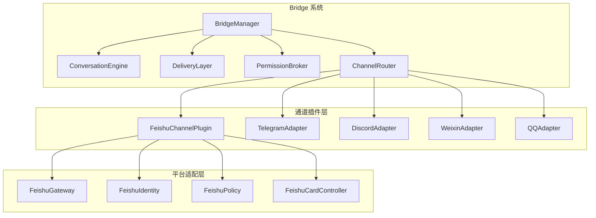
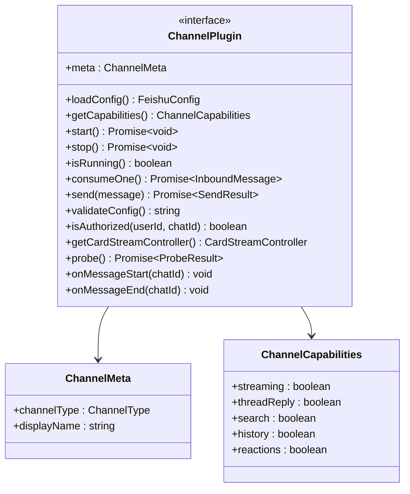
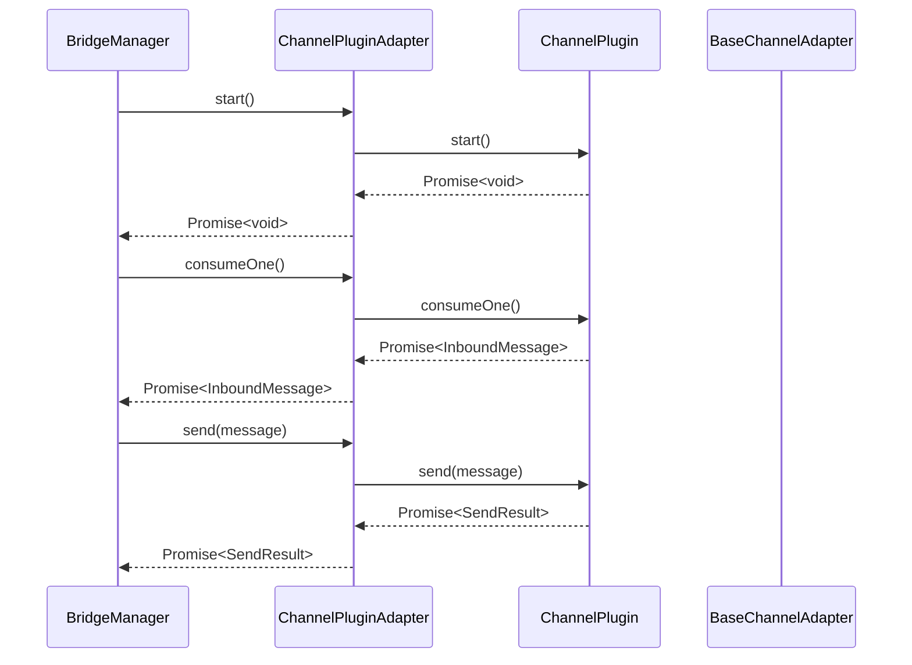
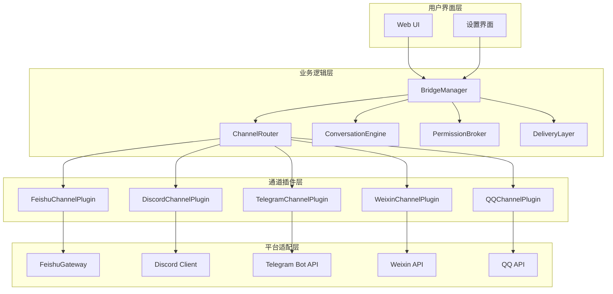
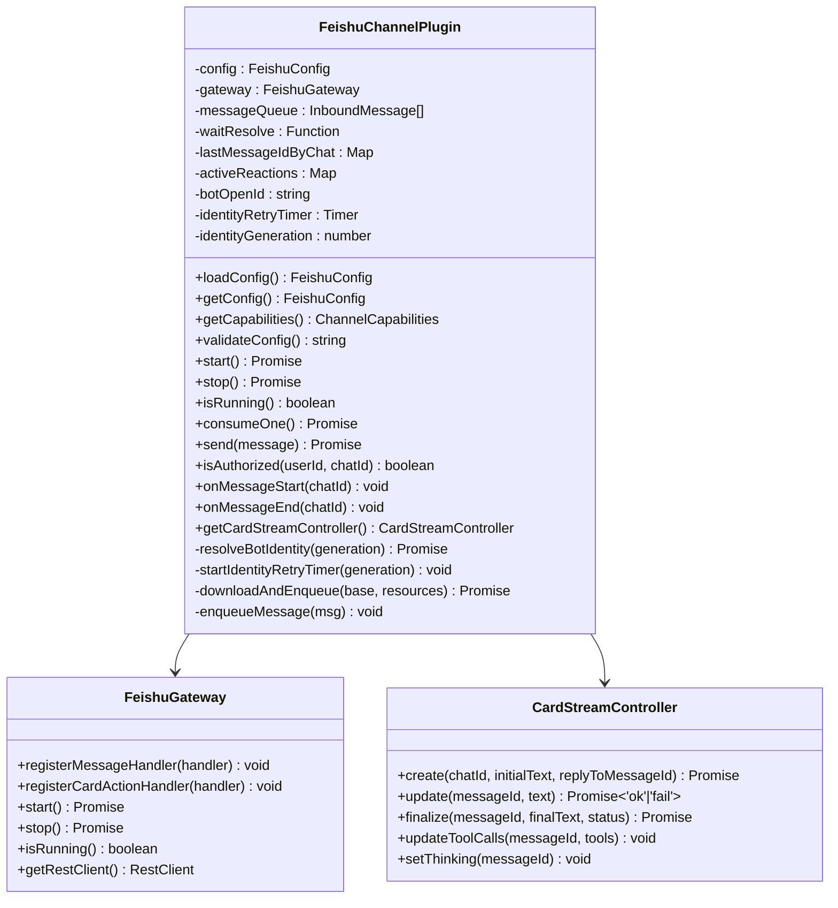
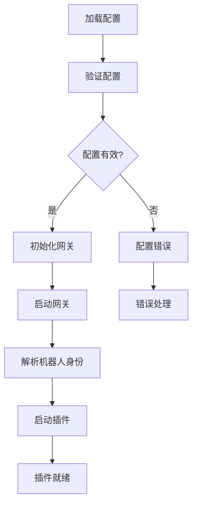
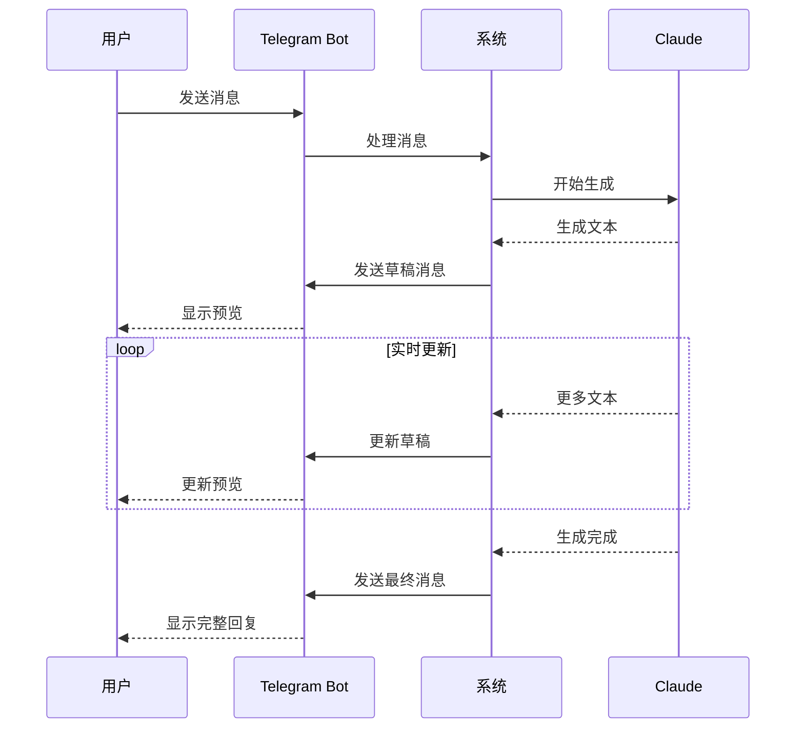
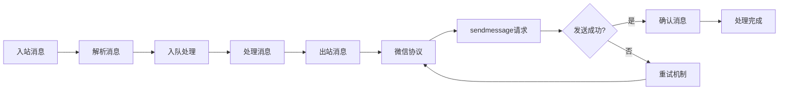
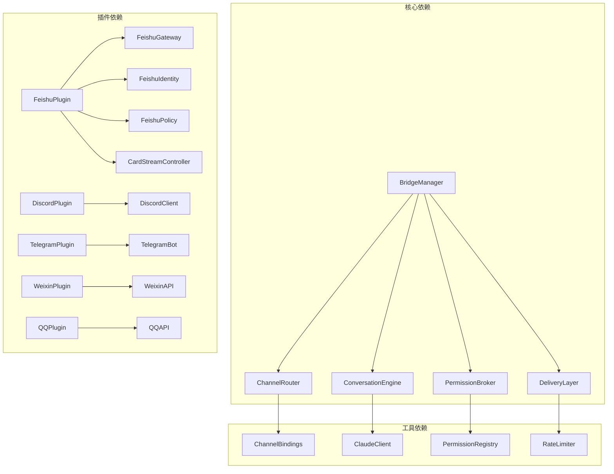
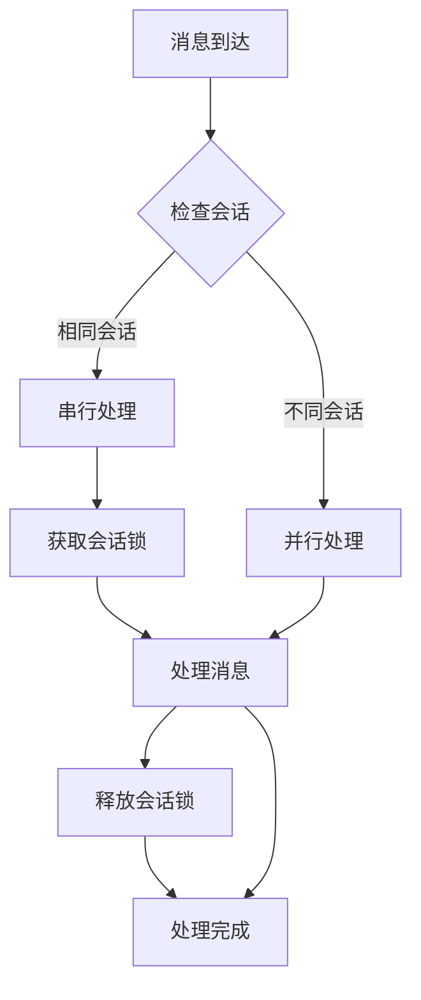

# Channel 插件系统

<cite>
**本文档引用的文件**
- [bridge-system.md](file://docs/handover/bridge-system.md)
- [types.ts](file://src/lib/channels/types.ts)
- [channel-plugin-adapter.ts](file://src/lib/channels/channel-plugin-adapter.ts)
- [feishu/index.ts](file://src/lib/channels/feishu/index.ts)
- [feishu/types.ts](file://src/lib/channels/feishu/types.ts)
- [BridgeSection.tsx](file://src/components/bridge/BridgeSection.tsx)
- [FeishuBridgeSection.tsx](file://src/components/bridge/FeishuBridgeSection.tsx)
- [DiscordBridgeSection.tsx](file://src/components/bridge/DiscordBridgeSection.tsx)
</cite>

## 目录
1. [简介](#简介)
2. [项目结构](#项目结构)
3. [核心组件](#核心组件)
4. [架构概览](#架构概览)
5. [详细组件分析](#详细组件分析)
6. [依赖关系分析](#依赖关系分析)
7. [性能考虑](#性能考虑)
8. [故障排除指南](#故障排除指南)
9. [结论](#结论)
10. [附录](#附录)

## 简介

Bridge 子系统的 Channel 插件系统是一个高度模块化的架构，旨在为多种即时通讯平台（Telegram、Discord、飞书、微信等）提供统一的远程会话桥接能力。该系统通过插件化设计实现了平台无关性，使得新的 IM 通道可以轻松集成。

该系统的核心设计理念是"通道层"抽象，将不同平台的差异性封装在插件内部，为上层提供统一的接口契约。这种设计不仅提高了系统的可维护性，还为未来的扩展提供了清晰的路径。

## 项目结构

### 整体架构布局

**图表来源**
- [bridge-system.md:1-517](file://docs/handover/bridge-system.md#L1-L517)

### 插件目录结构

系统采用模块化目录结构，每个通道都有独立的插件实现：

- **src/lib/channels/** - 通道插件核心接口定义
- **src/lib/channels/feishu/** - 飞书专用插件实现
- **src/lib/channels/discord/** - Discord 专用插件实现  
- **src/lib/channels/telegram/** - Telegram 专用插件实现
- **src/lib/channels/weixin/** - 微信 专用插件实现

**章节来源**
- [bridge-system.md:43-57](file://docs/handover/bridge-system.md#L43-L57)

## 核心组件

### 通道插件接口契约

通道插件系统的核心是统一的接口契约，定义了所有通道插件必须实现的标准方法：

**图表来源**
- [types.ts:86-125](file://src/lib/channels/types.ts#L86-L125)

### 适配器桥接机制

为了兼容现有的适配器架构，系统提供了 `ChannelPluginAdapter` 适配器，将新的插件接口桥接到传统的 `BaseChannelAdapter`：

**图表来源**
- [channel-plugin-adapter.ts:17-73](file://src/lib/channels/channel-plugin-adapter.ts#L17-L73)

**章节来源**
- [types.ts:1-126](file://src/lib/channels/types.ts#L1-L126)
- [channel-plugin-adapter.ts:1-74](file://src/lib/channels/channel-plugin-adapter.ts#L1-L74)

## 架构概览

### 系统整体架构

**图表来源**
- [bridge-system.md:1-517](file://docs/handover/bridge-system.md#L1-L517)

### 数据流处理

系统采用流水线式的数据处理架构，每个消息都会经过以下处理阶段：

1. **入站消息接收** - 从各平台 API 获取原始消息
2. **消息解析** - 解析平台特定的消息格式
3. **授权验证** - 检查用户权限和访问控制
4. **路由分发** - 根据会话信息路由到正确的处理流程
5. **内容处理** - 处理消息内容和附件
6. **响应生成** - 生成平台特定的响应格式
7. **出站发送** - 发送到目标平台

**章节来源**
- [bridge-system.md:59-324](file://docs/handover/bridge-system.md#L59-L324)

## 详细组件分析

### 飞书通道插件

#### 核心架构设计

飞书通道插件是系统中最复杂的插件实现，采用了模块化的设计理念：

**图表来源**
- [feishu/index.ts:39-456](file://src/lib/channels/feishu/index.ts#L39-L456)

#### 配置管理系统

飞书插件的配置系统采用了集中式管理方式：

**图表来源**
- [feishu/index.ts:90-238](file://src/lib/channels/feishu/index.ts#L90-L238)

#### 授权验证机制

飞书插件实现了多层次的授权验证机制：

| 验证层级 | 验证内容 | 实现方式 |
|---------|---------|----------|
| 用户身份验证 | 检查用户是否在允许列表中 | `isUserAuthorized()` |
| DM 策略验证 | 私聊策略检查 | `dmPolicy` 配置 |
| 群聊策略验证 | 群聊访问控制 | `groupPolicy` 配置 |
| @提及验证 | 群聊 @bot 要求 | `requireMention` 配置 |
| 线程会话验证 | 每话题独立上下文 | `threadSession` 配置 |

**章节来源**
- [feishu/index.ts:109-124](file://src/lib/channels/feishu/index.ts#L109-L124)
- [feishu/types.ts:5-24](file://src/lib/channels/feishu/types.ts#L5-L24)

### Discord 通道插件

#### 核心特性

Discord 通道插件专注于提供原生的 Discord 体验：

- **原生 Markdown 支持** - 直接使用 Discord 的 Markdown 渲染
- **按钮交互** - 支持 Discord 的交互式按钮组件
- **流式预览** - 支持消息的实时编辑预览
- **打字指示器** - 自动显示用户正在输入的状态

#### 配置选项

Discord 插件提供了丰富的配置选项：

| 配置项 | 默认值 | 说明 |
|--------|--------|------|
| bridge_discord_bot_token | 空 | 机器人的认证令牌 |
| bridge_discord_allowed_users | 空 | 允许使用的用户 ID 列表 |
| bridge_discord_allowed_channels | 空 | 允许使用的频道 ID 列表 |
| bridge_discord_allowed_guilds | 空 | 允许使用的服务器 ID 列表 |
| bridge_discord_group_policy | open | 群聊策略 (open/disabled) |
| bridge_discord_require_mention | false | 是否需要 @bot 提及 |
| bridge_discord_stream_enabled | true | 是否启用流式预览 |
| bridge_discord_max_attachment_size | 空 | 附件大小限制 |
| bridge_discord_image_enabled | true | 是否启用图片接收 |

**章节来源**
- [DiscordBridgeSection.tsx:20-42](file://src/components/bridge/DiscordBridgeSection.tsx#L20-L42)

### Telegram 通道插件

#### 图片处理能力

Telegram 插件具有强大的图片处理能力：

- **多尺寸图片支持** - 自动选择最优分辨率的图片
- **相册消息处理** - 支持图片相册的批量处理
- **媒体组防抖** - 500ms 防抖处理相册消息
- **文件附件支持** - 支持各种类型的文件附件

#### 流式预览功能

Telegram 插件实现了独特的流式预览功能：

**图表来源**
- [bridge-system.md:273-280](file://docs/handover/bridge-system.md#L273-L280)

**章节来源**
- [bridge-system.md:193-216](file://docs/handover/bridge-system.md#L193-L216)

### 微信通道插件

#### 多账号支持

微信插件支持多账号并存的独特设计：

- **合成 chatId** - 使用 `weixin::<accountId>::<peerUserId>` 格式
- **账号隔离** - 每个账号拥有独立的上下文和偏移量
- **批量确认** - 支持批量消息确认机制
- **媒体下载** - 支持微信媒体资源的下载和解密

#### 出站协议设计

微信的出站协议采用了独特的设计：

**图表来源**
- [bridge-system.md:166-175](file://docs/handover/bridge-system.md#L166-L175)

**章节来源**
- [bridge-system.md:122-191](file://docs/handover/bridge-system.md#L122-L191)

## 依赖关系分析

### 组件耦合度分析

**图表来源**
- [bridge-system.md:1-517](file://docs/handover/bridge-system.md#L1-L517)

### 外部依赖管理

系统对外部依赖采用了严格的管理策略：

- **平台 SDK** - 仅使用必要的平台 SDK，避免过度依赖
- **第三方库** - 通过 npm 管理，定期更新和安全扫描
- **API 限制** - 实现了完善的 API 速率限制和错误处理
- **认证管理** - 统一的认证令牌管理和轮换机制

**章节来源**
- [bridge-system.md:240-256](file://docs/handover/bridge-system.md#L240-L256)

## 性能考虑

### 并发模型设计

系统采用了"同会话串行、跨会话并行"的并发模型：

### 缓存和优化策略

系统实现了多层缓存和优化策略：

- **消息去重缓存** - 防止重复消息的处理
- **配置缓存** - 减少配置加载的开销
- **连接池管理** - 优化平台 API 连接的使用
- **内存管理** - 合理的内存使用和垃圾回收

## 故障排除指南

### 常见问题诊断

#### 连接问题排查

1. **检查网络连接**
   - 验证服务器网络可达性
   - 检查防火墙和代理设置
   - 确认平台 API 可用性

2. **验证认证配置**
   - 检查 API 密钥的有效性
   - 验证权限范围设置
   - 确认域名配置正确

3. **监控连接状态**
   - 查看连接日志
   - 监控重连次数
   - 检查连接超时设置

#### 性能问题诊断

1. **消息延迟分析**
   - 监控消息处理时间
   - 检查队列长度
   - 分析峰值负载情况

2. **资源使用监控**
   - 监控内存使用情况
   - 检查 CPU 占用率
   - 分析磁盘 I/O 性能

3. **平台 API 限制**
   - 监控 API 调用频率
   - 检查配额使用情况
   - 分析错误响应类型

### 调试技巧

#### 日志分析

系统提供了详细的日志记录机制：

- **调试日志** - 详细的处理流程记录
- **错误日志** - 异常情况的完整堆栈跟踪
- **性能日志** - 关键操作的性能指标
- **审计日志** - 所有重要操作的审计记录

#### 实时监控

- **状态面板** - 实时显示系统状态
- **指标仪表板** - 关键性能指标可视化
- **告警系统** - 异常情况的自动告警
- **健康检查** - 定期的系统健康评估

**章节来源**
- [bridge-system.md:252-256](file://docs/handover/bridge-system.md#L252-L256)

## 结论

Bridge 子系统的 Channel 插件系统通过模块化的设计理念，成功地将多种不同的即时通讯平台整合到了统一的架构中。该系统的主要优势包括：

1. **高度模块化** - 每个通道都是独立的插件，便于维护和扩展
2. **统一接口** - 通过适配器桥接，实现了平台无关的编程接口
3. **灵活配置** - 支持丰富的配置选项，满足不同场景需求
4. **强大功能** - 提供了完整的消息处理、权限控制和状态同步能力
5. **良好性能** - 采用了高效的并发模型和优化策略

该系统为未来的扩展奠定了坚实的基础，可以轻松集成新的即时通讯平台，同时保持系统的稳定性和可靠性。

## 附录

### 开发指南

#### 新通道插件开发步骤

1. **实现 ChannelPlugin 接口**
   - 定义插件元数据
   - 实现必需的方法
   - 处理异步操作

2. **配置适配器**
   - 创建 ChannelPluginAdapter
   - 实现代理方法
   - 处理生命周期管理

3. **集成到系统**
   - 注册插件到适配器注册表
   - 添加配置界面
   - 实现 API 路由

4. **测试和部署**
   - 编写单元测试
   - 进行集成测试
   - 部署到生产环境

#### 最佳实践

- **错误处理** - 实现完善的错误处理和重试机制
- **性能优化** - 注意内存使用和资源管理
- **安全性** - 实施适当的访问控制和数据保护
- **可维护性** - 保持代码简洁和文档完整