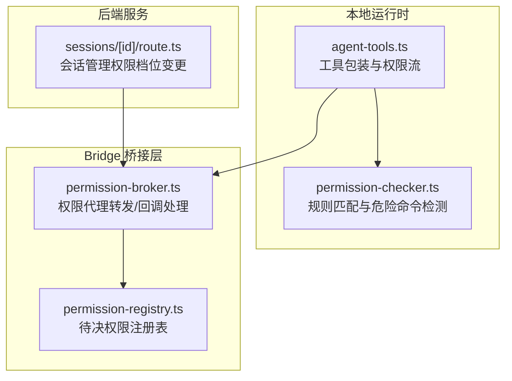
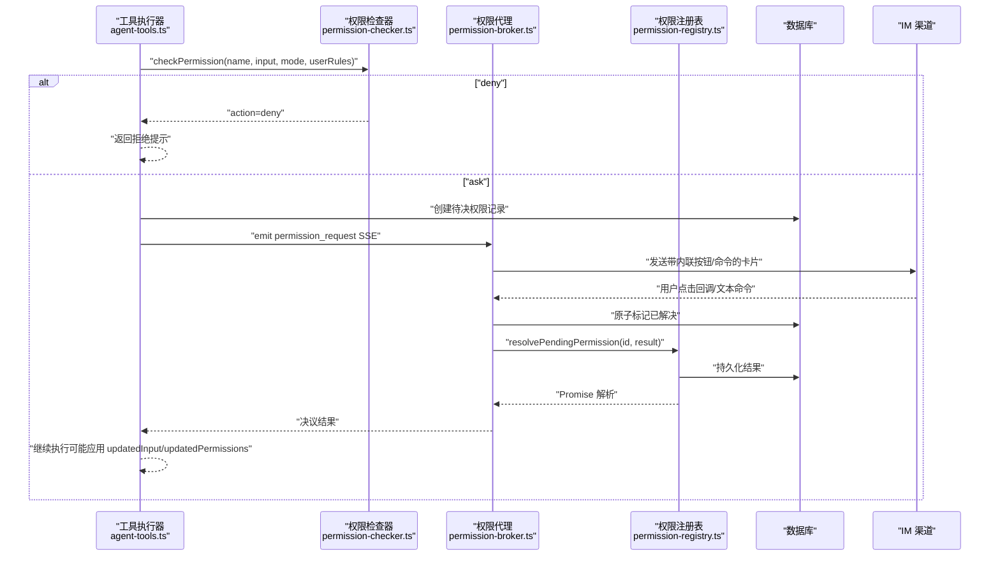
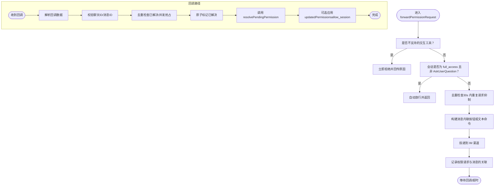
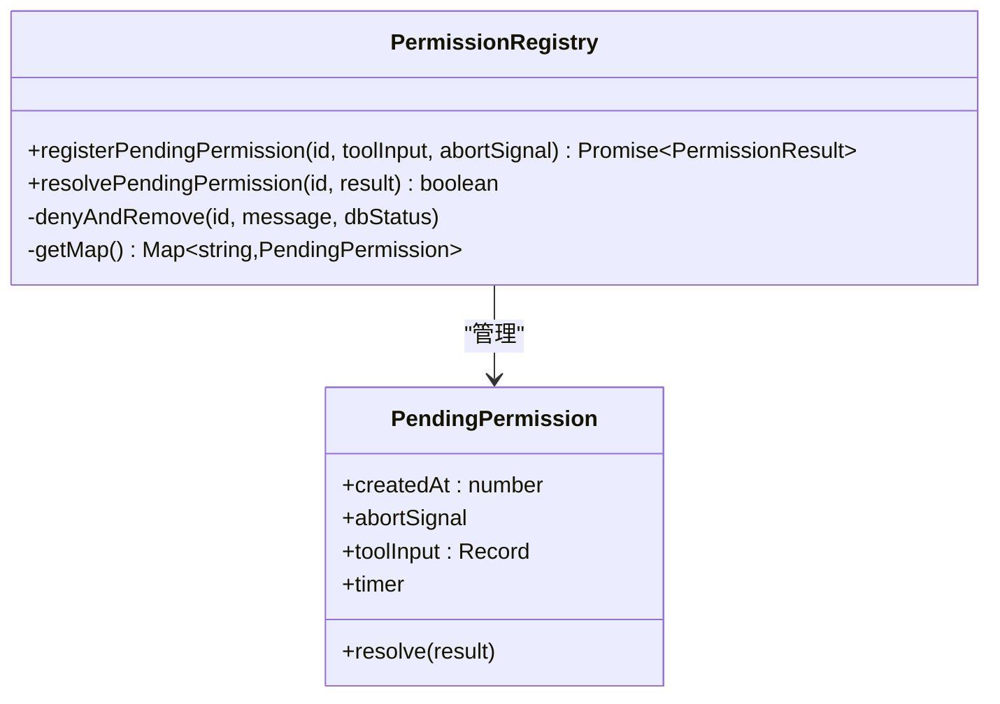
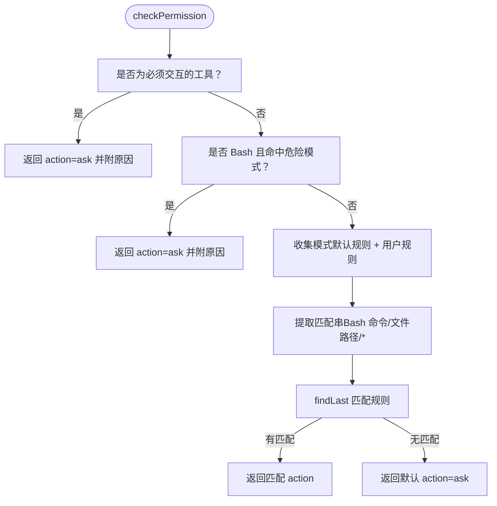
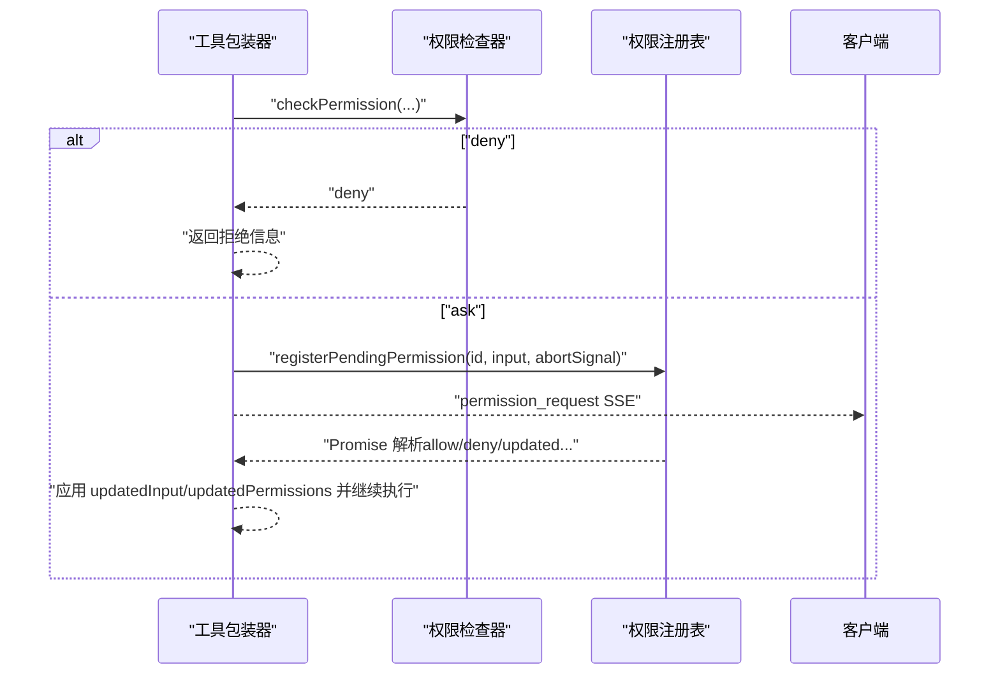
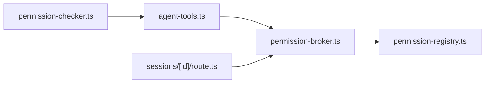

# 权限管理与权限代理

<cite>
**本文引用的文件**
- [permission-broker.ts](file://src/lib/bridge/permission-broker.ts)
- [permission-registry.ts](file://src/lib/permission-registry.ts)
- [permission-checker.ts](file://src/lib/permission-checker.ts)
- [agent-tools.ts](file://src/lib/agent-tools.ts)
- [route.ts](file://src/app/api/chat/sessions/[id]/route.ts)
- [native-runtime.test.ts](file://src/__tests__/unit/native-runtime.test.ts)
- [permission-broker-bridge.manual-test.ts](file://src/__tests__/unit/permission-broker-bridge.manual-test.ts)
</cite>

## 目录
1. [简介](#简介)
2. [项目结构](#项目结构)
3. [核心组件](#核心组件)
4. [架构总览](#架构总览)
5. [详细组件分析](#详细组件分析)
6. [依赖关系分析](#依赖关系分析)
7. [性能考量](#性能考量)
8. [故障排查指南](#故障排查指南)
9. [结论](#结论)
10. [附录](#附录)

## 简介
本文件系统性阐述 Bridge 子系统的权限管理体系，重点覆盖以下三部分：
- 权限代理（permission-broker.ts）：负责将 Claude 的权限请求转发到即时消息（IM）渠道，并通过内联按钮或命令式指令接收用户响应，最终调用权限注册表完成决议。
- 权限注册表（permission-registry.ts）：维护“待决权限”映射，提供超时与中止保护，持久化记录用户决策，并在内存中提供异步决议能力。
- 权限检查器（permission-checker.ts）：在本地运行时对工具调用进行规则匹配与危险命令检测，支持三种模式（探索/普通/信任），并提供可扩展的规则引擎。

该文档同时给出权限配置示例、最佳实践与常见问题解决方案，帮助开发者在 Bridge 场景下安全、可控地执行工具调用。

## 项目结构
围绕权限管理的关键文件分布如下：
- 权限代理：src/lib/bridge/permission-broker.ts
- 权限注册表：src/lib/permission-registry.ts
- 权限检查器：src/lib/permission-checker.ts
- 工具包装与权限流：src/lib/agent-tools.ts
- 会话 API（切换权限档位触发自动放行）：src/app/api/chat/sessions/[id]/route.ts
- 单元测试（验证规则与交互守卫）：src/__tests__/unit/native-runtime.test.ts、src/__tests__/unit/permission-broker-bridge.manual-test.ts

图表来源
- [agent-tools.ts:120-202](file://src/lib/agent-tools.ts#L120-L202)
- [permission-checker.ts:127-168](file://src/lib/permission-checker.ts#L127-L168)
- [permission-broker.ts:134-314](file://src/lib/bridge/permission-broker.ts#L134-L314)
- [permission-registry.ts:51-127](file://src/lib/permission-registry.ts#L51-L127)
- [route.ts:73-87](file://src/app/api/chat/sessions/[id]/route.ts#L73-L87)

章节来源
- [agent-tools.ts:120-202](file://src/lib/agent-tools.ts#L120-L202)
- [permission-checker.ts:127-168](file://src/lib/permission-checker.ts#L127-L168)
- [permission-broker.ts:134-314](file://src/lib/bridge/permission-broker.ts#L134-L314)
- [permission-registry.ts:51-127](file://src/lib/permission-registry.ts#L51-L127)
- [route.ts:73-87](file://src/app/api/chat/sessions/[id]/route.ts#L73-L87)

## 核心组件
- 权限检查器（permission-checker.ts）
  - 提供三种模式：explore（只读）、normal（标准）、trust（全开）。
  - 规则引擎采用 findLast 语义，允许具体规则覆盖通用规则；默认“询问”。
  - 对 Bash 命令进行危险模式检测，无论模式如何均需确认。
- 权限注册表（permission-registry.ts）
  - 维护全局 Map 记录待决权限，提供超时与中止保护，持久化审计。
  - 支持在内存中解析待决请求，并写入数据库以保证一致性。
- 权限代理（permission-broker.ts）
  - 将权限请求转化为 IM 可渲染的消息卡片，支持内联按钮与文本命令两种交互。
  - 处理回调校验（聊天 ID、消息 ID、去重）、原子性标记已解决、支持“本次会话放行”。
  - 对不支持交互的工具直接拒绝，避免降级为无意义的空答案。

章节来源
- [permission-checker.ts:127-168](file://src/lib/permission-checker.ts#L127-L168)
- [permission-registry.ts:51-127](file://src/lib/permission-registry.ts#L51-L127)
- [permission-broker.ts:134-314](file://src/lib/bridge/permission-broker.ts#L134-L314)

## 架构总览
下图展示从工具调用到 IM 回调再到内存决议的完整链路：

图表来源
- [agent-tools.ts:126-196](file://src/lib/agent-tools.ts#L126-L196)
- [permission-checker.ts:127-168](file://src/lib/permission-checker.ts#L127-L168)
- [permission-broker.ts:134-314](file://src/lib/bridge/permission-broker.ts#L134-L314)
- [permission-registry.ts:98-127](file://src/lib/permission-registry.ts#L98-L127)

## 详细组件分析

### 权限代理（permission-broker.ts）
职责概览
- 将 Claude 的权限请求格式化为 IM 可渲染卡片，支持内联按钮与文本命令两种交互。
- 在回调到达时进行来源校验（聊天 ID、消息 ID）、去重与原子性标记，再调用注册表完成决议。
- 对不支持交互的工具（如 AskUserQuestion 在不支持按钮的渠道）直接拒绝，避免降级。
- 当会话权限档位切换至 full_access 时，自动放行所有待决权限。

关键流程
- 请求转发：根据适配器能力选择内联按钮或文本命令；对 AskUserQuestion 进行严格校验。
- 回调处理：解析回调数据，校验来源与去重，原子标记已解决，再调用注册表。
- 自动放行：当会话档位从 default 切换到 full_access 时，批量放行待决权限。

图表来源
- [permission-broker.ts:134-314](file://src/lib/bridge/permission-broker.ts#L134-L314)
- [permission-broker.ts:380-469](file://src/lib/bridge/permission-broker.ts#L380-L469)
- [permission-broker.ts:476-500](file://src/lib/bridge/permission-broker.ts#L476-L500)

章节来源
- [permission-broker.ts:134-314](file://src/lib/bridge/permission-broker.ts#L134-L314)
- [permission-broker.ts:380-469](file://src/lib/bridge/permission-broker.ts#L380-L469)
- [permission-broker.ts:476-500](file://src/lib/bridge/permission-broker.ts#L476-L500)

### 权限注册表（permission-registry.ts）
职责概览
- 维护全局 Map 记录每个待决权限请求，包含创建时间、超时定时器、中止信号与原始输入。
- 提供注册与解析两个核心 API：注册时返回 Promise，解析时持久化并解除内存占用。
- 超时与中止：统一在超时或中止时拒绝并写入持久化存储，确保一致性。

图表来源
- [permission-registry.ts:7-13](file://src/lib/permission-registry.ts#L7-L13)
- [permission-registry.ts:51-127](file://src/lib/permission-registry.ts#L51-L127)

章节来源
- [permission-registry.ts:51-127](file://src/lib/permission-registry.ts#L51-L127)

### 权限检查器（permission-checker.ts）
职责概览
- 三种模式：
  - explore：只读，禁止写与危险命令。
  - normal：标准，读写与编辑默认允许，Bash 需确认；部分常见安全命令自动放行。
  - trust：全开，但危险 Bash 命令仍需确认。
- 规则引擎：
  - 默认规则数组按 findLast 语义生效，用户规则追加于模式默认规则之后。
  - 匹配模式为通配符（仅支持 *），对 Bash 与文件类工具分别提取命令与路径作为匹配串。
- 危险命令检测：
  - 使用正则集合识别高危命令，一旦命中即强制要求确认。

图表来源
- [permission-checker.ts:127-168](file://src/lib/permission-checker.ts#L127-L168)
- [permission-checker.ts:216-246](file://src/lib/permission-checker.ts#L216-L246)

章节来源
- [permission-checker.ts:127-168](file://src/lib/permission-checker.ts#L127-L168)
- [permission-checker.ts:216-246](file://src/lib/permission-checker.ts#L216-L246)

### 工具包装与权限流（agent-tools.ts）
职责概览
- 在工具执行前调用权限检查器决定 action。
- 当 action=ask 时：
  - 创建待决权限记录并发出 SSE 事件。
  - 通过权限注册表等待用户响应（支持超时与中止）。
  - 若用户同意，可应用 updatedInput 或 updatedPermissions（用于后续同工具自动放行）。
- 执行完成后发出 post-use 事件。

图表来源
- [agent-tools.ts:126-196](file://src/lib/agent-tools.ts#L126-L196)
- [permission-registry.ts:51-92](file://src/lib/permission-registry.ts#L51-L92)

章节来源
- [agent-tools.ts:126-196](file://src/lib/agent-tools.ts#L126-L196)
- [permission-registry.ts:51-92](file://src/lib/permission-registry.ts#L51-L92)

### 会话权限档位切换（sessions/[id]/route.ts）
职责概览
- 当会话权限档位从 default 切换到 full_access 时，自动放行所有待决 Bridge 权限请求，避免阻塞。
- 该行为由权限代理提供的批量放行函数实现，确保一致性与安全性。

章节来源
- [route.ts:73-87](file://src/app/api/chat/sessions/[id]/route.ts#L73-L87)
- [permission-broker.ts:476-500](file://src/lib/bridge/permission-broker.ts#L476-L500)

## 依赖关系分析
- 权限检查器独立于 Bridge 层，仅依赖规则与输入模式，适合在本地运行时快速评估。
- 权限代理依赖权限注册表与数据库，负责跨进程/跨路由的一致性与持久化。
- 工具包装器串联权限检查器与权限代理，形成完整的“检查-请求-决议-执行”闭环。
- 会话 API 与权限代理协作，实现“档位变更→自动放行”的用户体验。

图表来源
- [agent-tools.ts:126-196](file://src/lib/agent-tools.ts#L126-L196)
- [permission-broker.ts:134-314](file://src/lib/bridge/permission-broker.ts#L134-L314)
- [permission-registry.ts:51-127](file://src/lib/permission-registry.ts#L51-L127)
- [route.ts:73-87](file://src/app/api/chat/sessions/[id]/route.ts#L73-L87)

章节来源
- [agent-tools.ts:126-196](file://src/lib/agent-tools.ts#L126-L196)
- [permission-broker.ts:134-314](file://src/lib/bridge/permission-broker.ts#L134-L314)
- [permission-registry.ts:51-127](file://src/lib/permission-registry.ts#L51-L127)
- [route.ts:73-87](file://src/app/api/chat/sessions/[id]/route.ts#L73-L87)

## 性能考量
- 权限注册表的 Map 使用全局共享（globalThis），避免 Next.js 开发模式下模块实例隔离导致的状态丢失。
- 注册请求带有独立定时器，且在进程退出时使用 unref 避免阻止关闭；超时与中止均会清理内存并持久化。
- 权限代理对重复请求进行 30 秒去重，减少 IM 流量与重复打扰。
- 规则匹配采用 findLast 与简单通配符，复杂度与规则数量线性相关；建议合理组织规则顺序以提升命中率。
- 危险命令检测使用预编译正则，命中成本低；建议保持规则集稳定以避免频繁正则重建。

## 故障排查指南
- 回调未被识别
  - 检查回调数据格式是否为“前缀:动作:权限ID”，以及权限ID是否包含冒号。
  - 章节来源
    - [permission-broker.ts:380-469](file://src/lib/bridge/permission-broker.ts#L380-L469)
- 来源校验失败
  - 确认回调来自同一聊天 ID 与原始消息 ID；若不一致会被拒绝。
  - 章节来源
    - [permission-broker.ts:394-415](file://src/lib/bridge/permission-broker.ts#L394-L415)
- 重复回调/并发冲突
  - 代理会原子性标记“已解决”，并发回调会被拒绝；检查日志中的“already claimed”提示。
  - 章节来源
    - [permission-broker.ts:417-430](file://src/lib/bridge/permission-broker.ts#L417-L430)
- 待决权限未响应
  - 检查注册表定时器是否触发（默认 5 分钟超时），或客户端是否提前中止。
  - 章节来源
    - [permission-registry.ts:58-92](file://src/lib/permission-registry.ts#L58-L92)
- AskUserQuestion 在不支持按钮的渠道被拒
  - 该行为为设计上的安全守卫，建议改用纯文本提问或在支持按钮的渠道发起。
  - 章节来源
    - [permission-broker.ts:187-194](file://src/lib/bridge/permission-broker.ts#L187-L194)
- 模式与规则不符合预期
  - 使用单元测试中的断言思路验证规则与模式组合，确保 findLast 语义正确。
  - 章节来源
    - [native-runtime.test.ts:24-62](file://src/__tests__/unit/native-runtime.test.ts#L24-L62)

## 结论
Bridge 子系统的权限管理通过“规则驱动 + 交互守卫 + 原子回调”的设计，在保证安全的前提下提供了灵活的用户体验。权限检查器负责本地快速评估，权限代理负责跨渠道交互与一致性保障，权限注册表提供超时与中止保护及持久化审计。配合会话档位切换的自动放行机制，整体形成了可扩展、可观测、可维护的权限体系。

## 附录

### 权限配置示例（规则与模式）
- 模式与默认规则
  - explore：只读，禁止写与危险命令。
  - normal：读写与编辑默认允许，Bash 需确认；常见安全命令自动放行。
  - trust：全开，但危险 Bash 命令仍需确认。
- 用户规则（追加于模式默认规则之后）
  - 采用 findLast 语义，最后一条匹配规则生效。
  - 示例场景：限制特定 Bash 模式或文件路径访问。
- 危险命令检测
  - 正则集合覆盖 rm、sudo、kill、格式化、git 强制推送等高危行为。
- 交互守卫
  - 不支持内联按钮的渠道将拒绝 AskUserQuestion 等交互型工具，避免降级为无效回答。

章节来源
- [permission-checker.ts:38-102](file://src/lib/permission-checker.ts#L38-L102)
- [permission-checker.ts:179-186](file://src/lib/permission-checker.ts#L179-L186)
- [permission-checker.ts:216-246](file://src/lib/permission-checker.ts#L216-L246)
- [permission-broker.ts:187-194](file://src/lib/bridge/permission-broker.ts#L187-L194)

### 最佳实践
- 合理设置会话权限档位：在需要时切换到 full_access，以减少不必要的交互。
- 优先使用安全 Bash 命令与受控文件路径，必要时通过用户规则细化控制。
- 对高危命令保持“明确确认”策略，避免误操作。
- 在 Bridge 渠道上避免使用不支持按钮的交互型工具，改用纯文本或切换到支持按钮的渠道。
- 使用单元测试验证规则与模式组合，确保 findLast 语义符合预期。

### 常见问题与解决方案
- 回调无法识别：核对回调格式与权限 ID 编码。
- 来源不符：确认回调来自同一聊天与消息。
- 并发冲突：检查“已由并发处理器抢先解决”的日志。
- 超时/中止：调整客户端超时或中止逻辑，确保在超时前完成交互。
- 交互工具被拒：改用纯文本或在支持按钮的渠道发起。