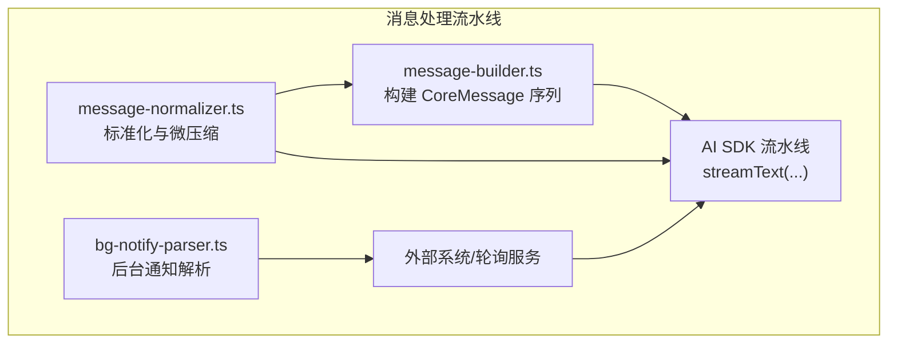
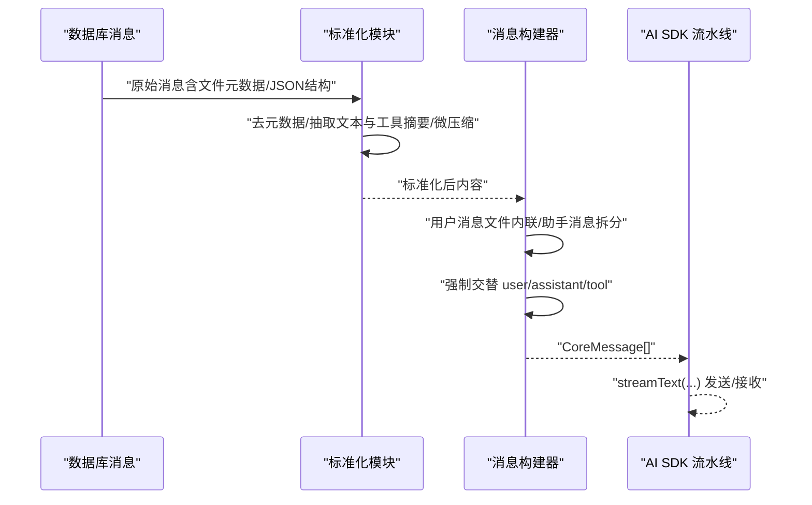
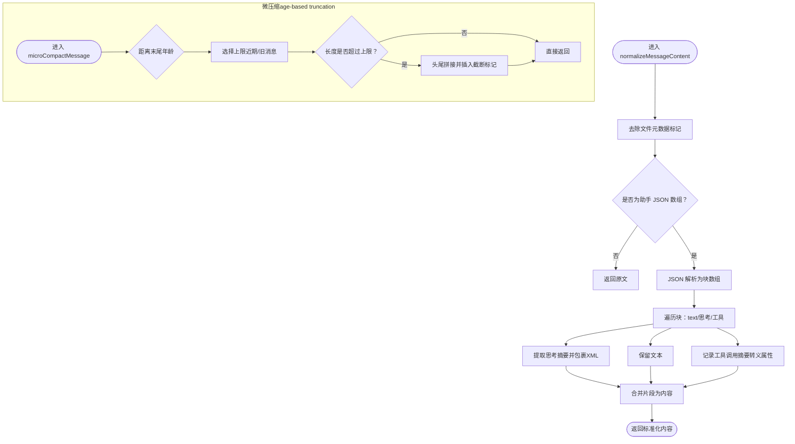
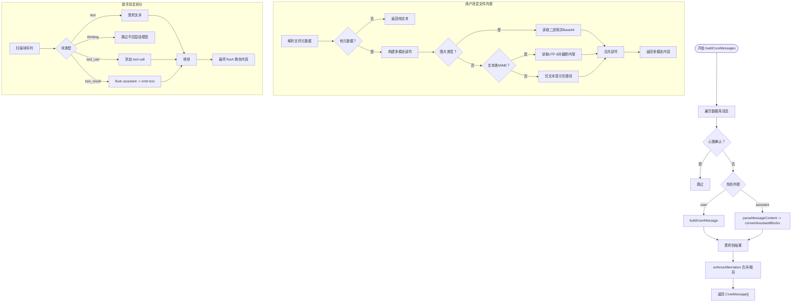
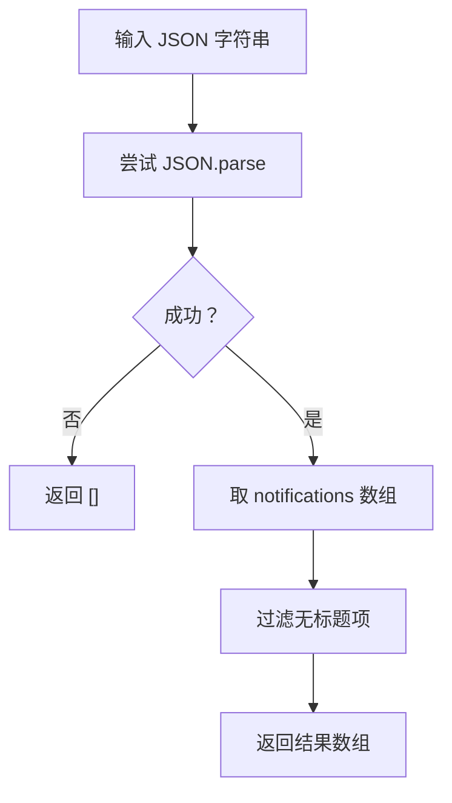
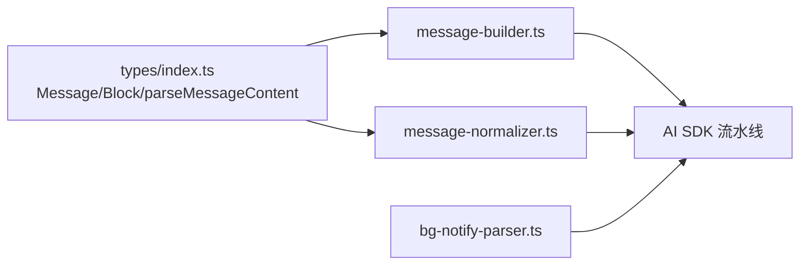

# 消息处理流水线

<cite>
**本文引用的文件**
- [message-normalizer.ts](file://src/lib/message-normalizer.ts)
- [message-builder.ts](file://src/lib/message-builder.ts)
- [bg-notify-parser.ts](file://src/lib/bg-notify-parser.ts)
- [message-normalizer.test.ts](file://src/__tests__/unit/message-normalizer.test.ts)
- [bg-notify-poll.test.ts](file://src/__tests__/unit/bg-notify-poll.test.ts)
- [index.ts](file://src/types/index.ts)
</cite>

## 目录
1. [引言](#引言)
2. [项目结构](#项目结构)
3. [核心组件](#核心组件)
4. [架构总览](#架构总览)
5. [详细组件分析](#详细组件分析)
6. [依赖关系分析](#依赖关系分析)
7. [性能考量](#性能考量)
8. [故障排查指南](#故障排查指南)
9. [结论](#结论)
10. [附录](#附录)

## 引言
本文件聚焦 Bridge 子系统的消息处理流水线，系统性梳理以下三类关键模块：
- 消息标准化（message-normalizer.ts）：负责格式统一、编码与内容清理，以及基于年龄的微压缩截断，用于回退上下文与对话压缩。
- 消息构建器（message-builder.ts）：负责将数据库消息转换为 Vercel AI SDK 所需的多轮消息序列，支持用户消息中的文件附件内联、文本块拆分与工具调用/结果的严格交替。
- 后台通知解析器（bg-notify-parser.ts）：纯函数式解析后台轮询返回的通知，过滤无效项并保留优先级字段。

文档将从架构、数据流、处理逻辑、错误处理与性能优化等维度进行深入说明，并提供可视化图示与调试建议。

## 项目结构
围绕消息处理流水线的关键文件组织如下：
- 标准化与压缩：src/lib/message-normalizer.ts
- 消息构建：src/lib/message-builder.ts
- 通知解析：src/lib/bg-notify-parser.ts
- 类型定义：src/types/index.ts（Message、MessageContentBlock 等）
- 单元测试：src/__tests__/unit/message-normalizer.test.ts、src/__tests__/unit/bg-notify-poll.test.ts

图表来源
- [message-normalizer.ts:1-107](file://src/lib/message-normalizer.ts#L1-L107)
- [message-builder.ts:1-328](file://src/lib/message-builder.ts#L1-L328)
- [bg-notify-parser.ts:1-16](file://src/lib/bg-notify-parser.ts#L1-L16)

章节来源
- [message-normalizer.ts:1-107](file://src/lib/message-normalizer.ts#L1-L107)
- [message-builder.ts:1-328](file://src/lib/message-builder.ts#L1-L328)
- [bg-notify-parser.ts:1-16](file://src/lib/bg-notify-parser.ts#L1-L16)
- [index.ts:140-186](file://src/types/index.ts#L140-L186)

## 核心组件
- 消息标准化（normalizeMessageContent、microCompactMessage）
  - 去除内部文件元数据标记
  - 解析助手 JSON 结构，抽取文本与工具摘要，避免模型复刻伪工具调用
  - 基于消息年龄进行字符级截断，保留两端上下文
- 消息构建器（buildCoreMessages、convertAssistantBlocks）
  - 将数据库消息转为 AI SDK 的多轮结构，强制交替 user/assistant/tool
  - 用户消息中文件附件按类型安全内联：图片二进制、文本类内联、二进制文件仅提示路径
  - 助手消息拆分为 text + tool-call，遇到 tool_result 则插入 tool 消息
- 后台通知解析器（parseBgNotifications）
  - 解析 JSON，过滤无标题通知，保留优先级字段

章节来源
- [message-normalizer.ts:25-65](file://src/lib/message-normalizer.ts#L25-L65)
- [message-normalizer.ts:99-106](file://src/lib/message-normalizer.ts#L99-L106)
- [message-builder.ts:74-94](file://src/lib/message-builder.ts#L74-L94)
- [message-builder.ts:231-327](file://src/lib/message-builder.ts#L231-L327)
- [bg-notify-parser.ts:6-15](file://src/lib/bg-notify-parser.ts#L6-L15)

## 架构总览
消息处理流水线在 Bridge 中承担“输入清洗—结构转换—输出适配”的职责，贯穿历史消息压缩、实时对话构建与后台通知展示三大场景。

图表来源
- [message-normalizer.ts:25-65](file://src/lib/message-normalizer.ts#L25-L65)
- [message-normalizer.ts:99-106](file://src/lib/message-normalizer.ts#L99-L106)
- [message-builder.ts:74-94](file://src/lib/message-builder.ts#L74-L94)
- [message-builder.ts:231-327](file://src/lib/message-builder.ts#L231-L327)

## 详细组件分析

### 组件一：消息标准化（message-normalizer.ts）
- 设计目标
  - 统一消息内容，便于上下文注入与压缩
  - 避免模型复刻伪工具调用，采用结构化 XML 标记
  - 对旧消息进行更激进的截断，减少无关信息占用
- 关键流程
  - 去除文件元数据标记
  - 解析助手 JSON，抽取 text/thinking/tool_use，忽略 tool_result
  - thinking 提取粗略摘要（优先加粗、标题，否则截断），以 XML 标签形式保留
  - 工具调用抽取名称与输入前缀，限制长度并转义属性
  - 微压缩：根据消息距末尾年龄选择不同上限，采用头尾拼接策略保留两端
- 复杂度与性能
  - 标准化单条消息近似 O(n) 字符扫描；JSON 解析为 O(n)，整体线性
  - 截断采用双端拼接，时间复杂度 O(n)，空间开销与截断长度相关
- 错误处理
  - 非 JSON 内容直接透传
  - 截断失败时回退原内容
- 安全性
  - 工具输入属性值进行 XML 转义，防止标签破坏

图表来源
- [message-normalizer.ts:25-65](file://src/lib/message-normalizer.ts#L25-L65)
- [message-normalizer.ts:67-74](file://src/lib/message-normalizer.ts#L67-L74)
- [message-normalizer.ts:81-86](file://src/lib/message-normalizer.ts#L81-L86)
- [message-normalizer.ts:99-106](file://src/lib/message-normalizer.ts#L99-L106)

章节来源
- [message-normalizer.ts:25-65](file://src/lib/message-normalizer.ts#L25-L65)
- [message-normalizer.ts:67-74](file://src/lib/message-normalizer.ts#L67-L74)
- [message-normalizer.ts:81-86](file://src/lib/message-normalizer.ts#L81-L86)
- [message-normalizer.ts:99-106](file://src/lib/message-normalizer.ts#L99-L106)
- [message-normalizer.test.ts:1-121](file://src/__tests__/unit/message-normalizer.test.ts#L1-L121)

### 组件二：消息构建器（message-builder.ts）
- 设计目标
  - 将数据库消息转换为 AI SDK 的严格多轮结构
  - 正确处理用户消息中的文件附件（图片二进制、文本内联、二进制提示）
  - 将助手消息中的 text + tool_use + tool_result 拆分为 assistant → tool → assistant 的交替序列
- 关键流程
  - buildCoreMessages：遍历消息，跳过心跳确认；用户消息走 buildUserMessage；助手消息走 convertAssistantBlocks
  - enforceAlternation：强制交替，合并连续用户消息，保留最近助手消息
  - buildUserMessage：解析文件元数据，按 MIME 类型决定内联策略；图片读取二进制，文本类读取 UTF-8，其他仅提示路径
  - convertAssistantBlocks：扫描块序列，累积 assistant 内容；遇到 tool_result 则先 flush assistant，再 emit tool 消息
- 数据模型
  - MessageContentBlock 支持 text、thinking、tool_use、tool_result、code 等类型
  - parseMessageContent 将字符串或 JSON 数组解析为块列表
- 复杂度与性能
  - 主要瓶颈在文件读取与大文本内联，建议对超长文本进行截断与缓存
  - 块扫描线性，交替合并近似 O(n)
- 错误处理
  - 文件不存在时以文本提示替代
  - 非法 JSON 作为纯文本处理
- 安全性
  - 仅对图片进行二进制内联，避免将二进制内容以 UTF-8 注入提示

图表来源
- [message-builder.ts:74-94](file://src/lib/message-builder.ts#L74-L94)
- [message-builder.ts:100-121](file://src/lib/message-builder.ts#L100-L121)
- [message-builder.ts:149-211](file://src/lib/message-builder.ts#L149-L211)
- [message-builder.ts:231-327](file://src/lib/message-builder.ts#L231-L327)
- [index.ts:169-186](file://src/types/index.ts#L169-L186)

章节来源
- [message-builder.ts:74-94](file://src/lib/message-builder.ts#L74-L94)
- [message-builder.ts:100-121](file://src/lib/message-builder.ts#L100-L121)
- [message-builder.ts:149-211](file://src/lib/message-builder.ts#L149-L211)
- [message-builder.ts:231-327](file://src/lib/message-builder.ts#L231-L327)
- [index.ts:143-186](file://src/types/index.ts#L143-L186)

### 组件三：后台通知解析器（bg-notify-parser.ts）
- 设计目标
  - 纯函数解析后台轮询返回的通知，过滤无效项，保留优先级
- 关键流程
  - JSON 解析，取 notifications 数组
  - 过滤无标题通知
  - 返回包含 title、body、priority 的对象数组
- 错误处理
  - 非法 JSON 或缺失字段时返回空数组

图表来源
- [bg-notify-parser.ts:6-15](file://src/lib/bg-notify-parser.ts#L6-L15)

章节来源
- [bg-notify-parser.ts:6-15](file://src/lib/bg-notify-parser.ts#L6-L15)
- [bg-notify-poll.test.ts:19-93](file://src/__tests__/unit/bg-notify-poll.test.ts#L19-L93)

## 依赖关系分析
- 类型依赖
  - Message、MessageContentBlock、parseMessageContent 来自 src/types/index.ts
- 模块耦合
  - message-builder.ts 依赖 parseMessageContent 与 AI SDK 类型
  - message-normalizer.ts 与 message-builder.ts 在“助手 JSON 抽取”上存在语义一致性（均抽取 text 与工具摘要）
- 外部依赖
  - 文件系统读取（用户消息内联文本/图片）
  - JSON 解析与字符串处理

图表来源
- [index.ts:143-186](file://src/types/index.ts#L143-L186)
- [message-builder.ts:21-30](file://src/lib/message-builder.ts#L21-L30)
- [message-normalizer.ts:1-9](file://src/lib/message-normalizer.ts#L1-L9)
- [bg-notify-parser.ts:1-5](file://src/lib/bg-notify-parser.ts#L1-L5)

章节来源
- [index.ts:143-186](file://src/types/index.ts#L143-L186)
- [message-builder.ts:21-30](file://src/lib/message-builder.ts#L21-L30)
- [message-normalizer.ts:1-9](file://src/lib/message-normalizer.ts#L1-L9)

## 性能考量
- 标准化与压缩
  - 使用常量上限与头尾截断策略，避免深度字符串处理
  - XML 属性转义成本低，可接受
- 消息构建
  - 文件读取为 I/O 密集，建议：
    - 对已读取文件建立缓存，避免重复读取
    - 对超长文本类文件进行截断（如 50KB），并在提示中标注
    - 图片二进制内联前评估尺寸，必要时降采样
  - 合并用户消息时保持多模态部件，避免重复拼接
- 通知解析
  - JSON 解析与数组过滤为 O(n)，可接受；建议在上游控制通知数量与大小

[本节为通用性能建议，无需特定文件引用]

## 故障排查指南
- 标准化问题
  - 症状：助手消息出现伪工具调用或摘要异常
  - 排查：确认输入为 JSON 数组且包含 text/thinking/tool_use；检查 XML 转义是否生效
  - 参考测试：message-normalizer.test.ts 中关于 XML 标记与转义的断言
- 构建问题
  - 症状：多轮消息顺序错乱或缺少 tool 消息
  - 排查：检查 convertAssistantBlocks 是否正确 flush assistant 与 tool；确认 enforceAlternation 是否合并/裁剪正确
  - 参考测试：message-builder 的块类型处理与交替合并逻辑
- 文件内联问题
  - 症状：图片未显示、文本未内联、二进制被错误注入
  - 排查：确认 MIME 类型与扩展名映射；检查文件是否存在与可读；验证 isTextLikeMime 判定
- 通知解析问题
  - 症状：通知为空或缺失优先级
  - 排查：确认 JSON 结构与 notifications 字段；检查 title 是否为空
  - 参考测试：bg-notify-poll.test.ts 中的解析与过滤断言

章节来源
- [message-normalizer.test.ts:1-121](file://src/__tests__/unit/message-normalizer.test.ts#L1-L121)
- [bg-notify-poll.test.ts:19-93](file://src/__tests__/unit/bg-notify-poll.test.ts#L19-L93)

## 结论
消息处理流水线通过“标准化—构建—解析”的分层设计，确保了历史压缩、实时对话与后台通知在 Bridge 子系统中的稳定运行。标准化模块保障内容质量与安全性，构建器保证结构正确与性能可控，通知解析器提供可靠的纯函数接口。配合完善的单元测试与调试建议，可在复杂场景下维持高可靠性与可维护性。

[本节为总结性内容，无需特定文件引用]

## 附录
- 相关类型定义
  - Message：包含会话标识、角色、内容（JSON 字符串）、心跳确认标志等
  - MessageContentBlock：text、thinking、tool_use、tool_result、code 等类型
  - parseMessageContent：将字符串或 JSON 数组解析为块列表

章节来源
- [index.ts:143-158](file://src/types/index.ts#L143-L158)
- [index.ts:169-175](file://src/types/index.ts#L169-L175)
- [index.ts:177-186](file://src/types/index.ts#L177-L186)