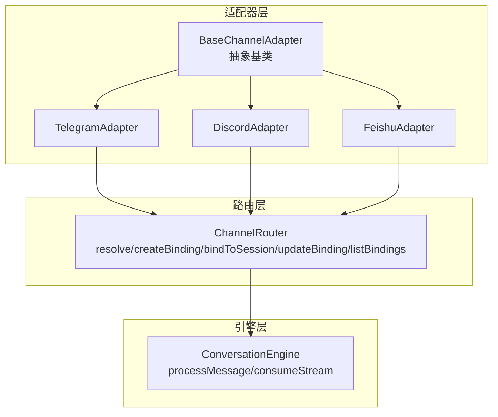
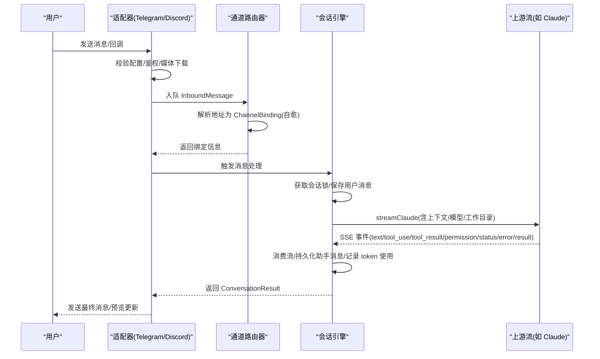
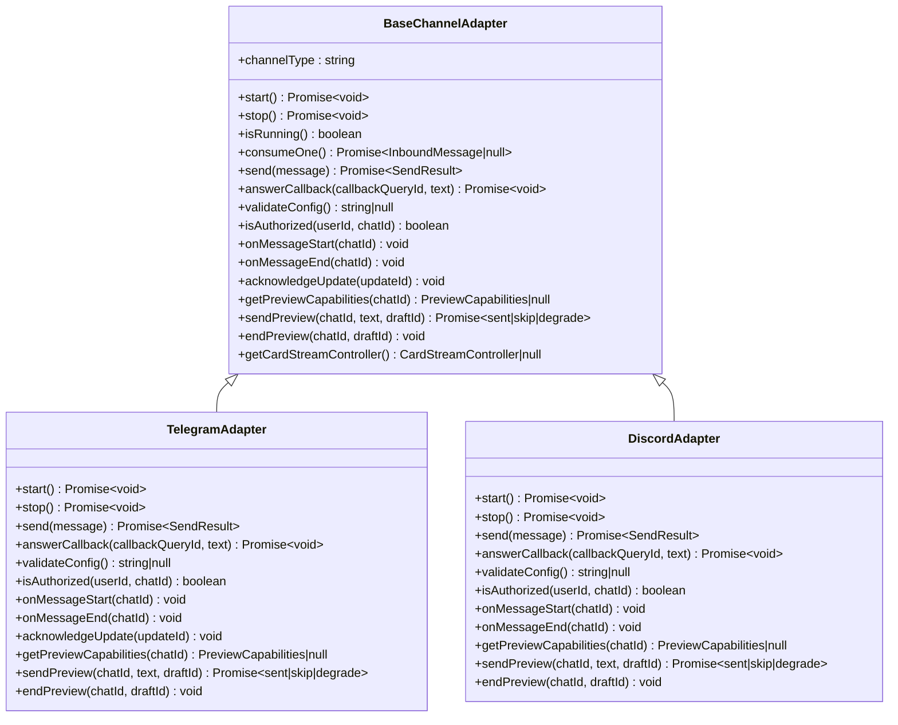
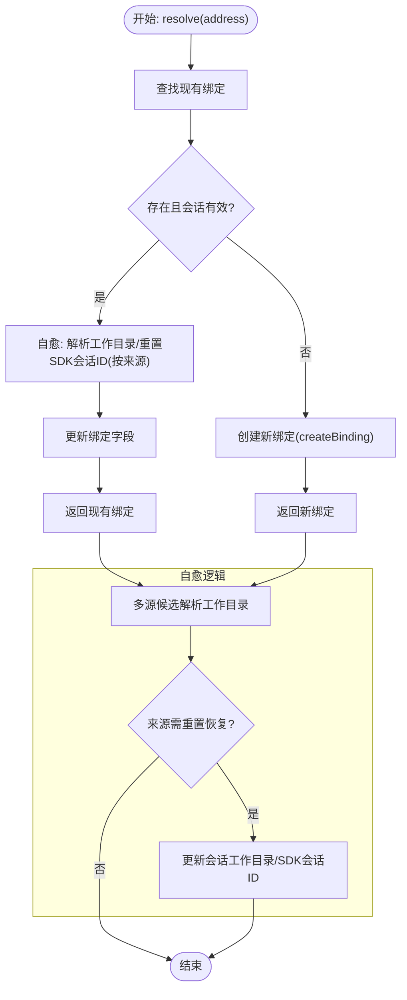
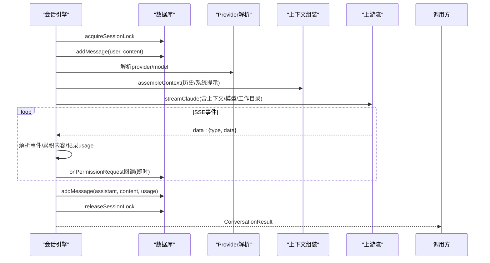
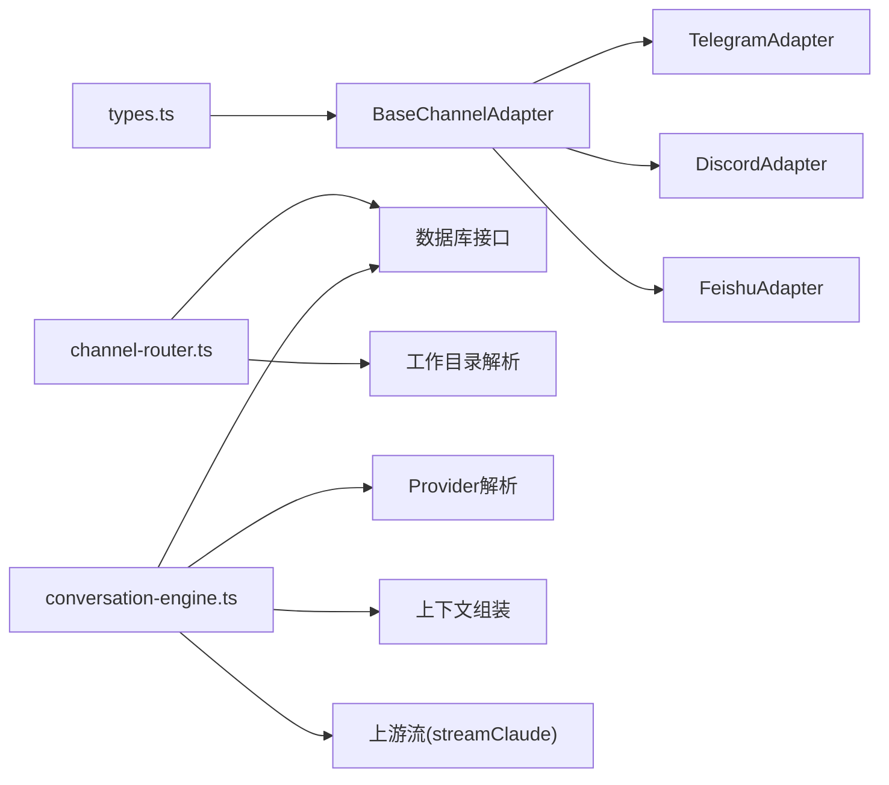

# 适配器模式实现

<cite>
**本文档引用的文件**
- [channel-adapter.ts](file://src/lib/bridge/channel-adapter.ts)
- [channel-router.ts](file://src/lib/bridge/channel-router.ts)
- [conversation-engine.ts](file://src/lib/bridge/conversation-engine.ts)
- [types.ts](file://src/lib/bridge/types.ts)
- [telegram-adapter.ts](file://src/lib/bridge/adapters/telegram-adapter.ts)
- [discord-adapter.ts](file://src/lib/bridge/adapters/discord-adapter.ts)
- [feishu-adapter.ts](file://src/lib/bridge/adapters/feishu-adapter.ts)
</cite>

## 目录
1. [引言](#引言)
2. [项目结构](#项目结构)
3. [核心组件](#核心组件)
4. [架构总览](#架构总览)
5. [详细组件分析](#详细组件分析)
6. [依赖关系分析](#依赖关系分析)
7. [性能考虑](#性能考虑)
8. [故障排查指南](#故障排查指南)
9. [结论](#结论)

## 引言
本文件系统性阐述 Bridge 子系统的适配器模式实现，聚焦以下目标：
- 解释 channel-adapter.ts 中适配器抽象基类的设计原则：统一接口、消息转换、错误处理与生命周期管理
- 说明 channel-router.ts 的消息路由机制：地址解析、会话绑定、工作目录与 SDK 会话恢复的自愈逻辑
- 阐述 conversation-engine.ts 的会话引擎：会话锁、上下文组装、流式消费、权限请求转发与错误降级
- 提供适配器注册流程、生命周期管理与性能优化建议

## 项目结构
Bridge 子系统围绕“适配器 + 路由 + 引擎”的三层架构组织：
- 抽象层（适配器）：统一通道接入接口，屏蔽平台差异
- 路由层（路由器）：将外部地址映射到内部会话，负责绑定与自愈
- 引擎层（会话引擎）：消费上游流、持久化消息、处理权限与工具调用事件

图表来源
- [channel-adapter.ts:16-105](file://src/lib/bridge/channel-adapter.ts#L16-L105)
- [telegram-adapter.ts:74-122](file://src/lib/bridge/adapters/telegram-adapter.ts#L74-L122)
- [discord-adapter.ts:55-132](file://src/lib/bridge/adapters/discord-adapter.ts#L55-L132)
- [feishu-adapter.ts:9-16](file://src/lib/bridge/adapters/feishu-adapter.ts#L9-L16)
- [channel-router.ts:32-173](file://src/lib/bridge/channel-router.ts#L32-L173)
- [conversation-engine.ts:88-284](file://src/lib/bridge/conversation-engine.ts#L88-L284)

章节来源
- [channel-adapter.ts:16-123](file://src/lib/bridge/channel-adapter.ts#L16-L123)
- [channel-router.ts:32-173](file://src/lib/bridge/channel-router.ts#L32-L173)
- [conversation-engine.ts:88-284](file://src/lib/bridge/conversation-engine.ts#L88-L284)

## 核心组件
- 适配器抽象基类 BaseChannelAdapter：定义通道生命周期、消息收发、回调查询、预览能力与可选钩子
- 通道路由器 ChannelRouter：将 ChannelAddress 解析为 ChannelBinding，并在缺失时自动创建会话与绑定；对过期或不一致的绑定进行自愈
- 会话引擎 ConversationEngine：负责获取会话锁、保存用户消息、组装上下文、调用上游流、消费 SSE、持久化助手回复、处理权限请求与工具事件

章节来源
- [channel-adapter.ts:16-105](file://src/lib/bridge/channel-adapter.ts#L16-L105)
- [channel-router.ts:32-173](file://src/lib/bridge/channel-router.ts#L32-L173)
- [conversation-engine.ts:88-284](file://src/lib/bridge/conversation-engine.ts#L88-L284)

## 架构总览
下图展示从外部消息到内部会话的完整链路：适配器消费消息并入队，路由器解析地址到绑定，引擎处理消息并通过上游流返回结果。

图表来源
- [telegram-adapter.ts:459-619](file://src/lib/bridge/adapters/telegram-adapter.ts#L459-L619)
- [discord-adapter.ts:103-114](file://src/lib/bridge/adapters/discord-adapter.ts#L103-L114)
- [channel-router.ts:32-85](file://src/lib/bridge/channel-router.ts#L32-L85)
- [conversation-engine.ts:88-284](file://src/lib/bridge/conversation-engine.ts#L88-L284)

## 详细组件分析

### 适配器抽象基类 BaseChannelAdapter 设计
- 统一接口
  - 生命周期：start()/stop()/isRunning()
  - 消息处理：consumeOne()（阻塞等待）、send()（发送出站消息）
  - 可选扩展：answerCallback()、validateConfig()、isAuthorized()、onMessageStart/onMessageEnd、acknowledgeUpdate()、预览能力与发送接口
- 消息转换机制
  - 入站消息 InboundMessage：包含 messageId、address、text、timestamp、callbackData、raw、updateId、attachments 等
  - 出站消息 OutboundMessage：包含 address、text、parseMode、inlineButtons、replyToMessageId
  - 平台特定转换：如 Telegram 的 parse_mode、Discord 的 Markdown/HTML 转换
- 错误处理策略
  - 配置校验失败直接返回，避免启动后异常
  - 授权失败丢弃消息并记录审计日志
  - 流式预览失败按状态分类：永久降级（degrade）或临时跳过（skip）
  - 停止时清理资源（定时器、队列、偏移持久化）
- 适配器注册与工厂
  - 通过 registerAdapterFactory 注册工厂函数
  - 通过 createAdapter 按 channelType 创建实例
  - getRegisteredTypes 列举已注册类型

图表来源
- [channel-adapter.ts:16-105](file://src/lib/bridge/channel-adapter.ts#L16-L105)
- [telegram-adapter.ts:74-122](file://src/lib/bridge/adapters/telegram-adapter.ts#L74-L122)
- [discord-adapter.ts:55-132](file://src/lib/bridge/adapters/discord-adapter.ts#L55-L132)

章节来源
- [channel-adapter.ts:16-123](file://src/lib/bridge/channel-adapter.ts#L16-L123)
- [types.ts:34-82](file://src/lib/bridge/types.ts#L34-L82)

### 通道路由器 ChannelRouter 实现逻辑
- 地址解析与自愈
  - resolve(address)：根据 channelType+chatId 查找现有绑定；若会话不存在则重建绑定
  - 自愈工作目录与 SDK 会话 ID：当来源变更（如设置、主目录、进程）时重置 SDK 会话 ID，确保后续可正确恢复
- 绑定管理
  - createBinding(address, workingDirectory?)：创建新会话并建立绑定，应用默认模型/提供方
  - bindToSession(address, codepilotSessionId)：将 IM 聊天绑定到已有会话
  - updateBinding(id, updates)：更新绑定属性（sdkSessionId、工作目录、模型、模式、提供方、激活态）
  - listBindings(channelType?)：列出所有绑定
- 工作目录与 SDK 会话恢复
  - 多源候选解析：会话 SDK CWD、绑定 CWD、会话工作目录、全局默认工作目录
  - 当工作目录变化导致旧会话失效时清除 sdkSessionId，避免错误恢复

图表来源
- [channel-router.ts:32-85](file://src/lib/bridge/channel-router.ts#L32-L85)
- [channel-router.ts:90-125](file://src/lib/bridge/channel-router.ts#L90-L125)
- [channel-router.ts:130-156](file://src/lib/bridge/channel-router.ts#L130-L156)

章节来源
- [channel-router.ts:32-173](file://src/lib/bridge/channel-router.ts#L32-L173)

### 会话引擎 ConversationEngine 核心功能
- 会话状态管理
  - 会话锁：acquireSessionLock/renewSessionLock/releaseSessionLock，防止并发冲突
  - 运行状态：setSessionRuntimeStatus('running'/'idle')
- 消息历史与上下文
  - 保存用户消息：addMessage(role='user')
  - 加载最近消息：getMessages(limit=50, excludeHeartbeatAck=true)
  - 上下文组装：assembleContext(systemPrompt, conversationHistory, userPrompt)
- 上下文与模型解析
  - provider 解析优先级：绑定 providerId -> 会话 provider_id -> 全局默认 -> env
  - 模型选择：绑定/会话/全局默认，协议与模型一致性校验
- 流式消费与持久化
  - streamClaude 启动上游流，consumeStream 逐条解析 SSE 事件
  - 支持 text、tool_use、tool_result、thinking、status、task_update、error、result 等事件
  - 将最终文本块拼接为助手消息并持久化
- 权限请求与工具事件
  - permission_request 在流中即时转发，避免阻塞下游
  - onToolEvent 回调用于卡片流等场景
- 错误处理与降级
  - 流中断/取消：构建部分响应文本，返回用户可读错误信息
  - tokenUsage 与 sdkSessionId 捕获：status/result 事件中提取

图表来源
- [conversation-engine.ts:88-284](file://src/lib/bridge/conversation-engine.ts#L88-L284)
- [conversation-engine.ts:290-572](file://src/lib/bridge/conversation-engine.ts#L290-L572)

章节来源
- [conversation-engine.ts:88-284](file://src/lib/bridge/conversation-engine.ts#L88-L284)
- [conversation-engine.ts:290-572](file://src/lib/bridge/conversation-engine.ts#L290-L572)

### 适配器实现对比：Telegram 与 Discord
- TelegramAdapter
  - 长轮询拉取更新，基于 update_id 水位线去重与偏移持久化
  - 支持媒体组合并、图片下载、内联回调按钮、打字指示、流式预览草稿
  - 预览失败按 HTTP 状态区分降级或跳过
- DiscordAdapter
  - 使用 discord.js 客户端，实时事件驱动
  - 支持按钮交互延迟响应、消息去重、提及过滤、附件下载与大小限制
  - 预览通过编辑已有消息实现，失败时降级

章节来源
- [telegram-adapter.ts:74-122](file://src/lib/bridge/adapters/telegram-adapter.ts#L74-L122)
- [telegram-adapter.ts:459-619](file://src/lib/bridge/adapters/telegram-adapter.ts#L459-L619)
- [discord-adapter.ts:55-132](file://src/lib/bridge/adapters/discord-adapter.ts#L55-L132)
- [discord-adapter.ts:406-568](file://src/lib/bridge/adapters/discord-adapter.ts#L406-L568)

### 适配器注册流程与生命周期管理
- 注册流程
  - 各适配器在构造函数末尾或模块初始化处调用 registerAdapterFactory(channelType, factory)
  - bridge-manager 通过 createAdapter(channelType) 动态创建实例
- 生命周期管理
  - start()：校验配置、建立连接、启动后台任务（轮询/网关监听）、注册命令菜单（Telegram）
  - stop()：停止后台任务、清理定时器、持久化偏移、拒绝等待消费者
  - consumeOne()：阻塞式从内部队列取出消息，支持回调确认（acknowledgeUpdate）
  - 预览能力：getPreviewCapabilities/sendPreview/endPreview 支持流式草稿与最终替换

章节来源
- [channel-adapter.ts:109-123](file://src/lib/bridge/channel-adapter.ts#L109-L123)
- [telegram-adapter.ts:97-155](file://src/lib/bridge/adapters/telegram-adapter.ts#L97-L155)
- [discord-adapter.ts:76-167](file://src/lib/bridge/adapters/discord-adapter.ts#L76-L167)
- [feishu-adapter.ts:9-16](file://src/lib/bridge/adapters/feishu-adapter.ts#L9-L16)

## 依赖关系分析
- 适配器依赖
  - BaseChannelAdapter 依赖桥接类型定义（types.ts）
  - TelegramAdapter/DiscordAdapter 依赖各自平台 API 工具与媒体处理
- 路由器依赖
  - 依赖数据库访问（getChannelBinding/upsertChannelBinding/updateChannelBinding/listChannelBindings/getSession/createSession 等）
  - 依赖工作目录解析与设置（resolveWorkingDirectory）
- 引擎依赖
  - 依赖 Claude 客户端（streamClaude）、数据库（消息与会话操作）、上下文组装（assembleContext）、运行时预测（predictNativeRuntime）

图表来源
- [types.ts:1-180](file://src/lib/bridge/types.ts#L1-L180)
- [channel-adapter.ts:8-14](file://src/lib/bridge/channel-adapter.ts#L8-L14)
- [telegram-adapter.ts:17-28](file://src/lib/bridge/adapters/telegram-adapter.ts#L17-L28)
- [discord-adapter.ts:23-24](file://src/lib/bridge/adapters/discord-adapter.ts#L23-L24)
- [channel-router.ts:8-21](file://src/lib/bridge/channel-router.ts#L8-L21)
- [conversation-engine.ts:13-33](file://src/lib/bridge/conversation-engine.ts#L13-L33)

章节来源
- [types.ts:1-180](file://src/lib/bridge/types.ts#L1-L180)
- [channel-router.ts:8-21](file://src/lib/bridge/channel-router.ts#L8-L21)
- [conversation-engine.ts:13-33](file://src/lib/bridge/conversation-engine.ts#L13-L33)

## 性能考虑
- 会话锁与续期
  - 使用随机锁 ID 与定期续期，避免长时间占用导致死锁
  - 异常安全：续期与释放使用 try/catch，保证资源回收
- 流式消费
  - SSE 事件按行解析，仅在必要时构建结构化内容块，减少内存压力
  - 对 tool_result 去重与覆盖，避免重复渲染
- 预览与节流
  - 预览草稿按聊天维度缓存消息 ID，编辑更新而非频繁发送
  - 对失败状态进行降级标记，避免无效重试
- 偏移与去重
  - Telegram 使用 update_id 水位线与近期集合，控制去重集合规模，避免内存膨胀
- 并发与背压
  - 适配器内部队列与等待者数组，配合 consumeOne 的阻塞语义，天然形成背压

章节来源
- [conversation-engine.ts:99-118](file://src/lib/bridge/conversation-engine.ts#L99-L118)
- [telegram-adapter.ts:428-447](file://src/lib/bridge/adapters/telegram-adapter.ts#L428-L447)
- [discord-adapter.ts:618-639](file://src/lib/bridge/adapters/discord-adapter.ts#L618-L639)

## 故障排查指南
- 适配器无法启动
  - 检查 validateConfig() 返回值，确认令牌与开关配置
  - 查看启动日志与错误输出，定位网络或权限问题
- 消息未送达或重复
  - Telegram：检查偏移键（token 哈希或 botUserId）迁移是否成功，确认 committedOffset 是否持久化
  - Discord：检查消息 ID 去重集合是否溢出，清理过期交互
- 预览失败
  - Telegram：HTTP 400/404 永久降级，其他情况跳过；检查私聊/群聊权限
  - Discord：403/404 永久降级，编辑失败时删除预览消息
- 会话冲突或卡住
  - 检查会话锁是否被续期，确认 releaseSessionLock 是否执行
  - 若出现“会话忙”错误，等待锁释放或重启适配器
- 权限请求未响应
  - 确认 onPermissionRequest 回调是否正确转发，避免阻塞上游流
- 工作目录或 SDK 会话恢复异常
  - 检查路由自愈逻辑：当工作目录来源变更时会清空 sdkSessionId，避免错误恢复

章节来源
- [telegram-adapter.ts:100-104](file://src/lib/bridge/adapters/telegram-adapter.ts#L100-L104)
- [discord-adapter.ts:371-379](file://src/lib/bridge/adapters/discord-adapter.ts#L371-L379)
- [conversation-engine.ts:102-111](file://src/lib/bridge/conversation-engine.ts#L102-L111)
- [channel-router.ts:23-25](file://src/lib/bridge/channel-router.ts#L23-L25)
- [channel-router.ts:62-65](file://src/lib/bridge/channel-router.ts#L62-L65)

## 结论
Bridge 子系统通过适配器模式实现了对多平台 IM 的统一接入，结合路由器的地址解析与自愈能力，以及会话引擎的流式处理与上下文管理，形成了高可用、可扩展的消息桥接方案。遵循本文档的注册流程、生命周期管理与性能优化建议，可在保证稳定性的同时提升用户体验与系统吞吐。