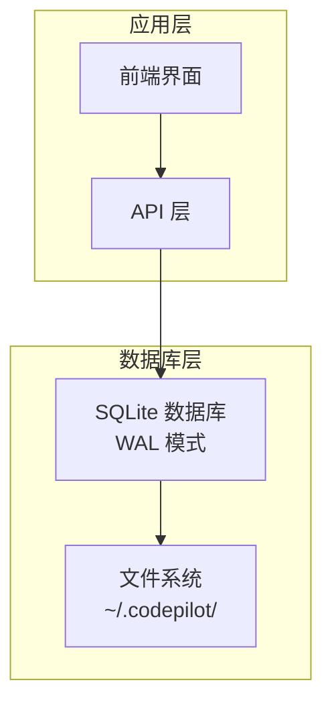
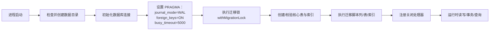
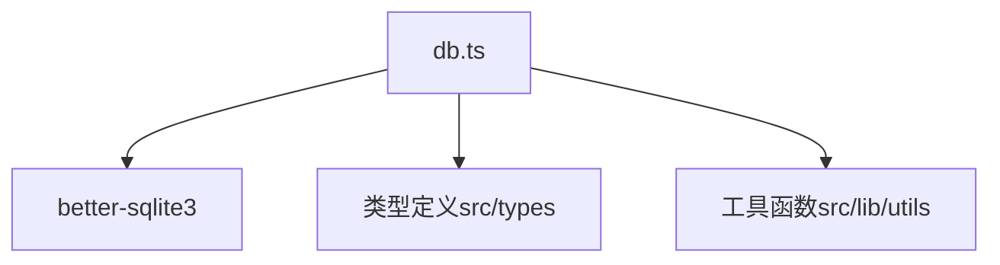
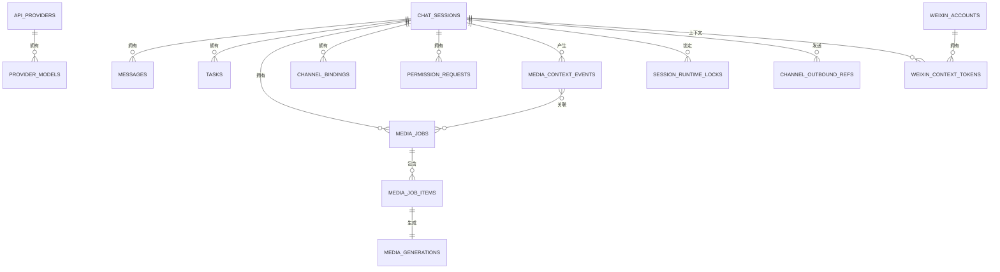

# 数据库架构

<cite>
**本文引用的文件**
- [db.ts](file://src/lib/db.ts)
</cite>

## 目录
1. [简介](#简介)
2. [项目结构](#项目结构)
3. [核心组件](#核心组件)
4. [架构总览](#架构总览)
5. [详细组件分析](#详细组件分析)
6. [依赖分析](#依赖分析)
7. [性能考量](#性能考量)
8. [故障排查指南](#故障排查指南)
9. [结论](#结论)
10. [附录](#附录)

## 简介
本文件面向 CodePilot 的数据库架构，基于内置 SQLite 数据库实现，采用 better-sqlite3 驱动，提供聊天会话、消息、媒体生成、任务调度、桥接通道等核心能力。重点覆盖：
- 12 张核心表的 Schema 定义与关系设计
- WAL 模式的性能优势与一致性保障
- 外键约束与数据完整性
- 数据目录 (~/.codepilot/) 组织结构
- 数据访问模式、缓存策略与性能优化
- 数据迁移机制、版本管理与向后兼容策略
- 查询优化建议与最佳实践

## 项目结构
数据库位于应用层，通过统一的数据库模块对外暴露 CRUD 与查询接口，支持多表关联、事务、索引与迁移。核心文件为数据库初始化与迁移逻辑所在模块。

图表来源
- [db.ts:11-96](file://src/lib/db.ts#L11-L96)

章节来源
- [db.ts:11-96](file://src/lib/db.ts#L11-L96)

## 核心组件
- 数据库实例与连接管理：延迟初始化、自动创建目录、WAL/外键/超时设置、迁移锁
- 表定义与迁移：按需创建表、列迁移、索引维护、跨版本兼容
- 业务操作封装：会话、消息、任务、API 提供商、媒体作业、桥接通道、WeChat 账号、CLI 工具、计划任务等
- 关闭与清理：进程退出信号处理、WAL checkpoint 与文件清理

章节来源
- [db.ts:52-96](file://src/lib/db.ts#L52-L96)
- [db.ts:98-320](file://src/lib/db.ts#L98-L320)
- [db.ts:332-945](file://src/lib/db.ts#L332-L945)
- [db.ts:2858-2905](file://src/lib/db.ts#L2858-L2905)

## 架构总览
数据库采用 WAL（Write-Ahead Logging）模式，提升并发写入与读写并行度；启用外键约束保证引用完整性；通过索引与查询优化满足高频读写场景；迁移机制确保历史数据平滑升级。

图表来源
- [db.ts:52-96](file://src/lib/db.ts#L52-L96)
- [db.ts:98-320](file://src/lib/db.ts#L98-L320)
- [db.ts:332-945](file://src/lib/db.ts#L332-L945)
- [db.ts:2870-2905](file://src/lib/db.ts#L2870-L2905)

## 详细组件分析

### 数据目录与文件组织
- 默认路径：用户主目录下的隐藏目录 ~/.codepilot/
- 数据库文件：codepilot.db
- WAL/共享内存：codepilot.db-wal、codepilot.db-shm
- 迁移锁文件：codepilot.db.migration-lock（原子锁，避免多构建进程并发迁移）

章节来源
- [db.ts:11-12](file://src/lib/db.ts#L11-L12)
- [db.ts:18-50](file://src/lib/db.ts#L18-L50)
- [db.ts:59-87](file://src/lib/db.ts#L59-L87)

### WAL 模式与 PRAGMA 设置
- journal_mode=WAL：提升并发写入吞吐，读写可并行
- foreign_keys=ON：启用外键约束，保证引用完整性
- busy_timeout=5000：等待锁释放的时间上限，降低“数据库忙”错误概率
- 迁移锁：文件级原子锁，避免多进程并发迁移导致的竞态

章节来源
- [db.ts:90-93](file://src/lib/db.ts#L90-L93)
- [db.ts:18-50](file://src/lib/db.ts#L18-L50)

### 核心表与关系设计
以下为核心业务表及其关键字段与约束说明（仅列出关键字段与约束，不展示完整 DDL）：

- chat_sessions（会话）
  - 主键：id
  - 常用索引：updated_at
  - 新增列：model、system_prompt、sdk_session_id、project_name、status、mode、provider_name、provider_id、sdk_cwd、runtime_status、runtime_updated_at、runtime_error、permission_profile、context_summary、context_summary_updated_at、context_summary_boundary_rowid
  - 用途：存储聊天会话元信息、上下文摘要与边界行号

- messages（消息）
  - 主键：id
  - 外键：session_id -> chat_sessions(id) ON DELETE CASCADE
  - 常用索引：session_id、created_at
  - 新增列：token_usage、is_heartbeat_ack
  - 用途：存储对话消息，支持心跳 ACK 过滤

- settings（全局设置）
  - 主键：id，唯一键：key
  - 用途：持久化配置项

- tasks（任务）
  - 主键：id
  - 外键：session_id -> chat_sessions(id) ON DELETE CASCADE
  - 常用索引：session_id
  - 新增列：source（user/sdk）、sort_order
  - 用途：任务列表与同步

- api_providers（API 提供商）
  - 主键：id
  - 新增列：protocol、headers_json、env_overrides_json、role_models_json、options_json
  - 用途：模型提供商配置与默认提供者选择

- provider_models（提供商模型）
  - 主键：id
  - 外键：provider_id -> api_providers(id) ON DELETE CASCADE
  - 唯一索引：provider_id, model_id
  - 常用索引：provider_id
  - 用途：模型清单与能力配置

- media_generations（媒体生成）
  - 主键：id
  - 常用索引：created_at、session_id、status
  - 新增列：favorited
  - 用途：图像生成结果与状态

- media_jobs（媒体作业）
  - 主键：id
  - 外键：session_id -> chat_sessions(id) ON DELETE SET NULL
  - 常用索引：session_id、status
  - 用途：批量生成任务与进度统计

- media_job_items（媒体作业项）
  - 主键：id
  - 外键：job_id -> media_jobs(id) ON DELETE CASCADE
  - 外键：result_media_generation_id -> media_generations(id) ON DELETE SET NULL
  - 常用索引：job_id、status
  - 用途：作业内单项任务与重试控制

- media_context_events（媒体上下文事件）
  - 主键：id
  - 外键：session_id -> chat_sessions(id) ON DELETE CASCADE
  - 外键：job_id -> media_jobs(id) ON DELETE CASCADE
  - 常用索引：job_id
  - 用途：生成触发上下文与同步记录

- channel_bindings（桥接绑定）
  - 主键：id，唯一索引：channel_type, chat_id
  - 外键：codepilot_session_id -> chat_sessions(id) ON DELETE CASCADE
  - 常用索引：codepilot_session_id、channel_type, chat_id
  - 新增列：provider_id
  - 用途：IM 通道与会话映射

- channel_offsets（桥接偏移）
  - 主键：channel_type
  - 用途：轮询水位偏移

- channel_dedupe（桥接去重）
  - 主键：dedup_key
  - 常用索引：expires_at
  - 用途：幂等消息去重

- channel_outbound_refs（桥接出站引用）
  - 主键：id
  - 常用索引：codepilot_session_id
  - 用途：已发送消息平台 ID 映射

- channel_audit_logs（桥接审计日志）
  - 主键：id
  - 常用索引：channel_type, chat_id、created_at
  - 用途：通道消息审计

- channel_permission_links（桥接权限请求链接）
  - 主键：id
  - 常用索引：permission_request_id
  - 新增列：tool_name、suggestions、resolved
  - 用途：权限请求与消息关联

- session_runtime_locks（会话运行时锁）
  - 主键：session_id
  - 外键：session_id -> chat_sessions(id) ON DELETE CASCADE
  - 常用索引：expires_at
  - 用途：会话独占锁与 TTL

- permission_requests（权限请求）
  - 主键：id
  - 外键：session_id -> chat_sessions(id) ON DELETE CASCADE
  - 常用索引：session_id, status、expires_at
  - 用途：工具调用权限审批

- weixin_accounts（微信账号）
  - 主键：account_id
  - 用途：多账号支持与登录信息

- weixin_context_tokens（微信上下文令牌）
  - 主键：account_id, peer_user_id
  - 用途：会话上下文令牌持久化

- cli_tools_custom（自定义 CLI 工具）
  - 主键：id
  - 用途：用户安装的外部工具

- cli_tool_descriptions（CLI 工具描述）
  - 主键：tool_id
  - 用途：AI 生成的工具描述与结构化信息

- scheduled_tasks（计划任务）
  - 主键：id
  - 常用索引：status、next_run
  - 新增列：permanent
  - 用途：定时任务与运行日志

- task_run_logs（任务运行日志）
  - 主键：id
  - 外键：task_id -> scheduled_tasks(id) ON DELETE CASCADE
  - 常用索引：task_id
  - 用途：任务执行结果与耗时

章节来源
- [db.ts:99-316](file://src/lib/db.ts#L99-L316)
- [db.ts:332-945](file://src/lib/db.ts#L332-L945)

### 数据访问模式与缓存策略
- 访问模式
  - 单例数据库连接：延迟初始化，首次使用时创建目录、连接数据库、设置 PRAGMA、执行迁移
  - 事务封装：删除会话前先清理无外键级联的表，再删除会话，避免外键错误
  - 分页与游标：消息查询支持基于 rowid 的分页与“beforeRowId”游标
  - 全文检索：LIKE 匹配（大小写不敏感），支持心跳 ACK 过滤
  - JSON 字段：token_usage、batch_config、provider_models 等以 JSON 文本存储，查询时使用 JSON 函数提取
- 缓存策略
  - 内存缓存：未在数据库层实现，建议在应用层对热点查询结果进行缓存（LRU/最近使用）
  - 文件缓存：桥接去重表使用过期时间索引，定期清理过期条目
  - 配置缓存：应用层可对 provider 选项与模型列表做短期缓存，结合变更通知刷新

章节来源
- [db.ts:1044-1053](file://src/lib/db.ts#L1044-L1053)
- [db.ts:1136-1156](file://src/lib/db.ts#L1136-L1156)
- [db.ts:1269-1333](file://src/lib/db.ts#L1269-L1333)
- [db.ts:2371-2391](file://src/lib/db.ts#L2371-L2391)

### 数据迁移机制与版本管理
- 迁移锁：通过创建临时文件实现原子锁，避免多构建进程并发迁移
- 列迁移：按需添加新列，使用安全添加函数忽略重复列错误
- 表迁移：对旧版本缺失的表进行补建与索引创建
- 启动恢复：进程重启后重置会话运行状态、清理运行时锁、终止待处理权限请求
- 版本兼容：通过列存在性检测与条件迁移，保证向前兼容；对历史数据进行回填（如 project_name、sdk_cwd）

章节来源
- [db.ts:18-50](file://src/lib/db.ts#L18-L50)
- [db.ts:322-330](file://src/lib/db.ts#L322-L330)
- [db.ts:332-945](file://src/lib/db.ts#L332-L945)
- [db.ts:618-680](file://src/lib/db.ts#L618-L680)

### 查询优化与最佳实践
- 使用索引
  - 会话：按 updated_at 排序与筛选
  - 消息：按 session_id 与 created_at 查询
  - 媒体：按 status、session_id、created_at 查询
  - 权限与桥接：按状态、过期时间、会话 ID 查询
- 使用 rowid 进行分页与游标定位，避免基于时间戳的次级排序问题
- 对 JSON 字段使用 JSON 函数提取，避免全表扫描
- 事务批处理：批量插入或更新时使用事务，减少提交次数
- 控制 LIKE 查询的通配符转义，避免全表匹配
- 定期清理过期数据：去重表、权限请求、运行时锁

章节来源
- [db.ts:231-242](file://src/lib/db.ts#L231-L242)
- [db.ts:1136-1156](file://src/lib/db.ts#L1136-L1156)
- [db.ts:1728-1812](file://src/lib/db.ts#L1728-L1812)
- [db.ts:2371-2391](file://src/lib/db.ts#L2371-L2391)

## 依赖分析
- 外部依赖
  - better-sqlite3：SQLite 驱动，提供同步 API
  - better-sqlite3 的 PRAGMA 支持 WAL、外键与超时
- 内部依赖
  - 类型定义：ChatSession、Message、ApiProvider、MediaJob、MediaJobItem、MediaContextEvent、SettingsMap、TaskItem 等
  - 工具函数：日期转换、本地时间窗口计算等

图表来源
- [db.ts:1-10](file://src/lib/db.ts#L1-L10)

章节来源
- [db.ts:1-10](file://src/lib/db.ts#L1-L10)

## 性能考量
- WAL 模式显著提升并发写入与读写并行度，适合高并发写入场景
- 外键约束带来额外开销，但确保数据一致性；在高频写入场景下可权衡是否开启
- busy_timeout 降低锁竞争失败率，但会增加等待时间
- 合理使用索引与 JSON 函数，避免全表扫描
- 事务批处理与分页游标减少往返与锁持有时间
- 进程退出时主动关闭数据库，确保 WAL checkpoint 与文件清理

章节来源
- [db.ts:90-93](file://src/lib/db.ts#L90-L93)
- [db.ts:2858-2905](file://src/lib/db.ts#L2858-L2905)

## 故障排查指南
- 数据库忙（busy）：检查 busy_timeout 设置与锁竞争；确认无长时间事务未提交
- 外键冲突：检查删除顺序与 CASCADE 级联设置；必要时使用事务包裹清理
- 迁移失败：检查迁移锁文件是否存在；确认无其他进程占用数据库
- WAL 文件增长：确保进程正常退出，触发数据库关闭与 WAL checkpoint
- 权限请求未决：定期调用过期清理函数，避免悬挂请求

章节来源
- [db.ts:1044-1053](file://src/lib/db.ts#L1044-L1053)
- [db.ts:18-50](file://src/lib/db.ts#L18-L50)
- [db.ts:2858-2905](file://src/lib/db.ts#L2858-L2905)
- [db.ts:2182-2191](file://src/lib/db.ts#L2182-L2191)

## 结论
该数据库架构以 WAL 模式为基础，结合外键约束与完善的迁移机制，在保证数据一致性的同时兼顾性能与可维护性。通过合理的索引、事务与查询优化，能够支撑聊天、媒体、桥接、计划任务等多业务场景。建议在应用层补充缓存与监控，持续优化热点查询与批处理流程。

## 附录

### 表关系图（代码级）

图表来源
- [db.ts:99-316](file://src/lib/db.ts#L99-L316)
- [db.ts:332-945](file://src/lib/db.ts#L332-L945)