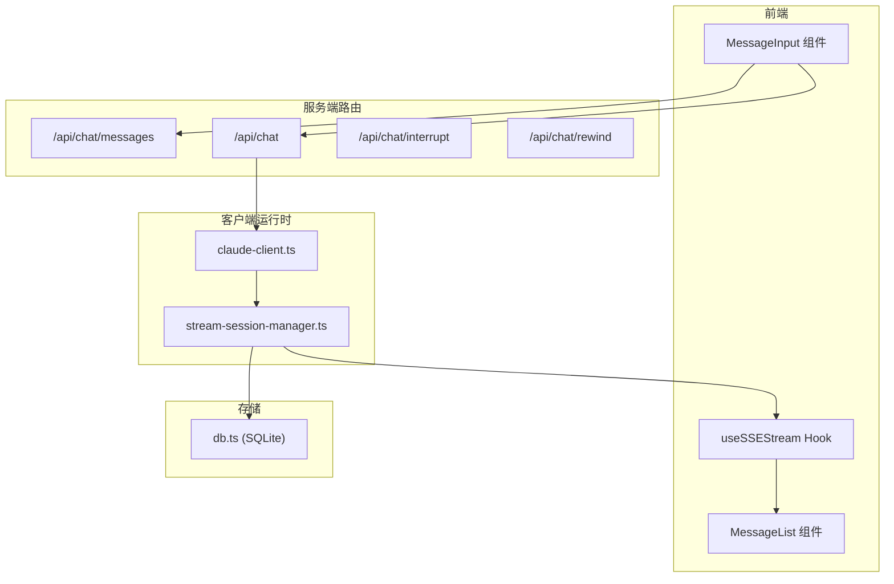
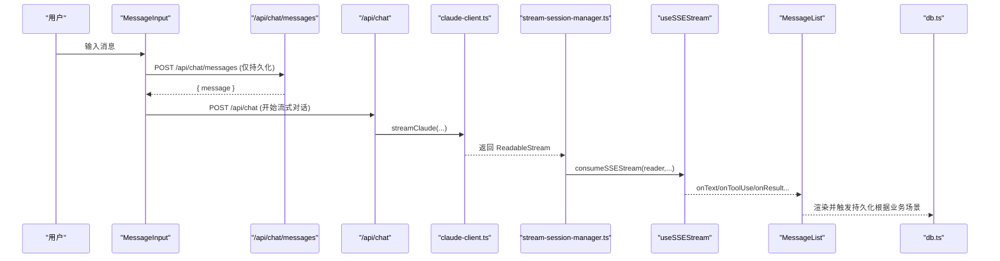
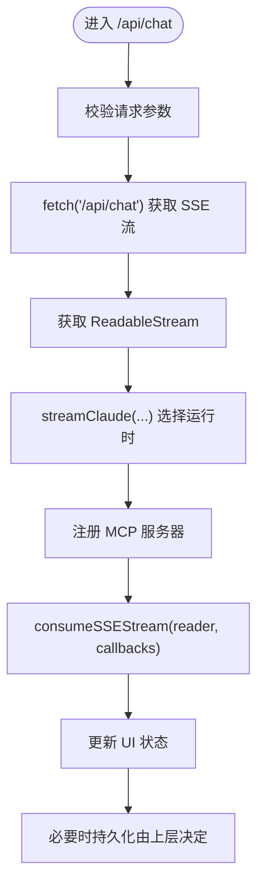
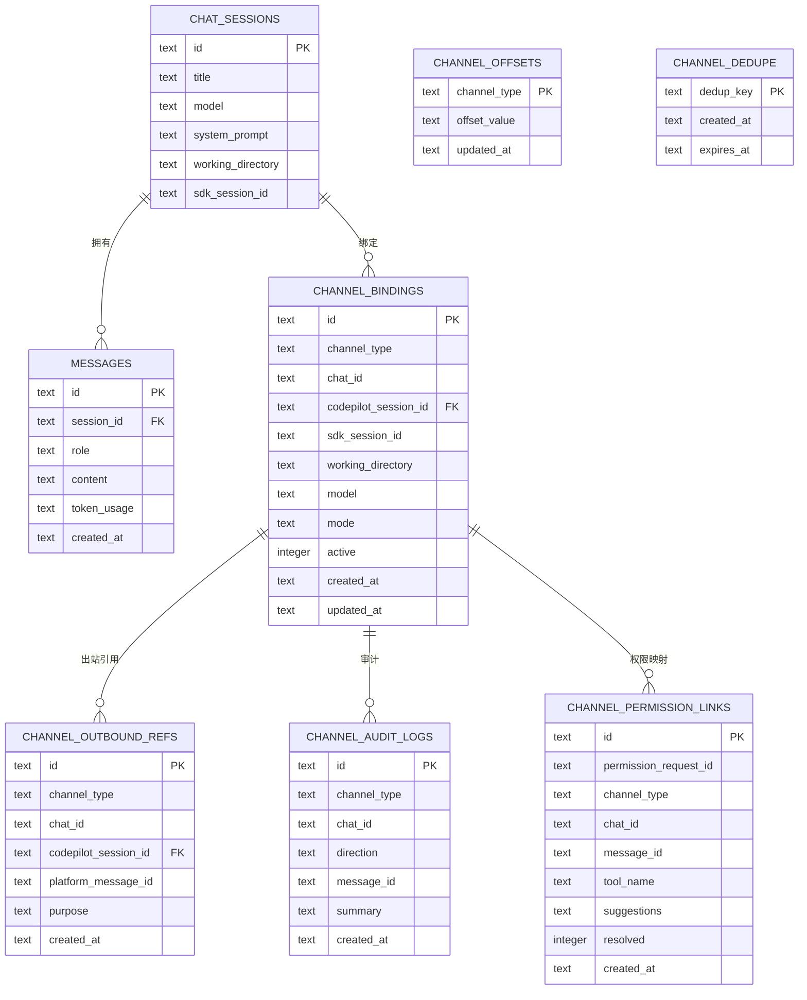
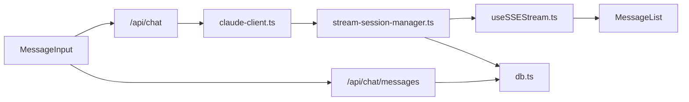

# 数据流架构

<cite>
**本文引用的文件**
- [src/app/api/chat/messages/route.ts](file://src/app/api/chat/messages/route.ts)
- [src/lib/claude-client.ts](file://src/lib/claude-client.ts)
- [src/lib/stream-session-manager.ts](file://src/lib/stream-session-manager.ts)
- [src/hooks/useSSEStream.ts](file://src/hooks/useSSEStream.ts)
- [src/components/chat/MessageList.tsx](file://src/components/chat/MessageList.tsx)
- [src/lib/db.ts](file://src/lib/db.ts)
- [src/app/api/chat/route.ts](file://src/app/api/chat/route.ts)
- [src/app/api/chat/interrupt/route.ts](file://src/app/api/chat/interrupt/route.ts)
- [src/app/api/chat/rewind/route.ts](file://src/app/api/chat/rewind/route.ts)
- [src/lib/bridge/types.ts](file://src/lib/bridge/types.ts)
- [src/lib/bridge/channel.ts](file://src/lib/bridge/channel.ts)
- [src/lib/bridge/runtime.ts](file://src/lib/bridge/runtime.ts)
- [src/lib/bridge/monitor.ts](file://src/lib/bridge/monitor.ts)
</cite>

## 目录
1. [简介](#简介)
2. [项目结构](#项目结构)
3. [核心组件](#核心组件)
4. [架构总览](#架构总览)
5. [详细组件分析](#详细组件分析)
6. [依赖关系分析](#依赖关系分析)
7. [性能考量](#性能考量)
8. [故障排查指南](#故障排查指南)
9. [结论](#结论)
10. [附录](#附录)

## 简介
本文件系统性梳理 CodePilot 的数据流架构，覆盖从用户输入到最终持久化的完整链路：MessageInput 组件 → POST /api/chat/messages → claude-client.ts 创建 SDK 会话 → Claude Agent SDK SSE 流 → stream-session-manager.ts 管理流 → useSSEStream hook 订阅 → MessageList 渲染 → db.ts 持久化到 SQLite。同时解释流式处理的优势、性能与可靠性保障，并补充 Bridge 子系统的远程 IM 数据流特殊处理。

## 项目结构
围绕聊天与消息的核心目录与文件如下：
- 前端组件层：MessageInput、MessageList、StreamingMessage 等
- 服务端路由层：/api/chat、/api/chat/messages、/api/chat/interrupt、/api/chat/rewind
- 客户端流管理：stream-session-manager.ts、useSSEStream.ts
- 代理与运行时：claude-client.ts（封装 Claude Agent SDK）
- 数据持久化：db.ts（SQLite）

**图表来源**
- [src/app/api/chat/messages/route.ts:11-39](file://src/app/api/chat/messages/route.ts#L11-L39)
- [src/app/api/chat/route.ts](file://src/app/api/chat/route.ts)
- [src/lib/claude-client.ts:433-505](file://src/lib/claude-client.ts#L433-L505)
- [src/lib/stream-session-manager.ts:292-311](file://src/lib/stream-session-manager.ts#L292-L311)
- [src/hooks/useSSEStream.ts:381-419](file://src/hooks/useSSEStream.ts#L381-L419)
- [src/components/chat/MessageList.tsx:182-333](file://src/components/chat/MessageList.tsx#L182-L333)
- [src/lib/db.ts:100-119](file://src/lib/db.ts#L100-L119)

**章节来源**
- [src/app/api/chat/messages/route.ts:11-39](file://src/app/api/chat/messages/route.ts#L11-L39)
- [src/lib/claude-client.ts:433-505](file://src/lib/claude-client.ts#L433-L505)
- [src/lib/stream-session-manager.ts:292-311](file://src/lib/stream-session-manager.ts#L292-L311)
- [src/hooks/useSSEStream.ts:381-419](file://src/hooks/useSSEStream.ts#L381-L419)
- [src/components/chat/MessageList.tsx:182-333](file://src/components/chat/MessageList.tsx#L182-L333)
- [src/lib/db.ts:100-119](file://src/lib/db.ts#L100-L119)

## 核心组件
- MessageInput：负责收集用户输入并触发消息提交或聊天流请求
- /api/chat/messages：用于直接持久化消息（如图像生成功能）
- /api/chat：主聊天入口，返回 SSE 流
- claude-client.ts：封装 Claude Agent SDK，创建并驱动会话
- stream-session-manager.ts：客户端单例流管理器，维持跨组件生命周期的流状态
- useSSEStream.ts：解析 SSE 事件，分发到回调
- MessageList：渲染历史消息与流式内容
- db.ts：SQLite 数据库初始化、迁移与消息/会话写入

**章节来源**
- [src/app/api/chat/messages/route.ts:11-39](file://src/app/api/chat/messages/route.ts#L11-L39)
- [src/app/api/chat/route.ts](file://src/app/api/chat/route.ts)
- [src/lib/claude-client.ts:433-505](file://src/lib/claude-client.ts#L433-L505)
- [src/lib/stream-session-manager.ts:187-241](file://src/lib/stream-session-manager.ts#L187-L241)
- [src/hooks/useSSEStream.ts:381-419](file://src/hooks/useSSEStream.ts#L381-L419)
- [src/components/chat/MessageList.tsx:182-333](file://src/components/chat/MessageList.tsx#L182-L333)
- [src/lib/db.ts:100-119](file://src/lib/db.ts#L100-L119)

## 架构总览
下图展示从用户交互到持久化的端到端数据流：

**图表来源**
- [src/app/api/chat/messages/route.ts:11-39](file://src/app/api/chat/messages/route.ts#L11-L39)
- [src/app/api/chat/route.ts](file://src/app/api/chat/route.ts)
- [src/lib/claude-client.ts:433-505](file://src/lib/claude-client.ts#L433-L505)
- [src/lib/stream-session-manager.ts:292-311](file://src/lib/stream-session-manager.ts#L292-L311)
- [src/hooks/useSSEStream.ts:381-419](file://src/hooks/useSSEStream.ts#L381-L419)
- [src/components/chat/MessageList.tsx:182-333](file://src/components/chat/MessageList.tsx#L182-L333)
- [src/lib/db.ts:100-119](file://src/lib/db.ts#L100-L119)

## 详细组件分析

### MessageInput → POST /api/chat/messages（仅持久化）
- 触发条件：图像生成功能需要先写入用户/助手消息，再替换为结果
- 参数校验：session_id、role、content 必填；可选 token_usage
- 会话存在性检查：通过 getSession(session_id) 判断
- 写入策略：addMessage(session_id, role, content, token_usage)

**章节来源**
- [src/app/api/chat/messages/route.ts:11-39](file://src/app/api/chat/messages/route.ts#L11-L39)
- [src/lib/db.ts:100-119](file://src/lib/db.ts#L100-L119)

### POST /api/chat → claude-client.ts 创建 SDK 会话
- 请求体字段：session_id、content、mode、model、provider_id、files、mentions、systemPromptAppend、autoTrigger、effort、thinking、context_1m、displayOverride
- 流创建：fetch('/api/chat') 获取 ReadableStream
- 运行时选择：根据 provider 与设置选择 native 或 claude-code-sdk 运行时
- MCP 注册：按需注册 memory、notify、widget、media、cli-tools、dashboard 等 MCP 服务器
- 环境隔离：prepareSdkSubprocessEnv 隔离 DB-provider 与环境变量

**图表来源**
- [src/lib/stream-session-manager.ts:292-311](file://src/lib/stream-session-manager.ts#L292-L311)
- [src/lib/claude-client.ts:433-505](file://src/lib/claude-client.ts#L433-L505)
- [src/hooks/useSSEStream.ts:381-419](file://src/hooks/useSSEStream.ts#L381-L419)

**章节来源**
- [src/lib/claude-client.ts:433-505](file://src/lib/claude-client.ts#L433-L505)
- [src/lib/stream-session-manager.ts:292-311](file://src/lib/stream-session-manager.ts#L292-L311)
- [src/hooks/useSSEStream.ts:381-419](file://src/hooks/useSSEStream.ts#L381-L419)

### stream-session-manager.ts：流管理与事件分发
- 单例管理：globalThis 模式维持跨组件生命周期的流状态
- 事件类型：text/thinking/tool_use/tool_result/tool_output/status/result/rate_limit/context_usage/permission_request/tool_timeout/mode_changed/task_update/rewind_point/error/keep_alive
- 节流与保活：文本节流（100ms）、空闲超时（330s）、GC 延迟（5min）
- 错误分支：手动停止、工具超时自动重试、空闲超时清理、异常错误持久化部分结果
- 最终内容序列化：将 thinking、text、tool_use/tool_result 合并为 JSON 字符串

**章节来源**
- [src/lib/stream-session-manager.ts:187-241](file://src/lib/stream-session-manager.ts#L187-L241)
- [src/lib/stream-session-manager.ts:243-697](file://src/lib/stream-session-manager.ts#L243-L697)

### useSSEStream.ts：SSE 解析与回调分发
- 事件解析：handleSSEEvent 根据 event.type 分派到 onText/onThinking/onToolUse/onResult 等回调
- 结构化错误：支持分类错误与恢复建议的渲染
- 上下文使用快照与配额：转发 rate_limit 与 context_usage
- 稳健性：跳过畸形行与事件，避免崩溃

**章节来源**
- [src/hooks/useSSEStream.ts:118-375](file://src/hooks/useSSEStream.ts#L118-L375)
- [src/hooks/useSSEStream.ts:381-419](file://src/hooks/useSSEStream.ts#L381-L419)

### MessageList：渲染与滚动控制
- 滚动策略：新消息追加与流开始时自动滚动到底部
- 重放按钮：基于 rewindPoints 提供“回溯到此处”能力
- 空态与欢迎页：根据项目类型显示不同占位内容

**章节来源**
- [src/components/chat/MessageList.tsx:182-333](file://src/components/chat/MessageList.tsx#L182-L333)

### db.ts：SQLite 初始化、迁移与消息持久化
- 初始化：WAL 模式、外键约束、索引、锁文件迁移保护
- 表结构：chat_sessions、messages、settings、tasks、api_providers、media_*、channel_* 等
- 消息写入：addMessage、updateMessageContent、updateMessageBySessionAndHint 等

**章节来源**
- [src/lib/db.ts:52-96](file://src/lib/db.ts#L52-L96)
- [src/lib/db.ts:98-320](file://src/lib/db.ts#L98-L320)
- [src/lib/db.ts:100-119](file://src/lib/db.ts#L100-L119)

### Bridge 子系统：远程 IM 数据流特殊处理
- 类型与绑定：channel_bindings、channel_offsets、channel_dedupe、channel_outbound_refs、channel_audit_logs、channel_permission_links
- 运行时与监控：bridge/runtime.ts、bridge/monitor.ts、bridge/channel.ts
- 特殊点：
  - 消息去重与幂等：channel_dedupe 防止重复处理
  - 出站消息追踪：channel_outbound_refs 记录平台消息 ID，支持编辑/删除
  - 权限请求映射：channel_permission_links 将权限请求与 IM 消息关联
  - 水位偏移：channel_offsets 记录轮询偏移，避免遗漏或重复
  - 审计日志：channel_audit_logs 记录入站/出站摘要

**图表来源**
- [src/lib/db.ts:100-119](file://src/lib/db.ts#L100-L119)
- [src/lib/db.ts:244-316](file://src/lib/db.ts#L244-L316)

**章节来源**
- [src/lib/db.ts:244-316](file://src/lib/db.ts#L244-L316)
- [src/lib/bridge/types.ts](file://src/lib/bridge/types.ts)
- [src/lib/bridge/runtime.ts](file://src/lib/bridge/runtime.ts)
- [src/lib/bridge/monitor.ts](file://src/lib/bridge/monitor.ts)
- [src/lib/bridge/channel.ts](file://src/lib/bridge/channel.ts)

## 依赖关系分析
- 组件耦合：
  - stream-session-manager.ts 与 useSSEStream.ts 强耦合（事件解析与回调）
  - MessageList 依赖 stream-session-manager.ts 的订阅接口
  - /api/chat 依赖 claude-client.ts 的 streamClaude
  - db.ts 作为通用存储层被多处调用
- 外部依赖：
  - Claude Agent SDK（@anthropic-ai/claude-agent-sdk）
  - better-sqlite3（SQLite）
  - 浏览器 ReadableStream 与 SSE

**图表来源**
- [src/app/api/chat/messages/route.ts:11-39](file://src/app/api/chat/messages/route.ts#L11-L39)
- [src/app/api/chat/route.ts](file://src/app/api/chat/route.ts)
- [src/lib/claude-client.ts:433-505](file://src/lib/claude-client.ts#L433-L505)
- [src/lib/stream-session-manager.ts:292-311](file://src/lib/stream-session-manager.ts#L292-L311)
- [src/hooks/useSSEStream.ts:381-419](file://src/hooks/useSSEStream.ts#L381-L419)
- [src/components/chat/MessageList.tsx:182-333](file://src/components/chat/MessageList.tsx#L182-L333)
- [src/lib/db.ts:100-119](file://src/lib/db.ts#L100-L119)

**章节来源**
- [src/lib/claude-client.ts:433-505](file://src/lib/claude-client.ts#L433-L505)
- [src/lib/stream-session-manager.ts:292-311](file://src/lib/stream-session-manager.ts#L292-L311)
- [src/hooks/useSSEStream.ts:381-419](file://src/hooks/useSSEStream.ts#L381-L419)
- [src/components/chat/MessageList.tsx:182-333](file://src/components/chat/MessageList.tsx#L182-L333)
- [src/lib/db.ts:100-119](file://src/lib/db.ts#L100-L119)

## 性能考量
- 流式渲染：useSSEStream 逐事件推送，减少首屏等待
- 文本节流：stream-session-manager.ts 使用 100ms 节流降低频繁重渲染
- 空闲超时：330s 自动中断，避免资源泄漏
- GC 延迟：5min 后清理已完成流，释放内存
- SQLite：WAL 模式提升并发读写；索引优化查询
- MCP 按需注册：仅在相关关键词出现时注册媒体/小部件等 MCP，降低发现开销

[本节提供一般性指导，无需特定文件来源]

## 故障排查指南
- SSE 解析失败：检查 malformed line，确认事件格式与 JSON 结构
- 流中断：关注空闲超时、工具超时与手动停止三类分支
- 权限请求：通过 channel_permission_links 映射到具体 IM 消息
- 幂等与去重：检查 channel_dedupe 与水位偏移，避免重复处理
- 数据库锁：迁移锁文件冲突时重试或清理 stale lock

**章节来源**
- [src/hooks/useSSEStream.ts:118-375](file://src/hooks/useSSEStream.ts#L118-L375)
- [src/lib/stream-session-manager.ts:565-697](file://src/lib/stream-session-manager.ts#L565-L697)
- [src/lib/db.ts:18-50](file://src/lib/db.ts#L18-L50)
- [src/lib/db.ts:244-316](file://src/lib/db.ts#L244-L316)

## 结论
该数据流以 SSE 为核心，结合客户端流管理器与 React Hook 实现低延迟、高可靠的消息渲染；通过 MCP 按需扩展与 SQLite 持久化，满足复杂对话与桥接 IM 的需求。Bridge 子系统通过专用表与运行时组件实现去重、追踪、审计与权限闭环，确保跨渠道一致性与可维护性。

[本节为总结性内容，无需特定文件来源]

## 附录
- 相关路由与功能：
  - /api/chat/messages：消息持久化
  - /api/chat：主聊天流入口
  - /api/chat/interrupt：中断当前流
  - /api/chat/rewind：回溯到指定用户消息位置

**章节来源**
- [src/app/api/chat/messages/route.ts:11-39](file://src/app/api/chat/messages/route.ts#L11-L39)
- [src/app/api/chat/route.ts](file://src/app/api/chat/route.ts)
- [src/app/api/chat/interrupt/route.ts](file://src/app/api/chat/interrupt/route.ts)
- [src/app/api/chat/rewind/route.ts](file://src/app/api/chat/rewind/route.ts)