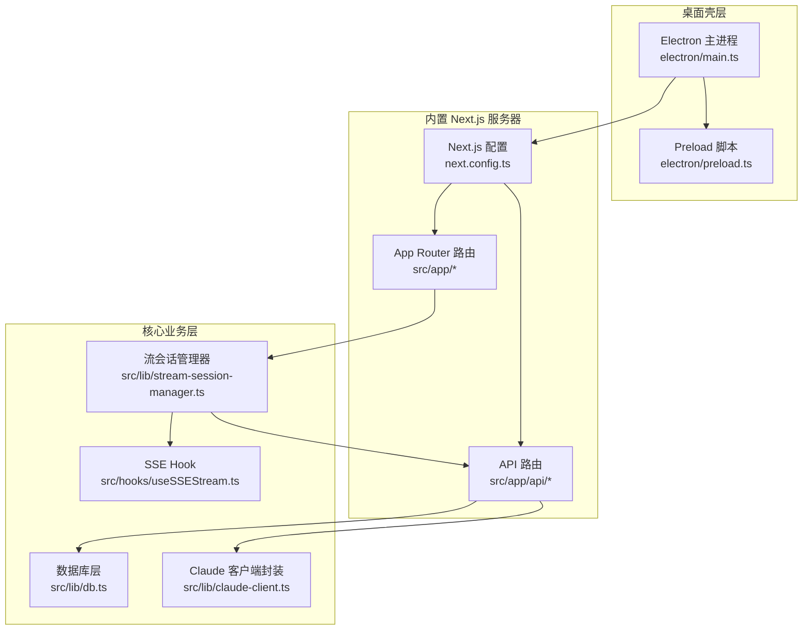
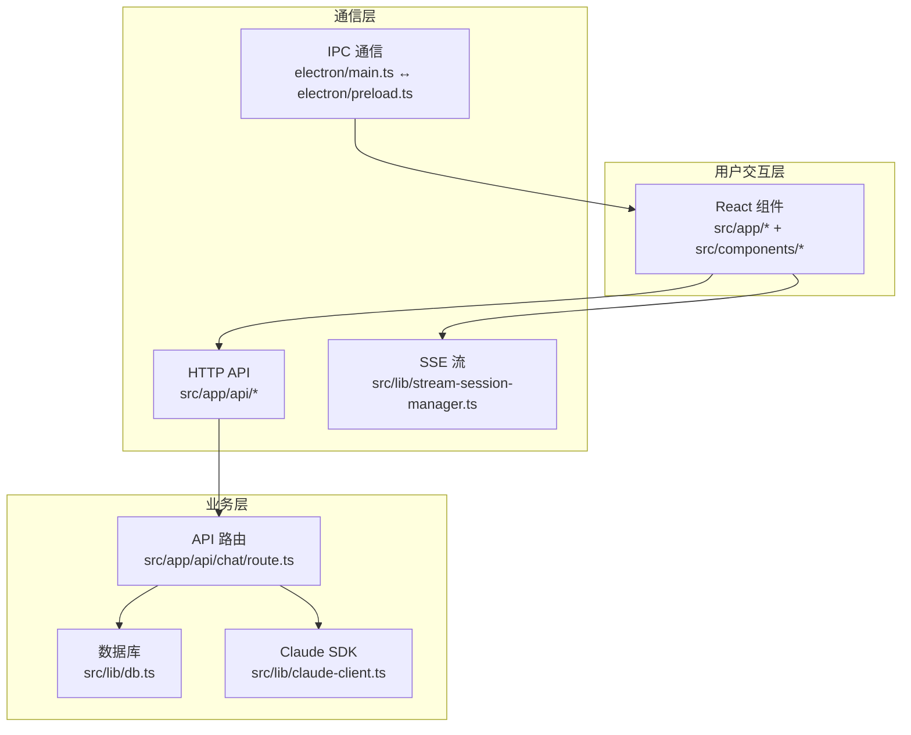
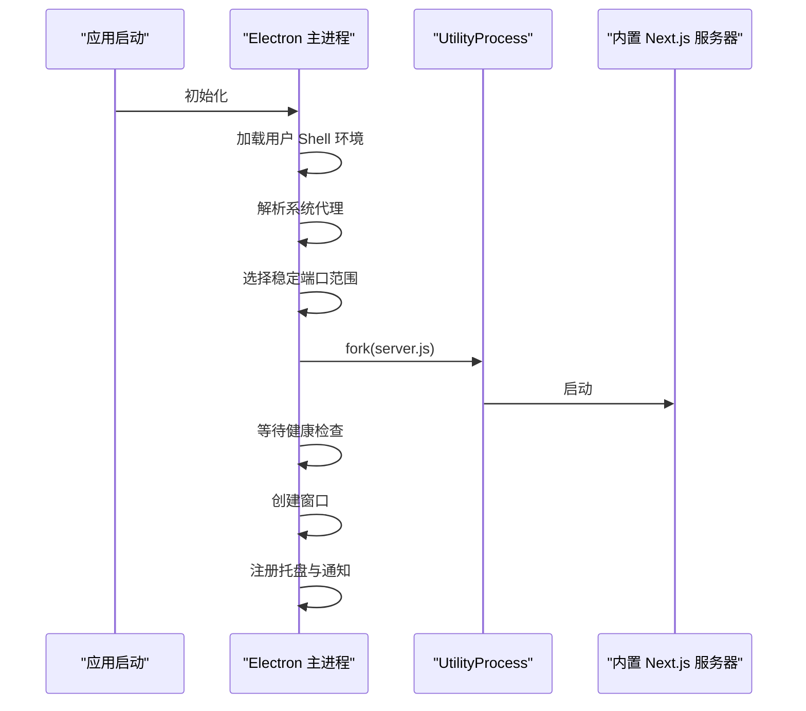
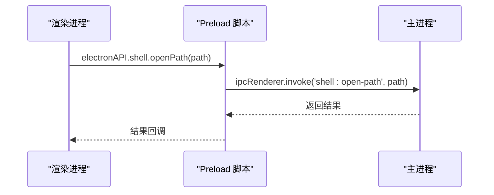
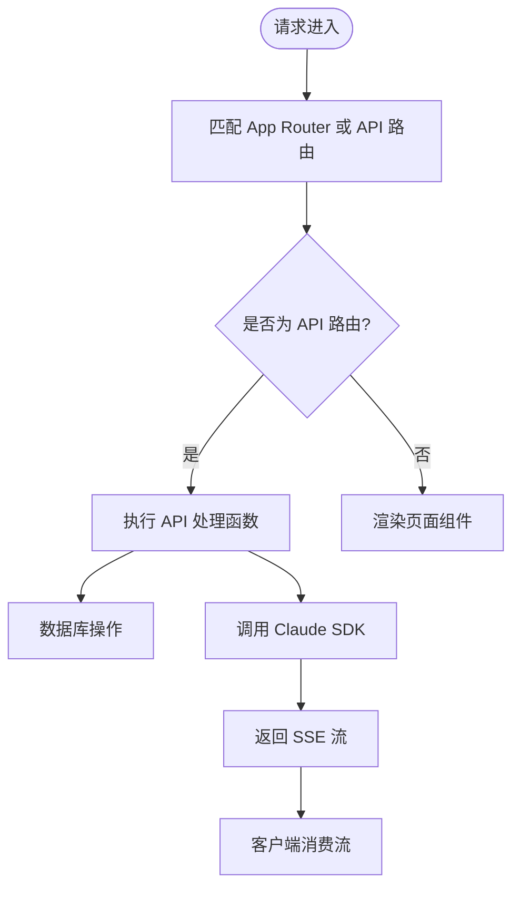
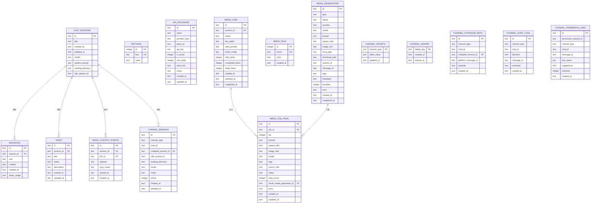
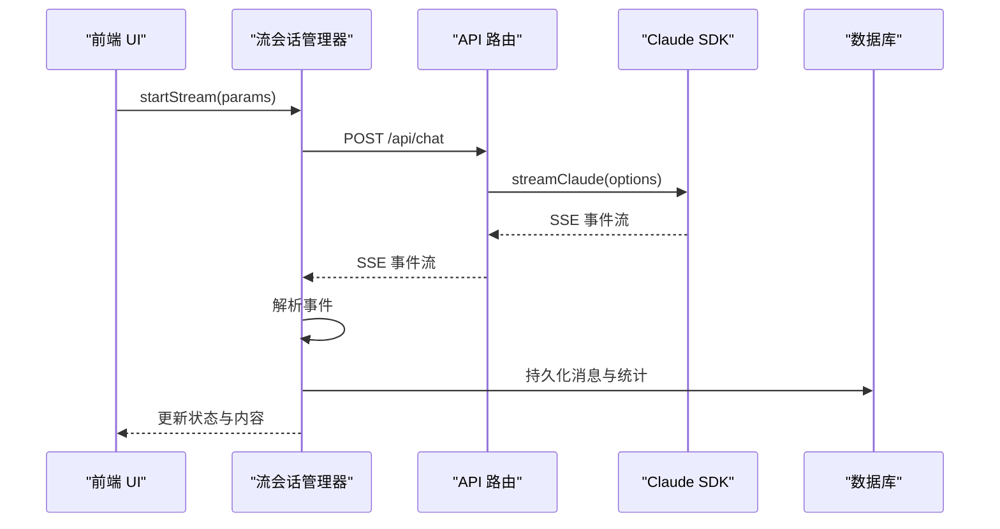
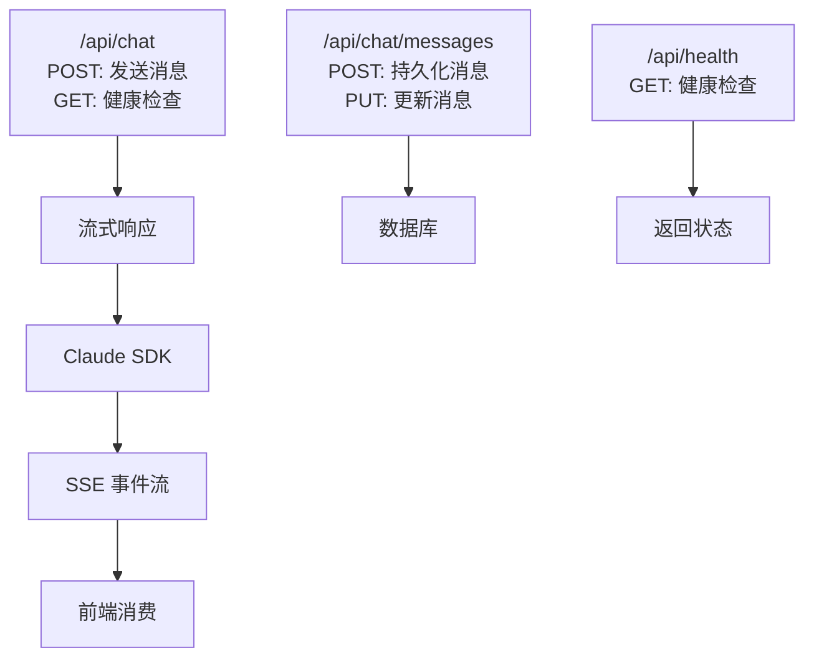
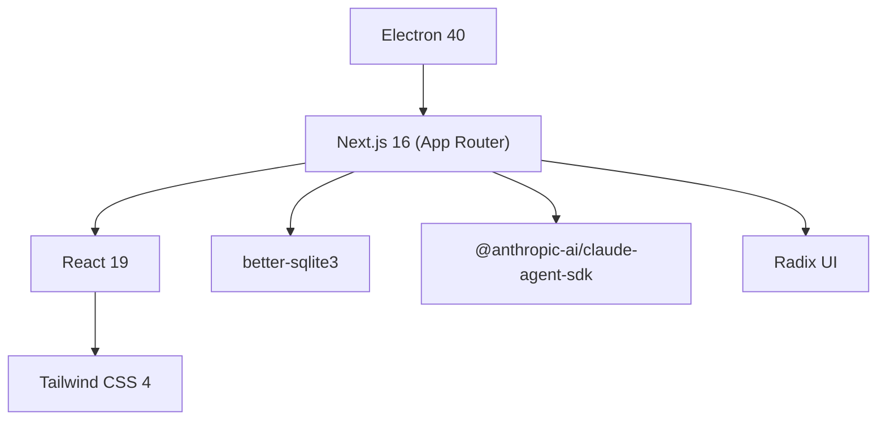

# 整体架构设计

<cite>
**本文档引用的文件**
- [ARCHITECTURE.md](file://ARCHITECTURE.md)
- [main.ts](file://electron/main.ts)
- [preload.ts](file://electron/preload.ts)
- [db.ts](file://src/lib/db.ts)
- [next.config.ts](file://next.config.ts)
- [package.json](file://package.json)
- [claude-client.ts](file://src/lib/claude-client.ts)
- [stream-session-manager.ts](file://src/lib/stream-session-manager.ts)
- [useSSEStream.ts](file://src/hooks/useSSEStream.ts)
- [chat/route.ts](file://src/app/api/chat/route.ts)
- [chat/messages/route.ts](file://src/app/api/chat/messages/route.ts)
- [health/route.ts](file://src/app/api/health/route.ts)
</cite>

## 目录
1. [简介](#简介)
2. [项目结构](#项目结构)
3. [核心组件](#核心组件)
4. [架构总览](#架构总览)
5. [详细组件分析](#详细组件分析)
6. [依赖关系分析](#依赖关系分析)
7. [性能考虑](#性能考虑)
8. [故障排除指南](#故障排除指南)
9. [结论](#结论)

## 简介
本项目是一个基于 Electron 的桌面客户端，采用“主进程 + 渲染进程 + 内置 Next.js 服务器”的混合架构。前端使用 Next.js App Router + React 19 + Tailwind CSS 4，后端通过内置的 Node.js 服务器提供 REST API 和 SSE 流式响应，数据库采用 better-sqlite3 并启用 WAL 模式进行本地持久化。系统通过 IPC 与主进程通信，并通过 HTTP API 与内置服务交互。

## 项目结构
项目采用多工作区布局，包含桌面壳层（electron）、站点文档应用（apps/site）、以及核心业务应用（src）。核心业务应用中，App Router 路由与 API 路由并存，形成前后端一体化的设计模式。

**图表来源**
- [main.ts:1-800](file://electron/main.ts#L1-800)
- [preload.ts:1-94](file://electron/preload.ts#L1-94)
- [next.config.ts:1-59](file://next.config.ts#L1-59)
- [db.ts:1-800](file://src/lib/db.ts#L1-800)
- [claude-client.ts:1-800](file://src/lib/claude-client.ts#L1-800)
- [stream-session-manager.ts:1-800](file://src/lib/stream-session-manager.ts#L1-800)
- [useSSEStream.ts:1-464](file://src/hooks/useSSEStream.ts#L1-464)

**章节来源**
- [ARCHITECTURE.md:1-183](file://ARCHITECTURE.md#L1-183)
- [next.config.ts:1-59](file://next.config.ts#L1-59)
- [package.json:1-148](file://package.json#L1-148)

## 核心组件
- Electron 主进程：负责窗口管理、系统托盘、通知、子进程管理、端口分配与健康检查、系统代理解析、环境变量注入等。
- Preload 脚本：通过 contextBridge 暴露受限的原生能力给渲染进程，包括文件选择、终端管理、通知、安装向导等。
- 内置 Next.js 服务器：提供 App Router 页面与 API 路由，输出为 standalone，支持 serverExternalPackages 以避免打包原生模块。
- 数据库层：better-sqlite3 + WAL 模式，提供 12 张核心表，支持外键约束与迁移锁，确保并发安全。
- Claude 客户端封装：统一 SDK 调用入口，支持多种传输方式（stdio、sse、http），动态 MCP 服务器注册，权限与工具链管理。
- 流会话管理器：独立于组件生命周期的 SSE 流管理，支持会话切换、空闲超时、GC、权限请求、工具超时重试等。
- SSE Hook：解析 SSE 事件流，将事件映射为 UI 回调，支持节流与错误处理。

**章节来源**
- [main.ts:1-800](file://electron/main.ts#L1-800)
- [preload.ts:1-94](file://electron/preload.ts#L1-94)
- [db.ts:1-800](file://src/lib/db.ts#L1-800)
- [claude-client.ts:1-800](file://src/lib/claude-client.ts#L1-800)
- [stream-session-manager.ts:1-800](file://src/lib/stream-session-manager.ts#L1-800)
- [useSSEStream.ts:1-464](file://src/hooks/useSSEStream.ts#L1-464)

## 架构总览
系统采用“桌面壳层 + 内置服务器 + 业务层”的三层架构。主进程负责系统级能力与子进程生命周期；内置服务器承载前端页面与后端 API；业务层通过数据库与 AI SDK 完成核心功能。

**图表来源**
- [main.ts:1-800](file://electron/main.ts#L1-800)
- [preload.ts:1-94](file://electron/preload.ts#L1-94)
- [chat/route.ts:1-800](file://src/app/api/chat/route.ts#L1-800)
- [db.ts:1-800](file://src/lib/db.ts#L1-800)
- [claude-client.ts:1-800](file://src/lib/claude-client.ts#L1-800)
- [stream-session-manager.ts:1-800](file://src/lib/stream-session-manager.ts#L1-800)

## 详细组件分析

### Electron 主进程架构
主进程负责启动内置的 Next.js 服务器，管理端口分配与健康检查，处理系统托盘与后台通知，解析系统代理，加载用户 shell 环境，校验原生模块 ABI 兼容性，并通过 UtilityProcess 运行服务器进程。

**图表来源**
- [main.ts:560-720](file://electron/main.ts#L560-720)

**章节来源**
- [main.ts:1-800](file://electron/main.ts#L1-800)

### Preload 与 IPC 通信
Preload 通过 contextBridge 暴露受限 API，渲染进程通过 ipcRenderer.invoke/send 与主进程通信，实现文件路径解析、终端管理、通知展示等功能。

**图表来源**
- [preload.ts:1-94](file://electron/preload.ts#L1-94)

**章节来源**
- [preload.ts:1-94](file://electron/preload.ts#L1-94)

### Next.js App Router 与 API 路由
Next.js 采用 App Router，页面与 API 路由并存。API 路由通过 serverExternalPackages 避免打包原生模块，输出为 standalone，便于 Electron 打包。

**图表来源**
- [next.config.ts:1-59](file://next.config.ts#L1-59)
- [chat/route.ts:1-800](file://src/app/api/chat/route.ts#L1-800)

**章节来源**
- [next.config.ts:1-59](file://next.config.ts#L1-59)
- [package.json:1-148](file://package.json#L1-148)

### 数据库层设计（better-sqlite3 + WAL）
数据库采用 better-sqlite3，启用 WAL 模式与外键约束，提供 12 张核心表，支持迁移锁与并发安全。初始化时自动迁移旧版本数据库文件。

**图表来源**
- [db.ts:98-320](file://src/lib/db.ts#L98-320)

**章节来源**
- [db.ts:1-800](file://src/lib/db.ts#L1-800)

### Claude 客户端封装与流式处理
Claude 客户端封装统一了 SDK 调用，支持多种传输方式与 MCP 服务器动态注册，结合流会话管理器与 SSE Hook 实现完整的流式交互体验。

**图表来源**
- [stream-session-manager.ts:187-697](file://src/lib/stream-session-manager.ts#L187-697)
- [chat/route.ts:27-630](file://src/app/api/chat/route.ts#L27-630)
- [claude-client.ts:433-505](file://src/lib/claude-client.ts#L433-505)

**章节来源**
- [claude-client.ts:1-800](file://src/lib/claude-client.ts#L1-800)
- [stream-session-manager.ts:1-800](file://src/lib/stream-session-manager.ts#L1-800)
- [useSSEStream.ts:1-464](file://src/hooks/useSSEStream.ts#L1-464)

### API 路由与端点设计
系统提供 52 个 REST 端点，覆盖聊天、媒体、文件、插件、设置、任务等多个领域。聊天相关端点支持消息持久化、中断、模式切换、模型选择等。

**图表来源**
- [chat/route.ts:1-800](file://src/app/api/chat/route.ts#L1-800)
- [chat/messages/route.ts:1-99](file://src/app/api/chat/messages/route.ts#L1-99)
- [health/route.ts:1-6](file://src/app/api/health/route.ts#L1-6)

**章节来源**
- [chat/route.ts:1-800](file://src/app/api/chat/route.ts#L1-800)
- [chat/messages/route.ts:1-99](file://src/app/api/chat/messages/route.ts#L1-99)
- [health/route.ts:1-6](file://src/app/api/health/route.ts#L1-6)

## 依赖关系分析
系统的关键依赖包括 Electron、Next.js、better-sqlite3、Claude Agent SDK 等。构建配置通过 serverExternalPackages 与 outputFileTracingExcludes 优化打包体积与兼容性。

**图表来源**
- [package.json:1-148](file://package.json#L1-148)
- [next.config.ts:1-59](file://next.config.ts#L1-59)

**章节来源**
- [package.json:1-148](file://package.json#L1-148)
- [next.config.ts:1-59](file://next.config.ts#L1-59)

## 性能考虑
- 端口稳定性：主进程使用稳定端口范围（47823–47830）保证 localStorage 原点一致性，避免每次重启丢失 UI 状态。
- 原生模块兼容性：在打包后检查 better-sqlite3 的 ABI 兼容性，防止因 Node.js 版本不匹配导致崩溃。
- SSE 流节流：前端对文本更新进行节流，减少频繁重渲染；流会话管理器对工具输出进行截断，避免内存膨胀。
- 数据库 WAL：启用 WAL 模式提升并发写入性能，配合外键约束保证数据一致性。
- 构建优化：serverExternalPackages 排除原生模块与动态加载库，outputFileTracingExcludes 减少非必要文件追踪。

**章节来源**
- [main.ts:525-617](file://electron/main.ts#L525-617)
- [stream-session-manager.ts:262-289](file://src/lib/stream-session-manager.ts#L262-289)
- [db.ts:89-96](file://src/lib/db.ts#L89-96)
- [next.config.ts:1-59](file://next.config.ts#L1-59)

## 故障排除指南
- 启动失败：检查主进程健康检查与端口占用情况，确认内置服务器成功启动。
- ABI 不匹配：若出现 better-sqlite3 加载错误，需重新为 Electron 编译原生模块。
- SSE 断流：检查流会话管理器的空闲超时与手动停止逻辑，必要时触发工具超时重试。
- 数据库迁移：迁移锁机制避免多个构建进程同时迁移，若卡住可清理 .migration-lock 文件。

**章节来源**
- [main.ts:619-660](file://electron/main.ts#L619-660)
- [db.ts:16-50](file://src/lib/db.ts#L16-50)
- [stream-session-manager.ts:583-696](file://src/lib/stream-session-manager.ts#L583-696)

## 结论
该架构通过 Electron 主进程与内置 Next.js 服务器的协同，实现了桌面应用与 Web 服务的一体化部署。前端采用 React 19 + Tailwind CSS 4，后端提供 52 个 REST 端点，数据库使用 better-sqlite3 WAL 模式，确保高性能与可靠性。通过 IPC、HTTP API 与 SSE 的组合通信机制，系统在功能完整性与用户体验之间取得了良好平衡。