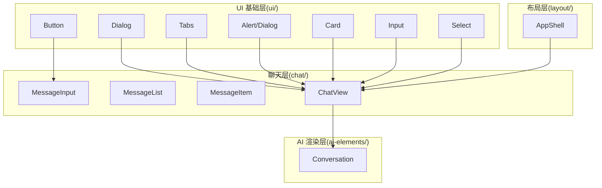
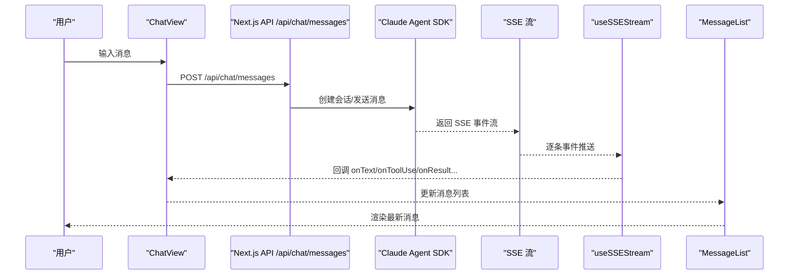
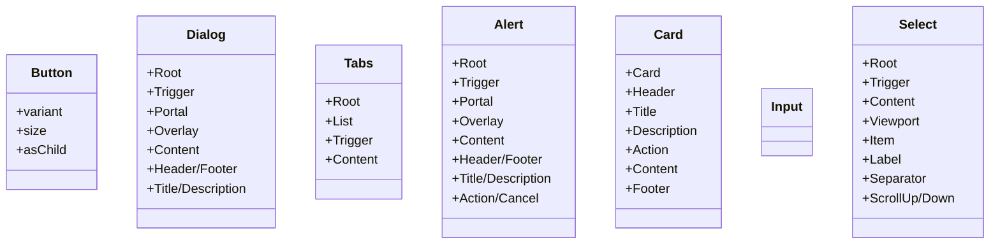
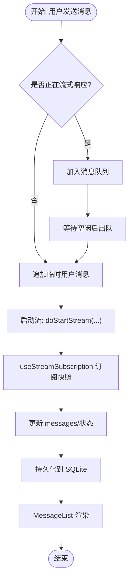
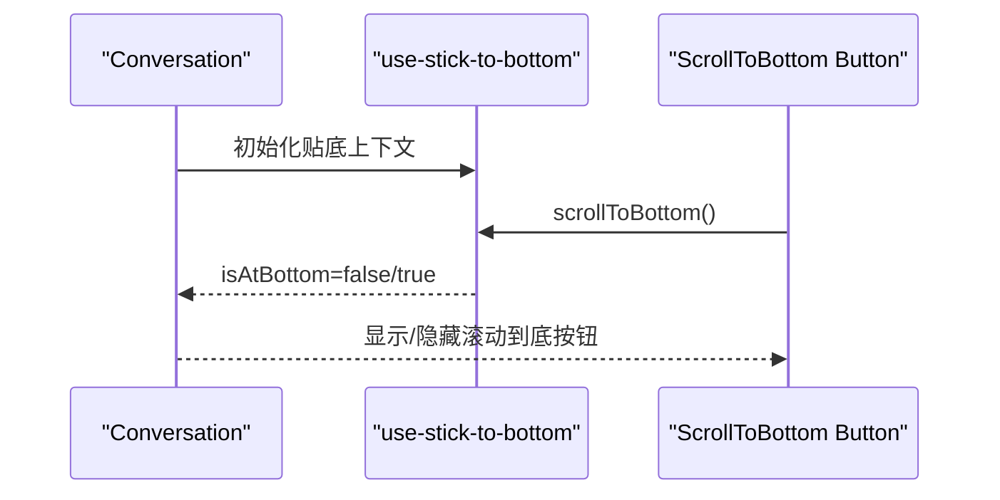
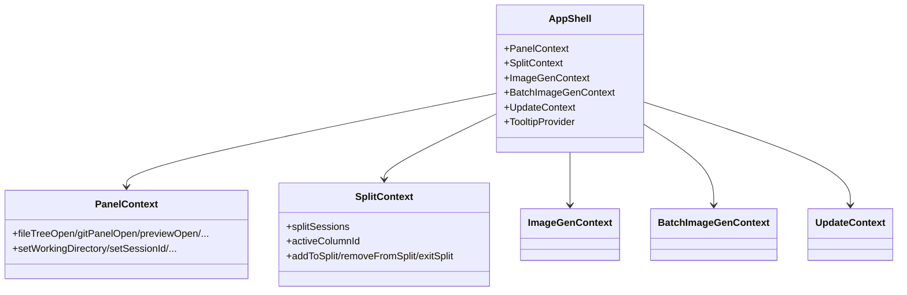
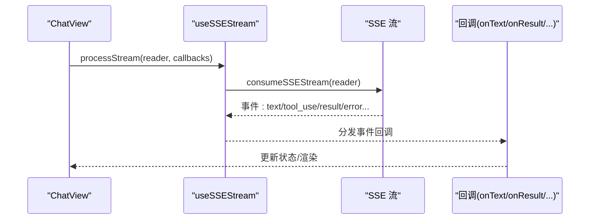
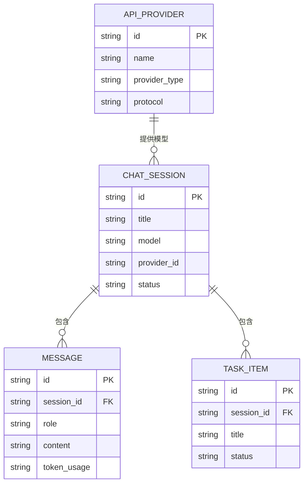
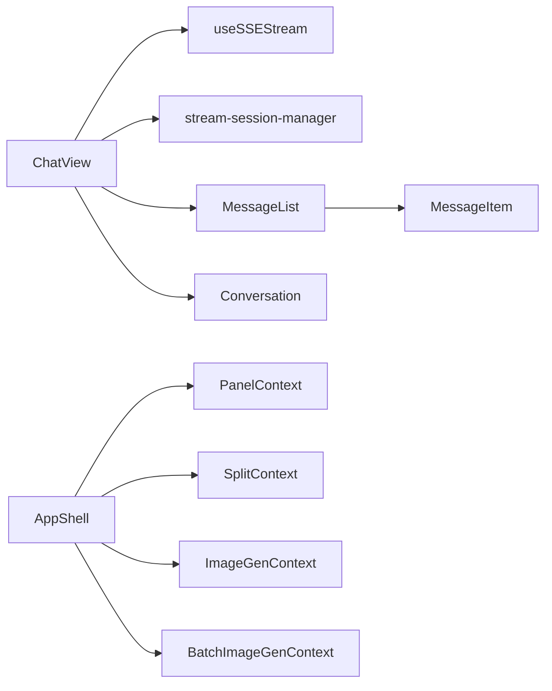

# 组件架构

<cite>
**本文引用的文件**
- [ARCHITECTURE.md](file://ARCHITECTURE.md)
- [button.tsx](file://src/components/ui/button.tsx)
- [dialog.tsx](file://src/components/ui/dialog.tsx)
- [tabs.tsx](file://src/components/ui/tabs.tsx)
- [alert-dialog.tsx](file://src/components/ui/alert-dialog.tsx)
- [card.tsx](file://src/components/ui/card.tsx)
- [input.tsx](file://src/components/ui/input.tsx)
- [select.tsx](file://src/components/ui/select.tsx)
- [useSSEStream.ts](file://src/hooks/useSSEStream.ts)
- [useImageGen.ts](file://src/hooks/useImageGen.ts)
- [useTranslation.ts](file://src/hooks/useTranslation.ts)
- [index.ts](file://src/types/index.ts)
- [ChatView.tsx](file://src/components/chat/ChatView.tsx)
- [conversation.tsx](file://src/components/ai-elements/conversation.tsx)
- [AppShell.tsx](file://src/components/layout/AppShell.tsx)
</cite>

## 目录
1. [简介](#简介)
2. [项目结构](#项目结构)
3. [核心组件](#核心组件)
4. [架构总览](#架构总览)
5. [详细组件分析](#详细组件分析)
6. [依赖关系分析](#依赖关系分析)
7. [性能考量](#性能考量)
8. [故障排查指南](#故障排查指南)
9. [结论](#结论)
10. [附录](#附录)

## 简介
本文件面向 CodePilot 的 React 组件体系，系统阐述分层设计与通信模式，覆盖基础 UI 组件（ui/）、聊天界面（chat/）、AI 响应渲染（ai-elements/）、布局（layout/）等模块；并结合 Hook 使用模式（useSSEStream、useImageGen、useTranslation）与 TypeScript 类型系统，给出可复用策略、性能优化与可维护性设计原则。

## 项目结构
- 组件按功能域分目录组织：
  - ui/：基于 Radix UI 的基础组件（Button、Dialog、Tabs、Alert、Card、Input、Select 等）
  - chat/：聊天界面相关（MessageList、MessageItem、MessageInput、ChatView 等）
  - ai-elements/：AI 响应渲染元素（artifact、reasoning、tool、task、code-block 等）
  - layout/：应用壳与布局（AppShell、PanelZone、SplitChatContainer、UnifiedTopBar 等）
- Hooks 位于 hooks/，封装状态与副作用（useSSEStream、useImageGen、useTranslation 等）
- 类型系统集中在 types/index.ts，统一业务与 SSE 事件类型

图表来源
- [button.tsx](file://src/components/ui/button.tsx)
- [dialog.tsx](file://src/components/ui/dialog.tsx)
- [tabs.tsx](file://src/components/ui/tabs.tsx)
- [alert-dialog.tsx](file://src/components/ui/alert-dialog.tsx)
- [card.tsx](file://src/components/ui/card.tsx)
- [input.tsx](file://src/components/ui/input.tsx)
- [select.tsx](file://src/components/ui/select.tsx)
- [ChatView.tsx](file://src/components/chat/ChatView.tsx)
- [conversation.tsx](file://src/components/ai-elements/conversation.tsx)
- [AppShell.tsx](file://src/components/layout/AppShell.tsx)

章节来源
- [ARCHITECTURE.md](file://ARCHITECTURE.md)

## 核心组件
- 基础 UI 组件（ui/）
  - Button：支持变体与尺寸，Slot Root 支持 asChild，统一样式与可访问性
  - Dialog/Tabs/Alert/Card/Input/Select：均采用 Radix Primitive 包裹，提供语义化 data-slot 与一致的变体/尺寸/状态映射
- 聊天组件（chat/）
  - ChatView：会话级容器，负责消息队列、流订阅、权限请求、模式切换、上下文压缩、终端动作等
  - MessageList/MessageItem：消息列表与单项渲染
  - MessageInput：输入与附件处理
- AI 渲染组件（ai-elements/）
  - Conversation：对话容器、滚动锚定、空态、下载等
- 布局组件（layout/）
  - AppShell：侧栏、顶部栏、面板区、分割屏、更新提示、全局搜索、设置向导等

章节来源
- [button.tsx](file://src/components/ui/button.tsx)
- [dialog.tsx](file://src/components/ui/dialog.tsx)
- [tabs.tsx](file://src/components/ui/tabs.tsx)
- [alert-dialog.tsx](file://src/components/ui/alert-dialog.tsx)
- [card.tsx](file://src/components/ui/card.tsx)
- [input.tsx](file://src/components/ui/input.tsx)
- [select.tsx](file://src/components/ui/select.tsx)
- [ChatView.tsx](file://src/components/chat/ChatView.tsx)
- [conversation.tsx](file://src/components/ai-elements/conversation.tsx)
- [AppShell.tsx](file://src/components/layout/AppShell.tsx)

## 架构总览
- 数据流（聊天消息）：用户输入 → ChatView → API /api/chat/messages → Claude Agent SDK SSE 流 → stream-session-manager → useSSEStream Hook → ChatView 状态更新 → MessageList 渲染 → SQLite 持久化
- 布局与上下文：AppShell 提供 SplitContext、PanelContext、ImageGenContext、BatchImageGenContext 等，贯穿聊天与多面板场景
- 国际化：useTranslation 从 I18nProvider 获取翻译上下文

图表来源
- [ChatView.tsx](file://src/components/chat/ChatView.tsx)
- [useSSEStream.ts](file://src/hooks/useSSEStream.ts)
- [ARCHITECTURE.md](file://ARCHITECTURE.md)

## 详细组件分析

### 基础 UI 组件（ui/）
- 设计要点
  - 以 Radix UI 为基础，包裹原生元素，提供 data-slot 便于测试与主题系统
  - 通过 class-variance-authority 实现变体与尺寸的组合式样式
  - 统一禁用态、焦点态、错误态的视觉反馈
- 复用策略
  - 以变体/尺寸/状态属性驱动，避免重复造轮子
  - 通过 asChild 支持语义化标签（如 Button 作为 Link）

图表来源
- [button.tsx](file://src/components/ui/button.tsx)
- [dialog.tsx](file://src/components/ui/dialog.tsx)
- [tabs.tsx](file://src/components/ui/tabs.tsx)
- [alert-dialog.tsx](file://src/components/ui/alert-dialog.tsx)
- [card.tsx](file://src/components/ui/card.tsx)
- [input.tsx](file://src/components/ui/input.tsx)
- [select.tsx](file://src/components/ui/select.tsx)

章节来源
- [button.tsx](file://src/components/ui/button.tsx)
- [dialog.tsx](file://src/components/ui/dialog.tsx)
- [tabs.tsx](file://src/components/ui/tabs.tsx)
- [alert-dialog.tsx](file://src/components/ui/alert-dialog.tsx)
- [card.tsx](file://src/components/ui/card.tsx)
- [input.tsx](file://src/components/ui/input.tsx)
- [select.tsx](file://src/components/ui/select.tsx)

### 聊天组件（chat/）
- ChatView
  - 负责消息上限裁剪、历史加载、流订阅、权限请求、模式切换、上下文压缩、终端动作、消息队列与重试
  - 通过 useStreamSubscription 订阅 stream-session-manager 的会话快照，驱动渲染
  - 通过 doStartStream 调起 SSE 流，并将回调注入 useSSEStream
- MessageList/MessageItem
  - MessageList 负责虚拟滚动与分页加载
  - MessageItem 渲染文本、工具调用、代码块、媒体等
- MessageInput
  - 处理文件附件、提及（mentions）、显示覆盖、系统提示追加等

图表来源
- [ChatView.tsx](file://src/components/chat/ChatView.tsx)

章节来源
- [ChatView.tsx](file://src/components/chat/ChatView.tsx)

### AI 渲染组件（ai-elements/）
- Conversation
  - 对话容器与内容区域，提供“贴底”滚动、空态、滚动到底按钮、对话下载为 Markdown 等能力
  - 通过 use-stick-to-bottom 实现智能贴底

图表来源
- [conversation.tsx](file://src/components/ai-elements/conversation.tsx)

章节来源
- [conversation.tsx](file://src/components/ai-elements/conversation.tsx)

### 布局组件（layout/）
- AppShell
  - 提供侧栏、顶部栏、面板区、分割屏、更新提示、全局搜索、设置向导等
  - 通过多个 Context Provider（Split、Panel、ImageGen、BatchImageGen、Update、Tooltip）集中管理跨组件状态
  - 监听流会话事件，动态展示“正在流式”与“待审批”状态

图表来源
- [AppShell.tsx](file://src/components/layout/AppShell.tsx)

章节来源
- [AppShell.tsx](file://src/components/layout/AppShell.tsx)

### Hook 使用模式
- useSSEStream
  - 将 SSE 事件流解析为结构化回调（onText、onToolUse、onResult、onError 等），并提供稳定的 consumeSSEStream
  - 通过 ref 包装回调，避免闭包捕获旧回调
- useImageGen
  - 提供图片生成状态与生成方法，支持中止上一次请求、上传参考图、返回结果
  - 通过 AbortController 管理并发与取消
- useTranslation
  - 从 I18nProvider 获取翻译上下文，简化国际化使用

图表来源
- [useSSEStream.ts](file://src/hooks/useSSEStream.ts)
- [ChatView.tsx](file://src/components/chat/ChatView.tsx)

章节来源
- [useSSEStream.ts](file://src/hooks/useSSEStream.ts)
- [useImageGen.ts](file://src/hooks/useImageGen.ts)
- [useTranslation.ts](file://src/hooks/useTranslation.ts)

### TypeScript 类型系统
- 业务类型
  - ChatSession、Message、TaskItem、ApiProvider、TokenUsage、ProviderModelGroup 等
  - MessageContentBlock、MediaBlock、MentionRef 等结构化内容类型
- SSE 事件类型
  - SSEEvent、SSEEventType、ToolUseInfo、ToolResultInfo、PermissionRequestEvent、RateLimitInfo、ContextUsageSnapshot 等
- 国际化与通用类型
  - I18n 上下文类型、IconComponent、PopoverItem、CommandBadge、CliBadge 等

图表来源
- [index.ts](file://src/types/index.ts)

章节来源
- [index.ts](file://src/types/index.ts)

## 依赖关系分析
- 组件耦合
  - ChatView 依赖 useSSEStream、useStreamSubscription、stream-session-manager，形成“视图-流-状态”的强关联
  - AppShell 通过多个 Context Provider 为子树提供共享状态，降低跨组件传参复杂度
- 外部依赖
  - Radix UI（可访问性与状态管理）
  - class-variance-authority（样式变体）
  - use-stick-to-bottom（对话贴底）
- 可能的循环依赖
  - 当前结构以 hooks 与 layout 为中心向外辐射，未见明显循环导入

图表来源
- [ChatView.tsx](file://src/components/chat/ChatView.tsx)
- [AppShell.tsx](file://src/components/layout/AppShell.tsx)
- [useSSEStream.ts](file://src/hooks/useSSEStream.ts)

章节来源
- [ChatView.tsx](file://src/components/chat/ChatView.tsx)
- [AppShell.tsx](file://src/components/layout/AppShell.tsx)
- [useSSEStream.ts](file://src/hooks/useSSEStream.ts)

## 性能考量
- 消息上限与分页
  - ChatView 对消息进行上限裁剪与分页加载，避免一次性渲染过多节点
- 流式渲染
  - useSSEStream 逐条事件回调，减少重排与大对象合并
- 变体与尺寸
  - 通过 class-variance-authority 生成最小必要样式，避免运行时计算
- 上下文与 Provider
  - 将高频状态下沉至 Context，减少 props 逐层传递
- 取消与中止
  - useImageGen 使用 AbortController，及时释放网络资源

## 故障排查指南
- SSE 流异常
  - 检查事件解析分支与错误兜底（error 事件的结构化解析与回退）
  - 关注 rate_limit/context_usage/status 等特殊事件的处理
- 权限请求
  - ChatView 中 handlePermissionResponse 用于响应权限决策，确认 SDK 返回与 UI 状态一致
- 终端动作与上下文压缩
  - compress_and_retry/enable_1m_and_retry 等动作需注意“武装期”与超时清理，避免竞态
- 国际化
  - useTranslation 依赖 I18nProvider，确保在正确的上下文中使用

章节来源
- [useSSEStream.ts](file://src/hooks/useSSEStream.ts)
- [ChatView.tsx](file://src/components/chat/ChatView.tsx)
- [useTranslation.ts](file://src/hooks/useTranslation.ts)

## 结论
CodePilot 的组件架构以“布局-聊天-渲染-基础 UI”四层清晰分层，配合 Hooks 与 Context 实现状态解耦与跨组件共享；TypeScript 类型系统贯穿业务与流事件，保障扩展与维护性。通过合理的消息上限、流式渲染与取消机制，系统在复杂交互下仍保持良好性能与稳定性。

## 附录
- 新功能接入指引（摘自架构文档）
  - 类型定义：src/types/index.ts
  - 数据库：src/lib/db.ts
  - API 路由：src/app/api/{功能名}/route.ts
  - 页面：src/app/{功能名}/page.tsx
  - 组件：src/components/{功能名}/
  - Hook：src/hooks/use{功能名}.ts
  - 国际化：src/i18n/en.ts + zh.ts
  - Bridge：src/lib/bridge/adapters/ + types.ts

章节来源
- [ARCHITECTURE.md](file://ARCHITECTURE.md)